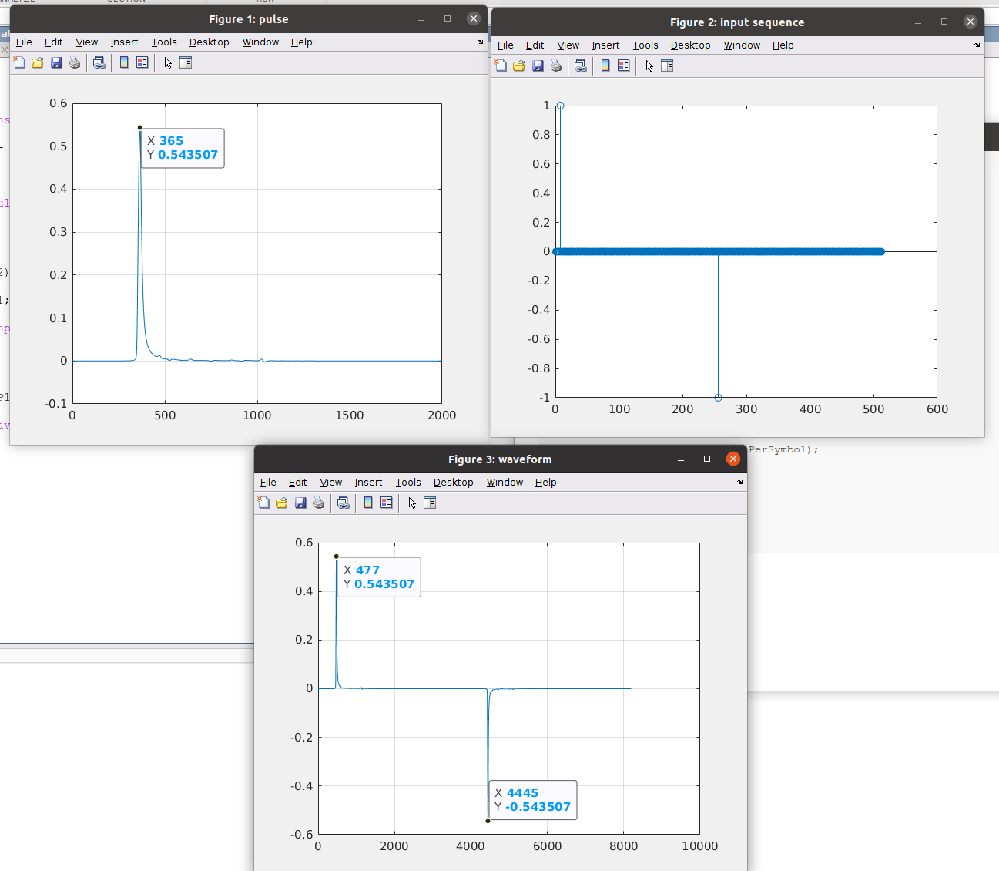

## impulse2pulse

> serdes/impulse2pulse.m

```matlab
function P = impulse2pulse(I, N, dt)

impulseSize = size(I);

%Convert to Pulse by shifting and adding
P = zeros(impulseSize,'like',I);

for indx=1:N
    P = P + circshift(I, indx,1);
end

P = P*dt;  % `dt` is the width of area
```

$$
P_k = \Delta t \times \sum_j I_j
$$


## impulse2step

> serdes/impulse2step.m

```matlab
function S = impulse2step(I,dt)

[nr,nn] = size(I);

S = zeros(nr,nn,'like',I);
for indx=2:nr
    S(indx,:) = S(indx-1,:) + I(indx-1,:)*dt;
end
```

$$
S_k = S_{k-1} + I_{k-1}\times \Delta t
$$


## step2impulse

> serdes/step2impulse.m

```matlab
function I = step2impulse(S,dt)

I = diff(S)/dt;
```

$$
I_k = \frac{S_{k+1}- S_{k}}{\Delta t}
$$


## pulse2impulse

> serdes/pulse2impulse.m

```matlab
function I = pulse2impulse(P, N, dt )

%   The algorithm computes the step response from the pulse response and
%   then take the derivative to get the impulse response. The derivative
%   calculation has zero delay and is reasonably accurate up to one half
%   the Nyquist rate but then diverges rapidly back to zero at the Nyquist
%   rate.

%Size input waveform
[nr,nc] = size(P);

%Remove DC component of waveform
dcValues = P(1,:);
P = P - repmat(dcValues,nr,1);

% Convert to step response. No circshift here
step = zeros( nr, nc,'like',P );
for jj = 1:nc
    for indx = 1:N:nr
        step(indx:nr,jj) = step(indx:nr,jj) + P(1:nr-indx+1,jj);
    end
end

% Take the derivative
a1 = 0.59;
a3 = -0.03;
stepExt = zeros( nr+6, nc, 'like',P );
I = coder.nullcopy(P);
for jj = 1:nc    
    stepExt(1:3,jj) = step(1,jj);
    stepExt(4:nr+3,jj) = step(:,jj);
    stepExt(nr+4:nr+6,jj) = step(nr,jj);
    I(:,jj) = (a1*(stepExt(5:nr+4,jj) - stepExt(3:nr+2,jj)) + ...
        a3*(stepExt(7:nr+6,jj) - stepExt(1:nr,jj))) / dt;
end

```


## pulse2wave

> serdes/pulse2wave.m
>
> %   The algorithms utilizes circular convolution to project the pulse
>
> %   response onto the data pattern.


```matlab
close all;
clear all;
clc;

load('PulseResponseReflective100ps.mat');

P1 = pulse(:,1) - pulse(1,1);
P1 = P1(1:2000);
% P1 = P1 + 0.2;  % dc offset

figure('Name','pulse')
plot(P1)
grid on;

order = 10;
data =zeros(1,512);
data(1, 8) = 1;
data(1, 256) = -1;

figure('Name','input sequence');
stem(data);


W1 = pulse2wave(P1,data,SamplesPerSymbol); 

figure('Name','waveform')
plot(W1)
grid on;

```




## pulse2pda

> B. K. Casper, M. Haycock and R. Mooney, "An accurate and efficient analysis method for multi-Gb/s chip-to-chip signaling schemes," 2002 Symposium on VLSI Circuits. Digest of Technical Papers (Cat. No.02CH37302), Honolulu, HI, USA, 2002, pp. 54-57, doi: 10.1109/VLSIC.2002.1015043.
>
> Chang, Wei-Ju and Ruey-Beei Wu. “Eye diagram estimation and equalizer design method for PAM4.” *2018 IEEE 22nd Workshop on Signal and Power Integrity (SPI)* (2018): 1-4.

