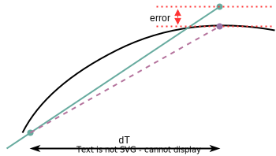

## Single-Pole Filter & Complex Conjugate Pole pair

> Single-Pole Filter and Complex Conjugate Pole pair in Event-Driven PWL model


**Real number modeling** of analog circuits in hardware description languages (HDLs) has become more common as a part of mixed-signal SoC validation. **Piecewise linear (PWL)** waveform approximation represent analog signals and **dynamically schedule the events** for approximating the signal waveform to PWL segments with a well controlled error bound.


Definition of a piecewise liner (PWL) waveform using struct in Systemverilog

```verilog
typedef struct {
    real y; // signal offset
    real slope; // signal slope
    real t0;	// time offset
} pwl; // pwl datatype
```

### When to update piecewise model

1. model parameter update once new input come in
2. error is greater than user-define tolerance $e_{tol}$, trigger by $\Delta T$




### Dynamic Time Step Control

When approximating a function $y(t)$ to a **piecewise linear segment** for the interval $t_0 \le t_0 + \Delta t$, the approximation error $err$ is bounded by
$$
\left| err \right| \le \frac{1}{8}\cdot \Delta t^2 \cdot \max(\left| \ddot{y(t)} \right|)
$$
Using Rolle's theorem for the interval $t_0 \le t_0 + \Delta t$, the needed time step $\Delta t$ is givend by
$$
\Delta t(t=t_0) = \sqrt{\frac{8\cdot e_{tol}}{\max(\left| \ddot{y(t)} \right|)}}
$$

### Single-Pole Filter Model

The **ramp** input $X(s)$, the single pole system Laplace s-domain $H(s)$ and the output response $Y(s)$,
$$\begin{align}
X(s) &= \frac{a}{s} +\frac{b}{s^2} \\
H(s) &= \frac{Y(s)}{X(s)} = \frac{1}{1+\frac{s}{\omega_{1}}} \\
Y(s) &= X(s) \cdot H(s)
\end{align}$$

Time domain of ramp input shown as below
$$
x(t) = a +b \cdot t
$$

1. The output transfer function
   $$\begin{align}
   Y(s) &= X(s) \cdot H(s) \\
   &= \frac{\omega_1}{\omega_1+s}\cdot X
   \end{align}$$

$$
Y\omega_1 + sY = \omega_1 X
$$

2. its differential equation

$$
y(t) \cdot \omega_1+\frac{d y(t)}{dt} = \omega_1 \cdot x(t)
$$

3. Laplace transfrom two side of the above equation, $y_0$ is initial conditon of output, $x_0=0$

$$
Y\omega_1 + sY-y_0 = \omega_1 \cdot X
$$

Solving $Y(s)$
$$\begin{align}
Y &= \frac{y_0}{\omega_1+s}+\frac{\omega_1}{\omega_1+s}\cdot X \\
&= \frac{y_0}{\omega_1+s}+\frac{\omega_1}{\omega_1+s}\cdot (\frac{a}{s}+\frac{b}{s^2}) \\
&= \frac{y_0}{\omega_1+s}+\frac{\omega_1}{\omega_1+s}\cdot \frac{a}{s}+\frac{\omega_1}{\omega_1+s}\cdot\frac{b}{s^2}
\end{align}$$

4. inverse Laplace transform

$$
y(t) = y_0e^{-\omega_1t}+(a-a\cdot e^{-\omega_1t})+(b\cdot t-\frac{b}{\omega_1}+\frac{b}{\omega_1}\cdot e^{-\omega_1 t})
$$

> step-1 transfer function in Laplace s-domain, which **don't** initial conditon and is only steady response.
>
> step-2 differential equation
>
> step-3 Laplace transform of $Y(s)$, (the initial conditon of input $X(s)$ is zero, that of $Y(s)$ is explicit)
>
> step-4 inverse Laplace transform, with the help of Laplace transform table or matlab `syms` and `ilaplace` function

$y(t)$ has a continuous second derivative $\ddot{y(t)}$
$$
\ddot{y(t)} =(-a+\frac{b}{\omega_1}+y_0)\cdot \omega_1^2\cdot e^{-\omega_1t}
$$
It's obvious $\left| \ddot{y(t)} \right|$ is a decaying function and thus the maximum value is $\left| \ddot{y(t_0)} \right|$ for the interval $t_0 \le t_0 + \Delta t$.
The time step $\Delta t$ for the error tolerance $e_{tol}$:
$$
\Delta t(t=t_0) = \sqrt{\frac{8\cdot e_{tol}}{\left| \ddot{y(t_0)} \right|}}
$$

### Complex Conjugate Pole pair

$$
H(s) = \frac{r}{s+\omega_p} + \frac{r^*}{s+\omega_p^*}
$$

where $\omega_p$ and $r$ are complex numbers, $r=r_r+jr_i$, $\omega_p=\omega_{pr}+j\omega_{pi}$

Follow the procedure as above single pole
$$
\frac{Y(s)}{X(s)} = \frac{s\cdot r_{cs}+e}{s^2+s\cdot \omega_{p\_cs}+f}
$$
where $r_{cs}=r+r^*$, $\omega_{p\_cs}=\omega_p+\omega_p^*$ and $e=r\omega_p^*+r^*\omega_p$, $f=\omega_p\omega_p^*$
implies
$$
s^2Y(s)+s\omega_{p\_cs}Y(s)+fY(s)=(s\cdot r_{cs}+e)X(s)
$$
or a differential equation
$$
\frac{d^2y(t)}{dt^2}+\omega_{p\_cs}\frac{dy(t)}{dt}+fy(t)=r_{cs}\frac{dx(t)}{dt}+e\cdot x(t)
$$
Taking Laplace transform with initial conditions $y_0$, $\dot{y_0}$ and $x_0=0$,
$$
s^2-sy_0-\dot{y_0}+\omega_{p\_cs}(sY(s)-y_0)+f\cdot y(t) = r_{cs}\cdot (sX(s)-0)+e\cdot X(s)
$$
Solving for $Y(s)$
$$
Y(s)=\frac{s\cdot y_0+\dot{y_0}+\omega_{p\_cs}y_0}{s^2+s\cdot{\omega_{p\_cs}}+f}+\frac{s\cdot{r_{cs}}+e}{s^2+s\cdot{\omega_{p\_cs}}+f}X(s)
$$
With an ramp input, height $a$, slope $b$, i.e. $X(s)=\frac{a}{s}+\frac{b}{s^2}$
$$
Y(s)=\frac{s\cdot y_0+\dot{y_0}+\omega_{p\_cs}y_0}{s^2+s\cdot{\omega_{p\_cs}}+f}+\frac{s\cdot{r_{cs}}+e}{s^2+s\cdot{\omega_{p\_cs}}+f}(\frac{a}{s}+\frac{b}{s^2})
$$
After inverse Laplace transform, we can get total response
$$
y(t)=e^{-\omega_{pr}t}\cdot \left[ y_0\cdot \cos(\omega_{pi}t)+\frac{\dot{y_0}+y_0\omega_{pr}}{\omega_{pi}}\sin(\omega_{pi}t)+D\cdot \cos(\omega_{pi}t)+\frac{C-D\cdot{\omega_{pr}}}{\omega_{pi}}\sin(\omega_{pi}t) \right]+B+A\cdot{t}
$$
where
$$\begin{align}
A &= \frac{e\cdot{b}}{f} \\
B &= \frac{r_{cs}\cdot{b}+a\cdot{e}-A\cdot{\omega_{p\_{cs}}}}{f} \\
C &= a\cdot{r_{cs}}-A-B\cdot{\omega_{p\_cs}} \\
D &= -B
\end{align}$$

As a double check, note that at $t=0$,
$$
y(0)=\left[ y_0 + D \right]+B=y_0
$$

To derive derivative, we first assume
$$
y_0\cdot \cos(\omega_{pi}t)+\frac{\dot{y_0}+y_0\omega_{pr}}{\omega_{pi}}\sin(\omega_{pi}t)+D\cdot \cos(\omega_{pi}t)+\frac{C-D\cdot{\omega_{pr}}}{\omega_{pi}}\sin(\omega_{pi}t) = \alpha \cdot{\cos(\omega_{pi}t+\phi)}
$$
The above equation implies
$$\begin{align}
y_0+D &= \alpha\cdot{\cos(\phi)} \\
\frac{\dot{y_0}+y_0\omega_{pr}}{\omega_{pi}}+\frac{C-D\cdot{\omega_{pr}}}{\omega_{pi}} &= -\alpha\cdot{\sin(\phi)}
\end{align}$$
Then
$$
\alpha^2=(y_0+D)^2+\left(\frac{\dot{y_0}+y_0\omega_{pr}}{\omega_{pi}}+\frac{C-D\cdot{\omega_{pr}}}{\omega_{pi}} \right)^2
$$
And $\alpha$ can be used to estimate time step size.
The total response is
$$
y(t)=e^{-\omega_{pr}t}\cdot \alpha \cdot{\cos(\omega_{pi}t+\phi)}+B+A\cdot{t}
$$
It's second derivative is
$$
\ddot{y(t)} = \alpha\left[ (\omega_{pr}^2-\omega_{pi}^2)e^{-\omega_{pr}t}\cos(\omega_{pi}t+\phi)+2\cdot \omega_{pr}\omega_{pi}e^{-\omega_{pr}t}\sin(\omega_{pi}t+\phi) \right]
$$
Absolute value
$$
\left| \ddot{y(t)} \right| = \left| \alpha \right| \left| (\omega_{pr}^2-\omega_{pi}^2)e^{-\omega_{pr}t}\cos(\omega_{pi}t+\phi)+2\cdot \omega_{pr}\omega_{pi}e^{-\omega_{pr}t}\sin(\omega_{pi}t+\phi) \right|
$$
Define new function $g_0(t)$
$$
g_0(t) = \left| \alpha \right| \left| (\omega_{pr}^2-\omega_{pi}^2)e^{-\omega_{pr}t}\cos(\omega_{pi}t+\phi) \right|+2\cdot |\alpha| \left| \omega_{pr}\omega_{pi}e^{-\omega_{pr}t}\sin(\omega_{pi}t+\phi) \right|
$$
another new funtion $g_1(t)$, by equating $\sin(\omega_{pi}t+\phi)$ and $\cos(\omega_{pi}t+\phi)$ to one
$$
g_1(t) = \left| \alpha \right| \left| (\omega_{pr}^2-\omega_{pi}^2)e^{-\omega_{pr}t} \right|+2\cdot |\alpha| \left| \omega_{pr}\omega_{pi}e^{-\omega_{pr}t} \right|
$$

By triangular inequality, $g_0(t)$ is the upper bound of $\left| \ddot{y(t)} \right|$, and $g_1(t)$ is the upper bound of $g_0(t)$

Because $g_1(t)$ is a decaying exponential function, Therefore, a conservative time step can be obtained, for inteval $t_0 \le t_0 + \Delta t$,
$$
\Delta t(t=t_0) = \sqrt{\frac{8\cdot e_{tol}}{\left| g_1(t_0) \right|}}
$$

### One Fixed-time step SystemVerilog model example

```verilog
timeunit 1ns;
timeprecision 1fs;

initial #0.1 forever begin
    Ir4 = (Vm - Vout) / R4;
    Ir3 = (Vcp - Vm) / R3;
    Ir2 = (Vcp - Vz) / R2;

    Vout = Vout + Ir4 * 0.1 * (1e-9) / C4;
    Vm = Vm + (Ir3 - Ir4) * 0.1 * (1e-9) / C3;
    Vz = Vz + Ir2 * 0.1 * (1e-9) / C2;
    Vcp = Vcp + (Icp - Ir2 - Ir3) * 0.1 * (1e-9) / C1;
    last_time = $realtime;
    #0.1;
end
```


## Reference

B. C. Lim and M. Horowitz, "Error Control and Limit Cycle Elimination in Event-Driven Piecewise Linear Analog Functional Models," in IEEE Transactions on Circuits and Systems I: Regular Papers, vol. 63, no. 1, pp. 23-33, Jan. 2016, doi: 10.1109/TCSI.2015.2512699.

S. Liao and M. Horowitz, "A Verilog piecewise-linear analog behavior model for mixed-signal validation," Proceedings of the IEEE 2013 Custom Integrated Circuits Conference, 2013, pp. 1-5, doi: 10.1109/CICC.2013.6658461.

DaVE - tools regarding on analog modeling,validation, and generation, https://github.com/StanfordVLSI/DaVE](https://github.com/StanfordVLSI/DaVE)

B. C. Lim, J. -E. Jang, J. Mao, J. Kim and M. Horowitz, "Digital Analog Design: Enabling Mixed-Signal System Validation," in *IEEE Design & Test*, vol. 32, no. 1, pp. 44-52, Feb. 2015 [[http://iot.stanford.edu/pubs/lim-mixed-design15.pdf](http://iot.stanford.edu/pubs/lim-mixed-design15.pdf)]

Liao Sabrina, Verilog piecewise linear behavioral modeling for mixed-signal validation [[https://stacks.stanford.edu/file/druid:pb381vh2919/Thesis_submission-augmented.pdf](https://stacks.stanford.edu/file/druid:pb381vh2919/Thesis_submission-augmented.pdf)]

Lim, Byong Chan. Model validation of mixed-signal systems [[https://stacks.stanford.edu/file/druid:xq068rv3398/bclim-thesis-submission-augmented.pdf](https://stacks.stanford.edu/file/druid:xq068rv3398/bclim-thesis-submission-augmented.pdf)]
