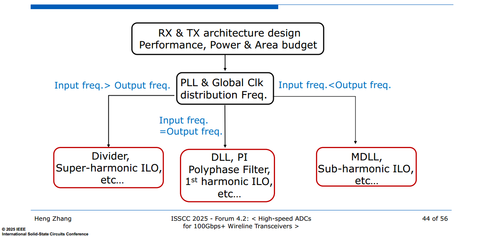

## Quadrature Phase Detector

> S. Chen et al., "A 4-to-16GHz inverter-based injection-locked quadrature clock generator with phase interpolators for multi-standard I/Os in 7nm FinFET," 2018 IEEE International Solid-State Circuits Conference - (ISSCC), San Francisco, CA, USA, 2018, pp. 390-39 [[https://sci-hub.red/storage/twin/6715/2bc891863e9eac1eb1670deb776ff04d/chen2018.pdf](https://sci-hub.red/storage/twin/6715/2bc891863e9eac1eb1670deb776ff04d/chen2018.pdf)]
>
> Z. Wang, Y. Zhang, Y. Onizuka and P. R. Kinget, "Multi-Phase Clock Generation for Phase Interpolation With a Multi-Phase, Injection-Locked Ring Oscillator and a Quadrature DLL," in IEEE Journal of Solid-State Circuits, vol. 57, no. 6, pp. 1776-1787, June 2022, doi: 10.1109/JSSC.2021.3124486.
>
> Z. Wang and P. R. Kinget, "A Very High Linearity Twin Phase Interpolator With a Low-Noise and Wideband Delta Quadrature DLL for High-Speed Data Link Clocking," in IEEE Journal of Solid-State Circuits, vol. 58, no. 4, pp. 1172-1184, April 2023, doi: 10.1109/JSSC.2022.3197061
>
> Wang, Zhaowen. *Efficient and High-Performance Clocking Circuits for High-Speed Data Links*. 2022. Columbia University, PhD dissertation. *Academic Commons*,[[https://academiccommons.columbia.edu/doi/10.7916/g3f1-4e71](https://academiccommons.columbia.edu/doi/10.7916/g3f1-4e71)]
>
> Y. Tian *et al*., "A 28-nm 8–28-GHz Eight-Phase Clock Generator Using an Injection-Locked Dual-Feedback Ring Oscillator," in *IEEE Journal of Solid-State Circuits*, vol. 61, no. 1, pp. 47-62, Jan. 2026, doi: 10.1109/JSSC.2025.3613940
>
> Shaokang ZHAO, 2025, "Multi-Phase Clock Generator for High-Speed Wireline Systems," [[paper](https://yuegroup.hkust.edu.hk/sites/default/files/Thesis/1.Thesis/2.Mphil/Shaokang%20Thesis.pdf), [slides](https://yuegroup.hkust.edu.hk/sites/default/files/Thesis/2.Slides/2.Mphil/Shaokang_Zhao%20Slides.pdf)]

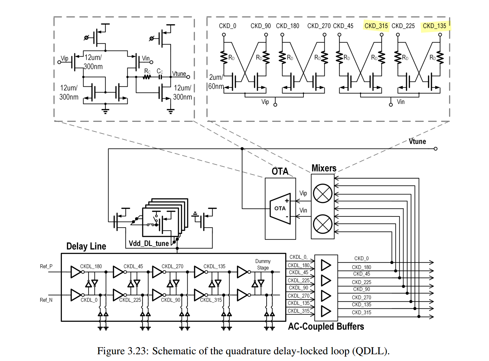
$$
V_{ip}=\mathrm{XNOR}(CKD_0,CKD_{90})\qquad \qquad V_{in}=\mathrm{XNOR}(CKD_{45},CKD_{315})
$$
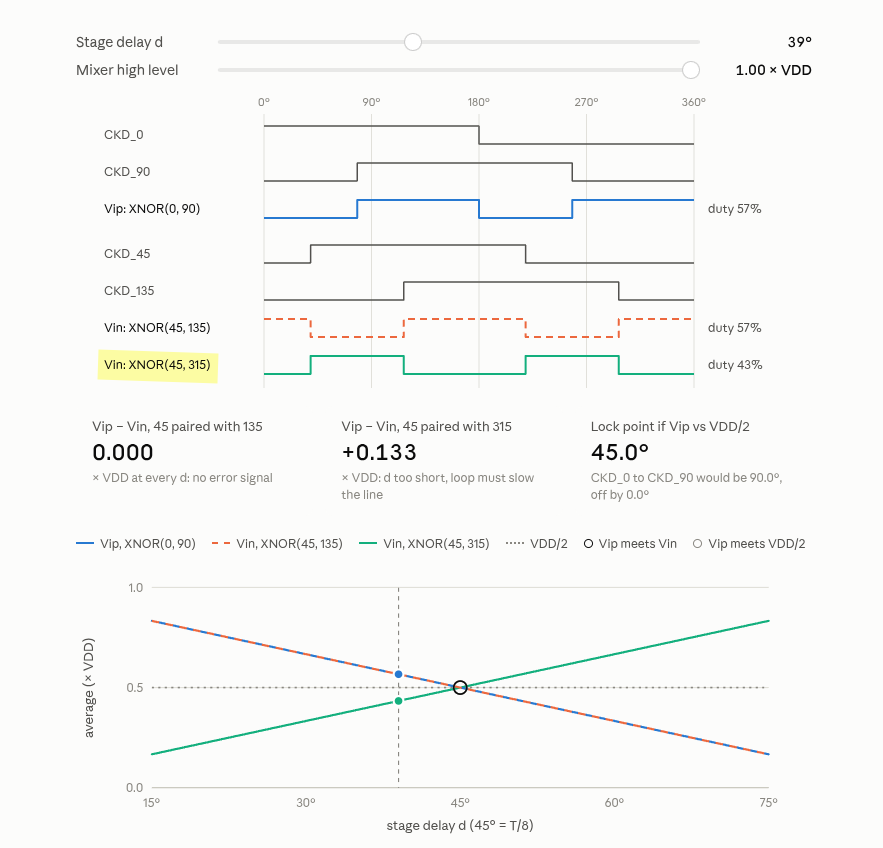

---

A natural approach is to compare

$$
\mathrm{XOR}(CKD_0,CKD_{90})+\mathrm{XOR}(CKD_{45},CKD_{135})
$$

against

$$
\mathrm{XNOR}(CKD_0,CKD_{90})+\mathrm{XNOR}(CKD_{45},CKD_{135})
$$

Its main limitation is that accurate phase detection relies on the input clocks having a 50% duty cycle.

## Multi-phase Generation using Divider

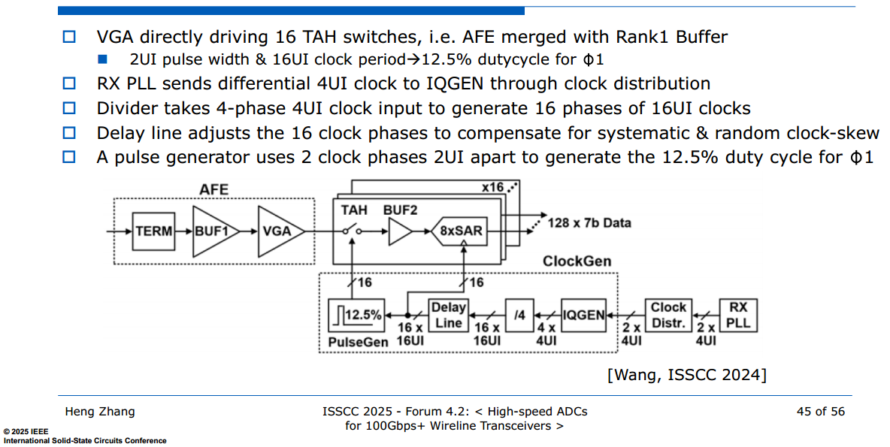

---

---

ph\<0:3\> 4UI clock to oph\<0:7\> 8UI clock

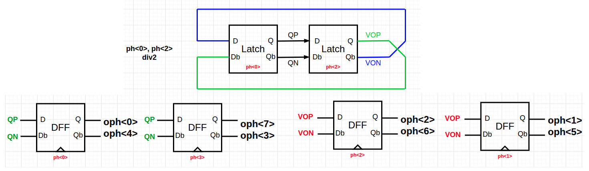

## Multi-Phase Generation using ILO

> D. Pfaff *et al*., "7.3 A 224Gb/s 3pJ/b 40dB Insertion Loss Transceiver in 3nm FinFET CMOS," *2024 IEEE International Solid-State Circuits Conference (ISSCC)*, San Francisco, CA, USA, 2024, pp. 128-130, doi: 10.1109/ISSCC49657.2024.10454537

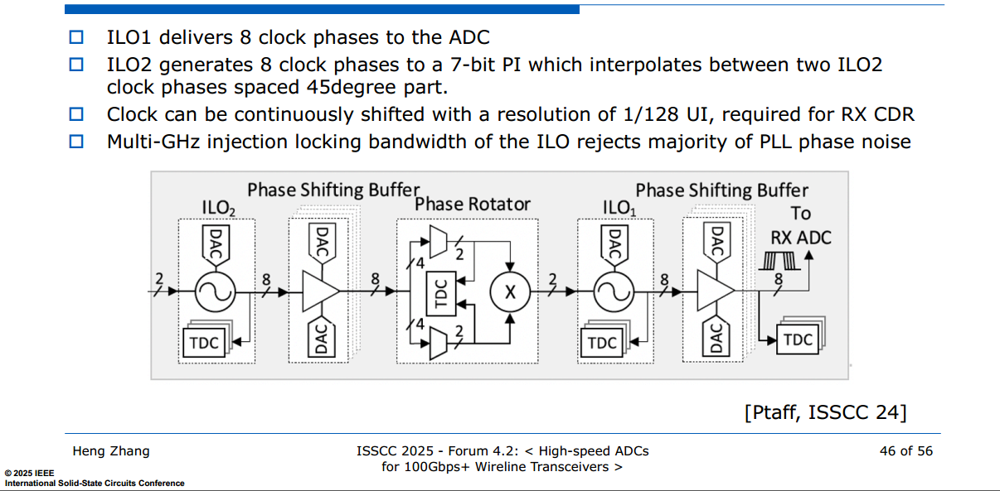

## Skew Correction

> D. Pfaff *et al*., "7.3 A 224Gb/s 3pJ/b 40dB Insertion Loss Transceiver in 3nm FinFET CMOS," *2024 IEEE International Solid-State Circuits Conference (ISSCC)*, San Francisco, CA, USA, 2024, pp. 128-130, doi: 10.1109/ISSCC49657.2024.10454537

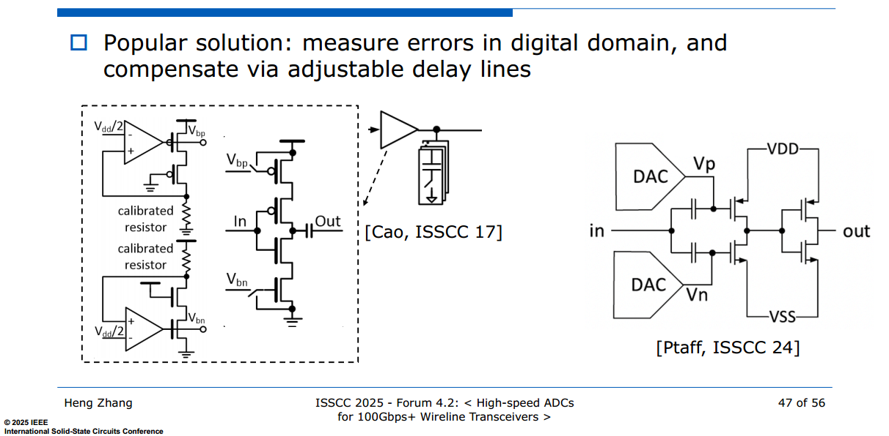

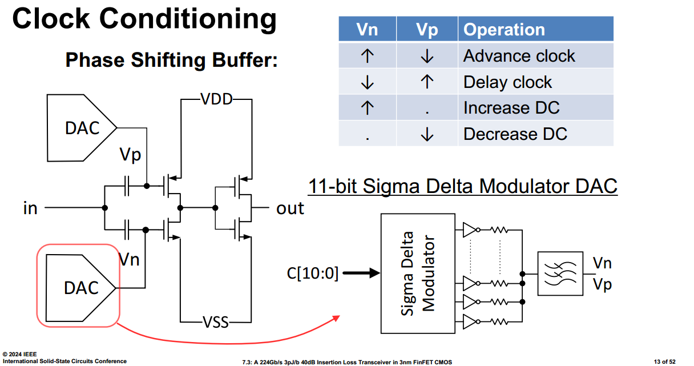

## DCC & AC-coupled buffer

The amount of correction can be set by intentional injection of an *offset current* into the summing input node of INV, ***threshold-adjustable inverter***

> Note that the change to the threshold is ***opposite in direction*** to the change to INV
>
> increasing DC of input signal is equivalent to lower down the threshold of INV

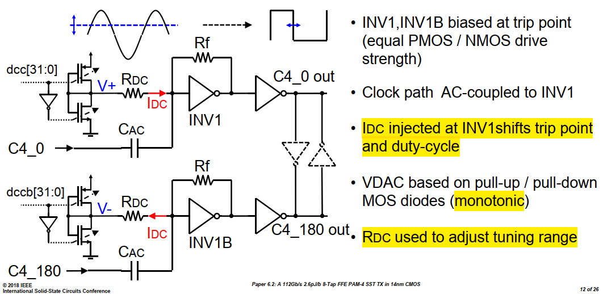

---

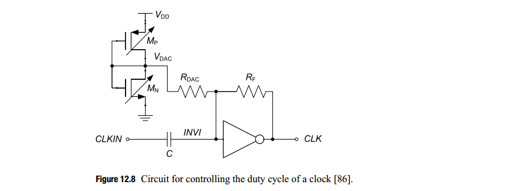

voltage at *INV1* will increased by:
$$
\frac{\Delta V_{DAC} - \Delta {INV1}}{R_{DAC}} = \frac{\Delta {INV1} +A_0 \Delta {INV1}}{R_{F}}
$$
therefore
$$
\Delta {INV1} = \Delta V_{DAC} \cdot \frac{R_F}{R_F+(A_0+1)R_{DAC}} \approx  \Delta V_{DAC} \cdot \frac{R_F}{A_0R_{DAC}}
$$

> variable $R_{DAC}$ can be used to tweak tuning resolution & range

If $R_{DAC} = R_F$
$$
\Delta {INV1}\approx \frac{\Delta V_{DAC}}{A_0}
$$

---

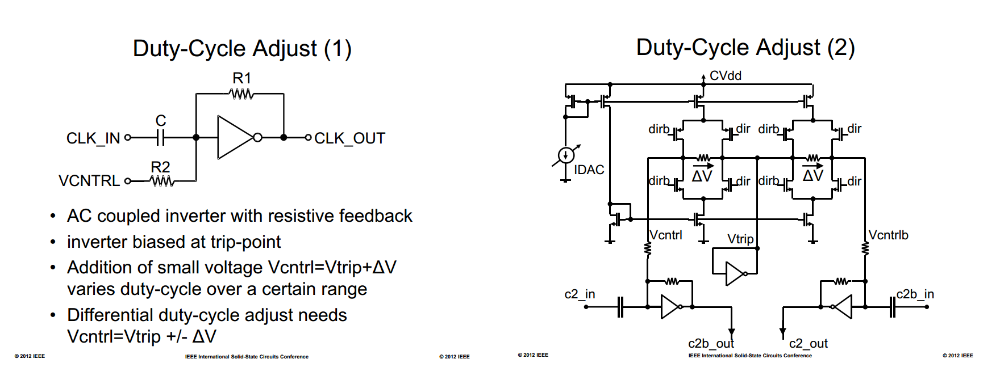

> C. Menolfi *et al*., "A 112Gb/S 2.6pJ/b 8-Tap FFE PAM-4 SST TX in 14nm CMOS," *2018 IEEE International Solid-State Circuits Conference - (ISSCC)* [[https://sci-hub.se/https://doi.org/10.1109/ISSCC.2018.8310205](https://sci-hub.se/https://doi.org/10.1109/ISSCC.2018.8310205)],[[visual](https://picture.iczhiku.com/resource/eetop/shiGDYTDYikLlnXv.pdf)]
>
> M. A. Kossel *et al*., "8.3 An 8b DAC-Based SST TX Using Metal Gate Resistors with 1.4pJ/b Efficiency at 112Gb/s PAM-4 and 8-Tap FFE in 7nm CMOS," *2021 IEEE International Solid-State Circuits Conference (ISSCC)*, San Francisco, CA, USA, 2021[[https://sci-hub.se/10.1109/ISSCC42613.2021.9365784](https://sci-hub.se/10.1109/ISSCC42613.2021.9365784)]
>
> C. Menolfi *et al*., "A 28Gb/s source-series terminated TX in 32nm CMOS SOI," *2012 IEEE International Solid-State Circuits Conference*, San Francisco, CA, USA, 2012
>
> Bob Lefferts, Navraj Nandra. SNUG Israel 2007 [[https://picture.iczhiku.com/resource/eetop/whKYwQorwYoPUVbm.pdf](https://picture.iczhiku.com/resource/eetop/whKYwQorwYoPUVbm.pdf)]

---

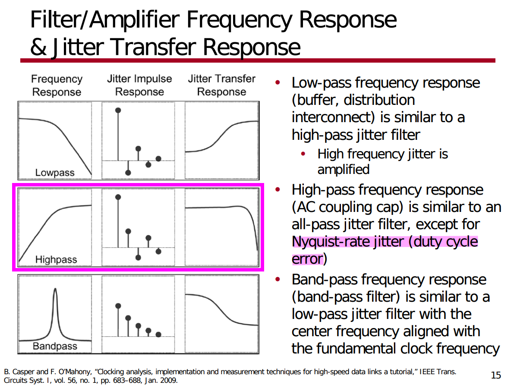

> Since duty-cycle error is *high frequency* component, the high-pass filter suppresses the duty-cycle error propagating to the output

- The AC-coupling capacitor blocks the low-frequency component of the input
- The feedback resistor sets common mode voltage to the crossover voltage

> Bae, Woorham; Jeong, Deog-Kyoon: 'Analysis and Design of CMOS Clocking Circuits for Low Phase Noise' (Materials, Circuits and Devices, 2020)
>
> Casper B, O'Mahony F. Clocking analysis, implementation and measurement techniques for high-speed data links: A tutorial. IEEE Transactions on Circuits and Systems I: Regular Papers. 2009;56(1):17-39

## Pulse Width Jitter (PWJ)

> [[Spectre Tech Tips: Measuring Noise in Digital Circuits](https://community.cadence.com/cadence_blogs_8/b/cic/posts/spectre-tech-tips-measuring-noise-in-digital-circuits)]

**Pnoise sampled: Edge Delay mode** measures the noise defined by two edges. Both edges are defined by a threshold voltage and rising or falling edges, which measures the noise of the pulse itself and direct plot calculate the variation of the **pulse width**

*TODO* &#128197;

## reference

Nicola Da Dalt, Intel. ISSCC 2017 Forum: High-Performance Clock Generation and Distribution in Very-High-Speed Wireline Transceivers

Jihwan Kim,Intel, ISSCC 2023 Forum *F1.5: Circuit Designs for 200+Gb/s Electrical Transceivers*

Heng Zhang, Broadcom, ISSCC 2025 - Forum 4.2: < High-speed ADCs for 100Gbps+ Wireline Transceivers >

**H. Zhang**, D. Cui, J. Cao, and A.Momtaz, "Phase Adjustment Scheme for Time-interleaved ADCs", United States Patent. US 9065464 B2. Issued Jun.23, 2015*.* [[https://patentimages.storage.googleapis.com/c1/11/1f/6fb830d08b710b/US9065464.pdf](https://patentimages.storage.googleapis.com/c1/11/1f/6fb830d08b710b/US9065464.pdf)]

***H. Zhang**, D. Cui,  and J. Cao, "Clock Generator for Use in A Time-interleaved ADC and Methods for Use therewith", United States Patent. US 8902094 B1. Issued Dec.2, 2014*. [[https://patentimages.storage.googleapis.com/c7/0b/73/74e61515ddffa2/US8902094.pdf](https://patentimages.storage.googleapis.com/c7/0b/73/74e61515ddffa2/US8902094.pdf)]

rfinsights, Quadrature Phase Detector: passive mixer vs XOR gate [[https://www.rfinsights.com/concepts/quadrature-phase-detector-passive-mixer-vs-xor/](https://www.rfinsights.com/concepts/quadrature-phase-detector-passive-mixer-vs-xor/)]

—, multiphase clock generation technique: a brief look into the history and the latest [[https://www.rfinsights.com/synthesizer/multiphase-clock-generation-techniques/](https://www.rfinsights.com/synthesizer/multiphase-clock-generation-techniques/)]

—, phase rotator in serdes - every major topology, explained [[https://www.rfinsights.com/synthesizer/phase-rotator/](https://www.rfinsights.com/synthesizer/phase-rotator/)]
