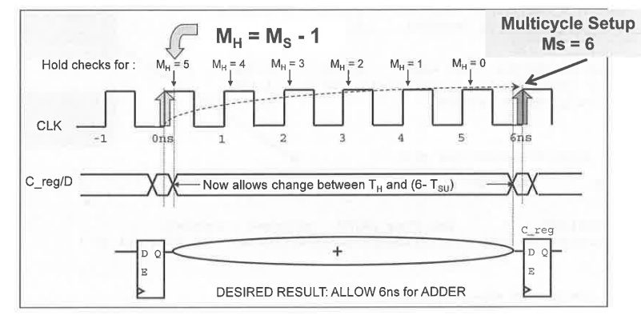

PrimeTime *does not* automatically identifies multicycle paths.

#### specifying multicycle path for setup

```tcl
set_multicycle_path 6 -from reg[26]/CP -to reg/D
# or
set_multicycle_path -setup 6 -from reg[26]/CP -to reg/D
# check the exception
report_exception
```

#### specifying multicycle path for hold (new data every 6 cycles)

```tcl
set_multicycle_path -setup 6 -to [get_pins "*reg[*]/D"]
set_multicycle_path -hold [expr 6-1] -to [get_pins "*reg[*]/D"]
```



M<sub>H</sub> stands for Hold Multiplier, M<sub>S</sub> for Setup Multiplier. The Setup multiplier counts up with increasing clock cycles, the Hold Multiplier counts up with decreasing cycles. The origin (0) for the Hold Multiplier is always at the `Setup Multiplier - 1` position.

#### Reporting a multicycle path with report_timing

```tcl
report_timing -exceptions all -from *reg[26]/CP -to *reg/D
```

#### Timing Exceptions

If certain paths are **not** intended to operate according to *the default setup and hold behavior
assumed by the PrimeTime tool*, you need to specify those paths as timing exceptions.
Otherwise, the tool might incorrectly report those paths as having timing violations.

The PrimeTime tool lets you specify the following types of exceptions:

- False path – A path that is never sensitized due to the logic configuration, expected data sequence, or operating mode.
- Multicycle path – A path designed to take more than one clock cycle from launch to capture.
- Minimum or maximum delay path – A path that must meet a delay constraint that you explicitly specify as a time value.


#### REF

PrimeTime® User Guide Version O-2018.06-SP4 Chapter 1: Introduction to PrimeTime Overview of Static Timing Analysis - Timing Exceptions
