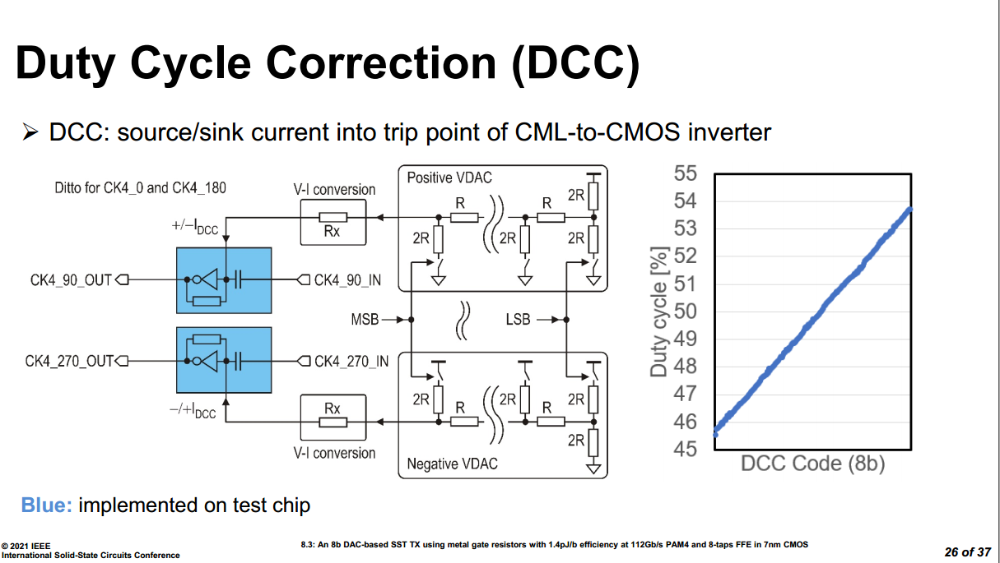
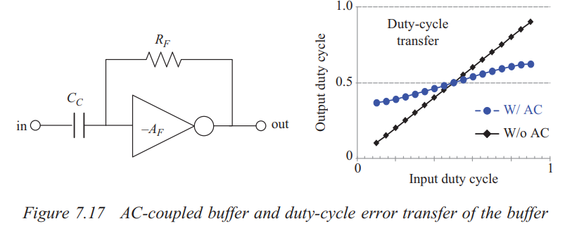

## QEC (Quadrature Error Corrector )

> Shaokang ZHAO, 2025, "Multi-Phase Clock Generator for High-Speed Wireline Systems," [[paper](https://yuegroup.hkust.edu.hk/sites/default/files/Thesis/1.Thesis/2.Mphil/Shaokang%20Thesis.pdf), [slides](https://yuegroup.hkust.edu.hk/sites/default/files/Thesis/2.Slides/2.Mphil/Shaokang_Zhao%20Slides.pdf)]

*TODO* &#128197;

## AC-coupled buffer & DCC

The amount of correction can be set by intentional injection of an *offset current* into the summing input node of INV, ***threshold-adjustable inverter***

> Note that the change to the threshold is ***opposite in direction*** to the change to INV
>
> increasing DC of input signal is equivalent to lower down the threshold of INV

---

voltage at *INV1* will increased by:
$$
\frac{\Delta V_{DAC} - \Delta {INV1}}{R_{DAC}} = \frac{\Delta {INV1} +A_0 \Delta {INV1}}{R_{F}}
$$
therefore
$$
\Delta {INV1} = \Delta V_{DAC} \cdot \frac{R_F}{R_F+(A_0+1)R_{DAC}} \approx  \Delta V_{DAC} \cdot \frac{R_F}{A_0R_{DAC}}
$$

> variable $R_{DAC}$ can be used to tweak tuning resolution & range

If $R_{DAC} = R_F$
$$
\Delta {INV1}\approx \frac{\Delta V_{DAC}}{A_0}
$$

---

> C. Menolfi *et al*., "A 112Gb/S 2.6pJ/b 8-Tap FFE PAM-4 SST TX in 14nm CMOS," *2018 IEEE International Solid-State Circuits Conference - (ISSCC)* [[https://sci-hub.se/https://doi.org/10.1109/ISSCC.2018.8310205](https://sci-hub.se/https://doi.org/10.1109/ISSCC.2018.8310205)],[[visual](https://picture.iczhiku.com/resource/eetop/shiGDYTDYikLlnXv.pdf)]
>
> M. A. Kossel *et al*., "8.3 An 8b DAC-Based SST TX Using Metal Gate Resistors with 1.4pJ/b Efficiency at 112Gb/s PAM-4 and 8-Tap FFE in 7nm CMOS," *2021 IEEE International Solid-State Circuits Conference (ISSCC)*, San Francisco, CA, USA, 2021[[https://sci-hub.se/10.1109/ISSCC42613.2021.9365784](https://sci-hub.se/10.1109/ISSCC42613.2021.9365784)]
>
> C. Menolfi *et al*., "A 28Gb/s source-series terminated TX in 32nm CMOS SOI," *2012 IEEE International Solid-State Circuits Conference*, San Francisco, CA, USA, 2012
>
> Bob Lefferts, Navraj Nandra. SNUG Israel 2007 [[https://picture.iczhiku.com/resource/eetop/whKYwQorwYoPUVbm.pdf](https://picture.iczhiku.com/resource/eetop/whKYwQorwYoPUVbm.pdf)]

---

> Since duty-cycle error is *high frequency* component, the high-pass filter suppresses the duty-cycle error propagating to the output

- The AC-coupling capacitor blocks the low-frequency component of the input
- The feedback resistor sets common mode voltage to the crossover voltage

> Bae, Woorham; Jeong, Deog-Kyoon: 'Analysis and Design of CMOS Clocking Circuits for Low Phase Noise' (Materials, Circuits and Devices, 2020)
>
> Casper B, O'Mahony F. Clocking analysis, implementation and measurement techniques for high-speed data links: A tutorial. IEEE Transactions on Circuits and Systems I: Regular Papers. 2009;56(1):17-39

## Pulse Width Jitter (PWJ)

> [[Spectre Tech Tips: Measuring Noise in Digital Circuits](https://community.cadence.com/cadence_blogs_8/b/cic/posts/spectre-tech-tips-measuring-noise-in-digital-circuits)]

**Pnoise sampled: Edge Delay mode** measures the noise defined by two edges. Both edges are defined by a threshold voltage and rising or falling edges, which measures the noise of the pulse itself and direct plot calculate the variation of the **pulse width**

*TODO* &#128197;
