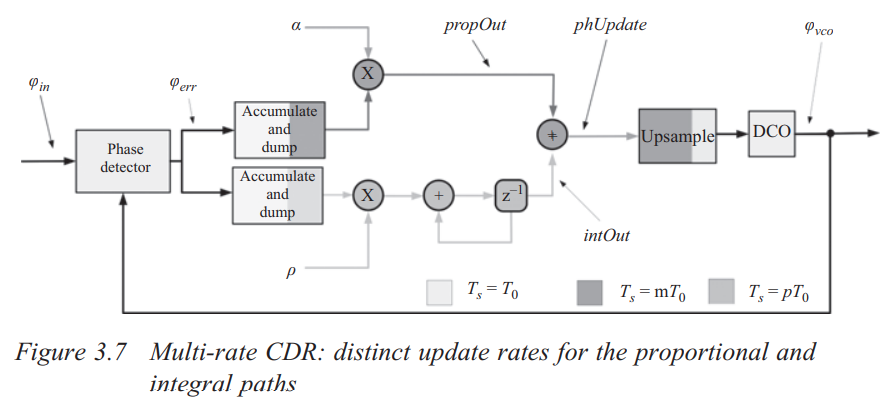
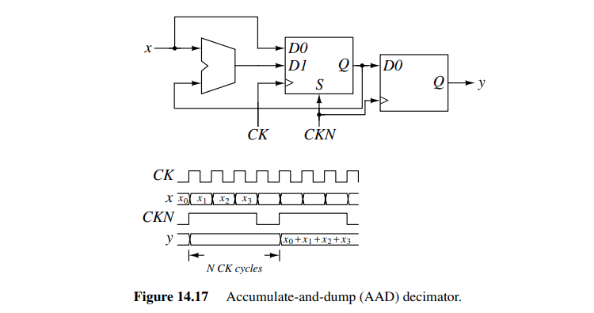
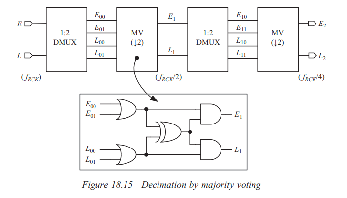

## Accumulate-and-dump (AAD) decimator

accumulating the input for $N$ cycles and then latching the result and resetting the integrator

## Decimation

DLF's input bit-width can be reduced by *decimating* BBPD's output. Decimation is typically performed by realizing either **majority voting (MV)** or **boxcar filtering**.

Note that **deserialization** is inherent to both **MV** and **boxcar** filtering. 

- Decimation is commonly employed to alleviate the high-speed requirement. However, decimation increases loop-latency which causes excessive dither jitter.
- Decimation is basically, widen the data and slowing it down
- Decimating by $L$ means frequency register only added once every $L$ UI, thus *integral path gain* reduced by $L$ in linear model
- *proportional path gain* is unchanged

### Decimation by Summing

> In DSP this is called *boxcar filter*
>
> $\sum d_n$, where $d_n \in \{-1, 0, 1\}$

- Decimation via boxcar filter produces a DC gain, $K_b$, corresponding to the *decimation factor*. 

### Decimation by Voting

> equivalent $\sum d_n \lt 0 \to -1$, $\sum d_n = 0 \to 0$ and $\sum d_n\gt 0 \to 1$
>
> Compared to the boxcar filter, voting is able to reduce the loop delay and lower the output noise of the MMPD

- Decimation via voting has a reduced gain, $K_V$, which can be determined through simulation

## Moving Average and CIC Filters

> **cascade-integrator-comb (CIC)** decimator

*TODO* &#128197;

> An Intuitive Look at Moving Average and CIC Filters [[web](https://tomverbeure.github.io/2020/09/30/Moving-Average-and-CIC-Filters.html), [code](https://github.com/tomverbeure/pdm/tree/master/modeling/cic_filters)]
>
> A Beginner's Guide To Cascaded Integrator-Comb (CIC) Filters [[https://www.dsprelated.com/showarticle/1337.php](https://www.dsprelated.com/showarticle/1337.php)]

## reference

R. E. Crochiere and L. R. Rabiner, "Multirate Digital Signal Processing", Prentice Hall, Englewood Cliffs, NJ, 1983.

F. M. Gardner, “Phaselock Techniques”, 3rd Edition, Wiley Interscience, Hoboken, NJ, 2005
