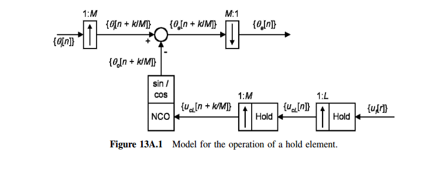

alternative view of sampling, assuming DC value is $A$

- $x_c(t)$ and $x_s(t)$

  $\overline{x_c} = A$; $\overline{x_s}=\frac{A}{T}$: therefore $X_s(j0) = \frac{1}{T}X_c(j0)$

- $x[n]$ and $x_d[n]$

  $\overline{x} = A$; $\overline{x_d}=\frac{A}{2}$: therefore $X_d(e^{j0}) = \frac{1}{2}X(e^{j0})$

***expander***

- $x[n]$ and $x_e[n]$

  $\overline{x} = A$; $\overline{x_e}=A$: therefore $X_e(e^{j0}) = X(e^{j0})$

  > Fourier transform of the output of the expander is a frequency-scaled version of the Fourier transform of the input

---

## Subsampling or Downsampling

- Eqs. (4.72)

  the superposition of an infinite set of amplitude-scaled copies of $X_c(j\Omega)$, frequency scaled through $\omega = \Omega T_d$ and shifted by integer multiples of $2\pi$

- Eq. (4.77)

  the superposition of $M$ amplitude-scaled copies of the periodic Fourier transform $X (e^{j\omega})$, frequency scaled by $M$ and shifted by integer multiples of $2\pi$ 

---

downsampled by a factor of $M = 2$

---

## Upsampling or Zero Insertion

---

## sampling identities

---

**downsampling identity** 

---

**upsampling identity**

## Polyphase Decomposition

where $e_k[n]=h[nM+k]$

---

***Polyphase Implementation of Decimation Filters & Interpolation Filters***

|                       | Decimation system                                            | Interpolation system                                         |
| --------------------- | ------------------------------------------------------------ | ------------------------------------------------------------ |
|                       |  |  |
|                       |  |  |
| **sampling identity** |  |  |

## LPTV Implementation

*TODO* &#128197;

The **interpolation filter** following an up-sampler generally is **time varying** and cannot be represented
by a simple transfer function. The equivalent filter in a **zero-order hold** is an exception, perhaps unique, that can be represented with a time-invariant transfer function

> Dr. Deepa Kundur, Multirate Digital Signal Processing: Part I [[pdf](https://www.comm.utoronto.ca/dkundur/course_info/discrete-time-systems/notes/Kundur_DTS_Chap11a.pdf), [https://www.comm.utoronto.ca/dkundur/course/discrete-time-systems/](https://www.comm.utoronto.ca/dkundur/course/discrete-time-systems/)]

## ZOH interpolator

The interpolation filter following an up-sampler generally is *time varying* and *cannot* be represented by a simple transfer function. The equivalent filter in a **Zero-Order Hold** is an exception, perhaps unique, that can be represented with a *time-invariant transfer function* 

---

$$
F_1(z) = X(z^{LM})\frac{1-z^{-LM}}{1-z^{-1}}
$$

Split the $1:LM$ hold process into a $1 : L$ hold followed by a $1 : M$ hold
$$
Y(\eta)=X(\eta^{L})\frac{1-\eta^{-L}}{1-\eta^{-1}}
$$
then
$$\begin{align}
F_2(z) &= Y(z^M)\cdot\frac{1-z^{-M}}{1-z^{-1}} \\
&=X(z^{LM})\frac{1-z^{-LM}}{1-z^{-M}}\cdot \frac{1-z^{-M}}{1-z^{-1}} \\
&= X(z^{LM})\frac{1-z^{-LM}}{1-z^{-1}}
\end{align}$$

That is $F_1(z)=F_2(z)$, i.e. they are equivalent

---

## Random Signals & Multirate Systems

> Balu Santhanam, Probability Theory & Stochastic Process 2020: Random Signals & Multirate Systems [[https://ece-research.unm.edu/bsanthan/ece541/rand.pdf](https://ece-research.unm.edu/bsanthan/ece541/rand.pdf)]

## Decimation by Summing

### proportional path

> The loop gain of a **proportional path** is **unchanged**

In *(a)*, the loop gain is $\frac{\phi_o(z)}{\phi_e(z)}$, which is
$$
LG_a(z)=\frac{\phi_o(z)}{\phi_e(z)} = \frac{1}{1-z^{-1}}
$$

In *(b)*, Accumulate-and-dump (AAD) is $\frac{1-z^{-L}}{1-z^{-1}}$, then $\phi_m(\eta)$ can be expressed as
$$
\phi_m(\eta) = \frac{1-\eta^{-1}}{1-\eta^{-1/L}}\cdot \frac{1}{L}
$$
Hence
$$\begin{align}
\phi_o(\eta) &= \phi_m(\eta) \frac{1}{1-\eta^{-1}} \\
&= \frac{1-\eta^{-1}}{1-\eta^{-1/L}}\cdot \frac{1}{L}\cdot \frac{1}{1-\eta^{-1}} \\
&= \frac{1}{1-\eta^{-1/L}}\cdot \frac{1}{L}
\end{align}$$

After *zero-order hold process*, we obtain $\phi_f(z)$, which is
$$\begin{align}
\phi_f(z) &= \phi_o(z^L) \cdot \frac{1-z^{-L}}{1-z^{-1}} \\
&=\frac{1}{1-z^{-1}}\cdot \frac{1}{L}\cdot \frac{1-z^{-L}}{1-z^{-1}}
\end{align}$$
That is,
$$
LG_b(z) = \frac{1}{1-z^{-1}}\cdot \frac{1}{L}\cdot \frac{1-z^{-L}}{1-z^{-1}}
$$

while bandwidth is less than sampling rate (data rate), $\frac{1}{L}\cdot \frac{1-z^{-L}}{1-z^{-1}} \approx 1$, i.e. $LG_a(z)\approx LG_b(z)$. with

$$
\frac{1}{1-z^{-1}}\cdot \frac{1}{L}\cdot \frac{1-z^{-L}}{1-z^{-1}} \approx \frac{1}{1-z^{-1}}
$$

### integral path

> **integral path gain reduced by $L$**

In *(a)*, $\phi_o(z)=\frac{1}{(1-z^{-1})^2}$, i.e.
$$
LG_a(z) = \frac{1}{(1-z^{-1})^2}
$$

In (b), after Accumulate-and-dump (AAD), $\phi_(\eta)$ is
$$
\phi_m(\eta) = \frac{1-\eta^{-1}}{1-\eta^{-1/L}}\cdot \frac{1}{L}
$$

After frequency integrator and phase integrator
$$\begin{align}
\phi_o(\eta) &= \phi_m(\eta) \cdot \frac{1}{(1-\eta^{-1})^2} \\
&= \frac{1-\eta^{-1}}{1-\eta^{-1/L}}\cdot \frac{1}{L} \cdot  \frac{1}{(1-\eta^{-1})^2}
\end{align}$$
Then $\phi_f(z)$ is shown as below
$$\begin{align}
\phi_f(z) &= \phi_o(z^L)\cdot \frac{1-z^{-L}}{1-z^{-1}} \\
&= \frac{1-z^{-L}}{1-z^{-1}}\cdot \frac{1}{L}\cdot \frac{1}{(1-z^{-L})^2}\cdot \frac{1-z^{-L}}{1-z^{-1}} \\
&= \frac{1}{L} \cdot \frac{1}{(1-z^{-1})^2}
\end{align}$$

That is,
$$
LG_b(z) = \frac{1}{L} \cdot \frac{1}{(1-z^{-1})^2} = \frac{1}{L}\cdot LG_a(z)
$$

## Decimation by Voting

*TODO* &#128197;

## reference

Alan V Oppenheim, Ronald W. Schafer. 2010. Discrete-Time Signal Processing, 3rd edition

R. E. Crochiere and L. R. Rabiner, "Multirate Digital Signal Processing", Prentice Hall, 1983.

John G. Proakis and Dimitris G. Manolakis, Digital Signal Processing: Principles, Algorithms, and Applications, 4th edition, 2007.

D. Sundararajan. 2024. Digital Signal Processing: An Introduction 2nd Edition

F. M. Gardner, "Phaselock Techniques", 3rd Edition, Wiley Interscience, Hoboken, NJ, 2005 [[https://picture.iczhiku.com/resource/eetop/WyIgwGtkDSWGSxnm.pdf](https://picture.iczhiku.com/resource/eetop/WyIgwGtkDSWGSxnm.pdf)]

Rhee, W. (2020). *Phase-locked frequency generation and clocking : architectures and circuits for modern wireless and wireline systems*. The Institution of Engineering and Technology
