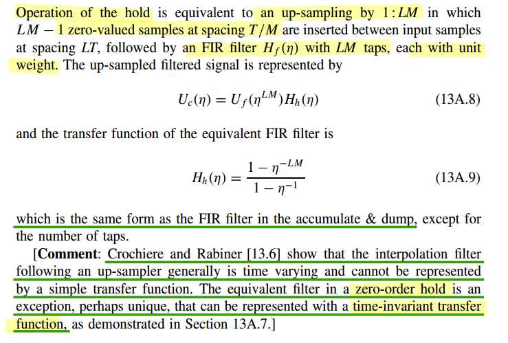

---


alternative view of sampling, assuming DC value is $A$


- $x_c(t)$ and $x_s(t)$

  $\overline{x_c} = A$; $\overline{x_s}=\frac{A}{T}$: therefore $X_s(j0) = \frac{1}{T}X_c(j0)$


- $x[n]$ and $x_d[n]$

  $\overline{x} = A$; $\overline{x_d}=\frac{A}{2}$: therefore $X_d(e^{j0}) = \frac{1}{2}X(e^{j0})$


***expander***


- $x[n]$ and $x_e[n]$

  $\overline{x} = A$; $\overline{x_e}=A$: therefore $X_e(e^{j0}) = X(e^{j0})$

  > Fourier transform of the output of the expander is a frequency-scaled version of the Fourier transform of the input


---


## Subsampling or Downsampling


- Eqs. (4.72)

  the superposition of an infinite set of amplitude-scaled copies of $X_c(j\Omega)$, frequency scaled through $\omega = \Omega T_d$ and shifted by integer multiples of $2\pi$

- Eq. (4.77)

  the superposition of $M$ amplitude-scaled copies of the periodic Fourier transform $X (e^{j\omega})$, frequency scaled by $M$ and shifted by integer multiples of $2\pi$ 


---

downsampled by a factor of $M = 2$


---


## Upsampling or Zero Insertion


---


Assuming $X(e^{j\omega_1}) = U_f(e^{j\omega_1})$ with $\omega_1 = \Omega T_1$, upsampled by ratio $L$, then obtain

$$
Y(e^{j\omega_2})=X(e^{j\omega_2 L})  = U_f(e^{j\omega_2 L})
$$

by EQ. (4.85), *i.e. substitute $\omega_1$ with $\omega_2 L$*, where with $\omega_2 = \Omega T_2$ and $T_2 L = T_1$

Provided that $\xi = e^{j\omega_1}$ and $z = e^{j\omega_2}$, we have $U_f(\xi)$ upsampled to $U_f(z^L)$


### Interpolation filter


---


> *Pavan, Schreier and Temes, "Understanding Delta-Sigma Data Converters, Second Edition"* 


---


> Markus Nentwig. Polyphase filter / Farrows interpolation [[https://www.dsprelated.com/showarticle/22.php](https://www.dsprelated.com/showarticle/22.php)]


## sampling identities


---


**downsampling identity** 


---


**upsampling identity**


## Polyphase Decomposition

Polyphase decomposition is *a powerful technique used in digital signal processing* to efficiently implement multirate systems.


where $e_k[n]=h[nM+k]$

---

***Polyphase Implementation of Decimation Filters & Interpolation Filters***

|                       | Decimation system                                            | Interpolation system                                         |
| --------------------- | ------------------------------------------------------------ | ------------------------------------------------------------ |
|                       |  |  |
|                       |  |  |
| **sampling identity** |  |  |


## LPTV Implementation

*TODO* &#128197;

The **interpolation filter** following an up-sampler generally is **time varying** and cannot be represented
by a simple transfer function. The equivalent filter in a **zero-order hold** is an exception, perhaps unique, that can be represented with a time-invariant transfer function


> Dr. Deepa Kundur, Multirate Digital Signal Processing: Part I [[pdf](https://www.comm.utoronto.ca/dkundur/course_info/discrete-time-systems/notes/Kundur_DTS_Chap11a.pdf), [https://www.comm.utoronto.ca/dkundur/course/discrete-time-systems/](https://www.comm.utoronto.ca/dkundur/course/discrete-time-systems/)]


## ZOH interpolator

The interpolation filter following an up-sampler generally is *time varying* and *cannot* be represented by a simple transfer function. The equivalent filter in a **Zero-Order Hold** is an exception, perhaps unique, that can be represented with a *time-invariant transfer function* 




---


$$
F_1(z) = X(z^{LM})\frac{1-z^{-LM}}{1-z^{-1}}
$$


Split the $1:LM$ hold process into a $1 : L$ hold followed by a $1 : M$ hold
$$
Y(\eta)=X(\eta^{L})\frac{1-\eta^{-L}}{1-\eta^{-1}}
$$
then
$$\begin{align}
F_2(z) &= Y(z^M)\cdot\frac{1-z^{-M}}{1-z^{-1}} \\
&=X(z^{LM})\frac{1-z^{-LM}}{1-z^{-M}}\cdot \frac{1-z^{-M}}{1-z^{-1}} \\
&= X(z^{LM})\frac{1-z^{-LM}}{1-z^{-1}}
\end{align}$$

That is $F_1(z)=F_2(z)$, i.e. they are equivalent


---


## Random Signals & Multirate Systems


> Balu Santhanam, Probability Theory & Stochastic Process 2020: Random Signals & Multirate Systems [[https://ece-research.unm.edu/bsanthan/ece541/rand.pdf](https://ece-research.unm.edu/bsanthan/ece541/rand.pdf)]


## Decimation by Summing

### proportional path

> The loop gain of a **proportional path** is **unchanged**


In *(a)*, the loop gain is $\frac{\phi_o(z)}{\phi_e(z)}$, which is
$$
LG_a(z)=\frac{\phi_o(z)}{\phi_e(z)} = \frac{1}{1-z^{-1}}
$$

In *(b)*, Accumulate-and-dump (AAD) is $\frac{1-z^{-L}}{1-z^{-1}}$, then $\phi_m(\eta)$ can be expressed as
$$
\phi_m(\eta) = \frac{1-\eta^{-1}}{1-\eta^{-1/L}}\cdot \frac{1}{L}
$$
Hence
$$\begin{align}
\phi_o(\eta) &= \phi_m(\eta) \frac{1}{1-\eta^{-1}} \\
&= \frac{1-\eta^{-1}}{1-\eta^{-1/L}}\cdot \frac{1}{L}\cdot \frac{1}{1-\eta^{-1}}
\end{align}$$

After *zero-order hold process*, we obtain $\phi_f(z)$, which is
$$\begin{align}
\phi_f(z) &= \phi_o(z^L) \cdot \frac{1-z^{-L}}{1-z^{-1}} \\
&=\frac{1-z^{-L}}{1-z^{-1}}\cdot \frac{1}{L}\cdot \frac{1}{1-z^{-L}}\cdot \frac{1-z^{-L}}{1-z^{-1}}
\end{align}$$
i.e.,
$$
LG_b(z) = \frac{1}{1-z^{-1}}\cdot \frac{1}{L}\cdot \frac{1-z^{-L}}{1-z^{-1}}
$$

When bandwidth is much less than sampling rate (data rate),  $\frac{1}{L}\cdot \frac{1-z^{-L}}{1-z^{-1}} \approx 1$

Therefore
$$
LG_b(z) \approx  \frac{1}{1-z^{-1}}
$$

In the end
$$
LG_a(z) \approx LG_b(z)
$$

---

Assume PD output is constant


### integral path

> **integral path gain reduced by $L$**


In *(a)*, $\phi_o(z)=\frac{1}{(1-z^{-1})^2}$, i.e.
$$
LG_a(z) = \frac{1}{(1-z^{-1})^2}
$$

In (b), after Accumulate-and-dump (AAD), $\phi_(\eta)$ is
$$
\phi_m(\eta) = \frac{1-\eta^{-1}}{1-\eta^{-1/L}}\cdot \frac{1}{L}
$$

After frequency integrator and phase integrator
$$\begin{align}
\phi_o(\eta) &= \phi_m(\eta) \cdot \frac{1}{(1-\eta^{-1})^2} \\
&= \frac{1-\eta^{-1}}{1-\eta^{-1/L}}\cdot \frac{1}{L} \cdot  \frac{1}{(1-\eta^{-1})^2}
\end{align}$$
Then $\phi_f(z)$ is shown as below
$$\begin{align}
\phi_f(z) &= \phi_o(z^L)\cdot \frac{1-z^{-L}}{1-z^{-1}} \\
&= \frac{1-z^{-L}}{1-z^{-1}}\cdot \frac{1}{L}\cdot \frac{1}{(1-z^{-L})^2}\cdot \frac{1-z^{-L}}{1-z^{-1}} \\
&= \frac{1}{L} \cdot \frac{1}{(1-z^{-1})^2}
\end{align}$$

That is,
$$
LG_b(z) = \frac{1}{L} \cdot \frac{1}{(1-z^{-1})^2} = \frac{1}{L}\cdot LG_a(z)
$$

---

Assume PD output is constant


$$
\lim_{n\to +\infty} \frac{\Delta P_1}{\Delta P_0} = \lim_{n\to +\infty}\frac{n+2L}{nL+\alpha L+\beta L^2} = \frac{1}{L}
$$


## Decimation by Voting


---

> In above screenshot
>
> 1. $K_D$ is just relative value
> 2. frug shall **not** be scaled by decimator factor
>
> proved as below

DC gain $K_B$ of summing (boxcar filter) is *decimation factor* $M$ , voting gain $K_V$ is about $0.54K_b=0.54M$

1. downsampling $\frac{1}{M}$ and ZOH $\frac{1-z^{-M}}{1-z^{-1}}$ can be canceled out at low frequency
2. decimation gain: accumulator $\frac{1-z^{-M}}{1-z^{-1}}$ replaced with linearizing gain $K_B$ and majority voting replaced with $K_V$

**proportional path:**
$$\begin{align}
LG_{ph} &= K_{BB}\cdot \frac{1-z^{-M}}{1-z^{-1}}\cdot \frac{1}{M}\cdot \frac{1}{1-z^{-M}}\cdot \frac{1-z^{-M}}{1-z^{-1}} \\
&\approx K_{BB}\cdot \frac{1-z^{-M}}{1-z^{-1}}\cdot \frac{1}{1-z^{-M}} \\
&= K_{BB}\cdot K_D\cdot \frac{1}{1-z^{-M}}
\end{align}$$


**integral path:**
$$\begin{align}
LG_{fr} &= K_{BB}\cdot \frac{1-z^{-M}}{1-z^{-1}}\cdot \frac{1}{M}\cdot \frac{1}{(1-z^{-M})^2}\cdot \frac{1-z^{-M}}{1-z^{-1}} \\
&\approx K_{BB}\cdot \frac{1-z^{-M}}{1-z^{-1}}\cdot \frac{1}{(1-z^{-M})^2} \\
&= K_{BB}\cdot K_D\cdot  \frac{1}{(1-z^{-M})^2}
\end{align}$$


> J. Stonick. ISSCC 2011 "DPLL-Based Clock and Data Recovery" [[slides](https://www.nishanchettri.com/isscc-slides/2011%20ISSCC/TUTORIALS/ISSCC2011Visuals-T5.pdf),[transcript](https://www.nishanchettri.com/isscc-slides/2011%20ISSCC/TUTORIALS/Transcription_T5.pdf)]
>
> J. L. Sonntag and J. Stonick, "A Digital Clock and Data Recovery Architecture for Multi-Gigabit/s Binary Links," in *IEEE Journal of Solid-State Circuits*, vol. 41, no. 8, pp. 1867-1875, Aug. 2006  [[https://sci-hub.se/10.1109/JSSC.2006.875292](https://sci-hub.se/10.1109/JSSC.2006.875292)]
>
> J. Sonntag and J. Stonick, "A digital clock and data recovery architecture for multi-gigabit/s binary links," *Proceedings of the IEEE 2005 Custom Integrated Circuits Conference, 2005.*. [[https://sci-hub.se/10.1109/CICC.2005.1568725](https://sci-hub.se/10.1109/CICC.2005.1568725)]
>
> Y. Xia *et al*., "A 10-GHz Low-Power Serial Digital Majority Voter Based on Moving Accumulative Sign Filter in a PS-/PI-Based CDR," in *IEEE Transactions on Microwave Theory and Techniques*, vol. 68, no. 12 [[https://sci-hub.se/10.1109/TMTT.2020.3029188](https://sci-hub.se/10.1109/TMTT.2020.3029188)]
>
> J. Liang, A. Sheikholeslami, "On-Chip Jitter Measurement and Mitigation Techniques for Clock and Data Recovery Circuits" [[https://tspace.library.utoronto.ca/bitstream/1807/91138/3/Liang_Joshua_201706_PhD_thesis.pdf](https://tspace.library.utoronto.ca/bitstream/1807/91138/3/Liang_Joshua_201706_PhD_thesis.pdf)]
>
> J. Liang, A. Sheikholeslami. ISSCC2017. "A 28Gbps Digital CDR with Adaptive Loop Gain for Optimum Jitter Tolerance" [[slides](https://picture.iczhiku.com/resource/eetop/whiGpozAyuTUAnmb.pdf),[paper](https://www.eecg.utoronto.ca/~ali/papers/isscc2017-josh.pdf)]
>
> J. Liang, A. Sheikholeslami,, "Loop Gain Adaptation for Optimum Jitter Tolerance in Digital CDRs," in *IEEE Journal of Solid-State Circuits* [[https://sci-hub.se/10.1109/JSSC.2018.2839038](https://sci-hub.se/10.1109/JSSC.2018.2839038)]
>
> M. M. Khanghah, K. D. Sadeghipour, D. Kelly, C. Antony, P. Ossieur and P. D. Townsend, "A 7-Bit 7-GHz Multiphase Interpolator-Based DPC for CDR Applications," in *IEEE Transactions on Circuits and Systems I: Regular Papers* [[https://cora.ucc.ie/bitstreams/7ae5bfaa-8dd9-45a7-8276-99676b7b6078/download](https://cora.ucc.ie/bitstreams/7ae5bfaa-8dd9-45a7-8276-99676b7b6078/download)]
>
> [[CDR CIRCUIT-BLOCKS: DESIGN AND VERIFICATION USING VERILOG - 2.6. DECIMATOR](https://noesis.uis.edu.co/server/api/core/bitstreams/106aa2f9-e227-4059-8bfc-03bcce4ecea5/content)]
>
> Michael H. Perrott, Tutorial on Digital Phase-Locked Loops, CICC 2009, San Jose, CA, Sept. 13, 2009 [[https://www.cppsim.com/PLL_Lectures/digital_pll_cicc_tutorial_perrott.pdf](https://www.cppsim.com/PLL_Lectures/digital_pll_cicc_tutorial_perrott.pdf)]
>
> Liu, Tao, Tiejun Li, Fangxu Lv, Bin Liang, Xuqiang Zheng, Heming Wang, Miaomiao Wu, Dechao Lu, and Feng Zhao. 2021. "Analysis and Modeling of Mueller-Muller Clock and Data Recovery Circuits" *Electronics* 10 [[https://www.mdpi.com/2079-9292/10/16/1888/pdf?version=1628492599](https://www.mdpi.com/2079-9292/10/16/1888/pdf?version=1628492599)]
>
> Gu, Youzhi & Feng, Xinjie & Chi, Runze & Chen, Yongzhen & Wu, Jiangfeng. (2022). Analysis of Mueller-Muller Clock and Data Recovery Circuits with a Linearized Model. 10.21203/rs.3.rs-1817774/v1. [[https://assets-eu.researchsquare.com/files/rs-1817774/v1_covered.pdf?c=1664188179](https://assets-eu.researchsquare.com/files/rs-1817774/v1_covered.pdf?c=1664188179)]
>
> Chen, Junkun, Youzhi Gu, Xinjie Feng, Runze Chi, Jiangfeng Wu, and Yongzhen Chen. 2024. "Analysis of Mueller–Muller Clock and Data Recovery Circuits with a Linearized Model" *Electronics* [[https://mdpi-res.com/electronics/electronics-13-04218/article_deploy/electronics-13-04218-v2.pdf?version=1730106095](https://mdpi-res.com/electronics/electronics-13-04218/article_deploy/electronics-13-04218-v2.pdf?version=1730106095)]
>
> K. Yadav, P. -H. Hsieh and A. C. Carusone, "Loop Dynamics Analysis of PAM-4 Mueller–Muller Clock and Data Recovery System," in *IEEE Open Journal of Circuits and Systems* [[https://ieeexplore.ieee.org/stamp/stamp.jsp?tp=&arnumber=9910561](https://ieeexplore.ieee.org/stamp/stamp.jsp?tp=&arnumber=9910561)]
>
> 


> *TODO* &#128197;
>
> Tristate: $\alpha=1$
>
> XOR: $\alpha=1$
>
> $\frac{1}{T}$ in Divider


> Michael H. Perrott, PLL Design Using the PLL Design Assistant Program. [[https://designers-guide.org/forum/Attachments/pll_manual.pdf](https://designers-guide.org/forum/Attachments/pll_manual.pdf)]


---

$\frac{1}{T}$ & $T$ come from *CT-DT* & *DT-CT*


> H. Kang *et al*., "A 42.7Gb/s Optical Receiver With Digital Clock and Data Recovery in 28nm CMOS," in *IEEE Access*, vol. 12, pp. 109900-109911, 2024  [[https://ieeexplore.ieee.org/stamp/stamp.jsp?tp=&arnumber=10630516](https://ieeexplore.ieee.org/stamp/stamp.jsp?tp=&arnumber=10630516)]


## Sonntag JSSC 2006


```matlab
clear;
close all;
clc;


Tb = 200e-12;
Ts = Tb*8;			% the decimation factor was 8
z = tf('z', Ts);

Kdpc = 1/2^9;
Kv = 8*0.54;
Kpd = 10.6;
phug = 2^-3;
frug = 2^-12;
Nel = 18;

options = bodeoptions;
options.FreqUnits = 'MHz';
options.XLim = [1e-2, 1e1];
options.YLim = [-10, 5];

L = Kpd*Kv*Kdpc/(1-z^-1)*(phug + frug/(1-z^-1))*z^-Nel;
TF = L/(1+L);
bodemag(TF,options);

hold on;
frug = 2^-11;
L = Kpd*Kv*Kdpc/(1-z^-1)*(phug + frug/(1-z^-1))*z^-Nel;
TF = L/(1+L);
bodemag(TF,options);

hold on;
frug = 2^-10;
L = Kpd*Kv*Kdpc/(1-z^-1)*(phug + frug/(1-z^-1))*z^-Nel;
TF = L/(1+L);
bodemag(TF,options);

legend('frug=2^{-12}','frug=2^{-11}', 'frug=2^{-10}', 'FontSize',10)
grid on;
title('phase transfer function', 'FontSize', 12)
xlabel('frequency', 'FontSize',10)
ylabel('frequency response', 'FontSize',10)

```


> **Full View**
>
> 


### Kpd, Kb, Kv

> Both decimation factor and factor for voting are 4


- Kpd formula: 12.467; Kpd_bb_0 12.465
- Kpd_Kb: 49.860; Kpd_Kv 27.265
- Kb: 4.00; Kv 2.19

That is

1. **gain of BoxCar is the decimation factor**
2. **Voting across 4 inputs had a 54% reduced gain relative to boxcar filter**


```python
import numpy as np
from scipy.stats import norm
import itertools
from collections import defaultdict
import matplotlib.pyplot as plt

sigmai = 0.032  #UI, input jitter
Ptrans = 0.5    # Transition density
deci_factor = 4

phase_error = np.linspace(-0.1, 0.1, 201)     #UI, phase offset
pd_late = norm.cdf(phase_error/sigmai)
pd_early = 1.0 - pd_late
pd_avg = pd_late*1.0 - 1.0*pd_early

Kpd_bb = (pd_avg[1:] - pd_avg[:-1])/(phase_error[1:] - phase_error[:-1])*Ptrans
Kpd_bb_0 = np.max(Kpd_bb)

## by formula
Kpd_calc = 1.0/(sigmai*np.sqrt(2*np.pi))

print(f'Kpd formula: {Kpd_calc:.3f}; Kpd_bb_0 {Kpd_bb_0:.3f}')  # Kpd formula: 12.467; Kpd_bb_0 12.465

plt.figure()
plt.plot(phase_error, pd_avg, color='r', linewidth=3)
plt.title('!! PD average output vs timing offset(UI)')
plt.grid()
plt.show()


prob = np.zeros((phase_error.shape[0],3))
prob[:,0] = pd_early*Ptrans     # -1
prob[:,1] = 1.0 - Ptrans        # 0
prob[:,2] = pd_late*Ptrans      # 1

pd_out = np.array([-1.0,0.0,1.0])
idxs = list([[0,1,2] for _ in range(deci_factor)])
boxcar_avg = []
voting_avg = []
for i in range(phase_error.shape[0]):
    prob_i = prob[i,:]
    boxcar_tmp = 0.0
    voting_tmp = 0.0
    for idxs_tmp in itertools.product(*idxs):
        pd_list = pd_out[[idxs_tmp]]
        prob_list = prob_i[[idxs_tmp]]
        pd_sum = np.sum(pd_list)
        pd_vote = 1.0 if pd_sum > 0.0 else -1.0 if pd_sum <0.0 else 0.0
        prob_prod = np.prod(prob_list)
        boxcar_tmp += pd_sum*prob_prod
        voting_tmp += pd_vote*prob_prod
    boxcar_avg.append(boxcar_tmp)
    voting_avg.append(voting_tmp)

boxcar_avg = np.array(boxcar_avg)
voting_avg = np.array(voting_avg)

plt.figure()
plt.plot(phase_error,boxcar_avg, label='FIR BoxCar', color='r', linewidth=3)
plt.plot(phase_error,voting_avg, label='Voting', color='b', linewidth=3, linestyle='--')
plt.legend()
plt.title('!!PD+BoxCar / !!PD+Voting vs timing offset(UI)')
plt.grid()
plt.show()


Kpd_Kb = (boxcar_avg[1:] - boxcar_avg[:-1])/(phase_error[1:] - phase_error[:-1])
Kpd_Kv = (voting_avg[1:] - voting_avg[:-1])/(phase_error[1:] - phase_error[:-1])
Kpd_kb_0 = np.max(Kpd_Kb)
Kpd_kv_0 = np.max(Kpd_Kv)
print(f'Kpd_Kb: {Kpd_kb_0:.3f}; Kpd_Kv {Kpd_kv_0:.3f}')     # Kpd_Kb: 49.860; Kpd_Kv 27.265

plt.figure()
plt.plot(phase_error[:-1], Kpd_Kb, color='r', linewidth=3)
plt.plot(phase_error[:-1], Kpd_Kv, color='b', linewidth=3, linestyle='--')
plt.legend(['Kpd_Kb', 'Kpd_Kv'])
plt.title('Kpd*Kb / Kpd*Kv vs timing offset(UI)')
plt.grid()
plt.show()

Kb = Kpd_kb_0 / Kpd_bb_0
Kv = Kpd_kv_0 / Kpd_bb_0
print(f'Kb: {Kb:.2f}; Kv {Kv:.2f}')     # Kb: 4.00; Kv 2.19

```


## reference

Alan V Oppenheim, Ronald W. Schafer. 2010. Discrete-Time Signal Processing, 3rd edition

R. E. Crochiere and L. R. Rabiner, "Multirate Digital Signal Processing", Prentice Hall, 1983.

John G. Proakis and Dimitris G. Manolakis, Digital Signal Processing: Principles, Algorithms, and Applications, 4th edition, 2007.

D. Sundararajan. 2024. Digital Signal Processing: An Introduction 2nd Edition

F. M. Gardner, "Phaselock Techniques", 3rd Edition, Wiley Interscience, Hoboken, NJ, 2005 [[https://picture.iczhiku.com/resource/eetop/WyIgwGtkDSWGSxnm.pdf](https://picture.iczhiku.com/resource/eetop/WyIgwGtkDSWGSxnm.pdf)]

Rhee, W. (2020). *Phase-locked frequency generation and clocking : architectures and circuits for modern wireless and wireline systems*. The Institution of Engineering and Technology
