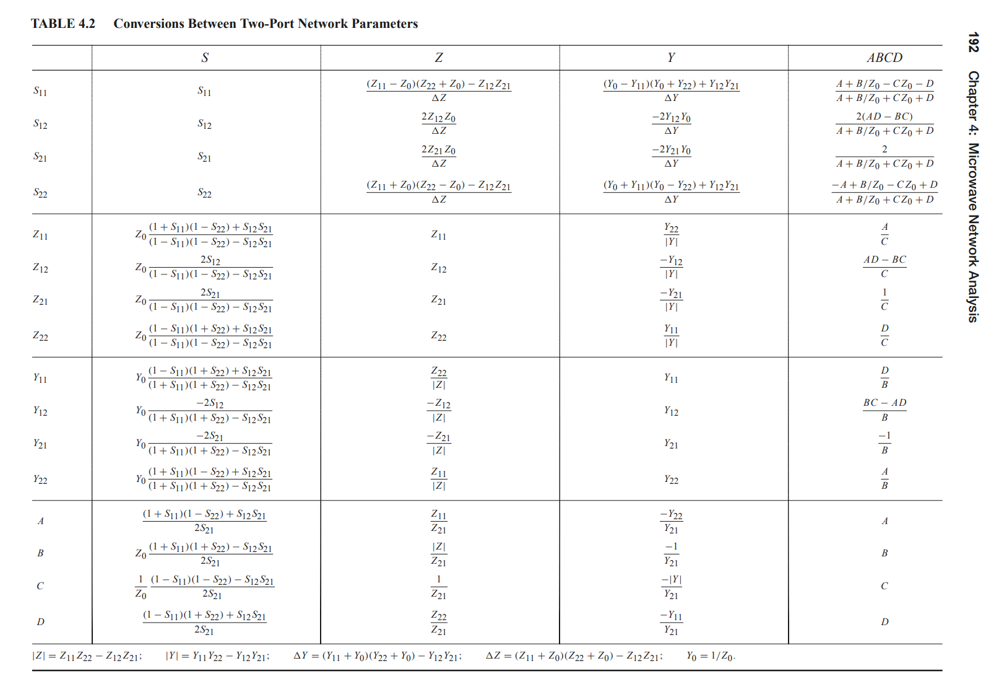

---


## Voltage scattering


## characteristic impedance ($Z_0$)

*TODO* &#128197;

---

> Remember, S-parameters **don't mean much** unless you know the value of the **reference impedance **(it's frequently called Z0).


simulator will read sp file's **Z0** parameter


> The default **Z0** exported by EMX is **50**


## Voltage Transfer Function


> 


### Reflection Coefficients


## Rational Fit


### Matlab/rationalfit

To resolve the convergence problem of s-parameter in Spectre simulator - `rationalfit` and write Verilog-A 


```matlab
filename  = 'touchstone/ISI.S4P';
s4p = read(rfdata.data, filename);
sdd_params = s2sdd(s2p.S_Parameters, 2);
sdd21 = squeeze(sdd_params(2, 1, :));   % s21
freq = s4p.Freq;

% rational fitting
weight = ones(size(sdd21));
weight(floor(end*3/4):end) = 0.2;
weight(2:10) = 0;

[hfit, errb] = rationalfit(freq, sdd21, 'IterationLimit', [4, 16], 'Delayfactor', 0.98, ...
    'Weight', weight, 'Tolerance', -38, 'NPoles', 32);
[sdd21_fit, ff] = freqresp(hfit, freq);

figure(1)
plot(freq/1e9, db(sdd21), 'b-'); hold on;
plot(ff/1e9, db(sdd21_fit), 'r-'); hold off; grid on;
legend('sdd21', 'sdd21\_fit');
xlabel('Freq (GHz)');
ylabel('magnitude (dB)');


ts = 1e-12;
n = 2^18;
trise = 4e-14;
[yout, tout] = stepresp(hfit, ts, n, trise);
figure(2)
plot(tout*1e12, yout, 'b-'); grid on;
xlabel('Time (ps)');
ylabel('V');
title('Step Response');


% write verilog-A
writeva(hfit, 'channel_32poles.va');
```


## Using S Parameters to Estimate Q

*TODO* &#128197;


> Jeff Walling. ECE 5984 Using S Parameters to Estimate Q [[https://youtu.be/PXgM6pGIRvk?si=YDeh-COQEBXKUiw-](https://youtu.be/PXgM6pGIRvk?si=YDeh-COQEBXKUiw-)]


## Simulating S-parameters in a time domain


## Transmission-line effects
*TODO* &#128197;


> E157 Introduction to Radio Frequency Circuit Design [[https://pages.hmc.edu/mspencer/e157/fa24/](https://pages.hmc.edu/mspencer/e157/fa24/)]
>
> Eric Bogatin. Pop Quiz: When is an Interconnect Not a Transmission Line? [[https://www.signalintegrityjournal.com/blogs/4-eric-bogatin-signal-integrity-journal-technical-editor/post/265-pop-quiz-when-is-an-interconnect-not-a-transmission-line](https://www.signalintegrityjournal.com/blogs/4-eric-bogatin-signal-integrity-journal-technical-editor/post/265-pop-quiz-when-is-an-interconnect-not-a-transmission-line)]
>
> Shen Lin. On-Chip Inductance and Coupling Effects [[http://eda.ee.ucla.edu/pub/asic.pdf](http://eda.ee.ucla.edu/pub/asic.pdf)]
>
> A. Deutsch *et al*., "When are transmission-line effects important for on-chip interconnections?," in *IEEE Transactions on Microwave Theory and Techniques*, vol. 45, no. 10, pp. 1836-1846, Oct. 1997
>
> Ho, Ron. “Chip Wires: Scaling and Efficiency.” (2003). [[https://www-vlsi.stanford.edu/people/alum/pdf/0303_Ho_Wires.pdf](https://www-vlsi.stanford.edu/people/alum/pdf/0303_Ho_Wires.pdf)]
>
> —. ISSCC 2007 T3: Dealing with Issues in VLSI Interconnect Scaling, by Ron Ho
>
> Tony Chan Carusone. ISSCC 2017 T6: Signal Integrity Analysis for Gb/s Links
>
> Byungsub Kim ISSCC 2022 T11: "Basics of Equalization Techniques: Channels, Equalization, and Circuits"


## reference

[microwaves101, S-parameters (https://www.microwaves101.com/encyclopedias/s-parameters)](https://www.microwaves101.com/encyclopedias/s-parameters)

Pupalaikis, P. (2020). *S-Parameters for Signal Integrity*. Cambridge: Cambridge University Press. doi:10.1017/9781108784863

Coelho, C. P., Phillips, J. R., & Silveira, L. M. (n.d.). Robust rational function approximation algorithm for model generation. Proceedings 1999 Design Automation Conference (Cat. No. 99CH36361). doi:10.1109/dac.1999.781313

Cadence IEEE IMS 2023, Introducing the Spectre S-Parameter Quality Checker and Rational Fit Model Generator [[https://support.cadence.com/apex/ArticleAttachmentPortal?id=a1O3w000009lplhEAA](https://support.cadence.com/apex/ArticleAttachmentPortal?id=a1O3w000009lplhEAA)]

The Complex Art Of Handling S-Parameters: The importance of extraction and fitting to circuit simulation involving S-parameters  [[https://semiengineering.com/the-complex-art-of-handling-s-parameters](https://semiengineering.com/the-complex-art-of-handling-s-parameters/)]

Dr. John Choma. EE 541, Fall 2006: Course Notes #2 Scattering Parameters: Concept, Theory, and Applications [[https://www.ieee.li/pdf/essay/scattering_parameters_concept_theory_applications.pdf](https://www.ieee.li/pdf/essay/scattering_parameters_concept_theory_applications.pdf)]

Dr. Ray Kwok . Network Techniques: Conversion between Filter Transfer Function and Filter Scattering (SMatrix) Parameters [[https://www.sjsu.edu/people/raymond.kwok/docs/project172/FTF%20to%20S-Matrix%20Spring%202011.pdf](https://www.sjsu.edu/people/raymond.kwok/docs/project172/FTF%20to%20S-Matrix%20Spring%202011.pdf)]
