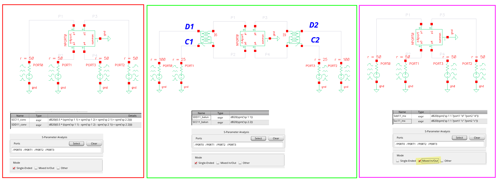
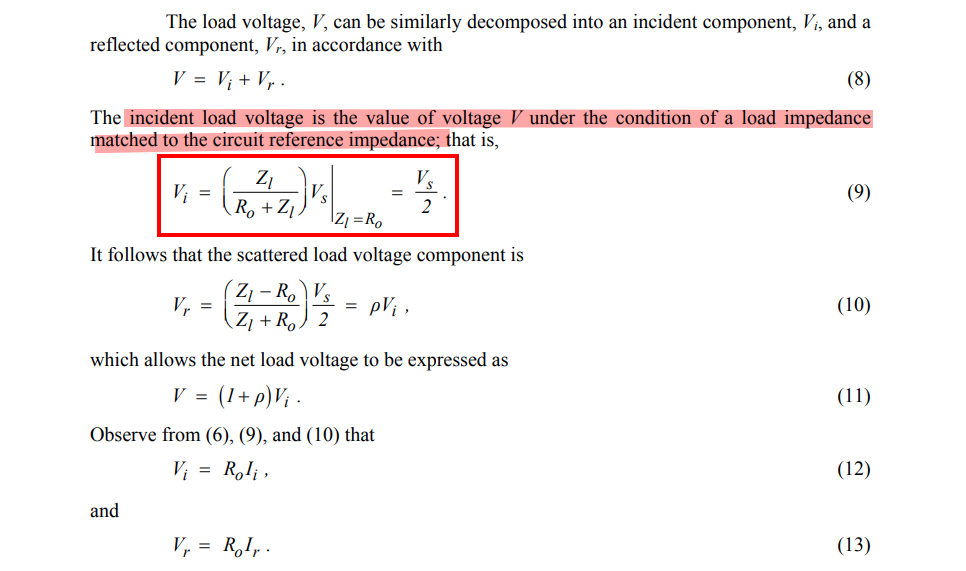
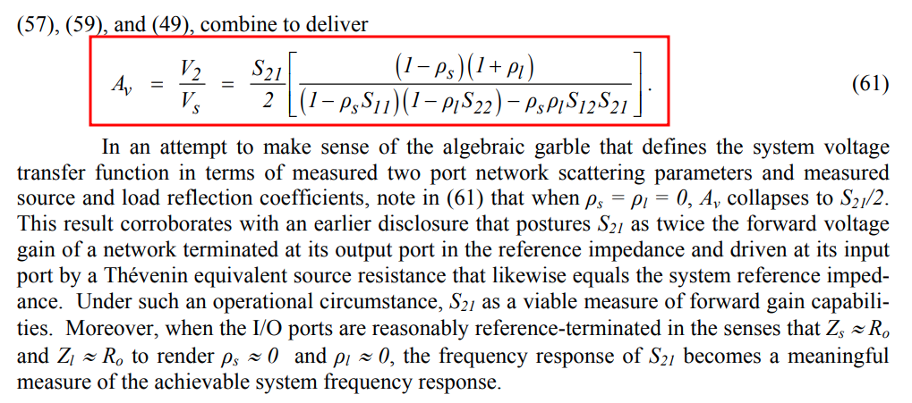
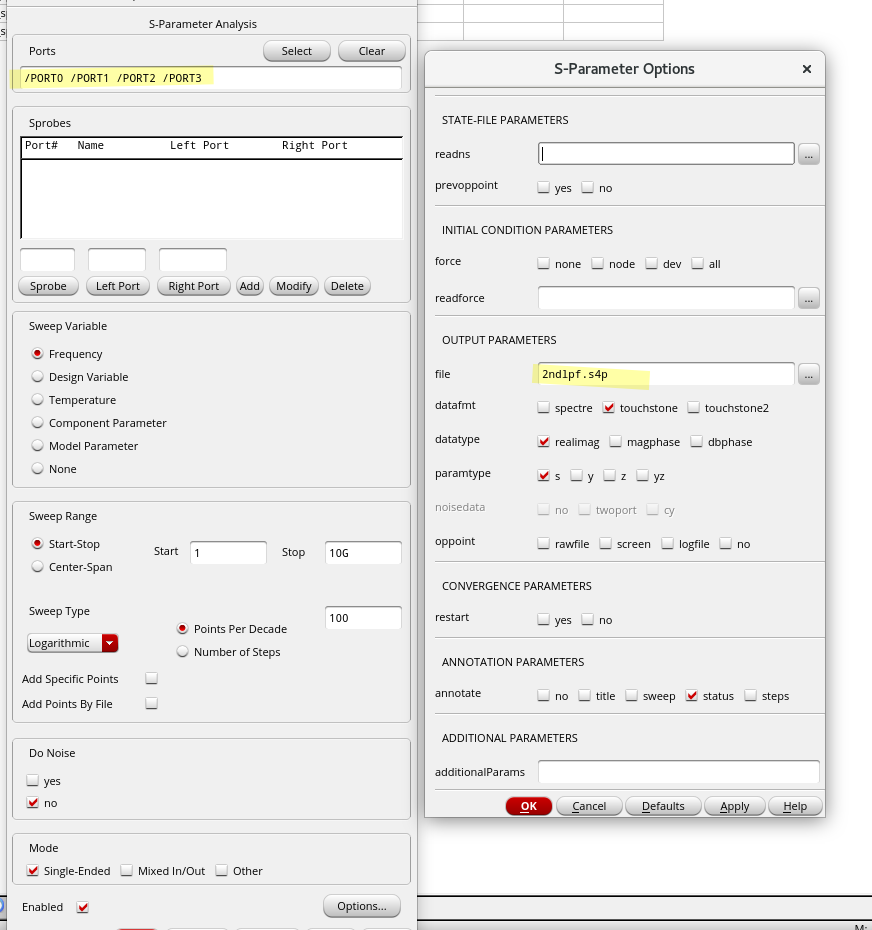

---

## Mixed-Mode S-parameter

> 12 May 2021 Introduction to Mixed-Mode S-parameters [[https://blog.teledynelecroy.com/2021/05/introduction-to-mixed-mode-s-parameters.html](https://blog.teledynelecroy.com/2021/05/introduction-to-mixed-mode-s-parameters.html)]


> Troy Beukema (IBM Research, Yorktown Heights, NY). 03-Sep-2009. *Topics in Design and Analysis of High Data Rate SERDES Systems* [[https://ewh.ieee.org/r5/denver/sscs/Presentations/2009_09_Beukema.pdf](https://ewh.ieee.org/r5/denver/sscs/Presentations/2009_09_Beukema.pdf)]
>
> 
>
> 

---

> Bert Simonovich. A Guide for Single-Ended to Mixed-Mode S-parameter Conversions [[https://www.signalintegrityjournal.com/articles/1832-a-guide-for-singleended-to-mixedmode-s-parameter-conversions](https://www.signalintegrityjournal.com/articles/1832-a-guide-for-singleended-to-mixedmode-s-parameter-conversions)]


***single-ended S-parameters***


***Mixed-mode S-parameters***


---




## Missing Term in KVL

> Prof. Kolb/Whites. EE 382 Applied Electromagnetics Lecture 8: Maxwell's Equations and Electrical CIrcuits [[http://montoya.sdsmt.edu/ee382/lectures/382Lecture8.pdf](http://montoya.sdsmt.edu/ee382/lectures/382Lecture8.pdf)]


## Transmission-line


### Telegrapher’s equations

> EECS 723- Microwave Engineering Spring 2.1 -The Lumped Element Circuit Model for Transmission Lines 
>
> 1/20/2005  [[https://www.ittc.ku.edu/~jstiles/723/handouts/2_1_Lumped_Element_Circuit_Model_package.pdf](https://www.ittc.ku.edu/~jstiles/723/handouts/2_1_Lumped_Element_Circuit_Model_package.pdf)]
>
> note [[https://www.ittc.ku.edu/~jstiles/723/handouts/section_2_1_The_Lumped_Element_Circuit_Model_package.pdf](https://www.ittc.ku.edu/~jstiles/723/handouts/section_2_1_The_Lumped_Element_Circuit_Model_package.pdf)]
>
> present [[https://www.ittc.ku.edu/~jstiles/723/handouts/section_2_1_The_Lumped_Element_Circuit_Model_present.pdf](https://www.ittc.ku.edu/~jstiles/723/handouts/section_2_1_The_Lumped_Element_Circuit_Model_present.pdf)]


### Transmission Line Wave Equation


> 


###  Characteristic Impedance ($Z_0$)


---

> Remember, S-parameters **don't mean much** unless you know the value of the **reference impedance **(it's frequently called Z0).


simulator will read sp file's **Z0** parameter


> The default **Z0** exported by EMX is **50**


### Complex Propagation Constant $\gamma$

*TODO* &#128197;


###  Input impedance (Line Impedance)


### Reflection Coefficient

*TODO* &#128197;


### Steady-State Solution (DC voltage division)

> Sam Palermo. [[https://people.engr.tamu.edu/spalermo/ecen689/lecture3_ee689_tlines.pdf](https://people.engr.tamu.edu/spalermo/ecen689/lecture3_ee689_tlines.pdf)]
>
> Kyoung-Jae Chung. Special Topics in Radiation Engineering (High-voltage pulsed power engineering) [[https://ocw.snu.ac.kr/sites/default/files/NOTE/Lecture_03_Transmission%20line%20theory.pdf](https://ocw.snu.ac.kr/sites/default/files/NOTE/Lecture_03_Transmission%20line%20theory.pdf)]
>
> David R. Jackson. [[https://courses.egr.uh.edu/ECE/ECE3317/SectionJackson/Class%20Notes/Notes%208%203317%20Transmission%20Lines%20(Bounce%20Diagram).pdf](https://courses.egr.uh.edu/ECE/ECE3317/SectionJackson/Class%20Notes/Notes%208%203317%20Transmission%20Lines%20(Bounce%20Diagram).pdf)]
>
> Shouri Chatterjee [[https://web.iitd.ac.in/~shouri/ell112/material/txline.pdf](https://web.iitd.ac.in/~shouri/ell112/material/txline.pdf)]
>
> How can I go from transmission line model to lumped elements model? [[https://physics.stackexchange.com/a/386603](https://physics.stackexchange.com/a/386603)]


---


> E157 Introduction to Radio Frequency Circuit Design [[https://pages.hmc.edu/mspencer/e157/fa24/](https://pages.hmc.edu/mspencer/e157/fa24/)]
>
> Shen Lin. On-Chip Inductance and Coupling Effects [[http://eda.ee.ucla.edu/pub/asic.pdf](http://eda.ee.ucla.edu/pub/asic.pdf)]
>
> A. Deutsch *et al*., "When are transmission-line effects important for on-chip interconnections?," in *IEEE Transactions on Microwave Theory and Techniques*, vol. 45, no. 10, pp. 1836-1846, Oct. 1997
>
> Ho, Ron. “Chip Wires: Scaling and Efficiency.” (2003). [[https://www-vlsi.stanford.edu/people/alum/pdf/0303_Ho_Wires.pdf](https://www-vlsi.stanford.edu/people/alum/pdf/0303_Ho_Wires.pdf)]
>
> —. ISSCC 2007 T3: Dealing with Issues in VLSI Interconnect Scaling, by Ron Ho
>
> Tony Chan Carusone. ISSCC 2017 T6: Signal Integrity Analysis for Gb/s Links
>
> Byungsub Kim ISSCC 2022 T11: "Basics of Equalization Techniques: Channels, Equalization, and Circuits"


## Voltage scattering




**transmitted voltage**
$$
V= \frac{2Z_l}{Z_l+R_0}\frac{V_s}{2}= \frac{Z_l}{Z_l+R_0}\cdot V_s
$$


---


> 


> CHAPTER 6 Transmission-Line Essentials for Digital Electronics [[https://ws.engr.illinois.edu/sitemanager/getfile.asp?id=178](https://ws.engr.illinois.edu/sitemanager/getfile.asp?id=178)]
>
> CHAPTER 7 Transmission-Line Analysis [[https://ws.engr.illinois.edu/sitemanager/getfile.asp?id=199](https://ws.engr.illinois.edu/sitemanager/getfile.asp?id=199)]


## Voltage Transfer Function




> 

---

> Troy Beukema (IBM Research, Yorktown Heights, NY). 03-Sep-2009. *Topics in Design and Analysis of High Data Rate SERDES Systems* [[https://ewh.ieee.org/r5/denver/sscs/Presentations/2009_09_Beukema.pdf](https://ewh.ieee.org/r5/denver/sscs/Presentations/2009_09_Beukema.pdf)]


---


## Impulse Response from S-Parameters (channel)

> David Banas. *A comparison of different techniques (i.e. - windowing, vector fitting, etc.) for extracting the impulse response from S-parameters.* [[https://github.com/capn-freako/ImpulseResponseFromSparameters/tree/main](https://github.com/capn-freako/ImpulseResponseFromSparameters/tree/main)]
>
> Sam Palermo. ECEN720: High-Speed Links Circuits and Systems Spring 2025 - Lecture 3: Time-Domain Reflectometry & S-Parameter Channel Models [[https://people.engr.tamu.edu/spalermo/ecen689/lecture3_ee720_tdr_spar.pdf](https://people.engr.tamu.edu/spalermo/ecen689/lecture3_ee720_tdr_spar.pdf)]
>
> Troy Beukema (IBM Research, Yorktown Heights, NY). 03-Sep-2009. *Topics in Design and Analysis of High Data Rate SERDES Systems* [[https://ewh.ieee.org/r5/denver/sscs/Presentations/2009_09_Beukema.pdf](https://ewh.ieee.org/r5/denver/sscs/Presentations/2009_09_Beukema.pdf)]


### Causality


### causality-passivity correction

> P. Triverio, S. Grivet-Talocia, M. S. Nakhla, F. G. Canavero and R. Achar, "Stability, Causality, and Passivity in Electrical Interconnect Models," in *IEEE Transactions on Advanced Packaging*, vol. 30, no. 4, pp. 795-808, Nov. 2007 [[https://sci-hub.ru/10.1109/TADVP.2007.901567](https://sci-hub.ru/10.1109/TADVP.2007.901567)]
>
> S. Sercu, C. Kocuba, J. Nadolny, "Causality Demystified", in DesignCon 2015, Jan. 2015 [[pdf](https://suddendocs.samtec.com/notesandwhitepapers/14-th1paper_causalitydemystified.pdf)] 
>
> Vinod Arjun Huddar. Causality Problems in Power Delivery Networks [[https://www.signalintegrityjournal.com/articles/1217-causality-in-power-delivery-network-in-package-board](https://www.signalintegrityjournal.com/articles/1217-causality-in-power-delivery-network-in-package-board)]
>
> Tyler Huddleston, Signal Edge Solutions. Causality in Practice: How Frequency Sampling and Bandwidth Shape Time-Domain Fidelity [[https://www.signalintegrityjournal.com/articles/4061-causality-in-practice-how-frequency-sampling-and-bandwidth-shape-time-domain-fidelity ](https://www.signalintegrityjournal.com/articles/4061-causality-in-practice-how-frequency-sampling-and-bandwidth-shape-time-domain-fidelity )]


$H_e(f) = \mathcal{Re}\{H(f)\}$, $H_o(f) = j\cdot\mathcal{Im}\{H(f)\}$ and $\enclose{circle}{1}$ , $\enclose{circle}{2}$ 

---


### Rational Fit

Use the [`rational`](https://www.mathworks.com/help/rf/ref/rational.html) function to fit data defined in the frequency domain with an equivalent Laplace transfer function. Using rational function fitting you can create simple models for a required accuracy, model order reduction, zero phase on extrapolation to DC, and **causal** modeling system among other advantages


```matlab
filename  = 'touchstone/ISI.S4P';
s4p = read(rfdata.data, filename);
sdd_params = s2sdd(s2p.S_Parameters, 2);
sdd21 = squeeze(sdd_params(2, 1, :));   % s21
freq = s4p.Freq;

% rational fitting
weight = ones(size(sdd21));
weight(floor(end*3/4):end) = 0.2;
weight(2:10) = 0;

[hfit, errb] = rationalfit(freq, sdd21, 'IterationLimit', [4, 16], 'Delayfactor', 0.98, ...
    'Weight', weight, 'Tolerance', -38, 'NPoles', 32);
[sdd21_fit, ff] = freqresp(hfit, freq);

figure(1)
plot(freq/1e9, db(sdd21), 'b-'); hold on;
plot(ff/1e9, db(sdd21_fit), 'r-'); hold off; grid on;
legend('sdd21', 'sdd21\_fit');
xlabel('Freq (GHz)');
ylabel('magnitude (dB)');


ts = 1e-12;
n = 2^18;
trise = 4e-14;
[yout, tout] = stepresp(hfit, ts, n, trise);
figure(2)
plot(tout*1e12, yout, 'b-'); grid on;
xlabel('Time (ps)');
ylabel('V');
title('Step Response');


% write verilog-A
writeva(hfit, 'channel_32poles.va');
```


## Tline Approximation

> Eric Bogatin. Pop Quiz: When is an Interconnect Not a Transmission Line? [[https://www.signalintegrityjournal.com/blogs/4-eric-bogatin-signal-integrity-journal-technical-editor/post/265-pop-quiz-when-is-an-interconnect-not-a-transmission-line](https://www.signalintegrityjournal.com/blogs/4-eric-bogatin-signal-integrity-journal-technical-editor/post/265-pop-quiz-when-is-an-interconnect-not-a-transmission-line)]


## Using S Parameters to Estimate Q

*TODO* &#128197;


> Jeff Walling. ECE 5984 Using S Parameters to Estimate Q [[https://youtu.be/PXgM6pGIRvk?si=YDeh-COQEBXKUiw-](https://youtu.be/PXgM6pGIRvk?si=YDeh-COQEBXKUiw-)]


## Reading S-parameters

> teledynelecroy. Reading S-parameters [[https://blog.teledynelecroy.com/2020/05/](https://blog.teledynelecroy.com/2020/05/)]
>
> keysight. How to Interpret Ripple in an S Parameters Measurement [[https://docs.keysight.com/kkbopen/how-to-interpret-ripple-in-an-s-parameters-measurement-849642201.html](https://docs.keysight.com/kkbopen/how-to-interpret-ripple-in-an-s-parameters-measurement-849642201.html)]
>
> You Measured What? Four Must-Know Checks Before Trusting Your Trace S-Parameters [[https://www.signalintegrityjournal.com/articles/4083-you-measured-what-four-must-know-checks-before-trusting-your-trace-s-parameters](https://www.signalintegrityjournal.com/articles/4083-you-measured-what-four-must-know-checks-before-trusting-your-trace-s-parameters)]

*TODO* &#128197;

### Ripple in an S Parameters


## S11 vs TDR

> [[https://ewh.ieee.org/r5/denver/sscs/Presentations/2004_04_Quach.pdf](https://ewh.ieee.org/r5/denver/sscs/Presentations/2004_04_Quach.pdf)]

*TODO* &#128197;


## Spar in Tran simulation


## Spar in AC simulation


> 


## reference

[microwaves101, S-parameters (https://www.microwaves101.com/encyclopedias/s-parameters)](https://www.microwaves101.com/encyclopedias/s-parameters)

Pupalaikis, P. (2020). *S-Parameters for Signal Integrity*. Cambridge: Cambridge University Press. doi:10.1017/9781108784863

Coelho, C. P., Phillips, J. R., & Silveira, L. M. (n.d.). Robust rational function approximation algorithm for model generation. Proceedings 1999 Design Automation Conference (Cat. No. 99CH36361).  [[https://sci-hub.ru/10.1109/dac.1999.781313](https://sci-hub.ru/10.1109/dac.1999.781313)]

Cadence IEEE IMS 2023, Introducing the Spectre S-Parameter Quality Checker and Rational Fit Model Generator [[https://support.cadence.com/apex/ArticleAttachmentPortal?id=a1O3w000009lplhEAA](https://support.cadence.com/apex/ArticleAttachmentPortal?id=a1O3w000009lplhEAA)]

The Complex Art Of Handling S-Parameters: The importance of extraction and fitting to circuit simulation involving S-parameters  [[https://semiengineering.com/the-complex-art-of-handling-s-parameters](https://semiengineering.com/the-complex-art-of-handling-s-parameters/)]

Dr. John Choma. EE 541, Fall 2006: Course Notes #2 Scattering Parameters: Concept, Theory, and Applications [[https://www.ieee.li/pdf/essay/scattering_parameters_concept_theory_applications.pdf](https://www.ieee.li/pdf/essay/scattering_parameters_concept_theory_applications.pdf)]

Dr. Ray Kwok . Network Techniques: Conversion between Filter Transfer Function and Filter Scattering (SMatrix) Parameters [[https://www.sjsu.edu/people/raymond.kwok/docs/project172/FTF%20to%20S-Matrix%20Spring%202011.pdf](https://www.sjsu.edu/people/raymond.kwok/docs/project172/FTF%20to%20S-Matrix%20Spring%202011.pdf)]

田庆诚教授 台湾中华大学 射频电路基础（公司培训）[[https://www.bilibili.com/video/BV1LA41177wr/?p=3&share_source=copy_web&vd_source=5a095c2d604a5d4392ea78fa2bbc7249](https://www.bilibili.com/video/BV1LA41177wr/?p=3&share_source=copy_web&vd_source=5a095c2d604a5d4392ea78fa2bbc7249)]

Bogatin, E. (2018). *Signal and power integrity, simplified*. Prentice Hall. [[pdf](https://www.oldfriend.url.tw/article/SI_PI_book/Signal%20and%20Power%20Integrity%20-%20Simplified_2nd_Eric%20Bogatin_Prentice%20Hall%20PTR_2010.pdf)]

