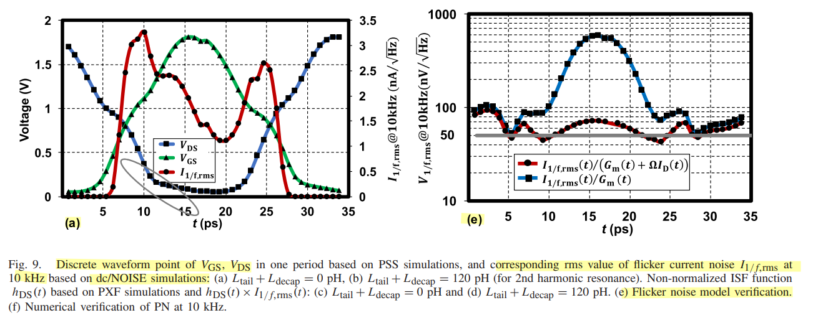

A dynamical system can be linear or nonlinear. Independently, it can be deterministic or stochastic. Continuous-time deterministic systems are commonly modeled by ODEs, while continuous-time stochastic systems are commonly modeled by SDEs

|               | Deterministic | Stochastic    |
| ------------- | ------------- | ------------- |
| **Linear**    | Linear ODE    | Linear SDE    |
| **Nonlinear** | Nonlinear ODE | Nonlinear SDE |

The two classifications answer different questions:

- **Linear/nonlinear:** How does the state enter the evolution equation?
- **Deterministic/stochastic:** Does the evolution include randomness?

---

For Demir’s oscillator theory, however, the main path is
$$
\boxed{
\text{nonlinear deterministic ODE}
\rightarrow
\text{add device noise}
\rightarrow
\text{nonlinear SDE}
}
$$

## flicker noise upconversion

> Y. Hu, T. Siriburanon and R. B. Staszewski, "A Low-Flicker-Noise 30-GHz Class-F23 Oscillator in 28-nm CMOS Using Implicit Resonance and Explicit Common-Mode Return Path," in *IEEE Journal of Solid-State Circuits*, vol. 53, no. 7, pp. 1977-1987, July 2018 [[https://ieeexplore.ieee.org/stamp/stamp.jsp?tp=&arnumber=8345650](https://ieeexplore.ieee.org/stamp/stamp.jsp?tp=&arnumber=8345650)]
>
> —, "Intuitive Understanding of Flicker Noise Reduction via Narrowing of Conduction Angle in Voltage-Biased Oscillators," in IEEE Transactions on Circuits and Systems II: Express Briefs, vol. 66, no. 12, pp. 1962-1966, Dec. 2019 [[https://sci-hub.se/10.1109/TCSII.2019.2896483](https://sci-hub.se/10.1109/TCSII.2019.2896483)]
>
> —, "Oscillator Flicker Phase Noise: A Tutorial," in *IEEE Transactions on Circuits and Systems II: Express Briefs*, vol. 68, no. 2, pp. 538-544, Feb. 2021 [[paper](https://ieeexplore.ieee.org/stamp/stamp.jsp?tp=&arnumber=9286468)] [[slides](https://www.researchgate.net/publication/352173342_Oscillator_Flicker_Phase_Noise_A_Tutorial)]
>
> E. G. Ioannidis, C. G. Theodorou, T. A. Karatsori, S. Haendler, C. A. Dimitriadis and G. Ghibaudo, "Drain-Current Flicker Noise Modeling in nMOSFETs From a 14-nm FDSOI Technology," in IEEE Transactions on Electron Devices, vol. 62, no. 5, pp. 1574-1579, May 2015 [[https://sci-hub.jp/10.1109/TED.2015.2411678](https://sci-hub.jp/10.1109/TED.2015.2411678)]

### Flicker Noise Modulation

MOS flicker noise in large-signal setting can be treated as a stationary, bias-independent series gate source $v_{1/f}$ converted to drain current by the deterministic periodic modulation

$$
m(t) = G_m(t) + \Omega I_D(t)
$$

### Flicker Noise Formulations in Compact Models

> G. J. Coram, C. C. McAndrew, K. K. Gullapalli and K. S. Kundert, "Flicker Noise Formulations in Compact Models," in *IEEE Transactions on Computer-Aided Design of Integrated Circuits and Systems*, vol. 39, no. 10, pp. 2812-2821, Oct. 2020 [[https://kenkundert.com/docs/tcad20-flicker-noise.pdf](https://kenkundert.com/docs/tcad20-flicker-noise.pdf)],[[https://github.com/KenKundert/flicker-noise](https://github.com/KenKundert/flicker-noise)]
>
> BSIM4v4.7 MOSFET Model -User's Manual [[https://class.ece.iastate.edu/djchen/ee501/BSIM470_Manual.pdf](https://class.ece.iastate.edu/djchen/ee501/BSIM470_Manual.pdf)]

### flicker noise in circuit-noise analysis

its power spectral density is approximately
$$
S_{i,1/f}(f)=\frac{K}{|f|}.
$$
**A large amount of its power lies at low frequencies.** Therefore, compared with a GHz oscillation period $T_0$, the flicker-noise value changes very little during one cycle.

For a flicker-noise component at frequency $f_m$,
$$
f_m T_0\ll 1
$$
implies
$$
i_{1/f}(t+T_0)\approx i_{1/f}(t).
$$
Thus, if the noise current is positive at $t_0$, it will probably remain positive throughout the following oscillator cycle:
$$
i_{1/f}(t_0+\tau)\approx i_{1/f}(t_0),
\qquad 0\leq \tau<T_0.
$$
In circuit-noise analysis, the underlying flicker-noise source is commonly treated as approximately **wide-sense stationary**:
$$
R_x(t_1,t_2)=R_x(t_1-t_2).
$$
This is reasonable when the device bias is constant and the measurement interval is finite.

The phase perturbations may cancel or leave a nonzero residual:
$$
\Delta\phi_{\text{cycle}}
\propto
\int_{0}^{T_0}
\Gamma(\omega_0 t)\,
i_{1/f,\mathrm{cyclo}}(t)\,dt.
$$
Since the low-frequency noise is almost constant over $T_0$,
$$
\Delta\phi_{\text{cycle}}
\approx
x_{1/f}(t_0)
\int_{0}^{T_0}
\Gamma(\omega_0 t)a(t)\,dt
$$
Therefore, flicker-noise upconversion depends on whether the phase-delay and phase-advance contributions cancel over one period. A nonzero weighted average produces low-frequency fluctuations in oscillator frequency, which commonly appear as the $1/f^3$ phase-noise region.

Define

$$
\Gamma_{\mathrm{eff,DC}}\equiv \frac{1}{T_0}\int_0^{T_0}\Gamma(\omega_0t)a(t)\,dt
$$

Then
$$
\Delta\phi_{\text{cycle}}
\approx
\frac{x_{1/f}(t_0)}{q_{\max}}
\Gamma_{\mathrm{eff,DC}}T_0.
$$
If $x_{1/f}$ is already normalized by $q_{\max}$, the $1/q_{\max}$ factor can be omitted.

Therefore,
$$
\boxed{\Gamma_{\mathrm{eff,DC}}=0
\quad\Longrightarrow\quad
\Delta\phi_{\text{cycle}}\approx 0}
$$
for quasistatic flicker noise. Physically, the phase-delay contribution on one edge exactly cancels the phase-advance contribution on the other edge.nce,
$$
\boxed{
\Gamma_{\mathrm{eff,DC}}=0
\Rightarrow
\text{no first-order direct }1/f\text{-to-}1/f^3
\text{ phase-noise upconversion from that source.}
}
$$

## Mathematical Preliminaries

> Strogatz, S.H. (2015). **Nonlinear Dynamics and Chaos: With Applications to Physics, Biology, Chemistry, and Engineering (2nd ed.)**. CRC Press [[https://www.biodyn.ro/course/literatura/Nonlinear_Dynamics_and_Chaos_2018_Steven_H._Strogatz.pdf](https://www.biodyn.ro/course/literatura/Nonlinear_Dynamics_and_Chaos_2018_Steven_H._Strogatz.pdf)]
>
> Higham, Desmond. (2001). An Algorithmic Introduction to Numerical Simulation of Stochastic Differential Equations. SIAM Review. 43. 525-546. 10.1137/S0036144500378302. [[https://www.cmor-faculty.rice.edu/~cox/stoch/dhigham.pdf](https://www.cmor-faculty.rice.edu/~cox/stoch/dhigham.pdf)]
>
> Jiří Lebl. **Notes on Diffy Qs: Differential Equations for Engineers** [[link](https://www.jirka.org/diffyqs/)]
>
> Matt Charnley. **Differential Equations: An Introduction for Engineers** [[link](https://sites.rutgers.edu/matthew-charnley/course-materials/differential-equations-an-introduction-for-engineers/)]
>
> Åström, K.J. & Murray, Richard. (2021). **Feedback Systems: An Introduction for Scientists and Engineers Second Edition** [[https://www.cds.caltech.edu/~murray/books/AM08/pdf/fbs-public_24Jul2020.pdf](https://www.cds.caltech.edu/~murray/books/AM08/pdf/fbs-public_24Jul2020.pdf)]
>

## reference

A. Demir, A. Mehrotra and J. Roychowdhury, "Phase noise in oscillators: a unifying theory and numerical methods for characterization," in *IEEE Transactions on Circuits and Systems I: Fundamental Theory and Applications*, vol. 47, no. 5, pp. 655-674, May 2000 [[https://sci-hub.jp/10.1109/81.847872](https://sci-hub.jp/10.1109/81.847872)]

—, "A Reliable and Efficient Procedure for Oscillator PPV Computation, With Phase Noise Macromodeling Applications," IEEE TCAD, 2003.

— and A. Sangiovanni-Vincentelli, *Analysis and Simulation of Noise in Nonlinear Electronic Circuits and Systems*, vol. 425. Boston, MA, USA: Kluwer Academic Publishers, 1998

A. Mehrotra and A. Sangiovanni-Vincentelli, *Noise Analysis of Radio Frequency Circuits*, 1st ed. New York, NY, USA: Springer, 2004

Darabi H. Radio Frequency Integrated Circuits and Systems. 2nd ed. Cambridge University Press; 2020.
