A dynamical system can be linear or nonlinear. Independently, it can be deterministic or stochastic. Continuous-time deterministic systems are commonly modeled by ODEs, while continuous-time stochastic systems are commonly modeled by SDEs

|               | Deterministic | Stochastic    |
| ------------- | ------------- | ------------- |
| **Linear**    | Linear ODE    | Linear SDE    |
| **Nonlinear** | Nonlinear ODE | Nonlinear SDE |

The two classifications answer different questions:

- **Linear/nonlinear:** How does the state enter the evolution equation?
- **Deterministic/stochastic:** Does the evolution include randomness?


---

For Demir’s oscillator theory, however, the main path is
$$
\boxed{
\text{nonlinear deterministic ODE}
\rightarrow
\text{add device noise}
\rightarrow
\text{nonlinear SDE}
}
$$


##  instantaneous & average PSD

For white noise $n(t)$

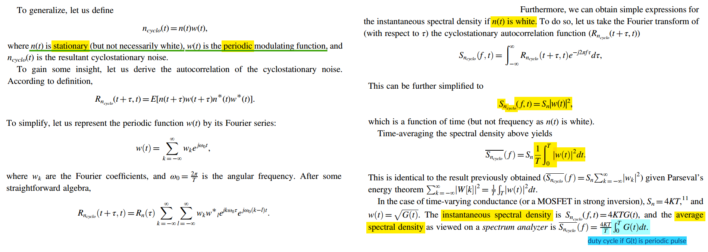


## flicker noise Modulation


### flicker noise spectrum

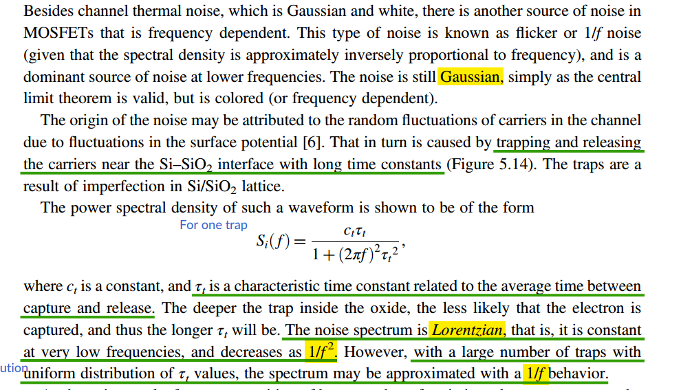

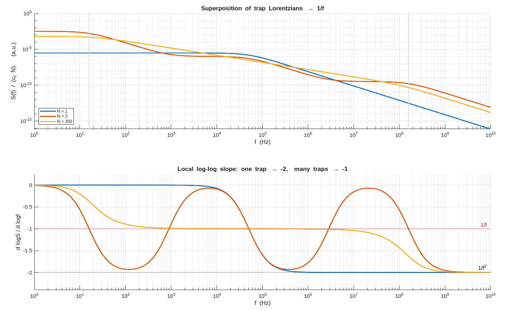

```matlab
f       = logspace(0, 10, 4000);      % 1 Hz ... 10 GHz
tau_min = 1e-9;                       % fastest trap (corner ~160 MHz)
tau_max = 1e-2;                       % slowest trap (corner ~16 Hz)
r       = tau_max/tau_min;            % 7 decades of time constants
Nlist   = [1 3 300];            % number of superposed traps

figure('Color','w','Position',[100 60 720 800]);

% ------------------------------ spectra ------------------------------
ax1 = subplot(2,1,1); hold(ax1,'on');
for m = 1:numel(Nlist)
    N = Nlist(m);
    if N == 1
        tau = sqrt(tau_min*tau_max);                        % mid-band trap
    else
        tau = logspace(log10(tau_min), log10(tau_max), N);  % log-spaced
    end
    S = zeros(size(f));
    for k = 1:numel(tau)
        S = S + tau(k) ./ (1 + (2*pi*f*tau(k)).^2);         % c_t = 1
    end
    % Every Lorentzian carries the same total power (integral over f = 1/4
    % regardless of tau), so dividing by N keeps the total variance fixed:
    S = S/N;
    plot(ax1, f, S, 'LineWidth', 2, 'DisplayName', sprintf('N = %d', N));
end

xline(ax1, 1/(2*pi*tau_max), 'Color', [.85 .85 .85], 'LineWidth',2, 'HandleVisibility', 'off');
xline(ax1, 1/(2*pi*tau_min), 'Color', [.85 .85 .85], 'LineWidth',2, 'HandleVisibility', 'off');
set(ax1, 'XScale','log', 'YScale','log'); grid(ax1,'on');
xlim(ax1, [f(1) f(end)]);
xlabel(ax1, 'f  (Hz)'); ylabel(ax1, 'S(f) / (c_t N)   (a.u.)');
title(ax1, 'Superposition of trap Lorentzians \rightarrow 1/f');
legend(ax1, 'Location', 'southwest', 'FontSize', 8);

% --------------------------- local slope -----------------------------
ax2 = subplot(2,1,2); hold(ax2,'on');
for m = 1:numel(Nlist)
    N = Nlist(m);
    if N == 1
        tau = sqrt(tau_min*tau_max);
    else
        tau = logspace(log10(tau_min), log10(tau_max), N);
    end
    S = zeros(size(f));
    for k = 1:numel(tau)
        S = S + tau(k) ./ (1 + (2*pi*f*tau(k)).^2);
    end
    plot(ax2, f, gradient(log(S))./gradient(log(f)), 'LineWidth', 2);
end
% plot(ax2, f, gradient(log(SL))./gradient(log(f)), '-.', 'Color', [.55 .55 .55]);
yline(ax2, -1, ':', '1/f',   'Color', [.85 .1 .2], 'LineWidth', 1.2);
yline(ax2, -2, ':', '1/f^2', 'Color', 'k');
xline(ax2, 1/(2*pi*tau_max), 'Color', [.85 .85 .85], 'LineWidth', 2);
xline(ax2, 1/(2*pi*tau_min), 'Color', [.85 .85 .85], 'LineWidth', 2);
set(ax2, 'XScale', 'log'); grid(ax2,'on');
xlim(ax2, [f(1) f(end)]); ylim(ax2, [-2.4 0.25]);
xlabel(ax2, 'f  (Hz)'); ylabel(ax2, 'd logS / d logf');
title(ax2, 'Local log-log slope: one trap \rightarrow -2,  many traps \rightarrow -1');
```


### numerical generation of flicker noise

> Bibbona, Enrico, Gianna Panfilo and Patrizia Tavella. "The Ornstein–Uhlenbeck process as a model of a low pass filtered white noise." *Metrologia* 45 (2008): S117 - S126. [[https://iris.polito.it/retrieve/e384c42f-3847-d4b2-e053-9f05fe0a1d67/OUasFWN_finale.pdf](https://iris.polito.it/retrieve/e384c42f-3847-d4b2-e053-9f05fe0a1d67/OUasFWN_finale.pdf)]

**Ornstein–Uhlenbeck process**, equivalently **white noise passed through a first-order low-pass filter**

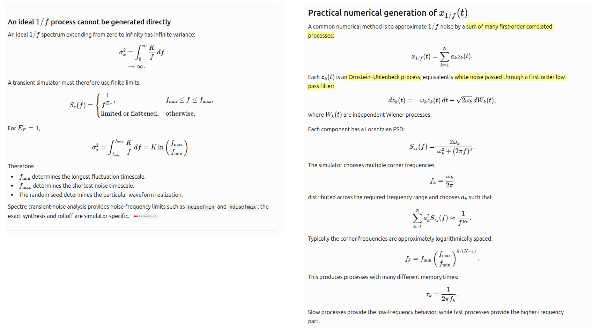

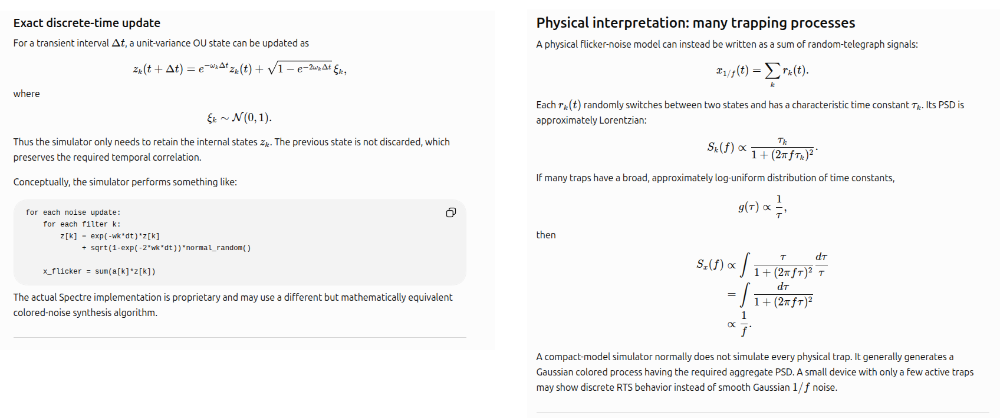

### Flicker Noise Formulations in Verilog-A

> G. J. Coram, C. C. McAndrew, K. K. Gullapalli and K. S. Kundert, "Flicker Noise Formulations in Compact Models," in *IEEE Transactions on Computer-Aided Design of Integrated Circuits and Systems*, vol. 39, no. 10, pp. 2812-2821, Oct. 2020 [[https://kenkundert.com/docs/tcad20-flicker-noise.pdf](https://kenkundert.com/docs/tcad20-flicker-noise.pdf)],[[https://github.com/KenKundert/flicker-noise](https://github.com/KenKundert/flicker-noise)]
>
> BSIM4v4.7 MOSFET Model -User's Manual [[https://class.ece.iastate.edu/djchen/ee501/BSIM470_Manual.pdf](https://class.ece.iastate.edu/djchen/ee501/BSIM470_Manual.pdf)]
>
> C. C. McAndrew *et al*., "Best Practices for Compact Modeling in Verilog-A," in *IEEE Journal of the Electron Devices Society*, vol. 3, no. 5, pp. 383-396, Sept. 2015 [[https://ieeexplore.ieee.org/stamp/stamp.jsp?arnumber=7154394](https://ieeexplore.ieee.org/stamp/stamp.jsp?arnumber=7154394)]


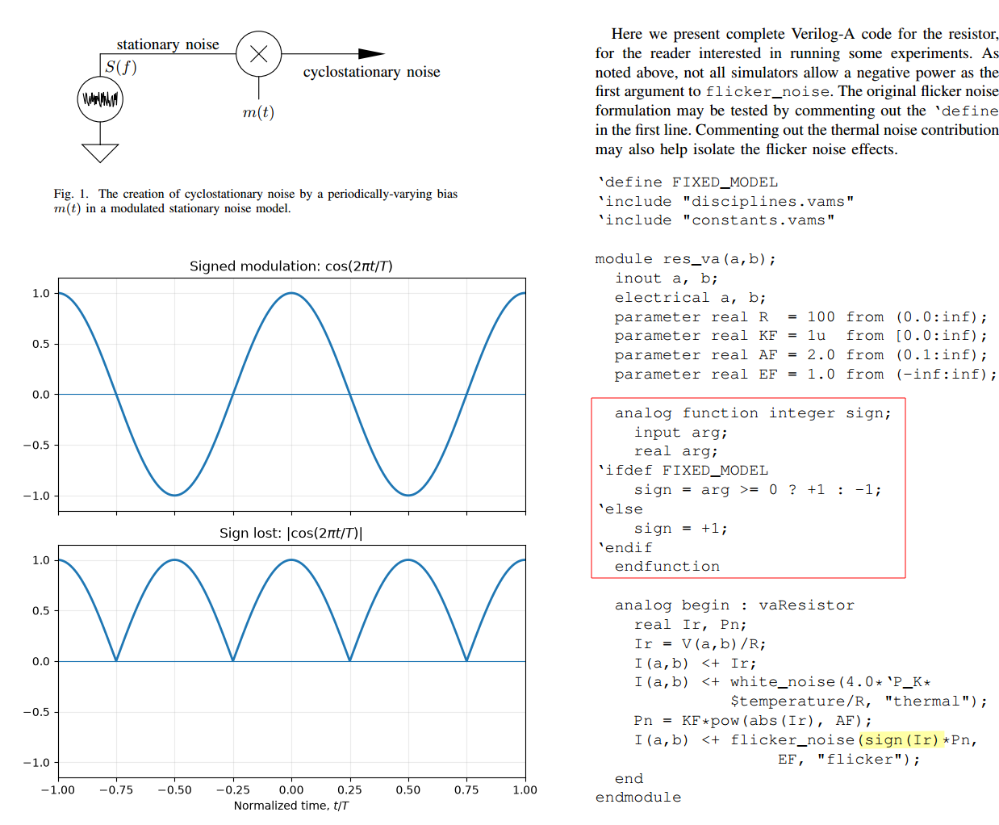

When `sign(Ir) = -1`, the argument becomes
$$
q(t)=\operatorname{sign}(I_r)P_n=-P_n.
$$
A simulator that correctly supports Kundert’s formulation does **not** interpret this as a physically negative PSD, nor does it calculate the ordinary complex square root $\sqrt{-P_n}$. Instead, the sign selects the sign of the deterministic noise-modulation amplitude:
$$
\boxed{
m(t)=\operatorname{sign}\!\big(q(t)\big)\sqrt{|q(t)|}
}
$$
Therefore, when $q=-P_n$,
$$
m(t)=-\sqrt{P_n}.
$$
This is equivalent to

```
I(a,b) <+ sign(Ir)*flicker_noise(Pn, EF, "flicker");
```

provided the simulator supports a noise function inside an expression

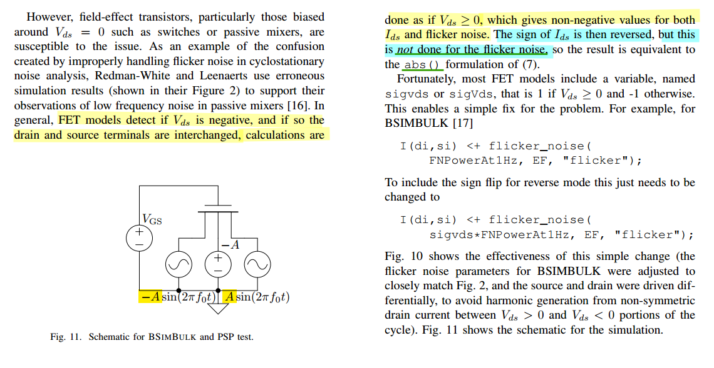

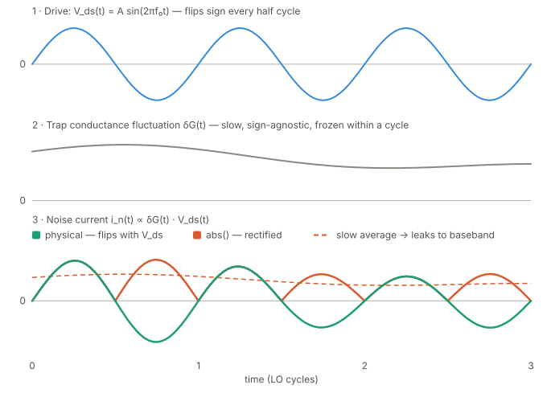

```verilog
// BSIM flicker noise simulations

simulator lang=spectre

model nchbsim4_f0 bsim4      fnoimod=0 kf=1e-23 af=2
model nchbsim4_f1 bsim4      fnoimod=1

Vmod (mod 0) vsource type=sine dc=1.0 sinedc=0.0 ampl=100mV freq=131.072kHz
ED (d 0 mod 0) vcvs gain=1
ES (s 0 mod 0) vcvs gain=-1
VG (g 0) vsource dc=3
VB (b 0) vsource dc=-0.2

MBSIM4f0 (d_f0 g s b) nchbsim4_f0 l=1um w=10um
MBSIM4f1 (d_f1 g s b) nchbsim4_f1 l=1um w=10um

iRESf0 (d d_f0) vsource dc=0.0
iRESf1 (d d_f1) vsource dc=0.0
Rout (noise 0) resistor isnoisy=no r=100kOhm
Hnoise (noise  0) pccvs coeffs=[0 1 1] probes=[iRESf0 iRESf1]

noise (noise 0) noise start=4_Hz stop=4.194304MHz dec=2k
pop pss fund=131.072kHz
pnoise (noise 0) pnoise start=4_Hz stop=4.194304MHz dec=2k maxsideband=10
```


```verilog
// Resistor flicker noise simulations

simulator lang=spectre

ahdl_include "resistor.va"

model rref resistor kf=1.0e-6 af=2  // to match res_va

Vmod   (n 0) vsource type=sine dc=1.0 sinedc=0.0 ampl=100mV freq=131.072kHz
Rva    (n 0) res_va
Rref   (n 0) rref r=100.0

noise        noise start=4_Hz stop=4.194304MHz dec=2k oprobe=Vmod
pss          pss fund=131.072kHz maxacfreq=4.194304MHz
pnoise       pnoise start=4_Hz stop=4.194304MHz dec=2k maxsideband=10 oprobe=Vmod
```


---

> Marek Mierzwinski, Verilog-A Standardization for Compact Modeling [[https://www.mos-ak.org/washington_dc/papers/Mierzwinski_MOS-AK_2011.pdf](https://www.mos-ak.org/washington_dc/papers/Mierzwinski_MOS-AK_2011.pdf)]

Current BSIM models use compact-model equations standardized through reference Verilog-A code, but commercial simulators often execute an optimized built-in implementation rather than the Verilog-A source directly

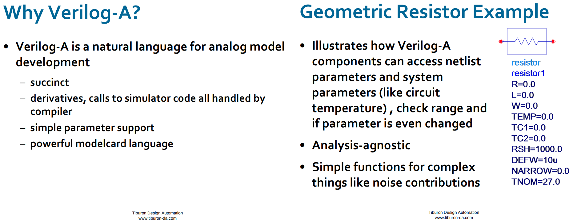

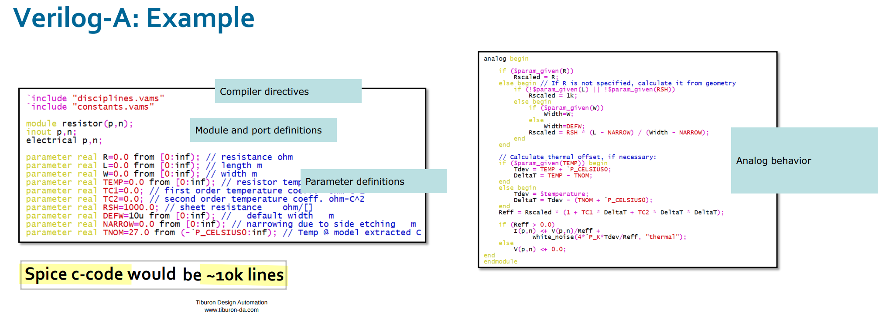

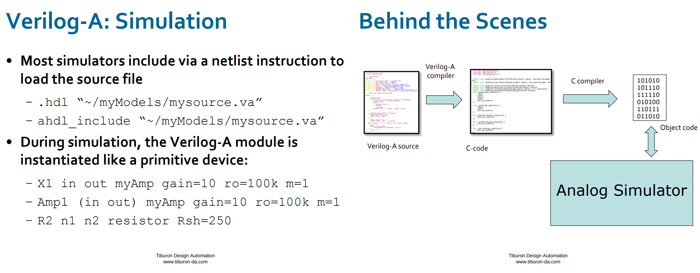


### flicker noise in circuit-noise analysis

its power spectral density is approximately
$$
S_{i,1/f}(f)=\frac{K}{|f|}.
$$
**A large amount of its power lies at low frequencies.** Therefore, compared with a GHz oscillation period $T_0$, the flicker-noise value changes very little during one cycle.

For a flicker-noise component at frequency $f_m$,
$$
f_m T_0\ll 1
$$
implies
$$
i_{1/f}(t+T_0)\approx i_{1/f}(t).
$$
Thus, if the noise current is positive at $t_0$, it will probably remain positive throughout the following oscillator cycle:
$$
i_{1/f}(t_0+\tau)\approx i_{1/f}(t_0),
\qquad 0\leq \tau<T_0.
$$
In circuit-noise analysis, the underlying flicker-noise source is commonly treated as approximately **wide-sense stationary**:
$$
R_x(t_1,t_2)=R_x(t_1-t_2).
$$
This is reasonable when the device bias is constant and the measurement interval is finite.

The phase perturbations may cancel or leave a nonzero residual:
$$
\Delta\phi_{\text{cycle}}
\propto
\int_{0}^{T_0}
\Gamma(\omega_0 t)\,
i_{1/f,\mathrm{cyclo}}(t)\,dt.
$$
Since the low-frequency noise is almost constant over $T_0$,
$$
\Delta\phi_{\text{cycle}}
\approx
x_{1/f}(t_0)
\int_{0}^{T_0}
\Gamma(\omega_0 t)a(t)\,dt
$$
Therefore, flicker-noise upconversion depends on whether the phase-delay and phase-advance contributions cancel over one period. A nonzero weighted average produces low-frequency fluctuations in oscillator frequency, which commonly appear as the $1/f^3$ phase-noise region.

Define

$$
\Gamma_{\mathrm{eff,DC}}\equiv \frac{1}{T_0}\int_0^{T_0}\Gamma(\omega_0t)a(t)\,dt
$$

Then
$$
\Delta\phi_{\text{cycle}}
\approx
\frac{x_{1/f}(t_0)}{q_{\max}}
\Gamma_{\mathrm{eff,DC}}T_0.
$$
If $x_{1/f}$ is already normalized by $q_{\max}$, the $1/q_{\max}$ factor can be omitted.

Therefore,
$$
\boxed{\Gamma_{\mathrm{eff,DC}}=0
\quad\Longrightarrow\quad
\Delta\phi_{\text{cycle}}\approx 0}
$$
for quasistatic flicker noise. Physically, the phase-delay contribution on one edge exactly cancels the phase-advance contribution on the other edge.nce,
$$
\boxed{
\Gamma_{\mathrm{eff,DC}}=0
\Rightarrow
\text{no first-order direct }1/f\text{-to-}1/f^3
\text{ phase-noise upconversion from that source.}
}
$$


## Ordinary Differential Equations (ODEs)

> Steve Brunton, ME 564 - Mechanical Engineering Analysis [[http://faculty.washington.edu/sbrunton/me564/](http://faculty.washington.edu/sbrunton/me564/)] [[videos](https://youtube.com/playlist?list=PLMrJAkhIeNNTYaOnVI3QpH7jgULnAmvPA)]

### Dirac delta function in ODEs

Integrate across the impulse to find the jump
$$
\underbrace{\text{zero state} + \delta(t)\text{ input}}_{t=0^-} \quad\Longrightarrow\quad \underbrace{\text{zero input} + \text{new ICs at }t=0^+}_{t>0}
$$


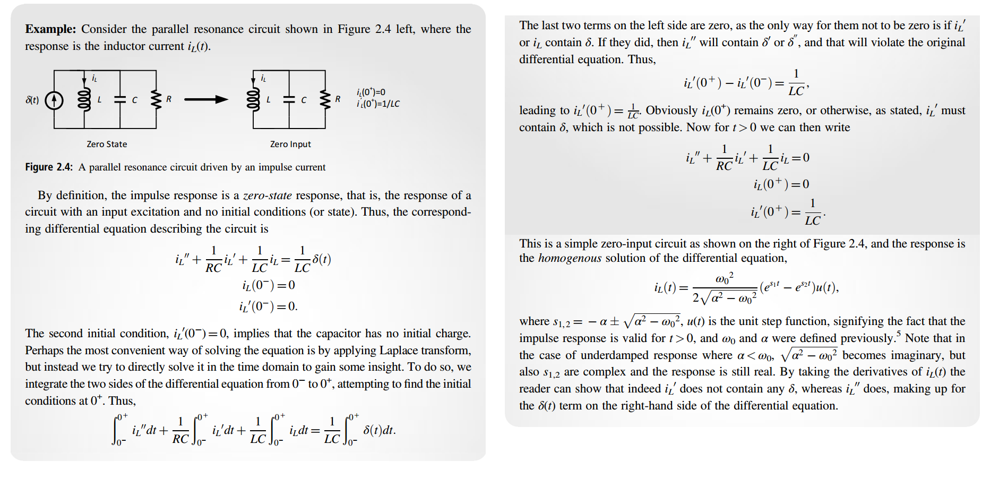

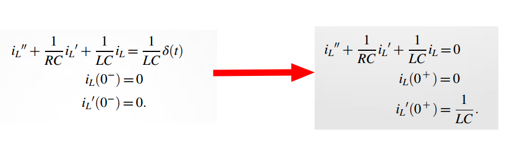

```python
import numpy as np
import scipy.integrate as spi
import matplotlib.pyplot as plt


L, C, R = 2.533e-9, 10e-12, 100.0

def rhs(t, y):
    il , dil = y
    dildt = dil
    ddildt = -(1/(R*C))*dil - (1/(L*C))*il
    return [dildt, ddildt]

sol = spi.solve_ivp(rhs, (0, 10e-9), [0, 1/(L*C)],
                    t_eval=np.linspace(0, 10e-9, 2001),
                    rtol=1e-10, atol=1e-4)   # error drops to ~1e-10

plt.plot(sol.t, sol.y[0])
plt.title('RLC Circuit Response')
plt.xlabel('Time (s)')
plt.ylabel('Current (A)')
plt.grid()
plt.show()
```

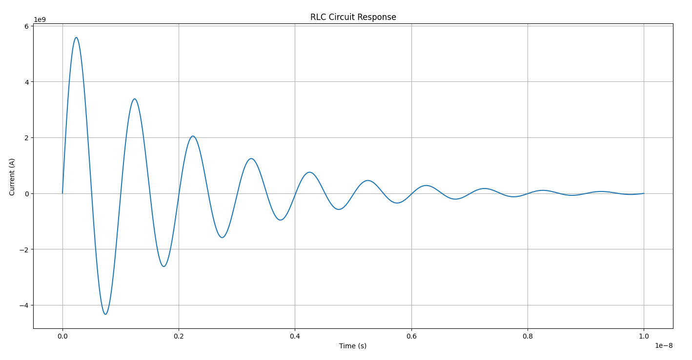

### Doublet function in ODEs

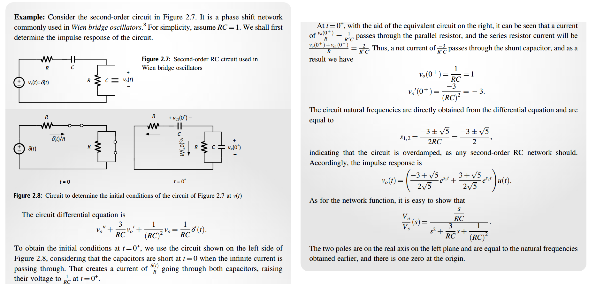

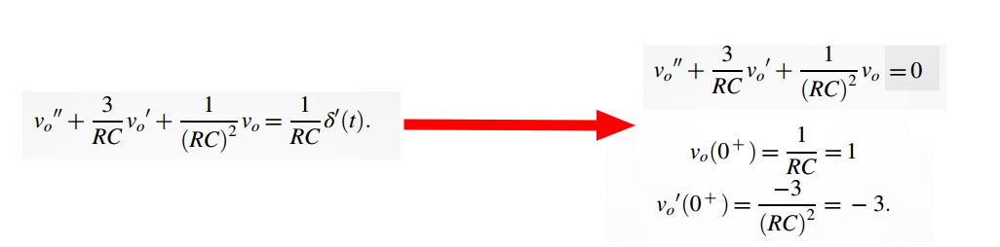


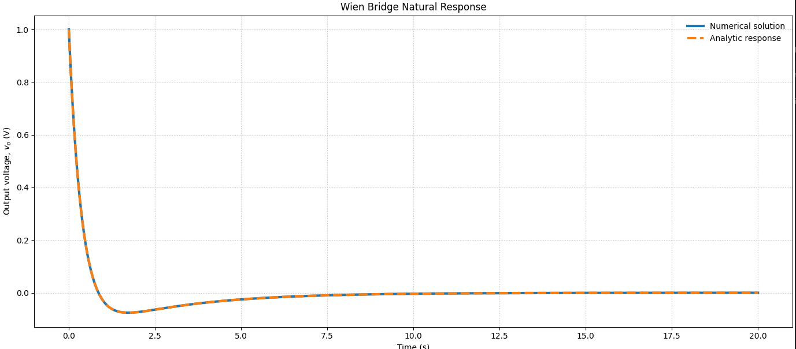

```python
import numpy as np
import scipy.integrate as spi
import matplotlib.pyplot as plt


RC = 1.0
T_START = 0.0
T_STOP = 20.0
NUM_SAMPLES = 2001


def wien_bridge_rhs(t, state):
    """Return the state derivative for the normalized Wien bridge response."""
    #del t
    vo, dvo = state
    ddvo = -(3.0 / RC) * dvo - vo / RC**2
    return [dvo, ddvo]


def analytic_response(t):
    """Closed-form voltage response for the same initial conditions."""
    sqrt_5 = np.sqrt(5.0)
    s1 = (-3.0 + sqrt_5) / (2.0 * RC)
    s2 = (-3.0 - sqrt_5) / (2.0 * RC)
    return (s1 * np.exp(s1 * t) - s2 * np.exp(s2 * t)) / sqrt_5


def main():
    t_eval = np.linspace(T_START, T_STOP, NUM_SAMPLES)
    initial_state = [1.0 / RC, -3.0 / RC**2]

    sol = spi.solve_ivp(
        wien_bridge_rhs,
        (T_START, T_STOP),
        initial_state,
        t_eval=t_eval,
        rtol=1e-10,
        atol=1e-8,
    )

    fig, ax = plt.subplots(figsize=(8, 4.8), constrained_layout=True)
    ax.plot(sol.t, sol.y[0], linewidth=3.0, label="Numerical solution")
    ax.plot(t_eval, analytic_response(t_eval), "--", linewidth=3.0, label="Analytic response")

    ax.set_title("Wien Bridge Natural Response")
    ax.set_xlabel("Time (s)")
    ax.set_ylabel("Output voltage, $v_o$ (V)")
    ax.grid(True, which="both", linestyle=":", linewidth=0.8, alpha=0.8)
    ax.legend(frameon=False)

    plt.show()


if __name__ == "__main__":
    main()
```


## Stochastic Differential Equations (SDE)

*TODO* &#128197;


## Fourier Analysis & Partial Differential Equations (PDEs)

$$
\text{Fourier analysis}
\longrightarrow
\text{method for solving PDEs},
$$

*TODO* &#128197;


## Differential Equations in Matlab & Python

`scipy.integrate.solve_ivp` 

Solve an **i**nitial **v**alue **p**roblem for a system of ODEs

`rtol` and `atol` are the error tolerances for `scipy.integrate.solve_ivp`.

`rtol` is relative tolerance: allowed error scales with the size of the solution.

`atol` is absolute tolerance: allowed error floor when the solution is near zero.

SciPy roughly controls local error using:

```
error < atol + rtol * abs(y)
```


## DifferentialEquations.jl


### ODE forms

ODE is usually defined in one of two forms: **out-of-place** or **in-place**

```julia
# out-of-place

function f(x, p, t)
    return 2x
end

x0 = 1.0
tspan = (0.0, 5.0)

prob = ODEProblem(f, x0, tspan)
sol = solve(prob)
```

`x` = current state

`p` = parameters

`t` = current time

returned value = dx/dt


```julia
# in-place

function f!(dx, x, p, t)
    dx[1] = 2*x[1]  # calars cannot be mutated
end

x0 = [1.0]
tspan = (0.0, 5.0)

prob = ODEProblem(f!, x0, tspan)
sol = solve(prob)
```

**Scalar ODE**
$$
\frac{dx}{dt} = -2x
$$


```julia
function f(x, p, t)
    return 2x
end

x0 = 1.0
tspan = (0.0, 5.0)

prob = ODEProblem(f, x0, tspan)
sol = solve(prob)
```


**System of ODEs**

$$\begin{align}
\dot{x} &= y, \\
\dot{y} &= -x - 0.2y.
\end{align}$$

```julia
function oscillator!(du, u, p, t)
    x = u[1]
    y = u[2]

    du[1] = y
    du[2] = -x - 0.2y
end

u0 = [1.0, 0.0]
tspan = (0.0, 20.0)

prob = ODEProblem(oscillator!, u0, tspan)
sol = solve(prob)
```

$$
u = \begin{bmatrix} x \\ y \end{bmatrix}, \quad du = \begin{bmatrix} \dot{x} \\ \dot{y} \end{bmatrix}.
$$


**ODE with parameters**

```julia
function f!(du, u, p, t)
    a, b = p
    x = u[1]

    du[1] = a*x - b*x^3
end

u0 = [0.1]
p = (2.0, 1.0)
tspan = (0.0, 10.0)

prob = ODEProblem(f!, u0, tspan, p)
sol = solve(prob)
```


***The Lorenz Equation — employ above features***

$$\begin{align}
\frac{dx}{dt} &= \sigma (y - x) \\
\frac{dy}{dt} &= x (\rho - z) -y \\
\frac{dz}{dt} &= xy - \beta z
\end{align}$$


```julia
function lorenz!(du,u,p,t)
    σ,ρ,β = p
    du[1] = σ*(u[2]-u[1])
    du[2] = u[1]*(ρ-u[3]) - u[2]
    du[3] = u[1]*u[2] - β*u[3]
end

u0 = [1.0,0.0,0.0]
p = (10,28,8/3) # we could also make this an array, or any other type!
tspan = (0.0,100.0)

prob = ODEProblem(lorenz!,u0,tspan,p)
sol = solve(prob)

Plots.plot(sol, vars=(1,2,3), size=(1400, 700))
```


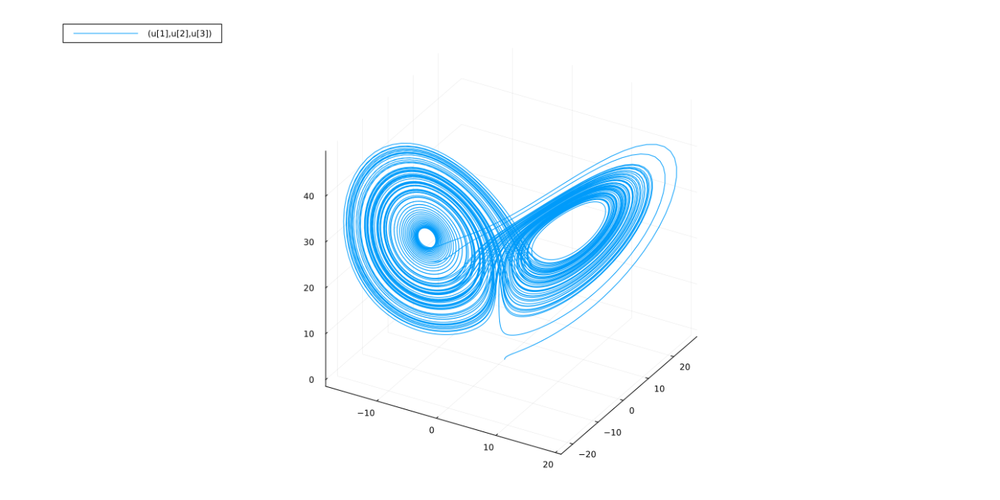


### Event Handling & Callback Functions

In `DifferentialEquations.jl`, a **callback** allows the ODE solver to detect an event and execute some action when that event occurs. This is useful for hybrid systems, switching circuits, threshold detection, impacts, resets, stopping conditions, etc.
$$
\boxed{\text{condition} \longrightarrow \text{event} \longrightarrow \text{affect!}}
$$

| Callback             | Condition  | Typical use                         |
| -------------------- | ---------- | ----------------------------------- |
| `ContinuousCallback` | (g(u,t)=0) | zero crossings, thresholds, impacts |
| `DiscreteCallback`   | Boolean    | mode switching, logical conditions  |


```julia
function f!(du, u, p, t)
    du[1] = -u[1]
end

u0 = [1.0]
tspan = (0.0, 10.0)

prob = ODEProblem(f!, u0, tspan)

function condition(u, t, integrator)
    u[1] - 0.2
end

function affect!(integrator)
    terminate!(integrator)
end

cb = ContinuousCallback(condition, affect!)

sol = solve(prob, Tsit5(), callback=cb)
println(sol.u[end][1])  # This will print the last value of u when the callback is triggered
println(sol.t[end])  # This will print the time at which the callback is triggered
println(exp(-sol.t[end]))  # This will print the expected value of u at that time

Plots.plot(sol, xlims=(0, 2), linewidth=5, title="Solution of ODE with Callback", xlabel="Time", ylabel="u(t)")

# 0.20000000000000004
# 1.6094312935462547
# 0.20000132378195012
```


`integrator` is the **currently running solver object**. `DifferentialEquations.jl` automatically passes it into callback functions.

```julia
integrator.u  # current state
integrator.t  # current time
integrator.p  # problem parameters
integrator.sol  # solution accumulated so far
```


---


***`ContinuousCallback`***

Use `ContinuousCallback` when the event is defined by a **continuous zero crossing** $g(u,t)=0$

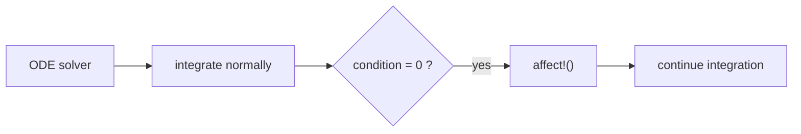
```mermaid
graph LR
    A[ODE solver] --> B[integrate normally]
    B --> C{condition = 0 ?}
    C -- yes --> D["affect!()"]
    D --> E[continue integration]
```


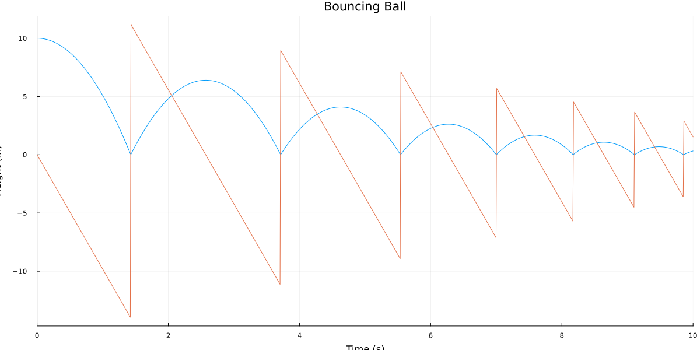
$$
\begin{cases} 
\dot{x} = v \\ 
\dot{v} = -g 
\end{cases}
$$


```julia
using DifferentialEquations
import Plots


function ball!(du, u, p, t)
    g = 9.81

    du[1] = u[2]   # dx/dt = v
    du[2] = -g     # dv/dt = -g
end

function condition(u, t, integrator)
    u[1]           # event when x = 0
end

function bounce!(integrator)
    e = 0.8
    integrator.u[2] = -e * integrator.u[2]
end

cb = ContinuousCallback(condition, bounce!)

u0 = [10.0, 0.0]

prob = ODEProblem(ball!, u0, (0.0, 10.0))

sol = solve(prob, Tsit5(), callback=cb)

Plots.plot(sol, size=(1200, 600), title="Bouncing Ball", xlabel="Time (s)", ylabel="Height (m)", legend=false)
```


---


***`DiscreteCallback`***

The condition returns a **Boolean**

```julia
condition(u, t, integrator) = true/false
```


`DiscreteCallback` checks its Boolean condition **at the end of accepted integration steps**. It does not use root finding to locate the exact point where $u=1$

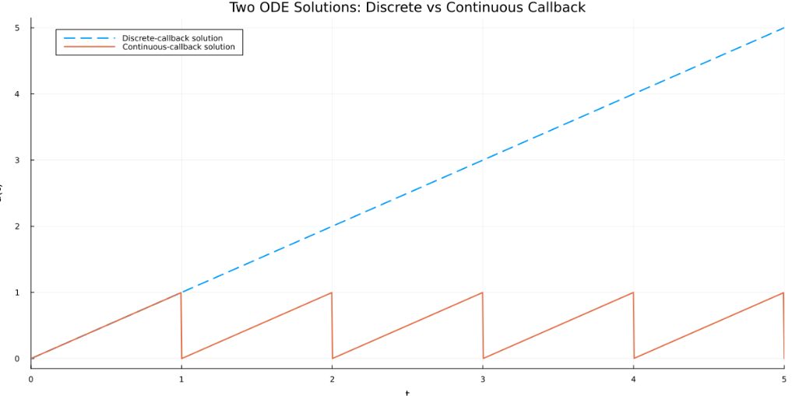

```julia
using DifferentialEquations
import Plots

function f!(du, u, p, t)
    du[1] = 1.0
end

u0 = [0.0]
tspan = (0.0, 5.0)

prob = ODEProblem(f!, u0, tspan)

# Boolean condition
function condition_DT(u, t, integrator)
    u[1] >= 1.0
end

function condition_CT(u, t, integrator)
    u[1] - 1.0
end

# Action when condition == true
function affect!(integrator)
    integrator.u[1] = 0.0
end

cb_DT = DiscreteCallback(condition_DT, affect!)
cb_CT = ContinuousCallback(condition_CT, affect!)

sol_DT = solve(prob, Tsit5(), callback=cb_DT)
println("Discrete-callback solution time: ", sol_DT.t[end-1:end])
println("Discrete-callback solution: ", sol_DT.u[end-1:end])
# Discrete-callback solution time: [5.0, 5.0]
# Discrete-callback solution: [[4.999999999999999], [0.0]]

sol_CT = solve(prob, Tsit5(), callback=cb_CT)

plt = Plots.plot(
    sol_DT,
    title="Two ODE Solutions: Discrete vs Continuous Callback",
    xlabel="Time",
    ylabel="u(t)",
    label="Discrete-callback solution",
    linewidth=2,
    linestyle=:dash,
    legend=:topleft,
    size=(1200, 600),
)
Plots.plot!(plt, sol_CT, label="Continuous-callback solution", linewidth=2)
```

`DiscreteCallback` checks only after each accepted solver step. Because `du/dt = 1` is exactly linear, `Tsit5()` takes a large step from approximately `t=0.58` directly to `t=5`. It therefore does not check near `u=1`.


---


***A callback can modify parameters***

Callbacks provide the mechanism that connects the continuous ODE dynamics to this discrete switching behavior

So mathematically two components:
$$
\dot{\mathbf{x}} = f(\mathbf{x}, p, t)
$$
for the $\textbf{continuous-time dynamics}$, and
$$
g(\mathbf{x}, t) = 0 \implies (\mathbf{x}, p) \to R(\mathbf{x}, p)
$$
for the $\textbf{event/reset dynamics}$. $R(x,p)$ means a **reset map** or **event update rule**


$$
\dot{x} = \begin{cases} 
-x, & x > 0.5 \\ 
-2x, & x < 0.5. 
\end{cases}
$$


```julia
using DifferentialEquations
import Plots

function f!(du, u, p, t)
    du[1] = -p[1]
end

function condition(u, t, integrator)
    u[1] - 0.5
end

function affect!(integrator)
    integrator.p[1] = -integrator.p[1]
end

p = [1.0]

cb = ContinuousCallback(condition, affect!)

prob = ODEProblem(f!, [1.0], (0.0, 1.0), p)

sol = solve(prob, Tsit5(), callback=cb)

Plots.plot(
    sol,
    title="A Callback Can Modify Parameters",
    xlabel="Time (t)",
    ylabel="State u₁(t)",
    label="u₁(t)",
    linewidth=2,
    size=(1200, 600)
)
```


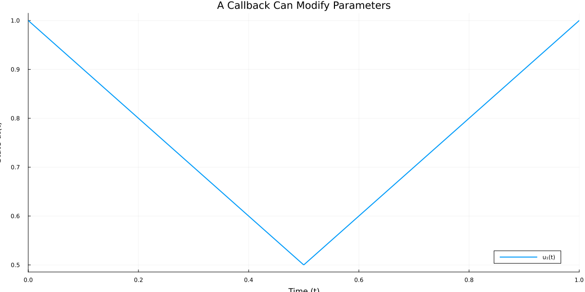


## reference

A. Demir, A. Mehrotra and J. Roychowdhury, "Phase noise in oscillators: a unifying theory and numerical methods for characterization," in *IEEE Transactions on Circuits and Systems I: Fundamental Theory and Applications*, vol. 47, no. 5, pp. 655-674, May 2000 [[https://sci-hub.jp/10.1109/81.847872](https://sci-hub.jp/10.1109/81.847872)]

—, "A Reliable and Efficient Procedure for Oscillator PPV Computation, With Phase Noise Macromodeling Applications," IEEE TCAD, 2003.

— and A. Sangiovanni-Vincentelli, *Analysis and Simulation of Noise in Nonlinear Electronic Circuits and Systems*, vol. 425. Boston, MA, USA: Kluwer Academic Publishers, 1998

A. Mehrotra and A. Sangiovanni-Vincentelli, *Noise Analysis of Radio Frequency Circuits*, 1st ed. New York, NY, USA: Springer, 2004

Darabi H. Radio Frequency Integrated Circuits and Systems. 2nd ed. Cambridge University Press; 2020.

---

***<span style="color: white; background-color: black">Mathematical Preliminaries</span>***

Strogatz, S.H. (2015). **Nonlinear Dynamics and Chaos: With Applications to Physics, Biology, Chemistry, and Engineering (2nd ed.)**. CRC Press [[https://www.biodyn.ro/course/literatura/Nonlinear_Dynamics_and_Chaos_2018_Steven_H._Strogatz.pdf](https://www.biodyn.ro/course/literatura/Nonlinear_Dynamics_and_Chaos_2018_Steven_H._Strogatz.pdf)]

Higham, Desmond. (2001). An Algorithmic Introduction to Numerical Simulation of Stochastic Differential Equations. SIAM Review. 43. 525-546. 10.1137/S0036144500378302. [[https://www.cmor-faculty.rice.edu/~cox/stoch/dhigham.pdf](https://www.cmor-faculty.rice.edu/~cox/stoch/dhigham.pdf)]

Jiří Lebl. **Notes on Diffy Qs: Differential Equations for Engineers** [[link](https://www.jirka.org/diffyqs/)]

Matt Charnley. **Differential Equations: An Introduction for Engineers** [[link](https://sites.rutgers.edu/matthew-charnley/course-materials/differential-equations-an-introduction-for-engineers/)]

Åström, K.J. & Murray, Richard. (2021). **Feedback Systems: An Introduction for Scientists and Engineers Second Edition** [[https://www.cds.caltech.edu/~murray/books/AM08/pdf/fbs-public_24Jul2020.pdf](https://www.cds.caltech.edu/~murray/books/AM08/pdf/fbs-public_24Jul2020.pdf)]
