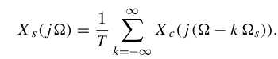
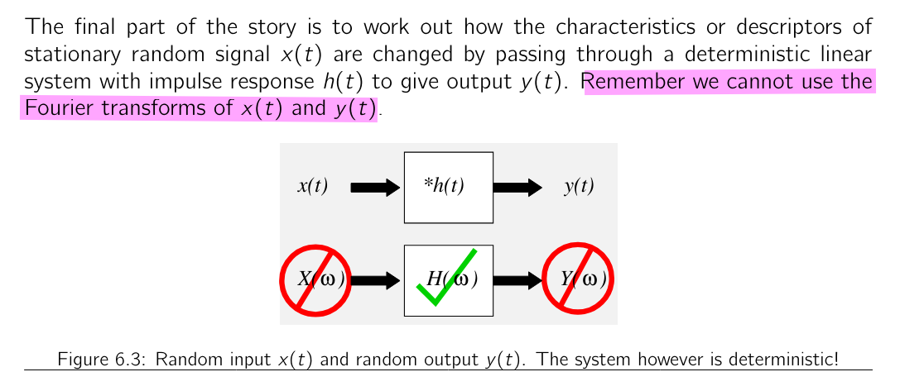

## Frequency-domain representation of sampling

> $\omega = \Omega T$

- continuous-time signal $x_c(t)$

- $x_s(t)$ is, in a sense, a continuous-time signal (specifically, an impulse train) that is zero, except at integer multiples of $T$

- The sequence $x[n]$, on the other hand, is indexed on the integer variable n, which, in effect, introduces a time normalization; i.e., the sequence of numbers $x[n]$ contains no explicit information about the sampling period $T$ 

> the samples of $x_c(t)$ are represented by *finite numbers* in $x[n]$ rather than as the *areas of impulses*, as with $x_s(t)$

$X_s(j\Omega)$, the Fourier transform of $x_s(t)$
$$
X_s(j\Omega) = \sum_{n=-\infty}^{\infty}x_c(nT)e^{-j\Omega Tn}
$$

$X(e^{j\omega})$, the discrete-time Fourier transform (DTFT) of the sequence $x[n]$
$$
X(e^{j\omega}) = \sum_{n=-\infty}^{\infty}x[n]e^{-j\omega n}
$$

where $x[n] = x_c(nT)$

## Fourier Analysis of Stationary Random Signals

> 
>
> [[https://dsp.stackexchange.com/a/17348/59253](https://dsp.stackexchange.com/a/17348/59253)]

> discrete-time random signal and autocorrelation
> $$
> \phi[m] = \phi_c(mT)
> $$
> 
>
> 
>
> 

##  Energy signals vs Power signal

---

A pure sine wave is expressed as $y(t) = A_0 \sin(2\pi f_0 t +\phi _0)$, its autocorrelation function:

$$
\mathrm{R}(\tau) = \lim _{T\to \infty}\frac{1}{2T}\int_{-T}^{T} y(t)y(t+\tau)dt
$$

where $y(t)y(t+\tau)$ can be expressed as
$$\begin{align}
y(t)y(t+\tau) &= A_0\sin(2\pi f_0 t+\phi_0)\cdot A_0\sin(2\pi f_0 t+\phi_0+2\pi f_0\tau) \\
&= A_0^2\sin^2(2\pi f_0 t+\phi_0)\cdot \cos(2\pi f_0\tau) + A_0^2\sin(2\pi f_0 t+\phi_0)\cos(2\pi f_0 t+\phi_0)\cdot \cos(2\pi f_0\tau) \\
&= \frac{1}{2}A_0^2 (1 - \cos(2(2\pi f_0 t+\phi_0)))\cdot \cos(2\pi f_0\tau) + \frac{1}{2}A_0^2\sin(2(2\pi f_0 t+\phi_0))\cdot \cos(2\pi f_0\tau) \\
&= \frac{1}{2}A_0^2\cdot \cos(2\pi f_0\tau) - \frac{1}{2}A_0^2\cos(2(2\pi f_0 t+\phi_0))\cdot \cos(2\pi f_0\tau) + \frac{1}{2}A_0^2\sin(2(2\pi f_0 t+\phi_0))\cdot \cos(2\pi f_0\tau)
\end{align}$$

And substitute $y(t)y(t+\tau)$ in $\mathrm{R}(\tau)$

$$\begin{align}
\mathrm{R}(\tau) &= \lim _{T\to \infty}\frac{1}{2T}\int_{-T}^{T} y(t)y(t+\tau)dt \\
&= \lim _{T\to \infty}\int_{-T}^{T} \left[\frac{1}{2}A_0^2\cdot \cos(2\pi f_0\tau) - \frac{1}{2}A_0^2\cos(2(2\pi f_0 t+\phi_0))\cdot \cos(2\pi f_0\tau) + \frac{1}{2}A_0^2\sin(2(2\pi f_0 t+\phi_0))\cdot \cos(2\pi f_0\tau)\right]dt \\
& = \lim _{T\to \infty}\int_{-T}^{T} \frac{1}{2}A_0^2\cdot \cos(2\pi f_0\tau) dt \\
&= \frac{1}{2}A_0^2\cdot \cos(2\pi f_0\tau)
\end{align}$$

Taking Fourier transform of $\mathrm{R}(\tau)$, PSD is

$$
S_y(f) = \frac{1}{4}A_0^2 \delta(f-f_0) + \frac{1}{4}A_0^2 \delta(f+f_0)
$$

---

### reference

Topic 5 Energy & Power Signals, Correlation & Spectral Density [[https://www.robots.ox.ac.uk/~dwm/Courses/2TF_2021/N5.pdf](https://www.robots.ox.ac.uk/~dwm/Courses/2TF_2021/N5.pdf)]

Topic 6 Random Processes and Signals [[https://www.robots.ox.ac.uk/~dwm/Courses/2TF_2021/N6.pdf](https://www.robots.ox.ac.uk/~dwm/Courses/2TF_2021/N6.pdf)]

Bae, Woorham; Jeong, Deog-Kyoon: 'Analysis and Design of CMOS Clocking Circuits for Low Phase Noise' (Materials, Circuits and Devices, 2020)

##  Switched-Capacitor

The **aliasing of the noise**, or **noise folding**, plays an important role in switched-capacitor as it does in all switched-capacitor filters

Assume for the moment that the switch is *always closed* (that there is no hold phase), the single-sided noise density would be

$v_s[n]$ is the sampled version of $v_{RC}(t)$, i.e. $v_s[n]= v_{RC}(nT_C)$
$$
S_s(e^{j\omega}) = \frac{1}{T_C} \sum_{k=-\infty}^{\infty}S_{RC}(j(\frac{\omega}{T_C}-\frac{2\pi k}{T_C})) \cdot d\omega
$$
where $\omega \in [-\pi, \pi]$,  furthermore $\frac{d\omega}{T_C}= d\Omega$
$$
S_s(j\Omega) = \sum_{k=-\infty}^{\infty}S_{RC}(j(\Omega-k\Omega_s)) \cdot d\Omega
$$

> 

The noise in $S_{RC}$ is a *stationary process* and so is *uncorrelated* over $f$ allowing the $N$ rectangles to be combined by simply summing their noise powers

> $$
> X(j\Omega)d\Omega = \frac{1}{T_c}X(e^{j\omega})d\omega  
> $$
>
> ref. *[[Sampling of Continuous Time Signals]](https://raytroop.github.io/2022/05/01/sampling-dft)* of EQ.(31) in the blog

where $m$ is the duty cycle

> - Calculate autocorrelation function of noise at the output of the RC filter
> - Calculate the spectrum by taking the **discrete** time Fourier transform of the autocorrelation function

- $Vo_{[n-1]}$ decay
- $Vo_{[n]}$ charge C

## Noise Aliasing

Where impulse train or "shah" function is defined as
$$
\amalg(t) = T\sum_{i=-\infty}^{\infty}\delta(x-iT)
$$
where $T$ defines the period, or sampling rate. Its Fourier transform is $2\pi \delta(\omega-i\frac{2\pi}{T})$

**Multiplication Property** of Fourier Transform
$$
x_1(t)x_2(t)\overset{FT}{\longrightarrow}\frac{1}{2\pi}X_1(\omega)*X_2(\omega)
$$

Due to $A = B+2C$, the noise in the discrete time integrated from DC to $f_s/2$ equals that of continuous time in all frequency range.

> The DFT spectrum is periodic with period **N**
>
> The DTFT spectrum is periodic  with period $2\pi$
>
> As a conclusion, the spectrum beyond $f_s/2$ is **redundant** and don't provide information

## Aliasing

The frequencies $f_{\text{sig}}$ and $N· f_s ±f_{\text{sig}}$ (N integer), are **indistinguishable** in the **discrete time domain**.

> In order to prevent aliasing, we need $f_{\text{sig,max}}\lt \frac{f_s}{2}$. The sampling rate $f_s=2\cdot f_{\text{sig,max}}$ is called the **Nyquist Rate**.
>
> Two solution possibilities
>
> 1.  Sample fast enough to cover all spectral components, including "parasitic" ones outside band of interest
> 2. Limit $f_{\text{sig,max}}$ through filtering - Filter out "parasitic" ones 

Given below sequence
$$
X[n] =A e^{j\omega _0 T_s n}
$$

1. $kf_s + \Delta f$

$$\begin{align}
x[n] &= Ae^{j\left( kf_s+\Delta f \right)2\pi T_sn} + Ae^{j\left( -kf_s-\Delta f \right)2\pi T_sn} \\
&= Ae^{j\Delta f\cdot 2\pi T_sn} + Ae^{-j\Delta f\cdot 2\pi T_sn}
\end{align}$$

2. $kf_s - \Delta f$

$$\begin{align}
x[n] &= Ae^{j\left( kf_s-\Delta f \right)2\pi T_sn} + Ae^{j\left( -kf_s+\Delta f \right)2\pi T_sn} \\
&= Ae^{-j\Delta f\cdot 2\pi T_sn} + Ae^{j\Delta f\cdot 2\pi T_sn}
\end{align}$$

> With sampling frequency $\frac{1}{T_s}$, continuous signal of $\frac{1}{2T_s}+\Delta f$ and  $-\frac{1}{2T_s}+\Delta f$ can not be distinguished
> *real signal*

> Generally, The frequencies $f_{\text{sig}}$ and $N· f_s ±f_{\text{sig}}$ (N integer), are **indistinguishable** in the **discrete time domain**.

### Aliasing Example

Given $f_s = 1000$ KHz

1. $f_{\text{sig}}=101$ KHz

   

2. $f_{\text{sig}}=899$ KHz

   

3. $f_{\text{sig}}=1101$ KHz

   

### Classes of Sampling 

- Nyquist-rate sampling

  $f_s \gt 2 \cdot f_{\text{sig,max}}$

- Oversampling

  $f_s \gg  2\cdot f_{\text{sig,max}}$

- Undersampling, subsampling

  $f_s \lt 2\cdot f_{\text{sig,max}}$

## Dirac Pulses and spectrum

Spectrum of $x_d(t)$ contains **scaled replicas** of $X(f)$ at **integer multiples** of the sampling frequency $f_s$

## reference

David Herres, The difference between signal under-sampling, aliasing, and folding URL: [https://www.testandmeasurementtips.com/the-difference-between-signal-under-sampling-aliasing-and-folding-faq/](https://www.testandmeasurementtips.com/the-difference-between-signal-under-sampling-aliasing-and-folding-faq/)

Pharr, Matt; Humphreys, Greg. (28 June 2010). Physically Based Rendering: From Theory to Implementation. Morgan Kaufmann. ISBN 978-0-12-375079-2. [Chapter 7 (Sampling and reconstruction)](https://web.archive.org/web/20131016055332/http://graphics.stanford.edu/~mmp/chapters/pbrt_chapter7.pdf)

Kundert, Ken. (2006). Simulating Switched-Capacitor Filters with SpectreRF.

Pavan, Schreier and Temes, "Understanding Delta-Sigma Data Converters, Second Edition" ISBN 978-1-119-25827-8

Boris Murmann, EE315B VLSI Data Conversion Circuits, Autumn 2013

\- Noise Analysis in Switched-Capacitor Circuits, ISSCC 2011 / tutorials

Tania Khanna, ESE568 Fall 2019, Mixed Signal Circuit Design and Modeling URL: [https://www.seas.upenn.edu/~ese568/fall2019/](https://www.seas.upenn.edu/~ese568/fall2019/)

Matt Pharr, Wenzel Jakob, and Greg Humphreys. 2016. Physically Based Rendering: From Theory to Implementation (3rd. ed.). Morgan Kaufmann Publishers Inc., San Francisco, CA, USA.

Bernhard E. Boser . Advanced Analog Integrated Circuits Switched Capacitor Gain Stages [[https://people.eecs.berkeley.edu/~boser/courses/240B/lectures/M05%20SC%20Gain%20Stages.pdf](https://people.eecs.berkeley.edu/~boser/courses/240B/lectures/M05%20SC%20Gain%20Stages.pdf)]

Alan V Oppenheim, Ronald W. Schafer. Discrete-Time Signal Processing, 3rd edition

R. Gregorian and G. C. Temes. Analog MOS Integrated Circuits for Signal Processing. Wiley-Interscience, 1986
