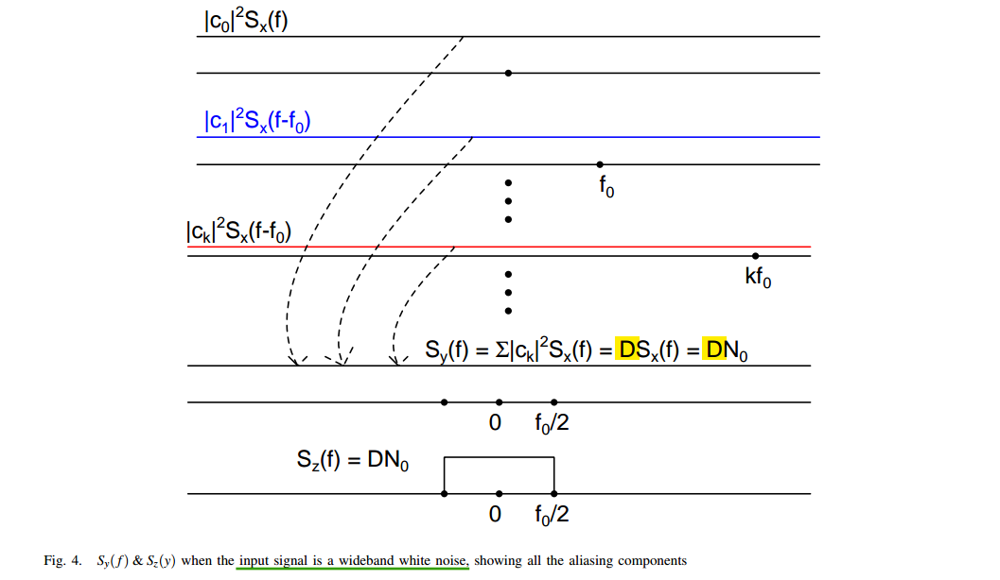

---


## noise power at filter output

> Chembian Thambidurai, "Comparison Of Noise Power At Lowpass Filter Output" [[link](https://www.linkedin.com/posts/chembiyan-t-0b34b910_noise-power-at-filter-output-activity-7006486487093456896-W0Rt?utm_source=share&utm_medium=member_desktop)]
>
> —, "On Noise Power At The Bandpass Filter Output" [[link](https://www.linkedin.com/posts/chembiyan-t-0b34b910_bandpass-noise-activity-7008896204507922432-ZRXF?utm_source=share&utm_medium=member_desktop)]
>
> —, "Integrated Power of Thermal and Flicker Noise" [[link](https://www.linkedin.com/posts/chembiyan-t-0b34b910_flicker-and-thermal-noise-power-on-a-log-activity-7003063399781711872-62nh?utm_source=share&utm_medium=member_desktop)]

*TODO* &#128197;


## Pulsed Noise Signals

> Chembian Thambidurai, "Power Spectral Density of Pulsed Noise Signals" [[link](https://www.linkedin.com/posts/chembiyan-t-0b34b910_psd-of-pulsed-noise-signal-activity-6992527460886040577-a0im?utm_source=share&utm_medium=member_desktop)]


> Above,  the output of the multiplier be $y(t)$ is passed through a ideal brick wall low pass filter with a bandwidth of $f_0/2$

When a random signal is multiplied by a *pulse function*, the resulting signal becomes a *cyclo-stationary random process*. 

As rule of thumb, the spectrum of such a pulsed noise signal  

- *thermal noise* is multiplied by $D$

-  *flicker noise* is multiplied by $D^2$, 


where $D$ is the duty cycle of the pulse signal


---

### banlimited input


###  wideband white noise input



### flicker noise input

with $S_x(f)=\frac{K_f}{f}$


Assuming $\Delta f \ll f_0$


---


## Sampling Noise

> Chembian Thambidurai, "Noise, Sampling and Zeta Functions" [[link](https://www.linkedin.com/posts/chembiyan-t-0b34b910_sampling-noise-signals-activity-7018929654627520512-QYr0?utm_source=share&utm_medium=member_desktop)]

A random signal $v_n(t)$ is sampled using an ideal impulse sampler


*TODO* &#128197;


## Aperture Jitter & ADC SNR

> Chembian Thambidurai, "SNR of an ADC in the presence of clock jitter" [[https://www.linkedin.com/posts/chembiyan-t-0b34b910_adcsnrjitter-activity-7171178121021304833-f2Wd?utm_source=share&utm_medium=member_desktop](https://www.linkedin.com/posts/chembiyan-t-0b34b910_adcsnrjitter-activity-7171178121021304833-f2Wd?utm_source=share&utm_medium=member_desktop)]

Unlike the quantization noise and the thermal noise, the impact of the clock jitter on the ADC performance depends on the input signal properties like its PSD


The error between *the ideal sampled signal* and *the sampling with clock jitter* can be treated as noise and it results in the degradation of the SNR of the ADC


*For sinusoid input:*


> K. Tyagi and B. Razavi, "Performance Bounds of ADC-Based Receivers Due to Clock Jitter," in *IEEE Transactions on Circuits and Systems II: Express Briefs*, vol. 70, no. 5, pp. 1749-1753, May 2023 [[https://www.seas.ucla.edu/brweb/papers/Journals/KT_TCAS_2023.pdf](https://www.seas.ucla.edu/brweb/papers/Journals/KT_TCAS_2023.pdf)]
>
> N. Da Dalt, M. Harteneck, C. Sandner and A. Wiesbauer, "On the jitter requirements of the sampling clock for analog-to-digital converters," in *IEEE Transactions on Circuits and Systems I: Fundamental Theory and Applications*, vol. 49, no. 9, pp. 1354-1360, Sept. 2002 [[https://sci-hub.se/10.1109/TCSI.2002.802353](https://sci-hub.se/10.1109/TCSI.2002.802353)]
>
> M. Shinagawa, Y. Akazawa and T. Wakimoto, "Jitter analysis of high-speed sampling systems," in IEEE Journal of Solid-State Circuits, vol. 25, no. 1, pp. 220-224, Feb. 1990 [[https://sci-hub.se/10.1109/4.50307](https://sci-hub.se/10.1109/4.50307)]

---


```python
import numpy as np
import matplotlib.pyplot as plt

ENOB = 8
fin = np.logspace(8, 11, 60)

# quantization noise: SNR = 6.02*ENOB + 1.76 dB
Ps_PnQ = 10**((6.02*ENOB + 1.76)/10)
PnQ = 1/Ps_PnQ

# jitter noise: SNR = 6 - 20log10(2*pi*fin*Jrms) dB @ref. Chembiyan T
Jrms_list = [25e-15, 50e-15, 100e-15, 250e-15, 500e-15, 1000e-15]
for Jrms in Jrms_list:
    # Ps_PnJ_lcl = 10**((6-20*np.log10(2*np.pi*fin*Jrms))/10)     # ref. Chembiyan T
    Ps_PnJ_lcl = 10**((0 - 20 * np.log10(2 * np.pi * fin * Jrms)) / 10)  # ref. Nicola Da Dalt
    PnJ_lcl = 1/Ps_PnJ_lcl
    SNR_lcl = 10*np.log10(1/(PnQ+PnJ_lcl))
    plt.plot(fin, SNR_lcl, label=r'$\sigma_{jitter}$'+'='+str(int(Jrms*1e15))+'fs')

plt.xscale('log')
plt.ylim([0, 55])
plt.xlabel(r'$f_{in}$ [Hz]')
plt.ylabel(r'SNR [dB]')
plt.grid(which='both')
# plt.title(r'ref. Chembiyan T')
plt.title(r'ref. Nicola Da Dalt')
plt.legend()
plt.show()

```

> 
>
> i.e. N. Da Dalt's
>
> 
>
> Ayça Akkaya, "High-Speed ADC Design and Optimization for Wireline Links" [[https://infoscience.epfl.ch/server/api/core/bitstreams/96216029-c2ff-48e5-a675-609c1e26289c/content](https://infoscience.epfl.ch/server/api/core/bitstreams/96216029-c2ff-48e5-a675-609c1e26289c/content)]


---


## ISF for Oscillators

*TODO* &#128197;


##  Sampled Thermal Noise

The **aliasing of the noise**, or **noise folding**, plays an important role in switched-capacitor as it does in all switched-capacitor filters


Assume for the moment that the switch is *always closed* (that there is no hold phase), the single-sided noise density would be


---


$v_s[n]$ is the sampled version of $v_{RC}(t)$, i.e. $v_s[n]= v_{RC}(nT_C)$
$$
S_s(e^{j\omega}) = \frac{1}{T_C} \sum_{k=-\infty}^{\infty}S_{RC}(j(\frac{\omega}{T_C}-\frac{2\pi k}{T_C})) \cdot d\omega
$$
where $\omega \in [-\pi, \pi]$,  furthermore $\frac{d\omega}{T_C}= d\Omega$
$$
S_s(j\Omega) = \sum_{k=-\infty}^{\infty}S_{RC}(j(\Omega-k\Omega_s)) \cdot d\Omega
$$

> 


The noise in $S_{RC}$ is a *stationary process* and so is *uncorrelated* over $f$ allowing the $N$ rectangles to be combined by simply summing their noise powers


where $m$ is the duty cycle

---

*Below analysis focus on sampled noise*


> - Calculate autocorrelation function of noise at the output of the RC filter
> - Calculate the spectrum by taking the **discrete** time Fourier transform of the autocorrelation function


> Kundert, Ken. (2006). Simulating Switched-Capacitor Filters with SpectreRF [[https://designers-guide.org/analysis/sc-filters.pdf](https://designers-guide.org/analysis/sc-filters.pdf)]
>
> Pavan, Schreier and Temes, "Understanding Delta-Sigma Data Converters, Second Edition" ISBN 978-1-119-25827-8
>
> Boris Murmann, EE315B VLSI Data Conversion Circuits, Autumn 2013
>
> \- Noise Analysis in Switched-Capacitor Circuits, ISSCC 2011 / tutorials [[slides](https://www.nishanchettri.com/isscc-slides/2011%20ISSCC/TUTORIALS/ISSCC2011Visuals-T8.pdf), [transcript](https://www.nishanchettri.com/isscc-slides/2011%20ISSCC/TUTORIALS/Transcription_T9.pdf)]
>
> Tania Khanna, ESE568 Fall 2019, Mixed Signal Circuit Design and Modeling URL: [https://www.seas.upenn.edu/~ese568/fall2019/](https://www.seas.upenn.edu/~ese568/fall2019/)
>
> Matt Pharr, Wenzel Jakob, and Greg Humphreys. 2016. Physically Based Rendering: From Theory to Implementation (3rd. ed.). Morgan Kaufmann Publishers Inc., San Francisco, CA, USA.
>
> Bernhard E. Boser . Advanced Analog Integrated Circuits Switched Capacitor Gain Stages [[https://people.eecs.berkeley.edu/~boser/courses/240B/lectures/M05%20SC%20Gain%20Stages.pdf](https://people.eecs.berkeley.edu/~boser/courses/240B/lectures/M05%20SC%20Gain%20Stages.pdf)]
>
> R. Gregorian and G. C. Temes. Analog MOS Integrated Circuits for Signal Processing. Wiley-Interscience, 1986
>
> Trevor Caldwell, Lecture 9 Noise in Switched-Capacitor Circuits  [[http://individual.utoronto.ca/trevorcaldwell/course/NoiseSC.pdf](http://individual.utoronto.ca/trevorcaldwell/course/NoiseSC.pdf)]
>
>  Christian-Charles Enz. High precision CMOS micropower amplifiers [[pdf](https://picture.iczhiku.com/resource/eetop/wYItQFykkAQDFccB.pdf)]


## reference

David Herres, The difference between signal under-sampling, aliasing, and folding URL: [https://www.testandmeasurementtips.com/the-difference-between-signal-under-sampling-aliasing-and-folding-faq/](https://www.testandmeasurementtips.com/the-difference-between-signal-under-sampling-aliasing-and-folding-faq/)

Pharr, Matt; Humphreys, Greg. (28 June 2010). Physically Based Rendering: From Theory to Implementation. Morgan Kaufmann. ISBN 978-0-12-375079-2. [Chapter 7 (Sampling and reconstruction)](https://web.archive.org/web/20131016055332/http://graphics.stanford.edu/~mmp/chapters/pbrt_chapter7.pdf)

Alan V Oppenheim, Ronald W. Schafer. Discrete-Time Signal Processing, 3rd edition

