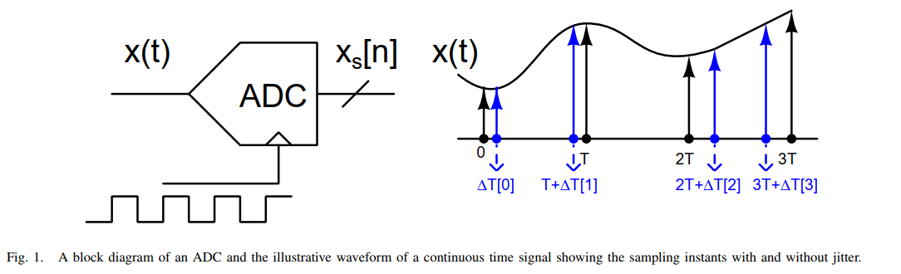

---


## noise generator

> Allen B. Downey. *Think DSP - Digital Signal Processing in Python* [[book](http://greenteapress.com/thinkdsp/thinkdsp.pdf) [repo](https://github.com/AllenDowney/ThinkDSP)]
>
> Chembian Thambidurai, "Comparison Of Noise Power At Lowpass Filter Output" [[link](https://www.linkedin.com/posts/chembiyan-t-0b34b910_noise-power-at-filter-output-activity-7006486487093456896-W0Rt?utm_source=share&utm_medium=member_desktop)]
>
> —, "On Noise Power At The Bandpass Filter Output" [[link](https://www.linkedin.com/posts/chembiyan-t-0b34b910_bandpass-noise-activity-7008896204507922432-ZRXF?utm_source=share&utm_medium=member_desktop)]
>
> Steve Smith. An Interesting Fourier Transform - 1/f Noise [[https://www.dsprelated.com/showarticle/40.php](https://www.dsprelated.com/showarticle/40.php)]
>


### Filtered White Noise

> Julius Orion Smith III. Spectral Audio Signal Processing [[https://www.dsprelated.com/freebooks/sasp/Filtered_White_Noise.html](https://www.dsprelated.com/freebooks/sasp/Filtered_White_Noise.html)]

Example: Synthesis of 1/F Noise (Pink Noise)

```matlab
Nx = 2^16;  % number of samples to synthesize
B = [0.049922035 -0.095993537 0.050612699 -0.004408786];
A = [1 -2.494956002   2.017265875  -0.522189400];
nT60 = round(log(1000)/(1-max(abs(roots(A))))); % T60 est.
v = randn(1,Nx+nT60); % Gaussian white noise: N(0,1)
x = filter(B,A,v);    % Apply 1/F roll-off to PSD
x = x(nT60+1:end);    % Skip transient response

%{
octave:1> sum(B)/sum(A)
ans = 1.0991
%}
```


### White Noise + Digital Low-Pass filter

> Alessandro Cudazzo. noise generator developed in C99 (white, brown) [[https://github.com/alessandrocuda/noise_generator](https://github.com/alessandrocuda/noise_generator)]

with *Derivatives approximation*, $H_p(s) = \frac{1}{s\tau +  1} \to H_p(z)=\frac{\alpha}{1 +(\alpha -1)z^{-1}}$, where $\alpha = \frac{T}{\tau+T}$


### Colouring Noise

> Matthew Schubert. Colouring Noise - Generating coloured noise to simulate physical processes [[https://blog.ioces.com/matt/posts/colouring-noise/](https://blog.ioces.com/matt/posts/colouring-noise/)] [[https://gist.github.com/m-schubert/45c562146c6607b8990f1e8f34ff87b0](https://gist.github.com/m-schubert/45c562146c6607b8990f1e8f34ff87b0)]


**White**, **Pink** $1/f$, **Brownian** $1/f^2$, **Blue** $f$, **Violet** $f^2$

The process of generating coloured noise is relatively simple:

1. Start with a representation of white noise signal in the frequency domain
2. **Shape the signal in the frequency domain** according to the PSD you'd like to achieve
3. Take the inverse Fourier transform of the shaped signal

sampling shaping transfer function (not scaled by $1/T_s$), which make sense in time domain convolution between sampled noise with sampled impulse response of filter


### White noise in CONTINUOUS-time blocks

> MathWorks Support Team. [[https://www.mathworks.com/matlabcentral/answers/100763-why-have-a-band-limited-white-noise-generator-block-instead-of-just-a-white-noise-generator-block#answer_110112](https://www.mathworks.com/matlabcentral/answers/100763-why-have-a-band-limited-white-noise-generator-block-instead-of-just-a-white-noise-generator-block#answer_110112)]


## White noise

> David Murray. Topic 6: Random Processes and Signals [[slides](https://www.robots.ox.ac.uk/~dwm/Courses/2TF_2021/L6.pdf) [notes](https://www.robots.ox.ac.uk/~dwm/Courses/2TF_2021/N6.pdf)]


---


> Julius Orion Smith III. Why an Impulse is Not White [[https://www.dsprelated.com/freebooks/sasp/Why_Impulse_Not_White.html](https://www.dsprelated.com/freebooks/sasp/Why_Impulse_Not_White.html)]
>
> 


### AWGN (Additive White Gaussian Noise )

> Mathuranathan. Simulate additive white Gaussian noise (AWGN) channel [[https://www.gaussianwaves.com/2015/06/how-to-generate-awgn-noise-in-matlaboctave-without-using-in-built-awgn-function/](https://www.gaussianwaves.com/2015/06/how-to-generate-awgn-noise-in-matlaboctave-without-using-in-built-awgn-function/)]


### White Noise by i.i.d Random Variable

`Independent and Identically Distributed`

> Kevin Zheng. The Frequency Domain Trap – Beware of Your AC Analysis [[https://circuit-artists.com/the-frequency-domain-trap-beware-of-your-ac-analysis/](https://circuit-artists.com/the-frequency-domain-trap-beware-of-your-ac-analysis/)]
>
> Mathuranathan. White Noise : Simulation and Analysis using Matlab [[https://www.gaussianwaves.com/2013/11/simulation-and-analysis-of-white-noise-in-matlab/](https://www.gaussianwaves.com/2013/11/simulation-and-analysis-of-white-noise-in-matlab/)]

***white noise*** doesn't mean it has a *Gaussian/normal distribution*

The only criteria for a (discrete) signal to be **"white"** is for **each sample to be independently taken from the same probability distribution**


By understanding input signal's statistical nature, we can gather more insights about certain requirements for our circuits than just from frequency domain


---


```matlab
fs = 1;
N = 2^20;
Nhist = 100;
segmentLength = 512;

x_norm = randn(1, N,1); % Generate random data (e.g., Gaussian white noise)
[pxx_norm, f] = pwelch(x_norm, segmentLength, [], [], fs);

x_uniform = 2*rand(N,1) - 1; % uniform random -1 ~ 1;
[pxx_uniform, ~] = pwelch(x_uniform, segmentLength, [], [], fs);

x_sin = sin(2*pi*(rand(N,1) - 0.5)); % sinusoidal-like
[pxx_sin, ~] = pwelch(x_sin, segmentLength, [], [], fs);

x_bin = 2*randi(2,N,1) -3; % binomial distribution, -1, 1
[pxx_bin, ~] = pwelch(x_bin, segmentLength, [], [], fs);

subplot(2, 4, 1)
histogram(x_norm, Nhist);
title('normal distribution')

subplot(2, 4, 5)
plot(f, 10*log10(pxx_norm));
xlabel('Frequency (Hz)');
ylabel('dB');
title('PSD of normal distribution')

%% 
subplot(2, 4, 2)
histogram(x_uniform, Nhist);
title('uniform distribution')

subplot(2, 4, 6)
plot(f, 10*log10(pxx_uniform));
xlabel('Frequency (Hz)');
ylabel('dB');
title('PSD of uniform distribution')

%% 
subplot(2, 4, 3)
histogram(x_sin, Nhist);
title('sinusoidal-like distribution')

subplot(2, 4, 7)
plot(f, 10*log10(pxx_sin));
xlabel('Frequency (Hz)');
ylabel('dB');
title('PSD of sinusoidal-like distribution')

%%
subplot(2, 4, 4)
histogram(x_bin, Nhist);
title('binomial distribution')

subplot(2, 4, 8)
plot(f, 10*log10(pxx_bin));
xlabel('Frequency (Hz)');
ylabel('dB');
title('PSD of binomial distribution')
```

---


```matlab
val = randn(1, 2^20,1);
val_abs = abs(val);
val_abs_avg = mean(val_abs);
subplot(2,2,1)
histogram(val);
title('x_{norm} distribution'); grid on

subplot(2,2,2)
histogram(val_abs);
title('|x_{norm}| distribution')

subplot(2,2,[3 4])
[pxx, f] = pwelch(val_abs - val_abs_avg, 512, [], [], 1);
plot(f, 10*log10(pxx), LineWidth=4); grid on
title('psd (dB)')
```


## Sampling Noise

> Chembian Thambidurai, "Noise, Sampling and Zeta Functions" [[link](https://www.linkedin.com/posts/chembiyan-t-0b34b910_sampling-noise-signals-activity-7018929654627520512-QYr0)]

A random signal $v_n(t)$ is sampled using an ***ideal impulse sampler***


*TODO* &#128197;

### White Noise

> Does PSD (dBm/Hz) of white noise depend on sampling rate?. Does PSD (dBm/Hz) of white noise depend on sampling rate? [[https://dsp.stackexchange.com/a/87654/59253](https://dsp.stackexchange.com/a/87654/59253)]
>


---

> Matthew Schubert. Colouring Noise - Generating coloured noise to simulate physical processes [[https://blog.ioces.com/matt/posts/colouring-noise/](https://blog.ioces.com/matt/posts/colouring-noise/)]


$$
\text{PSD}_s =  \frac{\sigma^2}{f_s} \space\space \text{for two-sided PSD} \space\space\space \text{or}\space\space\space =\frac{\sigma^2}{f_s/2}\space\space \text{for one-sided PSD} 
$$

```matlab
# Generate Gaussian white noise in the time domain
sigma = 1 / np.sqrt(2.0 * dt)
x_t = rng.normal(0.0, sigma, n)
```


> How to generate white noise signal from a given PSD? [[https://www.mathworks.com/matlabcentral/answers/1968-how-to-generate-white-noise-signal-from-a-given-psd#answer_1498849](https://www.mathworks.com/matlabcentral/answers/1968-how-to-generate-white-noise-signal-from-a-given-psd#answer_1498849)]
>
> 


###  bandlimited white noise

The **aliasing of the noise**, or **noise folding**, plays an important role in switched-capacitor as it does in all switched-capacitor filters


Assume for the moment that the switch is *always closed* (that there is no hold phase), the single-sided noise density would be


---


$v_s[n]$ is the sampled version of $v_{RC}(t)$, i.e. $v_s[n]= v_{RC}(nT_C)$
$$
S_s(e^{j\omega}) = \frac{1}{T_C} \sum_{k=-\infty}^{\infty}S_{RC}(j(\frac{\omega}{T_C}-\frac{2\pi k}{T_C})) \cdot d\omega
$$
where $\omega \in [-\pi, \pi]$,  furthermore $\frac{d\omega}{T_C}= d\Omega$
$$
S_s(j\Omega) = \sum_{k=-\infty}^{\infty}S_{RC}(j(\Omega-k\Omega_s)) \cdot d\Omega
$$

> 


The noise in $S_{RC}$ is a *stationary process* and so is *uncorrelated* over $f$ allowing the $N$ rectangles to be combined by simply summing their noise powers


where $m$ is the duty cycle

> Kundert, Ken. (2006). Simulating Switched-Capacitor Filters with SpectreRF [[https://designers-guide.org/analysis/sc-filters.pdf](https://designers-guide.org/analysis/sc-filters.pdf)]
>
> Pavan, Schreier and Temes, "Understanding Delta-Sigma Data Converters, Second Edition" ISBN 978-1-119-25827-8
>
> Tania Khanna, ESE568 Fall 2019, Mixed Signal Circuit Design and Modeling URL: [https://www.seas.upenn.edu/~ese568/fall2019/](https://www.seas.upenn.edu/~ese568/fall2019/)
>
> Matt Pharr, Wenzel Jakob, and Greg Humphreys. 2016. Physically Based Rendering: From Theory to Implementation (3rd. ed.). Morgan Kaufmann Publishers Inc., San Francisco, CA, USA.
>
> R. Gregorian and G. C. Temes. Analog MOS Integrated Circuits for Signal Processing. Wiley-Interscience, 1986
>
> Trevor Caldwell, Lecture 9 Noise in Switched-Capacitor Circuits  [[http://individual.utoronto.ca/trevorcaldwell/course/NoiseSC.pdf](http://individual.utoronto.ca/trevorcaldwell/course/NoiseSC.pdf)]
>
> Christian-Charles Enz. High precision CMOS micropower amplifiers [[pdf](https://picture.iczhiku.com/resource/eetop/wYItQFykkAQDFccB.pdf)]

---

*Below analysis focusing on sampled noise*

> Boris Murmann. Noise Analysis in Switched-Capacitor Circuits, ISSCC 2011 / tutorials [[slides](https://www.nishanchettri.com/isscc-slides/2011%20ISSCC/TUTORIALS/ISSCC2011Visuals-T8.pdf), [transcript](https://www.nishanchettri.com/isscc-slides/2011%20ISSCC/TUTORIALS/Transcription_T9.pdf)]
>
> —. EE315A VLSI Signal Conditioning Circuits [[pdf](https://picture.iczhiku.com/resource/eetop/SyIgQJfyzyuDhBXc.pdf)]
>
> —. EE315B VLSI Data Conversion Circuits, Autumn 2013 [[pdf](https://picture.iczhiku.com/resource/eetop/SYKrGuktkyhKaxXB.pdf)]


> - Calculate autocorrelation function of noise at the output of the RC filter
> - Calculate the spectrum by taking the **discrete** time Fourier transform of the autocorrelation function

---

> Bernhard E. Boser . Advanced Analog Integrated Circuits Switched Capacitor Gain Stages [[https://people.eecs.berkeley.edu/~boser/courses/240B/lectures/M05%20SC%20Gain%20Stages.pdf](https://people.eecs.berkeley.edu/~boser/courses/240B/lectures/M05%20SC%20Gain%20Stages.pdf)]


## Pulsed Noise Signals

> Chembian Thambidurai, "Power Spectral Density of Pulsed Noise Signals" [[link](https://www.linkedin.com/posts/chembiyan-t-0b34b910_psd-of-pulsed-noise-signal-activity-6992527460886040577-a0im?utm_source=share&utm_medium=member_desktop)]


> Above,  the output of the multiplier be $y(t)$ is passed through a ideal brick wall low pass filter with a bandwidth of $f_0/2$

When a random signal is multiplied by a *pulse function*, the resulting signal becomes a *cyclo-stationary random process*. 

As rule of thumb, the spectrum of such a pulsed noise signal  

- *thermal noise* is multiplied by $D$

-  *flicker noise* is multiplied by $D^2$, 


where $D$ is the duty cycle of the pulse signal


### banlimited input


###  wideband white noise input


### flicker noise input

with $S_x(f)=\frac{K_f}{f}$


Assuming $\Delta f \ll f_0$


---


## ADC SNR & clock jitter

> ***cyclostationary*** random process


---


$$\begin{align}
\text{SNR}_\text{ADC}[\text{dB}] &= -20\cdot \log \sqrt{\left(10^{-\frac{\text{SNR}_\text{Quantization Noise}}{20}}\right)^2 + \left(10^{-\frac{\text{SNR}_\text{Jitter}}{20}}\right)^2} \\
&= -10\cdot \log \left(\left(10^{-\frac{\text{SNR}_\text{Quantization Noise}}{20}}\right)^2 + \left(10^{-\frac{\text{SNR}_\text{Jitter}}{20}}\right)^2\right) \\
&= -10\cdot \log \left(\left(10^{-\frac{10\log(\frac{3\times2^{2N}}{2})}{20}}\right)^2 + \left(10^{-\frac{-20\log{(2\pi f_\text{in}\sigma_\text{jitter})}}{20}}\right)^2\right) \\
&= -10\cdot \log \left( \frac{2}{3\times 2^{2N}} + (2\pi f_\text{in}\sigma_\text{jitter})^2 \right)
\end{align}$$


> Ayça Akkaya, "High-Speed ADC Design and Optimization for Wireline Links" [[https://infoscience.epfl.ch/server/api/core/bitstreams/96216029-c2ff-48e5-a675-609c1e26289c/content](https://infoscience.epfl.ch/server/api/core/bitstreams/96216029-c2ff-48e5-a675-609c1e26289c/content)]
>
> CC Chen, Why Absolute Jitter Matters for ADCs & DACs? [[https://youtu.be/jBgDDFFDq30?si=XFyTEfApN86Ef-RG](https://youtu.be/jBgDDFFDq30?si=XFyTEfApN86Ef-RG)]
>
> Thomas Neu, TIPL 4704. Jitter vs SNR for ADCs [[https://www.ti.com/content/dam/videos/external-videos/en-us/2/3816841626001/5529003238001.mp4/subassets/TIPL-4704-Jitter-vs-SNR.pdf](https://www.ti.com/content/dam/videos/external-videos/en-us/2/3816841626001/5529003238001.mp4/subassets/TIPL-4704-Jitter-vs-SNR.pdf)]


```python
import numpy as np
import matplotlib.pyplot as plt

N = 12  # ADC bit
fin = 100e6 # the frequency of the sinusoidal input signal
jrms = np.linspace(0, 10, 1000)*1e-12 #ps

# ADC (SNR) with Quantization Noise & Jitter degradation
SNR_ADC = -10 * np.log10(10**(-np.log10(3*2**(2*N)/2)) + (2*np.pi*fin*jrms)**2)
ENOB = (SNR_ADC - 1.76) / 6.02

plt.plot(jrms*1e12, ENOB, label='100 MHZ input')
plt.plot([0, 10], [12, 12], '--', label='12-bit limit')
plt.plot([0, 10], [6, 6], '--', label='6-bit limit')

plt.xscale('linear')
plt.xlim([0, 10])
plt.ylim([5, 15])
plt.xlabel('RMS Jitter (ps)')
plt.ylabel('Effective Number of Bits (ENOB')
plt.grid(which='both')
plt.title('ENOB vs. RMS Clock Jitter (100 MHz)')
plt.legend()
plt.show()
```

---

> Chun-Hsien Su (蘇純賢).  Design of Oversampled Sigma-Delta Data Converters. July, 2006 [[pdf](https://picture.iczhiku.com/resource/eetop/wHIHwgULoQJZLNCV.pdf)]


---

> Chembian Thambidurai, "SNR of an ADC in the presence of clock jitter" [[https://www.linkedin.com/posts/chembiyan-t-0b34b910_adcsnrjitter-activity-7171178121021304833-f2Wd/](https://www.linkedin.com/posts/chembiyan-t-0b34b910_adcsnrjitter-activity-7171178121021304833-f2Wd/)]

Unlike the quantization noise and the thermal noise, the impact of the clock jitter on the ADC performance depends on the input signal properties like its PSD



The error between *the ideal sampled signal* and *the sampling with clock jitter* can be treated as noise and it results in the degradation of the SNR of the ADC


***For sinusoid input:***


```python
import numpy as np
import matplotlib.pyplot as plt

ENOB = 8
fin = np.logspace(8, 11, 60)

# quantization noise: SNR = 6.02*ENOB + 1.76 dB
Ps_PnQ = 10**((6.02*ENOB + 1.76)/10)
PnQ = 1/Ps_PnQ

# jitter noise: SNR = 6 - 20log10(2*pi*fin*Jrms) dB @ref. Chembiyan T
Jrms_list = [25e-15, 50e-15, 100e-15, 250e-15, 500e-15, 1000e-15]
for Jrms in Jrms_list:
    # Ps_PnJ_lcl = 10**((6-20*np.log10(2*np.pi*fin*Jrms))/10)     # ref. Chembiyan T
    Ps_PnJ_lcl = 10**((0 - 20 * np.log10(2 * np.pi * fin * Jrms)) / 10)  # ref. Nicola Da Dalt
    PnJ_lcl = 1/Ps_PnJ_lcl
    SNR_lcl = 10*np.log10(1/(PnQ+PnJ_lcl))
    plt.plot(fin, SNR_lcl, label=r'$\sigma_{jitter}$'+'='+str(int(Jrms*1e15))+'fs')

plt.xscale('log')
plt.ylim([0, 55])
plt.xlabel(r'$f_{in}$ [Hz]')
plt.ylabel(r'SNR [dB]')
plt.grid(which='both')
# plt.title(r'ref. Chembiyan T')
plt.title(r'ref. Nicola Da Dalt')
plt.legend()
plt.show()

```

> K. Tyagi and B. Razavi, "Performance Bounds of ADC-Based Receivers Due to Clock Jitter," in *IEEE Transactions on Circuits and Systems II: Express Briefs*, vol. 70, no. 5, pp. 1749-1753, May 2023 [[https://www.seas.ucla.edu/brweb/papers/Journals/KT_TCAS_2023.pdf](https://www.seas.ucla.edu/brweb/papers/Journals/KT_TCAS_2023.pdf)]
>
> N. Da Dalt, M. Harteneck, C. Sandner and A. Wiesbauer, "On the jitter requirements of the sampling clock for analog-to-digital converters," in *IEEE Transactions on Circuits and Systems I: Fundamental Theory and Applications*, vol. 49, no. 9, pp. 1354-1360, Sept. 2002 [[https://sci-hub.se/10.1109/TCSI.2002.802353](https://sci-hub.se/10.1109/TCSI.2002.802353)]
>
> M. Shinagawa, Y. Akazawa and T. Wakimoto, "Jitter analysis of high-speed sampling systems," in IEEE Journal of Solid-State Circuits, vol. 25, no. 1, pp. 220-224, Feb. 1990 [[https://sci-hub.se/10.1109/4.50307](https://sci-hub.se/10.1109/4.50307)]
>
> 
>
> Ayça Akkaya, "High-Speed ADC Design and Optimization for Wireline Links" [[https://infoscience.epfl.ch/server/api/core/bitstreams/96216029-c2ff-48e5-a675-609c1e26289c/content](https://infoscience.epfl.ch/server/api/core/bitstreams/96216029-c2ff-48e5-a675-609c1e26289c/content)]

---

> 待学芯. ADC量化结果反推采样时钟抖动（Jitter） [[https://mp.weixin.qq.com/s/55xfVQMe_N8zUGpI8ZvmsQ](https://mp.weixin.qq.com/s/55xfVQMe_N8zUGpI8ZvmsQ)]
>
> —. 关于时钟抖动(Jitter)与ADC的一些讨论 [[https://mp.weixin.qq.com/s/GW1keHhfq7zrd036lyG0CQ](https://mp.weixin.qq.com/s/GW1keHhfq7zrd036lyG0CQ)]


## DAC SNR & clock jitter

ampling Jitter Effects for *ADC/DAC*

- In both DAC or ADC cases, doubling the timing jitter doubles the noise level
- Also, doubling the frequency or amplitude doubles the jitter induced noise - ***SNR is not improved***


> Boris Murmann ISSCC 2022 SC1: Introduction to ADCs/DACs: Metrics, Topologies, Trade Space, and Applications [[pdf](https://www.nishanchettri.com/isscc-slides/2022%20ISSCC/SHORT%20COURSE/SC1.pdf)]
>
> S. Kim, K. -Y. Lee and M. Lee, "Modeling Random Clock Jitter Effect of High-Speed Current-Steering NRZ and RZ DAC," in *IEEE Transactions on Circuits and Systems I: Regular Papers*, vol. 65, no. 9, pp. 2832-2841, Sept. 2018 [[https://sci-hub.se/10.1109/TCSI.2018.2821198](https://sci-hub.se/10.1109/TCSI.2018.2821198)]
>
> Martin Clara. High-Performance D/A-Converters - Application to Digital Transceivers, 2013  [[pdf](https://picture.iczhiku.com/resource/eetop/SYIrysQLKgUtfxbB.pdf)]
>
> Chun-Hsien Su (蘇純賢). Design of Oversampled Sigma-Delta Data Converters. July, 2006 [[pdf](https://picture.iczhiku.com/resource/eetop/wHIHwgULoQJZLNCV.pdf)]


## Cyclostationary Noise (Modulated Noise)

> [[https://ece-research.unm.edu/bsanthan/ece541/cyclo.pdf](https://ece-research.unm.edu/bsanthan/ece541/cyclo.pdf)]
>
> Chembian Thambidurai, "Power Spectral Density of Pulsed Noise Signals" [[link](https://www.linkedin.com/posts/chembiyan-t-0b34b910_psd-of-pulsed-noise-signal-activity-6992527460886040577-a0im?utm_source=share&utm_medium=member_desktop)]


> 

### White Noise Modulation

> Noisy Resistor & Clocked Switch

$$
v_t (t) = v_i(t)\cdot m_t(t)
$$

where  $v_i(t)$ is input *white* noise, whose autocorrelation is $A\delta(\tau)$, and $m_t(t)$ is periodically operating switch, then autocorrelation of $v_t(t)$
$$\begin{align}
R_t (t_1, t_2) &= E[v_t(t_1)\cdot v_t(t_2)] \\
&= R_i(t_1, t_2)\cdot  m_t(t_1)m_t(t_2)
\end{align}$$

Then
$$\begin{align}
R_t(t, t-\tau) &= R_i(\tau)\cdot m_t(t)m_t(t-\tau) \\
& = A\delta(\tau) \cdot m_t(t)m_t(t-\tau) \\
& = A\delta(\tau) \cdot m_t(t)
\end{align}$$
Because $m_t(t)=m_t(t+T)$, $R_t(t, t-\tau)$ is is periodic in the variable $t$ with period $T$

The time-averaged ACF is denoted as $\tilde{R_t}(\tau)$

$$
\tilde{R}_{t}(\tau) = m\cdot A\delta(\tau)
$$
That is,
$$
S_t(f) = m\cdot S_{A}(f)
$$


---


> 


### Colored Noise Modulation


$$
\tilde{R_t}(\tau) = R_i(\tau)\cdot m_{tac}(\tau)
$$

where $m_t(t)m_t(t-\tau)$ averaged on $t$  is denoted as $m_{tac}(\tau)$ or $\overline{m_t(t)m_t(t-\tau)}$

The DC value of $m_{tac}(\tau)$ can be calculated as below

1. for $m\le 0.5$, the DC value of $m_{tac}(\tau)$
   $$
   \frac{m\cdot mT}{T} = m^2
   $$

2. for $m\gt 0.5$, the DC value of $m_{tac}(\tau)$
   $$
   \frac{(m+2m-1)(1-m)T + (2m-1)\{mT -(1-m)T\}}{T} = m^2
   $$

Therefore, time-average power spectral density and total power are *scaled by $m^2$ in fundamental frequency sideband*


---


>

---


### Switched-Capacitor Track signal


#### track signal pnoise (sc)


zoom in first harmonic by linear step of pnoise


> decreasing the rising/falling time of clock, the harmonics still retain

#### equivalent circuit for pnoise (eq)

1. thermal noise of R is *modulated at first*
2. *then filtered* by ideal filter


---

#### sc vs eq


- sc: harmonic distortion
- eq: no harmonic distortion


## Non-Stationary Processes (Comparator)

> T. Sepke, P. Holloway, C. G. Sodini and H. -S. Lee, "Noise Analysis for Comparator-Based Circuits," in IEEE Transactions on Circuits and Systems I: Regular Papers, vol. 56, no. 3, pp. 541-553, March 2009 [[https://dspace.mit.edu/bitstream/handle/1721.1/61660/Speke-2009-Noise%20Analysis%20for%20Comparator-Based%20Circuits.pdf](https://dspace.mit.edu/bitstream/handle/1721.1/61660/Speke-2009-Noise%20Analysis%20for%20Comparator-Based%20Circuits.pdf)]
>
> Sepke, Todd. "Comparator design and analysis for comparator-based switched-capacitor circuits." (2006). [[https://dspace.mit.edu/handle/1721.1/38925](https://dspace.mit.edu/handle/1721.1/38925)]


|                            |                                                              |                                                              |
| -------------------------- | ------------------------------------------------------------ | ------------------------------------------------------------ |
| **WSS** white noise input  |  |  |
| white noise **step** input |  |  |


### Wide-Sense-Stationary Noise

Much like sinusoidal-steady-state signal analysis, **steady-state noise** analysis methods assume an input $x(t)$ of **infinite duration**, which is a **Wide-Sense Stationary (WSS) random process**

#### Frequency-domain Analysis


---


#### Time-domain Analysis

The output $y(t)$ of a linear time-invariant (LTI) system $h(t)$ 
$$\begin{align}
R_{yy}(\tau) &= R_{xx}(\tau)*[h(\tau)*h(-\tau)] \\
&= S_{xx}(0)\delta(\tau) * [h(\tau)*h(-\tau)] \\
&= S_{xx}(0)[h(\tau)*h(-\tau)] \\
&= S_{xx}(0) \int_\alpha h(\alpha)h(\alpha-\tau)d\alpha
\end{align}$$

with WSS white noise input $x(t)$, $R_{xx}(\tau)=S_{xx}(0)\delta(\tau)$, therefore


---


> $$
> V_o(s) = \frac{1}{C}\frac{RC}{1+sRC}\cdot I_n(s) \overset{\mathcal{L}} {\longrightarrow} \frac{1}{C}e^{-t/\tau_0}
> $$
>
> where $\tau_0 = RC$


### Non-stationary Noise

Assuming the noise applied duration is much less than the time constant, the *output voltage does not reach steady-state and WSS noise analysis does not apply*


#### Time-domain Analysis


The ***step noise input*** $x(t) = \nu(t)u(t)$ where an underlying *WSS process* $\nu(t)$
$$
R_{xx}(t_1,t_2) = E[x(t_1)x(t_2)] = R_{\nu\nu}(t_1, t_2)u(t_1)u(t_2)=R_{\nu\nu}(t_1, t_2) \tag{3.28}
$$


>$$
>R_{xy}(t_1, t_2) = E[x(t_1)y(t_2)] = E[x(t_1)(x(t_2)*h(t_2))] = E(x(t_1)x(t_2))*h(t_2) = R_{xx}(t_1,t_2)*h(t_2)
>$$
>
>$$
>R_{yy}(t_1,t_2) = E[y(t_1)y(t_2)] = E[(x(t_1)*h(t_1))y(t_2)] = E[x(t_1)y(t_2)]*h(t_1)=R_{xy}(t_1,t_2)*h(t_1)
>$$


> *the absolute value of each time index is important for a non-stationary signal*, and *only the time difference was important for WSS signals*

 $$\begin{align}
R_{yy}(t_1,t_2) &= h(t_1)*R_{\nu\nu}(t_1, t_2)*h(t_2) \\
&= h(t_1)*S_{xx}(0)\delta(t_2-t_1)*h(t_2) \\
&=S_{xx}(0) h(t_1)*(\delta(t_2-t_1)*h(t_2)) \\
&= S_{xx}(0)h(t_1)*h(t_2-t_1) \\
&= S_{xx}(0)\int_\tau h(\tau)h(t_2-t_1+\tau))d\tau
\end{align}$$

That is
$$
\sigma^2_y (t)= R_{yy}(t_1,t_2)|_{t_1=t_2=t}=S_{xx}(0)\int_{-\infty}^t |h(\tau)|^2d\tau \tag{3.33}
$$

> *$t$, the upper limit of integration is just intuitive,  which lacks strict derivation*


---

Because stable systems have impulse responses that decay to *zero* as time goes to *infinity*, **the output noise variance approaches the WSS result as time approaches infinity**  


---

> Richard Schreier. ECE1371 Advanced Analog Circuits Lecture 8 - COMPARATOR & FLASH ADC DESIGN [[http://individual.utoronto.ca/schreier/lectures/2015/8-6.pdf](http://individual.utoronto.ca/schreier/lectures/2015/8-6.pdf)]


> $$
> R_{yy}(0) = \frac{1}{2\pi}\int_{-\infty}^{\infty}|H(\omega)|^2S_{xx}(\omega)d\omega = S \cdot \frac{1}{2\pi}\int_{-\infty}^{\infty}|H(\omega)|^2d\omega \overset{\text{Parseval's Relation}}{=} S\cdot \int_{-\infty}^{\infty}|h(t)|^2dt
> $$


#### Frequency-domain Analysis  

Because the definition of the PSD assumes that the variance of the noise process is independent of time, the PSD of a non-stationary process is not very meaningful


#### Input Referred Noise  


***Noise Voltage to Timing Jitter Conversion & noise gain***


> 


$$\begin{align}
\overline{v_n^2}(t_i) &= \frac{\overline{v_{on}^2}}{|A_N|^2} \\
&= \frac{G_n}{G_m}\frac{kT}{C}\frac{1}{A_0}\frac{1+e^{-t_i/\tau_o}}{1-e^{-t_i/\tau_o}} \\
&=4kT\frac{G_n}{G_m^2}\frac{1}{4R_oC} \coth(\frac{t_i}{2\tau_o}) \\
&= 4kTR_n\frac{1}{4\tau_o} \coth(\frac{t_i}{2\tau_o})
\end{align}$$

where $R_n = \frac{G_n}{G_m^2}$, the equivalent thermal noise resistance

> 
>
> 

---

Suppose $t_i \ll \tau_0$
$$
\overline{v_n^2}(t_i) = 4kTR_n\frac{1}{4\tau_o} \coth(\frac{t_i}{2\tau_o}) \approx 4kTR_n\frac{1}{4\tau_o} \frac{1 + (1-\frac{t_i}{\tau_0})}{1 - (1-\frac{t_i}{\tau_0})} =4kTR_n \cdot \frac{1}{2t_i}
$$

> 

Suppose $t_i \gg \tau_0$
$$
\overline{v_n^2}(t_i) = 4kTR_n\frac{1}{4\tau_o} \coth(\frac{t_i}{2\tau_o}) \approx 4kTR_n\frac{1}{4\tau_o} =  \frac{G_n}{G_m}\frac{kT}{C}\frac{1}{A_0}
$$
As expected, the input referred noise voltage is $kT/C$ noise


## reference

David Herres, The difference between signal under-sampling, aliasing, and folding URL: [https://www.testandmeasurementtips.com/the-difference-between-signal-under-sampling-aliasing-and-folding-faq/](https://www.testandmeasurementtips.com/the-difference-between-signal-under-sampling-aliasing-and-folding-faq/)

Pharr, Matt; Humphreys, Greg. (28 June 2010). Physically Based Rendering: From Theory to Implementation. Morgan Kaufmann. ISBN 978-0-12-375079-2. [Chapter 7 (Sampling and reconstruction)](https://web.archive.org/web/20131016055332/http://graphics.stanford.edu/~mmp/chapters/pbrt_chapter7.pdf)

Alan V Oppenheim, Ronald W. Schafer. Discrete-Time Signal Processing, 3rd edition

Mathuranathan Viswanathan. Digital Modulations using Matlab: Build Simulation Models from Scratch
