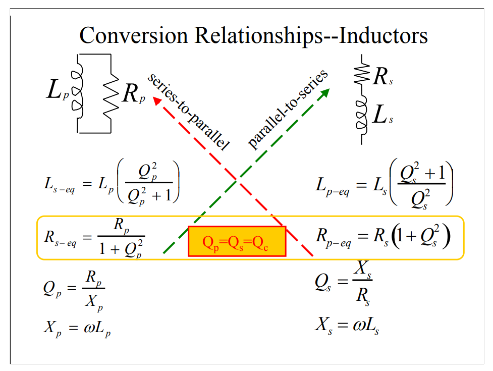

## Conversion Relationships

### Capacitor

---

### Inductor

### Derivation

## series or parallel representation

## reference

Tank Circuits/Impedances [[https://stanford.edu/class/ee133/handouts/lecturenotes/lecture5_tank.pdf](https://stanford.edu/class/ee133/handouts/lecturenotes/lecture5_tank.pdf)]

Resonant Circuits  [[https://web.ece.ucsb.edu/~long/ece145b/Resonators.pdf](https://web.ece.ucsb.edu/~long/ece145b/Resonators.pdf)]

Series & Parallel Impedance Parameters and Equivalent Circuits [[https://assets.testequity.com/te1/Documents/pdf/series-parallel-impedance-parameters-an.pdf](https://assets.testequity.com/te1/Documents/pdf/series-parallel-impedance-parameters-an.pdf)]

ES Lecture 35: Non ideal capacitor, Capacitor Q and series RC to parallel RC conversion [[https://youtu.be/CJ_2U5pEB4o?si=4j4CWsLSapeu-hBo](https://youtu.be/CJ_2U5pEB4o?si=4j4CWsLSapeu-hBo)]

