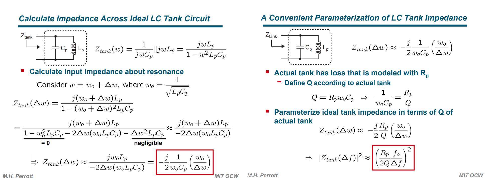
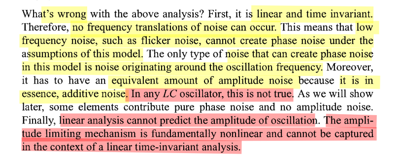
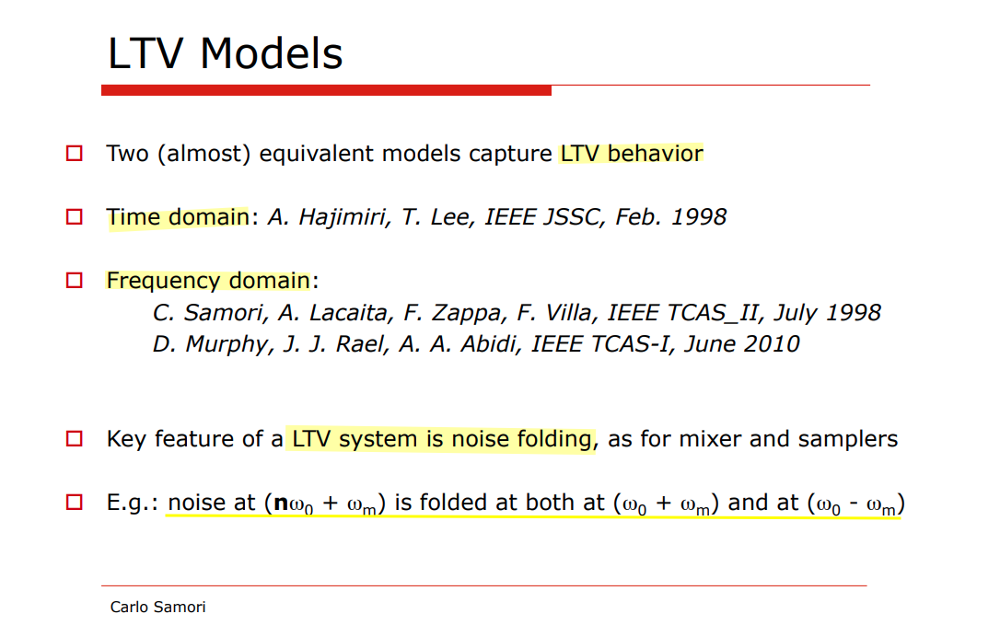
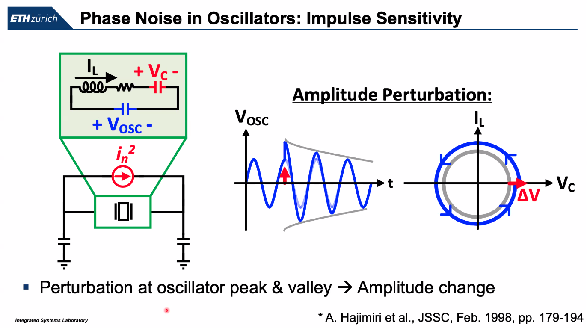
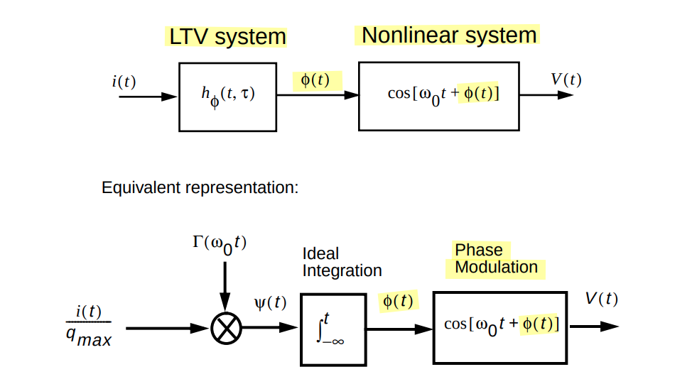
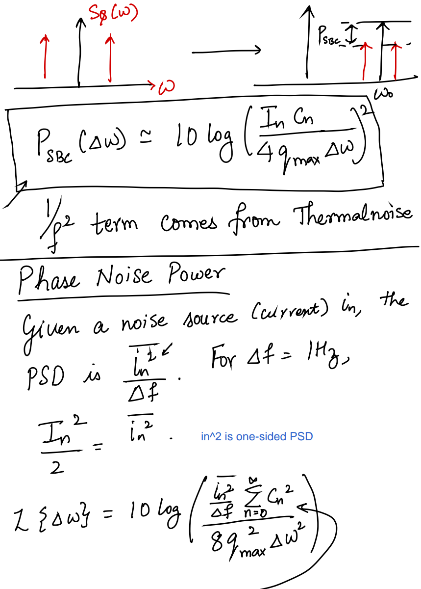

## Leeson's Model - LTI

> M.H. Perrott [[https://www.cppsim.com/PLL_Lectures/day2_am.pdf](https://www.cppsim.com/PLL_Lectures/day2_am.pdf)]
>
> —. [[https://ocw.mit.edu/courses/6-976-high-speed-communication-circuits-and-systems-spring-2003/ceb3d539691d5393a29af71ae98afb62_lec12.pdf](https://ocw.mit.edu/courses/6-976-high-speed-communication-circuits-and-systems-spring-2003/ceb3d539691d5393a29af71ae98afb62_lec12.pdf)]

Leeson's model is outcome of ***linearized*** VCO noise analysis

> $$
> Q = R_p\omega_0 C_p = \frac{R_p}{\omega_0 L}
> $$
>
> where $\omega_0 = \frac{1}{\sqrt{L_pC_p}}$
>
> 
>
> [[https://stanford.edu/class/ee133/handouts/lecturenotes/lecture5_tank.pdf](https://stanford.edu/class/ee133/handouts/lecturenotes/lecture5_tank.pdf)]

---

> Carlo Samori ISSCC2016 T1: Understanding Phase Noise in LC VCOs

### Leeson's limitations

## Hajimiri's  Model- LTV ISF

---

### ISF model

> C. Livanelioglu, L. He, J. Gong, S. Arjmandpour, G. Atzeni and T. Jang, "19.10 A 4.6GHz 63.3fsrms PLL-XO Co-Design Using a Self-Aligned Pulse-Injection Driver Achieving −255.2dB FoMJ Including the XO Power and Noise," *2025 IEEE International Solid-State Circuits Conference (ISSCC)*, San Francisco, CA, USA, 2025
>
> 
>
> 

---

> [[https://adityamuppala.github.io/assets/Notes_YouTube/Oscillators_ISF_model.pdf](https://adityamuppala.github.io/assets/Notes_YouTube/Oscillators_ISF_model.pdf)]

#### Periodic ISF: Noise Folding

When performing the ***phase noise computation integral***, there will be a negligible contribution from all terms, other than $n=m$

> 

Given $i(t) = I_m \cos[(m\omega_0 +\Delta \omega)t]$,

$$\begin{align}
\phi(t) &= \frac{1}{q_\text{max}}\left[\frac{C_0}{2}\int_{-\infty}^t I_m\cos((m\omega_0 +\Delta \omega)\tau)d\tau + \sum_{n=1}^\infty C_n\int_{-\infty}^t I_m\cos((m\omega_0 +\Delta \omega)\tau)\cos(n\omega_0\tau)d\tau\right] \\
&= \frac{I_m}{q_\text{max}}\left[\frac{C_0}{2}\int_{-\infty}^t \cos((m\omega_0 +\Delta \omega)\tau)d\tau + \sum_{n=1}^\infty C_n\int_{-\infty}^t \frac{\cos((m\omega_0 + \Delta \omega+ n\omega_0)\tau)+ \cos((m\omega_0+\Delta \omega - n\omega_0)\tau)}{2}d\tau\right]
\end{align}$$

If $m=0$
$$
\phi(t) \approx \frac{I_0C_0}{2q_\text{max}\Delta \omega}\sin(\Delta\omega t)
$$
If $m\neq 0$ and $m=n$
$$
\phi(t) \approx \frac{I_mC_m}{2q_\text{max}\Delta \omega}\sin(\Delta\omega t)
$$

> $m\omega_0 +\Delta \omega \ge 0$
>
> 

> A. Hajimiri and T. H. Lee, "A general theory of phase noise in electrical oscillators," in *IEEE Journal of Solid-State Circuits*, vol. 33, no. 2, pp. 179-194, Feb. 1998 [[pdf](https://people.engr.tamu.edu/spalermo/ecen620/general_pn_theory_hajimiri_jssc_1998.pdf)]
>
> 

---

***Corrections to "A General Theory of Phase Noise in Electrical Oscillators"***

>  A. Hajimiri and T. H. Lee, "Corrections to "A General Theory of Phase Noise in Electrical Oscillators"," in *IEEE Journal of Solid-State Circuits*, vol. 33, no. 6, pp. 928-928, June 1998 [[https://sci-hub.se/10.1109/4.678662](https://sci-hub.se/10.1109/4.678662)]
>
>  Ali Hajimiri. Phase Noise in Oscillators [[http://www-smirc.stanford.edu/papers/Orals98s-ali.pdf](http://www-smirc.stanford.edu/papers/Orals98s-ali.pdf)]
>
>  L. Lu, Z. Tang, P. Andreani, A. Mazzanti and A. Hajimiri, "Comments on “Comments on “A General Theory of Phase Noise in Electrical Oscillators””," in *IEEE Journal of Solid-State Circuits*, vol. 43, no. 9, pp. 2170-2170, Sept. 2008 [[https://sci-hub.se/10.1109/JSSC.2008.2005028](https://sci-hub.se/10.1109/JSSC.2008.2005028)]

> 

Given $i(t) = I_m \cos[(m\omega_0 - \Delta \omega)t]$ and $m \ge 1$

$$\begin{align}
\phi(t) &= \frac{1}{q_\text{max}}\left[\frac{C_0}{2}\int_{-\infty}^t I_m\cos((m\omega_0 -\Delta \omega)\tau)d\tau + \sum_{n=1}^\infty C_n\int_{-\infty}^t I_m\cos((m\omega_0 -\Delta \omega)\tau)\cos(n\omega_0\tau)d\tau\right] \\
&= \frac{I_m}{q_\text{max}}\left[\frac{C_0}{2}\int_{-\infty}^t \cos((m\omega_0 -\Delta \omega)\tau)d\tau + \sum_{n=1}^\infty C_n\int_{-\infty}^t \frac{\cos((m\omega_0 - \Delta \omega+ n\omega_0)\tau)+ \cos((m\omega_0-\Delta \omega - n\omega_0)\tau)}{2}d\tau\right]
\end{align}$$

If $m\ge 1$ and $m=n$
$$
\phi(t) \approx \frac{I_mC_m}{2q_\text{max}\Delta \omega}\sin(\Delta\omega t)
$$
That is

|                          | $m = 0$                                                      | $m\gt 0$ & $m\omega_0+\Delta \omega$                         | $m\gt 0$ & $m\omega_0-\Delta \omega$                         |
| ------------------------ | ------------------------------------------------------------ | ------------------------------------------------------------ | ------------------------------------------------------------ |
| $\phi(t)$                | $\frac{I_0C_0}{2q_\text{max}\Delta \omega}\sin(\Delta\omega t)$ | $\frac{I_mC_m}{2q_\text{max}\Delta \omega}\sin(\Delta\omega t)$ | $\frac{I_mC_m}{2q_\text{max}\Delta \omega}\sin(\Delta\omega t)$ |
| $P_{SBC}(\Delta \omega)$ | $10\log(\frac{I_0^2C_0^2}{16q_\text{max}^2\Delta \omega^2})$ | $10\log(\frac{I_m^2C_m^2}{16q_\text{max}^2\Delta \omega^2})$ | $10\log(\frac{I_m^2C_m^2}{16q_\text{max}^2\Delta \omega^2})$ |

$$\begin{align}
\mathcal{L}\{\Delta \omega\} &= 10\log\left(\frac{I_0^2C_0^2}{16q_\text{max}^2\Delta \omega^2} +  2\frac{I_m^2C_m^2}{16q_\text{max}^2\Delta \omega^2}\right) \\
&= 10\log\left(\frac{\overline{i_n^2/\Delta f}\cdot \frac{C_0^2}{2} }{4q_\text{max}^2\Delta \omega^2} + \frac{\overline{i_n^2/\Delta f}\cdot\sum_{m=1}^\infty C_m^2 }{4q_\text{max}^2\Delta \omega^2}\right) \\
&= 10\log \frac{\overline{i_n^2/\Delta f}(C_0^2/2+\sum_{m=1}^\infty C_m^2)}{4q_\text{max}^2\Delta \omega^2} \\
&= 10\log \frac{\overline{i_n^2/\Delta f}\cdot \Gamma_\text{rms}^2}{2q_\text{max}^2\Delta \omega^2}
\end{align}$$

#### ISF & $1/f$-noise up-conversion

*TODO* &#128197;

### ISF Simulation

#### PSS + PXF Method

> Yizhe Hu, "A Simulation Technique of Impulse Sensitivity Function (ISF) Based on Periodic Transfer Function (PXF)" [[https://bbs.eetop.cn/thread-869343-1-1.html](https://bbs.eetop.cn/thread-869343-1-1.html)]

*TODO* &#128197;

#### Transient Method

> David Dolt. ECEN 620 Network Theory - Broadband Circuit Design: "VCO ISF Simulation" [[https://people.engr.tamu.edu/spalermo/ecen620/ISF_SIM.pdf](https://people.engr.tamu.edu/spalermo/ecen620/ISF_SIM.pdf)]

> To compare the ring oscillator and VCO the **total injected charge** to both should be the **same**

## Demir's Model - NLTV PPV

### PPV (Perturbation Projection Vector)

> A. Demir and J. Roychowdhury, "A reliable and efficient procedure for oscillator PPV computation, with phase noise macromodeling applications," in *IEEE Transactions on Computer-Aided Design of Integrated Circuits and Systems*, vol. 22, no. 2, pp. 188-197, Feb. 2003  [[https://sci-hub.se/10.1109/TCAD.2002.806599](https://sci-hub.se/10.1109/TCAD.2002.806599)]
>
> Helene Thibieroz, Customer Support CIC. Using Spectre RF Noise-Aware PLL Methodology to Predict PLL Behavior Accurately  [[https://citeseerx.ist.psu.edu/document?repid=rep1&type=pdf&doi=3056e59ea76165373f90152f915a829d25dabebc](https://citeseerx.ist.psu.edu/document?repid=rep1&type=pdf&doi=3056e59ea76165373f90152f915a829d25dabebc)]
>
> Aditya Varma Muppala. Perturbation Projection Vector (PPV) Theory | Oscillators 11 | MMIC 16 [[youtu.be](https://youtu.be/rbbHfZGT6Jo), [notes](https://adityamuppala.github.io/assets/Notes_YouTube/PPV_Theory_Notes.pdf)]

### Limit Cycles

> [[https://adityamuppala.github.io/assets/Notes_YouTube/MMIC_Limit_Cycles.pdf](https://adityamuppala.github.io/assets/Notes_YouTube/MMIC_Limit_Cycles.pdf)]

> ***Nonlinear*** Dynamics

 

## reference

Jiří Lebl. **Notes on Diffy Qs: Differential Equations for Engineers** [[link](https://www.jirka.org/diffyqs/)]

Matt Charnley. **Differential Equations: An Introduction for Engineers** [[link](https://sites.rutgers.edu/matthew-charnley/course-materials/differential-equations-an-introduction-for-engineers/)]

Åström, K.J. & Murray, Richard. (2021). **Feedback Systems: An Introduction for Scientists and Engineers Second Edition** [[https://www.cds.caltech.edu/~murray/books/AM08/pdf/fbs-public_24Jul2020.pdf](https://www.cds.caltech.edu/~murray/books/AM08/pdf/fbs-public_24Jul2020.pdf)]

Strogatz, S.H. (2015). **Nonlinear Dynamics and Chaos: With Applications to Physics, Biology, Chemistry, and Engineering (2nd ed.)**. CRC Press [[https://www.biodyn.ro/course/literatura/Nonlinear_Dynamics_and_Chaos_2018_Steven_H._Strogatz.pdf](https://www.biodyn.ro/course/literatura/Nonlinear_Dynamics_and_Chaos_2018_Steven_H._Strogatz.pdf)]

Cadence Blog, "Resonant Frequency vs. Natural Frequency in Oscillator Circuits"  [[link](https://resources.pcb.cadence.com/blog/2019-resonant-frequency-vs-natural-frequency-in-oscillator-circuits)]

---

Aditya Varma Muppala. Oscillators [[https://youtube.com/playlist?list=PL9Trid0A4Da2fOmYTEjhAnUkGPxyiH7H6&si=ILxn8hfkMYjXW5f4](https://youtube.com/playlist?list=PL9Trid0A4Da2fOmYTEjhAnUkGPxyiH7H6&si=ILxn8hfkMYjXW5f4)]

P.E. Allen - 2003. ECE 6440 - Frequency Synthesizers: Lecture 160 – Phase Noise - II [[https://pallen.ece.gatech.edu/Academic/ECE_6440/Summer_2003/L160-PhNoII(2UP).pdf](https://pallen.ece.gatech.edu/Academic/ECE_6440/Summer_2003/L160-PhNoII(2UP).pdf)]

Y. Hu, T. Siriburanon and R. B. Staszewski, "Intuitive Understanding of Flicker Noise Reduction via Narrowing of Conduction Angle in Voltage-Biased Oscillators," in IEEE Transactions on Circuits and Systems II: Express Briefs, vol. 66, no. 12, pp. 1962-1966, Dec. 2019 [[https://sci-hub.se/10.1109/TCSII.2019.2896483](https://sci-hub.se/10.1109/TCSII.2019.2896483)]

S. Levantino, P. Maffezzoni, F. Pepe, A. Bonfanti, C. Samori and A. L. Lacaita, "Efficient Calculation of the Impulse Sensitivity Function in Oscillators," in IEEE Transactions on Circuits and Systems II: Express Briefs, vol. 59, no. 10, pp. 628-632, Oct. 2012 [[https://sci-hub.se/10.1109/TCSII.2012.2208679](https://sci-hub.se/10.1109/TCSII.2012.2208679)]

S. Levantino and P. Maffezzoni, "Computing the Perturbation Projection Vector of Oscillators via Frequency Domain Analysis," in IEEE Transactions on Computer-Aided Design of Integrated Circuits and Systems, vol. 31, no. 10, pp. 1499-1507, Oct. 2012 [[https://sci-hub.se/10.1109/TCAD.2012.2194493](https://sci-hub.se/10.1109/TCAD.2012.2194493)]

Thomas H. Lee. Linearity, Time-Variation, Phase Modulation and Oscillator Phase Noise [[https://class.ece.iastate.edu/djchen/ee507/PhaseNoiseTutorialLee.pdf](https://class.ece.iastate.edu/djchen/ee507/PhaseNoiseTutorialLee.pdf)]

Y. Hu, T. Siriburanon and R. B. Staszewski, "Oscillator Flicker Phase Noise: A Tutorial," in *IEEE Transactions on Circuits and Systems II: Express Briefs*, vol. 68, no. 2, pp. 538-544, Feb. 2021 [[https://ieeexplore.ieee.org/stamp/stamp.jsp?tp=&arnumber=9286468](https://ieeexplore.ieee.org/stamp/stamp.jsp?tp=&arnumber=9286468)]

Jaeha Kim. Lecture 8. Special Topics: Design Trade -Offs in LC -Tuned Oscillators [[https://ocw.snu.ac.kr/sites/default/files/NOTE/7033.pdf](https://ocw.snu.ac.kr/sites/default/files/NOTE/7033.pdf)]

A. Demir, A. Mehrotra and J. Roychowdhury, "Phase noise in oscillators: a unifying theory and numerical methods for characterization," in *IEEE Transactions on Circuits and Systems I: Fundamental Theory and Applications*, vol. 47, no. 5, pp. 655-674, May 2000 [[https://sci-hub.se/10.1109/81.847872](https://sci-hub.se/10.1109/81.847872)]

---

A. A. Abidi and D. Murphy, "How to Design a Differential CMOS LC Oscillator," in IEEE Open Journal of the Solid-State Circuits Society, vol. 5, pp. 45-59, 2025 [[https://ieeexplore.ieee.org/stamp/stamp.jsp?arnumber=10818782](https://ieeexplore.ieee.org/stamp/stamp.jsp?arnumber=10818782)]

Akihide Sai, Toshiba. ISSCC 2023 T5: All-digital PLLs From Fundamental Concepts to Future Trends [[https://www.nishanchettri.com/isscc-slides/2023%20ISSCC/TUTORIALS/T5.pdf](https://www.nishanchettri.com/isscc-slides/2023%20ISSCC/TUTORIALS/T5.pdf)]

---

Pietro Andreani. ISSCC 2011 T1: Integrated LC oscillators [[slides](https://www.nishanchettri.com/isscc-slides/2011%20ISSCC/TUTORIALS/ISSCC2011Visuals-T1.pdf),[transcript](https://www.nishanchettri.com/isscc-slides/2011%20ISSCC/TUTORIALS/Transcription_T1.pdf)]

—. ISSCC 2017 F2: Integrated Harmonic Oscillators

—. SSCS Distinguished Lecture: RF Harmonic Oscillators Integrated in Silicon Technologies [[https://www.ieeetoronto.ca/wp-content/uploads/2020/06/DL-Toronto.pdf](https://www.ieeetoronto.ca/wp-content/uploads/2020/06/DL-Toronto.pdf)]

—. ESSCIRC 2019 Tutorials: RF Harmonic Oscillators Integrated in Silicon Technologies [[https://youtu.be/k1I9nP9eEHE?si=fns9mf3aHjMJobPH](https://youtu.be/k1I9nP9eEHE?si=fns9mf3aHjMJobPH)]

—. "Harmonic Oscillators in CMOS—A Tutorial Overview," in IEEE Open Journal of the Solid-State Circuits Society, vol. 1, pp. 2-17, 2021 [[pdf](https://ieeexplore.ieee.org/stamp/stamp.jsp?tp=&arnumber=9530265)]

C. Samori, "Tutorial: Understanding Phase Noise in LC VCOs," *2016 IEEE International Solid-State Circuits Conference (ISSCC)*, San Francisco, CA, USA, 2016

—, "Understanding Phase Noise in LC VCOs: A Key Problem in RF Integrated Circuits," in *IEEE Solid-State Circuits Magazine*, vol. 8, no. 4, pp. 81-91, Fall 2016 [[https://sci-hub.se/10.1109/MSSC.2016.2573979](https://sci-hub.se/10.1109/MSSC.2016.2573979)]

—, Phase Noise in LC Oscillators: From Basic Concepts to Advanced Topologies [[https://www.ieeetoronto.ca/wp-content/uploads/2020/06/DL-VCO-short.pdf](https://www.ieeetoronto.ca/wp-content/uploads/2020/06/DL-VCO-short.pdf)]

Jun Yin. ISSCC 2025  T10:  mm-Wave Oscillator Design

---

Hegazi, Emad, Asad Abidi, and Jacob Rael. *The Designer's Guide to High-purity Oscillators*. [New York]: Kluwer Academic Publishers, 2005. *The Designer's Guide to High-Purity Oscillators* [[pdf](https://picture.iczhiku.com/resource/eetop/whkgGLPAHoORYxbC.pdf)]
