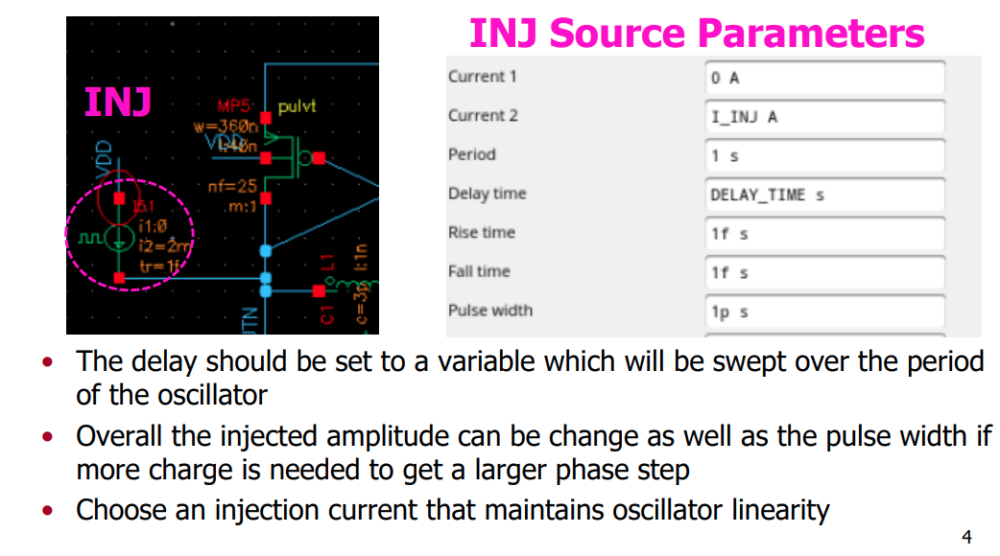
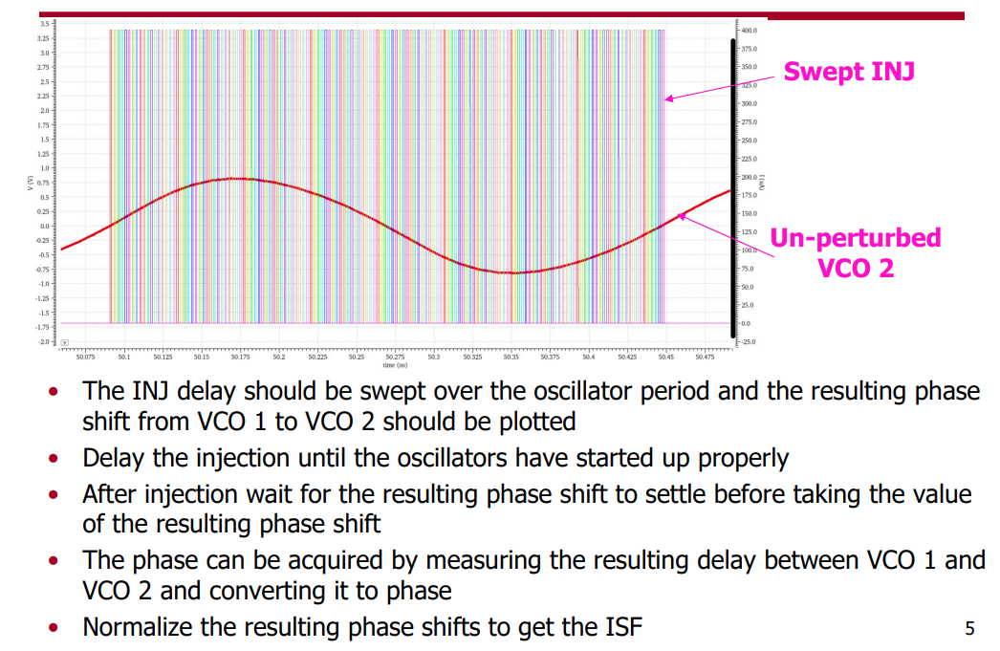

## VCO ISF Simulation

### PSS + PXF Method

> Yizhe Hu, "A Simulation Technique of Impulse Sensitivity Function (ISF) Based on Periodic Transfer Function (PXF)" [[https://bbs.eetop.cn/thread-869343-1-1.html](https://bbs.eetop.cn/thread-869343-1-1.html)]

*TODO* &#128197;

### Transient Method

> David Dolt. ECEN 620 Network Theory - Broadband Circuit Design: "VCO ISF Simulation" [[https://people.engr.tamu.edu/spalermo/ecen620/ISF_SIM.pdf](https://people.engr.tamu.edu/spalermo/ecen620/ISF_SIM.pdf)]

> To compare the ring oscillator and VCO the **total injected charge** to both should be the **same**

## reference

A. Hajimiri and T. H. Lee, "A general theory of phase noise in electrical oscillators," in *IEEE Journal of Solid-State Circuits*, vol. 33, no. 2, pp. 179-194, Feb. 1998 [[paper](https://people.engr.tamu.edu/spalermo/ecen620/general_pn_theory_hajimiri_jssc_1998.pdf)], [[slides](http://www-smirc.stanford.edu/papers/Orals98s-ali.pdf)]

-, "Corrections to "A General Theory of Phase Noise in Electrical Oscillators"" [[https://ieeexplore.ieee.org/stamp/stamp.jsp?arnumber=678662](https://ieeexplore.ieee.org/stamp/stamp.jsp?arnumber=678662)]

-, RFIC2024 "Noise in Oscillators from Understanding to Design"

Carlo Samori, "Phase Noise in LC Oscillators: From Basic Concepts to Advanced Topologies" [[https://www.ieeetoronto.ca/wp-content/uploads/2020/06/DL-VCO-short.pdf](https://www.ieeetoronto.ca/wp-content/uploads/2020/06/DL-VCO-short.pdf)]

C. Samori, "Understanding Phase Noise in LC VCOs: A Key Problem in RF Integrated Circuits," in *IEEE Solid-State Circuits Magazine*, vol. 8, no. 4, pp. 81-91, Fall 2016 [[https://picture.iczhiku.com/resource/eetop/whIgTikLswaaTVBv.pdf](https://picture.iczhiku.com/resource/eetop/whIgTikLswaaTVBv.pdf)]

-, ISSCC2016, "Understanding Phase Noise in LC VCOs"

F. L. Traversa, M. Bonnin and F. Bonani, "The Complex World of Oscillator Noise: Modern Approaches to Oscillator (Phase and Amplitude) Noise Analysis," in *IEEE Microwave Magazine*, vol. 22, no. 7, pp. 24-32, July 2021 [[https://iris.polito.it/retrieve/handle/11583/2903596/e384c433-b8f5-d4b2-e053-9f05fe0a1d67/MM%20noise%20-%20v5.pdf](https://iris.polito.it/retrieve/handle/11583/2903596/e384c433-b8f5-d4b2-e053-9f05fe0a1d67/MM%20noise%20-%20v5.pdf)]

Poddar, Ajay & Rohde, Ulrich & Apte, Anisha. (2013). How Low Can They Go?: Oscillator Phase Noise Model, Theoretical, Experimental Validation, and Phase Noise Measurements. Microwave Magazine, IEEE. [[http://time.kinali.ch/rohde/noise/how_low_can_they_go-2013-poddar_rohde_apte.pdf](http://time.kinali.ch/rohde/noise/how_low_can_they_go-2013-poddar_rohde_apte.pdf)]

Pietro Andreani, "RF Harmonic Oscillators Integrated in Silicon Technologies" [[https://www.ieeetoronto.ca/wp-content/uploads/2020/06/DL-Toronto.pdf](https://www.ieeetoronto.ca/wp-content/uploads/2020/06/DL-Toronto.pdf)]

