## Phase Noise Definition

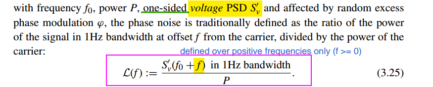

> Eq. (3.25) is widely adopted by industry and academia

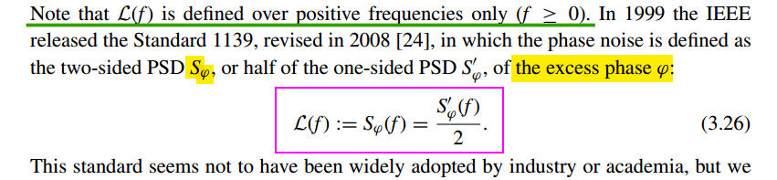

> *using the narrow angle assumption*, the two definitions above are equivalent
>
> If the *narrow angle* condition is not satisfied, however, the two definitions differ

---

> Sam Palermo, ECEN620: Network Theory Broadband Circuit Design Fall 2025, Lecture 7: Voltage-Controlled Oscillators[[https://people.engr.tamu.edu/spalermo/ecen620/lecture07_ee620_vcos.pdf](https://people.engr.tamu.edu/spalermo/ecen620/lecture07_ee620_vcos.pdf)]

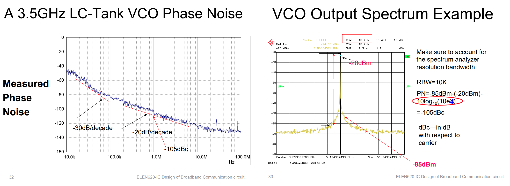

## Phase Noise Profile

> Power Spectral Density of Brownian Motion despite non-stationary [[https://dsp.stackexchange.com/a/75043/59253](https://dsp.stackexchange.com/a/75043/59253)]

***white noise*** — $1/f^2$ Phase Noise Profile

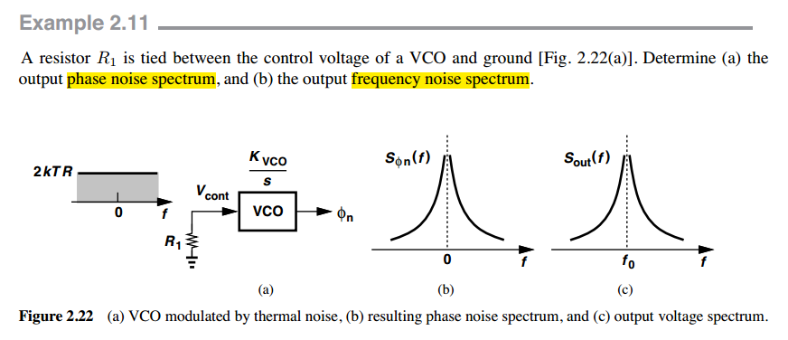

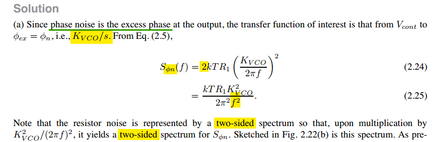

> 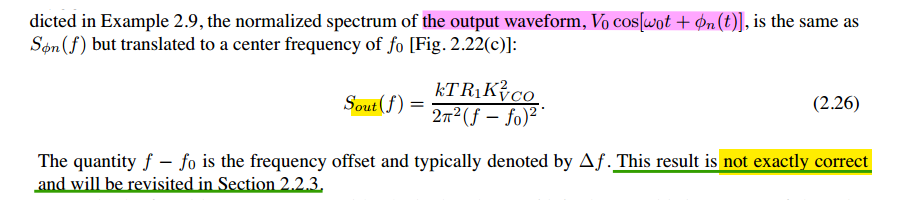

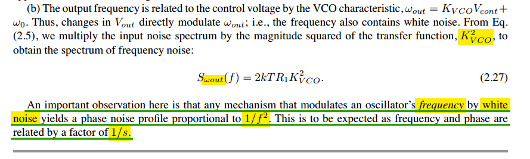

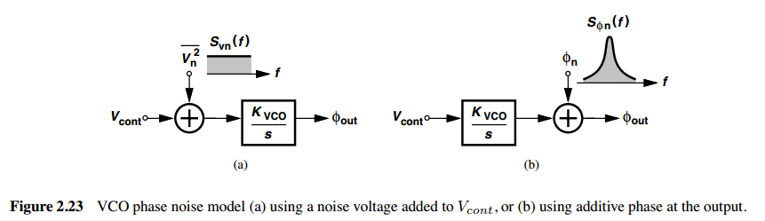

---

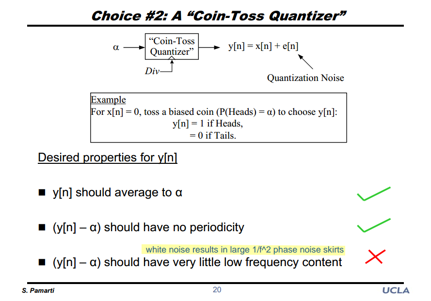

> Sudhakar Pamarti. CICC 2020 ES2-2: Basics of Closed- and Open-Loop Fractional Frequency Synthesis [[https://youtu.be/t1TY-D95CY8](https://youtu.be/t1TY-D95CY8)]

---

---

***flicker noise*** — 1/f^3$ Phase Noise Profile
$$
S_{\phi n} = \frac{K}{f}\left(\frac{K_{VCO}}{2\pi f}\right)^2 \propto \frac{1}{f^3}
$$

---

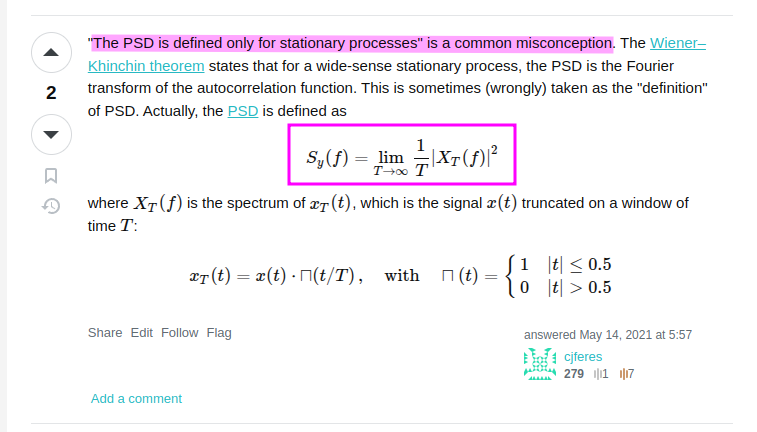

> [[https://dsp.stackexchange.com/a/75152/59253](https://dsp.stackexchange.com/a/75152/59253)]

## Free-running Oscillator

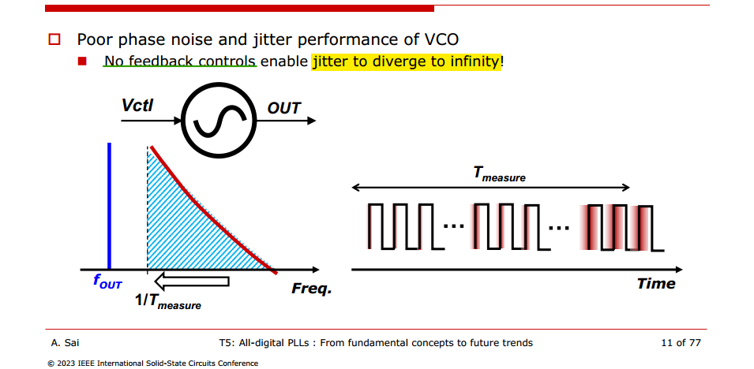

> Note that $f_{min}$ is related to the observation time. The longer we observe the device under test, the smaller $f_{min}$ must be

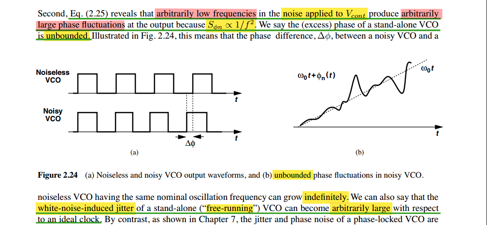

---

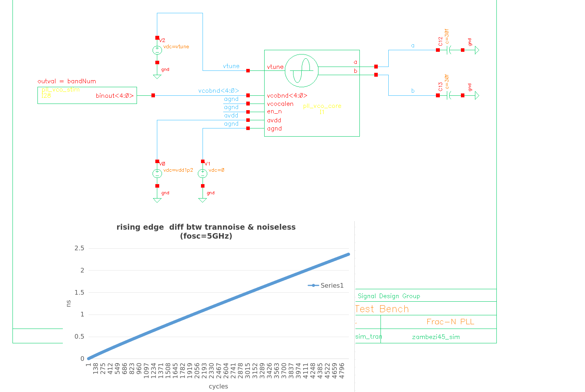

---

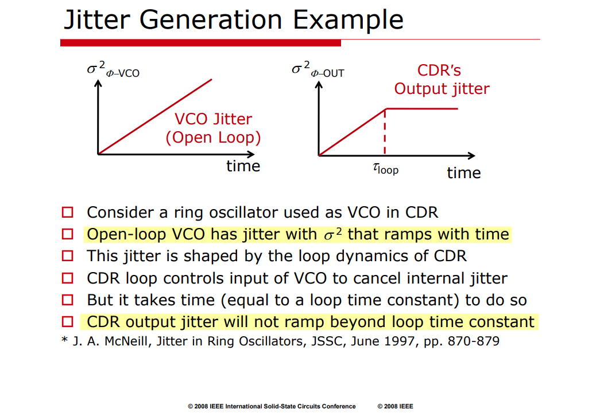

> Ali Sheikholeslami ISSCC 2008 T5: Basics of Chip-to-Chip and Backplane Signaling [[https://www.nishanchettri.com/isscc-slides/2008%20ISSCC/Tutorials/T10_Pres.pdf](https://www.nishanchettri.com/isscc-slides/2008%20ISSCC/Tutorials/T10_Pres.pdf)]

---

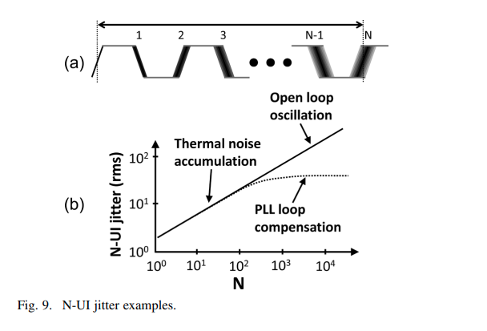

> B. Casper and F. O'Mahony, "Clocking Analysis, Implementation and Measurement Techniques for High-Speed Data Links-A Tutorial," in IEEE Transactions on Circuits and Systems I. [[https://people.engr.tamu.edu/spalermo/ecen689/clocking_analysis_hs_links_casper_tcas1_2009.pdf](https://people.engr.tamu.edu/spalermo/ecen689/clocking_analysis_hs_links_casper_tcas1_2009.pdf)]

## Lorentzian spectrum

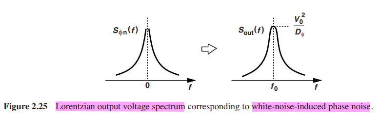

We typically use the two spectra, $S_{\phi n}(f)$ and $S_{out}(f)$, interchangeably, but we must resolve these inconsistencies. **voltage spectrum**  is called **Lorentzian spectrum**

---

The periodic signal $x(t)$ can be expanded in Fourier series as:

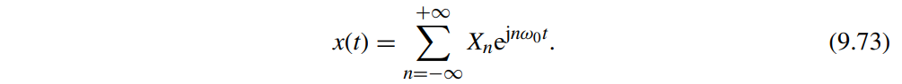

Assume that the signal is subject to *excess phase noise*, which is modeled by adding a **time-dependent** noise component $\alpha(t)$. The noisy signal can be written $x(t+\alpha(t))$, the added excess phase $\phi(t)= \frac{\alpha(t)}{\omega_0}$

> 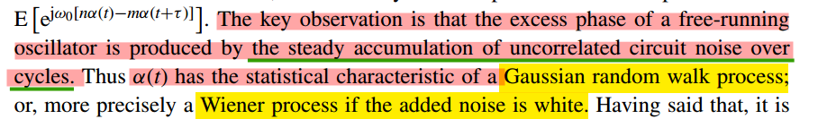

The autocorrelation of the noisy signal is by definition:

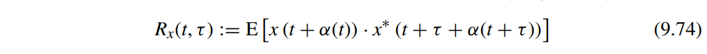

The *autocorrelation averaged over time* results in:

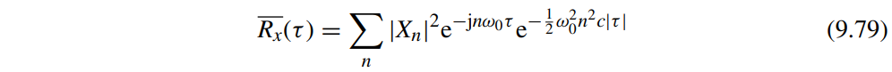

By taking the Fourier transform of the autocorrelation, the spectrum of the signal $x(t + \alpha(t))$​ can be expressed as

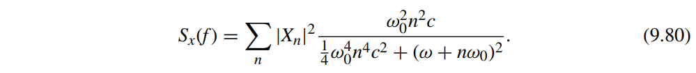

It is also interesting to note how the integral in *Equation 9.80* around each harmonic is equal to the power of the harmonic itself $|X_n|^2$

The integral $S_x(f)$ around harmonic is
$$\begin{align}
P_{x,n} &= \int_{f=-\infty}^{\infty} |X_n|^2\frac{\omega_0^2n^2c}{\frac{1}{4}\omega_0^4n^4c^2+(\omega +n\omega_0)^2}df \\
&= |X_n|^2\int_{\Delta f=-\infty}^{\infty}\frac{2\beta}{\beta^2+(2\pi\cdot\Delta f)^2}d\Delta f \\
&= |X_n|^2\frac{1}{\pi}\arctan(\frac{2\pi \Delta f}{\beta})|_{-\infty}^{\infty} \\
&= |X_n|^2
\end{align}$$

***The phase noise does not affect the total power in the signal, it only affects its distribution***

- Without phase noise, $S_v(f)$ is a series of impulse functions at the harmonics of $f_o$.
- With phase noise, the impulse functions spread, becoming fatter and shorter but retaining the *same total power*

> 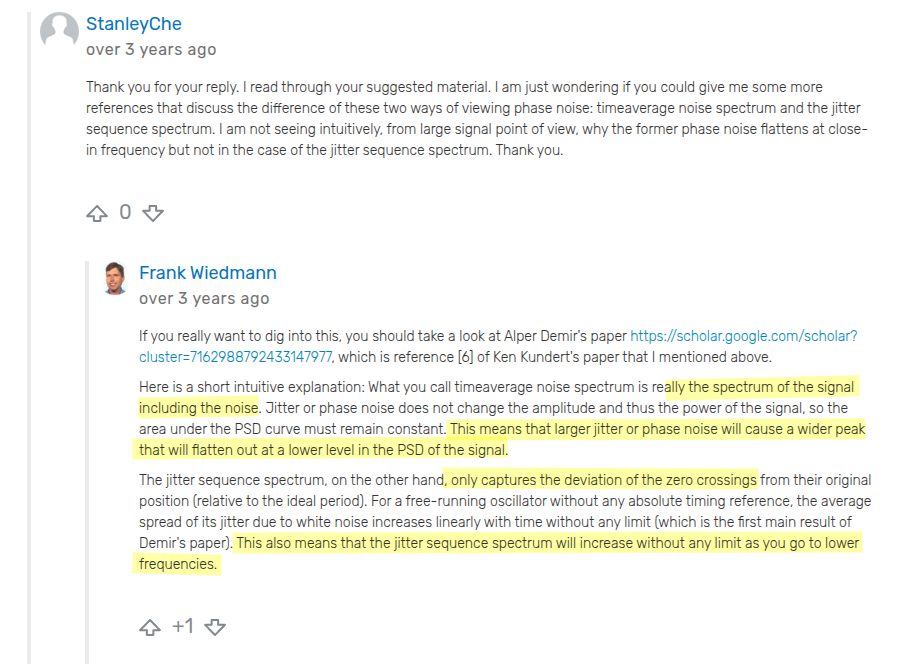
>
> [[https://community.cadence.com/cadence_technology_forums/f/rf-design/51484/comparing-transient-noise-pnoise-and-pnoise-with-lorentian-approximation-of-a-ring-oscillator/1382911](https://community.cadence.com/cadence_technology_forums/f/rf-design/51484/comparing-transient-noise-pnoise-and-pnoise-with-lorentian-approximation-of-a-ring-oscillator/1382911)]

---

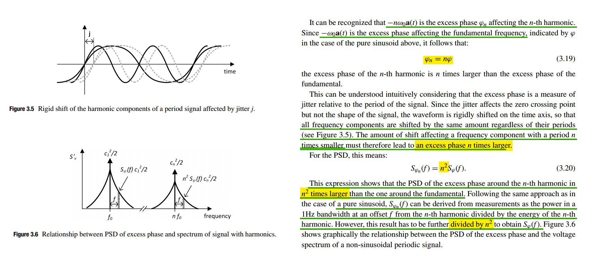

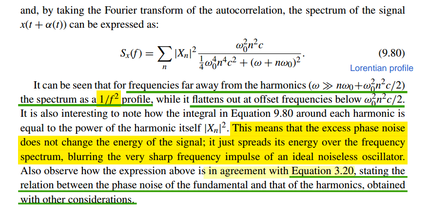

## Leeson's Model — LTI

> M.H. Perrott [[https://www.cppsim.com/PLL_Lectures/day2_am.pdf](https://www.cppsim.com/PLL_Lectures/day2_am.pdf)]
>
> —. [[https://ocw.mit.edu/courses/6-976-high-speed-communication-circuits-and-systems-spring-2003/ceb3d539691d5393a29af71ae98afb62_lec12.pdf](https://ocw.mit.edu/courses/6-976-high-speed-communication-circuits-and-systems-spring-2003/ceb3d539691d5393a29af71ae98afb62_lec12.pdf)]

Leeson's model is outcome of ***linearized*** VCO noise analysis

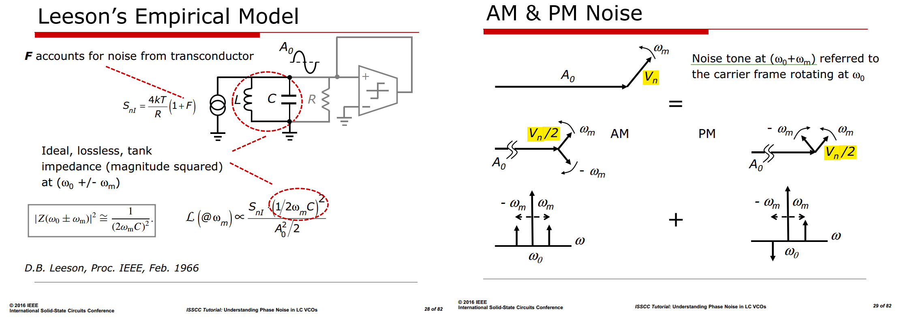

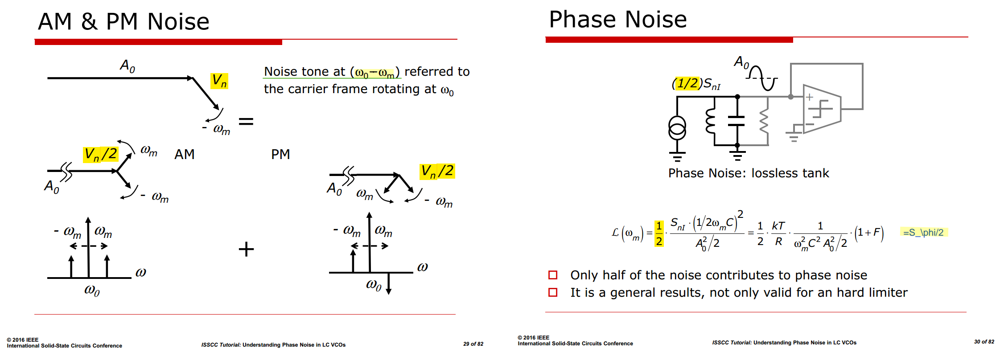

Assuming voltage noise tone $(\omega_0+\omega_m)$  and $(\omega_0-\omega_m)$ are **independent** and **symmetric**



---

***Leeson's limitations***

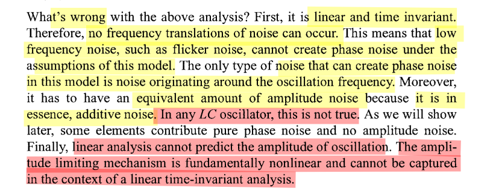

## Hajimiri's Model — LTV ISF

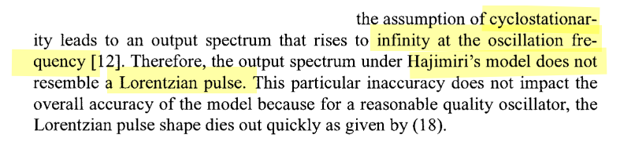

---

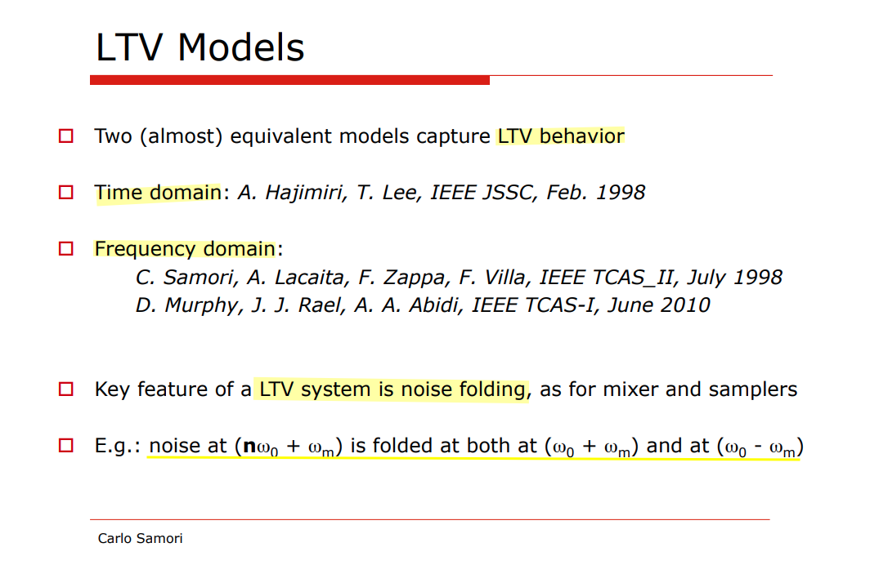

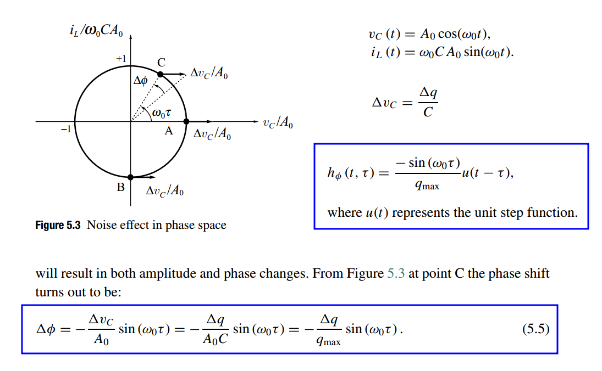

Decompose the horizontal kick $\Delta\vec r=(\Delta x,0) $ and $\Delta x=\Delta v_C/A_0$, with tangential direction $\hat t=(-\sin\theta,\cos\theta)$ and radial direction  $\hat r=(\cos\theta,\sin\theta)$
$$
\Delta \phi = \arctan\left(\frac{\Delta\vec r\cdot \hat t}{1 + \Delta\vec r\cdot \hat r}\right) = \arctan\left(\frac{-\Delta x \sin \theta}{1 + \Delta x \cos \theta}\right)\approx -\frac{\Delta v_C}{A_0} \sin(\omega_0 \tau)
$$
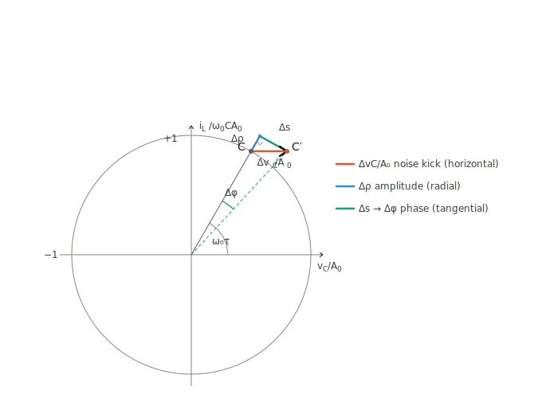

> C. Livanelioglu, L. He, J. Gong, S. Arjmandpour, G. Atzeni and T. Jang, "19.10 A 4.6GHz 63.3fsrms PLL-XO Co-Design Using a Self-Aligned Pulse-Injection Driver Achieving −255.2dB FoMJ Including the XO Power and Noise," *2025 IEEE International Solid-State Circuits Conference (ISSCC)*, San Francisco, CA, USA, 2025
>
> 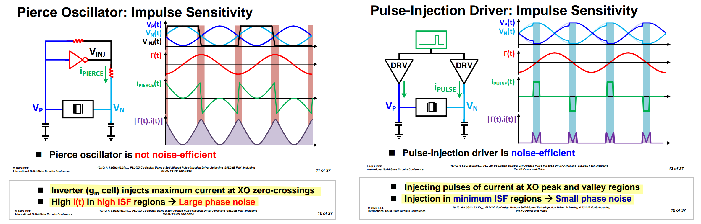

---

> [[https://adityamuppala.github.io/assets/Notes_YouTube/Oscillators_ISF_model.pdf](https://adityamuppala.github.io/assets/Notes_YouTube/Oscillators_ISF_model.pdf)]

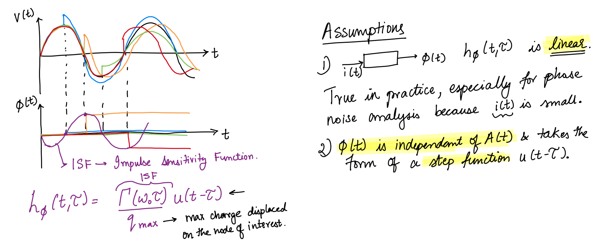

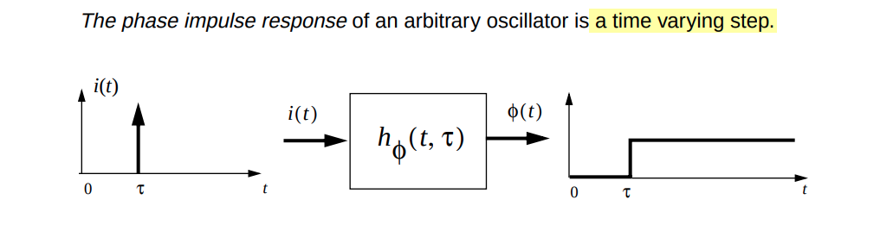

###  white-noise Folding

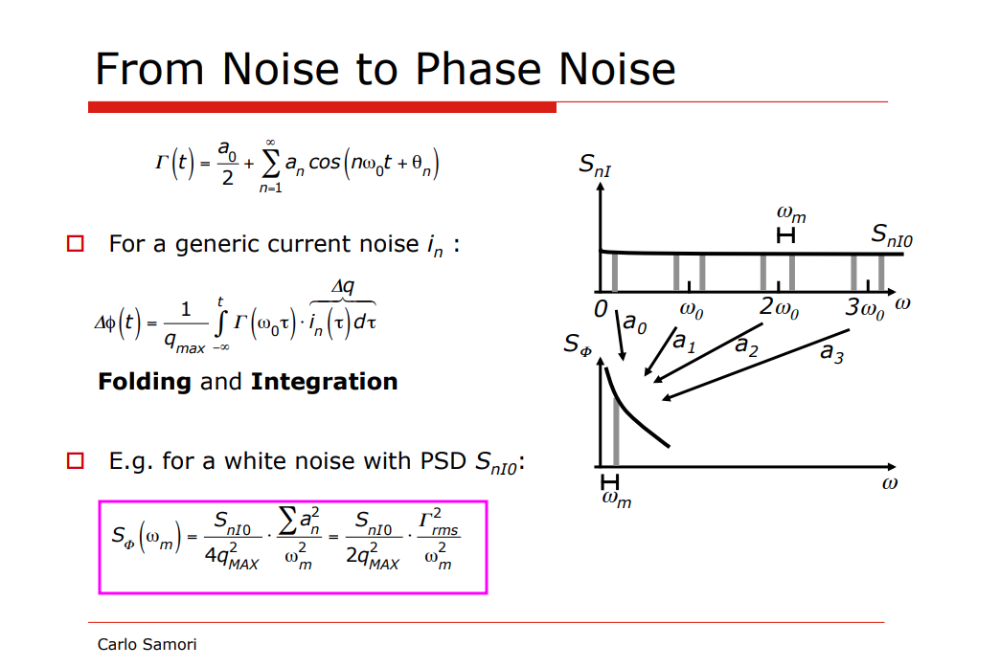

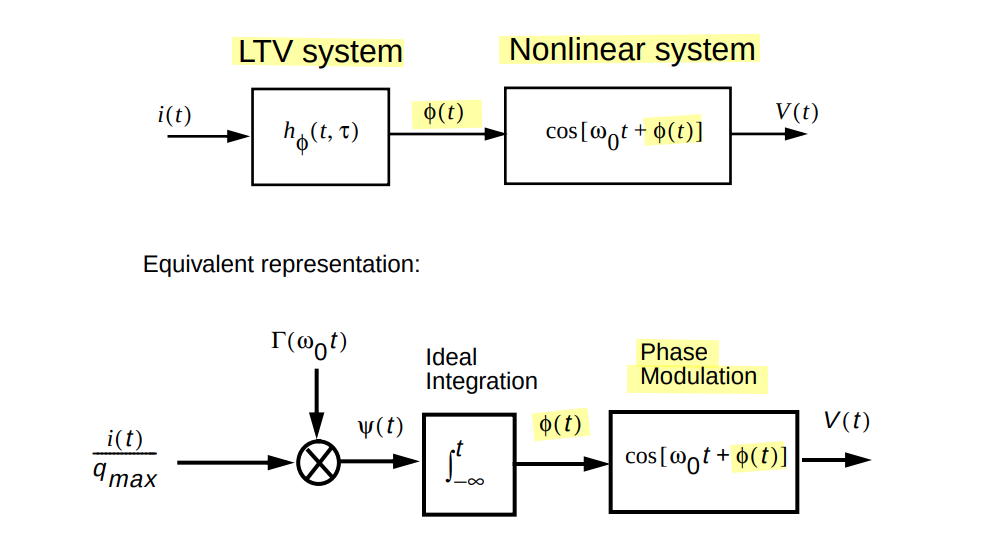

When performing the ***phase noise computation integral***, there will be a negligible contribution from all terms, other than $n=m$

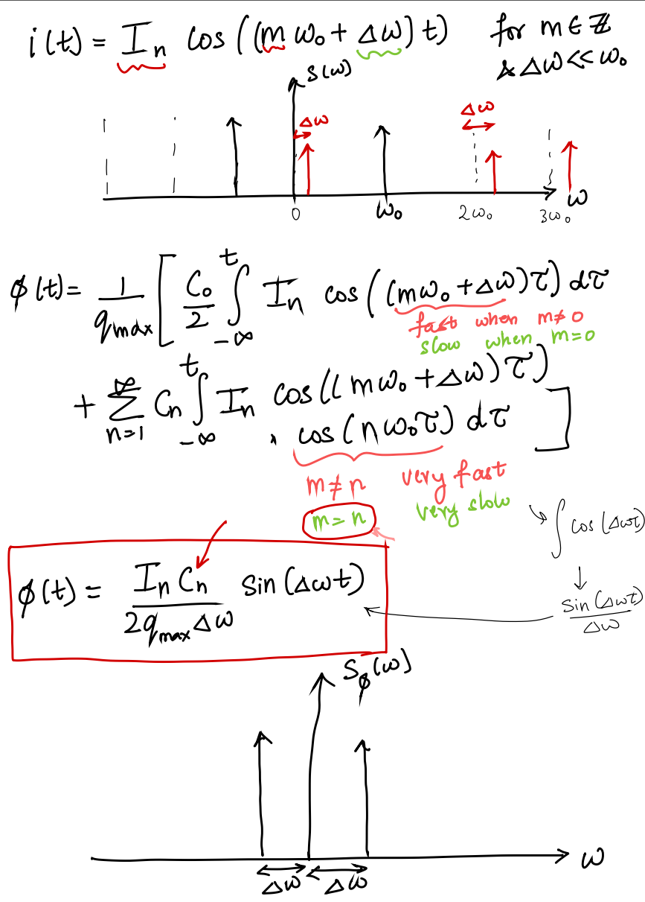

> 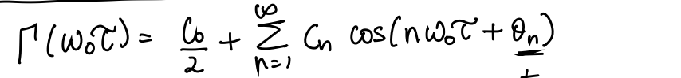

Given $i(t) = I_m \cos[(m\omega_0 +\Delta \omega)t]$,

$$\begin{align}
\phi(t) &= \frac{1}{q_\text{max}}\left[\frac{C_0}{2}\int_{-\infty}^t I_m\cos((m\omega_0 +\Delta \omega)\tau)d\tau + \sum_{n=1}^\infty C_n\int_{-\infty}^t I_m\cos((m\omega_0 +\Delta \omega)\tau)\cos(n\omega_0\tau)d\tau\right] \\
&= \frac{I_m}{q_\text{max}}\left[\frac{C_0}{2}\int_{-\infty}^t \cos((m\omega_0 +\Delta \omega)\tau)d\tau + \sum_{n=1}^\infty C_n\int_{-\infty}^t \frac{\cos((m\omega_0 + \Delta \omega+ n\omega_0)\tau)+ \cos((m\omega_0+\Delta \omega - n\omega_0)\tau)}{2}d\tau\right]
\end{align}$$

If $m=0$
$$
\phi(t) \approx \frac{I_0C_0}{2q_\text{max}\Delta \omega}\sin(\Delta\omega t)
$$
If $m\neq 0$ and $m=n$
$$
\phi(t) \approx \frac{I_mC_m}{2q_\text{max}\Delta \omega}\sin(\Delta\omega t)
$$

> $m\omega_0 +\Delta \omega \ge 0$
>
> 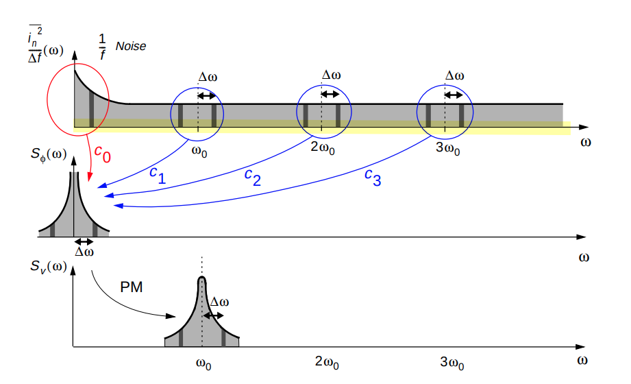

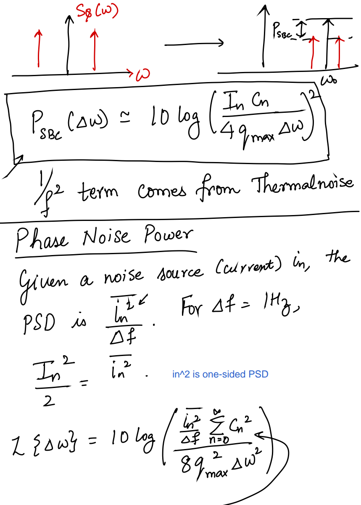

> A. Hajimiri and T. H. Lee, "A general theory of phase noise in electrical oscillators," in *IEEE Journal of Solid-State Circuits*, vol. 33, no. 2, pp. 179-194, Feb. 1998 [[pdf](https://people.engr.tamu.edu/spalermo/ecen620/general_pn_theory_hajimiri_jssc_1998.pdf)]
>
> 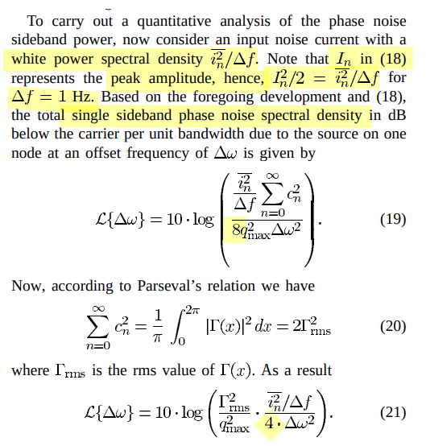

---

***Corrections to "A General Theory of Phase Noise in Electrical Oscillators"***

>  A. Hajimiri and T. H. Lee, "Corrections to "A General Theory of Phase Noise in Electrical Oscillators"," in *IEEE Journal of Solid-State Circuits*, vol. 33, no. 6, pp. 928-928, June 1998 [[https://sci-hub.se/10.1109/4.678662](https://sci-hub.se/10.1109/4.678662)]
>
>  Ali Hajimiri. Phase Noise in Oscillators [[http://www-smirc.stanford.edu/papers/Orals98s-ali.pdf](http://www-smirc.stanford.edu/papers/Orals98s-ali.pdf)]
>
>  L. Lu, Z. Tang, P. Andreani, A. Mazzanti and A. Hajimiri, "Comments on “Comments on “A General Theory of Phase Noise in Electrical Oscillators””," in *IEEE Journal of Solid-State Circuits*, vol. 43, no. 9, pp. 2170-2170, Sept. 2008 [[https://sci-hub.se/10.1109/JSSC.2008.2005028](https://sci-hub.se/10.1109/JSSC.2008.2005028)]

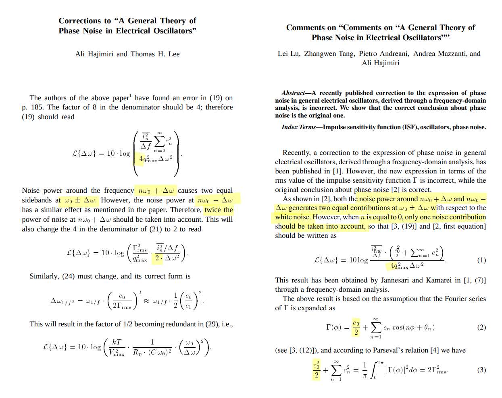

> 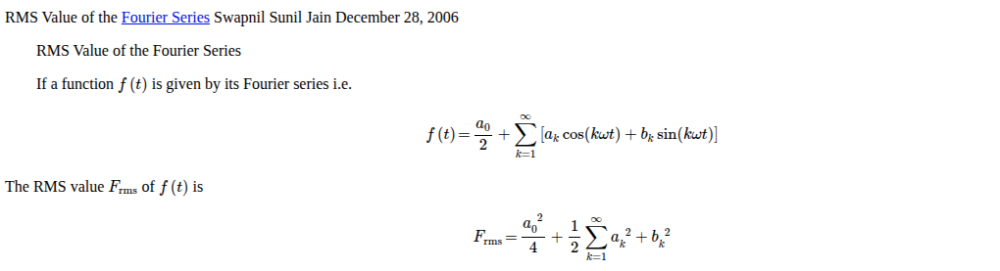

Given $i(t) = I_m \cos[(m\omega_0 - \Delta \omega)t]$ and $m \ge 1$

$$\begin{align}
\phi(t) &= \frac{1}{q_\text{max}}\left[\frac{C_0}{2}\int_{-\infty}^t I_m\cos((m\omega_0 -\Delta \omega)\tau)d\tau + \sum_{n=1}^\infty C_n\int_{-\infty}^t I_m\cos((m\omega_0 -\Delta \omega)\tau)\cos(n\omega_0\tau)d\tau\right] \\
&= \frac{I_m}{q_\text{max}}\left[\frac{C_0}{2}\int_{-\infty}^t \cos((m\omega_0 -\Delta \omega)\tau)d\tau + \sum_{n=1}^\infty C_n\int_{-\infty}^t \frac{\cos((m\omega_0 - \Delta \omega+ n\omega_0)\tau)+ \cos((m\omega_0-\Delta \omega - n\omega_0)\tau)}{2}d\tau\right]
\end{align}$$

If $m\ge 1$ and $m=n$
$$
\phi(t) \approx \frac{I_mC_m}{2q_\text{max}\Delta \omega}\sin(\Delta\omega t)
$$
That is

|                          | $m = 0$                                                      | $m\gt 0$ & $m\omega_0+\Delta \omega$                         | $m\gt 0$ & $m\omega_0-\Delta \omega$                         |
| ------------------------ | ------------------------------------------------------------ | ------------------------------------------------------------ | ------------------------------------------------------------ |
| $\phi(t)$                | $\frac{I_0C_0}{2q_\text{max}\Delta \omega}\sin(\Delta\omega t)$ | $\frac{I_mC_m}{2q_\text{max}\Delta \omega}\sin(\Delta\omega t)$ | $\frac{I_mC_m}{2q_\text{max}\Delta \omega}\sin(\Delta\omega t)$ |
| $P_{SBC}(\Delta \omega)$ | $10\log(\frac{I_0^2C_0^2}{16q_\text{max}^2\Delta \omega^2})$ | $10\log(\frac{I_m^2C_m^2}{16q_\text{max}^2\Delta \omega^2})$ | $10\log(\frac{I_m^2C_m^2}{16q_\text{max}^2\Delta \omega^2})$ |

$$\begin{align}
\mathcal{L}\{\Delta \omega\} &= 10\log\left(\frac{I_0^2C_0^2}{16q_\text{max}^2\Delta \omega^2} +  2\frac{I_m^2C_m^2}{16q_\text{max}^2\Delta \omega^2}\right) = 10\log\left(\frac{\overline{i_n^2/\Delta f}\cdot \frac{C_0^2}{2} }{4q_\text{max}^2\Delta \omega^2} + \frac{\overline{i_n^2/\Delta f}\cdot\sum_{m=1}^\infty C_m^2 }{4q_\text{max}^2\Delta \omega^2}\right) \\
&= 10\log \frac{\overline{i_n^2/\Delta f}(C_0^2/2+\sum_{m=1}^\infty C_m^2)}{4q_\text{max}^2\Delta \omega^2} = 10\log \frac{\overline{i_n^2/\Delta f}\cdot \Gamma_\text{rms}^2}{2q_\text{max}^2\Delta \omega^2}
\end{align}$$

### $1/f$-noise up-conversion

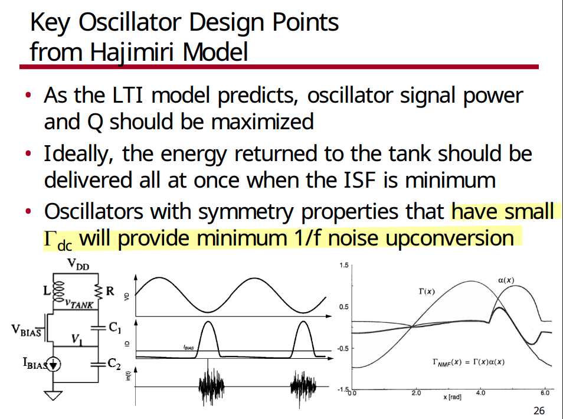

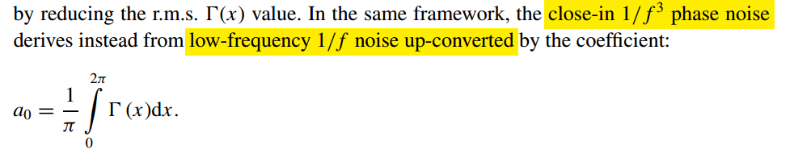

### ISF Simulation Method

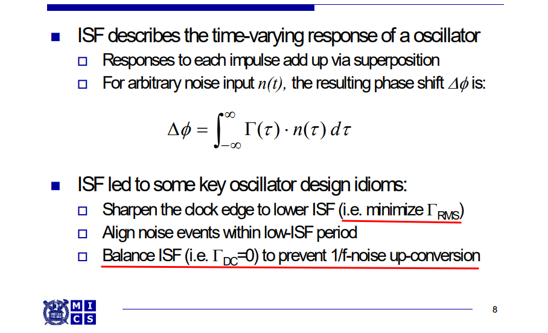

#### PSS + PXF Method

> Hu, Yizhe. (2019). A Simulation Technique of Impulse Sensitivity Function (ISF) Based on Periodic Transfer Function (PXF). 10.13140/RG.2.2.32151.60323. [[link](https://www.researchgate.net/publication/331072119_A_Simulation_Technique_of_Impulse_Sensitivity_Function_ISF_Based_on_Periodic_Transfer_Function_PXF)]

*TODO* &#128197;

#### Transient Method

> David Dolt. ECEN 620 Network Theory - Broadband Circuit Design: "VCO ISF Simulation" [[https://people.engr.tamu.edu/spalermo/ecen620/ISF_SIM.pdf](https://people.engr.tamu.edu/spalermo/ecen620/ISF_SIM.pdf)]

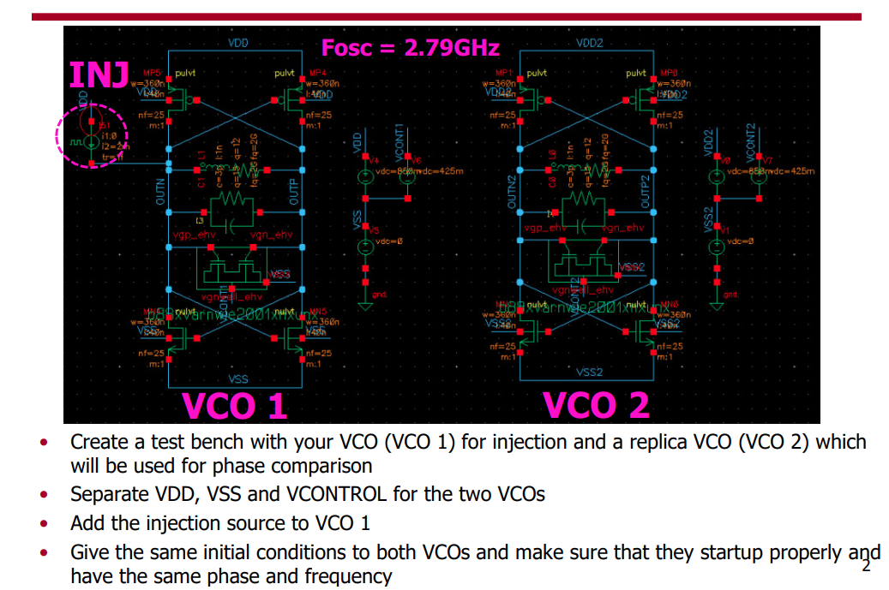

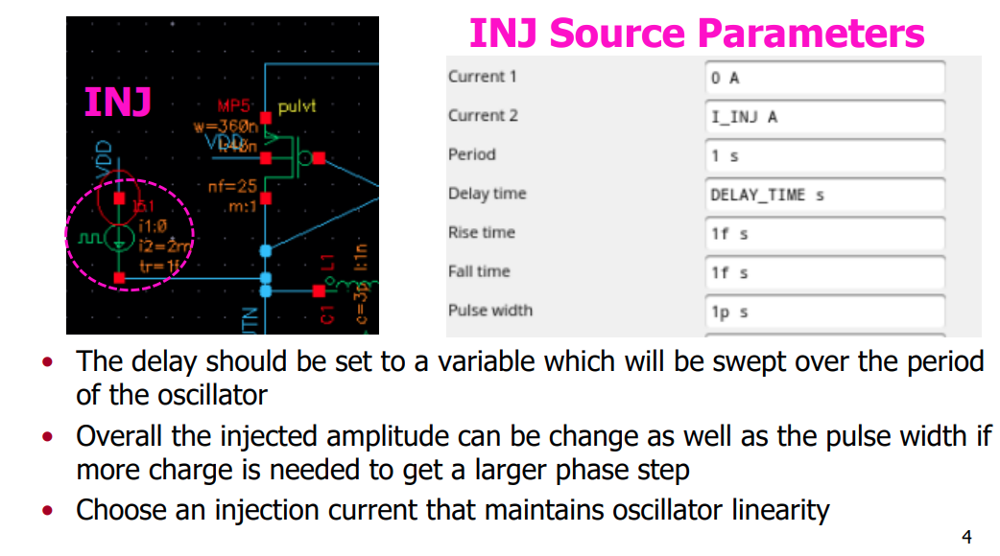

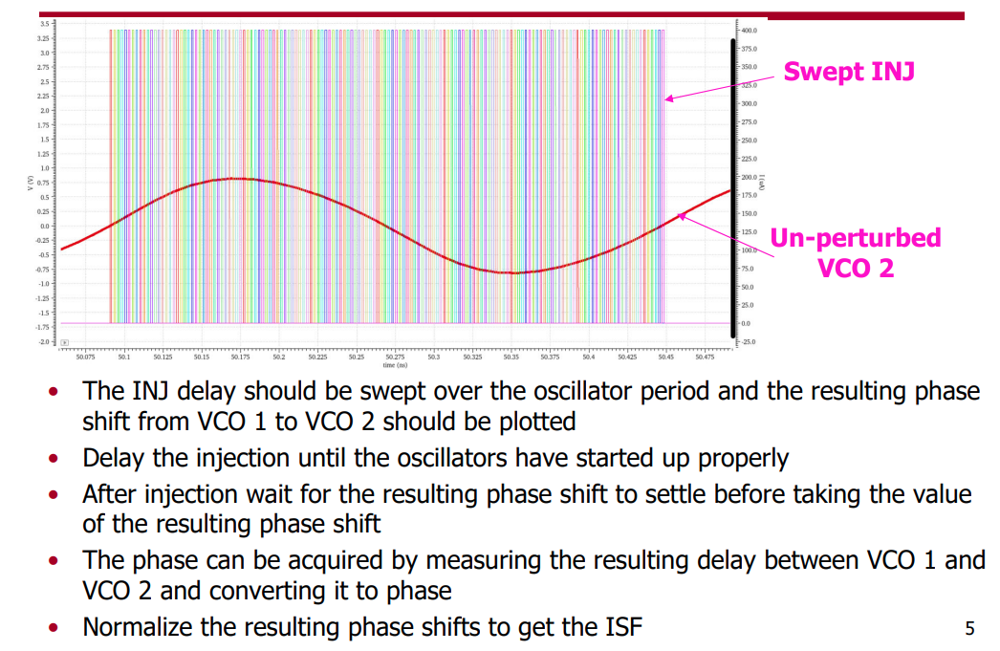

> To compare the ring oscillator and VCO the **total injected charge** to both should be the **same**

## Murphy's Model — LTV in Frequency Domain

## Demir's Model — NLTV PPV

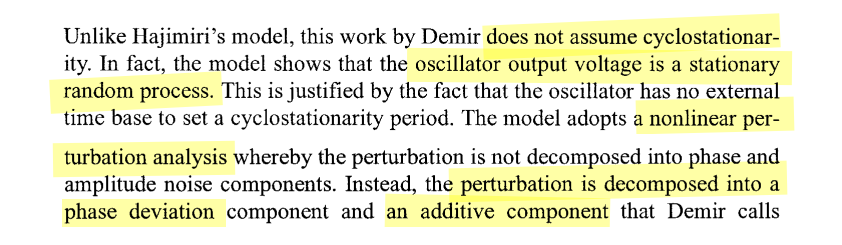

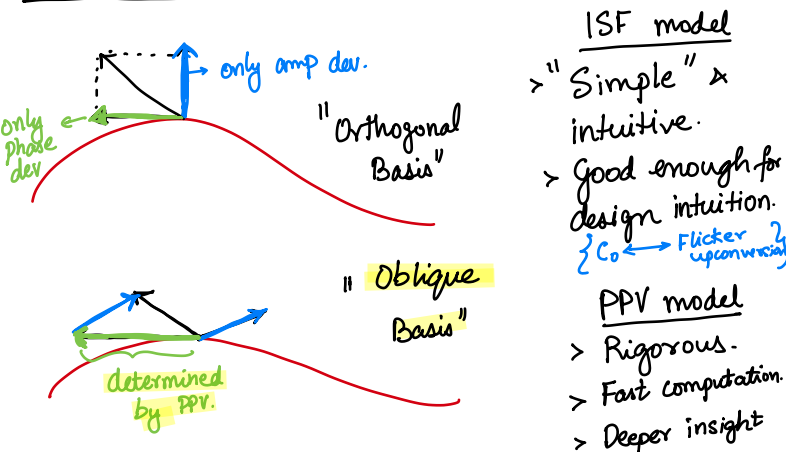

### PPV (Perturbation Projection Vector)

> A. Demir and J. Roychowdhury, "A reliable and efficient procedure for oscillator PPV computation, with phase noise macromodeling applications," in *IEEE Transactions on Computer-Aided Design of Integrated Circuits and Systems*, vol. 22, no. 2, pp. 188-197, Feb. 2003  [[https://sci-hub.se/10.1109/TCAD.2002.806599](https://sci-hub.se/10.1109/TCAD.2002.806599)]
>
> Helene Thibieroz, Customer Support CIC. Using Spectre RF Noise-Aware PLL Methodology to Predict PLL Behavior Accurately  [[https://citeseerx.ist.psu.edu/document?repid=rep1&type=pdf&doi=3056e59ea76165373f90152f915a829d25dabebc](https://citeseerx.ist.psu.edu/document?repid=rep1&type=pdf&doi=3056e59ea76165373f90152f915a829d25dabebc)]
>
> Aditya Varma Muppala. Perturbation Projection Vector (PPV) Theory | Oscillators 11 | MMIC 16 [[youtu.be](https://youtu.be/rbbHfZGT6Jo), [notes](https://adityamuppala.github.io/assets/Notes_YouTube/PPV_Theory_Notes.pdf)]

### Limit Cycles

> [[https://adityamuppala.github.io/assets/Notes_YouTube/MMIC_Limit_Cycles.pdf](https://adityamuppala.github.io/assets/Notes_YouTube/MMIC_Limit_Cycles.pdf)]

> ***Nonlinear*** Dynamics

 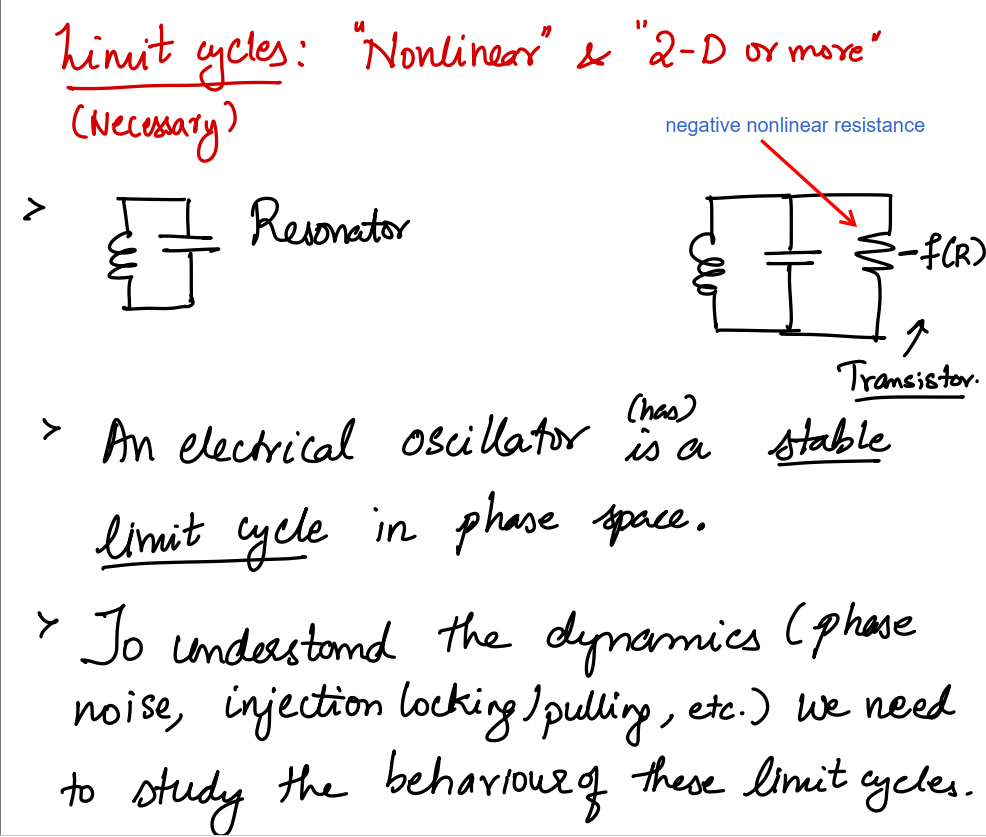

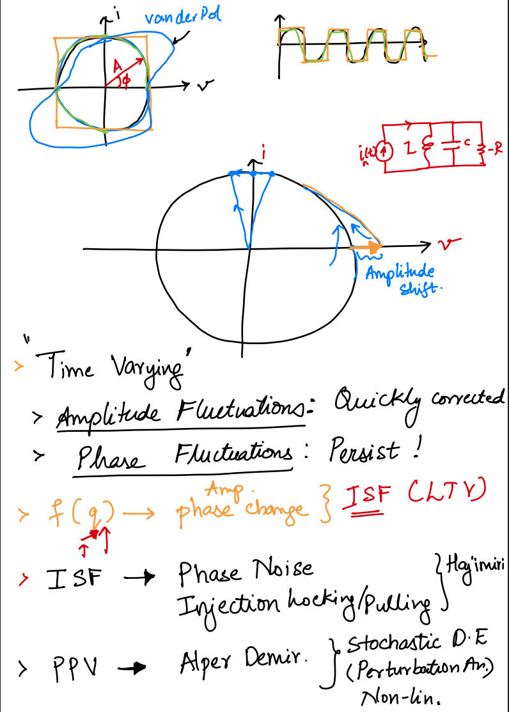

## Phase Perturbation

> Chembiyan T, "Brownian Motion And The Oscillator Phase Noise" [[link](https://www.linkedin.com/posts/chembiyan-t-0b34b910_vco-perturbed-by-a-brownian-motion-activity-6994691057045159936-nqaN?utm_source=share&utm_medium=member_desktop)]
>
> —, "Jitter and Phase Noise in Oscillators" [[link](https://www.linkedin.com/posts/chembiyan-t-0b34b910_jitter-and-phase-noise-activity-7028431979649929216-KsZw?utm_source=share&utm_medium=member_desktop)]
>
> —, "Jitter and Phase Noise in Phase Locked Loops" [[link](https://www.linkedin.com/posts/chembiyan-t-0b34b910_jitter-and-phase-noise-activity-7031985595304345600-uSx3?utm_source=share&utm_medium=member_desktop)]
>
> —, "PLLs and reference spurs" [[link](https://www.linkedin.com/posts/chembiyan-t-0b34b910_pll-rfdesign-circuits-activity-7111435571448713216-9jng?utm_source=share&utm_medium=member_desktop)]

### w/ stationary noise with Gaussian PDF

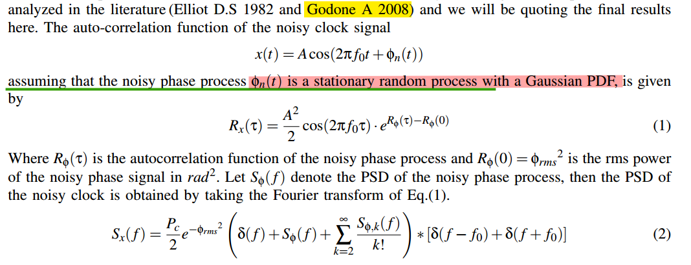

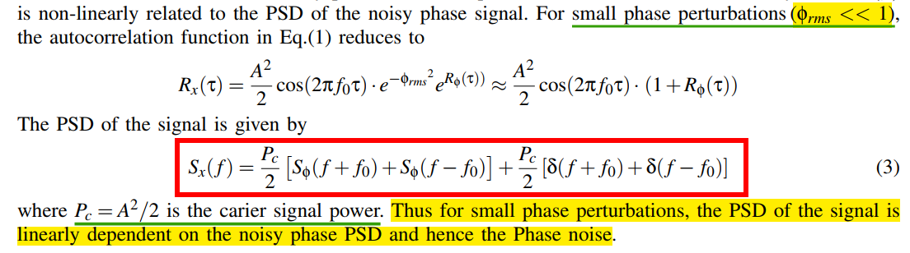

---

If keep $\phi_{rms}$ in $R_x(\tau)$, i.e.
$$
R_x(\tau)=\frac{A^2}{2}e^{-\phi_{rms}^2}\cos(2\pi f_0 \tau)e^{R_\phi(\tau)}\approx \frac{A^2}{2}e^{-\phi_{rms}^2}\cos(2\pi f_0 \tau)(1+R_\phi(\tau))
$$
The PSD of the signal is
$$
S_x(f) = \mathcal{F} \{ R_x(\tau) \} = \frac{P_c}{2}e^{-\phi_{rms}^2}\left[S_\phi(f+f_0)+S_\phi(f-f_0)\right] + \frac{P_c}{2}e^{-\phi_{rms}^2}\left[\delta(f+f_0)+\delta(f-f_0)\right]
$$
&#10071;&#10071;above Eq **isn't** consistent with stationary white noise process - the following section

### w/ stationary white noise

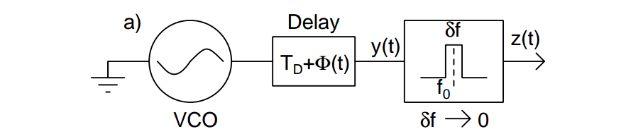

Assuming that the delay line is *noiseless*

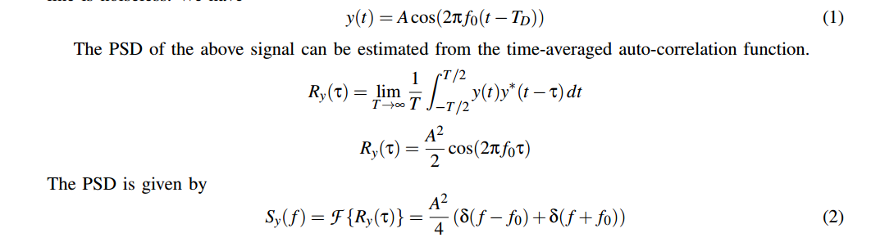

---

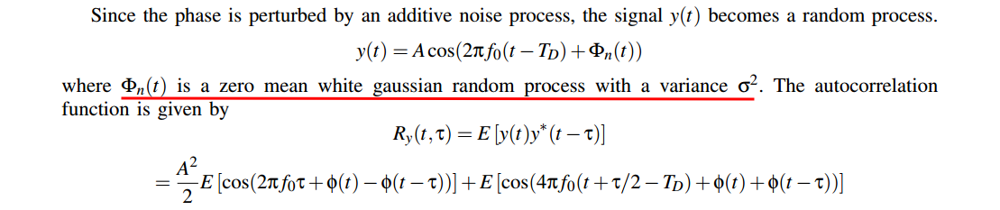

Expanding the cosine function we get
$$\begin{align}
R_y(t,\tau) &= \frac{A^2}{2}\left\{\cos(2\pi f_0\tau)E[\cos(\phi(t)-\phi(t-\tau))] - \sin(2\pi f_0\tau)E[\sin(\phi(t)-\phi(t-\tau))]\right\} \\
&+ \frac{A^2}{2}\left\{\cos(4\pi f_0(t+\tau/2-T_D))E[\cos(\phi(t)+\phi(t-\tau))] - \sin(4\pi f_0(t+\tau/2-T_D))E[\sin(\phi(t)+\phi(t-\tau))] \right\}
\end{align}$$

where, both the process $\phi(t)-\phi(t-\tau)$ and $\phi(t)+\phi(t-\tau)$ are independent of time $t$, i.e. $E[\cos(\phi(t)+\phi(t-\tau))] = m_{\cos+}(\tau)$, $E[\cos(\phi(t)-\phi(t-\tau))] = m_{\cos-}(\tau)$,  $E[\sin(\phi(t)+\phi(t-\tau))] = m_{\sin+}(\tau)$ and  $E[\sin(\phi(t)-\phi(t-\tau))] = m_{\sin-}(\tau)$

we obtain
$$\begin{align}
R_y(t,\tau) &= \frac{A^2}{2}\left\{\cos(2\pi f_0\tau)m_{\cos-}(\tau) - \sin(2\pi f_0\tau)m_{\sin-}(\tau)\right\} \\
&+ \frac{A^2}{2}\left\{\cos(4\pi f_0(t+\tau/2-T_D))m_{\cos+}(\tau) - \sin(4\pi f_0(t+\tau/2-T_D))m_{\sin+}(\tau) \right\}
\end{align}$$

The second term in the above expression is periodic in $t$ and to estimate its PSD, we compute the ***time-averaged* autocorrelation function**
$$
R_y(\tau) = \frac{A^2}{2}\left\{\cos(2\pi f_0\tau)m_{\cos-}(\tau) - \sin(2\pi f_0\tau)m_{\sin-}(\tau)\right\}
$$
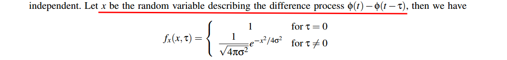

After nontrivial derivation

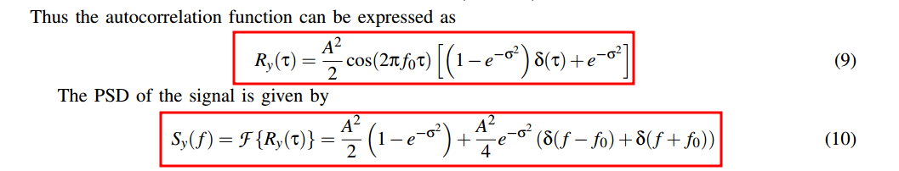

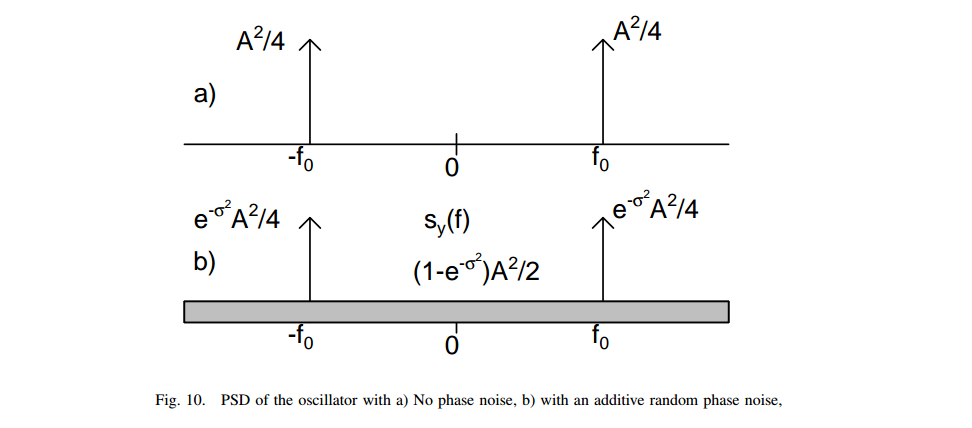

---

> 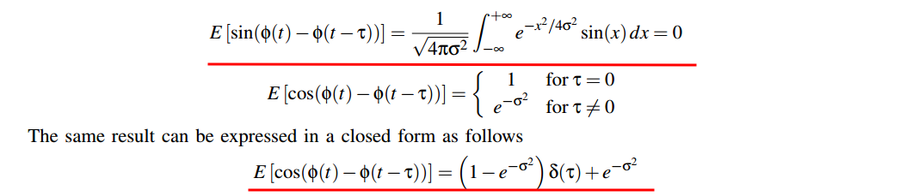

### w/ Weiner process

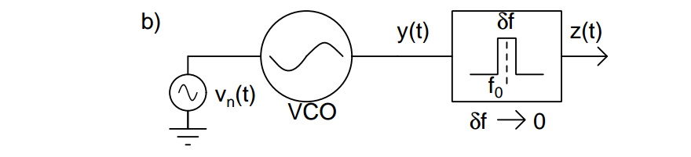

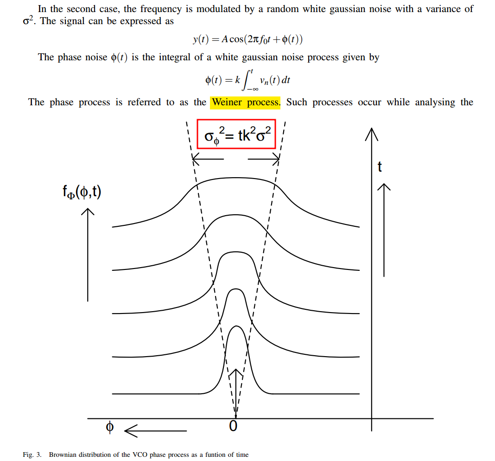

The phase process $\phi(t)$ is also gaussian but with *an increasing **variance** which grows **linearly** with time* $t$

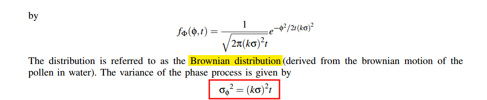

$$\begin{align}
R_y(t,\tau) &= \frac{A^2}{2}\left\{\cos(2\pi f_0\tau)E[\cos(\phi(t)-\phi(t-\tau))] - \sin(2\pi f_0\tau)E[\sin(\phi(t)-\phi(t-\tau))]\right\} \\
&+ \frac{A^2}{2}\left\{\cos(4\pi f_0(t+\tau/2-T_D)E[\cos(\phi(t)+\phi(t-\tau))] - \sin(4\pi f_0(t+\tau/2-T_D)E[\sin(\phi(t)+\phi(t-\tau))] \right\}
\end{align}$$

**The spectrum of $y(t)$ is determined by the asymptotic behavior of $R_y(t,\tau)$ as $t\to \infty$**

> &#10071;&#10071; $\lim_{t\to\infty}R_y(t,\tau)$ rather than *time-averaged autocorrelation function* of cyclostationary process, ref. Demir's paper

We define $\zeta(t, \tau)=\phi(t)+\phi(t-\tau) = \phi(t)-\phi(t-\tau) + 2\phi(t-\tau)$, the expected value of $\zeta(t,\tau)$ is 0, the variance is $\sigma_{\zeta}^2=(k\sigma)^2(\tau + 4(t-\tau))=(k\sigma)^2(4t-3\tau)$
$$
E[\cos(\zeta(t,\tau))]=\frac{1}{\sqrt{2\pi \sigma_{\zeta}^2}}\int_{-\infty}^{\infty}e^{-\zeta^2/2\sigma_{\zeta}^2}\cos(\zeta)d\zeta = e^{-\sigma_{\zeta}^2/2}=e^{-(k\sigma)^2(4t-\tau)}
$$
i.e., $\lim _{t\to \infty} E[\cos(\zeta(t,\tau))] = \lim_{t\to \infty}e^{-(k\sigma)^2(4t-\tau)} = 0$

For $E[\sin(\zeta(t,\tau))]$, we have
$$
E[\sin(\zeta(t,\tau))] = \frac{1}{\sqrt{2\pi \sigma_{\zeta}^2}}\int_{-\infty}^{\infty}e^{-\zeta^2/2\sigma_{\zeta}^2}\sin(\zeta)d\zeta
$$
i.e., $E[\sin(\zeta(t,\tau))]$ is *odd function*, therefore $E[\sin(\zeta(t,\tau))]=0$

Finally, we obtain

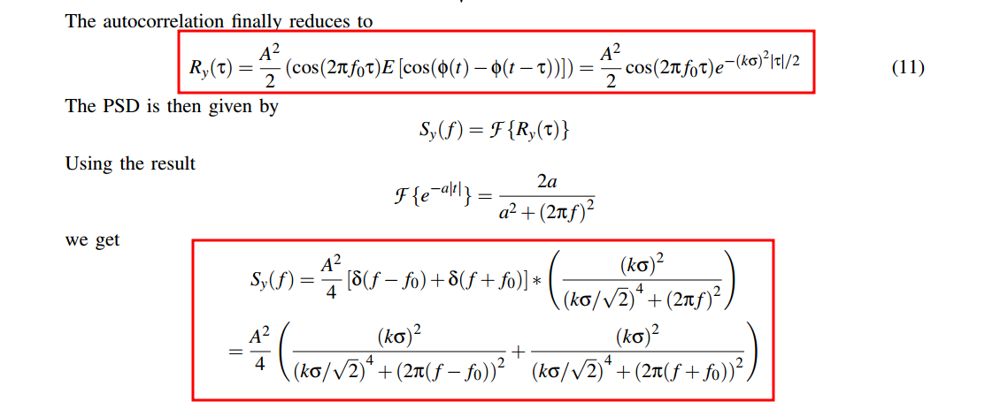

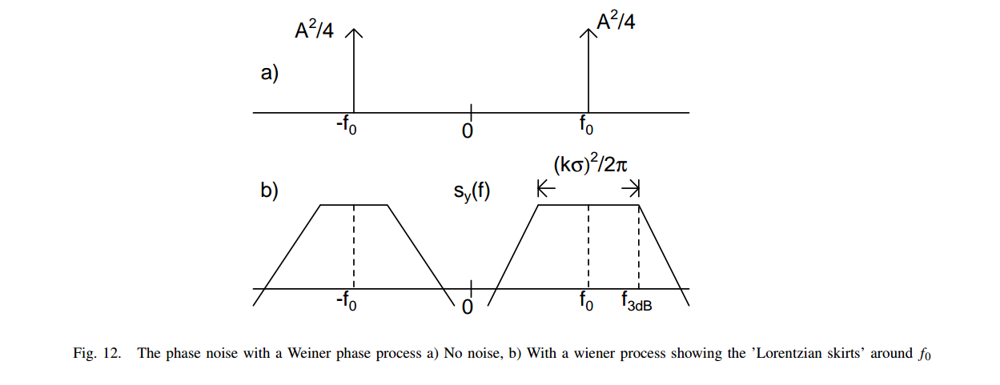

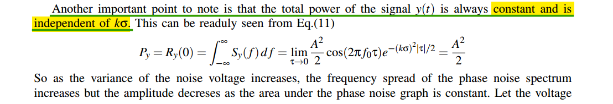

---

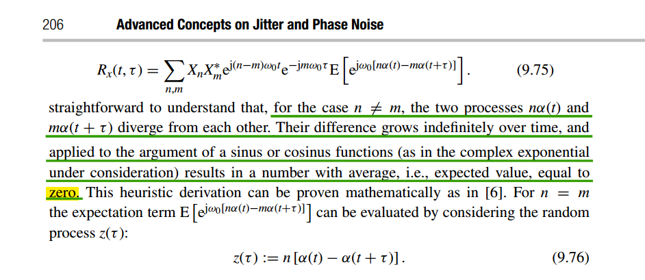

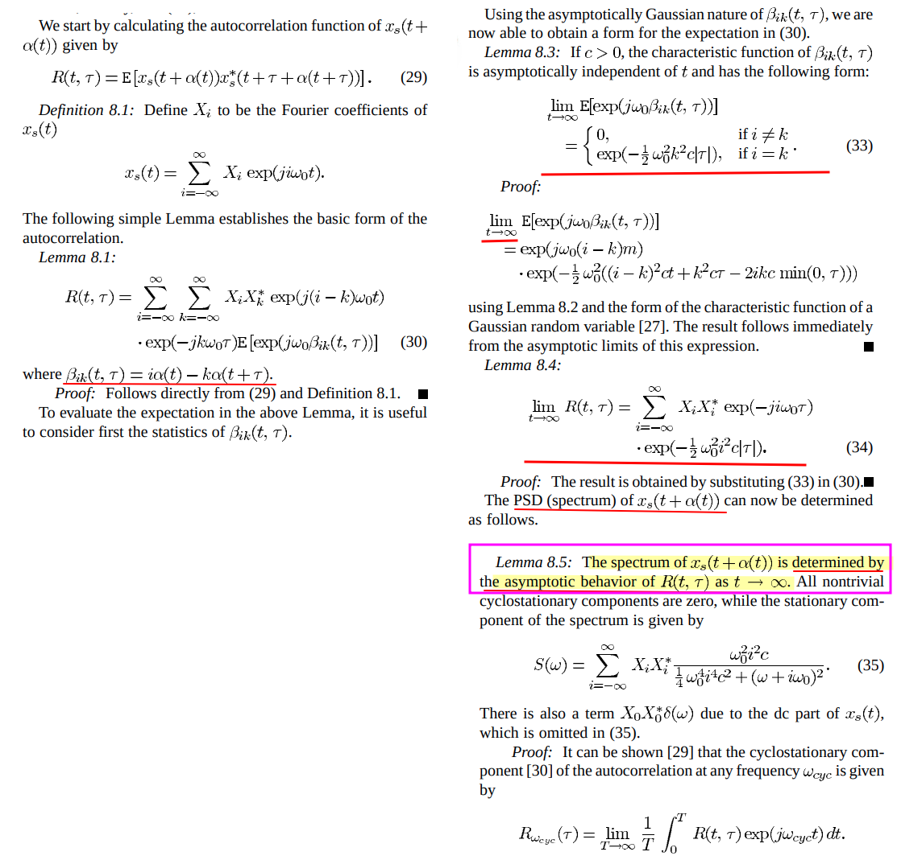

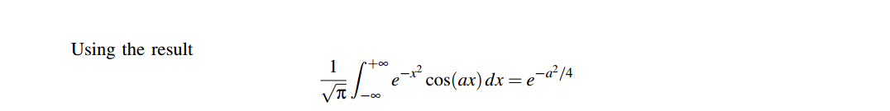

## References

A. Hajimiri and T. H. Lee, "A general theory of phase noise in electrical oscillators," in *IEEE Journal of Solid-State Circuits*, vol. 33, no. 2, pp. 179-194, Feb. 1998 [[paper](https://people.engr.tamu.edu/spalermo/ecen620/general_pn_theory_hajimiri_jssc_1998.pdf)], [[slides](http://www-smirc.stanford.edu/papers/Orals98s-ali.pdf)]

—, "Corrections to "A General Theory of Phase Noise in Electrical Oscillators"" [[https://ieeexplore.ieee.org/stamp/stamp.jsp?arnumber=678662](https://ieeexplore.ieee.org/stamp/stamp.jsp?arnumber=678662)]

A. Demir, A. Mehrotra and J. Roychowdhury, "Phase noise in oscillators: a unifying theory and numerical methods for characterization," in *IEEE Transactions on Circuits and Systems I: Fundamental Theory and Applications*, vol. 47, no. 5, pp. 655-674, May 2000 [[https://sci-hub.se/10.1109/81.847872](https://sci-hub.se/10.1109/81.847872)]

D. Murphy, J. J. Rael and A. A. Abidi, "Phase Noise in LC Oscillators: A Phasor-Based Analysis of a General Result and of Loaded  Q ," in IEEE Transactions on Circuits and Systems I: Regular Papers, vol. 57, no. 6, pp. 1187-1203, June 2010 [[https://sci-hub.ru/10.1109/TCSI.2009.2030110](https://sci-hub.ru/10.1109/TCSI.2009.2030110)]

Godone, A. & Micalizio, Salvatore & Levi, Filippo. (2008). RF spectrum of a carrier with a random phase modulation of arbitrary slope. [[https://sci-hub.se/10.1088/0026-1394/45/3/008](https://sci-hub.se/10.1088/0026-1394/45/3/008)]

F. L. Traversa, M. Bonnin and F. Bonani, "The Complex World of Oscillator Noise: Modern Approaches to Oscillator (Phase and Amplitude) Noise Analysis," in *IEEE Microwave Magazine*, vol. 22, no. 7, pp. 24-32, July 2021 [[https://iris.polito.it/retrieve/handle/11583/2903596/e384c433-b8f5-d4b2-e053-9f05fe0a1d67/MM%20noise%20-%20v5.pdf](https://iris.polito.it/retrieve/handle/11583/2903596/e384c433-b8f5-d4b2-e053-9f05fe0a1d67/MM%20noise%20-%20v5.pdf)]

Poddar, Ajay & Rohde, Ulrich & Apte, Anisha. (2013). How Low Can They Go?: Oscillator Phase Noise Model, Theoretical, Experimental Validation, and Phase Noise Measurements. Microwave Magazine, IEEE. [[http://time.kinali.ch/rohde/noise/how_low_can_they_go-2013-poddar_rohde_apte.pdf](http://time.kinali.ch/rohde/noise/how_low_can_they_go-2013-poddar_rohde_apte.pdf)]

---

---

Jun Yin. ISSCC 2025 T10: mm-Wave Oscillator Design

Pietro Andreani. ISSCC 2011 T1: Integrated LC oscillators

—. ISSCC 2017 F2: Integrated Harmonic Oscillators

—. SSCS Distinguished Lecture: RF Harmonic Oscillators Integrated in Silicon Technologies [[https://www.ieeetoronto.ca/wp-content/uploads/2020/06/DL-Toronto.pdf](https://www.ieeetoronto.ca/wp-content/uploads/2020/06/DL-Toronto.pdf)]

—. ESSCIRC 2019 Tutorials: RF Harmonic Oscillators Integrated in Silicon Technologies [[https://youtu.be/k1I9nP9eEHE](https://youtu.be/k1I9nP9eEHE)]

—. "Harmonic Oscillators in CMOS—A Tutorial Overview," in IEEE Open Journal of the Solid-State Circuits Society, vol. 1, pp. 2-17, 2021 [[pdf](https://ieeexplore.ieee.org/stamp/stamp.jsp?tp=&arnumber=9530265)]

C. Samori, ISSCC2016 T1 "Tutorial: Understanding Phase Noise in LC VCOs"

—, "Understanding Phase Noise in LC VCOs: A Key Problem in RF Integrated Circuits," in *IEEE Solid-State Circuits Magazine*, vol. 8, no. 4, pp. 81-91, Fall 2016 [[https://sci-hub.se/10.1109/MSSC.2016.2573979](https://sci-hub.se/10.1109/MSSC.2016.2573979)]

—, Phase Noise in LC Oscillators: From Basic Concepts to Advanced Topologies [[https://www.ieeetoronto.ca/wp-content/uploads/2020/06/DL-VCO-short.pdf](https://www.ieeetoronto.ca/wp-content/uploads/2020/06/DL-VCO-short.pdf)]

Akihide Sai, Toshiba. ISSCC 2023 T5: All-digital PLLs From Fundamental Concepts to Future Trends

A. Hajimiri, RFIC2024 "Noise in Oscillators from Understanding to Design"

Antonio Liscidini, ESSCIRC 2019 Tutorials: Phase Noise in Wireless Applications [[https://youtu.be/nGmQ0JdoSE4](https://youtu.be/nGmQ0JdoSE4)]

Aditya Varma Muppala. Oscillators [[https://youtube.com/playlist?list=PL9Trid0A4Da2fOmYTEjhAnUkGPxyiH7H6&si](https://youtube.com/playlist?list=PL9Trid0A4Da2fOmYTEjhAnUkGPxyiH7H6)]

P.E. Allen - 2003. ECE 6440 - Frequency Synthesizers: Lecture 160 – Phase Noise - II [[https://pallen.ece.gatech.edu/Academic/ECE_6440/Summer_2003/L160-PhNoII(2UP).pdf](https://pallen.ece.gatech.edu/Academic/ECE_6440/Summer_2003/L160-PhNoII(2UP).pdf)]

Thomas H. Lee. Linearity, Time-Variation, Phase Modulation and Oscillator Phase Noise [[https://class.ece.iastate.edu/djchen/ee507/PhaseNoiseTutorialLee.pdf](https://class.ece.iastate.edu/djchen/ee507/PhaseNoiseTutorialLee.pdf)]

---

---

***ISF, PPV, and Flicker-Noise Analysis***

Y. Hu, T. Siriburanon and R. B. Staszewski, "Intuitive Understanding of Flicker Noise Reduction via Narrowing of Conduction Angle in Voltage-Biased Oscillators," in IEEE Transactions on Circuits and Systems II: Express Briefs, vol. 66, no. 12, pp. 1962-1966, Dec. 2019 [[https://sci-hub.se/10.1109/TCSII.2019.2896483](https://sci-hub.se/10.1109/TCSII.2019.2896483)]

—, "Oscillator Flicker Phase Noise: A Tutorial," in *IEEE Transactions on Circuits and Systems II: Express Briefs*, vol. 68, no. 2, pp. 538-544, Feb. 2021 [[https://ieeexplore.ieee.org/stamp/stamp.jsp?tp=&arnumber=9286468](https://ieeexplore.ieee.org/stamp/stamp.jsp?tp=&arnumber=9286468)]

S. Levantino, P. Maffezzoni, F. Pepe, A. Bonfanti, C. Samori and A. L. Lacaita, "Efficient Calculation of the Impulse Sensitivity Function in Oscillators," in IEEE Transactions on Circuits and Systems II: Express Briefs, vol. 59, no. 10, pp. 628-632, Oct. 2012 [[https://sci-hub.se/10.1109/TCSII.2012.2208679](https://sci-hub.se/10.1109/TCSII.2012.2208679)]

S. Levantino and P. Maffezzoni, "Computing the Perturbation Projection Vector of Oscillators via Frequency Domain Analysis," in IEEE Transactions on Computer-Aided Design of Integrated Circuits and Systems, vol. 31, no. 10, pp. 1499-1507, Oct. 2012 [[https://sci-hub.se/10.1109/TCAD.2012.2194493](https://sci-hub.se/10.1109/TCAD.2012.2194493)]

---

---

Bae, Woorham, and Deog-Kyoon Jeong. *Analysis and Design of CMOS Clocking Circuits for Low Phase Noise*. Institution of Engineering and Technology, 2020.

Lacaita, Andrea Leonardo, Salvatore Levantino, and Carlo Samori. *Integrated frequency synthesizers for wireless systems*. Cambridge University Press, 2007.

Hegazi, Emad, Asad Abidi, and Jacob Rael. *The Designer's Guide to High-purity Oscillators*. [New York]: Kluwer Academic Publishers, 2005. *The Designer's Guide to High-Purity Oscillators* [[pdf](https://picture.iczhiku.com/resource/eetop/whkgGLPAHoORYxbC.pdf)]

A. A. Abidi and D. Murphy, "How to Design a Differential CMOS LC Oscillator," in IEEE Open Journal of the Solid-State Circuits Society, vol. 5, pp. 45-59, 2025 [[https://ieeexplore.ieee.org/stamp/stamp.jsp?arnumber=10818782](https://ieeexplore.ieee.org/stamp/stamp.jsp?arnumber=10818782)]

Jaeha Kim. Lecture 8. Special Topics: Design Trade -Offs in LC -Tuned Oscillators [[https://ocw.snu.ac.kr/sites/default/files/NOTE/7033.pdf](https://ocw.snu.ac.kr/sites/default/files/NOTE/7033.pdf)]

---

---

***Mathematical Background***

Jiří Lebl. **Notes on Diffy Qs: Differential Equations for Engineers** [[link](https://www.jirka.org/diffyqs/)]

Matt Charnley. **Differential Equations: An Introduction for Engineers** [[link](https://sites.rutgers.edu/matthew-charnley/course-materials/differential-equations-an-introduction-for-engineers/)]

Åström, K.J. & Murray, Richard. (2021). **Feedback Systems: An Introduction for Scientists and Engineers Second Edition** [[https://www.cds.caltech.edu/~murray/books/AM08/pdf/fbs-public_24Jul2020.pdf](https://www.cds.caltech.edu/~murray/books/AM08/pdf/fbs-public_24Jul2020.pdf)]

Strogatz, S.H. (2015). **Nonlinear Dynamics and Chaos: With Applications to Physics, Biology, Chemistry, and Engineering (2nd ed.)**. CRC Press [[https://www.biodyn.ro/course/literatura/Nonlinear_Dynamics_and_Chaos_2018_Steven_H._Strogatz.pdf](https://www.biodyn.ro/course/literatura/Nonlinear_Dynamics_and_Chaos_2018_Steven_H._Strogatz.pdf)]

Cadence Blog, "Resonant Frequency vs. Natural Frequency in Oscillator Circuits" [[link](https://resources.pcb.cadence.com/blog/2019-resonant-frequency-vs-natural-frequency-in-oscillator-circuits)]