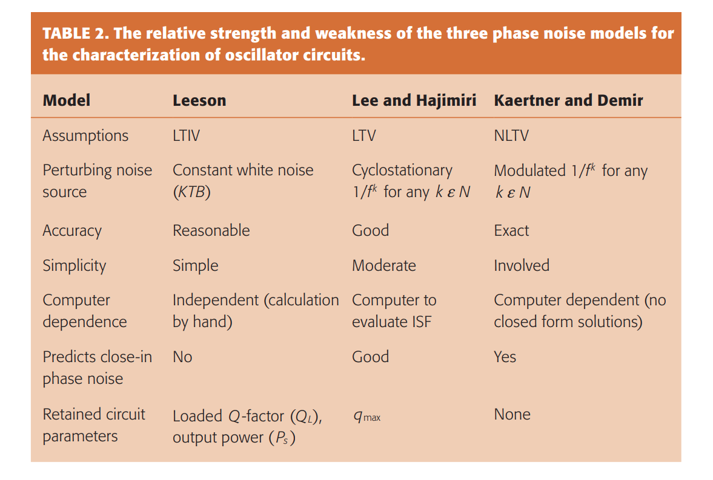

> Poddar, Ajay & Rohde, Ulrich & Apte, Anisha. (2013). How Low Can They Go?: Oscillator Phase Noise Model, Theoretical, Experimental Validation, and Phase Noise Measurements. Microwave Magazine, IEEE. [[http://time.kinali.ch/rohde/noise/how_low_can_they_go-2013-poddar_rohde_apte.pdf](http://time.kinali.ch/rohde/noise/how_low_can_they_go-2013-poddar_rohde_apte.pdf)]
>
> F. L. Traversa, M. Bonnin and F. Bonani, "The Complex World of Oscillator Noise: Modern Approaches to Oscillator (Phase and Amplitude) Noise Analysis," in *IEEE Microwave Magazine*, vol. 22, no. 7, pp. 24-32, July 2021 [[https://sci-hub.ru/10.1109/MMM.2021.3069535](https://sci-hub.ru/10.1109/MMM.2021.3069535)]

## Phase Noise Definition


> Eq. (3.25) is widely adopted by industry and academia


> *using the narrow angle assumption*, the two definitions above are equivalent
>
> If the *narrow angle* condition is not satisfied, however, the two definitions differ

---

> Sam Palermo, ECEN620: Network Theory Broadband Circuit Design Fall 2025, Lecture 7: Voltage-Controlled Oscillators[[https://people.engr.tamu.edu/spalermo/ecen620/lecture07_ee620_vcos.pdf](https://people.engr.tamu.edu/spalermo/ecen620/lecture07_ee620_vcos.pdf)]


## Phase Noise Profile

> Power Spectral Density of Brownian Motion despite non-stationary [[https://dsp.stackexchange.com/a/75043/59253](https://dsp.stackexchange.com/a/75043/59253)]


***white noise*** — $1/f^2$ Phase Noise Profile


> 


---


> Sudhakar Pamarti. CICC 2020 ES2-2: Basics of Closed- and Open-Loop Fractional Frequency Synthesis [[https://youtu.be/t1TY-D95CY8](https://youtu.be/t1TY-D95CY8)]


---

---

***flicker noise*** — $1/f^3$ Phase Noise Profile
$$
S_{\phi n} = \frac{K}{f}\left(\frac{K_{VCO}}{2\pi f}\right)^2 \propto \frac{1}{f^3}
$$


---


> [[https://dsp.stackexchange.com/a/75152/59253](https://dsp.stackexchange.com/a/75152/59253)]


## Free-running Oscillator


> Note that $f_{min}$ is related to the observation time. The longer we observe the device under test, the smaller $f_{min}$ must be


---


---

> Ali Sheikholeslami ISSCC 2008 T5: Basics of Chip-to-Chip and Backplane Signaling


---


> B. Casper and F. O'Mahony, "Clocking Analysis, Implementation and Measurement Techniques for High-Speed Data Links-A Tutorial," in IEEE Transactions on Circuits and Systems I. [[https://people.engr.tamu.edu/spalermo/ecen689/clocking_analysis_hs_links_casper_tcas1_2009.pdf](https://people.engr.tamu.edu/spalermo/ecen689/clocking_analysis_hs_links_casper_tcas1_2009.pdf)]


## Leeson's model — LTI

> M.H. Perrott, Short Course On Phase-Locked Loops and Their Applications Day 2, AM Lecture Basic *Building Blocks Voltage-Controlled Oscillators* [[https://www.cppsim.com/PLL_Lectures/day2_am.pdf](https://www.cppsim.com/PLL_Lectures/day2_am.pdf)]
>
> —, 6.976 High Speed Communication Circuits and Systems *Lecture 12 Noise in Voltage Controlled Oscillators* [[https://ocw.mit.edu/courses/6-976-high-speed-communication-circuits-and-systems-spring-2003/ceb3d539691d5393a29af71ae98afb62_lec12.pdf](https://ocw.mit.edu/courses/6-976-high-speed-communication-circuits-and-systems-spring-2003/ceb3d539691d5393a29af71ae98afb62_lec12.pdf)]

Leeson's model is outcome of ***linearized*** VCO noise analysis


Assuming voltage noise tone $(\omega_0+\omega_m)$  and $(\omega_0-\omega_m)$ are **independent** and **symmetric**


---

***Leeson's limitations***


---

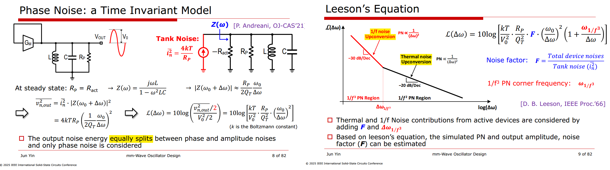

***1/f noise Upconversion*** & ***Thermal noise Upconversion***


## Hajimiri's ISF— LTV in Time Domain

> A. Hajimiri and T. H. Lee, "A general theory of phase noise in electrical oscillators," in *IEEE Journal of Solid-State Circuits*, vol. 33, no. 2, pp. 179-194, Feb. 1998 [[paper](https://people.engr.tamu.edu/spalermo/ecen620/general_pn_theory_hajimiri_jssc_1998.pdf)], [[slides](http://www-smirc.stanford.edu/papers/Orals98s-ali.pdf)]
>
> —, RFIC 2024 Technical Lecture: *Noise in Oscillators from Understanding to Design*
>
> Thomas H. Lee. Linearity, Time-Variation, Phase Modulation and Oscillator Phase Noise [[https://class.ece.iastate.edu/djchen/ee507/PhaseNoiseTutorialLee.pdf](https://class.ece.iastate.edu/djchen/ee507/PhaseNoiseTutorialLee.pdf)]
>
> Aditya Varma Muppala, [[https://adityamuppala.github.io/assets/Notes_YouTube/Oscillators_ISF_model.pdf](https://adityamuppala.github.io/assets/Notes_YouTube/Oscillators_ISF_model.pdf)]


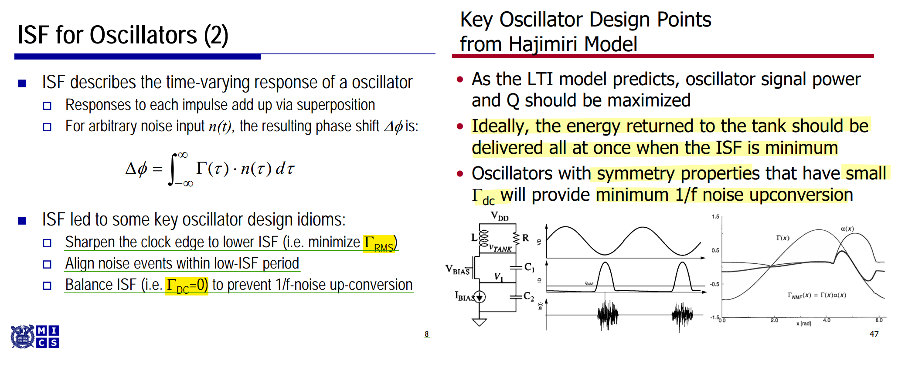


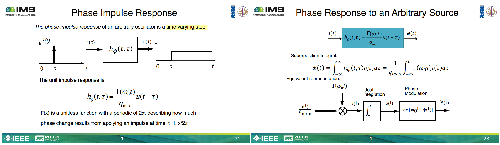

The **peak magnitude** of the ISF,
$$
\Gamma_{\max}=\max_\theta |\Gamma(\theta)|,
$$
can be **greater than 1, equal to 1, or less than 1**.

A value $\Gamma>1$ therefore does **not** mean "more than 100%." It simply means that the oscillator has relatively high phase sensitivity at that particular phase.

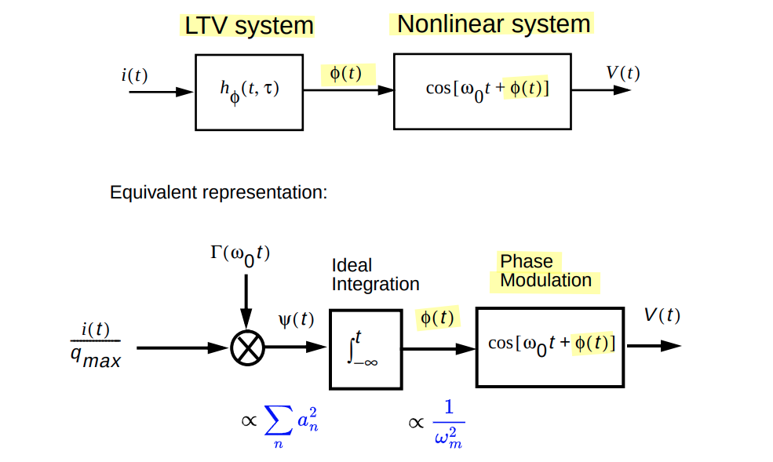

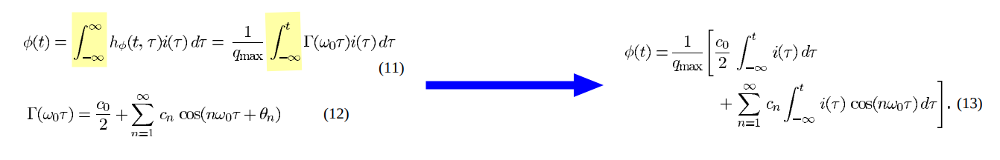


**$\psi(t)$ is literally the instantaneous frequency deviation.** Check the dimensions: $i(t)/q_{max}$ has units of A/C = 1/s, and $\Gamma$ is dimensionless, so $\psi(t) = \Gamma(\omega_0 t)\,i(t)/q_{max}$ is in rad/s. The diagram is saying $d\phi/dt = \psi(t)$, i.e. $\phi(t) = \int_{-\infty}^{t}\psi(\tau)d\tau$. An ideal integrator has transfer function $1/j\Delta\omega$, so in power spectra:
$$
S_\phi(\Delta\omega) = \frac{S_\psi(\Delta\omega)}{\Delta\omega^2}
$$
That single block is the origin of *every* $1/\Delta\omega^2$ factor in phase noise theory — including the $(\omega_0/2Q\Delta\omega)^2$ term in Leeson's equation


### Pure sinusoidal voltage


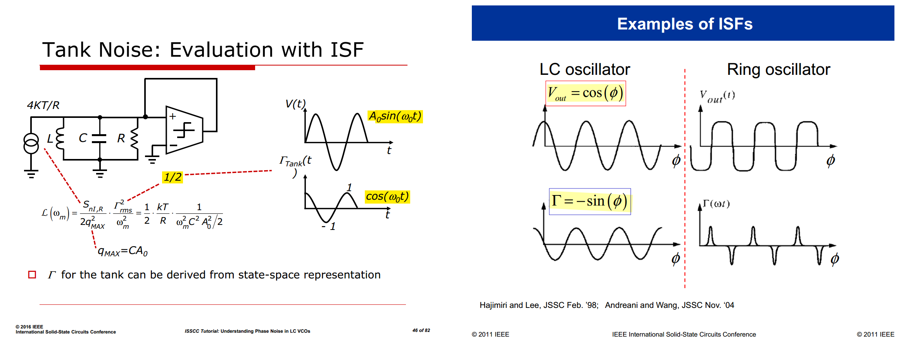

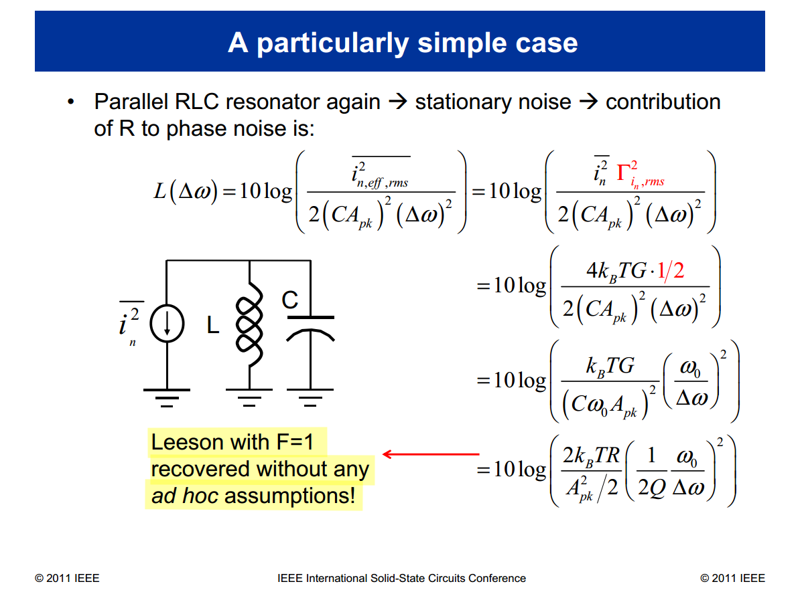


###  White-noise Folding

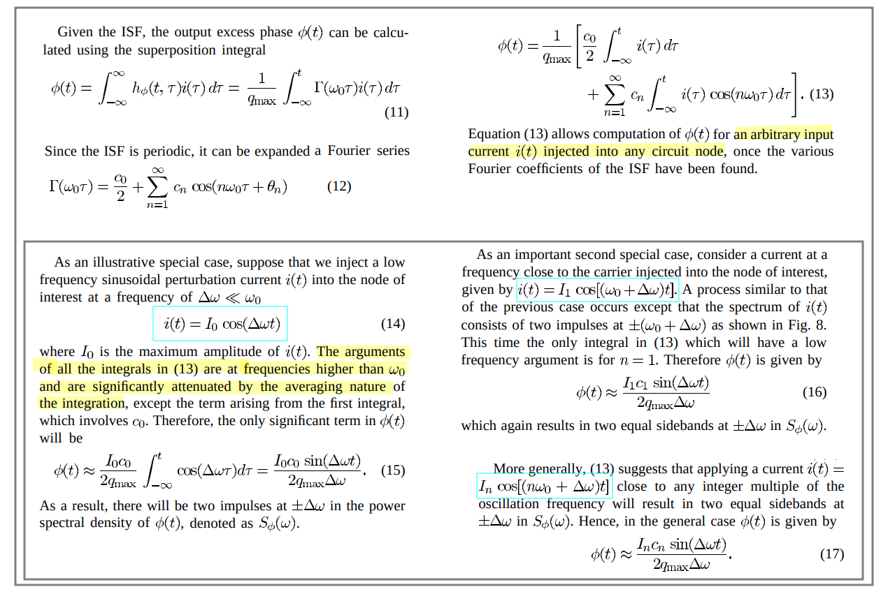

Suppose a low frequency sinusoidal perturbation current $i(t) = I_m \cos[(m\omega_0 +\Delta \omega)t]$,

$$\begin{align}
\phi(t) &= \frac{1}{q_\text{max}}\left[\frac{C_0}{2}\int_{-\infty}^t I_m\cos((m\omega_0 +\Delta \omega)\tau)d\tau + \sum_{n=1}^\infty C_n\int_{-\infty}^t I_m\cos((m\omega_0 +\Delta \omega)\tau)\cos(n\omega_0\tau)d\tau\right] \\
&= \frac{I_m}{q_\text{max}}\left[\frac{C_0}{2}\int_{-\infty}^t \cos((m\omega_0 +\Delta \omega)\tau)d\tau + \sum_{n=1}^\infty C_n\int_{-\infty}^t \frac{\cos((m\omega_0 + \Delta \omega+ n\omega_0)\tau)+ \cos((m\omega_0+\Delta \omega - n\omega_0)\tau)}{2}d\tau\right]
\end{align}$$

If $m=0$
$$
\phi(t) \approx \frac{I_0C_0}{2q_\text{max}\Delta \omega}\sin(\Delta\omega t)
$$
If $m\neq 0$ and $m=n$
$$
\phi(t) \approx \frac{I_mC_m}{2q_\text{max}\Delta \omega}\sin(\Delta\omega t)
$$

When performing the ***phase noise computation integral***, there will be a negligible contribution from all terms, other than $n=m$

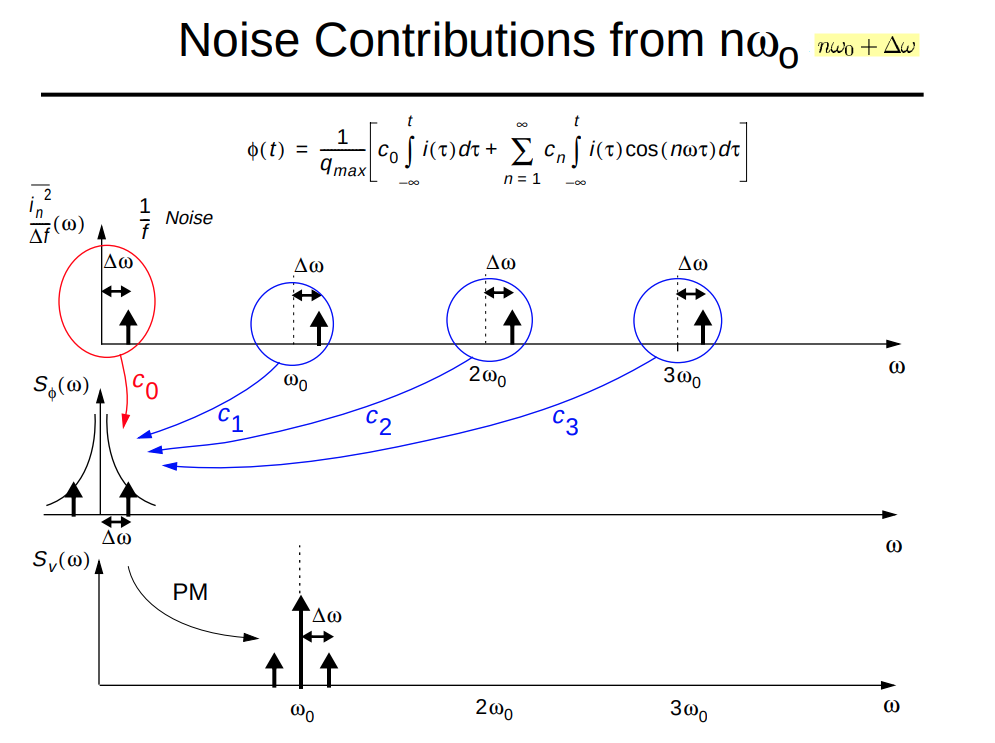

> apply equation (18) derived from ***sinusoidal*** to ***white noise***

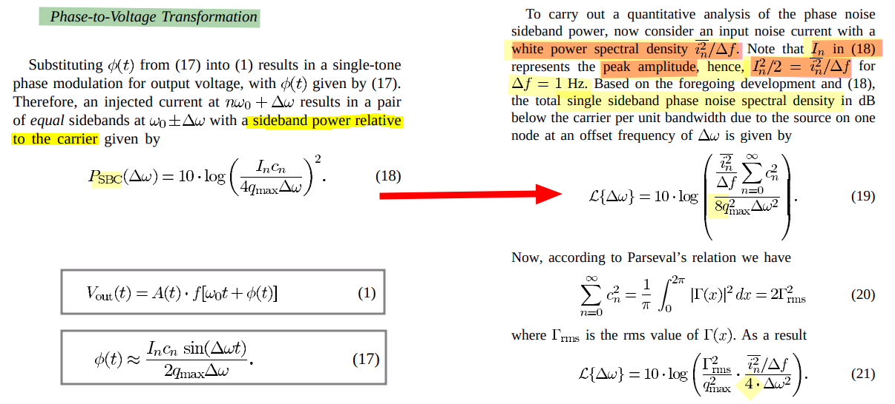

> 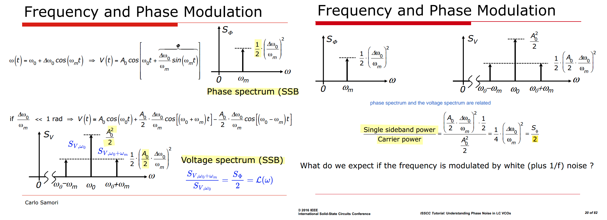


---

***Corrections to "A General Theory of Phase Noise in Electrical Oscillators"***

>  A. Hajimiri and T. H. Lee, "Corrections to "A General Theory of Phase Noise in Electrical Oscillators"," in *IEEE Journal of Solid-State Circuits*, vol. 33, no. 6, pp. 928-928, June 1998 [[https://sci-hub.se/10.1109/4.678662](https://sci-hub.se/10.1109/4.678662)]
>
>  L. Lu, Z. Tang, P. Andreani, A. Mazzanti and A. Hajimiri, "Comments on “Comments on “A General Theory of Phase Noise in Electrical Oscillators””," in *IEEE Journal of Solid-State Circuits*, vol. 43, no. 9, pp. 2170-2170, Sept. 2008 [[https://sci-hub.se/10.1109/JSSC.2008.2005028](https://sci-hub.se/10.1109/JSSC.2008.2005028)]

Noise power around the frequency $\color{blue}n\omega_0 + \Delta\omega$ causes two equal sidebands at $\omega_0 \pm \Delta\omega$. However, the
noise power at $\color{blue}n\omega_0 - \Delta\omega$ has a similar effect as  mentioned in the paper. Therefore, twice the power of noise at  $n\omega_0 + \Delta\omega$ should be taken into account

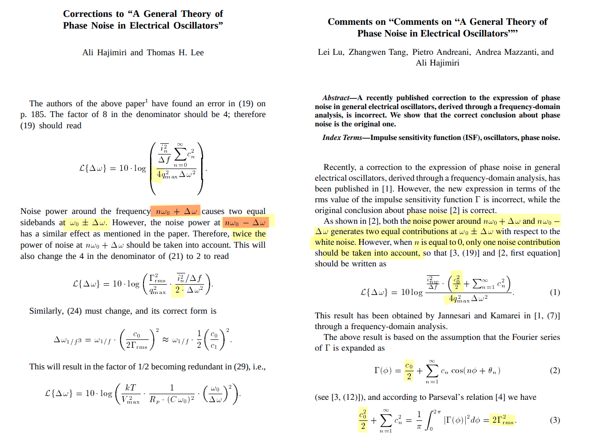

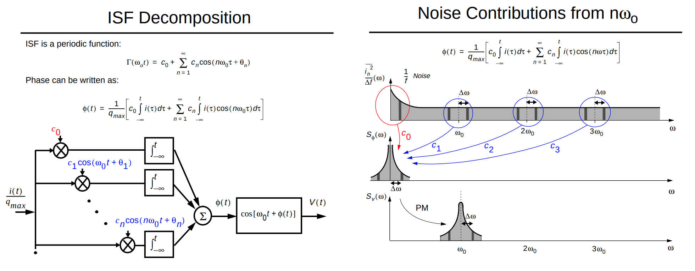


Given $i(t) = I_m \cos[(m\omega_0 - \Delta \omega)t]$ and $m \ge 1$

$$\begin{align}
\phi(t) &= \frac{1}{q_\text{max}}\left[\frac{C_0}{2}\int_{-\infty}^t I_m\cos((m\omega_0 -\Delta \omega)\tau)d\tau + \sum_{n=1}^\infty C_n\int_{-\infty}^t I_m\cos((m\omega_0 -\Delta \omega)\tau)\cos(n\omega_0\tau)d\tau\right] \\
&= \frac{I_m}{q_\text{max}}\left[\frac{C_0}{2}\int_{-\infty}^t \cos((m\omega_0 -\Delta \omega)\tau)d\tau + \sum_{n=1}^\infty C_n\int_{-\infty}^t \frac{\cos((m\omega_0 - \Delta \omega+ n\omega_0)\tau)+ \cos((m\omega_0-\Delta \omega - n\omega_0)\tau)}{2}d\tau\right]
\end{align}$$


If $m\ge 1$ and $m=n$
$$
\phi(t) \approx \frac{I_mC_m}{2q_\text{max}\Delta \omega}\sin(\Delta\omega t)
$$
That is

|                          | $m = 0$                                                      | $m\gt 0$ & $m\omega_0+\Delta \omega$                         | $m\gt 0$ & $m\omega_0-\Delta \omega$                         |
| ------------------------ | ------------------------------------------------------------ | ------------------------------------------------------------ | ------------------------------------------------------------ |
| $\phi(t)$                | $\frac{I_0C_0}{2q_\text{max}\Delta \omega}\sin(\Delta\omega t)$ | $\frac{I_mC_m}{2q_\text{max}\Delta \omega}\sin(\Delta\omega t)$ | $\frac{I_mC_m}{2q_\text{max}\Delta \omega}\sin(\Delta\omega t)$ |
| $P_{SBC}(\Delta \omega)$ | $10\log(\frac{I_0^2C_0^2}{16q_\text{max}^2\Delta \omega^2})$ | $10\log(\frac{I_m^2C_m^2}{16q_\text{max}^2\Delta \omega^2})$ | $10\log(\frac{I_m^2C_m^2}{16q_\text{max}^2\Delta \omega^2})$ |

$$\begin{align}
\mathcal{L}\{\Delta \omega\} &= 10\log\left(\frac{I_0^2C_0^2}{16q_\text{max}^2\Delta \omega^2} +  2\frac{I_m^2C_m^2}{16q_\text{max}^2\Delta \omega^2}\right) = 10\log\left(\frac{\overline{i_n^2/\Delta f}\cdot \frac{C_0^2}{2} }{4q_\text{max}^2\Delta \omega^2} + \frac{\overline{i_n^2/\Delta f}\cdot\sum_{m=1}^\infty C_m^2 }{4q_\text{max}^2\Delta \omega^2}\right) \\
&= 10\log \frac{\overline{i_n^2/\Delta f}(C_0^2/2+\sum_{m=1}^\infty C_m^2)}{4q_\text{max}^2\Delta \omega^2} = 10\log \frac{\overline{i_n^2/\Delta f}\cdot \Gamma_\text{rms}^2}{2q_\text{max}^2\Delta \omega^2}
\end{align}$$


---

---

 [[pdf](https://ieeexplore.ieee.org/stamp/stamp.jsp?tp=&arnumber=9530265)]

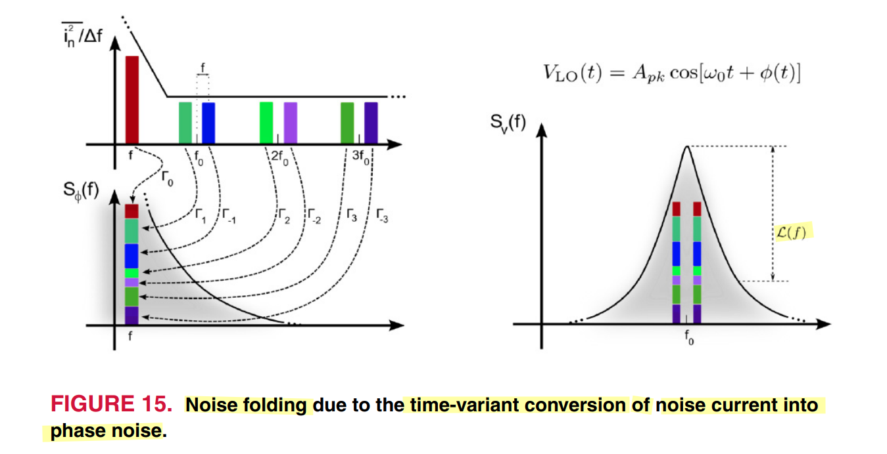

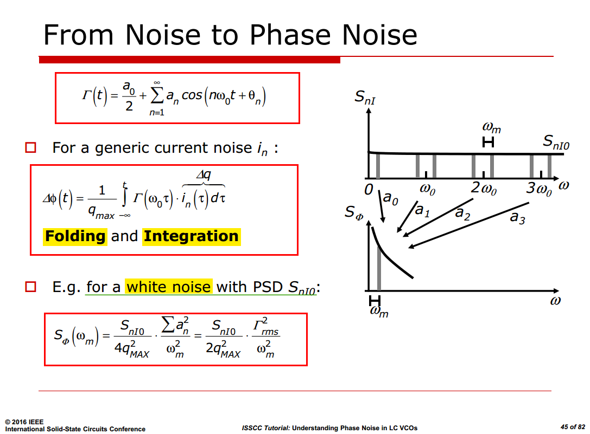


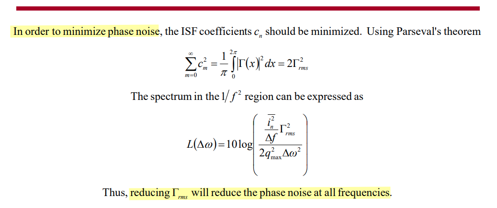


### 1/f-noise Upconversion

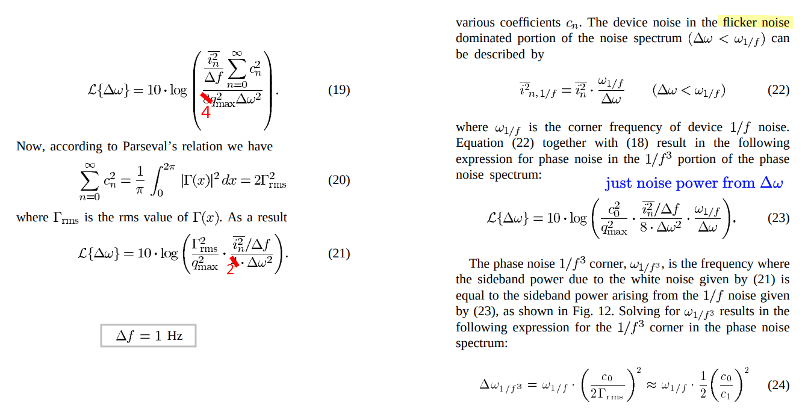

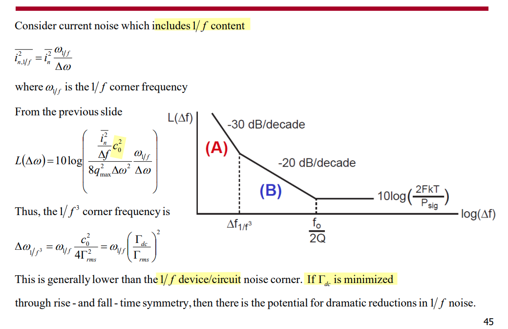

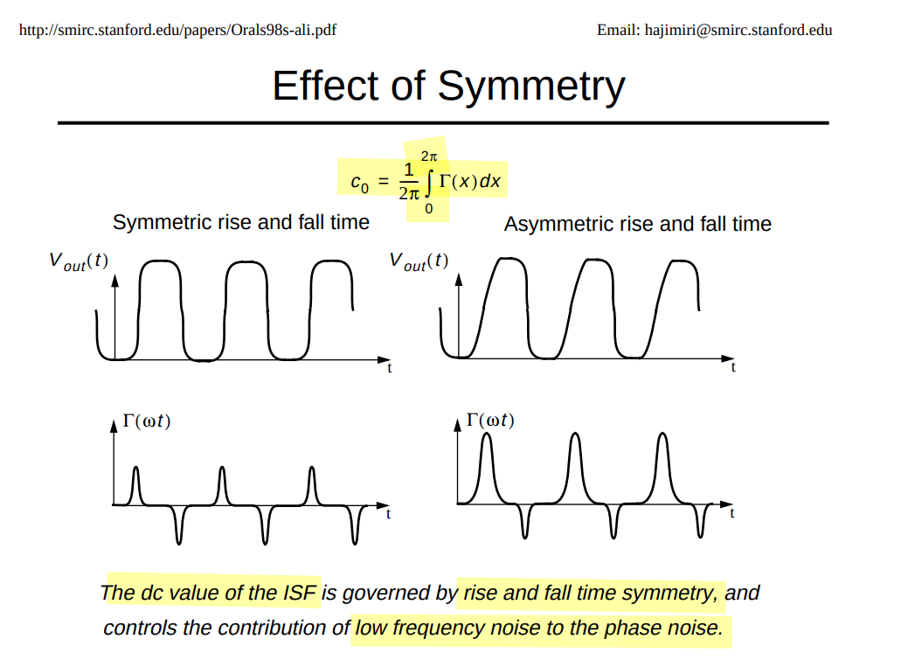


---

Suppose $c_0\neq 0$, corresponding phase noise in response to injected noise $i_n(t)$ is equal to:

$$
\phi_{n,c_0} = \int_{-\infty}^t c_0 i_n(\tau) d\tau \qquad \boxed{S_{\phi n,c_0}(f) = \frac{c_0^2}{\omega^2}S_i(f)= \frac{\mathcal{\Gamma}_\text{dc}^2}{\omega^2}S_i(f)}
$$


### Cyclostationary Noise Sources

Cyclostationary noise can be viewed as stationary noise, $i_{n0}(t)$, multiplied by a periodic envelope, $\alpha(\omega_0 t)$.

***Effective ISF* — *ISF* multiplied with *Noise Modulating Function (NMF)***

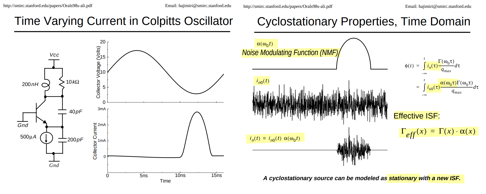

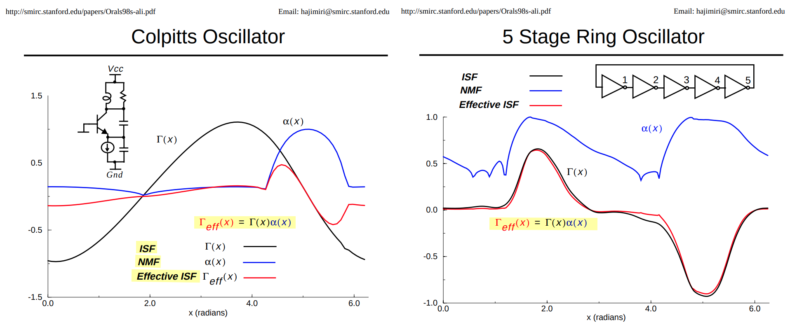

For Colpitts Oscillator, $\Gamma_\text{eff}(x)$ is different from $\Gamma(x)$, however  $\Gamma_\text{eff}(x)$ and $\Gamma(x)$ are almost identical for ring oscillator


### alternative derivation

> Michael Perrott August 12, 2008, Short Course On Phase-Locked Loops and Their Applications Day 2, AM Lecture *Basic Building Blocks Voltage-Controlled Oscillators* [[https://www.cppsim.com/PLL_Lectures/day2_am.pdf](https://www.cppsim.com/PLL_Lectures/day2_am.pdf)]

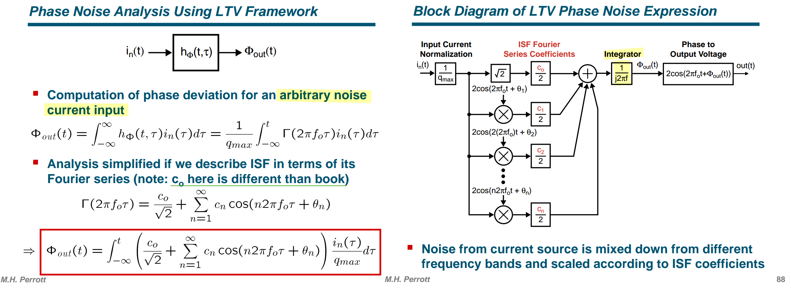

***White Noise Input***

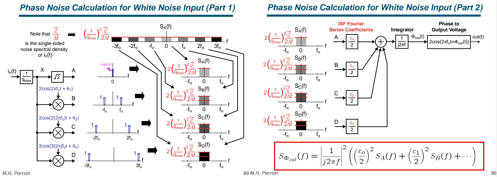

***1/f Noise in Input Current***

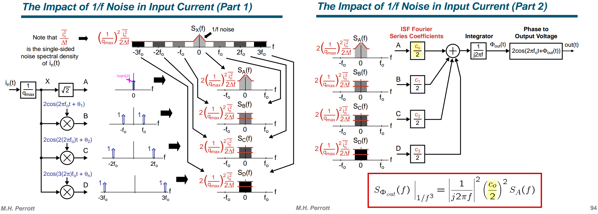

***Current Noise Modulation***

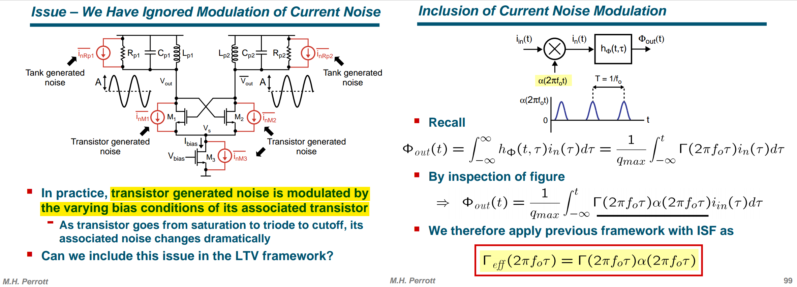

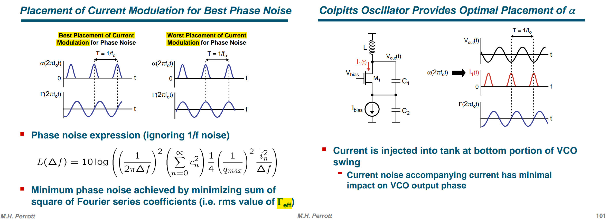


### another alternative derivation


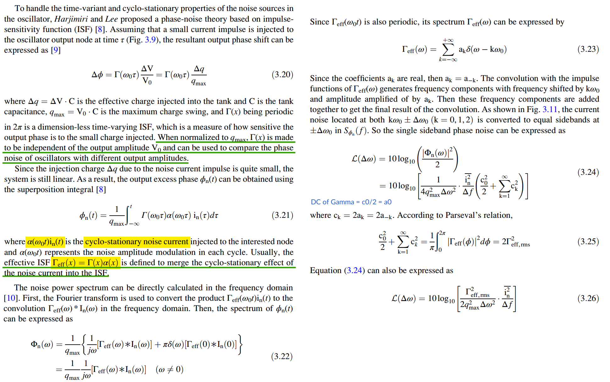


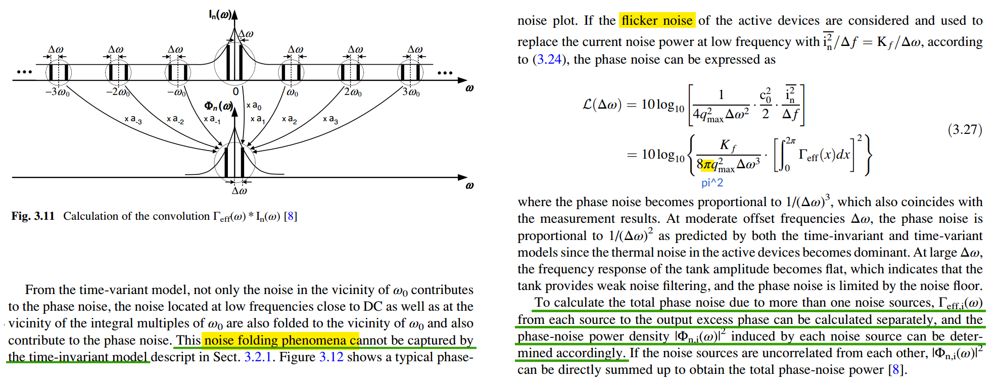


$$
S_{\phi,USB} = \frac{S_n^{''}}{q_\text{max}^2\Delta\omega^2}\left(a_0^2+\sum_{k\neq0}a_k^2\right)=\frac{S_n^{''}}{q_\text{max}^2\Delta\omega^2}\left(\frac{c_0^2}{4}+\sum_{k=1}^\infty \frac{c_k^2}{2}\right)=\frac{S_n^{'}}{4q_\text{max}^2\Delta\omega^2}\left(\frac{c_0^2}{2}+\sum_{k=1}^\infty c_k^2\right)
$$
where $S_n^{''}$ is two sided PSD,  $S_n^{}$ is one sided PSD


### Diff. Pair Noise with ISF

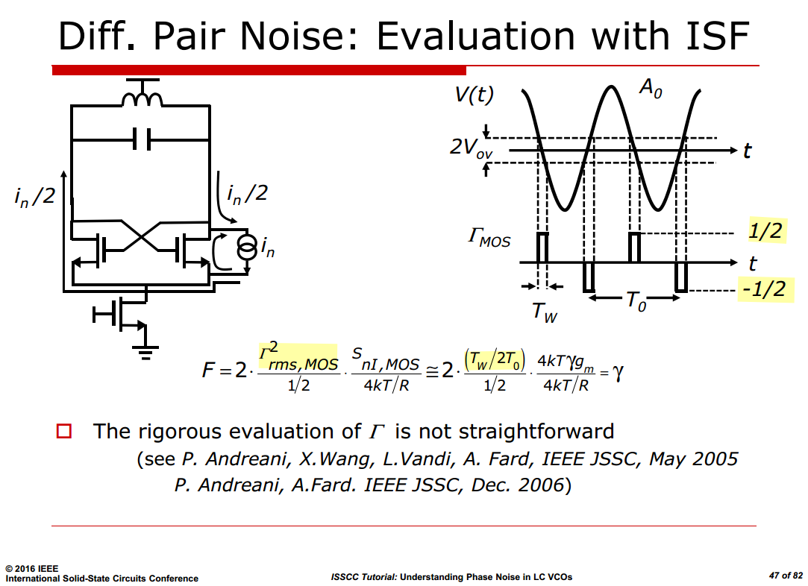

only **half** of this current is differentially injected in the tank at the zero-crossing


Given $\Gamma_{MOS}$ shown as above slide
$$
F_{rms,MOS}^2 = \frac{1/4\cdot T_\text{w}}{T_0/2} = \frac{T_\text{w}}{2T_0}
$$

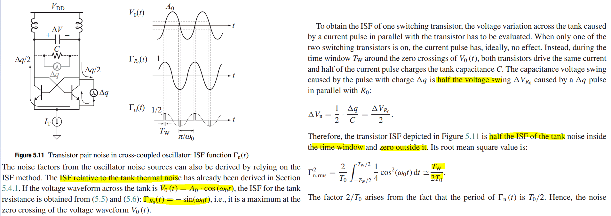

---

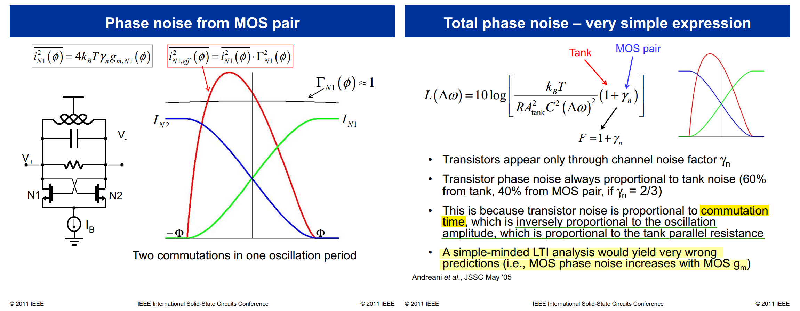

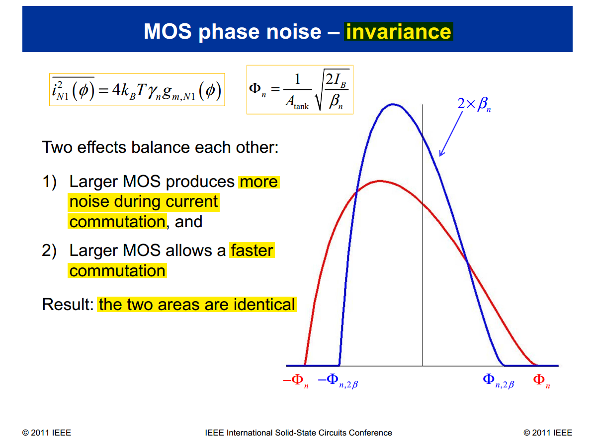

---

---

> P. Andreani, X. Wang, "On the Phase-Noise and Phase-Error Performances of Multiphase LC CMOS VCOs," IEEE Journal of Solid-State Circuits, vol. 39, pp. 1883-1893, Nov. 2004. [[https://backend.orbit.dtu.dk/ws/files/4109919/Wang.pdf](https://backend.orbit.dtu.dk/ws/files/4109919/Wang.pdf)]
>
> P. Andreani, X. Wang, L. Vandi, A. Frad, "A study of phase noise in Colpitts and LC-tank CMOS oscillators," IEEE Journal of Solid-State Circuits, vol. 40, pp. 1107-1118, May 2005. [[https://backend.orbit.dtu.dk/ws/files/3976825/Andreani.pdf](https://backend.orbit.dtu.dk/ws/files/3976825/Andreani.pdf)]
>
> A. Bevilacqua, P. Andreani, "An Analysis of 1/f Noise to Phase Noise Conversion in CMOS Harmonic Oscillators," IEEE Transactions on Circuits and Systems I: Regular Papers, vol. 59, no. 5, pp. 938-945, May 2012 [[https://sci-hub.jp/10.1109/TCSI.2012.2190564](https://sci-hub.jp/10.1109/TCSI.2012.2190564)]

For Class-B with **an Ideal Current Source**

-  noise factor is $\boxed{1+\gamma_n}$
-  $-g_m$ transistors (M1,2) do **not** contribute to $1/f$ noise upconversion

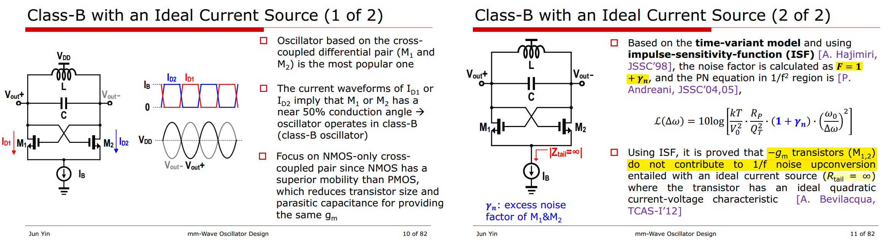



Note the contrast with **thermal noise**: **white noise is uncorrelated between the two crossings**, so the two kicks don't cancel — their variances add. That's why the same commutation mechanism gives you the full $\gamma_n$ term in $F = 1+\gamma_n$ for the $1/f^2$ region, yet contributes nothing in $1/f^3$


### Closed-Form Formula for the ISF

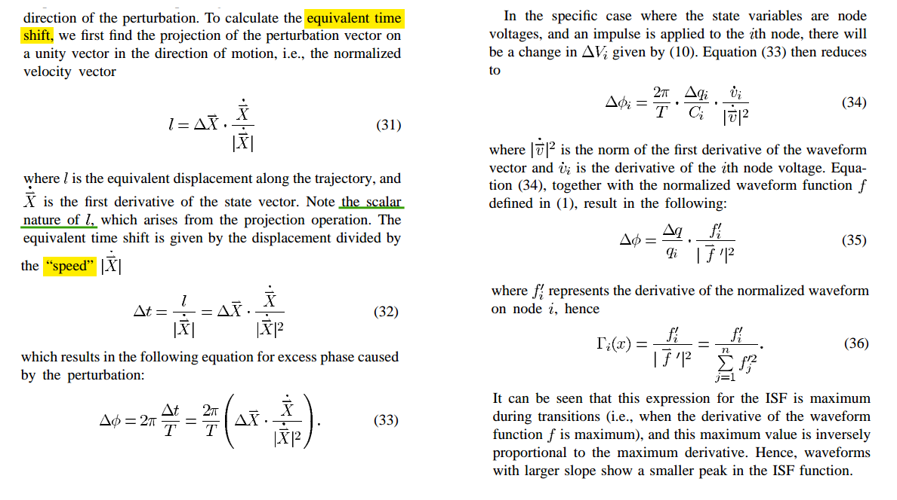If the state variables are node voltages, write $\Delta \vec X = \sum_i \Delta v_i\,\hat e_i$ (with $\Delta v_i = \Delta q_i/C_i$) and the **dot product** distributes:
$$
\Delta\phi = \frac{2\pi}{T}\frac{\big(\sum_i \Delta v_i \hat e_i\big)\cdot \dot{\vec X}}{\lVert\dot{\vec X}\rVert^{2}} \;=\frac{2\pi}{T}\; \sum_i\,\frac{\Delta v_i\, \dot v_i}{\lVert\dot{\vec X}\rVert^{2}} \;=\; \sum_i \Delta\phi_i,
$$
For second-order system, one can use the normalized waveform and its derivative as the state variables
$$
\Gamma_{1}(x)=\frac{f'(x)}{f^{2}(x)+f'^{2}(x)} \qquad \Gamma_{2}(x)=\frac{f''(x)}{f'^{2}(x)+f''^{2}(x)}
$$
In the case of an ideal sinusoidal oscillator $f=\cos(x)$
$$
\Gamma_{1}(x)=-\sin(x) \qquad \Gamma_{2}(x)=-\cos(x)
$$
A finite charge impulse into the node cannot make the inductor current jump ($v$ stays bounded, so $i_L=\frac{1}{L}\int v\,dt$ is continuous) — **current** *component of the perturbation* is exactly **zero**. That's physics of the input, not an approximation: $\Delta\vec X = (\Delta v,\,0)$ exactly, so $\Gamma_2$ gets multiplied by zero

Total phase noise sums over physical sources, each weighted by its own ISF

-  If every noise source in the circuit injects current into nodes — transistor channel noise, resistor noise, the usual on-chip situation — then the $\Gamma_1$ family is the whole story with no approximation
- $\Gamma_2$ enters only when a source physically acts as a series voltage on the inductor (flux injection), such as the coil's series resistance

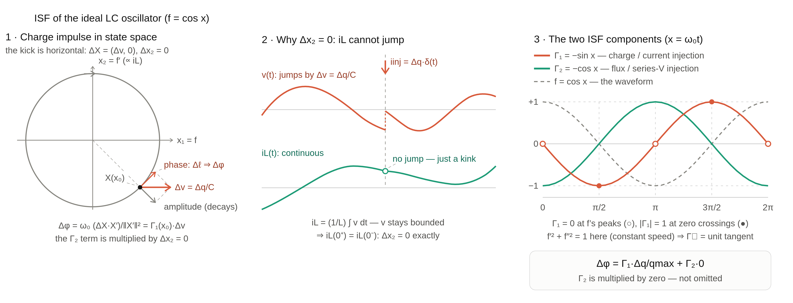

> quietly assumes the normal component contributes *zero* phase shift, i.e., that surfaces of equal phase (isochrons) cross the limit cycle orthogonally
>
> Real oscillators violate this to varying degrees (amplitude-to-phase conversion), which is why the paper ranks direct impulse-injection simulation as the most accurate


---

> The dot product and norm in (31)–(33) mean different things in different coordinates, so the same physical oscillator run through (33) in two different coordinate systems yields two different ISFs — and only one coordinate choice yields the paper's intended answer

Consider the **ideal parallel *LC* network** — pure sinusoid wave

Suppose a current pulse with area $q$ suddenly changes the charge across the capacitor, its voltage changes by $\Delta v_c=\Delta q/C$

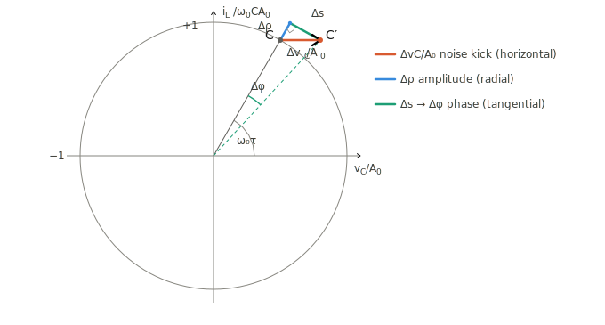

Decompose the horizontal kick $\Delta\vec r=(\Delta x,0)$ and $\Delta x=\Delta v_C/A_0$, with tangential direction $\hat t=(-\sin\theta,\cos\theta)$ and radial direction  $\hat r=(\cos\theta,\sin\theta)$
$$
\Delta \phi = \arctan\left(\frac{\Delta\vec r\cdot \hat t}{1 + \Delta\vec r\cdot \hat r}\right) = \arctan\left(\frac{-\Delta x \sin \theta}{1 + \Delta x \cos \theta}\right)\approx -\frac{\Delta v_C}{A_0} \sin(\omega_0 \tau)
$$


Therefore, the **ISF of an ideal parallel LC resonator** can be expressed as $\boxed{\Gamma(\omega \tau)=-\sin(\omega_0 \tau)}$, which is independent of peak voltage value $A_0$


---


***C. Calculation of ISF Based on the First Derivative***

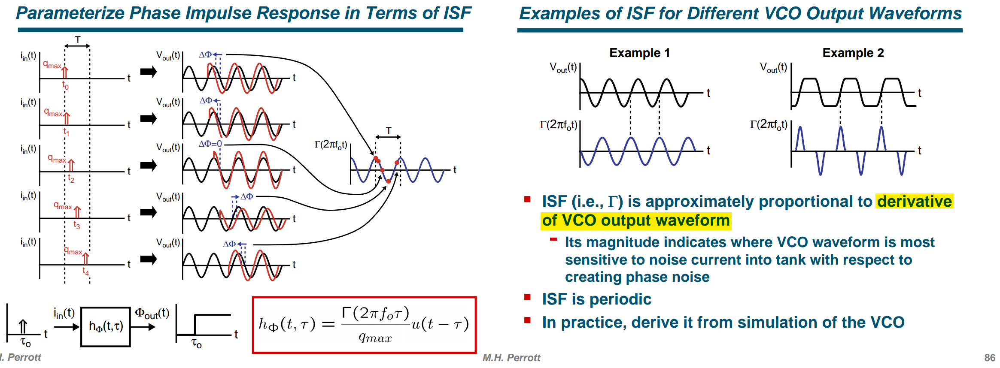


### additive voltage error

A fixed $\Delta V$ at a crossing shifts the crossing time by $\Delta t = \Delta V/\dot v$, so $\Delta\phi = \omega_0\Delta V/\dot v$. Express this against the normalized injection $\Delta\phi = \Gamma\cdot\Delta V/V_{\max}$ and solve:
$$
\Gamma_{\text{crossing}} = \frac{\omega_0 V_{\max}}{\dot v} = \frac{1}{f'}
$$
Now take eq. (37) at the mid-transition, where $f'' = 0$ (inflection point):
$$
\Gamma = \frac{f'}{f'^2 + f''^2}\;\Big|_{f''=0} = \frac{f'}{f'^2} = \frac{1}{f'}
$$

$$
\boxed{
\text{steeper transition}
\quad\Longrightarrow\quad
\text{smaller ISF peak}
}
$$
with $\Gamma = \sin x$, at crossing $\sin x =1$, which is derivative of edge
$$
\Delta \phi = \Gamma \frac{\Delta q}{q_\text{max}} = \sin x\cdot \frac{\Delta q}{C\cdot A}= \sin x\cdot \frac{\Delta q}{C\cdot A\sin x}
$$


## Murphy's Model — LTV in Frequency Domain

> C. Samori, A. L. Lacaita, F. Villa and F. Zappa, "Spectrum folding and phase noise in LC tuned oscillators," in *IEEE Transactions on Circuits and Systems II: Analog and Digital Signal Processing*, vol. 45, no. 7, pp. 781-790, July 1998 [[https://sci-hub.ru/10.1109/82.700925](https://sci-hub.ru/10.1109/82.700925)]
>
> D. Murphy, J. J. Rael and A. A. Abidi, "Phase Noise in LC Oscillators: A Phasor-Based Analysis of a General Result and of Loaded  Q ," in IEEE Transactions on Circuits and Systems I: Regular Papers, vol. 57, no. 6, pp. 1187-1203, June 2010 [[https://sci-hub.ru/10.1109/TCSI.2009.2030110](https://sci-hub.ru/10.1109/TCSI.2009.2030110)]


The differential pair plays two distinct roles. Toward its own noise it acts as a sampling gate — each transistor contributes only within the short conduction windows at the zero crossings — and the resulting injection is almost purely phase-modulating.

Toward the tail noise it acts as a single-balanced mixer, commutating the upstream current with a square wave and folding it as a single sideband that splits equally into AM and PM


### Diff. Pair Noise

> For diff. pair noise, the diff. pair is its own ***noise gate***

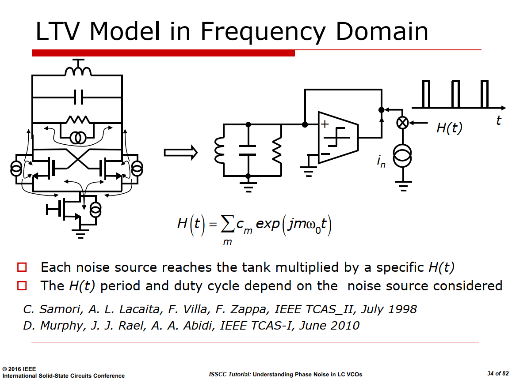

**half** of the noise current of each generator reaches the tank, while the **remaining half** circulates
within the transistor

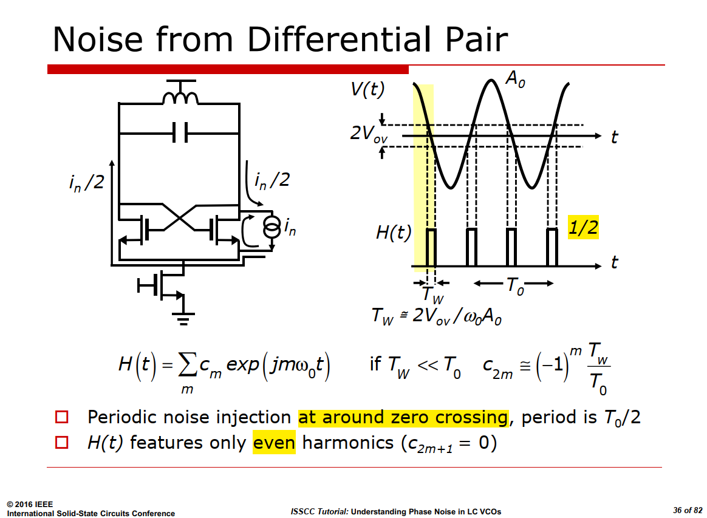

A reference pulse train centered at $t=0$ would have plain positive coefficients ($\tfrac{T_w}{T_0}$, with $\operatorname{sinc} \approx 1$).
$$
c_n = \frac{1}{2}\cdot \frac{T_w}{T_0/2}\operatorname{sinc}\left(\frac{nT_w}{T_0/2}\right)=\frac{T_w}{T_0}\operatorname{sinc}\left(\frac{2nT_w}{T_0}\right)
$$
The real injection sits at $t=T_0/4$, and since the pulse-train period is $P=T_0/2$, that offset is exactly $P/2$ — a half-period shift. Every coefficient therefore picks up $(-1)^m$ — $e^{j2m\omega_0\cdot T_0/4}=e^{jm\pi}$
$$
c_{2m} = \underbrace{(-1)^m}_{\text{position}}\,
         \underbrace{\frac{T_w}{T_0}}_{\text{area / period}}\,
         \underbrace{\operatorname{sinc}\!\left(\frac{2mT_w}{T_0}\right)}_{\to\,1 \text{ as } T_w \ll T_0}
$$
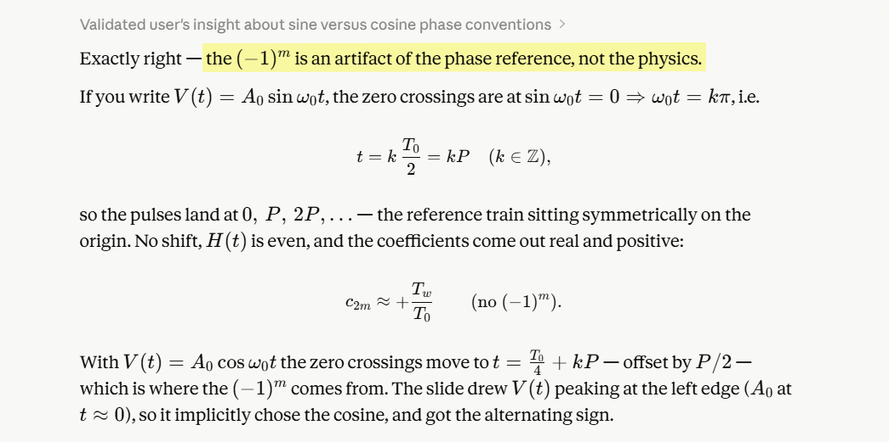

Consequently, excess noise arises solely from the components at $\omega_0\pm \omega_m$, since all other spectral components lie outside the tank bandwidth and are therefore suppressed by the resonator's frequency-selective filtering

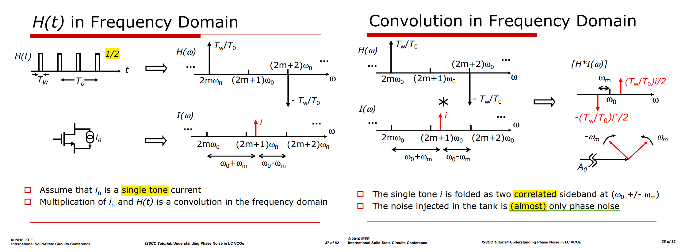


With *Cyclostationary Noise (Modulated Noise) [[https://raytroop.github.io/2024/04/27/noise/#cyclostationary-noise-modulated-noise](https://raytroop.github.io/2024/04/27/noise/#cyclostationary-noise-modulated-noise)]*

For one MOS, Two-Sided PSD is
$$
S_O = S_I \cdot \mathcal{D}\cdot \mathcal{h}^2 = 2kT\gamma g_m\cdot \frac{2T_W}{T_0}\cdot\frac{1}{4} = \frac{T_W}{2T_0}\cdot 2kT\gamma g_m
$$
yield **One-Sided PSD** of **one MOS**
$$
S_O' = \textcolor{blue}{\frac{T_W}{2T_0}}\cdot 4kT\gamma g_m
$$
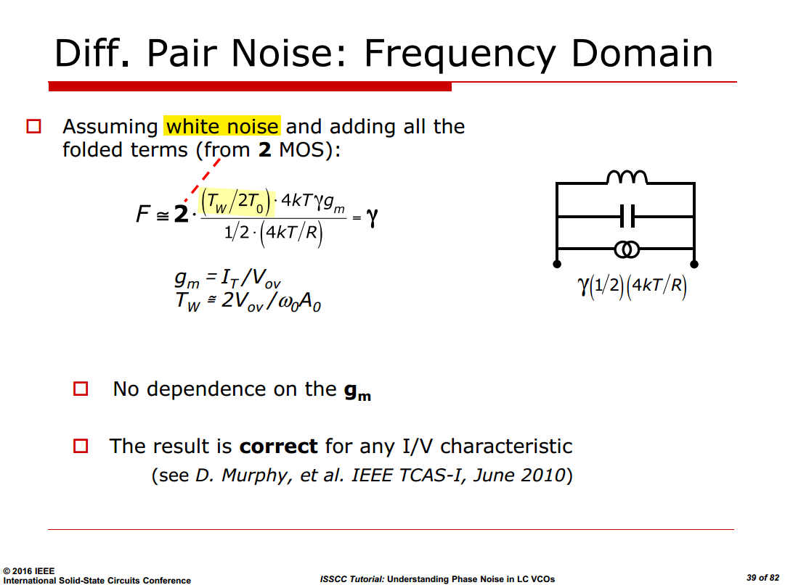

The **single-tone analysis** establishes that the differential-pair current is injected as **almost pure phase noise**, while **summing the white-noise power over all harmonics** of the gating function ($\overline{H^2}=T_W/2T_0$) sets its **magnitude**; together these yield the differential-pair contribution to the oscillator phase noise.


---

phase noise is independent of the transconductance of the transistors


### Tail Noise

> For the tail noise, the **diff. pair is a mixer**

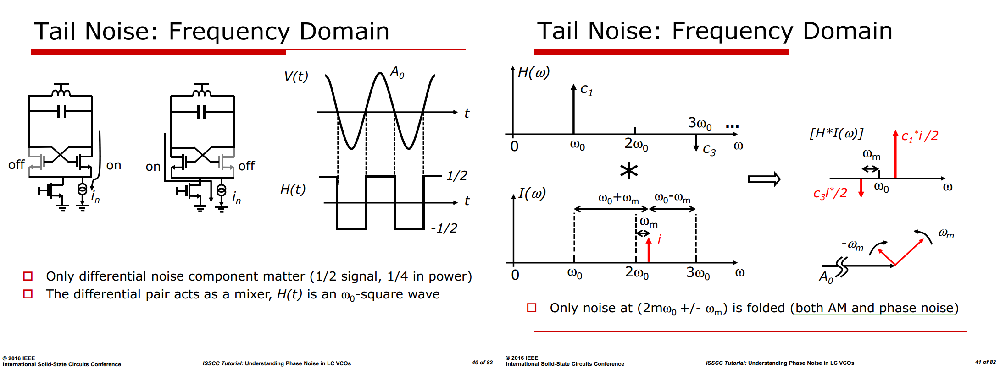
$$
V_{AM} = \tfrac{1}{2}\big(C_+ + \overline{C}_-\big) = \tfrac{1}{2}\Big(\tfrac{c_1^* i}{2} + \tfrac{c_3^* i}{2}\Big)\qquad
V_{PM} = \tfrac{1}{2}\big(C_+ - \overline{C}_-\big) = \tfrac{1}{2}\Big(\tfrac{c_1^* i}{2} - \tfrac{c_3^* i}{2}\Big)
$$
$V_{AM}\approx V_{PM}$ for a square wave $|c_1|=3|c_3|$ — modulated tail noise is divided into ***AM and phase noise almost equally***
$$
S_{I,PN} = S_{nI,T} \cdot \mathcal{D}\cdot \mathcal{h}^2 \cdot \frac{1}{2} = S_{nI,T} \cdot 1 \cdot \frac{1}{4}\cdot \frac{1}{2} = \boxed{\frac{1}{8}\cdot S_{nI,T}}
$$
The commutation folds  tail noise as **a (near) single sideband**, which is equivalent to equal AM and PM — and only the PM half counts toward phase noise

***Noise around $\boxed{2\omega_0 \pm\omega_m}$ dominate phase noise due to $|c_1|, |c_3| \gg |c_{2m+1}| \space\space\space\space \forall m>1$***

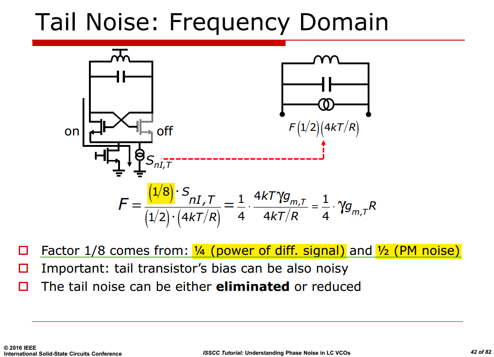


---

> E. Hegazi, H. Sjoland and A. Abidi, "A filtering technique to lower oscillator phase noise," *2001 IEEE International Solid-State Circuits Conference. Digest of Technical Papers. ISSCC (Cat. No.01CH37177)*, San Francisco, CA, USA, 2001 [[paper](https://engineering.purdue.edu/oxidemems/conferences/isscc2001/DATA/D23_4.pdf), [slides](https://engineering.purdue.edu/oxidemems/conferences/isscc2001/DATA/SS23_4.pdf)]

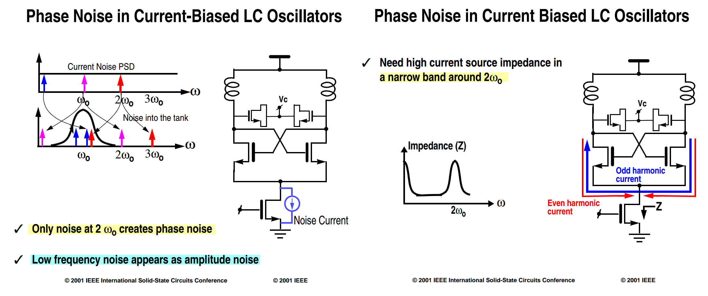

In the first-order, **noise around DC (flicker)** is **upconverted** as a pair of correlated, symmetric sidebands around the carrier — which is **pure AM**

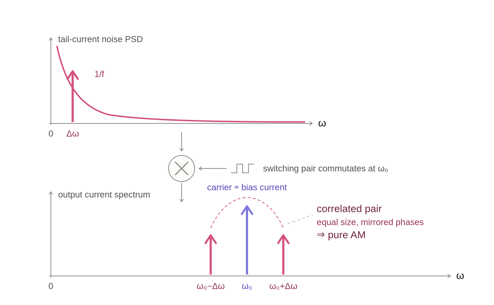


---

> J. J. Rael and A. A. Abidi, "Physical processes of phase noise in differential LC oscillators," IEEE Custom Integrated Circuits Conference (CICC), 2000 [[https://people.engr.tamu.edu/spalermo/ecen620/physical_processes_pn_diff_lc_osc_rael_cicc_2000.pdf](https://people.engr.tamu.edu/spalermo/ecen620/physical_processes_pn_diff_lc_osc_rael_cicc_2000.pdf)]

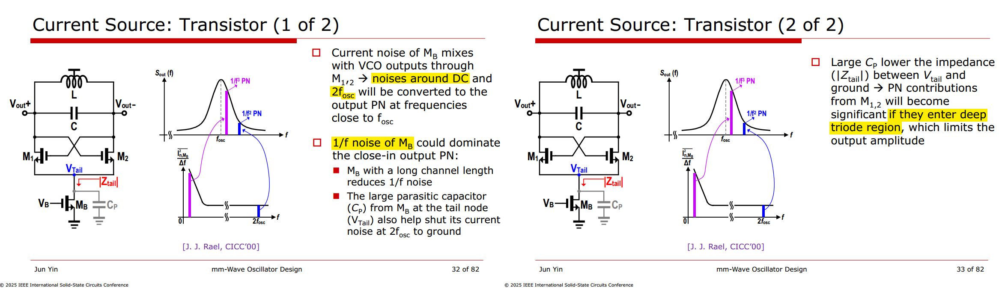

*practical outcome* once second-order conversion effects are included

- flicker near DC &#8594; AM/bias modulation &#8594; converted to FM &#8594; 1/f<sup>3</sup> PN (the purple arrow in its spectrum)
- while thermal noise at 2f<sub>osc</sub> &#8594; direct PN &#8594;  1/f<sup>2</sup> PN (the blue arrow)


## Demir's Model — NLTV

> A. Demir, A. Mehrotra and J. Roychowdhury, "Phase noise in oscillators: a unifying theory and numerical methods for characterization," in *IEEE Transactions on Circuits and Systems I: Fundamental Theory and Applications*, vol. 47, no. 5, pp. 655-674, May 2000 [[https://sci-hub.jp/10.1109/81.847872](https://sci-hub.jp/10.1109/81.847872)]
>
> A. Demir and A. Sangiovanni-Vincentelli, *Analysis and Simulation of Noise in Nonlinear Electronic Circuits and Systems*, vol. 425. Boston, MA, USA: Kluwer Academic Publishers, 1998
>
> A. Mehrotra and A. Sangiovanni-Vincentelli, *Noise Analysis of Radio Frequency Circuits*, 1st ed. New York, NY, USA: Springer, 2004


Demir's theory is essentially Floquet theory applied to the limit cycle of an autonomous oscillator, and the PPV is one specific Floquet vector


### PPV (Perturbation Projection Vector)

> A. Demir and J. Roychowdhury, "A reliable and efficient procedure for oscillator PPV computation, with phase noise macromodeling applications," in *IEEE Transactions on Computer-Aided Design of Integrated Circuits and Systems*, vol. 22, no. 2, pp. 188-197, Feb. 2003  [[https://sci-hub.se/10.1109/TCAD.2002.806599](https://sci-hub.se/10.1109/TCAD.2002.806599)]
>
> Helene Thibieroz, Customer Support CIC. Using Spectre RF Noise-Aware PLL Methodology to Predict PLL Behavior Accurately  [[https://citeseerx.ist.psu.edu/document?repid=rep1&type=pdf&doi=3056e59ea76165373f90152f915a829d25dabebc](https://citeseerx.ist.psu.edu/document?repid=rep1&type=pdf&doi=3056e59ea76165373f90152f915a829d25dabebc)]
>
> Aditya Varma Muppala. Perturbation Projection Vector (PPV) Theory | Oscillators 11 | MMIC 16 [[youtu.be](https://youtu.be/rbbHfZGT6Jo), [notes](https://adityamuppala.github.io/assets/Notes_YouTube/PPV_Theory_Notes.pdf)]
>
> S. Levantino and P. Maffezzoni, "Computing the Perturbation Projection Vector of Oscillators via Frequency Domain Analysis," in IEEE Transactions on Computer-Aided Design of Integrated Circuits and Systems, vol. 31, no. 10, pp. 1499-1507, Oct. 2012 [[https://sci-hub.se/10.1109/TCAD.2012.2194493](https://sci-hub.se/10.1109/TCAD.2012.2194493)]


### Limit Cycles

> [[https://adityamuppala.github.io/assets/Notes_YouTube/MMIC_Limit_Cycles.pdf](https://adityamuppala.github.io/assets/Notes_YouTube/MMIC_Limit_Cycles.pdf)]

***Nonlinear*** Dynamics

 


### Lorentzian spectrum


We typically use the two spectra, $S_{\phi n}(f)$ and $S_{out}(f)$, interchangeably, but we must resolve these inconsistencies. **voltage spectrum**  is called **Lorentzian spectrum**

---

The periodic signal $x(t)$ can be expanded in Fourier series as:


Assume that the signal is subject to *excess phase noise*, which is modeled by adding a **time-dependent** noise component $\alpha(t)$. The noisy signal can be written $x(t+\alpha(t))$, the added excess phase $\phi(t)= \frac{\alpha(t)}{\omega_0}$

> 


The autocorrelation of the noisy signal is by definition:


The *autocorrelation averaged over time* results in:


By taking the Fourier transform of the autocorrelation, the spectrum of the signal $x(t + \alpha(t))$​ can be expressed as


It is also interesting to note how the integral in *Equation 9.80* around each harmonic is equal to the power of the harmonic itself $|X_n|^2$

The integral $S_x(f)$ around harmonic is
$$\begin{align}
P_{x,n} &= \int_{f=-\infty}^{\infty} |X_n|^2\frac{\omega_0^2n^2c}{\frac{1}{4}\omega_0^4n^4c^2+(\omega +n\omega_0)^2}df \\
&= |X_n|^2\int_{\Delta f=-\infty}^{\infty}\frac{2\beta}{\beta^2+(2\pi\cdot\Delta f)^2}d\Delta f \\
&= |X_n|^2\frac{1}{\pi}\arctan(\frac{2\pi \Delta f}{\beta})|_{-\infty}^{\infty} \\
&= |X_n|^2
\end{align}$$


***The phase noise does not affect the total power in the signal, it only affects its distribution***

- Without phase noise, $S_v(f)$ is a series of impulse functions at the harmonics of $f_o$.
- With phase noise, the impulse functions spread, becoming fatter and shorter but retaining the *same total power*


> 
>
> [[https://community.cadence.com/cadence_technology_forums/f/rf-design/51484/comparing-transient-noise-pnoise-and-pnoise-with-lorentian-approximation-of-a-ring-oscillator/1382911](https://community.cadence.com/cadence_technology_forums/f/rf-design/51484/comparing-transient-noise-pnoise-and-pnoise-with-lorentian-approximation-of-a-ring-oscillator/1382911)]


---


## Razavi's PN

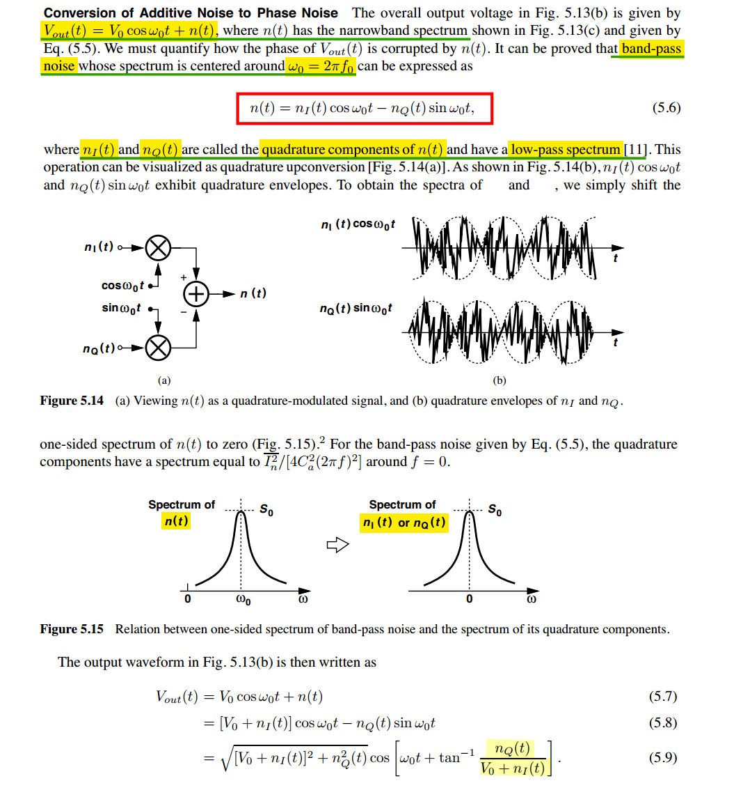


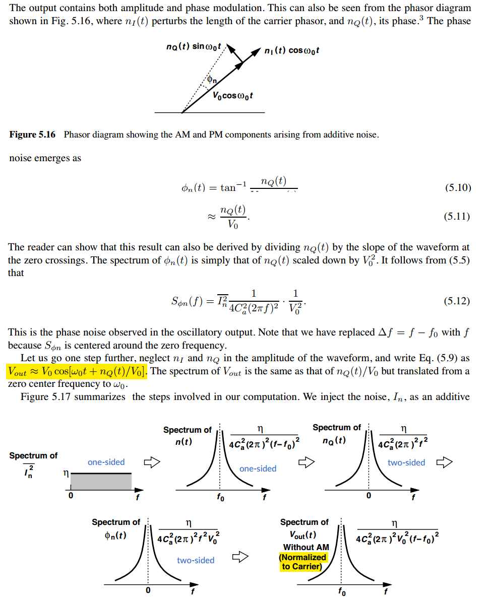

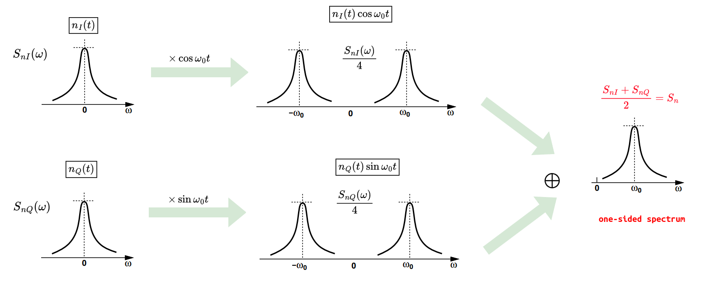

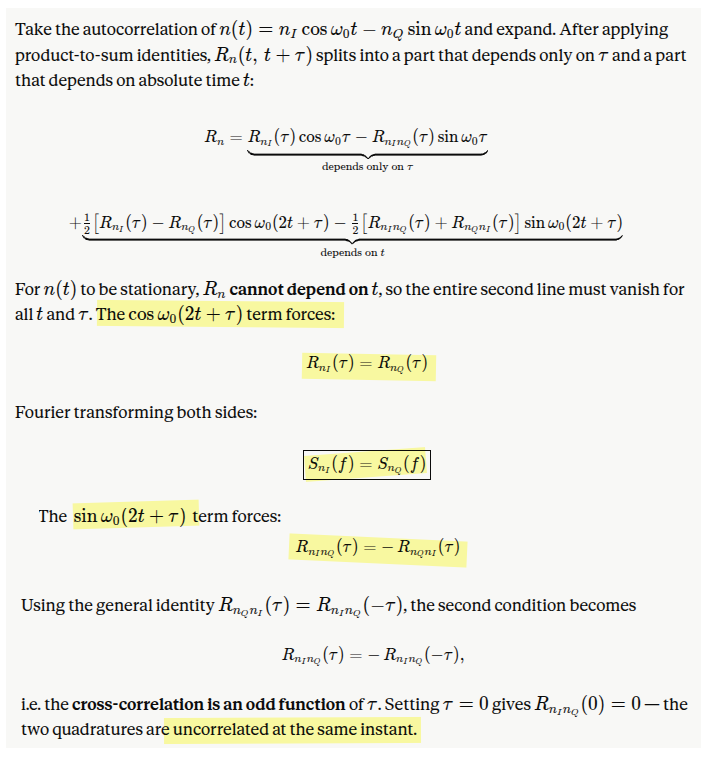

$R_{nI}(\tau) = R_{nQ}(\tau)$ demonstrate **spectra** of $n_I $ and $n_Q $ to be **equal**

$R_{nInQ}(\tau)=-R_{nQnI}(\tau)$ demonstrate  $n_I $ and $n_Q $ are **uncorrelated**


## Abidi's PN

> A. A. Abidi and D. Murphy, "How to Design a Differential CMOS LC Oscillator," in IEEE Open Journal of the Solid-State Circuits Society, vol. 5, pp. 45-59, 2025 [[https://ieeexplore.ieee.org/stamp/stamp.jsp?arnumber=10818782](https://ieeexplore.ieee.org/stamp/stamp.jsp?arnumber=10818782)]
>
> A. Mirzaei and A. A. Abidi, "The Spectrum of a Noisy Free-Running Oscillator Explained by Random Frequency Pulling," in *IEEE Transactions on Circuits and Systems I: Regular Papers*, vol. 57, no. 3, pp. 642-653, March 2010 [[https://sci-hub.jp/10.1109/TCSI.2009.2024970](https://sci-hub.jp/10.1109/TCSI.2009.2024970)]
>
> J. J. Rael and A. A. Abidi, "Physical processes of phase noise in differential LC oscillators," IEEE Custom Integrated Circuits Conference (CICC), 2000 [[https://people.engr.tamu.edu/spalermo/ecen620/physical_processes_pn_diff_lc_osc_rael_cicc_2000.pdf](https://people.engr.tamu.edu/spalermo/ecen620/physical_processes_pn_diff_lc_osc_rael_cicc_2000.pdf)]


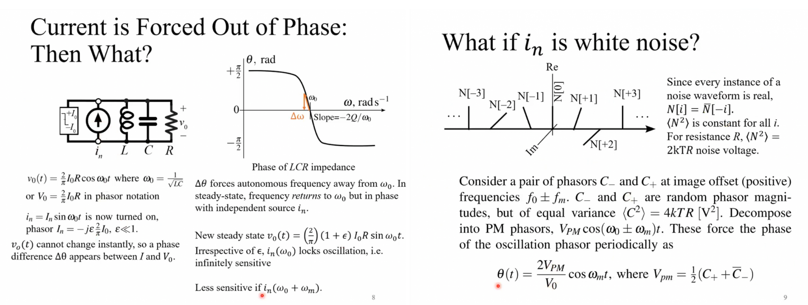


## Bank's General Result

> J. Bank, "A harmonic-oscillator design methodology based on describing functions," Ph.D. dissertation, Dept. Signals Syst., Sch. Elect. Eng., Chalmers Univ. Techn., Chalmers, Sweden, 2006. [[https://publications.lib.chalmers.se/records/fulltext/17376.pdf](https://publications.lib.chalmers.se/records/fulltext/17376.pdf)]
>
> A. Mazzanti and A. Bevilacqua, "On the Phase Noise Performance of Transformer-Based CMOS Differential-Pair Harmonic Oscillators," in *IEEE Transactions on Circuits and Systems I: Regular Papers*, vol. 62, no. 9, pp. 2334-2341, Sept. 2015  [[https://sci-hub.jp/10.1109/TCSI.2015.2451915](https://sci-hub.jp/10.1109/TCSI.2015.2451915)]


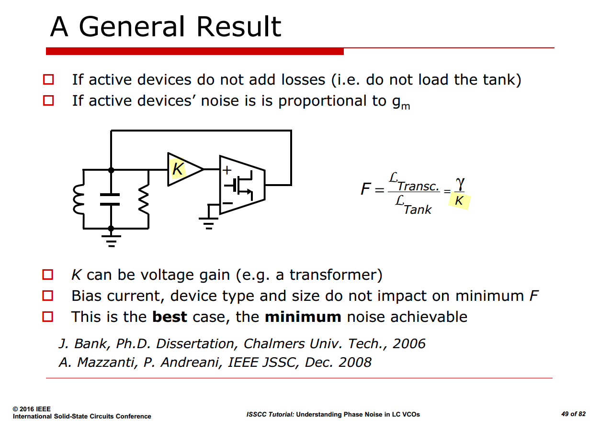


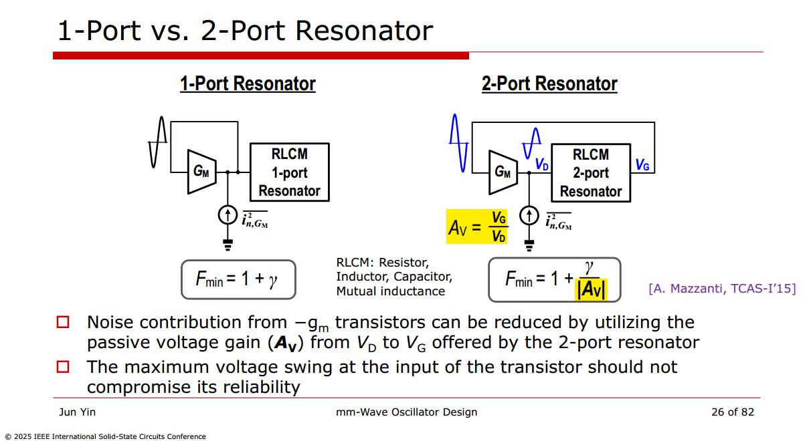


## Chembiyan's Phase Perturbation

> Chembiyan T, "Brownian Motion And The Oscillator Phase Noise" [[link](https://www.linkedin.com/posts/chembiyan-t-0b34b910_vco-perturbed-by-a-brownian-motion-activity-6994691057045159936-nqaN?utm_source=share&utm_medium=member_desktop)]
>
> —, "Jitter and Phase Noise in Oscillators" [[link](https://www.linkedin.com/posts/chembiyan-t-0b34b910_jitter-and-phase-noise-activity-7028431979649929216-KsZw?utm_source=share&utm_medium=member_desktop)]
>
> —, "Jitter and Phase Noise in Phase Locked Loops" [[link](https://www.linkedin.com/posts/chembiyan-t-0b34b910_jitter-and-phase-noise-activity-7031985595304345600-uSx3?utm_source=share&utm_medium=member_desktop)]
>
> —, "PLLs and reference spurs" [[link](https://www.linkedin.com/posts/chembiyan-t-0b34b910_pll-rfdesign-circuits-activity-7111435571448713216-9jng?utm_source=share&utm_medium=member_desktop)]


### w/ stationary noise with Gaussian PDF


---

If keep $\phi_{rms}$ in $R_x(\tau)$, i.e.
$$
R_x(\tau)=\frac{A^2}{2}e^{-\phi_{rms}^2}\cos(2\pi f_0 \tau)e^{R_\phi(\tau)}\approx \frac{A^2}{2}e^{-\phi_{rms}^2}\cos(2\pi f_0 \tau)(1+R_\phi(\tau))
$$
The PSD of the signal is
$$
S_x(f) = \mathcal{F} \{ R_x(\tau) \} = \frac{P_c}{2}e^{-\phi_{rms}^2}\left[S_\phi(f+f_0)+S_\phi(f-f_0)\right] + \frac{P_c}{2}e^{-\phi_{rms}^2}\left[\delta(f+f_0)+\delta(f-f_0)\right]
$$
&#10071;&#10071;above Eq **isn't** consistent with stationary white noise process - the following section


### w/ stationary white noise


Assuming that the delay line is *noiseless*


---


Expanding the cosine function we get
$$\begin{align}
R_y(t,\tau) &= \frac{A^2}{2}\left\{\cos(2\pi f_0\tau)E[\cos(\phi(t)-\phi(t-\tau))] - \sin(2\pi f_0\tau)E[\sin(\phi(t)-\phi(t-\tau))]\right\} \\
&+ \frac{A^2}{2}\left\{\cos(4\pi f_0(t+\tau/2-T_D))E[\cos(\phi(t)+\phi(t-\tau))] - \sin(4\pi f_0(t+\tau/2-T_D))E[\sin(\phi(t)+\phi(t-\tau))] \right\}
\end{align}$$

where, both the process $\phi(t)-\phi(t-\tau)$ and $\phi(t)+\phi(t-\tau)$ are independent of time $t$, i.e. $E[\cos(\phi(t)+\phi(t-\tau))] = m_{\cos+}(\tau)$, $E[\cos(\phi(t)-\phi(t-\tau))] = m_{\cos-}(\tau)$,  $E[\sin(\phi(t)+\phi(t-\tau))] = m_{\sin+}(\tau)$ and  $E[\sin(\phi(t)-\phi(t-\tau))] = m_{\sin-}(\tau)$

we obtain
$$\begin{align}
R_y(t,\tau) &= \frac{A^2}{2}\left\{\cos(2\pi f_0\tau)m_{\cos-}(\tau) - \sin(2\pi f_0\tau)m_{\sin-}(\tau)\right\} \\
&+ \frac{A^2}{2}\left\{\cos(4\pi f_0(t+\tau/2-T_D))m_{\cos+}(\tau) - \sin(4\pi f_0(t+\tau/2-T_D))m_{\sin+}(\tau) \right\}
\end{align}$$

The second term in the above expression is periodic in $t$ and to estimate its PSD, we compute the ***time-averaged* autocorrelation function**
$$
R_y(\tau) = \frac{A^2}{2}\left\{\cos(2\pi f_0\tau)m_{\cos-}(\tau) - \sin(2\pi f_0\tau)m_{\sin-}(\tau)\right\}
$$


After nontrivial derivation


---

> 


### w/ Weiner process


The phase process $\phi(t)$ is also gaussian but with *an increasing **variance** which grows **linearly** with time* $t$


$$\begin{align}
R_y(t,\tau) &= \frac{A^2}{2}\left\{\cos(2\pi f_0\tau)E[\cos(\phi(t)-\phi(t-\tau))] - \sin(2\pi f_0\tau)E[\sin(\phi(t)-\phi(t-\tau))]\right\} \\
&+ \frac{A^2}{2}\left\{\cos(4\pi f_0(t+\tau/2-T_D)E[\cos(\phi(t)+\phi(t-\tau))] - \sin(4\pi f_0(t+\tau/2-T_D)E[\sin(\phi(t)+\phi(t-\tau))] \right\}
\end{align}$$


**The spectrum of $y(t)$ is determined by the asymptotic behavior of $R_y(t,\tau)$ as $t\to \infty$**

> &#10071;&#10071; $\lim_{t\to\infty}R_y(t,\tau)$ rather than *time-averaged autocorrelation function* of cyclostationary process, ref. Demir's paper


We define $\zeta(t, \tau)=\phi(t)+\phi(t-\tau) = \phi(t)-\phi(t-\tau) + 2\phi(t-\tau)$, the expected value of $\zeta(t,\tau)$ is 0, the variance is $\sigma_{\zeta}^2=(k\sigma)^2(\tau + 4(t-\tau))=(k\sigma)^2(4t-3\tau)$
$$
E[\cos(\zeta(t,\tau))]=\frac{1}{\sqrt{2\pi \sigma_{\zeta}^2}}\int_{-\infty}^{\infty}e^{-\zeta^2/2\sigma_{\zeta}^2}\cos(\zeta)d\zeta = e^{-\sigma_{\zeta}^2/2}=e^{-(k\sigma)^2(4t-\tau)}
$$
i.e., $\lim _{t\to \infty} E[\cos(\zeta(t,\tau))] = \lim_{t\to \infty}e^{-(k\sigma)^2(4t-\tau)} = 0$

For $E[\sin(\zeta(t,\tau))]$, we have
$$
E[\sin(\zeta(t,\tau))] = \frac{1}{\sqrt{2\pi \sigma_{\zeta}^2}}\int_{-\infty}^{\infty}e^{-\zeta^2/2\sigma_{\zeta}^2}\sin(\zeta)d\zeta
$$
i.e., $E[\sin(\zeta(t,\tau))]$ is *odd function*, therefore $E[\sin(\zeta(t,\tau))]=0$

Finally, we obtain


---


## ISF & PPV Extraction

> PPV values from pss/pnoise simulation in spectreRF [[https://community.cadence.com/cadence_technology_forums/f/rf-design/35062/ppv-values-from-pss-pnoise-simulation-in-spectrerf](https://community.cadence.com/cadence_technology_forums/f/rf-design/35062/ppv-values-from-pss-pnoise-simulation-in-spectrerf)]
>
> ISF Function Extraction in Cadence Virtuoso [[https://community.cadence.com/cadence_technology_forums/f/custom-ic-design/43969/isf-function-extraction-in-cadence-virtuoso](https://community.cadence.com/cadence_technology_forums/f/custom-ic-design/43969/isf-function-extraction-in-cadence-virtuoso)]


### ISF from Transient Analysis

> David Dolt. ECEN 620 Network Theory - Broadband Circuit Design: "VCO ISF Simulation" [[https://people.engr.tamu.edu/spalermo/ecen620/ISF_SIM.pdf](https://people.engr.tamu.edu/spalermo/ecen620/ISF_SIM.pdf)]

an injected current impulse with charge $\Delta q=\int i(t)\,dt$, produces the permanent phase shift
$$
\Delta\phi
=
\Gamma(\omega_0\tau)\frac{\Delta q}{q_{\max}}.
$$
Therefore,
$$
\Gamma(\omega_0\tau)
=
\Delta\phi \frac{q_{\max}}{\Delta q}.
$$


---

---

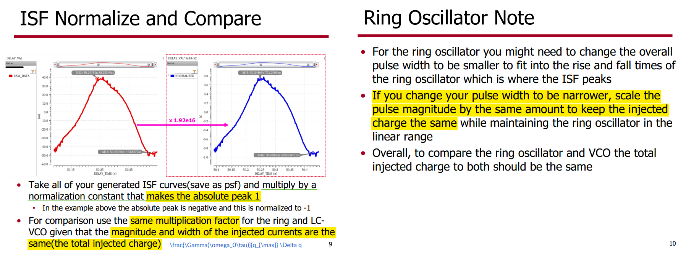
$$
\boxed{
\text{Same injected charge}
\quad\Longrightarrow\quad
\Delta\phi\propto\frac{\Gamma}{q_{\max}}
}
$$
So:

- To compare **actual robustness against equal charge impulses**, compare $\Delta\phi/\Delta q$
- To compare the formal dimensionless ISFs, multiply each simulated phase response by its own $q_{\max}/\Delta q$

---

---

> Aditya Varma Muppala, ISF Simulation in Cadence Using Transient Analysis | Oscillators 07 | MMIC 12 [[https://youtu.be/yiMn2rCtTXY](https://youtu.be/yiMn2rCtTXY)]
>

$$
h_{\phi}(t,{\tau})
=
\frac{\Gamma(\omega_0{\tau})}{q_{\max}}
u(t-\tau)
$$

Therefore,
$$
\boxed{
\Gamma(\omega_0{\tau})
=
\frac{\Delta t}{T_0}
\cdot 2\pi
\cdot
\frac{q_{\max}}{\Delta q}
}
$$

1. $\Delta q$ should be:
   - not too small $\rightarrow$ numerical error
   - not too large $\rightarrow$ nonlinearity
2. $\Delta t$ should be measured after the amplitude settles down
    (steady-state solution).
3. The impulse should be injected after the oscillator stabilizes.
4. The simulation step size used to measure $\Delta t$ should be small.
5. The transient-simulation error tolerance should be small.

Use `cross` function to find zero crossing when impulse is off. Set significant digits to 16 and note down the value.
$$
T_{i=0}
=
15.62239156\times10^{-9}
=
15.622\times10^{-9}
+
0.39156\times10^{-12}
$$

- Subtract it from the `cross` output. ADE output truncates it, so break it up into different unit scales.
- Check that the output is approximately zero before running sweeps.

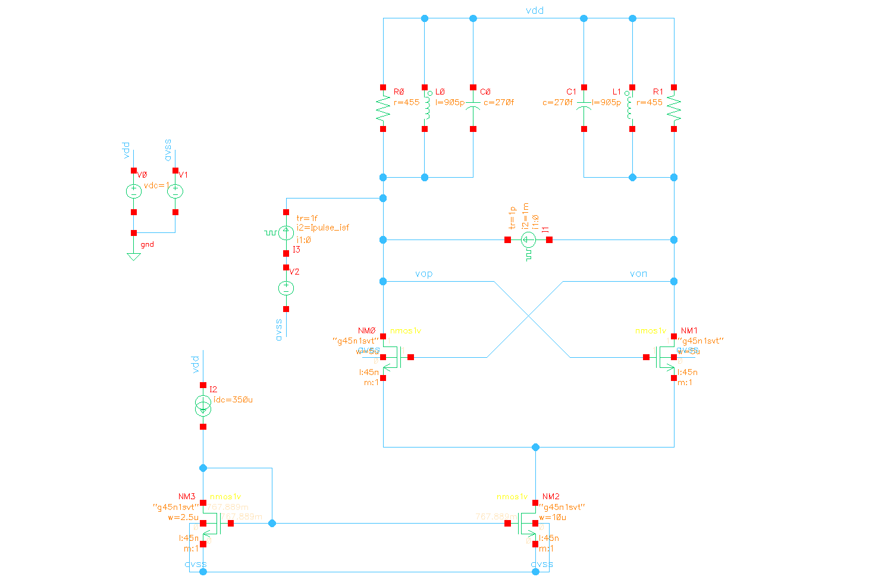


***Oscillator Injection Linearity***

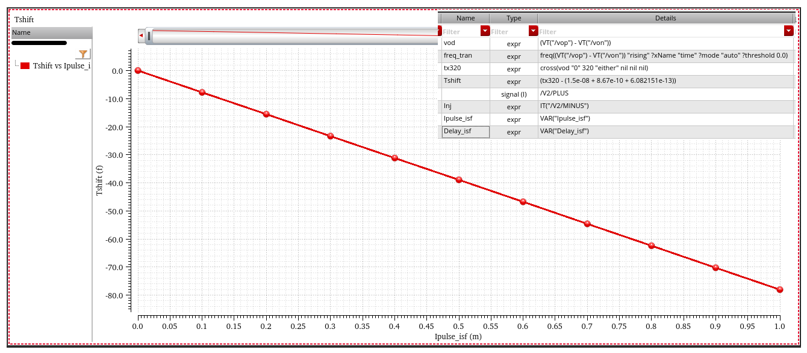

***time shift by sweeping current pulse delay***

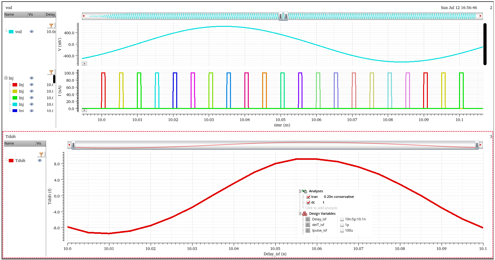


---

---

> Aditya Varma Muppala, Noise Modulation Function (**NMF**) Simulation in Cadence | Oscillators 08 | MMIC 13 [[https://youtu.be/CvcLG9cSreg](https://youtu.be/CvcLG9cSreg)] [[code](https://drive.google.com/file/d/1kShP5BChj7fnRMTs2qAHs-InUnsp5-r7/view?usp=sharing)]


 ***source-specific ISF***

For example, if MOS drain thermal noise is represented as a current source between drain and source, then the perturbation used to obtain the source-specific ISF should also be injected between those same drain and source nodes

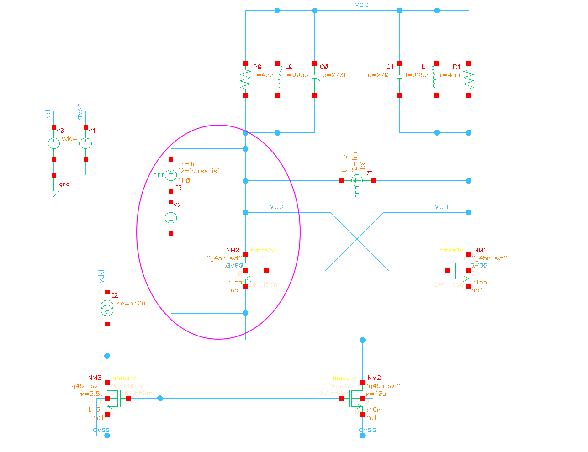

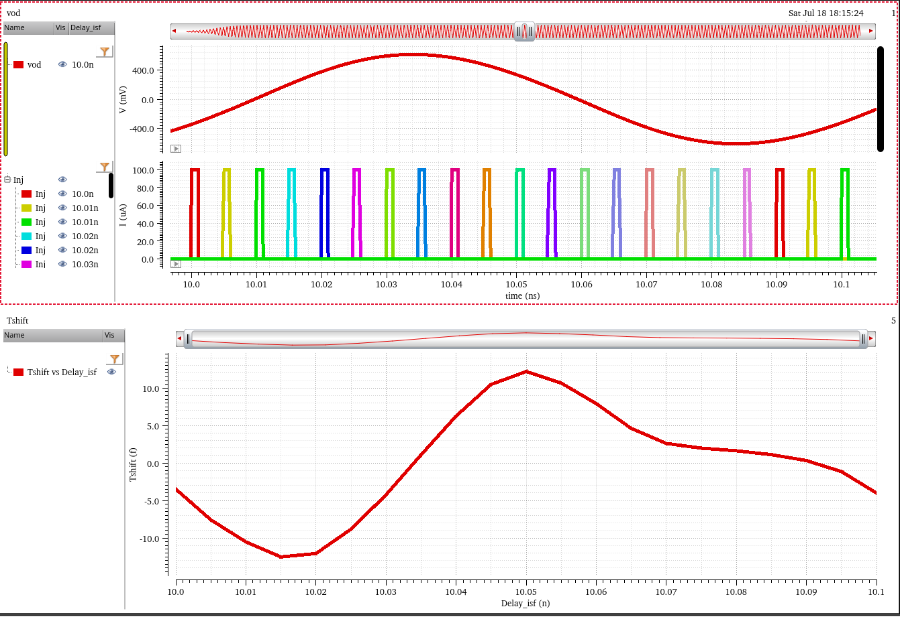


***NMF $\alpha_{NMF}(t)$ shall work with the corresponding source-specific ISF/PPV***

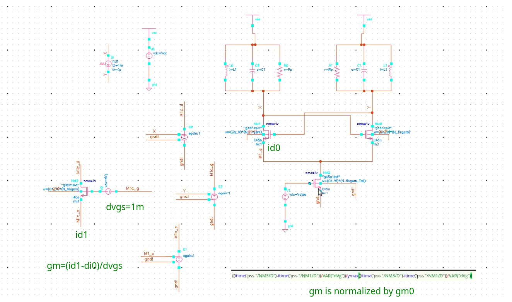
$$
\boxed{I_n(t)=4kT\gamma \cdot \textcolor{red}{g_m(t)} = 4kT\gamma \cdot \textcolor{red}{\alpha_{NMF} (t)g_{m,0}}}
$$

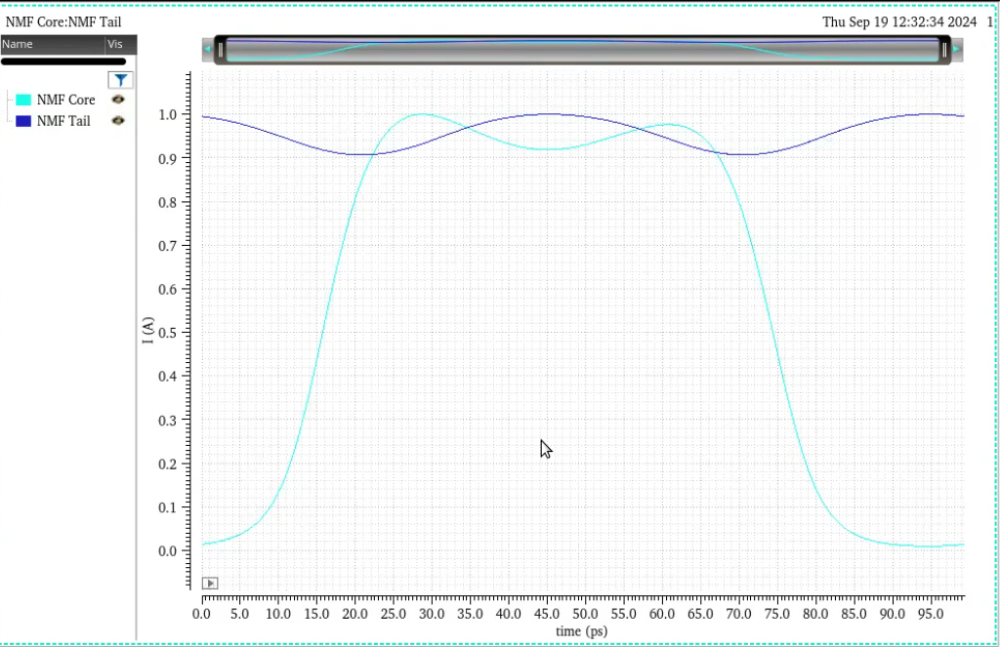


### ISF from PSS + *Positive Sidebands* of PXF

> Hu, Yizhe, "Intuitive Understanding of Flicker Noise Reduction via Narrowing of Conduction Angle in Voltage-Biased Oscillators," in IEEE Transactions on Circuits and Systems II: Express Briefs, vol. 66, no. 12, pp. 1962-1966, Dec. 2019 [[https://sci-hub.ru/10.1109/TCSII.2019.2896483](https://sci-hub.ru/10.1109/TCSII.2019.2896483)]
>
> —. (2019). A Simulation Technique of Impulse Sensitivity Function (ISF) Based on Periodic Transfer Function (PXF). 10.13140/RG.2.2.32151.60323. [[link](https://www.researchgate.net/publication/331072119_A_Simulation_Technique_of_Impulse_Sensitivity_Function_ISF_Based_on_Periodic_Transfer_Function_PXF)]
>
> —, "Oscillator Flicker Phase Noise: A Tutorial," in *IEEE Transactions on Circuits and Systems II: Express Briefs*, vol. 68, no. 2, pp. 538-544, Feb. 2021 [[paper](https://ieeexplore.ieee.org/stamp/stamp.jsp?tp=&arnumber=9286468)] [[slides](https://www.researchgate.net/publication/352173342_Oscillator_Flicker_Phase_Noise_A_Tutorial)]
>
> Aditya Varma Muppala, Fast Simulation of ISF and PPV using PSS and PXF in Cadence | Oscillators 12 | MMIC 19 [[video](https://youtu.be/Lu6VEWEEdxo) [note](https://adityamuppala.github.io/assets/Notes_YouTube/ISF_from_PXF.pdf) [code](https://drive.google.com/file/d/1kShP5BChj7fnRMTs2qAHs-InUnsp5-r7/view)]

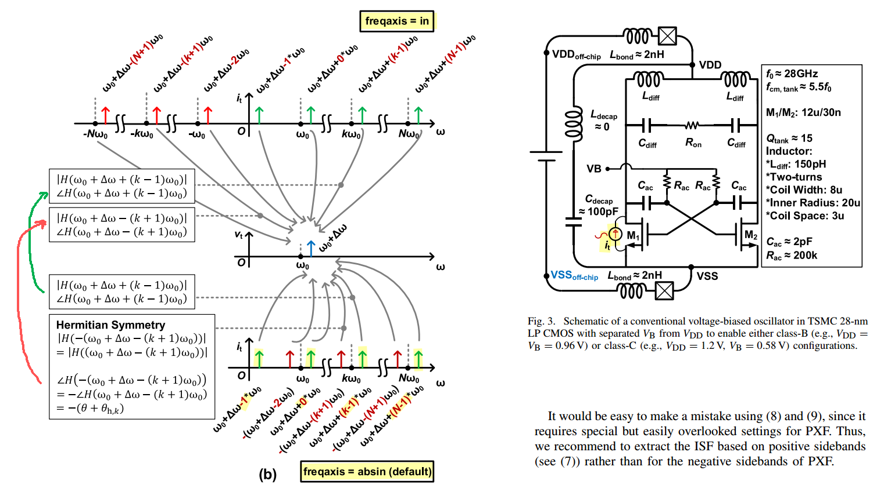

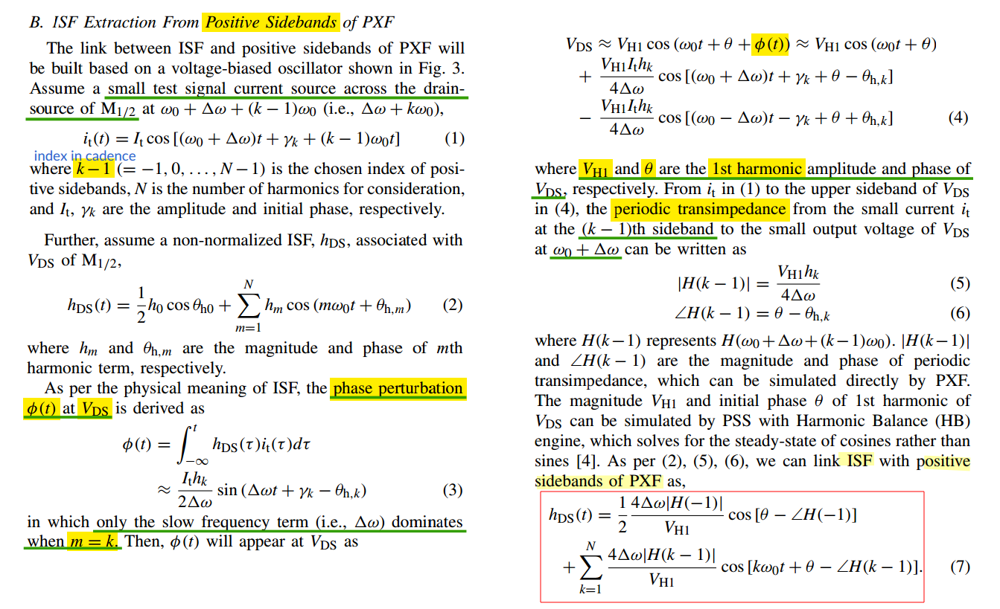

- **`freqaxis=in`**

  PXF preserves the signed input-frequency axis. Therefore, both positive- and negative-frequency input sidebands can be used directly to extract the ISF

- **`freqaxis=absin`** (default)

  Positive sidebands can be used directly. For negative sidebands, the PXF result corresponds to the Hermitian-symmetric positive-frequency response and must first be complex-conjugated; equivalently, retain its magnitude and reverse its phase


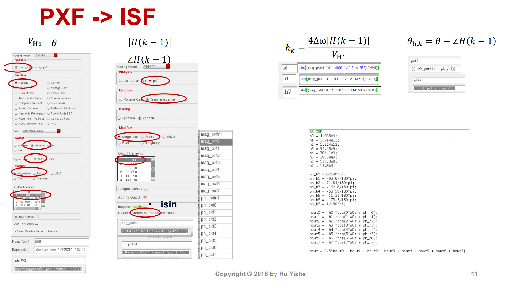

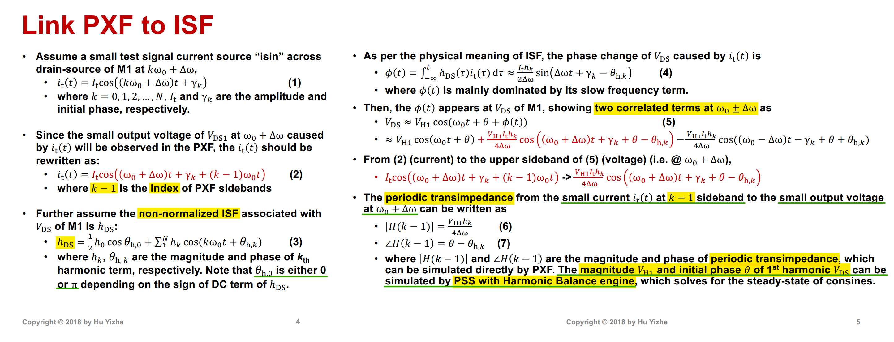


----

time reference between tran simulation and pss/pxf is different, that's why `circshift` is used.

```matlab
ISF_Tran2 = interp1(time_Tran,-ISF_Tran{:,2},t);

plot(t/1e-9,circshift(ISF_Tran2,633),'--','LineWidth',3)
```

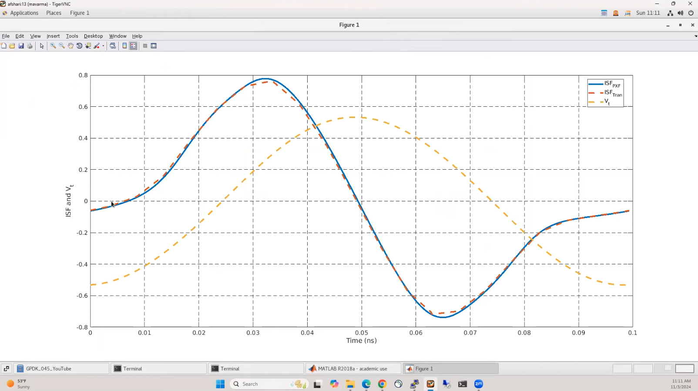


---
---

***Complex Derivation of PXF from ISF***

**credits to chatgpt**

Using a complex exponential representation gives the same result as the cosine derivation in the slides, provided the Fourier coefficient conventions are handled consistently.

**1. Test Current**

Instead of

$$
i_t(t)=I_t\cos\!\left((k\omega_0+\Delta\omega)t+\gamma_k\right),
$$

use the analytic signal

$$
\tilde{i}_t(t)
=
I_t e^{j[(k\omega_0+\Delta\omega)t+\gamma_k]}.
$$

**2. Complex Fourier Series of ISF**

The slide defines the real ISF as

$$
h_{DS}(t)
=
\frac12 h_0\cos\theta_0
+
\sum_{m=1}^{\infty}
h_m\cos(m\omega_0t+\theta_{h,m}).
$$

Expressing it as a complex Fourier series,

$$
h_{DS}(t)
=
\sum_{m=-\infty}^{\infty}
H_m e^{jm\omega_0t},
$$

gives

$$
H_{\pm m}
=
\frac{h_m}{2}
e^{\pm j\theta_{h,m}}.
$$

Hence

$$
H_{-k}
=
\frac{h_k}{2}
e^{-j\theta_{h,k}}.
$$

**3. Phase Perturbation**

The phase perturbation is

$$
\phi(t)
=
\int h_{DS}(t)i_t(t)\,dt.
$$

Substituting the Fourier series,

$$
\phi(t)
=
I_t
\sum_m
\frac{H_m}
{j[(m+k)\omega_0+\Delta\omega]}
e^{j[(m+k)\omega_0+\Delta\omega]t}.
$$

Only the slowly varying term contributes significantly, so choose

$$
m=-k,
$$

which yields

$$
\boxed{
\phi(t)
=
\frac{I_tH_{-k}}
{j\Delta\omega}
e^{j(\Delta\omega t+\gamma_k)}.
}
$$

**4. Oscillator Voltage**

Represent the oscillator voltage as

$$
V_{DS}
=
V_{H1}
e^{j(\omega_0t+\phi(t))}.
$$

Using the small-angle approximation,

$$
e^{j\phi}\approx1+j\phi,
$$

gives

$$
V_{DS}
\approx
V_{H1}e^{j\omega_0t}
+
\frac{V_{H1}I_tH_{-k}}
{\Delta\omega}
e^{j(\omega_0+\Delta\omega)t}.
$$

Therefore,

$$
\boxed{
H_{\mathrm{PXF}}
=
\frac{V_{H1}}{\Delta\omega}
H_{-k}.
}
$$

**5. Relation to the Slide**

The fundamental drain voltage is

$$
v_{DS}(t)
=
V_{h1}\cos(\omega_0t+\theta),
$$

whose complex coefficient is

$$
\boxed{
V_{H1}
=
\frac{V_{h1}}{2}
e^{j\theta}.
}
$$

Since

$$
H_{-k}
=
\frac{h_k}{2}
e^{-j\theta_{h,k}},
$$

we obtain

$$
H_{\mathrm{PXF}}
=
\frac{V_{h1}}{2\Delta\omega}
\cdot
\frac{h_k}{2}
e^{j(\theta-\theta_{h,k})}
=
\frac{V_{h1}h_k}
{4\Delta\omega}
e^{j(\theta-\theta_{h,k})}.
$$

Thus

$$
\boxed{
|H_{\mathrm{PXF}}|
=
\frac{V_{h1}h_k}
{4\Delta\omega}
}
$$

and

$$
\boxed{
\angle H_{\mathrm{PXF}}
=
\theta-\theta_{h,k}.
}
$$

These are exactly Eqs. (6) and (7) in the slide.

**Conclusion**

The complex-exponential derivation is algebraically simpler than the cosine derivation. The only subtlety is the Fourier-series convention:

- Positive-frequency coefficient of a cosine:
  $$
  H_k=\frac{h_k}{2}e^{j\theta_{h,k}}.
  $$

- Fundamental voltage phasor:
  $$
  V_{H1}=\frac{V_{h1}}{2}e^{j\theta}.
  $$

Accounting for these \(1/2\) factors yields the identical PXF expression derived in the slides.


### PPV from PSS inbuilt solver

> Aditya Varma Muppala, Fast Simulation of ISF and PPV using PSS and PXF in Cadence | Oscillators 12 | MMIC 19 [[https://youtu.be/Lu6VEWEEdxo](https://youtu.be/Lu6VEWEEdxo)]

*TODO* &#128197;


### effective ISF

***thermal noise*** with **NMF**

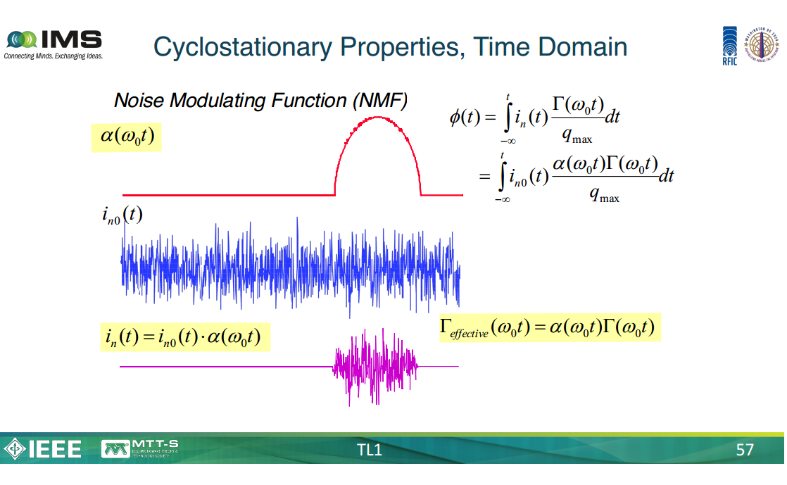

***source-specific ISF + its NMF***


---

---


***flicker noise*** with ***effective non-normalized ISF***

> Y. Hu, T. Siriburanon and R. B. Staszewski, "A Low-Flicker-Noise 30-GHz Class-F23 Oscillator in 28-nm CMOS Using Implicit Resonance and Explicit Common-Mode Return Path," in *IEEE Journal of Solid-State Circuits*, vol. 53, no. 7, pp. 1977-1987, July 2018 [[https://ieeexplore.ieee.org/stamp/stamp.jsp?tp=&arnumber=8345650](https://ieeexplore.ieee.org/stamp/stamp.jsp?tp=&arnumber=8345650)]

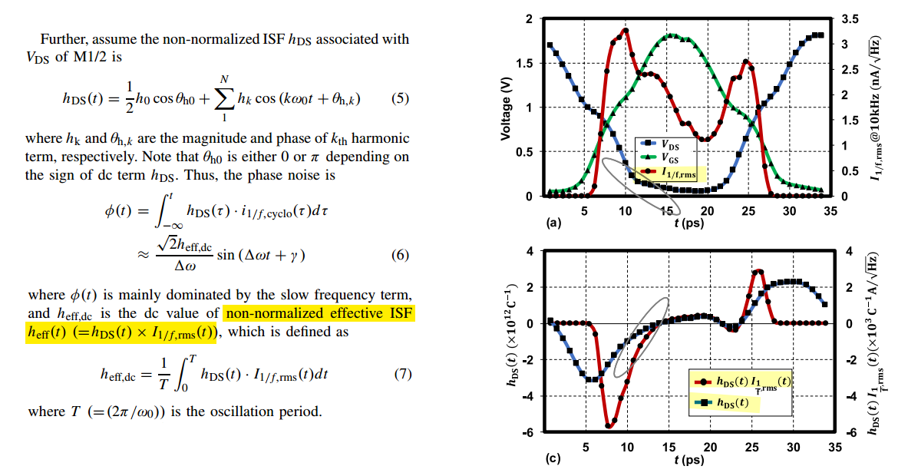


> M. Shahmohammadi, M. Babaie and R. B. Staszewski, "A 1/f Noise Upconversion Reduction Technique for Voltage-Biased RF CMOS Oscillators," in IEEE Journal of Solid-State Circuits, vol. 51, no. 11, pp. 2610-2624, Nov. 2016 [[https://pure.tudelft.nl/ws/portalfiles/portal/30880387/07571191.pdf](https://pure.tudelft.nl/ws/portalfiles/portal/30880387/07571191.pdf)]
>

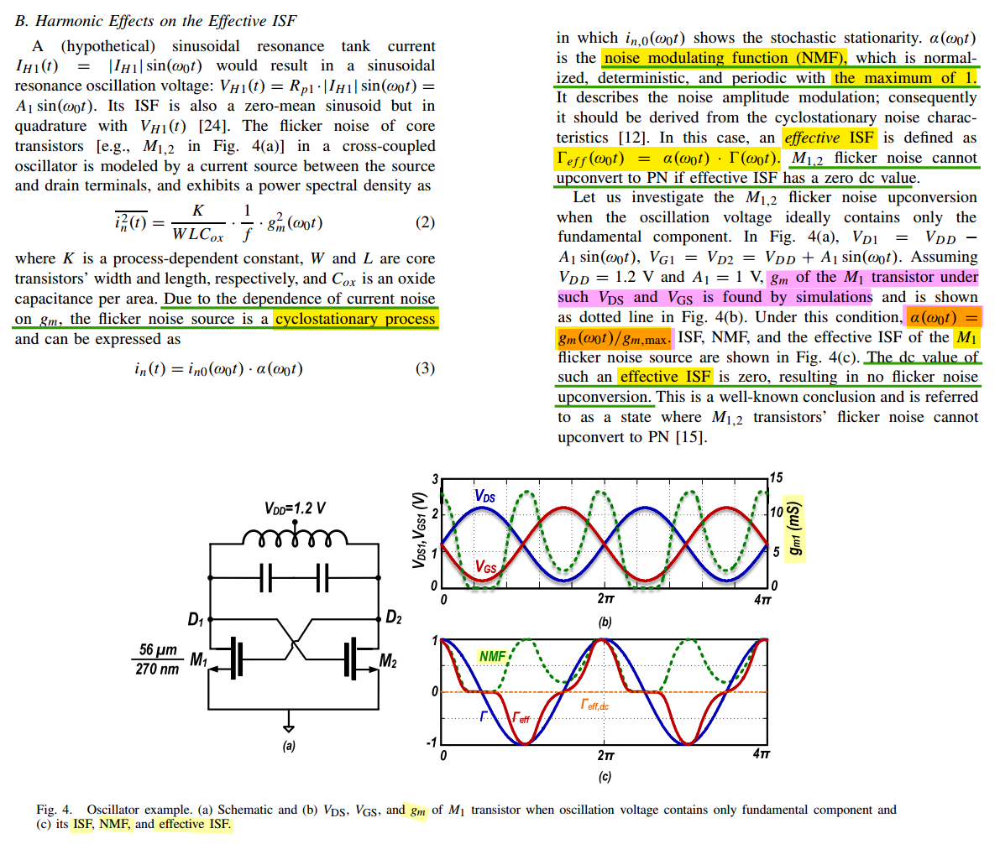


## flicker noise upconversion

> Y. Hu, T. Siriburanon and R. B. Staszewski, "A Low-Flicker-Noise 30-GHz Class-F23 Oscillator in 28-nm CMOS Using Implicit Resonance and Explicit Common-Mode Return Path," in *IEEE Journal of Solid-State Circuits*, vol. 53, no. 7, pp. 1977-1987, July 2018 [[https://ieeexplore.ieee.org/stamp/stamp.jsp?tp=&arnumber=8345650](https://ieeexplore.ieee.org/stamp/stamp.jsp?tp=&arnumber=8345650)]
>
> —, "Intuitive Understanding of Flicker Noise Reduction via Narrowing of Conduction Angle in Voltage-Biased Oscillators," in IEEE Transactions on Circuits and Systems II: Express Briefs, vol. 66, no. 12, pp. 1962-1966, Dec. 2019 [[https://sci-hub.se/10.1109/TCSII.2019.2896483](https://sci-hub.se/10.1109/TCSII.2019.2896483)]
>
> —, "Oscillator Flicker Phase Noise: A Tutorial," in *IEEE Transactions on Circuits and Systems II: Express Briefs*, vol. 68, no. 2, pp. 538-544, Feb. 2021 [[paper](https://ieeexplore.ieee.org/stamp/stamp.jsp?tp=&arnumber=9286468)] [[slides](https://www.researchgate.net/publication/352173342_Oscillator_Flicker_Phase_Noise_A_Tutorial)]


### Flicker Noise Formulations in Compact Models

> G. J. Coram, C. C. McAndrew, K. K. Gullapalli and K. S. Kundert, "Flicker Noise Formulations in Compact Models," in *IEEE Transactions on Computer-Aided Design of Integrated Circuits and Systems*, vol. 39, no. 10, pp. 2812-2821, Oct. 2020 [[https://kenkundert.com/docs/tcad20-flicker-noise.pdf](https://kenkundert.com/docs/tcad20-flicker-noise.pdf)],[[https://github.com/KenKundert/flicker-noise](https://github.com/KenKundert/flicker-noise)]
>
> BSIM4v4.7 MOSFET Model -User's Manual [[https://class.ece.iastate.edu/djchen/ee501/BSIM470_Manual.pdf](https://class.ece.iastate.edu/djchen/ee501/BSIM470_Manual.pdf)]


### flicker noise in circuit-noise analysis

its power spectral density is approximately
$$
S_{i,1/f}(f)=\frac{K}{|f|}.
$$
**A large amount of its power lies at low frequencies.** Therefore, compared with a GHz oscillation period $T_0$, the flicker-noise value changes very little during one cycle.

For a flicker-noise component at frequency $f_m$,
$$
f_m T_0\ll 1
$$
implies
$$
i_{1/f}(t+T_0)\approx i_{1/f}(t).
$$
Thus, if the noise current is positive at $t_0$, it will probably remain positive throughout the following oscillator cycle:
$$
i_{1/f}(t_0+\tau)\approx i_{1/f}(t_0),
\qquad 0\leq \tau<T_0.
$$
In circuit-noise analysis, the underlying flicker-noise source is commonly treated as approximately **wide-sense stationary**:
$$
R_x(t_1,t_2)=R_x(t_1-t_2).
$$
This is reasonable when the device bias is constant and the measurement interval is finite.

The phase perturbations may cancel or leave a nonzero residual:
$$
\Delta\phi_{\text{cycle}}
\propto
\int_{0}^{T_0}
\Gamma(\omega_0 t)\,
i_{1/f,\mathrm{cyclo}}(t)\,dt.
$$
Since the low-frequency noise is almost constant over $T_0$,
$$
\Delta\phi_{\text{cycle}}
\approx
x_{1/f}(t_0)
\int_{0}^{T_0}
\Gamma(\omega_0 t)a(t)\,dt
$$
Therefore, flicker-noise upconversion depends on whether the phase-delay and phase-advance contributions cancel over one period. A nonzero weighted average produces low-frequency fluctuations in oscillator frequency, which commonly appear as the $1/f^3$ phase-noise region.

Define

$$
\Gamma_{\mathrm{eff,DC}}\equiv \frac{1}{T_0}\int_0^{T_0}\Gamma(\omega_0t)a(t)\,dt
$$

Then
$$
\Delta\phi_{\text{cycle}}
\approx
\frac{x_{1/f}(t_0)}{q_{\max}}
\Gamma_{\mathrm{eff,DC}}T_0.
$$
If $x_{1/f}$ is already normalized by $q_{\max}$, the $1/q_{\max}$ factor can be omitted.

Therefore,
$$
\boxed{\Gamma_{\mathrm{eff,DC}}=0
\quad\Longrightarrow\quad
\Delta\phi_{\text{cycle}}\approx 0}
$$
for quasistatic flicker noise. Physically, the phase-delay contribution on one edge exactly cancels the phase-advance contribution on the other edge.nce,
$$
\boxed{
\Gamma_{\mathrm{eff,DC}}=0
\Rightarrow
\text{no first-order direct }1/f\text{-to-}1/f^3
\text{ phase-noise upconversion from that source.}
}
$$


## Mathematical Preliminaries

> Jiří Lebl. **Notes on Diffy Qs: Differential Equations for Engineers** [[link](https://www.jirka.org/diffyqs/)]
>
> Matt Charnley. **Differential Equations: An Introduction for Engineers** [[link](https://sites.rutgers.edu/matthew-charnley/course-materials/differential-equations-an-introduction-for-engineers/)]
>
> Åström, K.J. & Murray, Richard. (2021). **Feedback Systems: An Introduction for Scientists and Engineers Second Edition** [[https://www.cds.caltech.edu/~murray/books/AM08/pdf/fbs-public_24Jul2020.pdf](https://www.cds.caltech.edu/~murray/books/AM08/pdf/fbs-public_24Jul2020.pdf)]
>
> Strogatz, S.H. (2015). **Nonlinear Dynamics and Chaos: With Applications to Physics, Biology, Chemistry, and Engineering (2nd ed.)**. CRC Press [[https://www.biodyn.ro/course/literatura/Nonlinear_Dynamics_and_Chaos_2018_Steven_H._Strogatz.pdf](https://www.biodyn.ro/course/literatura/Nonlinear_Dynamics_and_Chaos_2018_Steven_H._Strogatz.pdf)]
>
> Godone, A. & Micalizio, Salvatore & Levi, Filippo. (2008). RF spectrum of a carrier with a random phase modulation of arbitrary slope. [[https://sci-hub.se/10.1088/0026-1394/45/3/008](https://sci-hub.se/10.1088/0026-1394/45/3/008)]


## References

Jun Yin. ISSCC 2025 T10: mm-Wave Oscillator Design

Pietro Andreani. ISSCC 2011 T1: Integrated LC oscillators

—. ISSCC 2017 F2: Integrated Harmonic Oscillators

—. SSCS Distinguished Lecture: RF Harmonic Oscillators Integrated in Silicon Technologies [[https://www.ieeetoronto.ca/wp-content/uploads/2020/06/DL-Toronto.pdf](https://www.ieeetoronto.ca/wp-content/uploads/2020/06/DL-Toronto.pdf)]

—. ESSCIRC 2019 Tutorials: RF Harmonic Oscillators Integrated in Silicon Technologies [[https://youtu.be/k1I9nP9eEHE](https://youtu.be/k1I9nP9eEHE)]

—. "Harmonic Oscillators in CMOS—A Tutorial Overview," in IEEE Open Journal of the Solid-State Circuits Society, vol. 1, pp. 2-17, 2021 [[pdf](https://ieeexplore.ieee.org/stamp/stamp.jsp?tp=&arnumber=9530265)]

C. Samori, ISSCC2016 T1 "Tutorial: Understanding Phase Noise in LC VCOs"

—, "Understanding Phase Noise in LC VCOs: A Key Problem in RF Integrated Circuits," in *IEEE Solid-State Circuits Magazine*, vol. 8, no. 4, pp. 81-91, Fall 2016 [[https://sci-hub.ru/10.1109/MSSC.2016.2573979](https://sci-hub.ru/10.1109/MSSC.2016.2573979)]

—, Phase Noise in LC Oscillators: From Basic Concepts to Advanced Topologies [[https://www.ieeetoronto.ca/wp-content/uploads/2020/06/DL-VCO-short.pdf](https://www.ieeetoronto.ca/wp-content/uploads/2020/06/DL-VCO-short.pdf)]

A. Hajimiri, RFIC2024 "Noise in Oscillators from Understanding to Design"

Antonio Liscidini, ESSCIRC 2019 Tutorials: Phase Noise in Wireless Applications [[https://youtu.be/nGmQ0JdoSE4](https://youtu.be/nGmQ0JdoSE4)]

Aditya Varma Muppala. Oscillators [[https://youtube.com/playlist?list=PL9Trid0A4Da2fOmYTEjhAnUkGPxyiH7H6&si](https://youtube.com/playlist?list=PL9Trid0A4Da2fOmYTEjhAnUkGPxyiH7H6)]

P.E. Allen - 2003. ECE 6440 - Frequency Synthesizers: Lecture 160 – Phase Noise - II [[https://pallen.ece.gatech.edu/Academic/ECE_6440/Summer_2003/L160-PhNoII(2UP).pdf](https://pallen.ece.gatech.edu/Academic/ECE_6440/Summer_2003/L160-PhNoII(2UP).pdf)]

Jaeha Kim. Lecture 8. Special Topics: Design Trade -Offs in LC -Tuned Oscillators

---

---

Lacaita, Andrea Leonardo, Salvatore Levantino, and Carlo Samori. *Integrated frequency synthesizers for wireless systems*. Cambridge University Press, 2007.

Darabi H. Radio Frequency Integrated Circuits and Systems. 2nd ed. Cambridge University Press; 2020.

Hegazi, Emad, Asad Abidi, and Jacob Rael. *The Designer's Guide to High-purity Oscillators*. [New York]: Kluwer Academic Publishers, 2005. *The Designer's Guide to High-Purity Oscillators*

Bae, Woorham, and Deog-Kyoon Jeong. *Analysis and Design of CMOS Clocking Circuits for Low Phase Noise*. Institution of Engineering and Technology, 2020.

M. Babaie, M. Shahmohammadi, R. B. Staszewski, (2019) "RF CMOS Oscillators for Modern Wireless Applications" River Publishers [[https://www.riverpublishers.com/pdf/ebook/RP_E9788793609488.pdf](https://www.riverpublishers.com/pdf/ebook/RP_E9788793609488.pdf)]


