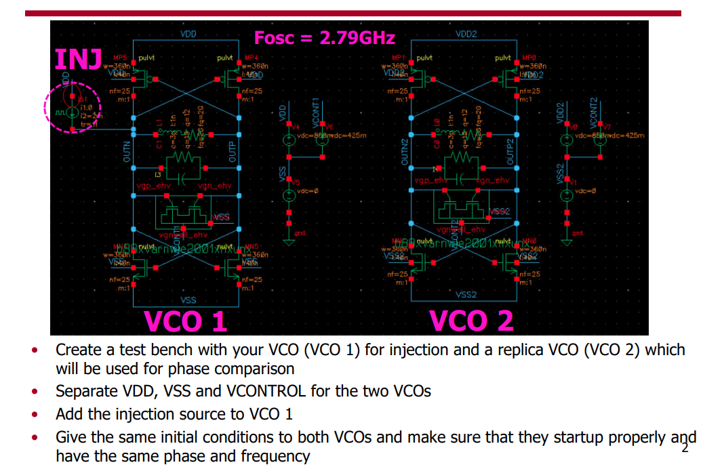

## Integration Limits

> Y. Zhao and B. Razavi, "Phase Noise Integration Limits for Jitter Calculation,"[[https://www.seas.ucla.edu/brweb/papers/Conferences/YZ_ISCAS_22.pdf](https://www.seas.ucla.edu/brweb/papers/Conferences/YZ_ISCAS_22.pdf)]

*TODO* &#128197;


## VCO ISF Simulation

### PSS + PXF Method

> Yizhe Hu, "A Simulation Technique of Impulse Sensitivity Function (ISF) Based on Periodic Transfer Function (PXF)" [[https://bbs.eetop.cn/thread-869343-1-1.html](https://bbs.eetop.cn/thread-869343-1-1.html)]


*TODO* &#128197;


### Transient Method

> David Dolt. ECEN 620 Network Theory - Broadband Circuit Design: "VCO ISF Simulation" [[https://people.engr.tamu.edu/spalermo/ecen620/ISF_SIM.pdf](https://people.engr.tamu.edu/spalermo/ecen620/ISF_SIM.pdf)]





> To compare the ring oscillator and VCO the **total injected charge** to both should be the **same**


## Spurs

> Timing 101 #6: The Case of the Spurious Phase Noise, Silicon Labs,  [[Part I](https://community.silabs.com/s/share/a5U1M000000knzQUAQ/timing-101-6-the-case-of-the-spurious-phase-noise-part-i)], [[Part II](https://community.silabs.com/s/share/a5U1M000000knzQUAQ/timing-101-6-the-case-of-the-spurious-phase-noise-part-i?language=en_US)], [[Part III](https://community.silabs.com/s/share/a5U1M000000ko4DUAQ/timing-201-2-the-case-of-the-phase-noise-that-wasnt-part-2?language=en_US)]
>
> W. Rhee, "Design of high-performance CMOS charge pumps in phase-locked loops," *1999 IEEE International Symposium on Circuits and Systems (ISCAS)*, Orlando, FL, USA, 1999, pp. 545-548 vol.2 [[https://citeseerx.ist.psu.edu/document?repid=rep1&type=pdf&doi=3006edc15fdef2e71674d4170c10c62fd69f96a3](https://citeseerx.ist.psu.edu/document?repid=rep1&type=pdf&doi=3006edc15fdef2e71674d4170c10c62fd69f96a3)]
>
> Rhee, W. and Yu, Z., 2024. *Phase-Locked Loops: System Perspectives and Circuit Design Aspects*. John Wiley & Sons.
>
> H. -G. Ko, W. Bae, G. -S. Jeong and D. -K. Jeong, "Reference Spur Reduction Techniques for a Phase-Locked Loop," in *IEEE Access*, vol. 7, pp. 38035-38043, 2019 [[https://ieeexplore.ieee.org/stamp/stamp.jsp?tp=&arnumber=8671476](https://ieeexplore.ieee.org/stamp/stamp.jsp?tp=&arnumber=8671476)]
>
> Mike Shuo-Wei Chen, CICC2020 ES 2-3: "Low-Spur PLL Architectures and Techniques"
>
> Saurabh Saxena, Problems in Charge Pump PLL - Reference Spur [[https://youtu.be/IcJOZAh9a1w?si=ehJ3ox90wN46_KMb](https://youtu.be/IcJOZAh9a1w?si=ehJ3ox90wN46_KMb)]
>
> Chembiyan TChembiyan T, PLLs and reference spurs. [[https://www.linkedin.com/posts/chembiyan-t-0b34b910_pll-rfdesign-circuits-activity-7111435571448713216-9jng?utm_source=share&utm_medium=member_desktop](https://www.linkedin.com/posts/chembiyan-t-0b34b910_pll-rfdesign-circuits-activity-7111435571448713216-9jng?utm_source=share&utm_medium=member_desktop)]


**spurs** are carrier or clock frequency spectral imperfections measured in the frequency domain just like phase noise. However, unlike phase noise they are *discrete* frequency components.

- Spurs are deterministic.

- Spur power is independent of bandwidth.

- Spurs contribute bounded peak jitter in the time domain.


***Sources of Spurs:***

- External (coupling from other noisy block)
  Supply, substrate, bond wires, etc.
- Internal (int-N/fractional-N operation)
  - **Frac spur**: Fractional divider (multi-modulus and frequency accumulation)
  - **Ref. spur**: PFD/charge pump/analog loop filter non-idealities, clock coupling


### reference spurs

*TODO* &#128197;


### charge pump mismatch

Matching of the CP currents is also a critical part of PLL design. Leakage and mismatch in the CP will lead to *deterministic jitter* on the PLL output

Any difference between the charging and discharging currents can cause static phase offset as well as *dynamic jitter*, known as **reference spur**


peak2peak deterministic jitter
$$
\text{DJ}_\text{PP} = \frac{\phi_{PP}}{2\pi}T_{osc}
$$


```matlab
kvco = 1e9;
Icp = 600e-6;
deltaI_Icp = 3e-2;
deltaI = deltaI_Icp*Icp;
ton = 100e-12;
C2 =0.5e-12;
Tosc = 1/15e9;

DJpp = kvco*deltaI*ton^2/(2*C2)*(deltaI_Icp + 1)*Tosc
```


## reference

A. Hajimiri and T. H. Lee, "A general theory of phase noise in electrical oscillators," in *IEEE Journal of Solid-State Circuits*, vol. 33, no. 2, pp. 179-194, Feb. 1998 [[paper](https://people.engr.tamu.edu/spalermo/ecen620/general_pn_theory_hajimiri_jssc_1998.pdf)], [[slides](http://www-smirc.stanford.edu/papers/Orals98s-ali.pdf)]

—, "Corrections to "A General Theory of Phase Noise in Electrical Oscillators"" [[https://ieeexplore.ieee.org/stamp/stamp.jsp?arnumber=678662](https://ieeexplore.ieee.org/stamp/stamp.jsp?arnumber=678662)]

—, RFIC2024 "Noise in Oscillators from Understanding to Design"

Carlo Samori, "Phase Noise in LC Oscillators: From Basic Concepts to Advanced Topologies" [[https://www.ieeetoronto.ca/wp-content/uploads/2020/06/DL-VCO-short.pdf](https://www.ieeetoronto.ca/wp-content/uploads/2020/06/DL-VCO-short.pdf)]

C. Samori, "Understanding Phase Noise in LC VCOs: A Key Problem in RF Integrated Circuits," in *IEEE Solid-State Circuits Magazine*, vol. 8, no. 4, pp. 81-91, Fall 2016 [[https://picture.iczhiku.com/resource/eetop/whIgTikLswaaTVBv.pdf](https://picture.iczhiku.com/resource/eetop/whIgTikLswaaTVBv.pdf)]

—, ISSCC2016, "Understanding Phase Noise in LC VCOs"

F. L. Traversa, M. Bonnin and F. Bonani, "The Complex World of Oscillator Noise: Modern Approaches to Oscillator (Phase and Amplitude) Noise Analysis," in *IEEE Microwave Magazine*, vol. 22, no. 7, pp. 24-32, July 2021 [[https://iris.polito.it/retrieve/handle/11583/2903596/e384c433-b8f5-d4b2-e053-9f05fe0a1d67/MM%20noise%20-%20v5.pdf](https://iris.polito.it/retrieve/handle/11583/2903596/e384c433-b8f5-d4b2-e053-9f05fe0a1d67/MM%20noise%20-%20v5.pdf)]

Poddar, Ajay & Rohde, Ulrich & Apte, Anisha. (2013). How Low Can They Go?: Oscillator Phase Noise Model, Theoretical, Experimental Validation, and Phase Noise Measurements. Microwave Magazine, IEEE. [[http://time.kinali.ch/rohde/noise/how_low_can_they_go-2013-poddar_rohde_apte.pdf](http://time.kinali.ch/rohde/noise/how_low_can_they_go-2013-poddar_rohde_apte.pdf)]

Pietro Andreani, "RF Harmonic Oscillators Integrated in Silicon Technologies" [[https://www.ieeetoronto.ca/wp-content/uploads/2020/06/DL-Toronto.pdf](https://www.ieeetoronto.ca/wp-content/uploads/2020/06/DL-Toronto.pdf)]

Chembiyan T, "Brownian Motion And The Oscillator Phase Noise" [[link](https://www.linkedin.com/posts/chembiyan-t-0b34b910_vco-perturbed-by-a-brownian-motion-activity-6994691057045159936-nqaN?utm_source=share&utm_medium=member_desktop)]

—, "Jitter and Phase Noise in Oscillators" [[link](https://www.linkedin.com/posts/chembiyan-t-0b34b910_jitter-and-phase-noise-activity-7028431979649929216-KsZw?utm_source=share&utm_medium=member_desktop)]

—, "Jitter and Phase Noise in Phase Locked Loops" [[link](https://www.linkedin.com/posts/chembiyan-t-0b34b910_jitter-and-phase-noise-activity-7031985595304345600-uSx3?utm_source=share&utm_medium=member_desktop)]

—, "PLLs and reference spurs" [[link](https://www.linkedin.com/posts/chembiyan-t-0b34b910_pll-rfdesign-circuits-activity-7111435571448713216-9jng?utm_source=share&utm_medium=member_desktop)]

