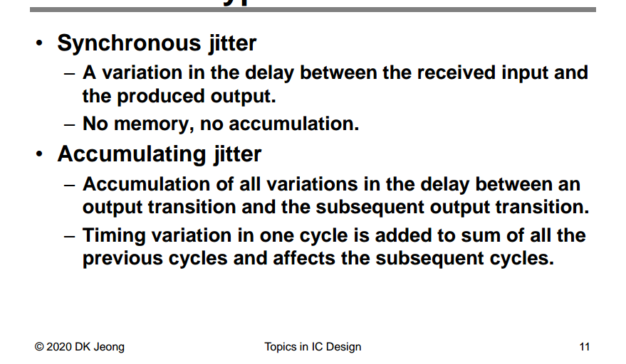

## Phase Noise Definition

> Eq. (3.25) is widely adopted by industry and academia

> *using the narrow angle assumption*, the two definitions above are equivalent
>
> If the *narrow angle* condition is not satisfied, however, the two definitions differ

## PM vs. FM jitter

> Deog-Kyoon Jeong. Topics in IC Design: 1.1 Introduction to Jitter [[https://ocw.snu.ac.kr/sites/default/files/NOTE/Lec%201%20-%20Jitter%20and%20Phase%20Noise.pdf](https://ocw.snu.ac.kr/sites/default/files/NOTE/Lec%201%20-%20Jitter%20and%20Phase%20Noise.pdf)]

## Phase Noise Profile

> Power Spectral Density of Brownian Motion despite non-stationary [[https://dsp.stackexchange.com/a/75043/59253](https://dsp.stackexchange.com/a/75043/59253)]

### white noise

$1/f^2$ Phase Noise Profile

> 

---

> Sudhakar Pamarti. CICC 2020 ES2-2: Basics of Closed- and Open-Loop Fractional Frequency Synthesis [[https://youtu.be/t1TY-D95CY8?si=tbav3J2yag38HyZx](https://youtu.be/t1TY-D95CY8?si=tbav3J2yag38HyZx)]

### flicker noise

$1/f^3$ Phase Noise Profile

$$
S_{\phi n} = \frac{K}{f}\left(\frac{K_{VCO}}{2\pi f}\right)^2 \propto \frac{1}{f^3}
$$

---

> [[https://dsp.stackexchange.com/a/75152/59253](https://dsp.stackexchange.com/a/75152/59253)]

## Free-running Oscillator

> Note that $f_{min}$ is related to the observation time. The longer we observe the device under test, the smaller $f_{min}$ must be

---

---

> Ali Sheikholeslami ISSCC 2008 T5: Basics of Chip-to-Chip and Backplane Signaling [[https://www.nishanchettri.com/isscc-slides/2008%20ISSCC/Tutorials/T10_Pres.pdf](https://www.nishanchettri.com/isscc-slides/2008%20ISSCC/Tutorials/T10_Pres.pdf)]

---

> B. Casper and F. O'Mahony, "Clocking Analysis, Implementation and Measurement Techniques for High-Speed Data Links-A Tutorial," in IEEE Transactions on Circuits and Systems I. [[https://people.engr.tamu.edu/spalermo/ecen689/clocking_analysis_hs_links_casper_tcas1_2009.pdf](https://people.engr.tamu.edu/spalermo/ecen689/clocking_analysis_hs_links_casper_tcas1_2009.pdf)]

## Lorentzian spectrum 

We typically use the two spectra, $S_{\phi n}(f)$ and $S_{out}(f)$, interchangeably, but we must resolve these inconsistencies. **voltage spectrum**  is called **Lorentzian spectrum**

---

The periodic signal $x(t)$ can be expanded in Fourier series as:

Assume that the signal is subject to *excess phase noise*, which is modeled by adding a **time-dependent** noise component $\alpha(t)$. The noisy signal can be written $x(t+\alpha(t))$, the added excess phase $\phi(t)= \frac{\alpha(t)}{\omega_0}$

> 

The autocorrelation of the noisy signal is by definition:

The *autocorrelation averaged over time* results in:

By taking the Fourier transform of the autocorrelation, the spectrum of the signal $x(t + \alpha(t))$​ can be expressed as

It is also interesting to note how the integral in *Equation 9.80* around each harmonic is equal to the power of the harmonic itself $|X_n|^2$

The integral $S_x(f)$ around harmonic is
$$\begin{align}
P_{x,n} &= \int_{f=-\infty}^{\infty} |X_n|^2\frac{\omega_0^2n^2c}{\frac{1}{4}\omega_0^4n^4c^2+(\omega +n\omega_0)^2}df \\
&= |X_n|^2\int_{\Delta f=-\infty}^{\infty}\frac{2\beta}{\beta^2+(2\pi\cdot\Delta f)^2}d\Delta f \\
&= |X_n|^2\frac{1}{\pi}\arctan(\frac{2\pi \Delta f}{\beta})|_{-\infty}^{\infty} \\
&= |X_n|^2
\end{align}$$

***The phase noise does not affect the total power in the signal, it only affects its distribution***

- Without phase noise, $S_v(f)$ is a series of impulse functions at the harmonics of $f_o$. 
- With phase noise, the impulse functions spread, becoming fatter and shorter but retaining the *same total power*

> 
>
> [[https://community.cadence.com/cadence_technology_forums/f/rf-design/51484/comparing-transient-noise-pnoise-and-pnoise-with-lorentian-approximation-of-a-ring-oscillator/1382911](https://community.cadence.com/cadence_technology_forums/f/rf-design/51484/comparing-transient-noise-pnoise-and-pnoise-with-lorentian-approximation-of-a-ring-oscillator/1382911)]

---

## Phase perturbed by a stationary noise with Gaussian PDF

---

If keep $\phi_{rms}$ in $R_x(\tau)$, i.e.
$$
R_x(\tau)=\frac{A^2}{2}e^{-\phi_{rms}^2}\cos(2\pi f_0 \tau)e^{R_\phi(\tau)}\approx \frac{A^2}{2}e^{-\phi_{rms}^2}\cos(2\pi f_0 \tau)(1+R_\phi(\tau))
$$
The PSD of the signal is
$$
S_x(f) = \mathcal{F} \{ R_x(\tau) \} = \frac{P_c}{2}e^{-\phi_{rms}^2}\left[S_\phi(f+f_0)+S_\phi(f-f_0)\right] + \frac{P_c}{2}e^{-\phi_{rms}^2}\left[\delta(f+f_0)+\delta(f-f_0)\right]
$$
&#10071;&#10071;above Eq **isn't** consistent with stationary white noise process - the following section

## Phase perturbed by a stationary WHITE noise process

Assuming that the delay line is *noiseless*

---

Expanding the cosine function we get
$$\begin{align}
R_y(t,\tau) &= \frac{A^2}{2}\left\{\cos(2\pi f_0\tau)E[\cos(\phi(t)-\phi(t-\tau))] - \sin(2\pi f_0\tau)E[\sin(\phi(t)-\phi(t-\tau))]\right\} \\
&+ \frac{A^2}{2}\left\{\cos(4\pi f_0(t+\tau/2-T_D))E[\cos(\phi(t)+\phi(t-\tau))] - \sin(4\pi f_0(t+\tau/2-T_D))E[\sin(\phi(t)+\phi(t-\tau))] \right\}
\end{align}$$

where, both the process $\phi(t)-\phi(t-\tau)$ and $\phi(t)+\phi(t-\tau)$ are independent of time $t$, i.e. $E[\cos(\phi(t)+\phi(t-\tau))] = m_{\cos+}(\tau)$, $E[\cos(\phi(t)-\phi(t-\tau))] = m_{\cos-}(\tau)$,  $E[\sin(\phi(t)+\phi(t-\tau))] = m_{\sin+}(\tau)$ and  $E[\sin(\phi(t)-\phi(t-\tau))] = m_{\sin-}(\tau)$

we obtain
$$\begin{align}
R_y(t,\tau) &= \frac{A^2}{2}\left\{\cos(2\pi f_0\tau)m_{\cos-}(\tau) - \sin(2\pi f_0\tau)m_{\sin-}(\tau)\right\} \\
&+ \frac{A^2}{2}\left\{\cos(4\pi f_0(t+\tau/2-T_D))m_{\cos+}(\tau) - \sin(4\pi f_0(t+\tau/2-T_D))m_{\sin+}(\tau) \right\}
\end{align}$$

The second term in the above expression is periodic in $t$ and to estimate its PSD, we compute the ***time-averaged* autocorrelation function**
$$
R_y(\tau) = \frac{A^2}{2}\left\{\cos(2\pi f_0\tau)m_{\cos-}(\tau) - \sin(2\pi f_0\tau)m_{\sin-}(\tau)\right\}
$$

After nontrivial derivation

---

> 

## Phase perturbed by a Weiner process

The phase process $\phi(t)$ is also gaussian but with *an increasing **variance** which grows **linearly** with time* $t$

$$\begin{align}
R_y(t,\tau) &= \frac{A^2}{2}\left\{\cos(2\pi f_0\tau)E[\cos(\phi(t)-\phi(t-\tau))] - \sin(2\pi f_0\tau)E[\sin(\phi(t)-\phi(t-\tau))]\right\} \\
&+ \frac{A^2}{2}\left\{\cos(4\pi f_0(t+\tau/2-T_D)E[\cos(\phi(t)+\phi(t-\tau))] - \sin(4\pi f_0(t+\tau/2-T_D)E[\sin(\phi(t)+\phi(t-\tau))] \right\}
\end{align}$$

**The spectrum of $y(t)$ is determined by the asymptotic behavior of $R_y(t,\tau)$ as $t\to \infty$**

> &#10071;&#10071; $\lim_{t\to\infty}R_y(t,\tau)$ rather than *time-averaged autocorrelation function* of cyclostationary process, ref. Demir's paper

We define $\zeta(t, \tau)=\phi(t)+\phi(t-\tau) = \phi(t)-\phi(t-\tau) + 2\phi(t-\tau)$, the expected value of $\zeta(t,\tau)$ is 0, the variance is $\sigma_{\zeta}^2=(k\sigma)^2(\tau + 4(t-\tau))=(k\sigma)^2(4t-3\tau)$
$$
E[\cos(\zeta(t,\tau))]=\frac{1}{\sqrt{2\pi \sigma_{\zeta}^2}}\int_{-\infty}^{\infty}e^{-\zeta^2/2\sigma_{\zeta}^2}\cos(\zeta)d\zeta = e^{-\sigma_{\zeta}^2/2}=e^{-(k\sigma)^2(4t-\tau)}
$$
i.e., $\lim _{t\to \infty} E[\cos(\zeta(t,\tau))] = \lim_{t\to \infty}e^{-(k\sigma)^2(4t-\tau)} = 0$

For $E[\sin(\zeta(t,\tau))]$, we have
$$
E[\sin(\zeta(t,\tau))] = \frac{1}{\sqrt{2\pi \sigma_{\zeta}^2}}\int_{-\infty}^{\infty}e^{-\zeta^2/2\sigma_{\zeta}^2}\sin(\zeta)d\zeta
$$
i.e., $E[\sin(\zeta(t,\tau))]$ is *odd function*, therefore $E[\sin(\zeta(t,\tau))]=0$

Finally, we obtain

---

## Amplitude Noise

>  P.E. Allen - 2003. ECE 6440 - Frequency Synthesizers: Lecture 160 – Phase Noise - II [[https://pallen.ece.gatech.edu/Academic/ECE_6440/Summer_2003/L160-PhNoII(2UP).pdf](https://pallen.ece.gatech.edu/Academic/ECE_6440/Summer_2003/L160-PhNoII(2UP).pdf)]

## reference

A. Hajimiri and T. H. Lee, "A general theory of phase noise in electrical oscillators," in *IEEE Journal of Solid-State Circuits*, vol. 33, no. 2, pp. 179-194, Feb. 1998 [[paper](https://people.engr.tamu.edu/spalermo/ecen620/general_pn_theory_hajimiri_jssc_1998.pdf)], [[slides](http://www-smirc.stanford.edu/papers/Orals98s-ali.pdf)]

—, "Corrections to "A General Theory of Phase Noise in Electrical Oscillators"" [[https://ieeexplore.ieee.org/stamp/stamp.jsp?arnumber=678662](https://ieeexplore.ieee.org/stamp/stamp.jsp?arnumber=678662)]

—, RFIC2024 "Noise in Oscillators from Understanding to Design"

Carlo Samori, "Phase Noise in LC Oscillators: From Basic Concepts to Advanced Topologies" [[https://www.ieeetoronto.ca/wp-content/uploads/2020/06/DL-VCO-short.pdf](https://www.ieeetoronto.ca/wp-content/uploads/2020/06/DL-VCO-short.pdf)]

—, "Understanding Phase Noise in LC VCOs: A Key Problem in RF Integrated Circuits," in *IEEE Solid-State Circuits Magazine*, vol. 8, no. 4, pp. 81-91, Fall 2016 [[https://picture.iczhiku.com/resource/eetop/whIgTikLswaaTVBv.pdf](https://picture.iczhiku.com/resource/eetop/whIgTikLswaaTVBv.pdf)]

—, ISSCC2016, "Understanding Phase Noise in LC VCOs"

Antonio Liscidini, ESSCIRC 2019 Tutorials: Phase Noise in Wireless Applications [[https://youtu.be/nGmQ0JdoSE4](https://youtu.be/nGmQ0JdoSE4)]

A. Demir, A. Mehrotra and J. Roychowdhury, "Phase noise in oscillators: a unifying theory and numerical methods for characterization," in *IEEE Transactions on Circuits and Systems I: Fundamental Theory and Applications*, vol. 47, no. 5, pp. 655-674, May 2000 [[https://sci-hub.se/10.1109/81.847872](https://sci-hub.se/10.1109/81.847872)]

Dalt, Nicola Da and Ali Sheikholeslami. "Understanding Jitter and Phase Noise: A Circuits and Systems Perspective." (2018) [[https://picture.iczhiku.com/resource/eetop/WykRGJJoHQLaSCMv.pdf](https://picture.iczhiku.com/resource/eetop/WykRGJJoHQLaSCMv.pdf)]

F. L. Traversa, M. Bonnin and F. Bonani, "The Complex World of Oscillator Noise: Modern Approaches to Oscillator (Phase and Amplitude) Noise Analysis," in *IEEE Microwave Magazine*, vol. 22, no. 7, pp. 24-32, July 2021 [[https://iris.polito.it/retrieve/handle/11583/2903596/e384c433-b8f5-d4b2-e053-9f05fe0a1d67/MM%20noise%20-%20v5.pdf](https://iris.polito.it/retrieve/handle/11583/2903596/e384c433-b8f5-d4b2-e053-9f05fe0a1d67/MM%20noise%20-%20v5.pdf)]

Poddar, Ajay & Rohde, Ulrich & Apte, Anisha. (2013). How Low Can They Go?: Oscillator Phase Noise Model, Theoretical, Experimental Validation, and Phase Noise Measurements. Microwave Magazine, IEEE. [[http://time.kinali.ch/rohde/noise/how_low_can_they_go-2013-poddar_rohde_apte.pdf](http://time.kinali.ch/rohde/noise/how_low_can_they_go-2013-poddar_rohde_apte.pdf)]

Pietro Andreani, "RF Harmonic Oscillators Integrated in Silicon Technologies" [[https://www.ieeetoronto.ca/wp-content/uploads/2020/06/DL-Toronto.pdf](https://www.ieeetoronto.ca/wp-content/uploads/2020/06/DL-Toronto.pdf)]

Chembiyan T, "Brownian Motion And The Oscillator Phase Noise" [[link](https://www.linkedin.com/posts/chembiyan-t-0b34b910_vco-perturbed-by-a-brownian-motion-activity-6994691057045159936-nqaN?utm_source=share&utm_medium=member_desktop)]

—, "Jitter and Phase Noise in Oscillators" [[link](https://www.linkedin.com/posts/chembiyan-t-0b34b910_jitter-and-phase-noise-activity-7028431979649929216-KsZw?utm_source=share&utm_medium=member_desktop)]

—, "Jitter and Phase Noise in Phase Locked Loops" [[link](https://www.linkedin.com/posts/chembiyan-t-0b34b910_jitter-and-phase-noise-activity-7031985595304345600-uSx3?utm_source=share&utm_medium=member_desktop)]

—, "PLLs and reference spurs" [[link](https://www.linkedin.com/posts/chembiyan-t-0b34b910_pll-rfdesign-circuits-activity-7111435571448713216-9jng?utm_source=share&utm_medium=member_desktop)]

Godone, A. & Micalizio, Salvatore & Levi, Filippo. (2008). RF spectrum of a carrier with a random phase modulation of arbitrary slope. [[https://sci-hub.se/10.1088/0026-1394/45/3/008](https://sci-hub.se/10.1088/0026-1394/45/3/008)]

Bae, Woorham; Jeong, Deog-Kyoon: 'Analysis and Design of CMOS Clocking Circuits for Low Phase Noise' (Materials, Circuits and Devices, 2020)

