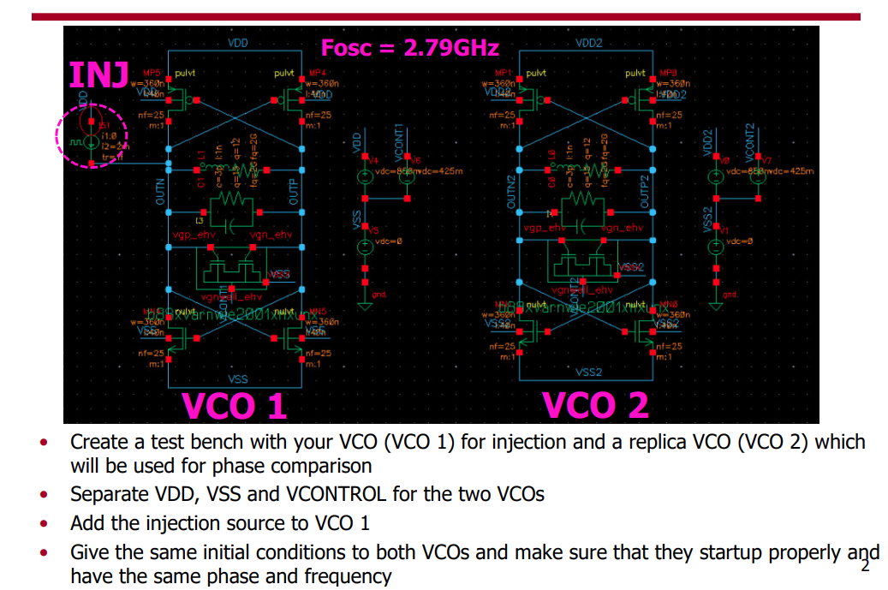
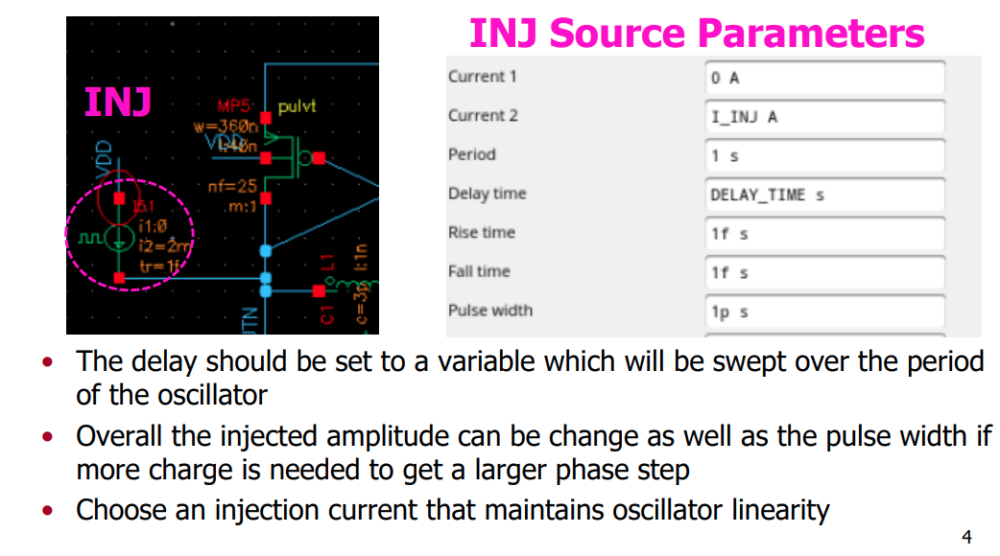

## ISF Simulation

### PSS + PXF Method

> Yizhe Hu, "A Simulation Technique of Impulse Sensitivity Function (ISF) Based on Periodic Transfer Function (PXF)" [[https://bbs.eetop.cn/thread-869343-1-1.html](https://bbs.eetop.cn/thread-869343-1-1.html)]

*TODO* &#128197;

### Transient Method

> David Dolt. ECEN 620 Network Theory - Broadband Circuit Design: "VCO ISF Simulation" [[https://people.engr.tamu.edu/spalermo/ecen620/ISF_SIM.pdf](https://people.engr.tamu.edu/spalermo/ecen620/ISF_SIM.pdf)]

> To compare the ring oscillator and VCO the **total injected charge** to both should be the **same**

## Tail filter

*TODO* &#128197;

## reference

Jiří Lebl. **Notes on Diffy Qs: Differential Equations for Engineers** [[link](https://www.jirka.org/diffyqs/)]

Matt Charnley. **Differential Equations: An Introduction for Engineers** [[link](https://sites.rutgers.edu/matthew-charnley/course-materials/differential-equations-an-introduction-for-engineers/)]

Åström, K.J. & Murray, Richard. (2021). **Feedback Systems: An Introduction for Scientists and Engineers Second Edition** [[https://www.cds.caltech.edu/~murray/books/AM08/pdf/fbs-public_24Jul2020.pdf](https://www.cds.caltech.edu/~murray/books/AM08/pdf/fbs-public_24Jul2020.pdf)]

Strogatz, S.H. (2015). **Nonlinear Dynamics and Chaos: With Applications to Physics, Biology, Chemistry, and Engineering (2nd ed.)**. CRC Press [[https://www.biodyn.ro/course/literatura/Nonlinear_Dynamics_and_Chaos_2018_Steven_H._Strogatz.pdf](https://www.biodyn.ro/course/literatura/Nonlinear_Dynamics_and_Chaos_2018_Steven_H._Strogatz.pdf)]

Cadence Blog, "Resonant Frequency vs. Natural Frequency in Oscillator Circuits"  [[link](https://resources.pcb.cadence.com/blog/2019-resonant-frequency-vs-natural-frequency-in-oscillator-circuits)]

---

Aditya Varma Muppala. Oscillators [[https://youtube.com/playlist?list=PL9Trid0A4Da2fOmYTEjhAnUkGPxyiH7H6&si=ILxn8hfkMYjXW5f4](https://youtube.com/playlist?list=PL9Trid0A4Da2fOmYTEjhAnUkGPxyiH7H6&si=ILxn8hfkMYjXW5f4)]

Y. Hu, T. Siriburanon and R. B. Staszewski, "Intuitive Understanding of Flicker Noise Reduction via Narrowing of Conduction Angle in Voltage-Biased Oscillators," in IEEE Transactions on Circuits and Systems II: Express Briefs, vol. 66, no. 12, pp. 1962-1966, Dec. 2019 [[https://sci-hub.se/10.1109/TCSII.2019.2896483](https://sci-hub.se/10.1109/TCSII.2019.2896483)]

S. Levantino, P. Maffezzoni, F. Pepe, A. Bonfanti, C. Samori and A. L. Lacaita, "Efficient Calculation of the Impulse Sensitivity Function in Oscillators," in IEEE Transactions on Circuits and Systems II: Express Briefs, vol. 59, no. 10, pp. 628-632, Oct. 2012 [[https://sci-hub.se/10.1109/TCSII.2012.2208679](https://sci-hub.se/10.1109/TCSII.2012.2208679)]

S. Levantino and P. Maffezzoni, "Computing the Perturbation Projection Vector of Oscillators via Frequency Domain Analysis," in IEEE Transactions on Computer-Aided Design of Integrated Circuits and Systems, vol. 31, no. 10, pp. 1499-1507, Oct. 2012 [[https://sci-hub.se/10.1109/TCAD.2012.2194493](https://sci-hub.se/10.1109/TCAD.2012.2194493)]

Ali Hajimiri. Phase Noise in Oscillators [[http://www-smirc.stanford.edu/papers/Orals98s-ali.pdf](http://www-smirc.stanford.edu/papers/Orals98s-ali.pdf)]

Thomas H. Lee. Linearity, Time-Variation, Phase Modulation and Oscillator Phase Noise [[https://class.ece.iastate.edu/djchen/ee507/PhaseNoiseTutorialLee.pdf](https://class.ece.iastate.edu/djchen/ee507/PhaseNoiseTutorialLee.pdf)]

---

E. Hegazi, H. Sjoland and A. A. Abidi, "A filtering technique to lower LC oscillator phase noise," in IEEE Journal of Solid-State Circuits, vol. 36, no. 12, pp. 1921-1930, Dec. 2001 [[https://sci-hub.st/10.1109/4.972142](https://sci-hub.st/10.1109/4.972142)]

D. Murphy, H. Darabi and H. Wu, "Implicit Common-Mode Resonance in LC Oscillators," in IEEE Journal of Solid-State Circuits, vol. 52, no. 3, pp. 812-821, March 2017, [[https://sci-hub.st/10.1109/JSSC.2016.2642207](https://sci-hub.st/10.1109/JSSC.2016.2642207)]

D. Murphy, H. Darabi and H. Wu, "25.3 A VCO with implicit common-mode resonance," 2015 IEEE International Solid-State Circuits Conference - (ISSCC) Digest of Technical Papers, San Francisco, CA, USA, 2015 [[https://sci-hub.st/10.1109/ISSCC.2015.7063116](https://sci-hub.st/10.1109/ISSCC.2015.7063116)]

A. A. Abidi and D. Murphy, "How to Design a Differential CMOS LC Oscillator," in IEEE Open Journal of the Solid-State Circuits Society, vol. 5, pp. 45-59, 2025 [[https://ieeexplore.ieee.org/stamp/stamp.jsp?arnumber=10818782](https://ieeexplore.ieee.org/stamp/stamp.jsp?arnumber=10818782)]

Akihide Sai, Toshiba. ISSCC 2023 T5: All-digital PLLs From Fundamental Concepts to Future Trends [[https://www.nishanchettri.com/isscc-slides/2023%20ISSCC/TUTORIALS/T5.pdf](https://www.nishanchettri.com/isscc-slides/2023%20ISSCC/TUTORIALS/T5.pdf)]

---

Pietro Andreani. ISSCC 2011 T1: Integrated LC oscillators [[slides](https://www.nishanchettri.com/isscc-slides/2011%20ISSCC/TUTORIALS/ISSCC2011Visuals-T1.pdf),[transcript](https://www.nishanchettri.com/isscc-slides/2011%20ISSCC/TUTORIALS/Transcription_T1.pdf)]

Pietro Andreani. ISSCC 2017 F2: Integrated Harmonic Oscillators

Jun Yin. ISSCC 2025  T10:  mm-Wave Oscillator Design

