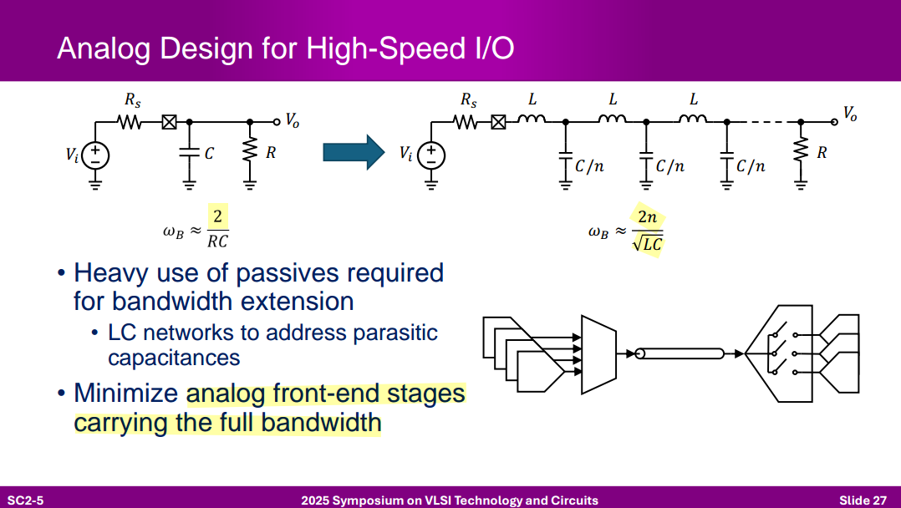
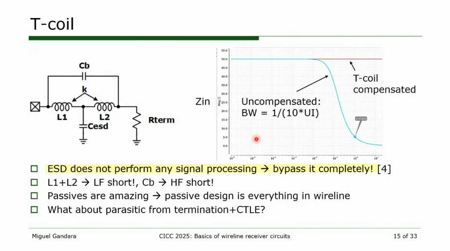
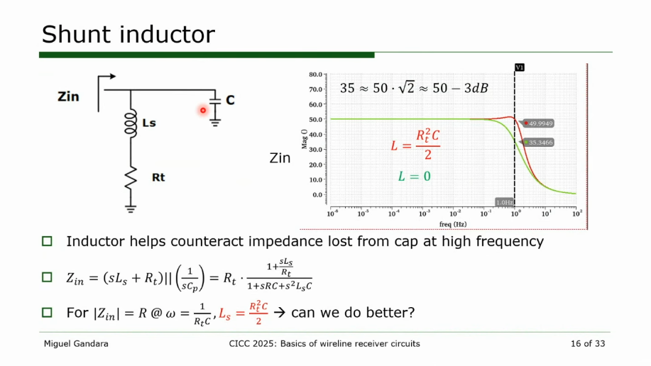
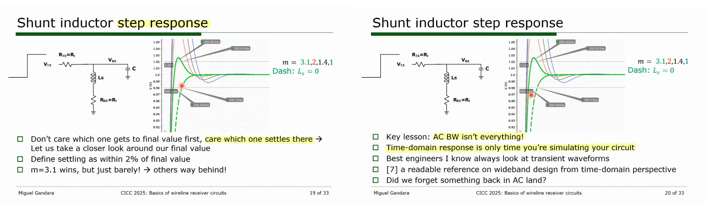
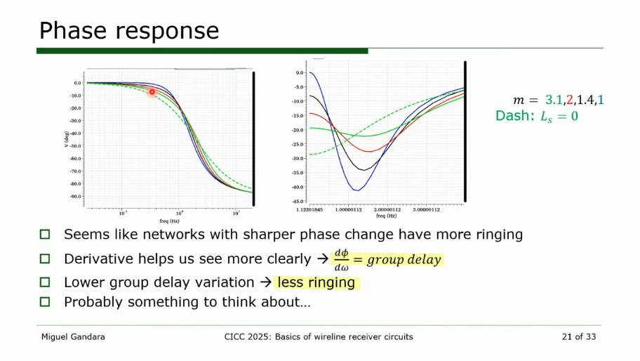

## input network



---


> ```
> >> 10e6/2/pi/400/50
> 
> ans =
> 
> 79.5775
> ```




> charging parasitic from CTLE is signal processing,  bypassing the capacitor is not feasible








## Asymmetric T-Coil

*TODO* &#128197;


> Deog-Kyoon Jeong. Topics in IC Design: T-Coil [[pdf](https://ocw.snu.ac.kr/sites/default/files/NOTE/Lec%2010%20-%20Bandwidth%20Extension%20Techniques.pdf)]
>
> Razavi, Behzad, "The bridged T-coil [a circuit for all seasons]." IEEE Solid-State Circuits Magazine 7.4 (2015): 9-13. [[https://www.seas.ucla.edu/brweb/papers/Journals/BRFall15TCoil.pdf](https://www.seas.ucla.edu/brweb/papers/Journals/BRFall15TCoil.pdf)]


## reference

J. Kim et al., "A 112Gb/s PAM-4 transmitter with 3-Tap FFE in 10nm CMOS," 2018 IEEE International Solid-State Circuits Conference - (ISSCC), San Francisco, CA, USA, 2018 [[https://2024.sci-hub.se/6715/9a3d5a4825e551544403f87f0b9f6a89/10.1109@ISSCC.2018.8310204.pdf](https://2024.sci-hub.se/6715/9a3d5a4825e551544403f87f0b9f6a89/10.1109@ISSCC.2018.8310204.pdf)] [[slides](https://picture.iczhiku.com/resource/eetop/shiGDYTDYikLlnXv.pdf)]

Miguel Gandara. CICC2025 Circuits Insights: Wireline Receiver Circuits [[https://youtu.be/X4JTuh2Gdzg](https://youtu.be/X4JTuh2Gdzg)]
