## Bandwidth

> [How Interconnects Work: Bandwidth for Modeling and Measurements, [https://www.simberian.com/AppNotes/HIW-Bandwidth-6to112-2021-11-08.pdf](https://www.simberian.com/AppNotes/HIW-Bandwidth-6to112-2021-11-08.pdf)]
>
> [Moving from 28 Gbps NRZ to 56 Gbps PAM-4 - is it "free lunch"?, [https://www.simberian.com/AppNotes/28NRZto56PAM4.pdf](https://www.simberian.com/AppNotes/28NRZto56PAM4.pdf)]
>
> [PAM4: For Better and Worse Is PAM4 worth the hassle?[https://www.signalintegrityjournal.com/articles/1151-pam4-for-better-and-worse](https://www.signalintegrityjournal.com/articles/1151-pam4-for-better-and-worse)]

## PAM4 Basic

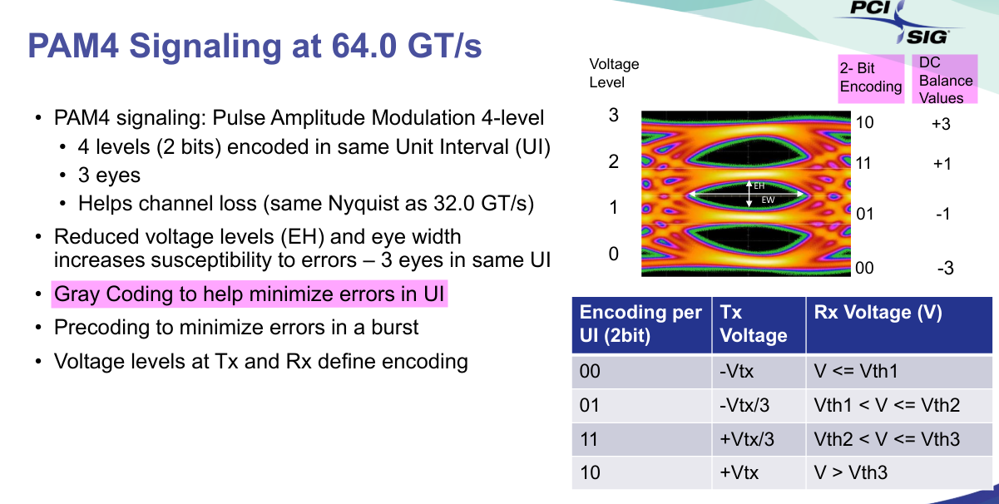

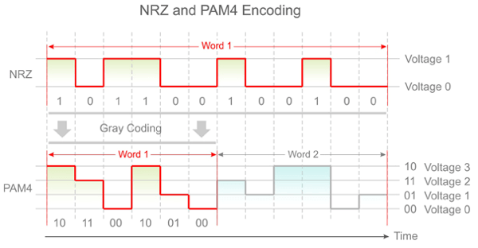

**PAM4** only have *1/3* of the amplitude compared to **NRZ**
$$
\text{SNR loss} = 20\log(\frac{1}{3}) \sim  9.5\text{dB}
$$

> In practice, there is further degradation due to nonlinearity

In a more technical terms, we trade the **transmitter’s signal-to-noise ratio (SNR)** for **lower Nyquist frequency**

Equalization will be a lot more complex

### Energy

1mW/Gbps = 1pJ/bit

### PAM4 Level Names

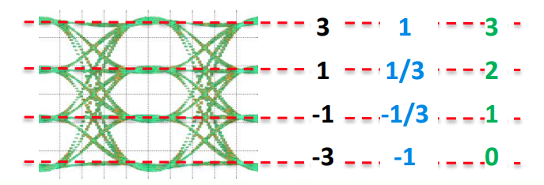

### PAM4 Eye Linearity

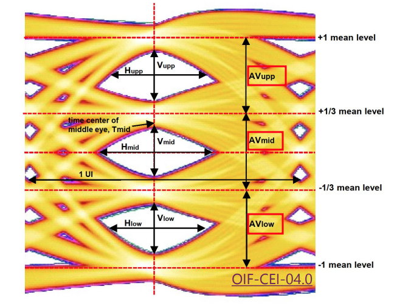

Each level can have different amplitudes, which form the **Eye Linearity**
$$
{\text{Eye Linearity}}=\frac{\min(AV_{\text{upp}},AV_{\text{mid}},AV_{\text{low}})}{\max(AV_{\text{upp}},AV_{\text{mid}},AV_{\text{low}})}
$$

> Perfect eye = 1
>
> Worst eye = 0

### Transmitter Linearity (RLM)

The **Level Separation Mismatch Ratio**, commonly referred to as $R_{\text{LM}}$, is a measurement that is not required in normative or informative VSR tests, but is required by most other variants.

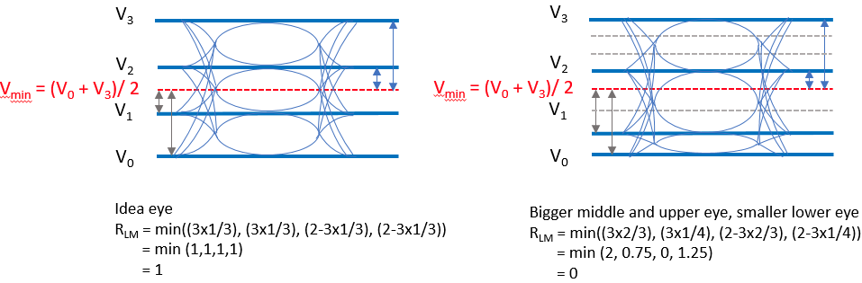

$$\begin{align}
V_{\text{mid}} &= \frac{V_0+V_3}{2} \\
ES1 &= \frac{V_1-V_{\text{mid}}}{V_0-V_{\text{mid}}} \\
ES2 &= \frac{V_2-V_{\text{mid}}}{V_3-V_{\text{mid}}} \\
R_{\text{LM}} &= \min(3\times ES1, 3\times ES2, 2-3\times ES1, 2-3\times ES2)
\end{align}$$

where *ES* means *Effective Symbol Level*

> $R_{\text{LM}}$ is conceptually similar to eye linearity but measured differently. An ideal PAM4 eye has $R_{\text{LM}}$ equal to **1**, but it does not scale in the same way as eye linearity. 
>
> The closer $R_{\text{LM}}$  is to **1**, the better the eye linearity is.

## Gray Coding

Gray code or reflected binary code was designed so that two successive values differ by one bit

Reducing the number of switching

| Linear Code | Gray Code |
| ----------- | --------- |
| 11          | 10        |
| 10          | 11        |
| 01          | 01        |
| 00          | 00        |

> - Only one bit error per symbol is made for incorrect decisions
> - This is the coding adopted in all the PAM4 standards
> - Support dual-mode with PAM2, by grounding the LSB
> - MSB is the bit transmitted first

### Binary to PAM4 and Back to Binary Example

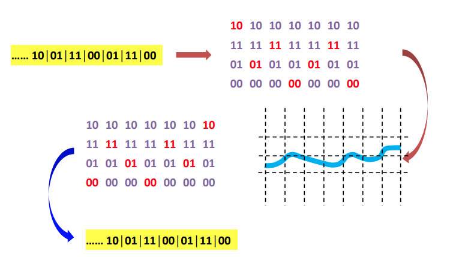

> The way that Gray coding combines the MSB (most significant bit) and LSB (least significant bit) in each PAM4 symbol assures that **symbol errors** caused by **amplitude noise** are more likely to cause **one bit error than two**. On the other hand, jitter is more likely to cause two bit errors per symbol error. 

# PAM4 TX equalization

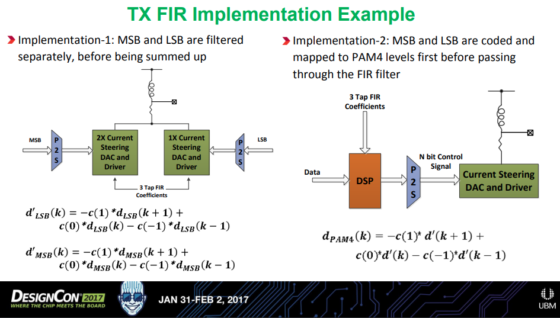

Here, $d_{\text{LSB}} \in \{-1, 1\}$, $d_{\text{MSB}} \in \{-2, 2\}$ and $d' \in \{ -3, -1, 1, 3 \}$

Implementation-1 could potentially experience performance degradation due to

1. Clock skew, $\Delta t$, could make the eye misaligned horizontally
2. Gain mismatch, $\Delta G$, could cause eye nonlinearity
3. Bandwidth mismatch, $\Delta f_{\text{BW}}$, could make the eye misaligned vertically

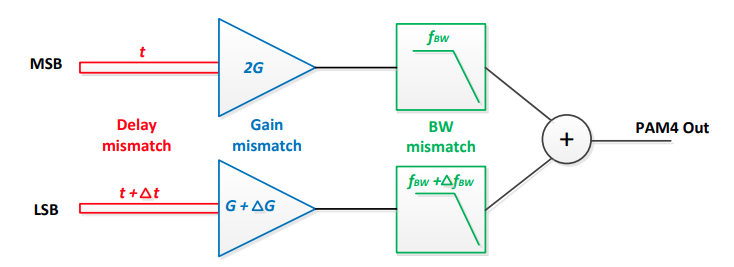

> Typically, a 3-tap FIR (pre + main + post) TX de-emphasis is used
>
> 3-tap FIR results in $4^3 = 64$ possible distinct signal levels

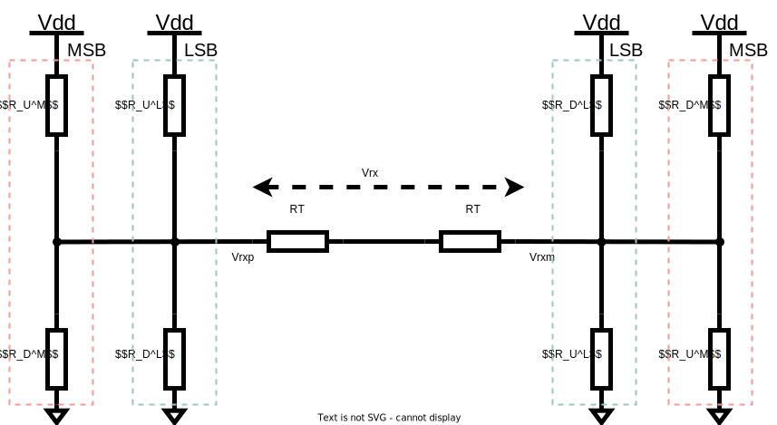

$$\begin{align}
R_U^M \parallel R_D^M &= \frac{3R_T}{2}\\
R_U^L \parallel R_D^L &= 3R_T
\end{align}$$

Thevenin Equivalent Circuit is 
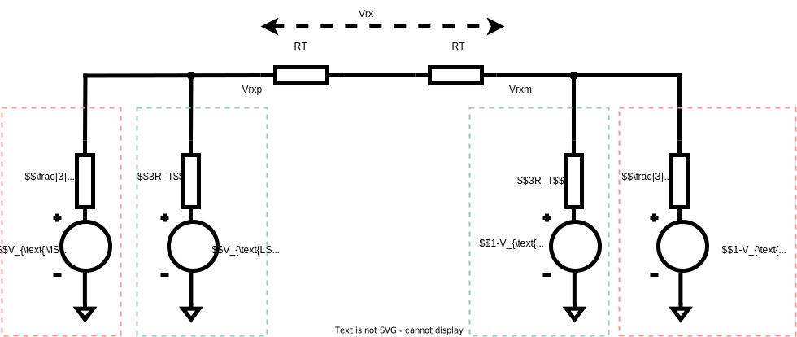

Which can be simpified as
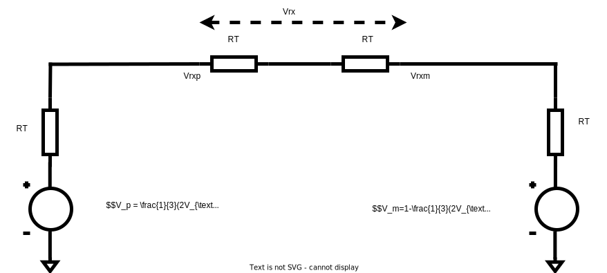
$$\begin{align}
V_{\text{rx}} &= \frac{1}{2}(V_p - V_m) \\
&= \frac{1}{2}(\frac{2}{3}(2V_{\text{MSB}}+V_{\text{LSB}})-1) \\
&=\frac{1}{3}(2V_{\text{MSB}}+V_{\text{LSB}})-\frac{1}{2}
\end{align}$$

The above eqations demonstrate that the output $V_{\text{rx}}$ is the linear sum of **MSB** and **LSB**; **LSB** and **MSB** have relative weight, i.e. *1* for LSB and *2* for MSB.

Assume pre cusor has $L$ legs, main cursor $M$ legs and post cursor $N$ legs, which is same with the convention in "Voltage-Mode Driver Equalization"

The number of legs connected with supply can expressed as
$$
n_{up} = (1-d_{n+1})L + d_{n}M + (1-d_{n-1})N
$$
Where $d_n \in \{0, 1\}$, or
$$
n_{up} = \frac{1}{2}(-D_{n+1}+1)L + \frac{1}{2}(D_{n}+1)M + \frac{1}{2}(-D_{n-1}+1)N
$$
Where $D_n \in \{-1, +1\}$

Then the number of legs connected with ground is
$$
n_{dn}=L+M+N-n_{up}
$$
where $n_{up}+n_{dn}=L+M+N$

Voltage resistor divider
$$\begin{align}
V_o &= \frac{\frac{R_{U}}{n_{dn}}}{\frac{R_U}{n_{dn}}+\frac{R_U}{n_{up}}} \\
&= \frac{1}{2}- \frac{1}{2}D_{n+1}\frac{L}{L+M+N}+ \frac{1}{2}D_{n}\frac{M}{L+M+N}-\frac{1}{2}D_{n-1}\frac{N}{L+M+N} \\
&= \frac{1}{2}-\frac{1}{2}D_{n+1}\cdot l+ \frac{1}{2}D_{n}\cdot m-\frac{1}{2}D_{n-1}\cdot n
\end{align}$$

where $l+m+n=1$ 

$V_{\text{MSB}}$ and $V_{\text{LSB}}$   can be obtained

$$\begin{align}
V_{\text{MSB}} &= \frac{1}{2}-\frac{1}{2}D^{\text{MSB}}_{n+1}\cdot l+ \frac{1}{2}D^{\text{MSB}}_{n}\cdot m-\frac{1}{2}D^{\text{MSB}}_{n-1}\cdot n \\
V_{\text{LSB}} &= \frac{1}{2}-\frac{1}{2}D^{\text{LSB}}_{n+1}\cdot l+ \frac{1}{2}D^{\text{LSB}}_{n}\cdot m-\frac{1}{2}D^{\text{LSB}}_{n-1}\cdot n
\end{align}$$

Substitute the above equation into $V_{\text{rx}}$, we obtain the relationship between driver legs and FFE coefficients

$$\begin{align}
V_{\text{rx}} &=\frac{1}{3}(2V_{\text{MSB}}+V_{\text{LSB}})-\frac{1}{2} \\
&= \frac{1}{3} \left\{  2\left( \frac{1}{2}-\frac{1}{2}D^{\text{MSB}}_{n+1}\cdot l+ \frac{1}{2}D^{\text{MSB}}_{n}\cdot m- \frac{1}{2}D^{\text{MSB}}_{n-1}\cdot n \right) + \left( \frac{1}{2}-\frac{1}{2}D^{\text{LSB}}_{n+1}\cdot l+ \frac{1}{2}D^{\text{LSB}}_{n}\cdot m- \frac{1}{2}D^{\text{LSB}}_{n-1}\cdot n \right) \right\}-\frac{1}{2} \\
&=  \left(-\frac{l}{6} \cdot 2 \cdot D^{\text{MSB}}_{n+1}+ \frac{m}{6} \cdot 2 \cdot D^{\text{MSB}}_{n}- \frac{n}{6} \cdot 2 \cdot D^{\text{MSB}}_{n-1}\right) + \left(-\frac{l}{6} \cdot D^{\text{LSB}}_{n+1}+ \frac{m}{6} \cdot D^{\text{LSB}}_{n}- \frac{n}{6} \cdot D^{\text{LSB}}_{n-1}\right) \\
&=  -\frac{l}{6}(2 \cdot D^{\text{MSB}}_{n+1}+D^{\text{LSB}}_{n+1})+ \frac{m}{6}(2\cdot D^{\text{MSB}}_{n}+D^{\text{LSB}}_{n}) -\frac{n}{6}(2\cdot D^{\text{MSB}}_{n-1}+D^{\text{LSB}}_{n-1})
\end{align}$$

After scaling, we obtain
$$
V_{\text{rx}}  = -l\cdot(2 \cdot D^{\text{MSB}}_{n+1}+D^{\text{LSB}}_{n+1})+ m\cdot(2\cdot D^{\text{MSB}}_{n}+D^{\text{LSB}}_{n}) - n \cdot(2\cdot D^{\text{MSB}}_{n-1}+D^{\text{LSB}}_{n-1})
$$
Where $C_{-1} = l$, $C_0 = m$ and $C_{1}=n$, which is same with that of NRZ.

## TX Serializer

### mux timing

### divider latch timing

### Two latches

## DAC-based FFE in PAM4 Transmitter

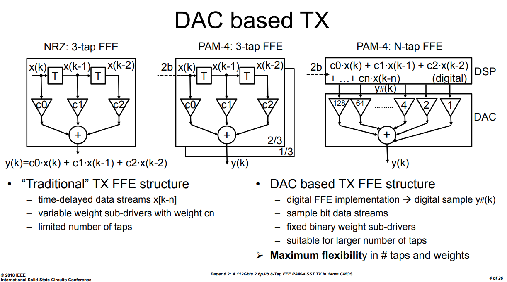

One classic TX implementation contain:

- a DAC: **56GS/s** **8b** 
- a DSP: **8-tap FIR**

> C. Menolfi et al., "A 112Gb/S 2.6pJ/b 8-Tap FFE PAM-4 SST TX in 14nm CMOS," 2018 IEEE International Solid - State Circuits Conference - (ISSCC), 2018, pp. 104-106, doi: 10.1109/ISSCC.2018.8310205.

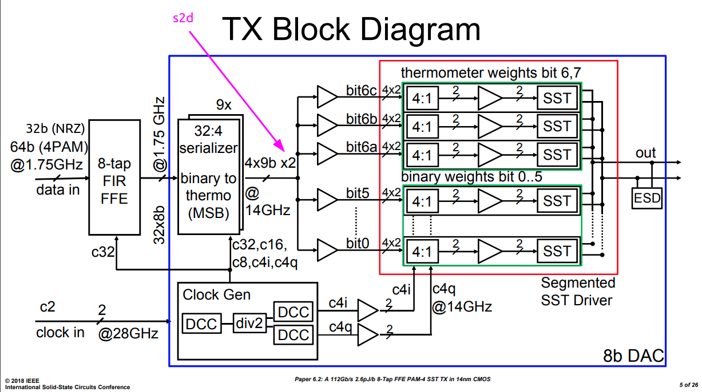

### $\pi$-coil

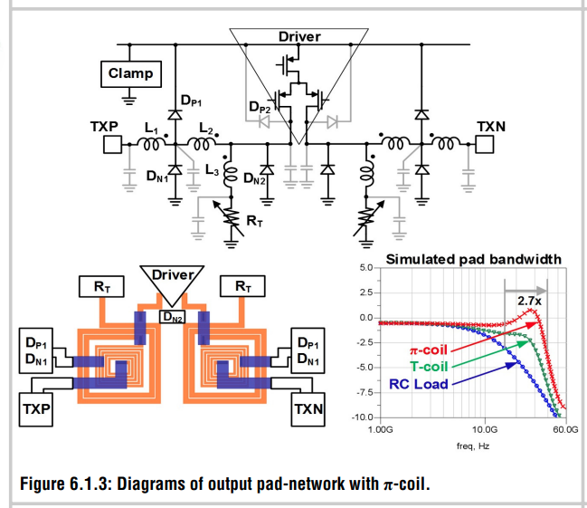

> J. Kim et al., "A 112Gb/s PAM-4 transmitter with 3-Tap FFE in 10nm CMOS," 2018 IEEE International Solid - State Circuits Conference - (ISSCC), 2018, pp. 102-104, doi: 10.1109/ISSCC.2018.8310204.

## reference

C. Menolfi et al., "A 112Gb/S 2.6pJ/b 8-Tap FFE PAM-4 SST TX in 14nm CMOS," 2018 IEEE International Solid - State Circuits Conference - (ISSCC), 2018, pp. 104-106, doi: 10.1109/ISSCC.2018.8310205.

E. Chong et al., "A 112Gb/s PAM-4, 168Gb/s PAM-8 7bit DAC-Based Transmitter in 7nm FinFET," ESSCIRC 2021 - IEEE 47th European Solid State Circuits Conference (ESSCIRC), 2021, pp. 523-526, doi: 10.1109/ESSCIRC53450.2021.9567801.

B. Razavi, "Design Techniques for High-Speed Wireline Transmitters," in IEEE Open Journal of the Solid-State Circuits Society, vol. 1, pp. 53-66, 2021, doi: 10.1109/OJSSCS.2021.3112398.

Wang, Z., Choi, M., Lee, K., Park, K., Liu, Z., Biswas, A., Han, J., Du, S., & Alon, E. (2022). An Output Bandwidth Optimized 200-Gb/s PAM-4 100-Gb/s NRZ Transmitter With 5-Tap FFE in 28-nm CMOS. IEEE Journal of Solid-State Circuits, 57(1), 21-31. https://doi.org/10.1109/JSSC.2021.3109562

J. Kim et al., "A 112Gb/s PAM-4 transmitter with 3-Tap FFE in 10nm CMOS," 2018 IEEE International Solid - State Circuits Conference - (ISSCC), 2018, pp. 102-104, doi: 10.1109/ISSCC.2018.8310204.

PCIe® 6.0 Specification: The Interconnect for I/O Needs of the Future PCI-SIG® Educational Webinar Series, [[https://pcisig.com/sites/default/files/files/PCIe%206.0%20Webinar_Final_.pdf](https://pcisig.com/sites/default/files/files/PCIe%206.0%20Webinar_Final_.pdf)]

