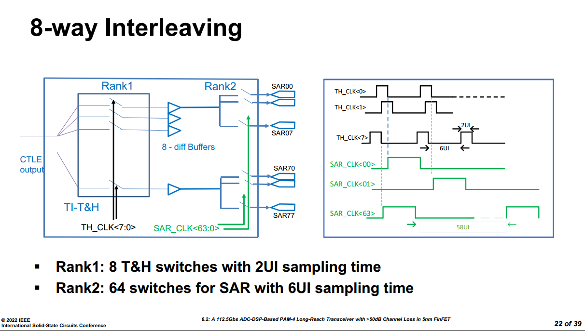

Z. Guo et al., "A 112.5Gb/s ADC-DSP-Based PAM-4 Long-Reach Transceiver with >50dB Channel Loss in 5nm FinFET," 2022 IEEE International Solid-State Circuits Conference (ISSCC), San Francisco, CA, USA, 2022

> [[https://sci-hub.st/10.1109/ISSCC42614.2022.9731650](https://sci-hub.st/10.1109/ISSCC42614.2022.9731650)]

---

ISSCC.2024 7.3 A 224Gbs 3pJb 40dB Insertion Loss Transceiver in 3nm FinFET CMOS

> [[7.3 A 224Gbs 3pJb 40dB Insertion Loss Transceiver in 3nm FinFET CMOS https://www.bilibili.com/video/BV18hYCe7E45/?share_source=copy_web&vd_source=5a095c2d604a5d4392ea78fa2bbc7249]([7.3 A 224Gbs 3pJb 40dB Insertion Loss Transceiver in 3nm FinFET CMOS] https://www.bilibili.com/video/BV18hYCe7E45/?share_source=copy_web&vd_source=5a095c2d604a5d4392ea78fa2bbc7249)]

---

ISSCC.2018 6.4 A Fully Adaptive 19-to-56Gb/s PAM-4 Wireline Transceiver with a Configurable ADC in 16nm FinFET

> [[https://sci-hub.st/10.1109/ISSCC.2018.8310207](https://sci-hub.st/10.1109/ISSCC.2018.8310207)]

---

M. S. Jalali, A. Sheikholeslami, M. Kibune and H. Tamura, "A Reference-Less Single-Loop Half-Rate Binary CDR," in *IEEE Journal of Solid-State Circuits*, vol. 50, no. 9, pp. 2037-2047, Sept. 2015 [[https://www.eecg.utoronto.ca/~ali/papers/jssc2015-09.pdf](https://www.eecg.utoronto.ca/~ali/papers/jssc2015-09.pdf)]