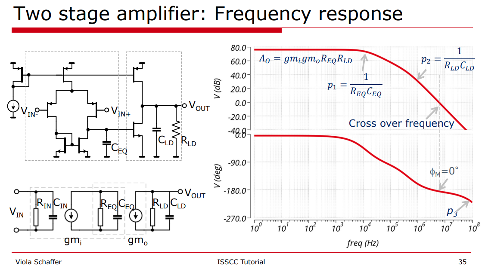
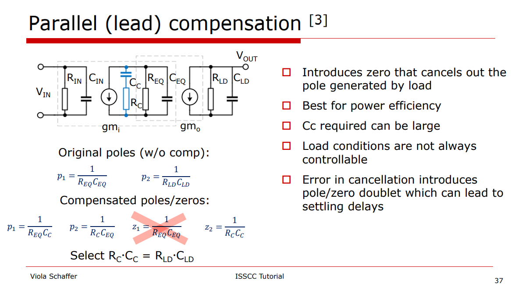
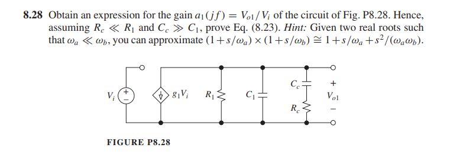

> **Parallel Compensation** is also known as **Lead Compensation**, **Pole-Zero Compensation**



**Note**: The dominant pole is at output of the first stage, i.e. $\frac{1}{R_{EQ}C_{EQ}}$.



#### Pole and Zero in transfer function

> Design with operational amplifiers and analog integrated circuits / Sergio Franco, San Francisco State University. – Fourth edition



$$
Y = \frac{1}{R_1} + sC_1+\frac{1}{R_c+1/SC_c}
$$

$$\begin{align}
Z &= \frac{1}{\frac{1}{R_1} + sC_1+\frac{1}{R_c+1/SC_c}} \\
&= \frac{R_1(1+sR_cC_c)}{s^2R_1C_1R_cC_c+S(R_1C_c+R_1C_1+R_cC_c)+1}
\end{align}$$
If $p_{1c} \ll p_{3c}$, two real roots can be found
$$\begin{align}
p_{1c} &= \frac{1}{R_1C_c+R_1C_1+R_cC_c} \\
p_{3c} &= \frac{R_1C_c+R_1C_1+R_cC_c}{R_1C_1R_cC_c}
\end{align}$$

The additional zero is
$$
z_c = \frac{1}{R_cC_c}
$$
Given $R_c \ll R$ and $C_c \gg C$
$$\begin{align}
p_{1c} &\simeq \frac{1}{R_1(C_c+C_1)} \simeq \frac{1}{R_1C_c}\\
p_{3c} &= \frac{1}{R_cC_1}+\frac{1}{R_cC_c}+\frac{1}{R_1C_1} \simeq \frac{1}{R_cC_1}
\end{align}$$

The output pole is unchanged, which is
$$
p_2 = \frac{1}{R_LC_L}
$$
We usually **cancel** $p_2$ with $z_c$, i.e.
$$
R_cC_c=R_LC_L
$$


#### Phase margin

unity-gain frequency $\omega_t$
$$
\omega_t = \frac{g_{m1}g_{m2}R_L}{C_c}
$$


1. PM=45$^o$
   $$
   p_{3c} = \omega_t
   $$
   Then, $C_c$ and $R_c$ can be obtained

   $$\begin{align}
      R_c &= \sqrt{\frac{R_1}{C_1\cdot A_{DC}\cdot p_2}}=\sqrt{\frac{R_1\cdot R_LC_L}{C_1\cdot A_{DC}}} \\
   C_c &= \sqrt{\frac{A_{DC}\cdot C_1}{R_1\cdot p_2}}=\sqrt{\frac{A_{DC}\cdot C_1 \cdot R_LC_L}{R_1}}
   \end{align}$$

2. PM=60$^o$
   $$
   p_{3c} = 2\cdot\omega_t
   $$
   Then, $C_c$ and $R_c$ can be obtained
   $$\begin{align}
      R_c &= \sqrt{\frac{R_1}{C_1\cdot 2A_{DC}\cdot p_2}} = \sqrt{\frac{R_1\cdot R_LC_L}{C_1\cdot 2A_{DC}}} \\
      &= \sqrt{\frac{C_L}{2g_{m1}g_{m2}C_1}}\\
   C_c &= \sqrt{\frac{2A_{DC}\cdot C_1}{R_1\cdot p_2}} = \sqrt{\frac{2A_{DC}\cdot C_1 \cdot R_LC_L}{R_1}} \\
   &= R_L\sqrt{2g_{m1}g_{m2}C_1C_L}
   \end{align}$$
   
   for the unity-gain frequency $\omega_t$ we find
   $$
   \omega_t = \sqrt{\frac{1}{2}\cdot \frac{g_{m1}g_{m2}}{C_1C_L}}
   $$
   The parallel compensation shows a remarkably good result. The new 0 dB frequency lies only a factor $\sqrt{2}$ lower than the theoretical maximum

> To increase $\phi_m$,  we need to **raise** $C_c$ a bit while **lowering** $R_c$ in proportion in order to maintain pole-zero cancellation. This causes $p_{1c}$ and $p_{3c}$ to split a bit further apart.

```matlab
clc;
clear;

fd = 84*1e3;	% dominant freq, unit: Hz
fnd = 3.25*1e6;	% unit: Hz
C = 478*1e-15;
R = 1/fd/(2*pi)/C;
Adc = 10^(80/20);

ri = 2; % PM=45: 1;  PM=60: 2
Rc = (R/C/fnd/2/pi/ri/Adc)^0.5; % compensation resistor
Cc = (ri*Adc*C/fnd/2/pi/R)^0.5; % compensation capacitor

wzc = 1/2/pi/Rc/Cc; % zero frequency
```


#### reference

Viola Schäffer, Designing Amplifiers for Stability, ISSCC 2021 Tutorials

R.Eschauzier "Wide Bandwidth Low Power Operational Amplifiers", Delft University Press, 1994.

Gene F. Franklin, J. David Powell, and Abbas Emami-Naeini. 2018. Feedback Control of Dynamic Systems (8th Edition) (8th. ed.). Pearson. 6.7 Compensation

Application Note AN-1286 Compensation for the LM3478 Boost Controller

ECEN 607 Advanced Analog Circuit Design Techniques Spring 2017 URL: [Lect 1D Op-Amps Stability and Frequency Compensation Techniques](https://people.engr.tamu.edu/s-sanchez/Lec_for_607_stability Jan27.pdf)

Sergio Franco, San Francisco State University, Design with Operational Amplifiers and Analog Integrated Circuits, 4/e 

J. H. Huijsing, 6.2.2.1 Two-GA-stage Parallel Compensation (PC), "Operational Amplifiers, Theory and Design, 3rd ed. New York: Springer, 2017"
