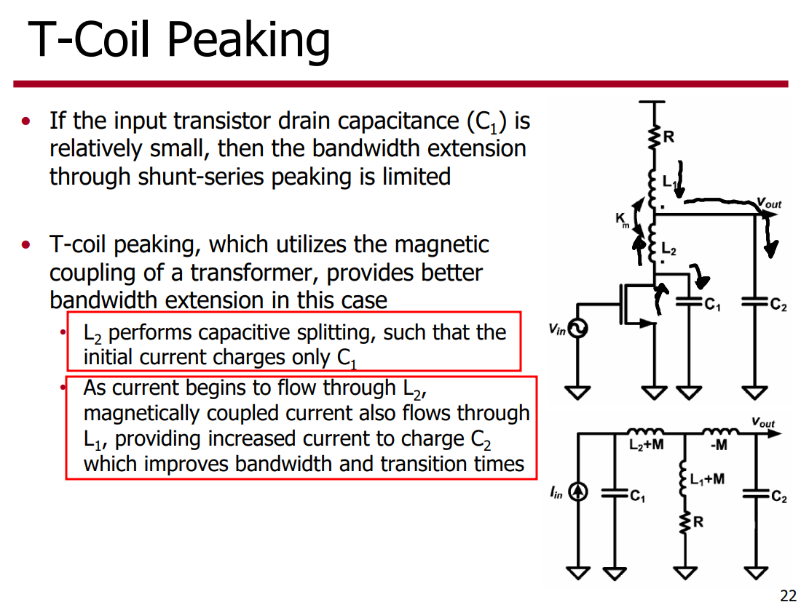
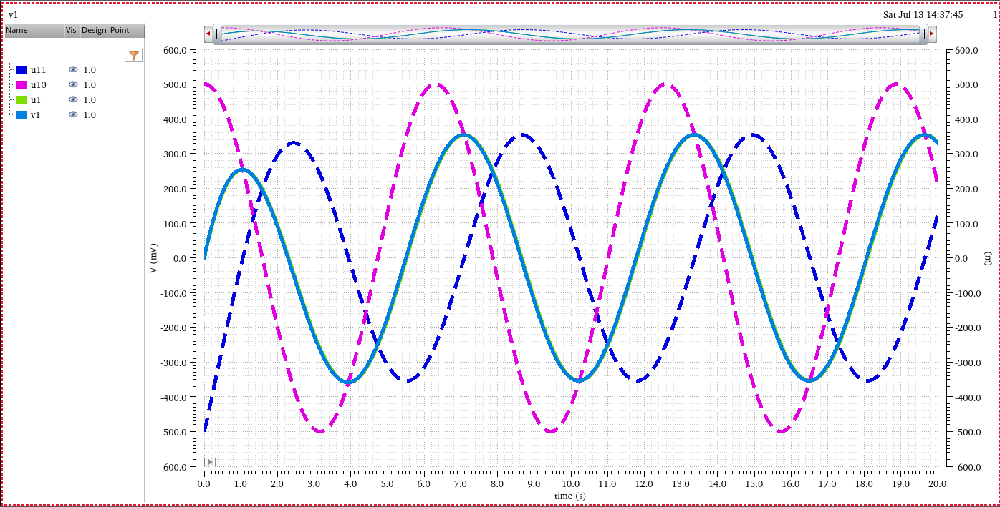

## Matching network

*TODO* &#128197;


## Q factor

*TODO* &#128197;


## Self-Resonant Frequency


$$
f_\text{SRF} = \frac{1}{2\pi \sqrt{LC}}
$$
The SRF of an inductor is the frequency at which the parasitic capacitance of the inductor resonates with the ideal inductance of the inductor, resulting in an extremely high impedance. The inductance only acts like an inductor below its SRF


- For **choking** applications, chose an inductor whose SRF is at or near the frequency to be attenuated

- For other applications, the SRF should be at least **10** times higher than the operating frequency

  it is more important to have a *relatively flat inductance curve* (constant inductance vs. frequency) near the required frequency


> [Understanding RF Inductor Specifications, [https://www.ece.uprm.edu/~rafaelr/inel5325/SupportDocuments/doc671_Selecting_RF_Inductors.pdf](https://www.ece.uprm.edu/~rafaelr/inel5325/SupportDocuments/doc671_Selecting_RF_Inductors.pdf)]
>
> [RFIC-GPT Wiki, [https://wiki.icprophet.net/](https://wiki.icprophet.net/)]


## T-coil

- Broaden the bandwidth
- Create a constant, resistive input impedance in the presence of a heavy load capacitance (ESD protection circuit)

> L<sub>1</sub> = L<sub>2</sub> for impedance matching


The use of T-coils can dramatically increase the **bandwidth** and improve the **return loss** in both TXs and RXs.




> *equivalent circuit*
>
> 
>
> 
>
> 
>
> Note the negative sign of $L_M$, which is a consequence of magnetic coupling; owing to this, the driving impedance at the center tap *as seen by $C$* is **lower than without the coupling**.
>
> $$\begin{align}
Z_{c} &= sL_a/2 -sL_M = sL/2 - sL_M/2 \\
Z_{noc} &= sL/2
> \end{align}$$


### Bridged T-Coil

> The vertical stacking of the inductor halves causes a significant bridging capacitance $C_B$​ between them. 
>
> The most important aspect is that $C_B$ does not prohibit perfect impedance matching but can be used to tune certain transfer functions.


### Tcoil in RX


> **ppwl**: Independent Piece-Wise Linear Resistive Source


### simple model

> L1, L2, Km, Cb


### lumped model

```
simulator lang=spectre
include "/path/to/INDL0.scs"
subckt for_import(p0 p1 p2 gnd)
	xmod (p0 p1 p2 gnd) INDL0
ends for_import

x_1 (p_1_1 p_1_2 p_1_3 0) for_import
v_1_1 (p_1_1 0) vsource mag=-1
v_1_2 (p_1_2 0) vsource mag=0
v_1_3 (p_1_3 0) vsource mag=0
save v_1_1:p v_1_2:p v_1_3:p

x_2 (p_2_1 p_2_2 p_2_3 0) for_import
v_2_1 (p_2_1 0) vsource mag=0
v_2_2 (p_2_2 0) vsource mag=-1
v_2_3 (p_2_3 0) vsource mag=0
save v_2_1:p v_2_2:p v_2_3:p

x_3 (p_3_1 p_3_2 p_3_3 0) for_import
v_3_1 (p_3_1 0) vsource mag=0
v_3_2 (p_3_2 0) vsource mag=0
v_3_3 (p_3_3 0) vsource mag=-1
save v_3_1:p v_3_2:p v_3_3:p
Y ac start=1.000000e+08 stop=2.000000e+10 step=1.000000e+08

xsp (p_1 p_2 p_3 0) for_import
port1 (p_1 0) port
port2 (p_2 0) port
port3 (p_3 0) port
S sp start=1.000000e+08 stop=2.000000e+10 step=1.000000e+08 ports=[ port1 port2 port3]
```


---

**`EMX_plot_tcoil` in `emxform.ils`**

```
(define (EMX_plot_tcoil bgui wid what)
  (needNCells 'adtComplex 100000)
  (letseq ((to_z (lambda (ys)
		   (letseq ((y11 (EMX_matrix_ref ys 0 0))
			    (y12 (EMX_matrix_ref ys 0 1))
			    (y21 (EMX_matrix_ref ys 1 0))
			    (y22 (EMX_matrix_ref ys 1 1))
			    (det y11*y22-y12*y21)
			    (z11 y22/det)
			    (z12 -y12/det)
			    (z22 y11/det))
		     (list z11 z12 z22))))
	   (ground
	    (lambda (y p)
	      (letseq ((n (EMX_matrix_rows y))
		       (yg (make_EMX_matrix n-1)))
		(do ((i 0 i+1))
		    ((i >= n-1))
		  (do ((j 0 j+1))
		      ((j >= n-1))
		    (EMX_matrix_set yg i j (EMX_matrix_ref y i+(if (i >= p) 1 0) j+(if (j >= p) 1 0)))))
		yg)))
	   (reduce
	    (lambda (yys)
	      (letseq ((xvec (drGetWaveformXVec (car yys)))
		       (n (drVectorLength xvec))
		       (yyvecs (mapcar drGetWaveformYVec yys))
		       (zz1 (drCreateVec 'doublecomplex n))
		       (zz2 (drCreateVec 'doublecomplex n))
		       (zz3 (drCreateVec 'doublecomplex n)))
		(do ((i 0 i+1))
		    ((i >= n))
		  (let ((ys (mapcar (lambda (w) (drGetElem w i)) yyvecs)))
		    (setq ys (ground (as_EMX_matrix 3 3 ys) 2))
		    (let ((zz (to_z ys)))
		      (drSetElem zz1 i (nth 0 zz))
		      (drSetElem zz2 i (nth 1 zz))
		      (drSetElem zz3 i (nth 2 zz)))))
		(list (drCreateWaveform xvec zz1)
		      (drCreateWaveform xvec zz2)
		      (drCreateWaveform xvec zz3)))))
	   (get_k
	    (lambda (l12 l1122)
	      (letseq ((xvec (drGetWaveformXVec l12))
		       (n (drVectorLength xvec))
		       (l12v (drGetWaveformYVec l12))
		       (l1122v (drGetWaveformYVec l1122))
		       (resultv (drCreateVec 'double n)))
		(do ((i 0 i+1))
		    ((i >= n))
		  (letseq ((l12i (drGetElem l12v i))
			   (l1122i (drGetElem l1122v i))
			   (kk (if (l1122i > 0.0)
				   l12i/(sqrt l1122i)
				   0.0))
			   (k (if ((abs kk) < 2.0) kk 0.0)))
		    (drSetElem resultv i k)))
		(drCreateWaveform xvec resultv)))))
  (EMX_plot_aux bgui wid what 3
		'("Inductance" "Q" "k")
		'("Henry" "" "")
		(lambda (ys)
		  (letseq ((zs (reduce ys))
			   (z11 (nth 0 zs))
			   (z12 (nth 1 zs))
			   (z22 (nth 2 zs))
			   (pi 3.14159265358979)
			   (f (xval z11))
			   (l11 (imag z11)/(2*pi*f))
			   (q11 (imag z11)/(real z11))
			   (l12 (imag z12)/(2*pi*f))
			   (l22 (imag z22)/(2*pi*f))
			   (q22 (imag z22)/(real z22))
			   (k (get_k l12 l11*l22)))
		    `((,l11 ,l22) (,q11 ,q22) (,k))))
		'(("L1" "L2") ("Q1" "Q2") ("k")))))
```


### Tcoil vs tapped inductor

tcoil and tapped inductor share same EM simulation result, and use modelgen with different model formula.

The relationship is
$$
L_{\text{sim}} = L1_{\text{sim}}+L2_{\text{sim}}+2\times k_{\text{sim}} \times \sqrt{L1_{\text{sim}}\cdot L2_{\text{sim}}}
$$
where $L1_{\text{sim}}$, $L2_{\text{sim}}$ and $k_{\text{sim}}$ come from tcoil model result,  $L_{\text{sim}}$ comes from tapped inductor model result

> $k_{\text{sim}}$ in EMX have assumption, induce current from P1 and P2
> Given Dot Convention:
>
> Same direction : k > 0
>
> Opposite direction : k < 0
>
> So, the $k_{\text{sim}}$ is negative if routing coil in same direction


```matlab
% EMX - shield tcoil model
L1 = csvread('./L1sim.csv', 1, 0);
L2 = csvread('./L2sim.csv', 1, 0);
k = csvread('./ksim.csv', 1, 0);

% EMX - Tapped shield inductor
L = csvread('./Lsim.csv', 1, 0);

freq = L1(:, 1)/1e9;    % GHz
L1 = L1(:, 2);
L2 = L2(:, 2);
k = -k(:, 2);   % Caution: minus of EMX ksim due to same current direction

L = L(:, 2);

Lcalc = L1 + L2 + 2*k.*(L1.*L2).^0.5;

plot(freq, L*1e9, 'r', 'LineWidth', 3);
hold on;
plot(freq, Lcalc*1e9, '--b', 'LineWidth', 3);
grid on;
xlabel('Freq (GHz)');
ylabel('Inductance (nH)');
legend('Tapped inductor model', 'tcoil model calc');
```


## 电磁感应定律 (electromagnetic induction)

任何封闭电路中感应电动势大小，等于穿过这一电路磁通量的变化率。
$$
\epsilon = -\frac{d\Phi_B}{dt}
$$
其中 $\epsilon$是电动势，单位为伏特

$\Phi_B$是通过电路的磁通量，单位为韦伯

电动势的方向（公式中的负号）由楞次定律决定

> **楞次定律**: 由于磁通量的改变而产生的感应电流，其方向为抗拒磁通量改变的方向。

> 在回路中产生感应电动势的原因是由于通过回路平面的磁通量的**变化**，而不是磁通量本身，即使通过回路的磁通量很大，但只要它不随时间变化，回路中依然不会产生感应电动势。


### 自感电动势

当电流$I$随时间变化时，在线圈中产生的自感电动势为
$$
\epsilon = -L\frac{dI}{dt}
$$





---


> **同名端**：当两个*电流*分别从两个线圈的对应端子流入 ，其所 产生的磁场相互加强时，则这两个对应端子称为同名端。


## reference

S. Shekhar, J. S. Walling and D. J. Allstot, "Bandwidth Extension Techniques for CMOS Amplifiers," in *IEEE Journal of Solid-State Circuits*, vol. 41, no. 11, pp. 2424-2439, Nov. 2006

[David J. Allstot Bandwidth Extension Techniques for CMOS Amplifiers](https://ewh.ieee.org/r5/denver/sscs/Presentations/2007_08_Allstot.pdf)

B. Razavi, "The Bridged T-Coil [A Circuit for All Seasons]," IEEE Solid-State Circuits Magazine, Volume. 7, Issue. 40, pp. 10-13, Fall 2015.

B. Razavi, "The Design of Broadband I/O Circuits [The Analog Mind]," IEEE Solid-State Circuits Magazine, Volume. 13, Issue. 2, pp. 6-15, Spring 2021.

S. Galal and B. Razavi, "Broadband ESD protection circuits in CMOS technology," in IEEE Journal of Solid-State Circuits, vol. 38, no. 12, pp. 2334-2340, Dec. 2003, doi: 10.1109/JSSC.2003.818568.

M. Ker and Y. Hsiao, "On-Chip ESD Protection Strategies for RF Circuits in CMOS Technology," 2006 8th International Conference on Solid-State and Integrated Circuit Technology Proceedings, 2006, pp. 1680-1683, doi: 10.1109/ICSICT.2006.306371.

M. Ker, C. Lin and Y. Hsiao, "Overview on ESD Protection Designs of Low-Parasitic Capacitance for RF ICs in CMOS Technologies," in IEEE Transactions on Device and Materials Reliability, vol. 11, no. 2, pp. 207-218, June 2011, doi: 10.1109/TDMR.2011.2106129.

[Bob Ross, "T-Coil Topics" DesignCon IBIS Summit 2011](https://ibis.org/summits/feb11/ross.pdf)

Ross, Bob and Cong Ling. “Wang Algebra: From Theory to Practice.” *IEEE Open Journal of Circuits and Systems* 3 (2022): 274-285.

S. Lin, D. Huang and S. Wong, "Pi Coil: A New Element for Bandwidth Extension," in *IEEE Transactions on Circuits and Systems II: Express Briefs*, vol. 56, no. 6, pp. 454-458, June 2009

Starič, Peter and Erik Margan. “Wideband amplifiers.” (2006).

 Kosnac, Stefan (2021) *Analysis* of On-*Chip Inductors* and *Arithmetic Circuits* in the *Context* of *High Performance Computing* [[https://archiv.ub.uni-heidelberg.de/volltextserver/30559/1/Dissertation_Stefan_Kosnac.pdf](https://archiv.ub.uni-heidelberg.de/volltextserver/30559/1/Dissertation_Stefan_Kosnac.pdf)]

Chapter 4.5. High Frequency Passive Devices [[https://www.cambridge.org/il/files/7713/6698/2369/HFIC_chapter_4_passives.pdf](https://www.cambridge.org/il/files/7713/6698/2369/HFIC_chapter_4_passives.pdf)]
