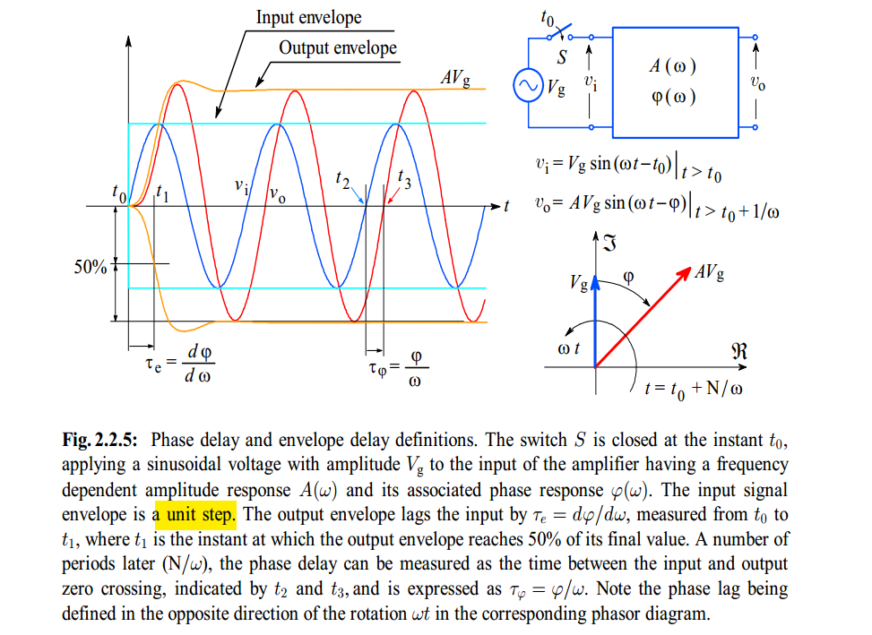
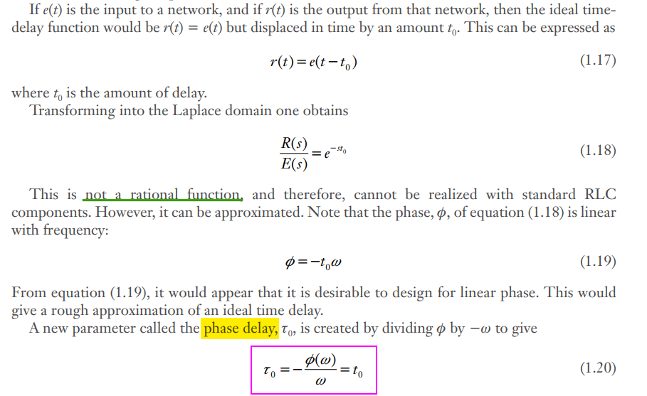
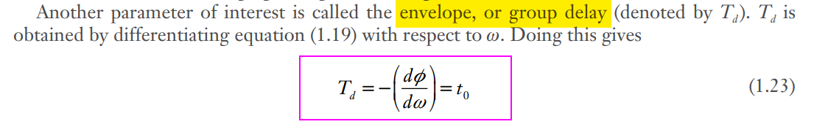
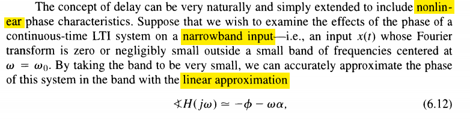
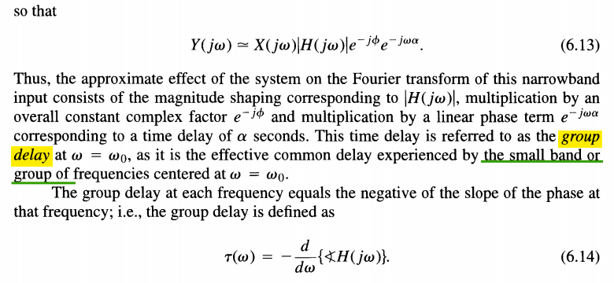
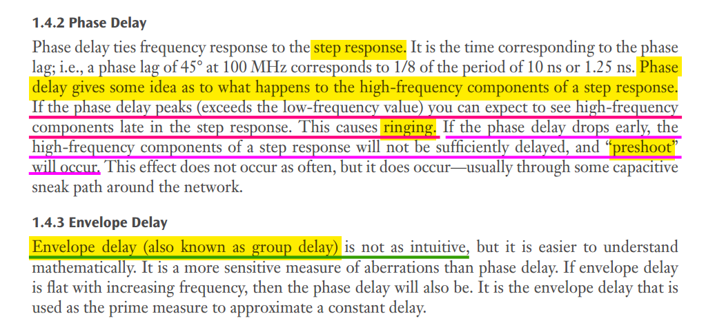

## phase delay

> Phase delay directly measures the device or system time delay of *individual sinusoidal frequency components* in the **steady-state conditions**

## group delay

---

## Group Delay vs Phase Delay

## Hilbert Envelope

*TODO* &#128197; 

## reference

Hollister, Allen L. *Wideband Amplifier Design*. Raleigh, NC: SciTech Pub., 2007.

Starič, P. & Margan, E.. (2006). Wideband Amplifiers. 10.1007/978-0-387-28341-8. [[pdf](https://www-f9.ijs.si/~margan/WBA3_4web/Wideband_Amplifiers_FPRL.pdf)]

Haykin, Simon. *Digital Communication Systems*. 1st edition. Wiley, 2013. [[pdf](https://rizkia.staff.telkomuniversity.ac.id/files/2016/02/Digital-Communication-Systems-Simon-S.-Haykin.pdf)]

Carlson, A. Bruce, and Paul B. Crilly. *Communication Systems: An Introduction to Signals and Noise in Electrical Communication*. 5th ed. Boston: McGraw-Hill Higher Education, 2010. [[pdf](https://eedmd.weebly.com/uploads/9/6/6/9/96692532/carlson.pdf)]

Pupalaikis, Peter. (2006). Group Delay and its Impact on Serial Data Transmission and Testing.  [[https://cdn.teledynelecroy.com/files/whitepapers/group_delay-designcon2006.pdf](https://cdn.teledynelecroy.com/files/whitepapers/group_delay-designcon2006.pdf)]

[Pupalaikis et al., “Eye Patterns in Scopes”, DesignCon, Santa Clara CA, 2005[https://cdn.teledynelecroy.com/files/whitepapers/eye_patterns_in_scopes-designcon_2005.pdf](https://cdn.teledynelecroy.com/files/whitepapers/eye_patterns_in_scopes-designcon_2005.pdf)]

Alan V. Oppenheim, Alan S. Willsky, and S. Hamid Nawab. 1996. Signals & systems (2nd ed.). Prentice-Hall, Inc., USA.

W. Bae, B. Nikolić and D. -K. Jeong, "Use of Phase Delay Analysis for Evaluating Wideband Circuits: An Alternative to Group Delay Analysis," in IEEE Transactions on Very Large Scale Integration (VLSI) Systems, vol. 25, no. 12, pp. 3543-3547, Dec. 2017, [[https://sci-hub.se/10.1109/TVLSI.2017.2747157](https://sci-hub.se/10.1109/TVLSI.2017.2747157)]

---

Young W. Lim. Group Delay and Phase Delay (1A) [[https://upload.wikimedia.org/wikiversity/en/e/e3/Misc.1.A.GroupPhase.20120719.pdf](https://upload.wikimedia.org/wikiversity/en/e/e3/Misc.1.A.GroupPhase.20120719.pdf)]

Group delay and phase delay example [[https://dspillustrations.com/pages/posts/misc/group-delay-and-phase-delay-example.html](https://dspillustrations.com/pages/posts/misc/group-delay-and-phase-delay-example.html)]

Arkonaire. What is the difference between phase delay and group delay?[[https://dsp.stackexchange.com/a/51532/59253](https://dsp.stackexchange.com/a/51532/59253)]

Andor Bariska. Time Machine, Anyone? [[https://www.dsprelated.com/showarticle/54.php](https://www.dsprelated.com/showarticle/54.php)]

Julius Orion Smith III. Introduction to Digital Filters: Phase and Group Delay [[https://www.dsprelated.com/freebooks/filters/Phase_Group_Delay.html](https://www.dsprelated.com/freebooks/filters/Phase_Group_Delay.html)]

Phase delay vs group delay: Common misconceptions. [[https://audiosciencereview.com/forum/index.php?threads/phase-delay-vs-group-delay-common-misconceptions.39591/](https://audiosciencereview.com/forum/index.php?threads/phase-delay-vs-group-delay-common-misconceptions.39591/)]

Dan Boschen. Why do we care about "Linear Phase Filters"? [[link](https://www.linkedin.com/posts/danboschen_why-do-we-care-about-linear-phase-filters-activity-7384371590643326977-NMEt?utm_source=share&utm_medium=member_desktop&rcm=ACoAAD-cuiIBDJ62eh9q3qTSSdslYXr-XMd8TGw)]

CC Chen. Why Group Delay Optimization? [[https://youtu.be/Lv7yO_LkKng](https://youtu.be/Lv7yO_LkKng)]

Group and Phase Delay Measurements with Vector Network Analyzer ZVR [[https://cdn.rohde-schwarz.com.cn/pws/dl_downloads/dl_application/application_notes/1ez35/1ez35_1e.pdf](https://cdn.rohde-schwarz.com.cn/pws/dl_downloads/dl_application/application_notes/1ez35/1ez35_1e.pdf)]
