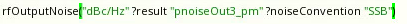
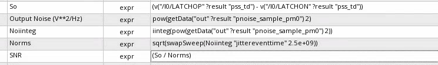

## Phase noise

The phase noise does not affect the total power in the signal, it only affects its distribution. 

- Without phase noise, $S_v(f)$ is a series of impulse functions at the harmonics of $f_o$. 
- With phase noise, the impulse functions spread, becoming fatter and shorter but retaining the same total power


> **line width**: corner frequency $f_{\Delta}$, where the power drops 3dB


## Lorentian Spectrum

A more precise analysis shows that the spectrum of a free-running oscillator does indeed have a Lorentian profile: 

1. it is **flat** for frequencies below a given corner frequency 
2. and rolls off as $1/f^2$  above it.

The spectrum of the signal $x(t + α(t))$ can be expressed as
$$
S_x(f)=\sum_{n}\left| X_n \right|^2\frac{\omega_0^2 n^2 c}{\frac{1}{4}\omega_0^4 n^4 c^2+(\omega+n\omega_0)^2}
$$
The integral in above equation around each harmonic is equal to the power of the harmonic itself $\left| X_n \right|^2$

 This means that the **excess phase noise** **DONT** change the energy of the signal; it just spreads its energy over the frequency spectrum, blurring the very sharp frequency impulse of an ideal noiseless oscillator.


## VCO varactor

> Two methods: 1. pss + pac; 2. pss+psp

### PSS + PAC


pss time domain


using the **0-harmonic**


### PSS + PSP


using **Y11** of `psp`


### results


> which are same


## VCO Phase Noise

### pnoise - timeaverage

1. *Direct Plot/Pnoise/Phase Noise* or

   

2. manually calculate by definition

   

3. `output noise` with unit `dBc`

   *Direct Plot/Pnoise/Output Noise Units:dBc/Hz and Noise convention: SSB*

   

> The above method 2 and 3 only apply to `timeaveage` pnoise simulation, 

### pnoise - sampled(jitter)/Edge Crossing


*Direct Plot/Pnoise/**Edge** Phase Noise* or


Another way, the following equation can also be used for `sampled(jitter)/Edge Crossing` 

```
PhaseNoise(dBc/Hz) = dB20( OutputNoise(V/sqrt(Hz)) / slopeCrossing / Tper*twoPi ) - dB10(2)
```

where `dB10(2)` is used to obtain SSB from DSB


### Output Noise of sampled(jitter) pnoise

The last section's `Output Noise (V**2/Hz)` can be obtained by *transient noise simulation*

The idea is that sample waveform with ideal clock, subtract DC offset, then fft(psd)

- samplesRaw = sample(wv)
- samplePost = samplesRaw - average(samplesRaw)
- Output Noise (V**2/Hz) = psd(samplePost)


**Expression**:


> The computation cost is typically very high, and the accuracy is lesser as compared to PSS/Pnoise


## Pnoise Sampled(jitter): Sampled Phase Option

- Identical to **noisetype=timedomain** in old GUI
- Use model:
  - Sampleds Per Period: number of ponits
  - Add Specific Points: specific time point, still time points




> pss beat freq = 5GHz
>
> pnoise sweeptype: absolute, from 100k to 2.5GHz


## Transient noise

### phase noise from transient noise analysis

1. The Phase Noise function is now available in the Direct Plot form (Results-Direct Plot-Main Form) after Transient Analysis is run
   - Absolute jitter Method
   - Direct Power Spectral Density Method
2. `PN` phase noise function
   - Absolute jitter Method
   - Direct Power Spectral Density Method

> **Absolute jitter Method**: Phase noise is defined as the power spectral density of the absolute jitter of an input waveform
>
> and **absolute jitter method** is the default method 


In below discussion, we only think about the `absolute jitter method`

### PSD and Phase Noise

> - phase noise is single-sideband
> - psd is double-sideband
> - Then the  ratio is **2**

#### By PSS_Pnoise

`jee`

```
rfEdgePhaseNoise(?result "pnoise_sample_pm0" ?eventList 'nil) + 10 * log10(2)
```

> convert **single-sideband** phase noise to psd by multiplying 2 or `10 * log10(2)`

#### By trannoise `PN` function

```
PN(clip(VT("/Out1") 2.60417e-08 0.000400052) "rising" 1.65 ?Tnom (1 / 3.84e+07) ?windowName "Rectangular" ?smooth 1 ?windowSize 15000 ?detrending "None" ?cohGain 1 ?methodType "absJitter")
```

> double-sideband psd

#### By trannoise `psd` and `abs_jitter` function

```
dB10(psd(abs_jitter(clip(VT("/Out1") 2.60417e-08 0.000400052) "rising" 1.65 ?Tnom (1 / 3.84e+07)) 2.60417e-08 0.000400052 15360 ?windowName "Rectangular" ?smooth 1 ?windowSize 15000 ?detrending "None" ?cohGain 1))
```

> double-sideband psd
>
> `abs_jitter` *Y-Unit* default is `rad`

#### Comparison


>  `PN`'s result is same with `psd`'s

### RMS value

- build the `abs_jitter` function with *seconds as the Y axis* and add the `stddev` function to determine the Jee jitter value
- or integrate psd

The RMS $x_{\text{RMS}}$ of a discrete domain signal $x(n)$ is given by
$$
x_{\text{RMS}}=\sqrt{\frac{1}{N}\sum_{n=0}^{N-1}|x(n)|^2}
$$
Inserting Parseval's theorem given by
$$
\sum_{n=0}^{N-1}|x(n)|^2=\frac{1}{N}\sum_{n=0}^{N-1}|X(k)|^2
$$
allows for computing the RMS from the spectrum $X(k)$ as
$$
x_{\text{RMS}}=\sqrt{\frac{1}{N^2}\sum_{n=0}^{N-1}|X(k)|^2}
$$


### Remarks

Cadence Spectre's `PN` function may call `abs_jitter` and `psd` function under the hood.


## reference

Article (11514536) Title: How to obtain a phase noise plot from a transient noise analysis
URL: [https://support.cadence.com/apex/ArticleAttachmentPortal?id=a1Od0000000nb1CEAQ](https://support.cadence.com/apex/ArticleAttachmentPortal?id=a1Od0000000nb1CEAQ)

Article (20500632) Title: How to simulate Random and Deterministic Jitters
URL: [https://support.cadence.com/apex/ArticleAttachmentPortal?id=a1O3w000009fiXeEAI](https://support.cadence.com/apex/ArticleAttachmentPortal?id=a1O3w000009fiXeEAI)

Tutorial on Scaling of the Discrete Fourier Transform and the Implied Physical Units of the Spectra of Time-Discrete Signals Jens Ahrens, Carl Andersson, Patrik Höstmad, Wolfgang Kropp URL: [https://appliedacousticschalmers.github.io/scaling-of-the-dft/AES2020_eBrief/](https://appliedacousticschalmers.github.io/scaling-of-the-dft/AES2020_eBrief/)
