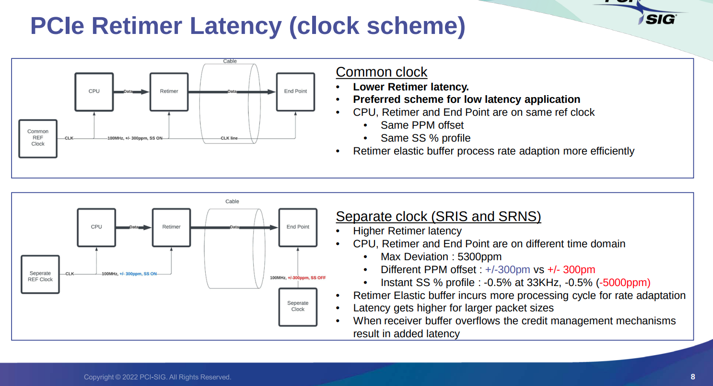
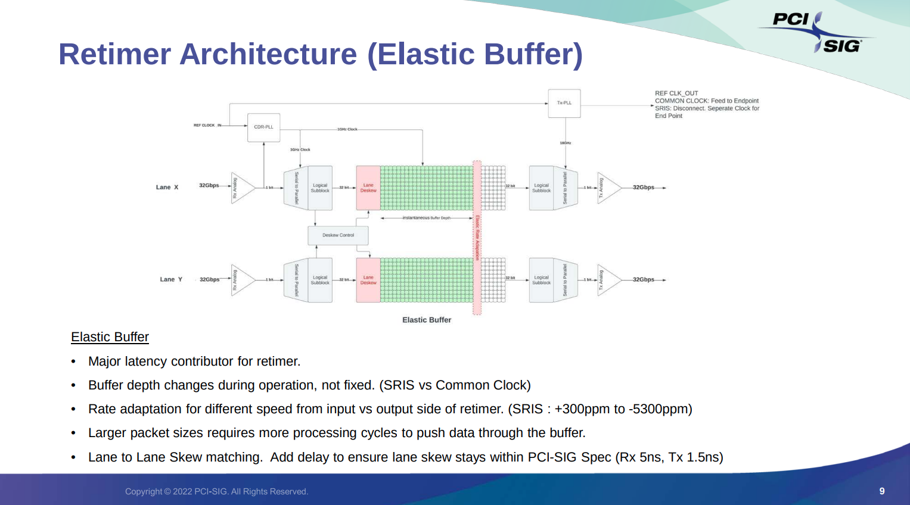
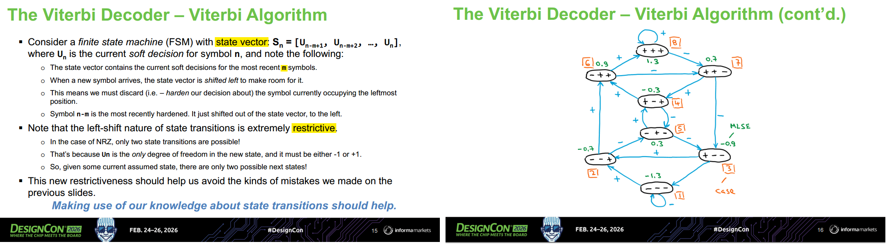
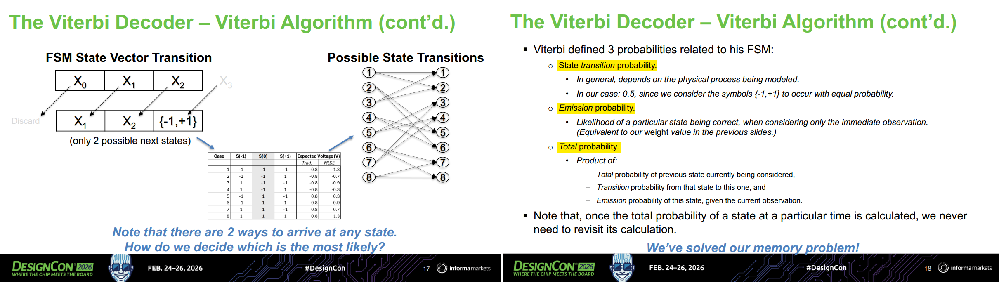
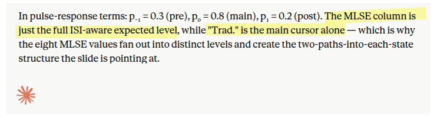
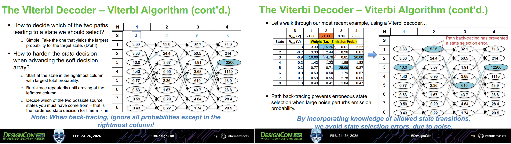
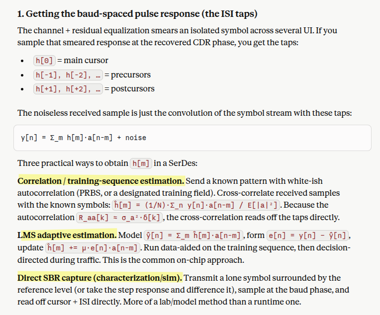
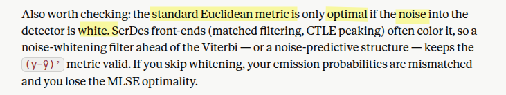
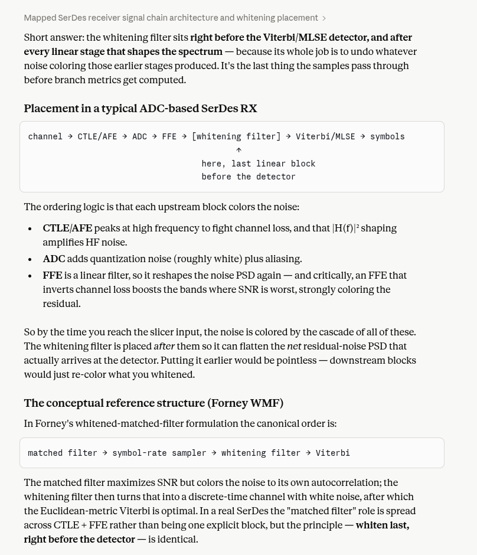
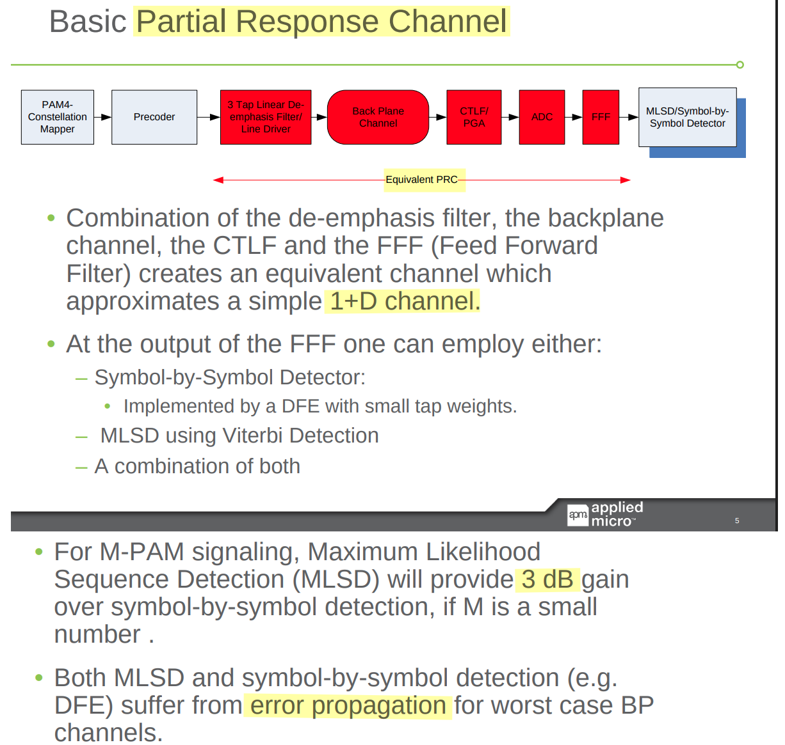

| Sublayer | Layer Type      | Primary Responsibility | Key Processes                                        |
| :------- | :-------------- | :--------------------- | :--------------------------------------------------- |
| **PCS**  | Digital         | Data Preparation       | Encoding (64b/66b), Scrambling, Alignment            |
| **PMA**  | Mixed-Signal    | Serialization & Timing | SerDes, Clock Recovery, Data Framing                 |
| **PMD**  | Analog/Physical | Medium Interface       | Signal Conversion (Optics/Electrical), MDI Interface |


## RX Elastic Buffer

> Joe Winkles, *Elastic Buffer Implementations in PCI Express Devices* [[pdf](https://www.docdroid.net/B4VS5Nv/mindshare-pcie-elastic-buffer-pdf)]
>
> wikibooks, Clock and Data Recovery/Buffer Memory (Elastic Buffer)/Cascades of Buffers and CDRs, delays and tolerance [[link](https://en.wikibooks.org/wiki/Clock_and_Data_Recovery/Buffer_Memory_(Elastic_Buffer)/Cascades_of_Buffers_and_CDRs,_delays_and_tolerance)]


bridge between ***Recovered Clock Domain*** and ***Local Clock Domain***


The periodic slips (under or overflows) depend on buffer depth $N$ and  is approximately given by
$$
T_{per} = \frac{N/2 - 1}{\Delta f}
$$

---


```matlab
f0 = 1;
f1 = f0*(1+300e-6); f2 = f0*(1-300e-6);
N_t0 = 1/(f1 - f2);  % 1.6667e+03
```


---

> T3S02_PCIe Retimer Latency






## Lane-to-Lane Skew

*TODO* &#128197;


## First In First Out (FIFO) 

> Clifford E. Cummings, *Simulation and Synthesis Techniques for Asynchronous FIFO Design with Asynchronous Pointer Comparisons* [[pdf](https://twins.ee.nctu.edu.tw/courses/ip_core_04/resource_pdf/cummings1_final.pdf)]

*TODO* &#128197;


## Scrambler

*TODO* &#128197;


## Link Training and Initialization (LTSSM)

*TODO* &#128197;


## Viterbi-based MLSD

> M. Emami Meybodi, H. Gomez, Y. -C. Lu, H. Shakiba and A. Sheikholeslami, "Design and Implementation of an On-Demand Maximum-Likelihood Sequence Estimation (MLSE)," in IEEE Open Journal of Circuits and Systems, vol. 3, pp. 97-108, 2022 [[https://sci-hub.jp/10.1109/OJCAS.2022.3173686]](https://sci-hub.jp/10.1109/OJCAS.2022.3173686)
>
> Zaman, Arshad Kamruz (2019). A Maximum Likelihood Sequence Equalizing Architecture Using Viterbi Algorithm for ADC-Based Serial Link. Undergraduate Research Scholars Program. Available electronically from [[https://hdl.handle.net/1969.1/166485](https://hdl.handle.net/1969.1/166485)]
>
> S. Song, K. D. Choo, T. Chen, S. Jang, M. P. Flynn and Z. Zhang, "A Maximum-Likelihood Sequence Detection Powered ADC-Based Serial Link," in *IEEE Transactions on Circuits and Systems I: Regular Papers*, vol. 65, no. 7, pp. 2269-2278, July 2018 [[https://sci-hub.jp/10.1109/TCSI.2017.2775619](https://sci-hub.jp/10.1109/TCSI.2017.2775619)]
>
> Vineel Kumar Veludandi. Maximum likelihood sequence estimation (MLSE) using the Viterbi algorithm [[https://github.com/vineel49/mlse](https://github.com/vineel49/mlse)]
>
> David Banas, Keysight, DesignCon 2026, *Tutorial – Understanding the Viterbi Decoder*
>
> A. C. Singer, N. R. Shanbhag and H. -m. Bae, "Electronic dispersion compensation," in *IEEE Signal Processing Magazine*, vol. 25, no. 6, pp. 110-130, November 2008 [[https://shanbhag.ece.illinois.edu/publications/singer-spm-2008.pdf](https://shanbhag.ece.illinois.edu/publications/singer-spm-2008.pdf)]
>
> —, ISSCC2007 T10: Fundamentals of Electronic Dispersion Compensation (EDC)


**Maximum-Likelihood Sequence Detection** performed by **Viterbi** on the **ISI trellis** induced by the channel


### Simple soft-decision voting


Simple soft-decision voting can use more information than a slicer, but without a trellis/path-consistency rule, it can create impossible or unstable decision histories.


### Viterbi Decoder






Pre-cursor $h_{-1}=0.3$, Current (main) cursor $h_0=0.8$, Post-cursor $h_1=0.2$






> **trellis depth = N = 3** (consistent with 8 states); the **4** is the number of observation samples in that particular walk-through, i.e. the time axis — a different thing that unfortunately shares the label "N" on the slide


---

> David Banas, PyBERT  [[https://github.com/capn-freako/PyBERT/blob/master/src/pybert/models/viterbi.py](https://github.com/capn-freako/PyBERT/blob/master/src/pybert/models/viterbi.py)]


As currently built, `ViterbiDecoder_ISI` models **post-cursor ISI only**. `_states[ix][-1]` selecting the last element as the current symbol is consistent with that

```python
# https://github.com/capn-freako/PyBERT/blob/master/src/pybert/models/bert.py

def my_run_simulation(self, initial_run: bool = False, update_plots: bool = True,
                      aborted_sim: Optional[Callable[[], bool]] = None):
        if self.rx_viterbi_fec:

        else:
            self.status = "Running Viterbi..."
            L = self.L
            sigma = self.rn
            decoder = ViterbiDecoder_ISI(L, N, sigma, pulse_resp_samps)
            path = decoder.decode(list(sig_samps), dbg_dict=self.dbg_dict_viterbi)
            _states = decoder.states
            symbols_viterbi = list(map(lambda ix: _states[ix][-1], path))
            bits_out_viterbi = sum(list(map(lambda ss: dfe.decide(ss)[1], symbols_viterbi)), [])

        n_errs_viterbi, bit_errs_viterbi = calc_ber(bits_out_viterbi)
```

- **DFE (kept light):** recover timing, slice levels→bits, and optionally trim the *far* ISI tail beyond the trellis window — but **not** aggressively cancel the near post-cursors.
- **Viterbi:** handle the near post-cursor ISI (the cursor + N−1 taps) that was intentionally *left in*, via MLSE — which tolerates a closed eye where the DFE's hard decisions would error-propagate


| Group             | Members                                                | When set                     | Role                                           |
| ----------------- | ------------------------------------------------------ | ---------------------------- | ---------------------------------------------- |
| **Static model**  | `_states`, `_expecteds`, `_trans`, `_sigma`, `_v_prob` | once, in `__init__`          | the time-invariant channel/decoder description |
| **Dynamic state** | `_trellis`                                             | mutated every `step_trellis` | the evolving survivor metrics/back-pointers    |

All three derive purely from the constructor args `(L, N, pulse_resp_samps)`:

- **`_states`** — the `Lᴺ` symbol-window combinations (`all_combs`). Fixed because the *alphabet* and *memory depth* don't change.
- **`_expecteds`** — the noiseless expected sample per state, `Σ h[n]·s[-(n+1)]`. Fixed because it bakes in `pulse_resp_samps` (the ISI taps).
- **`_trans`** — the shift-register adjacency (which state can follow which), as a row-normalized PMF. Fixed because the trellis *topology* is structural, independent of data.


```python
# https://github.com/capn-freako/PyBERT/blob/master/src/pybert/models/viterbi.py

class ViterbiDecoder_ISI(ViterbiDecoder[State_ISI, float]):
    """
    Viterbi decoder using ISI to define observation probabilities.
    """

    # pylint: disable=too-many-locals
    def __init__(self, L: int, N: int, sigma: float, pulse_resp_samps: Rvec):
        """
        Args:
            L: Number of symbol voltage levels.
            N: Number of symbols per state.
            sigma: Standard deviation of Gaussian voltage noise (V).
            pulse_resp_samps: Upstream channel pulse response samples,
                one per UI, beginning with cursor (V).
                (Must have length >= ``N``!)

        """

vs = np.linspace(-2, 2, 4_000)        # voltage-error grid: −2..+2 V, 4000 pts → ~1 mV spacing
v_prob = sp.interpolate.interp1d(
    vs,
    [1e-3 * np.exp(-(v**2)/(2*sigma**2)) / np.sqrt(TWOPI*sigma**2) for v in vs],
    bounds_error=False, fill_value=0)

# bounds_error=False, fill_value=0 → any error magnitude beyond ±2 V returns probability 0 (treated as impossible — way outside the noise distribution)

    @property
    def v_prob(self):  # pylint: disable=missing-function-docstring
        return self._v_prob

    def prob(self, s: int, x: float) -> float:
        """
        Probability of state at index ``s`` given observation ``x``.
        """
        return self.v_prob(x - self.expectation(s))
```

$$
\mathcal{N}(v;0,\sigma^2)=\dfrac{1}{\sqrt{2\pi\sigma^2}}e^{-v^2/2\sigma^2}
$$

`v_prob(δ)` returns the probability (density) of seeing a noise voltage error `δ` under a zero-mean Gaussian with standard deviation `sigma`. It's the **emission probability** of the Viterbi algorithm.

In short: `v_prob` is the decoder's noise model — a fast Gaussian-likelihood lookup that converts "how far is this sample from what state `s` predicts?" into "how probable is that?", which is exactly the data-driven term the Viterbi trellis needs


```python
# https://github.com/capn-freako/PyBERT/blob/master/src/pybert/models/viterbi.py

class ViterbiDecoder_ISI(ViterbiDecoder[State_ISI, float]):
    def __init__(self, L: int, N: int, sigma: float, pulse_resp_samps: Rvec):
        # Build initial trellis.
        trellis = [[(1 / num_states, 0)] * num_states] * N
```

| size                               | set by              |                                       |
| ---------------------------------- | ------------------- | ------------------------------------- |
| depth (`len(trellis)`, # columns)  | `N`                 | `N` UIs (cursor + `N−1` post-cursors) |
| width (`len(trellis[-1])`, # rows) | `Lᴺ` = `num_states` | `L` and `N` via `all_combs`           |

1. Length of returned list gives trellis depth
2. Length of all inner lists should equal ``len(states)``.
3. Each location in the trellis matrix contains the **probability** and **previous state index** for the corresponding state  `( probability ,  prev_state_index )`


```python
# https://github.com/capn-freako/PyBERT/blob/master/src/pybert/models/viterbi.py

class ViterbiDecoder(ABC, Generic[S, X]):
    """
    Abstract definition of a Viterbi decoder.
    """
    
    def step_trellis(self, x: X, priming: bool = False) -> int:
    """
    Shift the trellis one column left, using the given observation sample.

    Args:
        x: The new observation sample.

    Keyword Args:
        priming: Don't perform backtrace when True.
            Default: False

    Returns:
        The decided state index of the exiting (i.e. - leftmost) column.
    """

    trellis = self.trellis
    num_states = len(trellis[-1])

    # Shift trellis contents one column left.
    for col in range(len(trellis) - 1):
        trellis[col] = trellis[col + 1]

    # Calculate maximum state probabilities, along w/ previous state, for new rightmost column.
    probs = np.zeros(num_states)
    prevs = np.arange(num_states)
    for r in range(num_states):
        new_probs = np.array(
            [0 if self.trans[r][s] == 0
             else trellis[-1][r][0] * self.trans[r][s] * self.prob(s, x)
             for s in range(num_states)])
        prevs = np.where(new_probs > probs, [r] * num_states, prevs)
        probs = np.maximum(new_probs, probs)

    probs /= probs.sum()
    trellis[-1] = list(zip(probs, prevs))

    prev = 0
    if not priming:
    	prev = self.path[0]

    return prev
```

The **core Viterbi recursion**  `trellis[-1][r][0] * self.trans[r][s] * self.prob(s, x)` — the candidate path metric for arriving at current state `s` through predecessor `r`
$$
P(r \to s \mid x) = \underbrace{\text{trellis}[-1][r][0]}{\text{(1) survivor prob of } r} \times \underbrace{\text{trans}[r][s]}{\text{(2) transition } r\to s} \times \underbrace{\text{prob}(s, x)}_{\text{(3) emission of } s}
$$

- **`trellis[-1][r][0]` — the survivor probability of the predecessor state `r`**
- **`self.trans[r][s]` — the transition probability `r → s`**
- **`self.prob(s, x)` — the emission probability of current state `s` given observation `x`**

$$
P(\text{path ending } r{\to}s,\ \text{obs}=x) = P(r)\cdot P(s\mid r)\cdot P(x\mid s)
$$


`decode()` has three phases

| Phase     | Samples        | Decisions emitted?                               |
| --------- | -------------- | ------------------------------------------------ |
| **Prime** | `samps[0 : N]` | No — just fill the depth-N window                |
| **Run**   | `samps[N : ]`  | Yes — one decided symbol per step                |
| **Purge** | (none)         | Flush the `N−1` symbols still held in the window |

`path` performs the **back-trace** (trace-back) step of the Viterbi algorithm: starting from the most-likely state in the newest column, it follows the back-pointers leftward through the trellis to recover the maximum-likelihood **sequence of states** held in the current window.

```python
# https://github.com/capn-freako/PyBERT/blob/master/src/pybert/models/viterbi.py

class ViterbiDecoder(ABC, Generic[S, X]):
    """
    Abstract definition of a Viterbi decoder.
    """

    @property
    def path(self) -> list[int]:
        """
        Maximum likelihood forward path through the trellis.

        Notes:
            1. First element in returned list corresponds to the time
            just before the first trellis column.
            2. The decided state of the final trellis column is *not* included.
        """

        trellis = self.trellis
        trellis_depth = len(trellis)

        # Starting with highest probability final state, backtrack through trellis.
        prevs = [trellis[-1][np.argmax(list(map(lambda pr: pr[0], trellis[-1])))][1]]
        for ix in range(2, trellis_depth + 1):
            prevs.append(trellis[-ix][prevs[-1]][1])
        prevs.reverse()
        return prevs
```


At the end you drain the `N−1` symbols still sitting in the trellis

```python
# https://github.com/capn-freako/PyBERT/blob/master/src/pybert/models/viterbi.py

class ViterbiDecoder(ABC, Generic[S, X]):
 
    def decode(self, samps: list[X], dbg_dict: Optional[dict[str, Any]] = None) -> list[int]:

        # Purge the trellis.
        states.extend(self.path[1:])
        states.append(int(np.argmax(list(map(fst, trellis[-1])))))
```


Standalone demo

```python
"""
Standalone demo: run the PyBERT Viterbi (ISI) decoder on a synthetic link.

Builds a ``ViterbiDecoder_ISI`` for a 2-level (NRZ) channel with strong
post-cursor ISI, generates a noisy received waveform, decodes it via maximum
likelihood sequence estimation (MLSE), and compares the error count against a
naive symbol-by-symbol slicer.

Run (from the repository root)::

    PYTHONPATH=src python examples/run_viterbi.py

This example depends only on ``numpy``/``scipy`` -- not on the optional
``pyibisami`` dependency.
"""

import numpy as np

from pybert.models.viterbi import ViterbiDecoder_ISI

rng = np.random.default_rng(42)

# --- Link / decoder parameters ---
L = 2                                # NRZ (2 levels: -1, +1)
N = 2                                # symbols of memory per state
sigma = 0.22                         # Gaussian noise std-dev (V)
pulse_resp = np.array([1.0, 0.8])    # cursor + strong post-cursor ISI tap (V/UI)

dec = ViterbiDecoder_ISI(L=L, N=N, sigma=sigma, pulse_resp_samps=pulse_resp)
expecteds = [dec.expectation(i) for i in range(len(dec.states))]
print(f"States ({len(dec.states)}): {dec.states}")
print(f"Expected observations:     {np.round(expecteds, 3)}")
print(f"State Transition Probability matrix:\n{dec.trans}\n")

# --- Generate a random NRZ symbol stream (-1/+1) ---
n_syms = 5000
levels = np.array([-1.0, 1.0])
tx = rng.choice(levels, size=n_syms)

# --- Pass through the ISI channel + add noise to make the received waveform ---
clean = np.convolve(tx, pulse_resp)[:n_syms]
rx = clean + rng.normal(0.0, sigma, size=n_syms)

# --- Decode ---
state_idxs = dec.decode(list(rx))
# Each decoded state is an N-symbol vector; the current symbol is its last element.
decoded = np.array([dec.states[i][-1] for i in state_idxs])

# Align (decoder output corresponds to the symbol stream) and count errors.
m = min(len(tx), len(decoded))
errs = int(np.sum(tx[:m] != decoded[:m]))

# --- Compare against a naive symbol-by-symbol slicer (threshold at 0) ---
slicer = np.where(rx > 0, 1.0, -1.0)
slicer_errs = int(np.sum(tx[:m] != slicer[:m]))

idx_erros = np.where(tx[:m] != slicer[:m])[0]

print(f"Symbols decoded     : {m}")
print(f"Viterbi MLSE errors : {errs}  (BER ~ {errs / m:.3g})")
print(f"Naive slicer errors : {slicer_errs}  (BER ~ {slicer_errs / m:.3g})")

print("\nFirst 10 errors (index, original symbol, decoded symbol, slicer symbol):")
print("index: ", idx_erros[:10])
print("original symbols: ", tx[idx_erros[:10]])
print("decoded symbols: ", decoded[idx_erros[:10]])
print("slicer symbols:  ", slicer[idx_erros[:10]])


#  [0.  0.  0.5 0.5]
#  [0.5 0.5 0.  0. ]
#  [0.  0.  0.5 0.5]]

# Decoding 5000 samples with trellis depth 2 and 4 states...
# Symbols decoded     : 5000
# Viterbi MLSE errors : 0  (BER ~ 0)
# Naive slicer errors : 452  (BER ~ 0.0904)

# First 10 errors (index, original symbol, decoded symbol, slicer symbol):
# index:  [ 21  71  75  91 101 102 104 113 116 126]
# original symbols:  [-1. -1. -1.  1. -1.  1.  1. -1. -1. -1.]
# decoded symbols:  [-1. -1. -1.  1. -1.  1.  1. -1. -1. -1.]
# slicer symbols:   [ 1.  1.  1. -1.  1. -1. -1.  1.  1.  1.]
```


---

---




> Proakis, John G., and Masoud Salehi. *Digital Communications. 5th ed. McGraw-Hill, 2008.* [[pdf](https://daskalakispiros.com/files/Ebooks/digital-communication-proakis-salehi-5th-edition.pdf)]



***whitening filter***




### Partial Response

> David Johns, Partial Response and Viterbi Detection [[https://www.eecg.utoronto.ca/~johns/ece1392/slides/partial_response.pdf](https://www.eecg.utoronto.ca/~johns/ece1392/slides/partial_response.pdf)]
>
> Dariush Dabiri , Enabling Improved DSP Based Receivers for 100G Backplane [[https://www.ieee802.org/3/bj/public/sep11/dabiri_01_0911.pdf](https://www.ieee802.org/3/bj/public/sep11/dabiri_01_0911.pdf)]


Partial Response Signaling (PRS) and Maximum Likelihood Sequence Detection (MLSD) are paired together to maximize data rates in bandwidth-limited, noisy channels like fiber optics, magnetic hard drives, and high-speed backplanes




## Feed-Forward Error Correction (FEC)

> Cathy Liu, Broadcom. DesignCon 2024: *200+ Gbps Ethernet Forward Error Correction (FEC) Analysis*
>
> —, Broadcom, DesignCon 2026 *What is FEC and how do I use it in 200G/400G/800G/1.6T Ethernet?*

*TODO* &#128197;

| Feature              | Intersymbol Interference (ISI)                            | Forward Error Correction (FEC)                            |
| :------------------- | :-------------------------------------------------------- | :-------------------------------------------------------- |
| **Definition**       | A signal distortion where symbols overlap.                | A coding technique to detect/fix bit errors.              |
| **Origin**           | **Unintentional** (caused by channel physics).            | **Intentional** (added by the system designer).           |
| **Data Impact**      | Smears pulses together, making them unreadable.           | Adds redundant bits to protect original data.             |
| **Primary Cause**    | Multipath fading and limited bandwidth.                   | Noise, interference, and signal attenuation.              |
| **Relationship**     | Negative dependency (interference).                       | Positive dependency (structured redundancy).              |
| **Typical Solution** | Equalization or Pulse Shaping (e.g., Root-Raised Cosine). | Block Codes (Reed-Solomon) or Convolutional Codes (LDPC). |
| **Goal**             | To **clean** the signal before decoding.                  | To **recover** the data after decoding errors.            |


---

> David Banas, PyBERT [[https://github.com/capn-freako/PyBERT/blob/master/src/pybert/models/fec.py](https://github.com/capn-freako/PyBERT/blob/master/src/pybert/models/fec.py)]


*TODO* &#128197;


## Error-Correcting Codes (ECC)

> Takayuki Kawahara, ISSCC2007 T5: *Error-Correcting Codes for Memories*

*TODO* &#128197;


## PCIe® Retimer Latency

*TODO* &#128197;

## reference

John Swindle, *PCIe 1.1 Phy Design Considerations*

Hidehiro Toyoda, Shinji Nishimura, and Masato Shishikura, *PMD architecture with skew compensation mechanism for parallel link* [[https://www.ieee802.org/3/hssg/public/nov06/nishimura_01_1106.pdf](https://www.ieee802.org/3/hssg/public/nov06/nishimura_01_1106.pdf)]

Kamesh Velmail, Samsung, *Challenges, Complexities and Advanced Verification Techniques in Stress Testing of Elastic Buffer in High Speed SERDES IPs* [[pdf](https://dvcon-proceedings.org/wp-content/uploads/challenges-complexities-and-advanced-verification-techniques-in-stress-testing-of-elastic-buffer-in-high-speed-serdes-ips-paper.pdf)]

Marianne Nourzad (Intel), DesignCon 2022. Transmitter Jitter Measurement Methodologies for PAM-4 IOs

