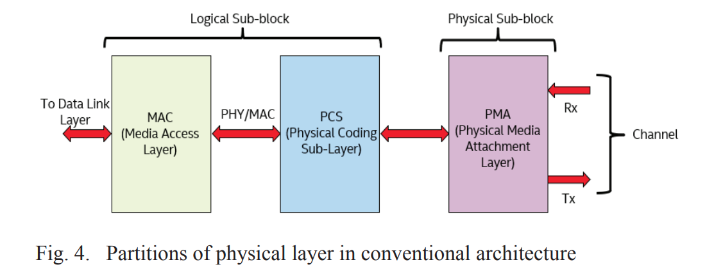
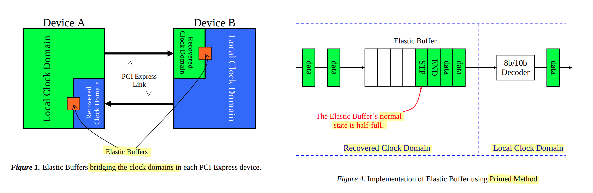
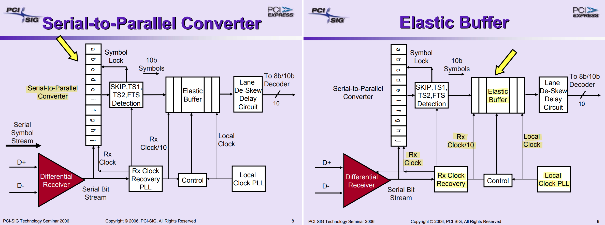
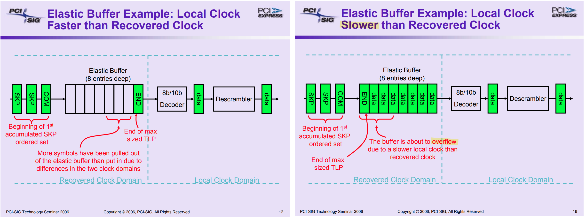
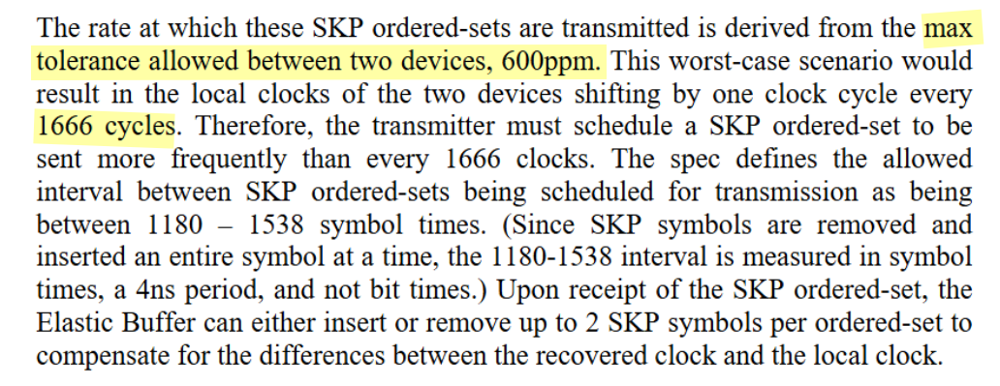
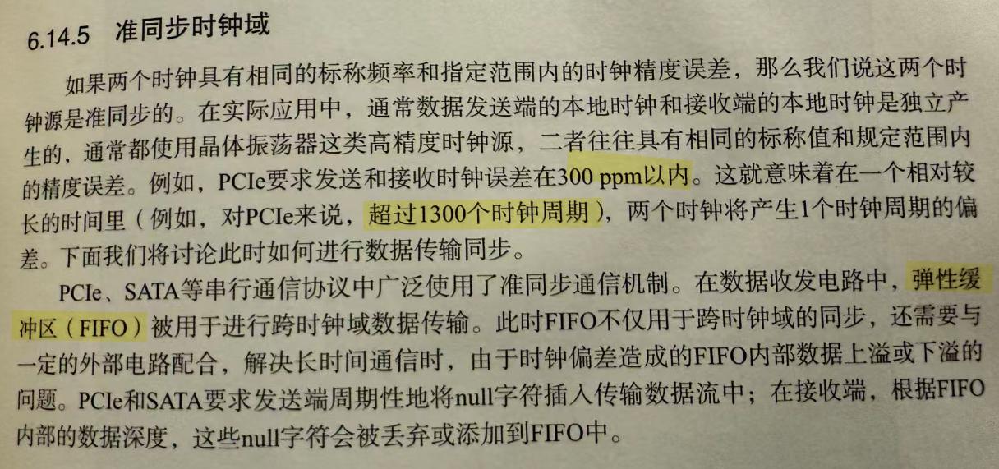
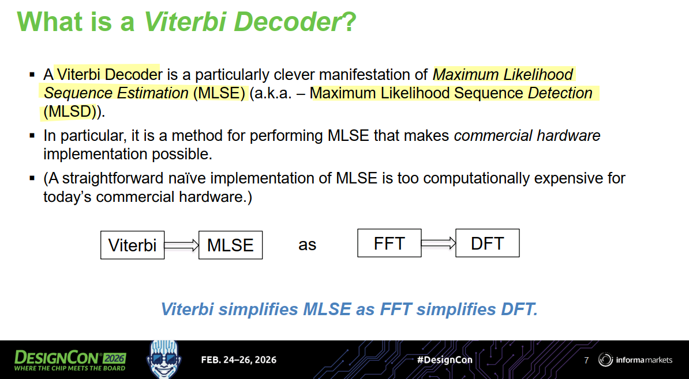
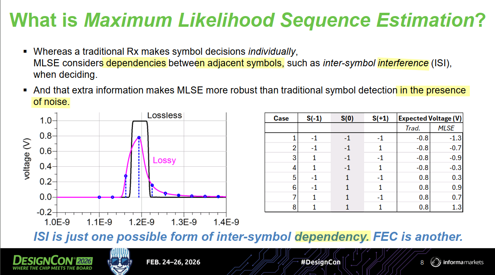
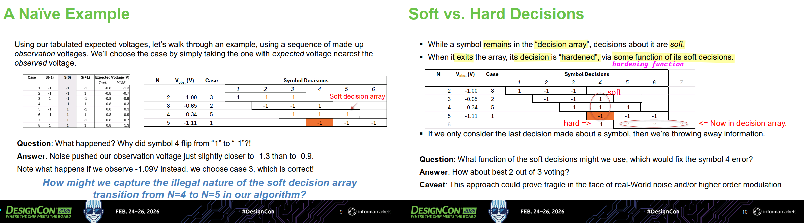
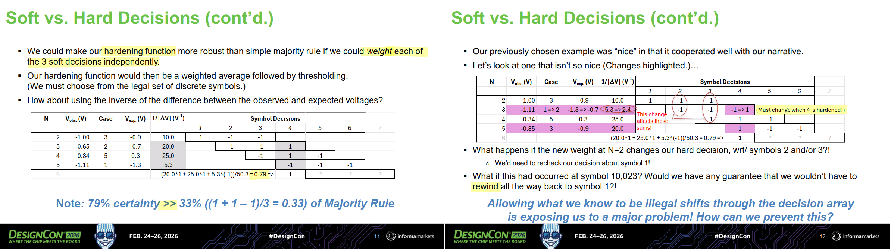

| Sublayer | Layer Type      | Primary Responsibility | Key Processes                                        |
| :------- | :-------------- | :--------------------- | :--------------------------------------------------- |
| **PCS**  | Digital         | Data Preparation       | Encoding (64b/66b), Scrambling, Alignment            |
| **PMA**  | Mixed-Signal    | Serialization & Timing | SerDes, Clock Recovery, Data Framing                 |
| **PMD**  | Analog/Physical | Medium Interface       | Signal Conversion (Optics/Electrical), MDI Interface |


## RX Elastic Buffer

> Joe Winkles, *Elastic Buffer Implementations in PCI Express Devices* [[pdf](https://www.docdroid.net/B4VS5Nv/mindshare-pcie-elastic-buffer-pdf)]
>
> wikibooks, Clock and Data Recovery/Buffer Memory (Elastic Buffer)/Cascades of Buffers and CDRs, delays and tolerance [[link](https://en.wikibooks.org/wiki/Clock_and_Data_Recovery/Buffer_Memory_(Elastic_Buffer)/Cascades_of_Buffers_and_CDRs,_delays_and_tolerance)]



bridge between ***Recovered Clock Domain*** and ***Local Clock Domain***





The periodic slips (under or overflows) depend on buffer depth $N$ and  is approximately given by
$$
T_{per} = \frac{N/2 - 1}{\Delta f}
$$

---



```matlab
f0 = 1;
f1 = f0*(1+300e-6); f2 = f0*(1-300e-6);
N_t0 = 1/(f1 - f2);  % 1.6667e+03
```




## Lane-to-Lane Skew

*TODO* &#128197;


## First In First Out (FIFO) 

> Clifford E. Cummings, *Simulation and Synthesis Techniques for Asynchronous FIFO Design with Asynchronous Pointer Comparisons* [[pdf](https://twins.ee.nctu.edu.tw/courses/ip_core_04/resource_pdf/cummings1_final.pdf)]

*TODO* &#128197;


## Scrambler

*TODO* &#128197;


## Link Training and Initialization (LTSSM)

*TODO* &#128197;


## Feed-Forward Error Correction (FEC)

> Cathy Liu, Broadcom. DesignCon 2024: *200+ Gbps Ethernet Forward Error Correction (FEC) Analysis*
>
> —, Broadcom, DesignCon 2026 *What is FEC and how do I use it in 200G/400G/800G/1.6T Ethernet?*

*TODO* &#128197;

| Feature              | Intersymbol Interference (ISI)                            | Forward Error Correction (FEC)                            |
| :------------------- | :-------------------------------------------------------- | :-------------------------------------------------------- |
| **Definition**       | A signal distortion where symbols overlap.                | A coding technique to detect/fix bit errors.              |
| **Origin**           | **Unintentional** (caused by channel physics).            | **Intentional** (added by the system designer).           |
| **Data Impact**      | Smears pulses together, making them unreadable.           | Adds redundant bits to protect original data.             |
| **Primary Cause**    | Multipath fading and limited bandwidth.                   | Noise, interference, and signal attenuation.              |
| **Relationship**     | Negative dependency (interference).                       | Positive dependency (structured redundancy).              |
| **Typical Solution** | Equalization or Pulse Shaping (e.g., Root-Raised Cosine). | Block Codes (Reed-Solomon) or Convolutional Codes (LDPC). |
| **Goal**             | To **clean** the signal before decoding.                  | To **recover** the data after decoding errors.            |


## MLSD & Viterbi Decoder

> M. Emami Meybodi, H. Gomez, Y. -C. Lu, H. Shakiba and A. Sheikholeslami, "Design and Implementation of an On-Demand Maximum-Likelihood Sequence Estimation (MLSE)," in IEEE Open Journal of Circuits and Systems, vol. 3, pp. 97-108, 2022 [[https://sci-hub.jp/10.1109/OJCAS.2022.3173686]](https://sci-hub.jp/10.1109/OJCAS.2022.3173686)
>
> Zaman, Arshad Kamruz (2019). A Maximum Likelihood Sequence Equalizing Architecture Using Viterbi Algorithm for ADC-Based Serial Link. Undergraduate Research Scholars Program. Available electronically from [[https://hdl.handle.net/1969.1/166485](https://hdl.handle.net/1969.1/166485)]
>
> S. Song, K. D. Choo, T. Chen, S. Jang, M. P. Flynn and Z. Zhang, "A Maximum-Likelihood Sequence Detection Powered ADC-Based Serial Link," in *IEEE Transactions on Circuits and Systems I: Regular Papers*, vol. 65, no. 7, pp. 2269-2278, July 2018 [[https://sci-hub.jp/10.1109/TCSI.2017.2775619](https://sci-hub.jp/10.1109/TCSI.2017.2775619)]
>
> Vineel Kumar Veludandi. Maximum likelihood sequence estimation (MLSE) using the Viterbi algorithm [[https://github.com/vineel49/mlse](https://github.com/vineel49/mlse)]
>
> David Banas, Keysight, DesignCon 2026, *Understanding the Viterbi Decoder*




### MLSD







*symbol decision (N=3)* must change when *symbol 4* is hardened, {-1,-1,**-1**} -> {-1,-1,**1**}, and its Vexp -1.3 -> -0.7. In this way,  **rewind** take affect, weighted sum of hardening function symbol 3 may change and its hard decision may change also. 

### Viterbi Decoder

*TODO* &#128197;


## reference

John Swindle, *PCIe 1.1 Phy Design Considerations*

Hidehiro Toyoda, Shinji Nishimura, and Masato Shishikura, *PMD architecture with skew compensation mechanism for parallel link* [[https://www.ieee802.org/3/hssg/public/nov06/nishimura_01_1106.pdf](https://www.ieee802.org/3/hssg/public/nov06/nishimura_01_1106.pdf)]

Kamesh Velmail, Samsung, *Challenges, Complexities and Advanced Verification Techniques in Stress Testing of Elastic Buffer in High Speed SERDES IPs* [[pdf](https://dvcon-proceedings.org/wp-content/uploads/challenges-complexities-and-advanced-verification-techniques-in-stress-testing-of-elastic-buffer-in-high-speed-serdes-ips-paper.pdf)]

