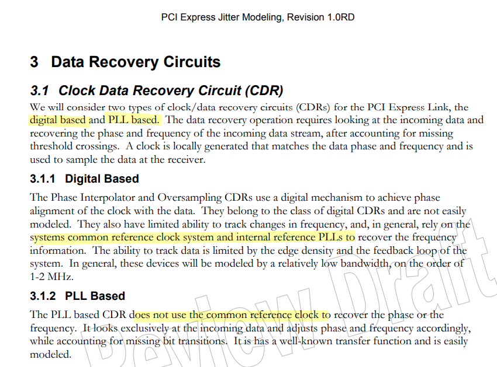
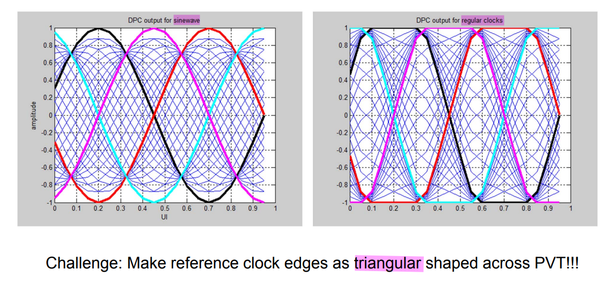
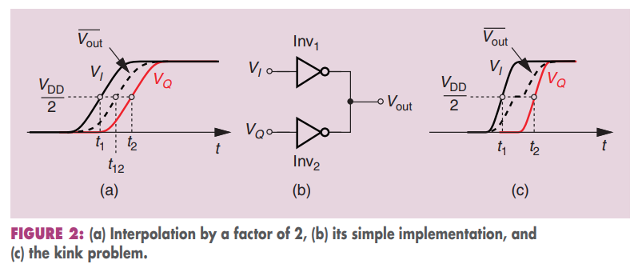

## PI vs. PLL based CDR

> PCI Express Jitter Modeling Revision 1.0RD July 14, 2004

## Phase Interpolator (PI)

!!! Clock Edges

And for a phase interpolator, you need those reference clocks to be completely the opposite. Ideally they would be **triangular** shaped

> *four input clocks given by the cyan, black, magenta, red* 

> John T. Stonick, ISSCC 2011 tutorial. "DPLL Based Clock and Data Recovery" [[https://www.nishanchettri.com/isscc-slides/2011%20ISSCC/TUTORIALS/ISSCC2011Visuals-T5.pdf](https://www.nishanchettri.com/isscc-slides/2011%20ISSCC/TUTORIALS/ISSCC2011Visuals-T5.pdf)]

***kink problem***

> B. Razavi, **"The Design of a Phase Interpolator [The Analog Mind],"** IEEE Solid-State Circuits Magazine, Volume. 15, Issue. 4, pp. 6-10, Fall 2023.([https://www.seas.ucla.edu/brweb/papers/Journals/BR_SSCM_4_2023.pdf](https://www.seas.ucla.edu/brweb/papers/Journals/BR_SSCM_4_2023.pdf))

## reference

Cortiula A, Menin D, Bandiziol A, Driussi F, Palestri P. Modeling of Phase-Interpolator-Based Clock and Data Recovery for High-Speed PAM-4 Serial Interfaces. *Electronics*. 2025; [[https://www.mdpi.com/2079-9292/14/10/1979](https://www.mdpi.com/2079-9292/14/10/1979)]

G. Souliotis, A. Tsimpos and S. Vlassis, "Phase Interpolator-Based Clock and Data Recovery With Jitter Optimization," in *IEEE Open Journal of Circuits and Systems*, vol. 4, pp. 203-217, 2023 [[https://ieeexplore.ieee.org/document/10184121](https://ieeexplore.ieee.org/document/10184121)]
