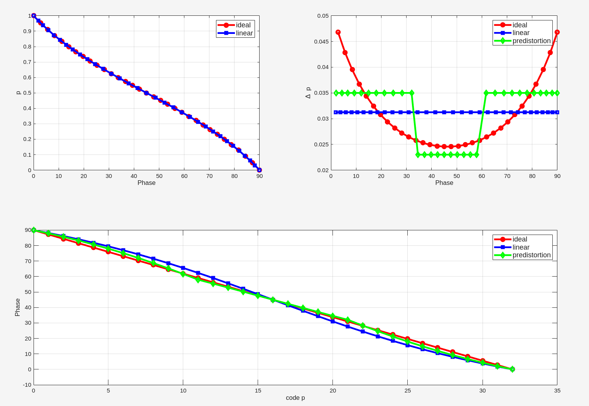
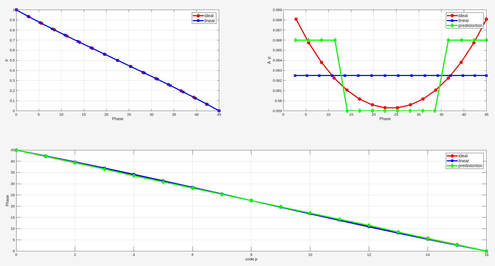
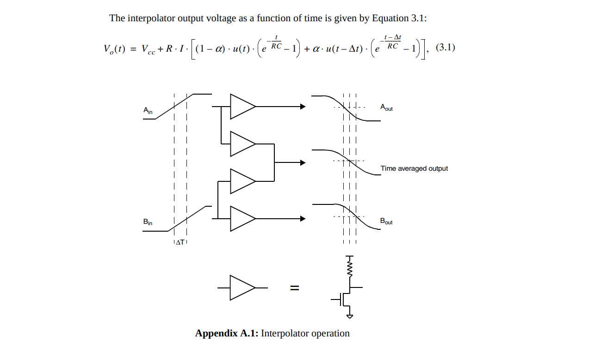
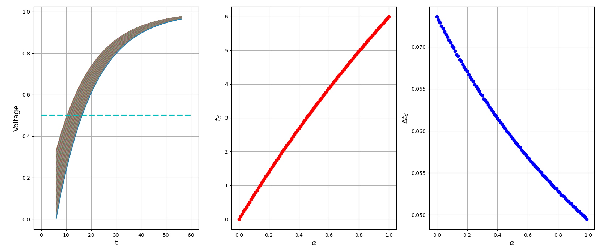

## Phase Interpolator (PI)

!!! Clock Edges

And for a phase interpolator, you need those reference clocks to be completely the opposite. Ideally they would be **triangular** shaped


> *four input clocks given by the cyan, black, magenta, red* 


> John T. Stonick, ISSCC 2011 tutorial. "DPLL Based Clock and Data Recovery" [[https://www.nishanchettri.com/isscc-slides/2011%20ISSCC/TUTORIALS/ISSCC2011Visuals-T5.pdf](https://www.nishanchettri.com/isscc-slides/2011%20ISSCC/TUTORIALS/ISSCC2011Visuals-T5.pdf)]


***kink problem***


> B. Razavi, **"The Design of a Phase Interpolator [The Analog Mind],"** IEEE Solid-State Circuits Magazine, Volume. 15, Issue. 4, pp. 6-10, Fall 2023.([https://www.seas.ucla.edu/brweb/papers/Journals/BR_SSCM_4_2023.pdf](https://www.seas.ucla.edu/brweb/papers/Journals/BR_SSCM_4_2023.pdf))


### Predistortion - sinusoidal

the interpolating inverters near the midscale can be made weaker so as to obtain more uniform phase increments. Alternatively, those at the top and bottom of the array can be made stronger

#### Single-Quadrant PI

$$
V_o(t) = m \cdot \sin(\omega t + \frac{\pi}{2}) + p\cdot \sin(\omega t) = m\cdot \cos(\omega t) + p\cdot \sin(\omega t) = \sqrt{m^2+p^2} \sin(\omega t + \phi)
$$

where $\tan \phi = \frac{m}{p} = \frac{1-p}{p}$ and $p = \frac{1}{1+\tan \phi}$




```matlab
phi = (32:-1:0)./32*pi/2;
p_ideal = 1./(1+tan(phi));
delta_p_ideal = abs(p_ideal(1:end-1) - p_ideal(2:end));
phi_ideal = atan((1-p_ideal)./p_ideal);


p_lin = (0:1:32)/32;
phi_lin = atan((1-p_lin)./p_lin);
delta_p_lin = abs(p_lin(1:end-1) - p_lin(2:end));


delta_plr_predist = ones(1,11)*0.035;
delta_pm_predist = ones(1,10) * (1-2*sum(delta_plr_predist))/10;
delta_p_predist = [delta_plr_predist delta_pm_predist delta_plr_predist];
p_predist = [0 cumsum(delta_p_predist)];
phi_predist = atan((1-p_predist)./p_predist);


subplot(2,2,1)
plot(phi/pi*180, p_ideal, 'ro-', LineWidth=3)
hold on
plot(phi_lin/pi*180, p_lin, 'bs-', LineWidth=3)
grid on; legend('ideal', 'linear', fontsize=12)
xlabel('Phase'); ylabel('p')

subplot(2,2,2)
plot(phi(1:end-1)/pi*180, delta_p_ideal, 'ro-', LineWidth=3)
hold on
plot(phi_lin(1:end-1)/pi*180, delta_p_lin, 'bs-', LineWidth=3)
plot(phi_predist(1:end-1)/pi*180, delta_p_predist, 'gd-', LineWidth=3)
grid on; legend('ideal', 'linear', 'predistortion', fontsize=12)
xlabel('Phase'); ylabel('\Delta p')

subplot(2,2, [3,4])

plot(0:1:32, phi/pi*180, 'ro-', LineWidth=3)
hold on
plot(0:1:32, phi_lin/pi*180, 'bs-', LineWidth=3)
plot(0:1:32, phi_predist/pi*180, 'gd-', LineWidth=3)
grid on; legend('ideal', 'linear', 'predistortion', fontsize=12)
xlabel('code p'); ylabel('Phase')
```


#### Eight-Quadrant PI


$$\begin{align}
V_o(t) &= m \cdot \sin(\omega t + \frac{\pi}{4}) + p\cdot \sin(\omega t) = \frac{\sqrt{2}}{2}m\cdot \cos(\omega t) + \left( \frac{\sqrt{2}}{2}m + p\right)\cdot \sin(\omega t) \\
&= \sqrt{m^2 + p^2 +\sqrt{2}pm}\cdot \sin(\omega t + \phi)
\end{align}$$

where $\tan\phi = \frac{\sqrt{2}m}{\sqrt{2}m+2p} = \frac{\sqrt{2}-\sqrt{2}p}{\sqrt{2}+(2-\sqrt{2})p}$



```matlab
phi = (16:-1:0)./16*pi/4;
p_ideal = 2^0.5*(1-tan(phi))./(2*tan(phi)+2^0.5*(1-tan(phi)));
delta_p_ideal = abs(p_ideal(1:end-1) - p_ideal(2:end));
phi_ideal = atan((2^0.5 - 2^0.5*p_ideal)./(2^0.5 + (2-2^0.5)*p_ideal));


p_lin = (0:1:16)/16;
phi_lin = atan((2^0.5 - 2^0.5*p_lin)./(2^0.5 + (2-2^0.5)*p_lin));
delta_p_lin = abs(p_lin(1:end-1) - p_lin(2:end));


delta_plr_predist = ones(1,4)*0.066;
delta_pm_predist = ones(1,8) * (1-2*sum(delta_plr_predist))/8;
delta_p_predist = [delta_plr_predist delta_pm_predist delta_plr_predist];
p_predist = [0 cumsum(delta_p_predist)];
phi_predist = atan((2^0.5 - 2^0.5*p_predist)./(2^0.5 + (2-2^0.5)*p_predist));


subplot(2,2,1)
plot(phi/pi*180, p_ideal, 'ro-', LineWidth=3)
hold on
plot(phi_lin/pi*180, p_lin, 'bs-', LineWidth=3)
grid on; legend('ideal', 'linear', fontsize=12)
xlabel('Phase'); ylabel('p')

subplot(2,2,2)
plot(phi(1:end-1)/pi*180, delta_p_ideal, 'ro-', LineWidth=3)
hold on
plot(phi_lin(1:end-1)/pi*180, delta_p_lin, 'bs-', LineWidth=3)
plot(phi_predist(1:end-1)/pi*180, delta_p_predist, 'gd-', LineWidth=3)
grid on; legend('ideal', 'linear', 'predistortion', fontsize=12)
xlabel('Phase'); ylabel('\Delta p')

subplot(2,2, [3,4])

plot(0:1:16, phi/pi*180, 'ro-', LineWidth=3)
hold on
plot(0:1:16, phi_lin/pi*180, 'bs-', LineWidth=3)
plot(0:1:16, phi_predist/pi*180, 'gd-', LineWidth=3)
grid on; legend('ideal', 'linear', 'predistortion', fontsize=12)
xlabel('code p'); ylabel('Phase')
```


### Predistortion - square wave

> Weinlader, Daniel, Thomas H. Lee and James A. Gasbarro. "Precision CMOS receivers for VLSI testing applications." (2001). [[https://www-vlsi.stanford.edu/people/alum/pdf/0111_Weinlader_Precision_CMOS_Receivers_.pdf](https://www-vlsi.stanford.edu/people/alum/pdf/0111_Weinlader_Precision_CMOS_Receivers_.pdf)]



Suppose $V_i(t) =  1- e^{-\frac{t}{\tau}}$ and $V_q(t) =  1-e^{-\frac{t-\Delta t}{\tau}}$  with $t\ge \Delta t$
$$
\frac{1}{2} = (1-\alpha)\cdot V_i(t) + \alpha \cdot V_q(t)
$$
yield triggering time
$$
t = \tau \ln\left[ 1 + \alpha \left(e^{\frac{\Delta t}{\tau}}-1\right)\right] + \tau \ln 2
$$
Then
$$\begin{align}
\frac{\partial t}{\partial \alpha} &= \tau \frac{e^{\frac{\Delta t}{\tau }}-1}{1+\alpha(e^{\frac{\Delta t}{t}}-1)} \gt 0 \\
\frac{\partial^2 t}{\partial \alpha^2} &= -\tau \frac{\left(e^{\frac{\Delta t}{\tau }}-1\right)^2}{\left(1+\alpha(e^{\frac{\Delta t}{t}}-1)\right)^2} \lt 0
\end{align}$$

As a conclusion, ***heavier weight while $\alpha$ approaching to 1*** in order to improve linearity



```python
import numpy as np
import matplotlib.pyplot as plt

tau = 15  # ps
t = np.linspace(6, 56, 500001)

vi = 1- np.exp(-t/tau)
vq = 1 - np.exp(-(t-6)/tau)	# \Detla t = 6

td = []
alpha_list = np.linspace(0, 101, 101,  endpoint=False)/100

plt.figure(figsize=(20,8))
plt.subplot(1, 3, 1)
for alpha in alpha_list:
    viq = (1-alpha) * vi + alpha*vq
    differences  = np.abs((viq - 0.5))
    closest_index = np.argmin(differences)
    t_closest = t[closest_index]
    td.append(t_closest)
    plt.plot(t,viq)
plt.plot([0, 60], [0.5,0.5], '--c', linewidth=3); plt.grid()
plt.xlabel('t', fontsize=14); plt.ylabel('Voltage', fontsize=14)

td = np.array(td) - td[0]
d_td = td[1:] - td[:-1]

plt.subplot(1, 3, 2)
plt.plot(alpha_list, td, 'ro-', linewidth=2)
plt.grid(); plt.xlabel(r'$\alpha$', fontsize=14); plt.ylabel(r'$t_d$', fontsize=14)

plt.subplot(1, 3, 3)
plt.plot(alpha_list[:-1], d_td, 'bo-')
plt.grid(); plt.xlabel(r'$\alpha$', fontsize=14); plt.ylabel(r'$\Delta t_d$', fontsize=14)

plt.show()
```


### Input/Output amplitude

A **constant Output amplitude** is desired because the *swing-dependent delay characteristic* of the CML-to-CMOS (C2C) circuit results in *AM–PM distortion* which eventually manifests as phase nonlinearity


### Current-Mode Phase Interpolator

### Voltage-Mode Phase Interpolator

### Integrating-Mode Phase Interpolator


## PI vs. PLL based CDR


> PCI Express Jitter Modeling Revision 1.0RD July 14, 2004


## reference

A. K. Mishra, Y. Li, P. Agarwal and S. Shekhar, "Improving Linearity in CMOS Phase Interpolators," in IEEE Journal of Solid-State Circuits, vol. 58, no. 6, pp. 1623-1635, June 2023 [[pdf](https://sudip.sites.olt.ubc.ca/files/2023/04/77.-Improving_Linearity_in_CMOS_Phase_Interpolators.pdf)]

Cortiula A, Menin D, Bandiziol A, Driussi F, Palestri P. Modeling of Phase-Interpolator-Based Clock and Data Recovery for High-Speed PAM-4 Serial Interfaces. *Electronics*. 2025; [[https://www.mdpi.com/2079-9292/14/10/1979](https://www.mdpi.com/2079-9292/14/10/1979)]

G. Souliotis, A. Tsimpos and S. Vlassis, "Phase Interpolator-Based Clock and Data Recovery With Jitter Optimization," in *IEEE Open Journal of Circuits and Systems*, vol. 4, pp. 203-217, 2023 [[https://ieeexplore.ieee.org/document/10184121](https://ieeexplore.ieee.org/document/10184121)]

B. Razavi, "The Design of a Phase Interpolator [The Analog Mind]," in *IEEE Solid-State Circuits Magazine*, vol. 15, no. 4, pp. 6-10, Fall 2023 [[https://www.seas.ucla.edu/brweb/papers/Journals/BR_SSCM_4_2023.pdf](https://www.seas.ucla.edu/brweb/papers/Journals/BR_SSCM_4_2023.pdf)]
