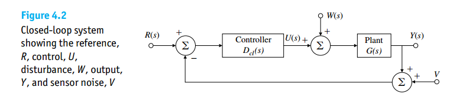

- proportional term (P) depends on the present error
- integral term (I) depends on past errors
- derivative term (D) depends on anticipated future errors 

> **PID** controller makes use of linear extrapolation of the measured output
>
> **PI** controller does not make use of any prediction of the future state of the system
>
> The prediction by linear extrapolation (**D**) can generate large undesired control signals because measurement noise is amplified, that's why **D** is not used widely
>
---

## The Problem of "Sinusoids Running Around Loops"

The representative of Fourier transform $\frac{1}{j\omega+j\omega_0}$ back in the time domain $e^{-j\omega_0 t}$ is **infinite extent in time**

> Running around a loop, chasing one's tail — these are thought pictures that only work in a discretized, time-sequenced conceptual framework that has a beginning and an end

***Fix in your mind that oscillations are a type of resonance***

## System Type

> Control of Steady-State Error to Polynomial Inputs: System Type

control systems are assigned a **type** number according to the maximum degree of the 
input polynominal for which the steady-state error is a *finite constant*. i.e.

> - Type 0: Finite error to a step (position error) 
> - Type 1: Finite error to a ramp (velocity error)
> - Type 2: Finite error to a parabola (acceleration error)

If we consider tracking the reference input alone and set $W = V = 0$

The **open-loop transfer functio**n can be expressed as
$$
T(s) = \frac{K_n(s)}{s^n}
$$

where we collect all the terms except the pole ($s$) at eh origin into $K_n(s)$, 

The polynomial inputs, $r(t)=\frac{t^k}{k!} u(t)$, whose transform is
$$
R(s) = \frac{1}{s^{k+1}}
$$

Then the equation for the **error**, $R(s)-Y(s)$ is simply
$$
E(s) = \frac{1}{1+T(s)}R(s)
$$

Application of the *Final Value Theorem* to the error formula gives the result

$$\begin{align}
\lim _{t\to \infty} e(t) &= e_{ss} = \lim _{s\to 0} sE(s) \\
&= \lim _{s\to 0} s\frac{1}{1+\frac{K_n(s)}{s^n}}\frac{1}{s^{k+1}} \\
&= \lim _{s\to 0} \frac{s^n}{s^n + K_n}\frac{1}{s^k}
\end{align}$$

- if $n > k$, $e=0$
- if $n < k$, $e\to \infty$
- if $n=k$
  - $e_{ss} = \frac{1}{1+K_n}$ if $n=k=0$
  - $e_{ss} = \frac{1}{K_n}$ if $n=k \neq 0$​

where we define $K_n(0) = K_n$

## rearrangement

The closed loop transfer function of $Y/X$ and $Y_1/X_1$ are almost same, except sign

$$\begin{align}
\frac{Y}{X} &= +\frac{H_1(s)H_2(s)}{1+H_1(s)H_2(s)} \\
\frac{Y_1}{X_1} &= -\frac{H_1(s)H_2(s)}{1+H_1(s)H_2(s)}
\end{align}$$

define $-Y_1=Y_n$, then
$$
\frac{Y_n}{X_1} = \frac{H_1(s)H_2(s)}{1+H_1(s)H_2(s)}
$$

> 
>
> Saurabh Saxena, IIT Madras. CICC2022 Clocking for Serial Links - Frequency and Jitter Requirements, Phase-Locked Loops, Clock and Data Recovery

## reference

Gene F. Franklin, J. David Powell, and Abbas Emami-Naeini. Feedback Control of Dynamic Systems, Global Edition (8th Edition). Pearson. [[pdf](https://mrce.in/ebooks/Feedback%20Control%20of%20Dynamic%20Systems%208th%20Ed.pdf)]

Åström, K.J. & Murray, Richard. (2021). Feedback Systems: An Introduction for Scientists and Engineers Second Edition [[pdf](https://www.cds.caltech.edu/~murray/books/AM08/pdf/fbs-public_24Jul2020.pdf)]

Dawson, Joel L. *A Guide to Feedback Theory*. Cambridge: Cambridge University Press, 2021. [[pdf](http://103.203.175.90:81/fdScript/RootOfEBooks/E%20Book%20collection%20-%202024%20-%20A/RARE%20BOOKS/A%20Guide%20to%20Feedback%20Theory%20by%20Dawson,%20Joel%20L.pdf)]

Yan Lu, ISSCC2021 T10: Fundamentals of Fully Integrated Voltage Regulators [[https://www.nishanchettri.com/isscc-slides/2021%20ISSCC/TUTORIALS/ISSCC2021-T10.pdf](https://www.nishanchettri.com/isscc-slides/2021%20ISSCC/TUTORIALS/ISSCC2021-T10.pdf)]

Jens Anders (University of Stuttgart, DE). ESSERC2025 Circuits Insights: The Magic of Feedback in Analog Circuit Design [[https://youtu.be/NyXuA6WZ8Hg](https://youtu.be/NyXuA6WZ8Hg)]

