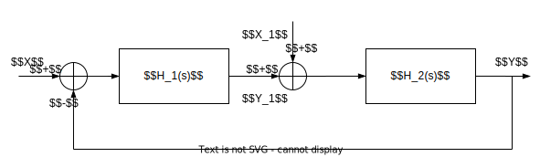
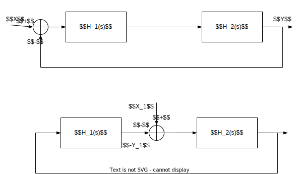
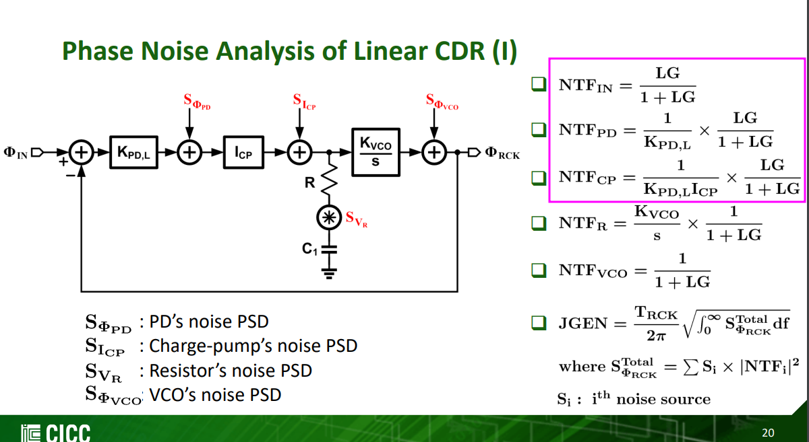

- proportional term (P) depends on the present error
- integral term (I) depends on past errors
- derivative term (D) depends on anticipated future errors 

> **PID** controller makes use of linear extrapolation of the measured output
>
> **PI** controller does not make use of any prediction of the future state of the system
>
> The prediction by linear extrapolation (**D**) can generate large undesired control signals because measurement noise is amplified, that's why **D** is not used widely
>
---

## rearrangement

The closed loop transfer function of $Y/X$ and $Y_1/X_1$ are almost same, except sign

$$\begin{align}
\frac{Y}{X} &= +\frac{H_1(s)H_2(s)}{1+H_1(s)H_2(s)} \\
\frac{Y_1}{X_1} &= -\frac{H_1(s)H_2(s)}{1+H_1(s)H_2(s)}
\end{align}$$

define $-Y_1=Y_n$, then
$$
\frac{Y_n}{X_1} = \frac{H_1(s)H_2(s)}{1+H_1(s)H_2(s)}
$$

> 
>
> Saurabh Saxena, IIT Madras. CICC2022 Clocking for Serial Links - Frequency and Jitter Requirements, Phase-Locked Loops, Clock and Data Recovery

## reference

Gene F. Franklin, J. David Powell, and Abbas Emami-Naeini. Feedback Control of Dynamic Systems, Global Edition (8th Edition). Pearson. [[pdf](https://mrce.in/ebooks/Feedback%20Control%20of%20Dynamic%20Systems%208th%20Ed.pdf)]

Åström, K.J. & Murray, Richard. (2021). Feedback Systems: An Introduction for Scientists and Engineers Second Edition [[pdf](https://www.cds.caltech.edu/~murray/books/AM08/pdf/fbs-public_24Jul2020.pdf)]

Dawson, J. L. (2021). *A guide to feedback theory*. Cambridge University Press.

Yan Lu, ISSCC2021 T10: Fundamentals of Fully Integrated Voltage Regulators [[https://www.nishanchettri.com/isscc-slides/2021%20ISSCC/TUTORIALS/ISSCC2021-T10.pdf](https://www.nishanchettri.com/isscc-slides/2021%20ISSCC/TUTORIALS/ISSCC2021-T10.pdf)]

Jens Anders (University of Stuttgart, DE). ESSERC2025 Circuits Insights: The Magic of Feedback in Analog Circuit Design [[https://youtu.be/NyXuA6WZ8Hg](https://youtu.be/NyXuA6WZ8Hg)]

