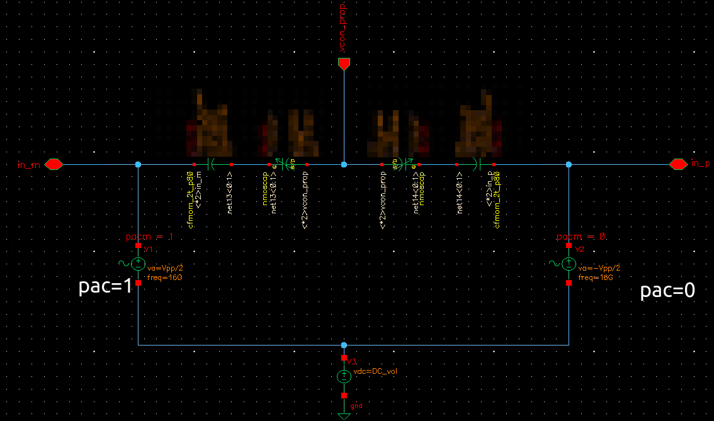

## varactor

### How to simulate the capacitance of varactor ?

Two methods: 1. pss + pac; 2. pss+psp

#### PSS + PAC



pss time domain


using the **0-harmonic**


#### PSS + PSP


using **Y11** of `psp`


#### results


They are same


## VCO

### phase noise 

#### pnoise - timeaverage

1. *Direct Plot/Pnoise/Phase Noise* or

   

2. manually calculate by definition

   

3. `output noise` with unit `dBc`

   *Direct Plot/Pnoise/Output Noise Units:dBc/Hz and Noise convention: SSB*

   

> The above method 2 and 3 only apply to `timeaveage` pnoise simulation, 

#### pnoise - sampled(jitter)/Edge Crossing


*Direct Plot/Pnoise/**Edge** Phase Noise* or


Another way, the following equation can also be used for `sampled(jitter)/Edge Crossing` 

```
PhaseNoise(dBc/Hz) = dB20( OutputNoise(V/sqrt(Hz)) / slopeCrossing / Tper*twoPi ) - dB10(2)
```

where `dB10(2)` is used to obtain SSB from DSB


#### Output Noise of sampled(jitter) pnoise

The last section's `Output Noise (V**2/Hz)` can be obtained by *transient noise simulation*

The idea is that sample waveform with ideal clock, subtract DC offset, then fft(psd)

- samplesRaw = sample(wv)
- samplePost = samplesRaw - average(samplesRaw)
- Output Noise (V**2/Hz) = psd(samplePost)


**Expression**:


> The computation cost is typically very high, and the accuracy is lesser as compared to PSS/Pnoise
