##  Inspection of Phase Noise

> How to Identify the Source of Phase Jitter through Phase Noise Plots [[https://www.sitime.com/company/newsroom/blog/how-identify-source-phase-jitter-through-phase-noise-plots](https://www.sitime.com/company/newsroom/blog/how-identify-source-phase-jitter-through-phase-noise-plots)]
>
> AN10072 Determine the Dominant Source of Phase Noise, by Inspection [[https://www.sitime.com/support/resource-library/application-notes/an10072-determine-dominant-source-phase-noise-inspection](https://www.sitime.com/support/resource-library/application-notes/an10072-determine-dominant-source-phase-noise-inspection)]
>
> 4-minute Clinic: Determine the Dominant Source of Jitter by Inspection of Phase Noise Plot [[https://youtu.be/2elHk3v45Pk](https://youtu.be/2elHk3v45Pk)]

 a ***-10 dB/decade reference line*** can be used to pinpoint the location in a phase noise curve that dominates its integral

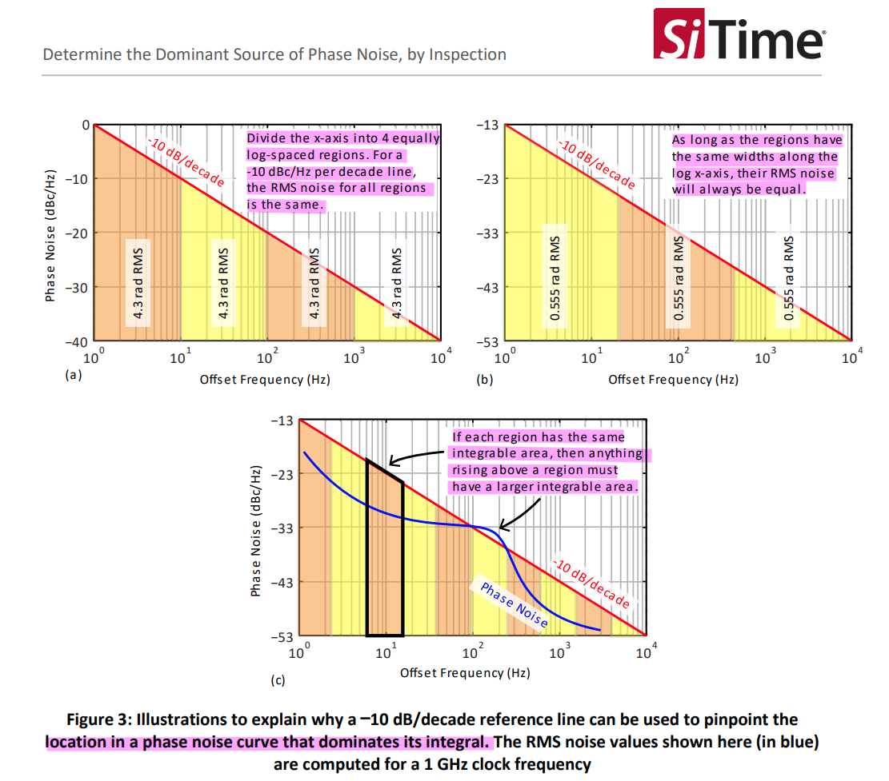

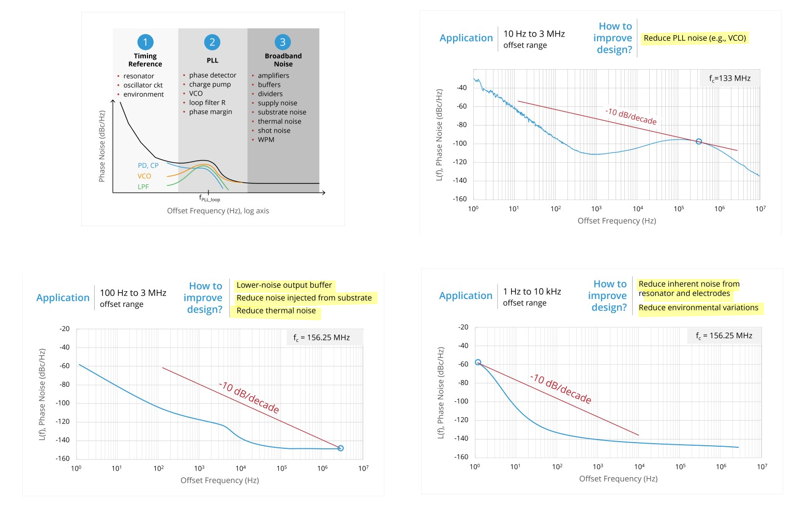


## Reference-Clock Phase Noise in PLL

> Gary Giust. How to Evaluate Reference-Clock Phase Noise in High-Speed Serial Links [[expanded version](https://www.signalintegrityjournal.com/articles/1216-methodology-for-analyzing-reference-clock-phase-noise-in-high-speed-serial-links)], [[compact version](https://www.sitime.com/support/resource-library/how-evaluate-reference-clock-phase-noise-high-speed-serial-links)]
>
> G. Richmond, "Refclk Fanout Best Practices for 8GT/s and 16GT/s Systems," PCI-SIG Developers Conference, June 7, 2017

Knowing how ***input phase noise aliases*** when ***sampled*** by a PLL

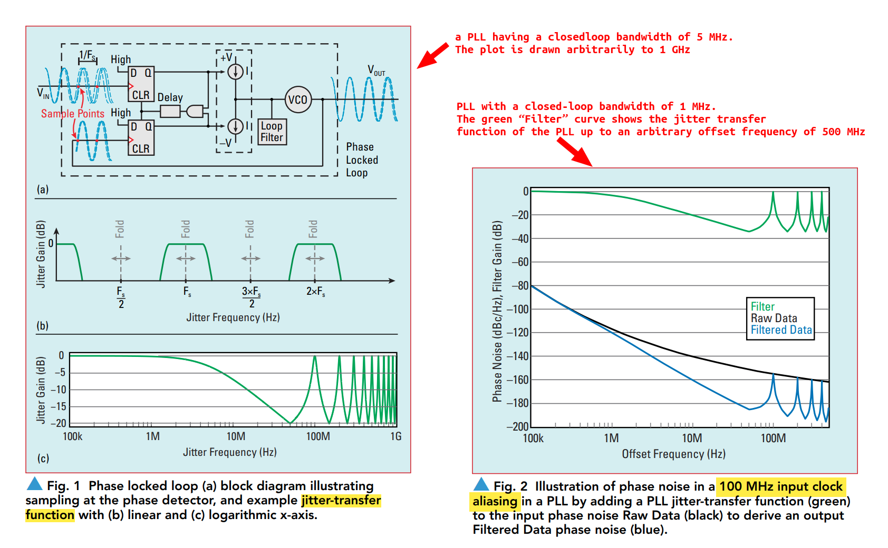

---

An alternate view of **phase noise aliasing during the sampling process**

- Instead of **mirroring the jitter-transfer function** located below $F_S/2$ across spectral boundaries located at integer multiples of $F_S/2$ (i.e. 50 MHz) as shown in Figure 2 (a)
- we could alternatively **fold the portion of the Raw Data curve** located above $F_S/2$ across these spectrum boundaries to appear below $F_S/2$ as shown in Figure 2 (b)

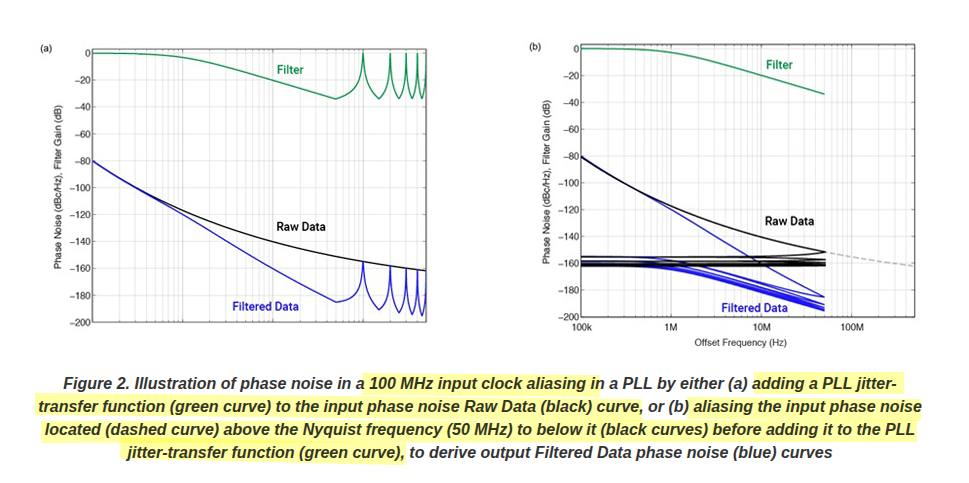

*Integrating the combined area* under each Filtered Data curve shown in Figure 2 (b) is *mathematically equivalent* to integrating the entire Filtered Data curve shown in Figure 2 (a)

---


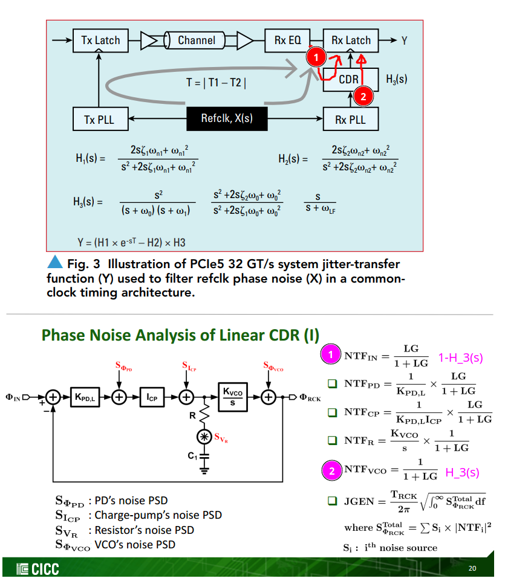

---

***Phase Noise Analyzer* vs *TIE jitter using Real-time Oscilloscope***

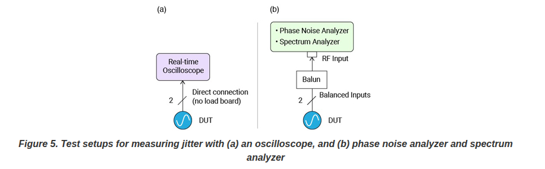

> Since an **oscilloscope observes jitter similar to a real system,** we regard its result as the **gold** standard against which other methods may be judged

**Flat Phase Noise Extension** to twice the clock frequency

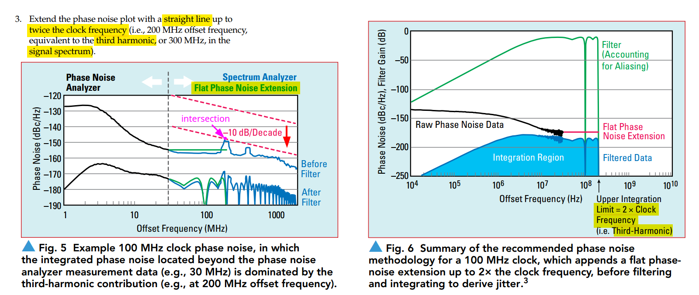


## Phase Noise Aliasing & Integration Limits

These two types of measurements deliver the **same rms jitter** of $f_{CK}$

- both rising and falling:  integrated from $-f_{CK}$ to $+f_{CK}$
- only the rising (or falling) edges: integrated from $-f_{CK}/2$ to $+f_{CK}/2$

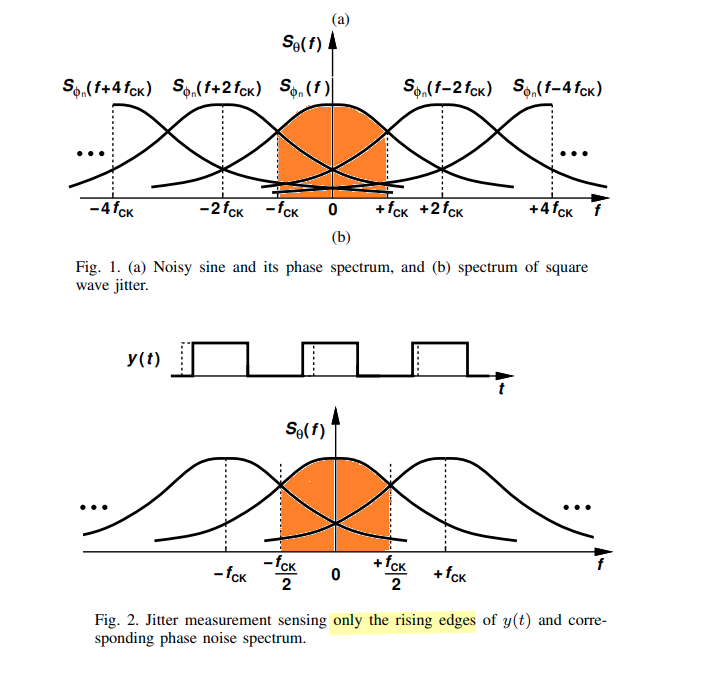

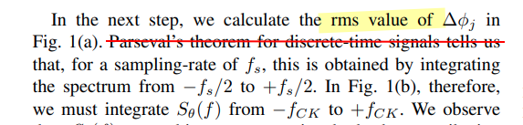

*temporal autocorrelation* and *Wiener-Khinchin theorem* is more appropriate to arise *rms value* 

> Y. Zhao and B. Razavi, "Phase Noise Integration Limits for Jitter Calculation,"[[https://www.seas.ucla.edu/brweb/papers/Conferences/YZ_ISCAS_22.pdf](https://www.seas.ucla.edu/brweb/papers/Conferences/YZ_ISCAS_22.pdf)]
>
> *G. Giust, "Phase Noise Aliases as TIE Jitter," Signal Integrity Journal, July 23, 2018* [[https://www.signalintegrityjournal.com/articles/912-phase-noise-aliases-as-tie-jitter](https://www.signalintegrityjournal.com/articles/912-phase-noise-aliases-as-tie-jitter)]


## Jitter and Edge phase noise

> [[https://community.cadence.com/cadence_technology_forums/f/custom-ic-design/56929/how-to-derive-edge-phase-noise-from-output-noise-in-sampled-pnoise-simulation/1388888](https://community.cadence.com/cadence_technology_forums/f/custom-ic-design/56929/how-to-derive-edge-phase-noise-from-output-noise-in-sampled-pnoise-simulation/1388888)]
>
> Shawn Logan, Summary of Study of Cadence Sampled Phase Noise and Jitter Definitions with a Comparison to Conventional Time Interval Error (TIE) for a Driven Circuit [[www.dropbox.com/s/3m531dl4fl7bwbr/jee_computation_example_sml_032823v1p0.pdf](www.dropbox.com/s/3m531dl4fl7bwbr/jee_computation_example_sml_032823v1p0.pdf)]

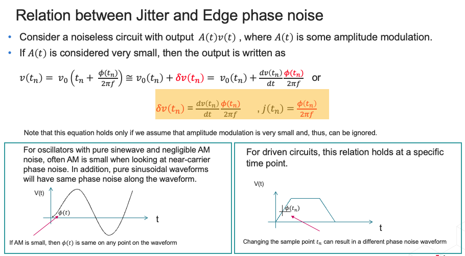

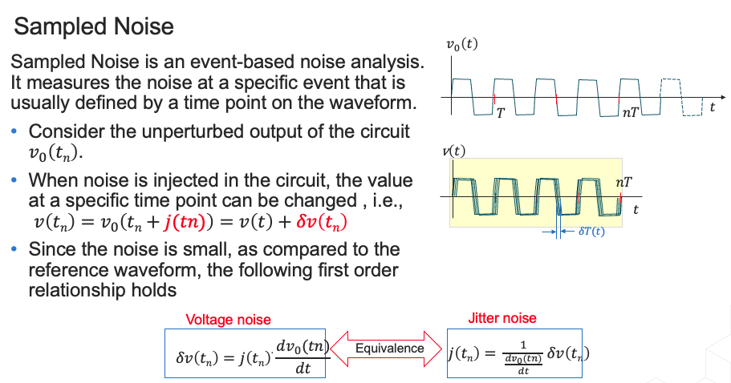


## timeaverage noise (phase-noise) & sampled noise (edge-phase noise or jitter) spectrum

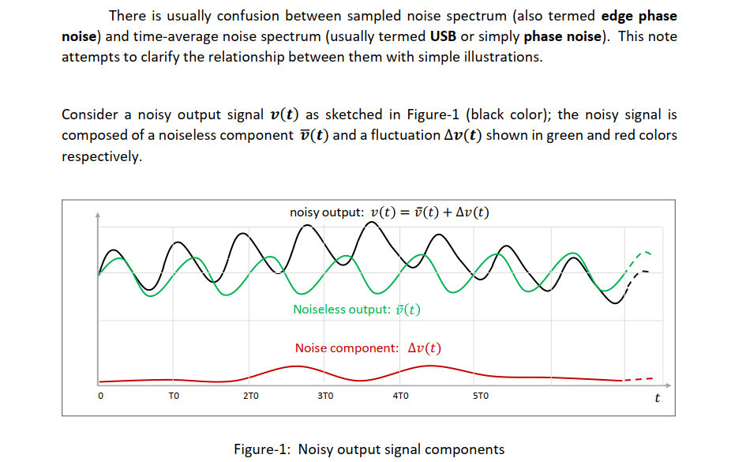

### Time-average noise analysis

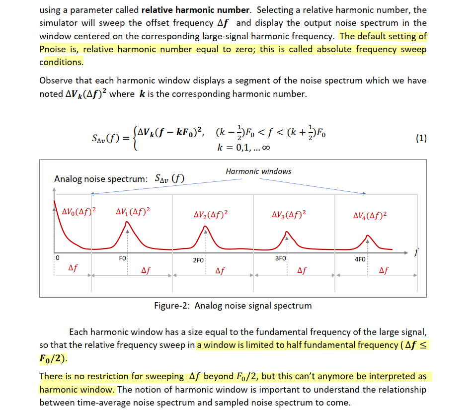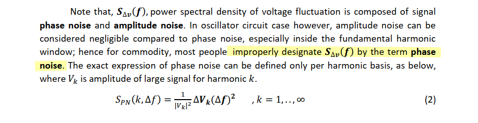

> $S_{\Delta f}(f)$ between $[\Delta f, F_0/2]$ may be *less than* that of other harmonic window


### Sampled noise analysis

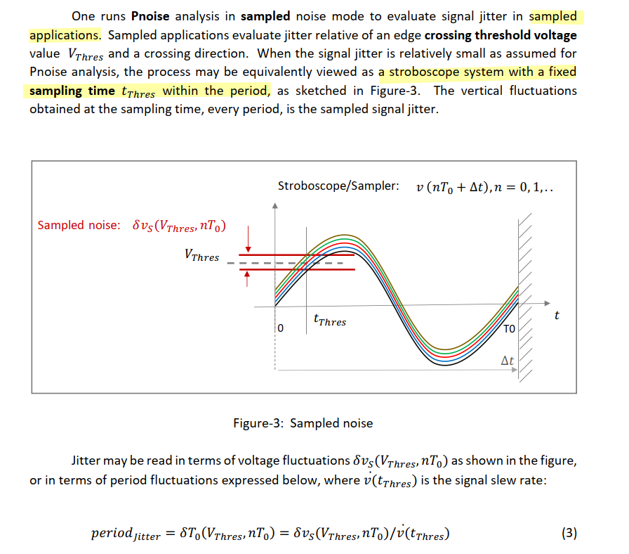

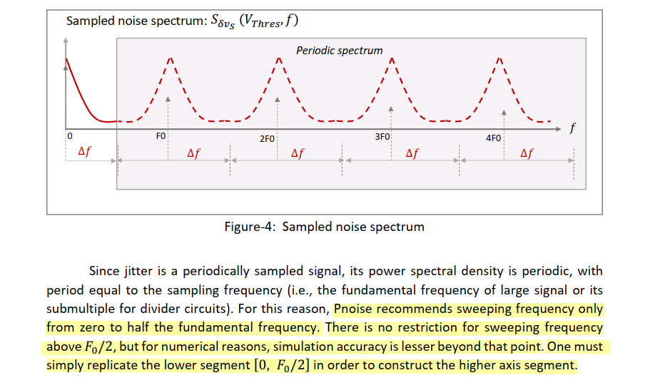

### correlation

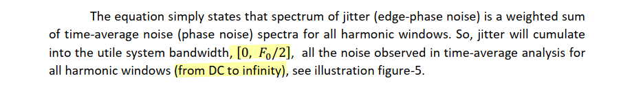

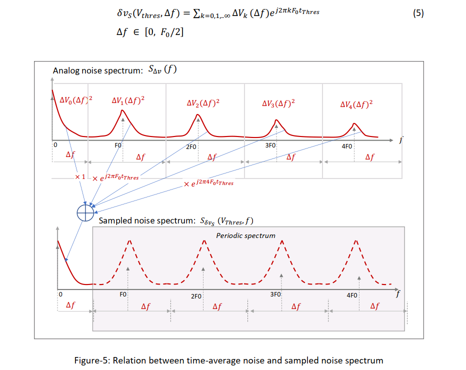

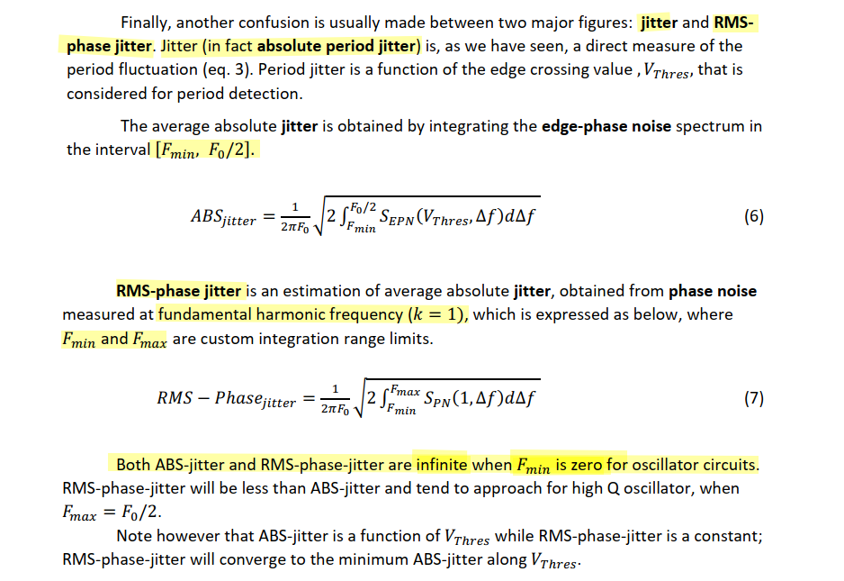


## VCO Phase Noise

### pnoise - timeaverage

1. *Direct Plot/Pnoise/Phase Noise* or

   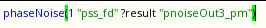

2. manually calculate by definition

   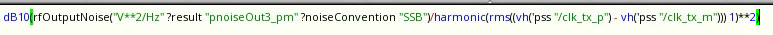

3. `output noise` with unit `dBc`

   *Direct Plot/Pnoise/Output Noise Units:dBc/Hz and Noise convention: SSB*

   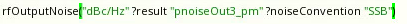

> The above method 2 and 3 only apply to `timeaveage` pnoise simulation, 

### pnoise - sampled(jitter)/Edge Crossing

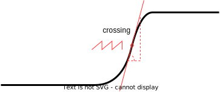

*Direct Plot/Pnoise/**Edge** Phase Noise* or

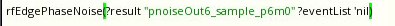

Another way, the following equation can also be used for `sampled(jitter)/Edge Crossing` 

```
PhaseNoise(dBc/Hz) = dB20( OutputNoise(V/sqrt(Hz)) / slopeCrossing / Tper*twoPi ) - dB10(2)
```

where `dB10(2)` is used to obtain SSB from DSB

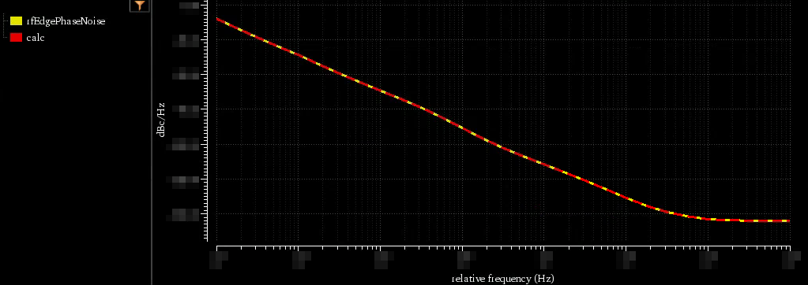

### Output Noise of sampled(jitter) pnoise

The last section's `Output Noise (V**2/Hz)` can be obtained by *transient noise simulation*

The idea is that sample waveform with ideal clock, subtract DC offset, then fft(psd)

- samplesRaw = sample(wv)
- samplePost = samplesRaw - average(samplesRaw)
- Output Noise (V**2/Hz) = psd(samplePost)

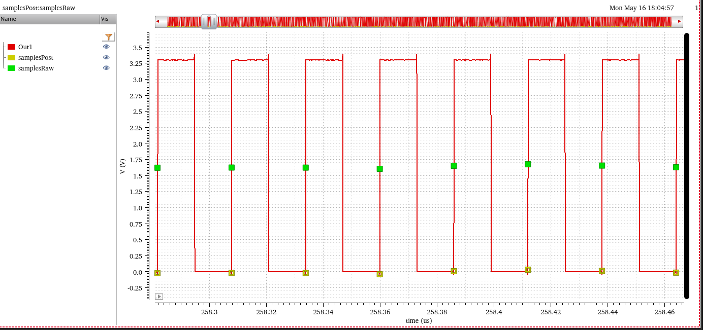

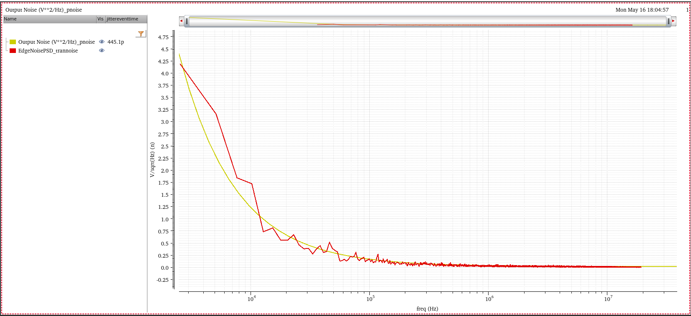

**Expression**:

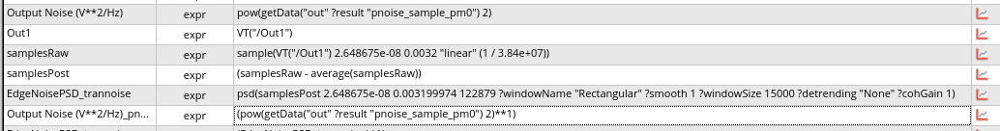

> The computation cost is typically very high, and the accuracy is lesser as compared to PSS/Pnoise


## Pnoise Sampled(jitter): Sampled Phase Option

- Identical to **noisetype=timedomain** in old GUI
- Use model:
  - Sampleds Per Period: number of ponits
  - Add Specific Points: specific time point, still time points

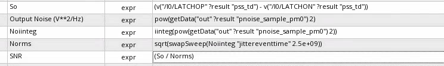

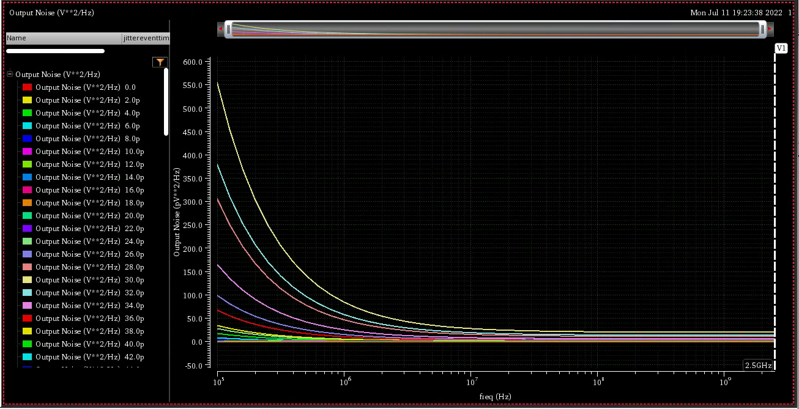

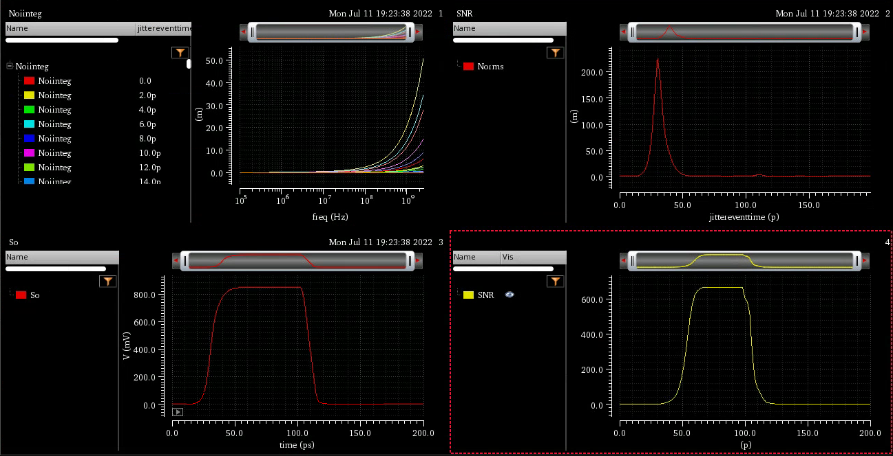

> pss beat freq = 5GHz
>
> pnoise sweeptype: absolute, from 100k to 2.5GHz


## Transient noise

### phase noise from transient noise analysis

1. The Phase Noise function is now available in the Direct Plot form (Results-Direct Plot-Main Form) after Transient Analysis is run
   - Absolute jitter Method
   - Direct Power Spectral Density Method
2. `PN` phase noise function
   - Absolute jitter Method
   - Direct Power Spectral Density Method

> **Absolute jitter Method**: Phase noise is defined as the power spectral density of the absolute jitter of an input waveform
>
> and **absolute jitter method** is the default method 


In below discussion, we only think about the `absolute jitter method`

### PSD & Phase Noise

> - phase noise is single-sideband
> - psd is double-sideband
> - Then the  ratio is **2**

***By PSS_Pnoise***

`jee`

```
rfEdgePhaseNoise(?result "pnoise_sample_pm0" ?eventList 'nil) + 10 * log10(2)
```

> convert **single-sideband** phase noise to psd by multiplying 2 or `10 * log10(2)`

---

***By trannoise `PN` function***

```
PN(clip(VT("/Out1") 2.60417e-08 0.000400052) "rising" 1.65 ?Tnom (1 / 3.84e+07) ?windowName "Rectangular" ?smooth 1 ?windowSize 15000 ?detrending "None" ?cohGain 1 ?methodType "absJitter")
```

> double-sideband psd

---

***By trannoise `psd` and `abs_jitter` function***

```
dB10(psd(abs_jitter(clip(VT("/Out1") 2.60417e-08 0.000400052) "rising" 1.65 ?Tnom (1 / 3.84e+07)) 2.60417e-08 0.000400052 15360 ?windowName "Rectangular" ?smooth 1 ?windowSize 15000 ?detrending "None" ?cohGain 1))
```

> double-sideband psd
>
> `abs_jitter` *Y-Unit* default is `rad`

---

***Comparison***

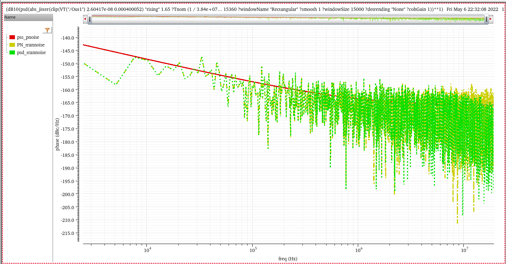

>  `PN`'s result is same with `psd`'s

### RMS value

- build the `abs_jitter` function with *seconds as the Y axis* and add the `stddev` function to determine the Jee jitter value
- or integrate psd

The RMS $x_{\text{RMS}}$ of a discrete domain signal $x(n)$ is given by
$$
x_{\text{RMS}}=\sqrt{\frac{1}{N}\sum_{n=0}^{N-1}|x(n)|^2}
$$
Inserting Parseval's theorem given by
$$
\sum_{n=0}^{N-1}|x(n)|^2=\frac{1}{N}\sum_{n=0}^{N-1}|X(k)|^2
$$
allows for computing the RMS from the spectrum $X(k)$ as
$$
x_{\text{RMS}}=\sqrt{\frac{1}{N^2}\sum_{n=0}^{N-1}|X(k)|^2}
$$

---

Cadence Spectre's `PN` function may call `abs_jitter` and `psd` function under the hood.


## Phase Noise in `vsource` 

Suppose pnoise result of one block is shown as below, and the result is stimulus of following block 

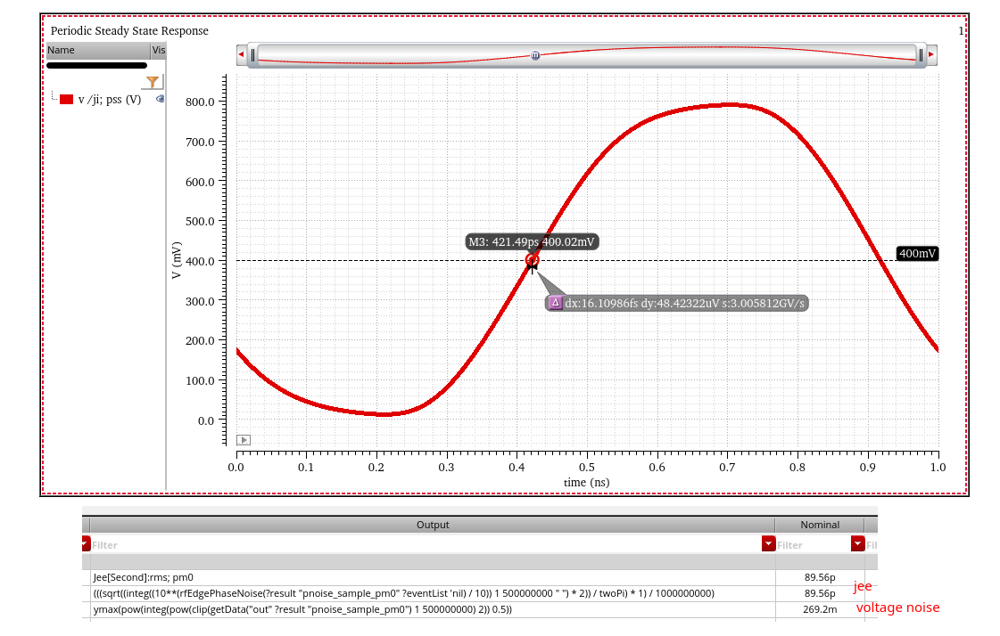

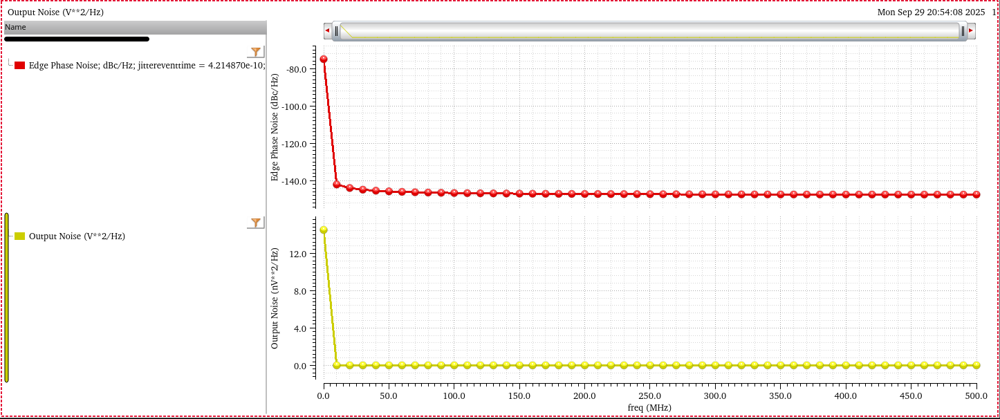

First export `Output Noise` and `Edge Phase Noise`， then select `noiseModelType` and `noisefile` respectively

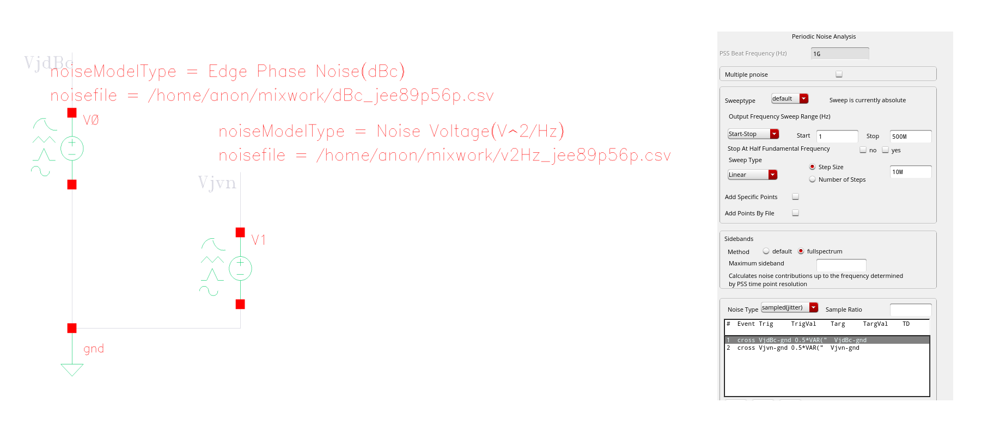

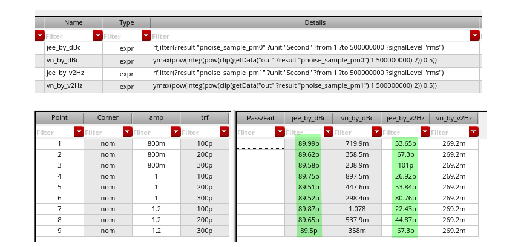

Under `vsource` (`Source type: pulse`) with different amplitude & rising/falling time, simulation result demonstrate that ***`Edge Phase Noise(dBc)` maintain jitter or phase noise by tweaking voltage noise at edge*** under the hoods, however ***`Noise Voltage(V^2/Hz)` maintain voltage noise***

In the conclusion, *`Edge Phase Noise(dBc)` is preferred for phase noise evaluation*

> notice:
>
> `@(#)$CDS: spectre  version 21.1.0 64bit 12/01/2023 07:24 (csvcm36c-1) $`
>
> `@(#)$CDS: virtuoso version ICADVM20.1-64b 10/11/2023 09:26 (cpgbld01) $`

---

***SSB Phase Noise (dBc)***

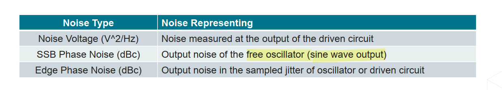

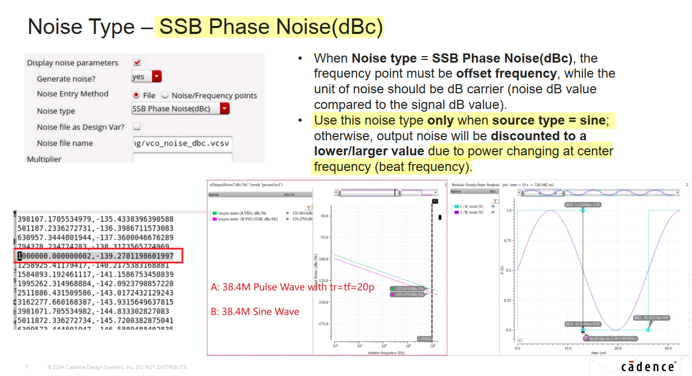

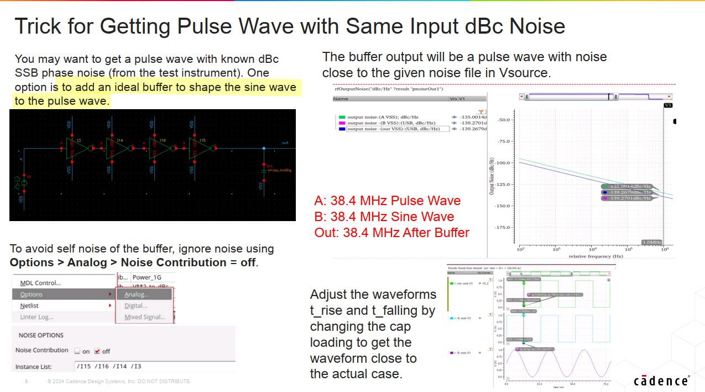


## Divider PN simulation

> Cadence Support. "How to set up pss/pnoise when simulating a driven circuit or a VCO, both containing dividers"

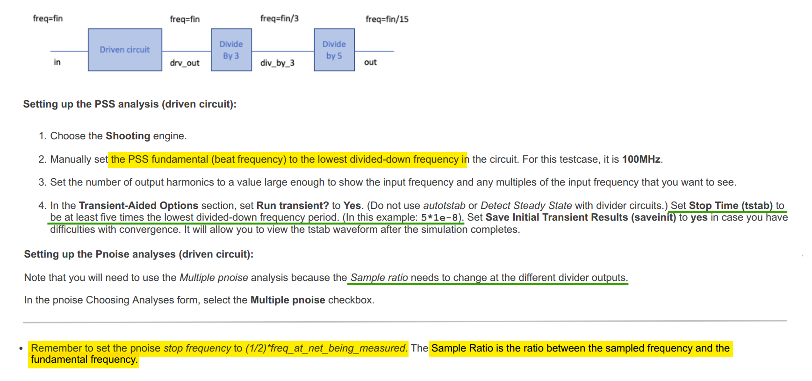


## Modeling Oscillators with Arbitrary Phase Noise Profiles

*TODO* &#128197;


## reference

Article (11514536) Title: How to obtain a phase noise plot from a transient noise analysis
URL: [https://support.cadence.com/apex/ArticleAttachmentPortal?id=a1Od0000000nb1CEAQ](https://support.cadence.com/apex/ArticleAttachmentPortal?id=a1Od0000000nb1CEAQ)

Article (20500632) Title: How to simulate Random and Deterministic Jitters
URL: [https://support.cadence.com/apex/ArticleAttachmentPortal?id=a1O3w000009fiXeEAI](https://support.cadence.com/apex/ArticleAttachmentPortal?id=a1O3w000009fiXeEAI)

Cadence, Application Note: Understanding the relations between time-average noise (phase-noise) and sampled noise (edge-phase noise or jitter) in Pnoise analysis

Tutorial on Scaling of the Discrete Fourier Transform and the Implied Physical Units of the Spectra of Time-Discrete Signals Jens Ahrens, Carl Andersson, Patrik Höstmad, Wolfgang Kropp URL: [https://appliedacousticschalmers.github.io/scaling-of-the-dft/AES2020_eBrief/](https://appliedacousticschalmers.github.io/scaling-of-the-dft/AES2020_eBrief/)

Tawna, "Modeling Oscillators with Arbitrary Phase Noise Profiles"[[https://community.cadence.com/cadence_blogs_8/b/rf/posts/modeling-oscillators-with-arbitrary-phase-noise-profiles](https://community.cadence.com/cadence_blogs_8/b/rf/posts/modeling-oscillators-with-arbitrary-phase-noise-profiles)]

—, "How to Specify Phase Noise as an Instance Parameter in Spectre Sources (e.g. vsource, isource, Port)" [[https://community.cadence.com/cadence_blogs_8/b/rf/posts/how-to-specify-phase-noise-as-an-instance-parameter-in-spectre-sources-e-g-vsource-isource-port](https://community.cadence.com/cadence_blogs_8/b/rf/posts/how-to-specify-phase-noise-as-an-instance-parameter-in-spectre-sources-e-g-vsource-isource-port)]
