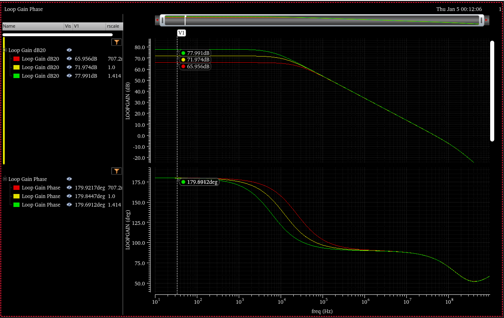

### Generic circuit in textbook

In addition to *lowering* the required capacitor value, Miller compensation entails a very important property: it moves the output pole *away from the origin*. This effect is called **pole splitting**

The 1st stage is replaced with Thevenin equivalent circuit , $V_i \cong V_i \cdot g_{m1}R_{o1}$

$$\begin{align}
\frac{V_i-V_{o1}}{R_{o1}} &= V_{o1}\cdot sC_{o1}+(V_{o1}-V_o)\cdot sC_c \\
V_{o1} &= \frac{V_i+sR_{o1}C_cV_o}{1+sR_{o1}(C_{o1}+C_c)}
\end{align}$$
$$
(V_{o1}-V_o)sC_c=g_{m2}V_{o1}+V_o(\frac{1}{R_{o2}+sC_L})
$$
substitute $V_{o1}$, we get

$$\begin{align}
\frac{V_o}{V_i} &= \frac{(sC_c-g_{m2})R_{o2}}{s^2R_{o1}R_{o2}(C_cC_{o1}+C_LC_{o1}+C_LC_c)+s\left\{ R_{o1}C_c\cdot g_{m2}R_{o2}+R_{o2}(C_c+C_L)+R_{o1}(C_{o1}+C_c) \right\} +1} \\
&= \frac{g_{m2}R_{o2}(s\frac{C_c}{g_{m2}}-1)}{s^2R_{o1}R_{o2}(C_cC_{o1}+C_LC_{o1}+C_LC_c)+s\left\{ R_{o1}C_c\cdot g_{m2}R_{o2}+R_{o2}(C_c+C_L)+R_{o1}(C_{o1}+C_c) \right\} +1}
\end{align}$$

left hand plane poles

$$\begin{align}
\omega_1 &= \frac{1}{R_{o1}C_c\cdot g_{m2}R_{o2}+R_{o2}(C_c+C_L)+R_{o1}(C_{o1}+C_c)} \\
\omega_2 &= \frac{R_{o1}C_c\cdot g_{m2}R_{o2}+R_{o2}(C_c+C_L)+R_{o1}(C_{o1}+C_c)}{R_{o1}R_{o2}(C_cC_{o1}+C_LC_{o1}+C_LC_c)}
\end{align}$$

and RHP (*right*-*hand plane*) zero
$$
\omega_z=\frac{g_{m2}}{C_c}
$$

### The circuit with series switch

replace $sC_L$ with $1/(R_{sw}+\frac{1}{sC_L})$
$$\begin{align}
\frac{V_{o2}}{V_i} &= \frac{g_{m2}R_{o2}(s\frac{C_c}{g_{m2}}-1)(1+sR_{sw}C_L)}{s^3R_{o1}R_{o2}R_{sw}C_{o1}C_cC_L+s^2\left\{R_{o1}R_{o2}(C_cC_{o1}+C_LC_{o1}+C_LC_c)+ \left[ R_{o1}C_c\cdot g_{m2}R_{o2}+R_{o2}(C_c+0)+R_{o1}(C_{o1}+C_c)\right]R_{sw}C_L \right\}+s\left\{ R_{o1}C_c\cdot g_{m2}R_{o2}+R_{o2}(C_c+C_L)+R_{o1}(C_{o1}+C_c) +R_{sw}C_L\right\} +1}
\end{align}$$
Due to
$$
\frac{V_o}{V_{o2}} = \frac{\frac{1}{sC_L}}{R_{sw}+\frac{1}{sC_L}}=\frac{1}{1+sR_{sw}C_L}
$$
Then
$$\begin{align}
\frac{V_o}{V_i} &= \frac{V_{o2}}{V_i} \cdot \frac{V_o}{V_{o2}} \\
&= \frac{g_{m2}R_{o2}(s\frac{C_c}{g_{m2}}-1)}{s^3R_{o1}R_{o2}R_{sw}C_{o1}C_cC_L+s^2\left\{R_{o1}R_{o2}(C_cC_{o1}+C_LC_{o1}+C_LC_c)+ \left[ R_{o1}C_c\cdot g_{m2}R_{o2}+R_{o2}(C_c+0)+R_{o1}(C_{o1}+C_c)\right]R_{sw}C_L \right\}+s\left\{ R_{o1}C_c\cdot g_{m2}R_{o2}+R_{o2}(C_c+C_L)+R_{o1}(C_{o1}+C_c) +R_{sw}C_L\right\} +1}
\end{align}$$

### $R_{sw}$ and $R_c$

$$\begin{align}
\frac{V_{o2}}{V_i} &=-g_{m2}R_{o2}\frac{sC_c(R_c-1/g_{m2})+1}{(1+sR_{o1}C_{o1})sR_{o2}C_c+sR_{o1}\cdot g_{m2}R_{o2}C_c+\frac{s(R_{o2}+R_{sw})C_L+1}{sR_{sw}C_L+1}\left[(1+sR_{o1}C_{o1})(1+sR_cC_c)+sR_{o1}C_c \right]} \\
&=-g_{m2}R_{o2}\frac{sC_c(R_c-1/g_{m2})+1}{s^2R_{o1}R_{o2}C_{o1}C_c+sR_{o2}C_c+sR_{o1}\cdot g_{m2}R_{o2}C_c+\frac{s(R_{o2}+R_{sw})C_L+1}{sR_{sw}C_L+1}\left[(1+sR_{o1}C_{o1})(1+sR_cC_c)+sR_{o1}C_c \right]} \\
&=-g_{m2}R_{o2}\frac{\left[ sC_c(R_c-1/g_{m2})+1 \right](sR_{sw}C_L+1)}{s^2R_{o1}R_{o2}C_{o1}C_c(sR_{sw}C_L+1)+sR_{o2}C_c(sR_{sw}C_L+1)+sR_{o1}\cdot g_{m2}R_{o2}C_c(sR_{sw}C_L+1)+\left[s(R_{o2}+R_{sw})C_L+1\right]\left[(1+sR_{o1}C_{o1})(1+sR_cC_c)+sR_{o1}C_c \right]}
\end{align}$$

$s^3$ terms in denominator
$$
H_3 = s^3\cdot(R_{o1}R_{o2}R_c+R_{o1}R_{o2}R_{sw} +R_{o1}R_cR_{sw})\cdot C_{o1}C_cC_L
$$
$s^2$ terms in denominator
$$\begin{align}
H_2 &=s^2\cdot(R_{o1}R_{o2}C_{o1}C_c+R_{o1}R_{o2}C_{o1}C_L+R_{o2}R_cC_cC_L+R_{o1}R_{o2}C_cC_L+R_{o1}R_cC_{o1}C_c\\
&+R_{o2}R_{sw}C_cC_L+R_{o1}R_{sw}C_cC_L\cdot g_{m2}R_{o2}+R_{o1}R_{sw}C_{o1}C_L+R_{sw}R_cC_cC_L+R_{o1}R_{sw}C_cC_L)
\end{align}$$

$s^1$ term in denominator
$$
H_1=s(R_{o1}\cdot g_{m2}R_{o2}C_c+R_{o1}C_{o1}+R_cC_c+R_{o1}C_c+R_{o2}C_c+R_{o2}C_L+R_{sw}C_L)
$$
$s^0$ term in denominator
$$
H_0=1
$$
set $R_c=0$ and $R_{sw}=0$, the $H_*$ reduced to
$$\begin{align}
H_3 &= 0 \\
H_2 &=s^2R_{o1}R_{o2}(C_{o1}C_c+C_{o1}C_L+C_cC_L) \\
H_1&=s(R_{o1}\cdot g_{m2}R_{o2}C_c+R_{o1}C_{o1}+R_{o1}C_c+R_{o2}C_c+R_{o2}C_L) \\
H_0&=1
\end{align}$$
That is
$$
H=s^2R_{o1}R_{o2}(C_{o1}C_c+C_{o1}C_L+C_cC_L)+s(R_{o1}\cdot g_{m2}R_{o2}C_c+R_{o1}C_{o1}+R_{o1}C_c+R_{o2}C_c+R_{o2}C_L)+1
$$

which is same with our previous analysis of *Generic circuit in textbook*

And we know
$$
\frac{V_o}{V_{o2}}=\frac{1}{1+sR_{sw}C_L}
$$
Finally, we get $\frac{V_o}{V_i}$
$$\begin{align}
\frac{V_o}{V_i} &= \frac{V_{o2}}{V_i} \cdot \frac{V_o}{V_{o2}} \\
&= -g_{m2}R_{o2}\frac{\left[ sC_c(R_c-1/g_{m2})+1 \right](sR_{sw}C_L+1)}{H_3+H_2+H_1+1} \cdot \frac{1}{1+sR_{sw}C_L} \\
&= -g_{m2}R_{o2}\frac{ sC_c(R_c-1/g_{m2})+1}{H_3+H_2+H_1+1}
\end{align}$$

The loop transfer function is
$$
\frac{V_o}{V_i} =-g_{m1}R_{o1}g_{m2}R_{o2}\frac{ sC_c(R_c-1/g_{m2})+1}{H_3+H_2+H_1+1}
$$

#### vccs model

#### simplify the transfer function

##### omit $C_{o1}$

We omit $C_{o1}$ in frequency range of interest

$$\begin{align}
H_3 &= 0 \\
H_2 &=s^2(R_{o2}R_c+R_{o1}R_{o2}+R_{o2}R_{sw}+R_{o1}R_{sw}\cdot g_{m2}R_{o2}+R_{sw}R_c+R_{o1}R_{sw})\cdot C_cC_L \\
H_1 &=s(R_{o1}\cdot g_{m2}R_{o2}C_c+R_cC_c+R_{o1}C_c+R_{o2}C_c+R_{o2}C_L+R_{sw}C_L) \\
H_0 &= 1
\end{align}$$

> two poles and 1 zero

##### more simplification

Then, some terms can be omitted

$$\begin{align}
H_2 &=s^2R_{o1}R_{o2}(1+g_{m2}R_{sw})\cdot C_cC_L \\
H_1 &=sR_{o1}\cdot g_{m2}R_{o2}C_c \\
H_0 &= 1
\end{align}$$

The poles can be deduced
$$\begin{align}
\omega_1 &= \frac{1}{R_{o1}\cdot g_{m2}R_{o2}C_c} \\
\omega_2 &= \frac{1}{1+g_{m2}R_{sw}}\cdot \frac{g_{m2}}{C_L} \\
&= \frac{1}{(gm_2^{-1}+R_{sw})C_L}
\end{align}$$

The pole $\omega_2=\frac{1}{gm_2^{-1}C_L}$ is changed to $\omega_2=\frac{1}{(gm_2^{-1}+R_{sw})C_L}$

> In order to cancell $\omega_2$ with $\omega_z$, $R_c$ shall be increased

$$
R_{eq}=g_{m2}^{-1}+R_{sw}
$$

> **omit $C_{o1}$** is same with **2nd system** simplification

### non-dominant pole in Sansen's book

Following demonstrate how derive $f_{nd}$ from Razavi's equation. We copy $\omega_2$ here
$$
\omega_2 = \frac{R_{o1}C_c\cdot g_{m2}R_{o2}+R_{o2}(C_c+C_L)+R_{o1}(C_{o1}+C_c)}{R_{o1}R_{o2}(C_cC_{o1}+C_LC_{o1}+C_LC_c)}
$$
which can be reduced as below

$$\begin{align}
\omega_2 &= \frac{R_{o1}C_c\cdot g_{m2}R_{o2}+R_{o2}(C_c+C_L)+R_{o1}(C_{o1}+C_c)}{R_{o1}R_{o2}(C_cC_{o1}+C_LC_{o1}+C_LC_c)} \\
&= \frac{R_{o1}C_c\cdot g_{m2}R_{o2}}{R_{o1}R_{o2}(C_cC_{o1}+C_LC_{o1}+C_LC_c)} \\
&= \frac{C_c\cdot g_{m2}}{C_cC_{o1}+C_LC_{o1}+C_LC_c} \\
&= \frac{g_{m2}}{C_{o1}+C_L\frac{C_{o1}}{C_c}+C_L} \\
&= \frac{g_{m2}}{C_L\frac{C_{o1}}{C_c}+C_L} \\
&= \frac{g_{m2}}{C_L} \cdot \frac{1}{1+\frac{C_{o1}}{C_c}}
\end{align}$$

### Exercise of 2-stage opamp

> $R_{o1}$ and $R_{o2}$ don't affect stability, if $f_{nd}>3\text{GBW}$
>
> DC gain: $g_{m1}g_{m2}R_{o1}R_{o2}$
>
> dominant pole: $\omega_d=\frac{1}{R_{o1}\cdot g_{m2}R_{o2}C_c}$

> $20log_{10}(1.414^2)=6\text{dB}$

### reference

Razavi, Behzad. Design of Analog CMOS Integrated Circuits. India: McGraw-Hill, 2017.

Sansen, Willy M. Analog Design Essentials. Germany: Springer US, 2006.
