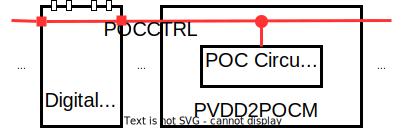

#### Power / Ground Pin Information

In both digital and analog I/O, power and ground pins appear at the sub-circuit definiton, allowing user to use the I/O in voltage islands. They follow certain naming conventions.

1. digital I/O sub-circuit

- VDD: pre-driver core voltage (supplied by PVDD1CDGM)
- VSS: pre-driver ground and also global ground (supplied by PVDD1CDGM)
- VDDPST: I/O post-driver voltage, i.e. 1.8V (supplied by PVDD2CDGM or PVDD2POCM)
- VSSPOST: I/O post-driver ground (supplied by PVDD2CDGM or PVDD2POCM)
- POCCTRL: POCCTRL signal (supplied by PVDD2POCM)

2. analog I/O placed in a core voltage domain, the convention is

- TACVDD: analog core voltage (supplied by PVDD3ACM)
- TACVSS: analog core ground (supplied by PVDD3ACM)
- VSS: global core ground

3. analog I/O placed in an I/O voltage domain, the convention is:

- TAVDD: analog I/O voltage, i.e. 1.8V (supplied by PVDD3AM)
- TAVSS: analog I/O ground (supplied by PVDD3AM)
- VSS: global core ground

Power/Ground **Combo Cells**

| power/ground combo pad cell | pins to be connected to bump | to core side pin name |
| --------------------------- | ---------------------------- | --------------------- |
| PVDD1CDGM                   | VDD VSS                      | VDD VSS               |
| PVDD2CDGM PVDD2POCM         | VDDPST VSSPST                | N/A                   |
| PVDD3AM                     | TAVDD TAVSS                  | AVDD AVSS             |
| PVDD3ACM                    | TACVDD TACVSS                | AVDD AVSS             |

#### Note for the retention mode

1. At initial state, IRTE must be **0** when VDD is off.
2. IRTE must be kept >= 10us after VDD turns on again (from the retention mode to the normal operation mode).
3. IRTE can be switched only when both VDD and VDDPST are on.


When the rention function is needed, IRTE signal must come from an "always-on" core power domain. If you don't need the rention function, it is required to tie IRTE to ground. In other words, **no matter the rention feature is needed or not, it is required to have PCBRTE in each domain**.


**Note**: PCBRTE **does not** need PAD connection.

#### Internal Pins

There are 3 internal global pins, i.e. **ESD**, **POCCTRL**, **RTE**, in all digital domain cells. 

In real application, 

- **ESD pin** is an internal signal and **active** in ESD event happening
- **POCCTRL** is an internal signal and active in Power-on-control event.

However, these special events (i.e. ESD event and Power-on-control event) are not modeled in NLDM kit (.lib), only normal function is covered, so **ESD** and **POCCTRL** pins are simply defined as ground in NLDM kit (.lib).

> These 3 global pins will be connected automatically after **cell-to-cell abutting** in physical layout.

#### Power-Up sequence in Digital Domain

Power up the I/O power (VDDPST) first, then the core power (VDD)


1. PVDDD2POCM cell would generate Power-On-Control signal (POCCTRL) to have the post-driver NMOS and PMOS off, so that the crowbar current would not occur in the post-driver fingers when the I/O voltage is on while the core voltage remains off. As such, I/O cell would be in the Hi-Z state. when POCCTRL is on, the pll-up/down resistor is disabled and C is 0.
2. The POCCTRL signal is transmitted to I/O cells through **cell abutment**. There is no need to have routing for POCCTTRL nor give a control signal to the POCCTRL pin any of I/O cells. Note that the POCCTRL signal would be cut if inserting a power-cut (PRCUT)  cell.



#### Power-Down sequence in Digital Domain

It's the reverse of power-up sequence.

#### Use model in Innovus

```tcl
set init_gnd_net "vss_core vss DUMMY_ESD DUMMY_POCCTRL"

addInst -moduleBased u_io -ori R270 -physical -status fixed -loc 135 994 -inst u_io/VDDIO_1 -cell PVDD2CDGM_H

addNet u_io_RTE
attachTerm FILLER_6 RTE u_io_RTE
attachTerm VDDIO_1 RTE u_right_RTE
setAttribute -skip_routing true -net u_io_RTE

clearGlobalNets
globalNetConnect DUMMY_POCCTRL -type pgpin -pin POCCTRL -singleInstance u_io/VDDDIO_1 -override
globalNetConnect DUMMY_ESD -type pgpin -pin ESD -singleInstance u_io/VDDDIO_1 -override
```

```tcl
set pins [get_object_name [get_ports *]]
foreach pin $pins {
	set netPtr [dbGetNetByName $pin]
	if { $netPtr == "0x0" } {
		puts "INFO: can't find the port: $pin"
	} else {
		setAttribute -net $pin -skip_routing true
	}
}

foreach net [get_object_name [get_nets -of_objects [get_pins */RTE -hierarchical]]] {
	setAttribute -net $net -skip_routing true
	dbSet [dbGetNetByName $net].dontTouch true
}
```

