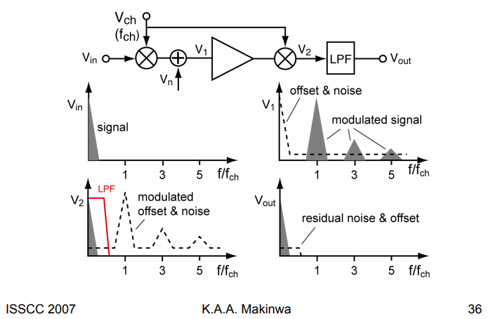
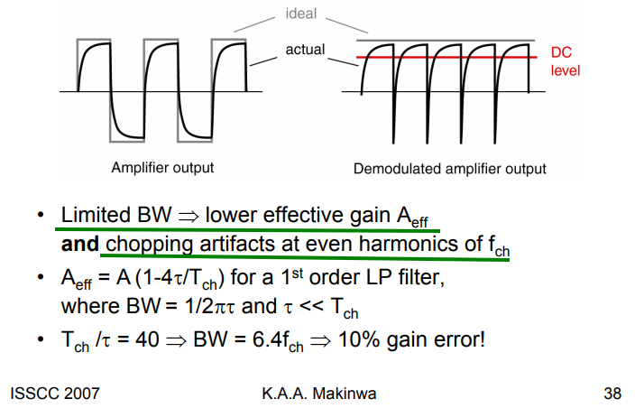
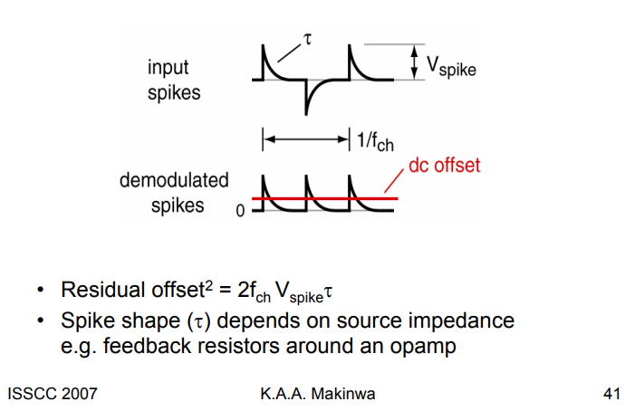

## Autozeroing

> offset is **sampled** and then subtracted from the input
>
> Measure the offset somehow and then subtract it from the input signal

### Residual Noise of Auto-zeroing

---

*pnosie Noise* Type: **timeaverage**

## Chopping

> offset is **modulated** away from the signal band and then filtered out
>
> Modulate the offset away from DC and then filter it out

**Good**: Magically reduces offset, 1/f noise, drift

**Bad**: But creates switching spikes, chopper ripple and other artifacts …

### Chopping in the Frequency Domain

> **Square-wave Modulation**
>
> defination of convolution $y(t) = x(t)*h(t)= \int_{-\infty}^{\infty} x(\tau)h(t-\tau)d\tau$
>
> for real signal $H(j\omega)^*=H(-j\omega)$​

$$
H(j\hat{\omega})*H(j\hat{\omega}) = \int_{-\infty}^{\infty}H(j\omega)H(j(\hat{\omega}-\omega))d\omega
$$

### Bandwidth & Gain Accuracy

- *lower effective gain*: DC level at the output of the amplifiers is a bit less than what it should be

- chopping artifacts at the *even harmonics*:  frequency of output is $2f_{ch}$

> REF. [[https://raytroop.github.io/2023/01/01/insight/#rc-charge-and-discharge](https://raytroop.github.io/2023/01/01/insight/#rc-charge-and-discharge)]

### Residual Offset of Chopping

assume input spikes can be expressed as
$$
V_\text{spike}(t) = V_o e^{-\frac{t}{\tau}}
$$

Then, residual offset is

$$\begin{align}
\overline{V_\text{os}} &= \frac{2\int_0^{T_{ch}/2}V_\text{spike}(t)dt}{T_{ch}} \\
&= 2f_{ch}V_o\int_0^{T_{ch}/2}  e^{-\frac{t}{\tau}}dt\\
&= 2f_{ch}V_o\tau\int_0^{T_{ch}/2\tau} e^{-\frac{t}{\tau}}d\frac{t}{\tau} \\
&\approx 2f_{ch}V_o\tau 
\end{align}$$​

## Dynamic Element Matching (DEM)

*TODO* &#128197;

## reference

C. C. Enz and G. C. Temes, "Circuit techniques for reducing the effects of op-amp imperfections: autozeroing, correlated double sampling, and chopper stabilization," in Proceedings of the IEEE, vol. 84, no. 11, pp. 1584-1614, Nov. 1996, doi: 10.1109/5.542410. [[http://www2.ing.unipi.it/~a008309/mat_stud/MIXED/archive/2019/Articles/Offset_canc_Enz_Temes_96.pdf](http://www2.ing.unipi.it/~a008309/mat_stud/MIXED/archive/2019/Articles/Offset_canc_Enz_Temes_96.pdf)]

Qinwen Fan, Evolution of precision amplifiers

Kofi Makinwa, ISSCC 2007 Dynamic-Offset Cancellation Techniques in CMOS [[https://picture.iczhiku.com/resource/eetop/sYkywlkpwIQEKcxb.pdf](https://picture.iczhiku.com/resource/eetop/sYkywlkpwIQEKcxb.pdf)]

Kofi Makinwa. Precision Analog Circuit Design: Coping with Variability, [[https://youtu.be/nA_DZtRqrTQ?si=6uyOpJhdnYm3iG9d](https://youtu.be/nA_DZtRqrTQ?si=6uyOpJhdnYm3iG9d)] [[https://youtu.be/uwRpP20Lprc?si=SGPta86jRCdECSob](https://youtu.be/uwRpP20Lprc?si=SGPta86jRCdECSob)]
