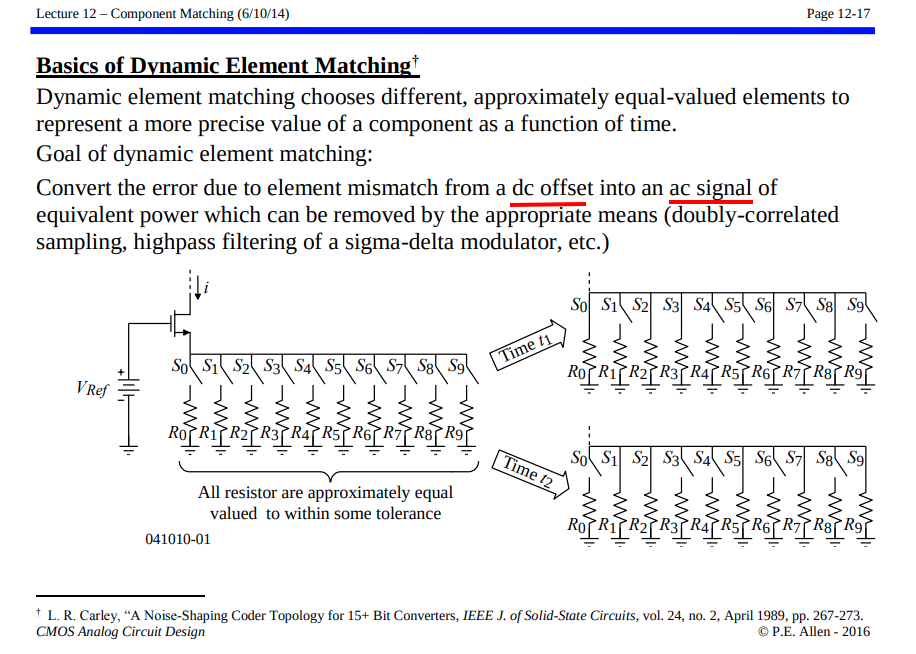
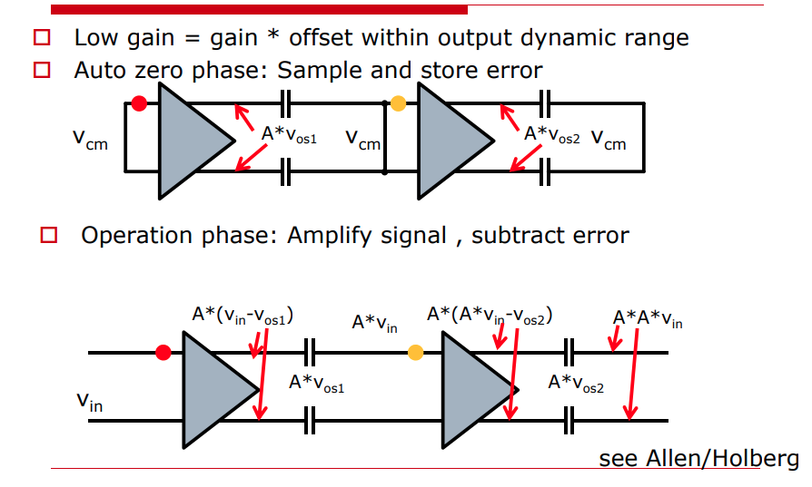
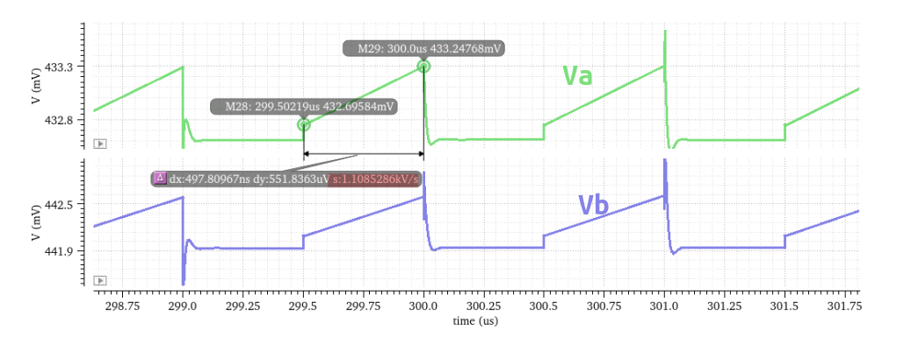
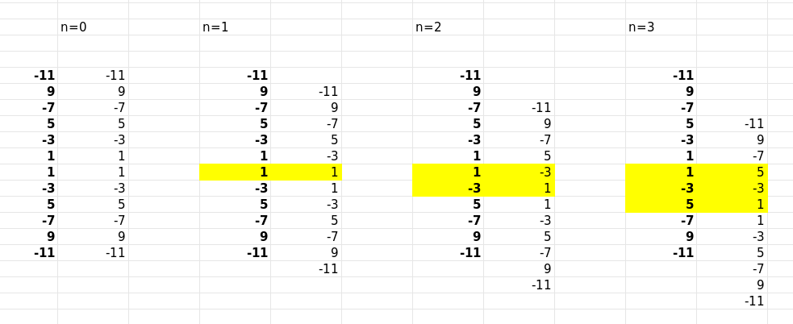
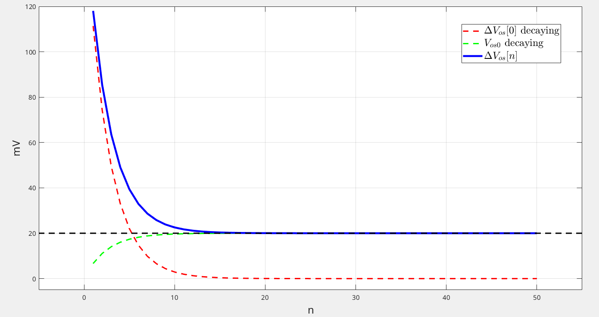

## Correlated Double Sampling (CDS)

*TODO* &#128197;


## Dynamic Element Matching (DEM)

*TODO* &#128197;




> Galton, Ian. (2010). Why dynamic-element-matching DACs work. Circuits and Systems II: Express Briefs, IEEE Transactions on. 57. 69 - 74. 10.1109/TCSII.2010.2042131. [[https://sci-hub.se/10.1109/TCSII.2010.2042131](https://sci-hub.se/10.1109/TCSII.2010.2042131)]
>
> KHIEM NGUYEN. Analog Devices Inc, "Practical Dynamic Element Matching Techniques for 3-level Unit Elements" [[https://picture.iczhiku.com/resource/eetop/shihEDaaoJjFdCVc.pdf](https://picture.iczhiku.com/resource/eetop/shihEDaaoJjFdCVc.pdf)]
>
> E. Alvarez-Fontecilla, P. S. Wilkins and S. C. Rose, "Understanding High-Resolution Dynamic Element Matching DACs [Feature]," in *IEEE Circuits and Systems Magazine*, vol. 23, no. 4, pp. 34-43, Fourthquarter 2023
>
> E. Alvarez-Fontecilla and P. S. Wilkins, "Linearity Through Democracy [Feature]," in *IEEE Circuits and Systems Magazine*, vol. 25, no. 1, pp. 58-69, Firstquarter 2025


## Autozeroing

> offset is **sampled** and then subtracted from the input
>
> Measure the offset somehow and then subtract it from the input signal


###  low gain comparator




### Residual Noise of Auto-zeroing


---


*pnosie Noise* Type: **timeaverage**


### $\Pi$-Capacitor


$$\begin{align}
(V_a-V_{a0})C_0 + (\overline{V_a - V_b} - \overline{V_{a0} - V_{b0}})C_1 &= \Delta Q_a \\
(V_b-V_{b0})C_0 + (\overline{V_b - V_a} - \overline{V_{b0} - V_{a0}})C_1 &= \Delta Q_b
\end{align}$$

therefore we obtain
$$\begin{align}
V_a + V_b &= \frac{\Delta Q_a + \Delta Q_b}{C_0} + V_{a0} + V_{b0} \\
V_a - V_b &= \frac{\Delta Q_a - \Delta Q_b}{C_0+2C_1} + V_{a0} - V_{b0}
\end{align}$$
Then
$$\begin{align}
V_a &= \frac{\Delta Q_a(C_0+C_1)+\Delta Q_b C_1}{C_0(C_0+2C_1)} + V_{a0} \\
V_b &= \frac{\Delta Q_aC_1+\Delta Q_b (C_0+C_1)}{C_0(C_0+2C_1)} + V_{b0}
\end{align}$$

rearrange the above equation
$$\begin{align}
V_a &= \frac{\Delta Q_a}{C_0} + \frac{\Delta Q_b-\Delta Q_a}{C_0(\frac{C_0}{C_1}+2)} +  V_{a0} \\
V_b &= \frac{\Delta Q_b}{C_0} + \frac{\Delta Q_a-\Delta Q_b}{C_0(\frac{C_0}{C_1}+2)} + V_{b0}
\end{align}$$

The difference between $V_a$  and $V_b$
$$
V_a - V_b = \frac{I_a-I_b}{C_0+2C_1}t + V_{a0} - V_{b0}
$$

> $C_1$ **save total capacitor area** while retaining the same $V_a - V_b$ due to $\Delta I_{a,b}$, in comparison to $C_0$


---



at autozero phase
$$\begin{align}
I_{a0} &= \frac{1}{2}\mu C_{OX}\frac{W}{L}(V_{a0} - V_{TH})^2 \\
I_{Rb} &= \frac{1}{2}\mu C_{OX}\frac{W}{L}(V_{b0} - V_{TH})^2
\end{align}$$

then
$$
\Delta I_0 = \frac{1}{2}(V_{a0} - V_{b0})(g_{m,a0}+g_{m,b0})
$$
where $g_{m,a0}+g_{m,b0} = \mu C_{OX}\frac{W}{L}(V_{a0}+V_{b0} - 2V_{TH})$


at comparison phase
$$\begin{align}
I_{a1} &= \frac{1}{2}\mu C_{OX}\frac{W}{L}(V_{a1} - V_{TH})^2 \\
I_{b1} &= \frac{1}{2}\mu C_{OX}\frac{W}{L}(V_{b1} - V_{TH})^2
\end{align}$$

then
$$
\Delta I_1 = \frac{1}{2}(V_{a1} - V_{b1})(g_{m,a1}+g_{m,b1})
$$
That is, $g_{m,a1}+g_{m,b1} = \mu C_{OX}\frac{W}{L}(V_{a1}+V_{b1} - 2V_{TH})$


To minimize the difference between $\Delta I_1$ and $\Delta I_0$, the drift of  both differential and common mode between $V_a$ and $V_b$ shall be alleviated


## Chopping

> offset is **modulated** away from the signal band and then filtered out
>
> Modulate the offset away from DC and then filter it out

**Good**: Magically reduces offset, 1/f noise, drift

**Bad**: But creates switching spikes, chopper ripple and other artifacts …


### Chopping in the Frequency Domain

> **Square-wave Modulation**
>
> definition of convolution $y(t) = x(t)*h(t)= \int_{-\infty}^{\infty} x(\tau)h(t-\tau)d\tau$
>
> for real signal $H(j\omega)^*=H(-j\omega)$​


$$
H(j\hat{\omega})*H(j\hat{\omega}) = \int_{-\infty}^{\infty}H(j\omega)H(j(\hat{\omega}-\omega))d\omega
$$


---

The Fourier Series of squarewave $x(t)$ with amplitudes $\pm 1$, period $T_0$

$$
C_n = \left\{ \begin{array}{cl}
0 &\space \ n=0 \\
0 &\space \ n=\text{even} \\
|\frac{2}{n\pi}| &\space n=\pm 1,\pm 5,\pm9, ... \\
-|\frac{2}{n\pi}| &\space n=\pm 3,\pm 7,\pm11, ...
\end{array} \right.
$$

The Fourier transform of $s(t)=x(t)x(t)$, and we know
$$\begin{align}
S(j2n\omega_0) &= \frac{1}{2\pi}\int X(j(2n\omega_0 -\omega))X(j\omega) d\omega\\
&= \frac{1}{2\pi}\int X(j(\omega-2n\omega_0))X(j\omega) d\omega
\end{align}$$

Therefore $n=0$
$$
S(j0) = \frac{1}{2\pi} (2\pi)^2\cdot \frac{4}{\pi ^2}2\sum_{n=0}^{+\infty}\frac{1}{(2n+1)^2} \delta(\omega) = 2\pi \delta(\omega)
$$

if $n=1$

$$\begin{align}
S(j2\omega_0) &= \frac{1}{2\pi} (2\pi)^2\cdot \frac{4}{\pi ^2}\left(1 - 2\sum_{n=0}^{+\infty}\frac{1}{(2n+1)(2n+3)} \right) \\
&=  \frac{1}{2\pi} (2\pi)^2\cdot \frac{4}{\pi ^2}\left(1 - 2\sum_{n=0}^{+\infty}\frac{1}{2}\left[\frac{1}{2n+1}- \frac{1}{2n+3}\right] \right) \\
&= 0
\end{align}$$



$n=2$
$$\begin{align}
\sum &= -\frac{2}{3} + 2\left(\frac{1}{1\times 5}+ \frac{1}{3\times 7}+ \frac{1}{5\times 9} + \frac{1}{7\times 11}+...\right) \\
&= -\frac{2}{3} + 2\cdot \frac{1}{4}\left(\frac{1}{1}-\frac{1}{5}+ \frac{1}{3}- \frac{1}{7}+ \frac{1}{5} - \frac{1}{9} +\frac{1}{7}-\frac{1}{11}+...\right)  \\
&= -\frac{2}{3} + 2\cdot \frac{1}{4}\frac{4}{3} = 0
\end{align}$$


That is, the input signal **remains the same** after chopping or squarewave up/down modulation


> *EXAMPLE 2.7* in R. E. Ziemer and W. H. Tranter, Principles of Communications, 7th ed., Wiley, 2013 [[pdf](https://physicaeducator.wordpress.com/wp-content/uploads/2018/03/principles-of-communications-7th-edition-ziemer.pdf)]
>
> Prove that $\pi^2/8 = 1 + 1/3^2 + 1/5^2 + 1/7^2 + \cdots$ [[https://math.stackexchange.com/a/2348996](https://math.stackexchange.com/a/2348996)]


### Bandwidth & Gain Accuracy


- *lower effective gain*: DC level at the output of the amplifiers is a bit less than what it should be

- chopping artifacts at the *even harmonics*:  frequency of output is $2f_{ch}$


Below we justify $A_\text{eff} = A(1-4\tau/T_\text{ch})$
$$\begin{align}
V_o(t) &= A + (V_0-A)e^{-t/\tau} \\
V_o(T/2) &= -V_0
\end{align}$$

then
$$
V_0 = -A\frac{1-e^{-T/2\tau}}{1+e^{-T/2\tau}}
$$
Then DC level is
$$
A_\text{eff} = \frac{1}{T/2}\int_0^{T/2} V_o(t)dt = A\left(1-\frac{4\tau}{T}\cdot \frac{1-e^{-T/2\tau}}{1+e^{-T/2\tau}}\right)\approx A\left(1-\frac{4\tau}{T}\right)
$$

where assuming $\tau \ll T$

> REF. [[https://raytroop.github.io/2023/01/01/insight/#rc-charge-discharge](https://raytroop.github.io/2023/01/01/insight/#rc-charge-discharge)]

---


### Residual Offset of Chopping


assume input spikes can be expressed as
$$
V_\text{spike}(t) = V_o e^{-\frac{t}{\tau}}
$$

Then, residual offset is

$$\begin{align}
\overline{V_\text{os}} &= \frac{2\int_0^{T_{ch}/2}V_\text{spike}(t)dt}{T_{ch}} \\
&= 2f_{ch}V_o\int_0^{T_{ch}/2}  e^{-\frac{t}{\tau}}dt\\
&= 2f_{ch}V_o\tau\int_0^{T_{ch}/2\tau} e^{-\frac{t}{\tau}}d\frac{t}{\tau} \\
&\approx 2f_{ch}V_o\tau 
\end{align}$$​


## Ripple Cancellation after Chopping

> On-chip analog filter is not good enough due to limited cutoff frequency


**at $\Phi_+$ phase**
$$
\left\{ \begin{array}{cl}
\Delta V_\text{os}[n] &= \frac{I_l[n]-I_r[n-1]}{G_m}   \\
\left(I_0+\frac{V_\text{os0}-\Delta V_\text{os}[n]}{R_E}\right)\beta &= I_l[n]+I_r[n-1] 
\end{array} \right.
$$
Then
$$
\left\{ \begin{array}{cl}
I_r[n-1] &= \frac{-G_mR_E-\beta}{2R_E}\cdot \Delta V_\text{os}[n] + \frac{\beta}{2R_E}V_\text{os0}+\frac{\beta}{2}I_0   \\
I_l[n] &= \frac{G_mR_E-\beta}{2R_E}\cdot \Delta V_\text{os}[n] + \frac{\beta}{2R_E}V_\text{os0}+\frac{\beta}{2}I_0  
\end{array} \right.
$$
**at $\Phi_-$ phase**
$$
\left\{ \begin{array}{cl}
\Delta V_\text{os}[n] &= \frac{I_l[n-1]-I_r[n]}{G_m}   \\
\left(I_0+\frac{-V_\text{os0}+\Delta V_\text{os}[n]}{R_E}\right)\beta &= I_l[n-1]+I_r[n] 
\end{array} \right.
$$
Then
$$
\left\{ \begin{array}{cl}
I_r[n] &= \frac{-G_mR_E+\beta}{2R_E}\cdot \Delta V_\text{os}[n] - \frac{\beta}{2R_E}V_\text{os0}+\frac{\beta}{2}I_0   \\
I_l[n-1] &= \frac{G_mR_E+\beta}{2R_E}\cdot \Delta V_\text{os}[n] - \frac{\beta}{2R_E}V_\text{os0}+\frac{\beta}{2}I_0  
\end{array} \right.
$$
$\Phi_+ \to \Phi_-$ **state transformation**
$$
\left\{ \begin{array}{cl}
I_r[n-1] &= \frac{-G_mR_E-\beta}{2R_E}\cdot \Delta V_\text{os}[n] + \frac{\beta}{2R_E}V_\text{os0}+\frac{\beta}{2}I_0   \\
I_l[n] &= \frac{G_mR_E-\beta}{2R_E}\cdot \Delta V_\text{os}[n] + \frac{\beta}{2R_E}V_\text{os0}+\frac{\beta}{2}I_0 
\end{array} \right. \to 
\left\{ \begin{array}{cl}
I_r[n+1] &= \frac{-G_mR_E+\beta}{2R_E}\cdot \Delta V_\text{os}[n+1] - \frac{\beta}{2R_E}V_\text{os0}+\frac{\beta}{2}I_0   \\
I_l[n] &= \frac{G_mR_E+\beta}{2R_E}\cdot \Delta V_\text{os}[n+1] - \frac{\beta}{2R_E}V_\text{os0}+\frac{\beta}{2}I_0  
\end{array} \right.
$$
Two $I_l[n]$ shall be equal, that is
$$
\frac{G_mR_E-\beta}{2R_E}\cdot \Delta V_\text{os}[n] + \frac{\beta}{2R_E}V_\text{os0}+\frac{\beta}{2}I_0  = \frac{G_mR_E+\beta}{2R_E}\cdot \Delta V_\text{os}[n+1] - \frac{\beta}{2R_E}V_\text{os0}+\frac{\beta}{2}I_0
$$
Rearrange the above equation
$$
\Delta V_\text{os}[n+1] = \frac{G_mR_E-\beta}{G_mR_E+\beta}\Delta V_\text{os}[n] + \frac{2\beta}{G_mR_E+\beta}V_\text{os0}
$$
$\Phi_- \to \Phi_+$ **state transformation**
$$
\left\{ \begin{array}{cl}
I_r[n] &= \frac{-G_mR_E+\beta}{2R_E}\cdot \Delta V_\text{os}[n] - \frac{\beta}{2R_E}V_\text{os0}+\frac{\beta}{2}I_0   \\
I_l[n-1] &= \frac{G_mR_E+\beta}{2R_E}\cdot \Delta V_\text{os}[n] - \frac{\beta}{2R_E}V_\text{os0}+\frac{\beta}{2}I_0  
\end{array} \right. \to
\left\{ \begin{array}{cl}
I_r[n] &= \frac{-G_mR_E-\beta}{2R_E}\cdot \Delta V_\text{os}[n+1] + \frac{\beta}{2R_E}V_\text{os0}+\frac{\beta}{2}I_0   \\
I_l[n+1] &= \frac{G_mR_E-\beta}{2R_E}\cdot \Delta V_\text{os}[n+1] + \frac{\beta}{2R_E}V_\text{os0}+\frac{\beta}{2}I_0  
\end{array} \right.
$$
Two $I_r[n]$ shall be equal, that is
$$
\frac{-G_mR_E+\beta}{2R_E}\cdot \Delta V_\text{os}[n] - \frac{\beta}{2R_E}V_\text{os0}+\frac{\beta}{2}I_0 = \frac{-G_mR_E-\beta}{2R_E}\cdot \Delta V_\text{os}[n+1] + \frac{\beta}{2R_E}V_\text{os0}+\frac{\beta}{2}I_0 
$$
Rearrange the above equation
$$
\Delta V_\text{os}[n+1] = \frac{G_mR_E-\beta}{G_mR_E+\beta}\Delta V_\text{os}[n] + \frac{2\beta}{G_mR_E+\beta}V_\text{os0}
$$


***Both State-transition equations are same***
$$
\Delta V_\text{os}[n+1] = \frac{G_mR_E-\beta}{G_mR_E+\beta}\Delta V_\text{os}[n] + \frac{2\beta}{G_mR_E+\beta}V_\text{os0}
$$
With geometric progression sum formula
$$
\Delta V_\text{os}[n] = \left(\frac{G_mR_E-\beta}{G_mR_E+\beta}\right)^n\cdot \Delta V_\text{os}[0] + \left[1-\left(\frac{G_mR_E-\beta}{G_mR_E+\beta}\right)^n\right]\cdot V_\text{os0}
$$
during $n \to \infty$
$$
\lim_{n\to \infty} \Delta V_\text{os}[n] = V_\text{os0}
$$
As expected
$$
\lim_{n\to \infty} V_\text{os}[n] =\lim_{n\to \infty} V_\text{os0}-\Delta V_\text{os}[n] = 0
$$

---

Assuming that begainning from $\Phi_+$ phase
$$
\left\{ \begin{array}{cl}
\Delta V_\text{os}[0] &= \frac{I_l[0]-I_r[-1]}{G_m}   \\
\left(I_0+\frac{V_\text{os0}-\Delta V_\text{os}[0]}{R_E}\right)\beta &= I_l[0]+I_r[-1] 
\end{array} \right. \overset{\mathcal{I_r[-1]=0}}{\Longrightarrow}  \Delta V_\text{os}[0]=\frac{(I_0R_E+V_\text{os0})\beta}{G_mR_E+\beta}
$$
With $I_0=10\mu A$, $R_E=5k \Omega$, $V_\text{os0}=20mV$, $G_m=500\mu S$, $\beta=0.5$
$$
\left\{ \begin{array}{cl}
\Delta V_\text{os}[0] &= 167mV   \\
\frac{G_mR_E-\beta}{G_mR_E+\beta} &= 0.667
\end{array} \right.
$$




```matlab
DVos0 = 167;  % mV
Vos0 = 20; % mV
Rr = 0.667;

n = 1:1:50;
DVosn_DVos0 = Rr.^n*DVos0;
DVosn_Vos0 = (1-Rr.^n)*Vos0;
DVosn = DVosn_DVos0 + DVosn_Vos0;

plot(n, DVosn_DVos0,'--r', LineWidth=2);
hold on
plot(n, DVosn_Vos0, '--g', LineWidth=2);
plot(n, DVosn, 'b', LineWidth=3);
plot(-5:1:55, ones(1,61)*Vos0, '--k', LineWidth=2)

grid on;
xlim([-5, 55]);ylim([-5, 120]);
xlabel('n', FontSize=16); ylabel('mV', FontSize=16);
legend('$\Delta V_{os}[0]$ decaying','$V_{os0}$ decaying','$\Delta V_{os}[n]$', '$V_{os0}$', 'Interpreter','latex', fontsize=16)
```


## reference

C. C. Enz and G. C. Temes, "Circuit techniques for reducing the effects of op-amp imperfections: autozeroing, correlated double sampling, and chopper stabilization," in Proceedings of the IEEE, vol. 84, no. 11, pp. 1584-1614, Nov. 1996, doi: 10.1109/5.542410. [[http://www2.ing.unipi.it/~a008309/mat_stud/MIXED/archive/2019/Articles/Offset_canc_Enz_Temes_96.pdf](http://www2.ing.unipi.it/~a008309/mat_stud/MIXED/archive/2019/Articles/Offset_canc_Enz_Temes_96.pdf)]

Kofi Makinwa. Precision Analog Circuit Design: Coping with Variability, [[https://youtu.be/nA_DZtRqrTQ?si=6uyOpJhdnYm3iG9d](https://youtu.be/nA_DZtRqrTQ?si=6uyOpJhdnYm3iG9d)] [[https://youtu.be/uwRpP20Lprc?si=SGPta86jRCdECSob](https://youtu.be/uwRpP20Lprc?si=SGPta86jRCdECSob)]

 Chung-chun Chen, Why Design Challenge in Chopping Offset & Flicker Noise? [[https://youtu.be/ydjca2KrXgc?si=2raCIB99vXriMPsq](https://youtu.be/ydjca2KrXgc?si=2raCIB99vXriMPsq)]

—, Why Needs A Low Ripple after Chopping Amplifier for A Very Low DC Offset & Flicker Noise? [[https://youtu.be/y7TzJtHE7IA?si=kUeP_ESofVxp3IT_](https://youtu.be/y7TzJtHE7IA?si=kUeP_ESofVxp3IT_)]

Qinwen Fan, Evolution of precision amplifiers

Kofi Makinwa, ISSCC 2007 Dynamic-Offset Cancellation Techniques in CMOS [[https://picture.iczhiku.com/resource/eetop/sYkywlkpwIQEKcxb.pdf](https://picture.iczhiku.com/resource/eetop/sYkywlkpwIQEKcxb.pdf)]

Axel Thomsen, Silicon Laboratories  ISSCC2012 T8: "Managing Offset and Flicker Noise" [[slides](https://www.nishanchettri.com/isscc-slides/2012%20ISSCC/TUTORIALS/ISSCC2012Visuals-T8.pdf),[transcript](https://www.nishanchettri.com/isscc-slides/2012%20ISSCC/TUTORIALS/T8%20Transcription.pdf)]

---

CC Chen. Why Dynamic Offset or Mismatch Cancellation with Auto-zeroing Technique? [[https://youtu.be/PQJwzd1tyO0](https://youtu.be/PQJwzd1tyO0)]

—. Why Dynamic Offset or Mismatch Cancellation with Chopping Technique? [[https://youtu.be/x5FS8jEKu_g](https://youtu.be/x5FS8jEKu_g)]

—. Why Design Challenge in Chopping Offset & Flicker Noise? [[https://youtu.be/ydjca2KrXgc](https://youtu.be/ydjca2KrXgc)]

—. Why Needs A Low Ripple after Chopping Amplifier for A Very Low DC Offset & Flicker Noise? [[https://youtu.be/y7TzJtHE7IA](https://youtu.be/y7TzJtHE7IA)]

