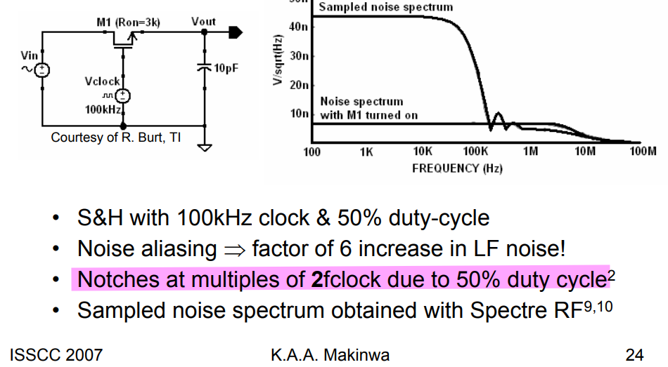
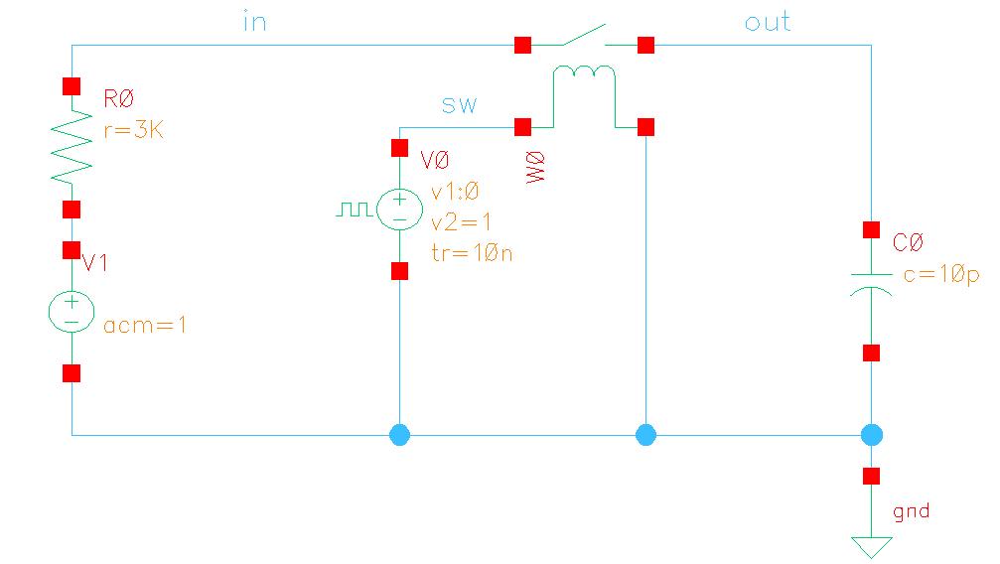
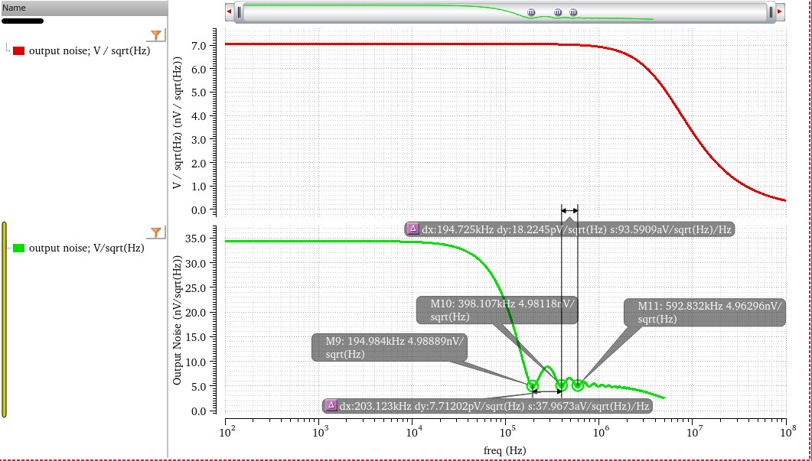
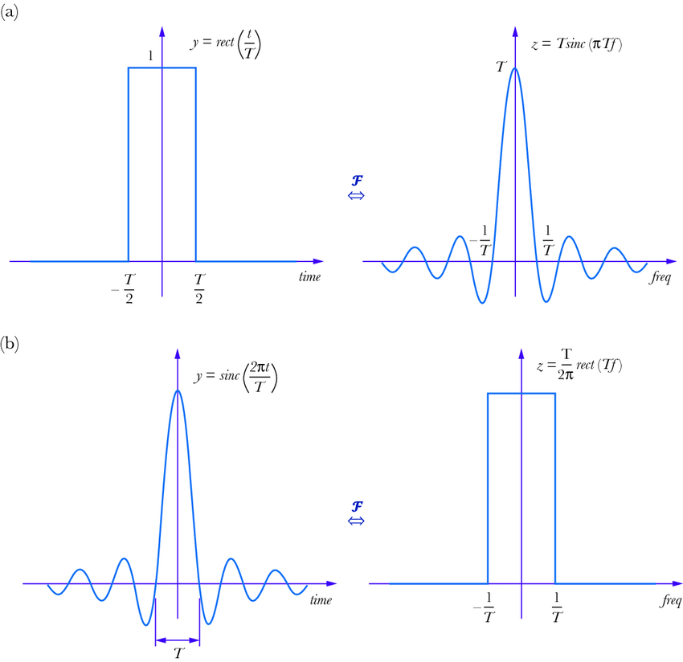

## Autozeroing

> offset is **sampled** and then subtracted from the input
>
> Measure the offset somehow and then subtract it from the input signal

### Residual Noise of Auto-zeroing

---

*pnosie Noise* Type: **timeaverage**

> sinc filter come from *Zero-Order Hold*
>
> 

## Chopping

> offset is **modulated** away from the signal band and then filtered out
>
> Modulate the offset away from DC and then filter it out

**Good**: Magically reduces offset, 1/f noise, drift

**Bad**: But creates switching spikes, chopper ripple and other artifacts …

> C. C. Enz and G. C. Temes, "Circuit techniques for reducing the effects of op-amp imperfections: autozeroing, correlated double sampling, and chopper stabilization," in Proceedings of the IEEE, vol. 84, no. 11, pp. 1584-1614, Nov. 1996, doi: 10.1109/5.542410. [[http://www2.ing.unipi.it/~a008309/mat_stud/MIXED/archive/2019/Articles/Offset_canc_Enz_Temes_96.pdf](http://www2.ing.unipi.it/~a008309/mat_stud/MIXED/archive/2019/Articles/Offset_canc_Enz_Temes_96.pdf)]
>
> Bernhard E. Boser, M12 Precision Techniques [[https://people.eecs.berkeley.edu/~boser/courses/240B/lectures/M12%20Precision%20Techniques.pdf](https://people.eecs.berkeley.edu/~boser/courses/240B/lectures/M12%20Precision%20Techniques.pdf)]
>
> Qinwen Fan, Evolution of precision amplifiers
>
> Wu, R., Huijsing, JH., & Makinwa, KAA. (2013). Precision Instrumentation Amplifiers and Read-Out Integrated Circuits. Springer. https://doi.org/10.1007/978-1-4614-3731-4
>
> Kofi Makinwa, UPC 2009 [Overcoming Offset](https://electronicengineering.phd.upc.edu/en/courses-and-seminars/courses-materials/2008-2009/slides-makinwa-1)
>
> Kofi Makinwa, ISSCC 2007 Dynamic-Offset Cancellation Techniques in CMOS [[https://picture.iczhiku.com/resource/eetop/sYkywlkpwIQEKcxb.pdf](https://picture.iczhiku.com/resource/eetop/sYkywlkpwIQEKcxb.pdf)]
>
> Chopper Amplifiers Demystified Kofi A. A. Makinwa [[https://youtu.be/J19rRjKV7kk?si=oHXskwd9y-B35cJt](https://youtu.be/J19rRjKV7kk?si=oHXskwd9y-B35cJt)]
>
> ESSCIRC2023 Circuit Insights Kofi Makinwa [[https://youtu.be/uwRpP20Lprc?si=D8S4kjexbdsbuhb7](https://youtu.be/uwRpP20Lprc?si=D8S4kjexbdsbuhb7)]
>
> Cadence Tutorial Part-4: Chopping Technique; Dynamic Offset Cancellation; Chopper Amp Simulations [[https://youtu.be/gF8sOlK7TM8?si=6o_ABKN-IWs-1Khm](https://youtu.be/gF8sOlK7TM8?si=6o_ABKN-IWs-1Khm)]

## Dynamic Element Matching (DEM)

*TODO* &#128197;

## reference

Kofi Makinwa. Precision Analog Circuit Design: Coping with Variability, [[https://youtu.be/nA_DZtRqrTQ?si=6uyOpJhdnYm3iG9d](https://youtu.be/nA_DZtRqrTQ?si=6uyOpJhdnYm3iG9d)] [[https://youtu.be/uwRpP20Lprc?si=SGPta86jRCdECSob](https://youtu.be/uwRpP20Lprc?si=SGPta86jRCdECSob)]
