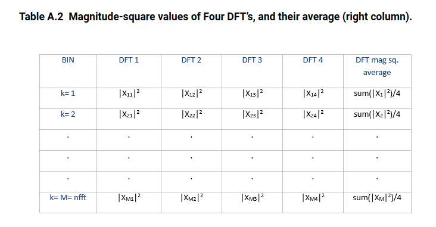

One will see the following phenomena: 

1. A power spectrum is equal to the square of the absolute value of DFT. 
2. The sum of all power spectral lines in a power spectrum is equal to the power of the input signal. 
3. The integral of a PSD is equal to the power of the input signal.

> power spectrum has units of $V^2$ and power spectral density has units of $V^2/Hz$


**Parseval's theorem** is a property of the Discrete Fourier Transform (DFT) that states:
$$
\sum_{n=0}^{N-1}|x(n)|^2 = \frac{1}{N}\sum_{k=0}^{N-1}|X(k)|^2
$$
Multiply both sides of the above by $1/N$:
$$
\frac{1}{N}\sum_{n=0}^{N-1}|x(n)|^2 = \frac{1}{N^2}\sum_{k=0}^{N-1}|X(k)|^2
$$
$|x(n)|^2$ is instantaneous power of a sample of the time signal. So the left side of the equation is just the **average power** of the signal over the N samples. 
$$
P_{\text{av}} = \frac{1}{N^2}\sum_{k=0}^{N-1}|X(k)|^2\text{,   }V^2
$$
For the each DFT bin, we can say:
$$
P_{\text{bin}}(k) = \frac{1}{N^2}|X(k)|^2\text{, k=0:N-1,  }V^2/\text{bin}
$$
This is the power spectrum of the signal.

Note that $X(k)$ is the **two-sided spectrum**. If $x(n)$ is real, then $X(k)$ is symmetric about $fs/2$, with each side containing half of the power. In that case, we can choose to keep just the **one-sided spectrum**, and multiply Pbin by 2 (**except DC & Nyquist**):

$$
P_{\text{bin,one-sided}}(k) = \left\{ \begin{array}{cl}
\frac{1}{N^2}|X(0)|^2 & : \ k = 0 \\
\frac{2}{N^2}|X(k)|^2 & : \ 1 \leq k \leq N/2-1 \\
\frac{1}{N^2}|X(N/2)|^2 & : \ k = N/2
\end{array} \right.
$$

```matlab
rng default
Fs = 1000;
t = 0:1/Fs:1-1/Fs;
x = cos(2*pi*100*t) + randn(size(t));
N = length(x);
xdft = fft(x);
xsq_sum_avg = sum(x.^2)/N;
specsq_sum_avg = sum(abs(xdft).^2)/N^2;
```

where `xsq_sum_avg` is same with `specsq_sum_avg`


> For a discrete-time sequence x(n), the DFT is defined as:
> $$
> X(k) = \sum_{n=0}^{N-1}x(n)e^{-j2\pi kn/N}
> $$
> By it definition, the DFT does **NOT** apply to infinite duration signals.


## scaling DFT results

| spectra type           | unit   |
| ---------------------- | ------ |
| amplitude spectrum     | V      |
| power spectrum         | V^2    |
| power spectrum density | V^2/Hz |

> [Tutorial on Scaling of the Discrete Fourier Transform and the Implied Physical Units of the Spectra of Time-Discrete Signals *Jens Ahrens, Carl Andersson, Patrik Höstmad, Wolfgang Kropp*](https://appliedacousticschalmers.github.io/scaling-of-the-dft/AES2020_eBrief/)

Different scaling is needed to apply for amplitude spectrum, power spectrum and power spectrum density, which shown as below


> $f_s$ in Eq.(13) is **sample rate** rather than frequency resolution. 

And Eq.(13) can be expressed as
$$
\text{PSD}(k) =\frac{1}{f_{\text{res}}\cdot N\sum_{n}w^2(n)}\left|X_{\omega}(k)\right|^2
$$
where $f_{\text{res}}$ is frequency resolution

We define the following two sums for normalization purposes:

$$\begin{align}
S_1 &= \sum_{j=0}^{N-1}w_j \\
S_2 &= \sum_{j=0}^{N-1}w_j^2
\end{align}$$


Given Eq.(12) and Eq.(13)
$$\begin{align}
\text{PS(k)} &= \text{PSD(k)} \cdot \frac{f_s \sum_{n}w^2(n)}{(\sum_{n}\omega(n))^2} \\
&= \text{PSD(k)} \cdot f_{\text{res}} \cdot \frac{N \sum_{n}w^2(n)}{(\sum_{n}w(n))^2} \\
&= \text{PSD(k)} \cdot f_{\text{res}} \cdot \frac{N S_2}{S_1^2} \\
&= \text{PSD(k)} \cdot f_{\text{res}} \cdot \text{NENBW} \\
&= \text{PSD(k)} \cdot \text{ENBW}
\end{align}$$

where **Normalized Equivalent Noise BandWidth** is defined as
$$
\text{NENBW} =\frac{N S_2}{S_1^2}
$$
and **Effective Noise BandWidth** is
$$
\text{ENBW} =f_{\text{res}} \cdot \frac{N S_2}{S_1^2}
$$

> For Rectangular window, $\text{ENBW} =f_{\text{res}}$
>
> This *equivalent noise bandwidth* is required when the resulting spectrum is to be expressed as *spectral density (such as for noise measurements)*. 


*Eq.(13) Example:*

```matlab
Fs = 1024; 
t  = (0:1/Fs:1-1/Fs).'; 
x  = sin(2*pi*t*200);
Nx = length(x);
% Window data
w = hamming(Nx);	% hamming window
xw = x.*w; 
% Calculate power
nfft = Nx; 
X = fft(xw,nfft);

NumUniquePts = nfft/2+1;
Pxx1 = abs(X(1:NumUniquePts)).^2/sum(w.^2)/Fs;    %!!! Eq.(13)
Pxx1(2:end-1) = Pxx1(2:end-1)*2;    % twosided -> onesided
Fx1 = (0:NumUniquePts-1)*Fs/nfft; 

[Pxx2,Fx2] = pwelch(x,w,0,nfft,Fs);

plot(Fx1,10*log10(Pxx1),Fx2,10*log10(Pxx2),'r--');
legend('PSD via Eq.(13)','PSD via pwelch')
```


## window effects

It is possible to correct both the amplitude and energy content of the windowed signal to equal the original signal. However, both corrections cannot be applied simultaneously

### Amplitude correction

*Linear (amplitude) Spectrum*
$$
X(k) = \frac{X_{\omega}(k)}{S_1}
$$
*power spectrum*
$$
\text{PS}=\frac{\left| X_{\omega}(k) \right|^2}{S_1^2}
$$

> usage: tone amplitude

### Power correction 

**power spectral density (PSD)**
$$
\text{PSD} =\frac{\left|X_{\omega}(k)\right|^2}{f_s\cdot S_2}
$$

> We have $\text{PSD}  = \frac{\text{PS}}{\text{ENBW}}$, where $\text{ENBW}=\frac{N \cdot S_2}{S_1^2}f_{\text{res}}$


**linear power spectrum**
$$
\text{PS}_L=\frac{|X_{\omega}(k)|^2}{N\cdot S_2}
$$

> usage:  RMS value, total power
> $$
> \text{PS}_L(k)=\text{PSD(k)} \cdot f_{\text{res}}
> $$


### Window Correction Factors

While a window helps reduce leakage (The window reduces the jumps at the ends of the repeated signal), the window itself distorts the data in two different ways:

- **Amplitude** – The *amplitude* of the signal is reduced

  > This is due to the fact that the window removes information in the signal

- **Energy** – The *area* under the curve, or energy of the signal, is reduced


**Window correction factors** are used to try and compensate for the effects of applying a window to data. There are both amplitude and energy correction factors.

| Window Type | Amplitude Correction ($K_a$) | Energy Correction ($K_e$) |
| ----------- | ---------------------------- | ------------------------- |
| Rectangluar | 1.0                          | 1.0                       |
| hann        | 1.9922                       | 1.6298                    |
| blackman    | 2.3903                       | 1.8155                    |
| kaiser      | 1.0206                       | 1.0204                    |

Only the Uniform window (rectangular window), which is equivalent to no window, has the same amplitude and energy correction factors.

$$\begin{align}
X(k) &= \frac{X_\omega(k)}{\sum_n w(n)} \\
&= \frac{N}{\sum_n w(n)} \frac{X_\omega(k)}{N} \\
&= K_a \cdot \frac{X_\omega(k)}{N}
\end{align}$$
where $K_a = \frac{N}{\sum_n \omega(n)}$

> In literature,  **Coherent power gain** is defined show below, which is close related to $K_a$
> $$
> \text{Coherent power gain (dB)} = 20 \; log_{10} \left( \frac{\sum_n w[n]}{N} \right)
> $$
> 


> With amplitude correction, by multiplying by two, the *peak value* of both the original and corrected spectrum match. However the energy content is not the same.
>
> The amplitude corrected signal (red) appears to have more energy, or area under the curve, than the original signal (blue).

$$\begin{align}
\text{PSD} &=\frac{1}{f_{\text{res}}\cdot N\sum_{n}w^2(n)}\left|X_{\omega}(K)\right|^2 \\
&= \frac{N}{\sum_{n}w^2(n)} \frac{\left|X_{\omega}(K)\right|^2}{f_{\text{res}}\cdot N^2} \\
&=\left|K_e \cdot \frac{X_{\omega}(K)}{N}\right|^2 \cdot \frac{1}{f_{\text{res}}}
\end{align}$$

wherer $K_e  = \sqrt{\frac{N}{\sum_{n}\omega^2(n)}}$


> Multiplying the values in the spectrum by 1.63, rather than 2, makes the *area* under the curve the same for both the original signal (blue) and energy corrected signal (red)

**hanning**'s correction factors:

```matlab
N = 256;
w = hanning(N);
Ka = N/sum(w)
Ke = sqrt(N/sum(w.^2))
```

```
Ka =

    1.9922


Ke =

    1.6298
```


**!!! Caution**: `dft` and `psd`  function in virtuoso

- `dft` always return 

  

To compensate windowing effect, $W(n)$, the `dft` output should be multiplied by $K_a$,  e.g.  1.9922 for hanning window.

- `psd` function has taken into account $K_e$,   postprocessing is **not** needed


### Amplitude,Power Correction Example


```matlab
%% 200 Hz, amplitude 1 and 200/3 Hz amplitude 0.3
fosc = 200;
Fs = 8192;
Nx = Fs*4;
tstop = Nx/Fs;
t  = (0:1/Fs:tstop-1/Fs).'; 
x  = sin(2*pi*t*fosc) + 0.3*sin(2*pi*t*fosc/3);
Nx = length(x);

%% direct method, time domain
P0 = sum(x.^2)/Nx;
xrms0 = sqrt(P0);   % RMS value caculated by time domain
fprintf("xrms0: %.4f\n", xrms0);

%% Window data
w = hamming(Nx);	% hamming window
%w = ones(Nx, 1);	% rectangular window

S1= sum(w);
S2 = sum(w.^2);
NENBW = Nx*S2/S1^2;

xw = x.*w; 
nfft = Nx; 
X = fft(xw,nfft);   % windowed signal fft
NumUniquePts = nfft/2+1;
Fx1 = (0:NumUniquePts-1)*Fs/nfft;

%% fft - ps -> rms
Xmag = abs(X);
PS1 = Xmag.^2/S1^2;    %!!! Eq.(12)
PS1 = PS1(1:NumUniquePts);
PS1(2:end-1) = PS1(2:end-1)*2;    % twosided -> onesided
Pmax_fft = max(PS1);    % !!! amplitude OK
fprintf("Pmax_fft: %.4f\n", Pmax_fft);

% linear power spectrum
PSL_fft = Xmag.^2/nfft/S2;
PSL_fft = PSL_fft(1:NumUniquePts);
PSL_fft = PSL_fft(2:end-1)*2;
Ptot_fft1 = sum(PSL_fft);
xrms_PSL = sqrt(Ptot_fft1); % !!! power OK
fprintf("xrms_PSL: %.4f\n", xrms_PSL);

% use psd*fres to calculate total power
Pxx1 = abs(X(1:NumUniquePts)).^2/sum(w.^2)/Fs;    %!!! Eq.(13)
Pxx1(2:end-1) = Pxx1(2:end-1)*2;    % twosided -> onesided
Ptot_fft2 = sum(Pxx1*Fs/nfft);
xrms_psd = sqrt(Ptot_fft2);     % !!! power OK
fprintf("xrms_psd: %.4f\n", xrms_psd);


%% pwelch
[Pxx2,Fx2] = pwelch(x,w,0,nfft,Fs);
fres = Fx2(2)-Fx2(1);

PS2 = Pxx2*fres;
Ptot_pwelch = sum(PS2);
xrms_pwelch = sqrt(Ptot_pwelch);    % !!! amplitude OK
fprintf("xrms_pwelch: %.4f\n", xrms_pwelch);

% PS = PSD * ENBW always hold
ENBW = fres * NENBW;
PS2_pwelch = Pxx2*ENBW;
Pmax_pwelch = max(PS2_pwelch);  % !!! amplitude OK
fprintf("Pmax_pwelch: %.4f\n", Pmax_pwelch);

%% plot psd of two methods
plot(Fx1,10*log10(Pxx1),Fx2,10*log10(Pxx2),'r--');
legend('PSD via Eq.(13)','PSD via pwelch')
grid on;
xlabel('Freq (Hz)');
ylabel('dB; V^2/Hz')
```

```
xrms0: 0.7383
Pmax_fft: 0.5000
xrms_PSL: 0.7382
xrms_psd: 0.7382
xrms_pwelch: 0.7382
Pmax_pwelch: 0.5000
```


## RMS

We may also want to know for example the RMS value of the signal, in order to know how much power the signal generates. This can be done using Parseval’s theorem.

For a **periodic** signal, which has a discrete spectrum, we obtain its total RMS value by summing the included signals using
$$
x_{\text{rms}}=\sqrt{\sum R_{xk}^2}
$$
Where $R_{xk}$ is the RMS value of each sinusoid for  $k=1,2,3,...$ The RMS value of a signal consisting
of a number of sinusoids is consequently equal to **the square root of the sum of the RMS values**. 

This result could also be explained by noting that sinusoids of different frequencies are **orthogonal**, and can therefore be summed like vectors (using *Pythagoras’ theorem*)

For a random signal we cannot interpret the spectrum in the same way. As we have stated earlier, the PSD of a random signal contains all frequencies in a particular frequency band, which makes it *impossible to add the frequencies up*.  Instead, as the PSD is a density function, the correct interpretation is to sum the area under the PSD in a specific frequency range, which then is the square of the RMS, i.e., the mean-square value of the signal
$$
x_{\text{rms}}=\sqrt{\int G_{xx}(f)df}=\sqrt{\text{area under the curve}}
$$
The **linear spectrum**, or **RMS spectrum**, defined by
$$\begin{align}
X_L(k) &= \sqrt{\text{PSD(k)} \cdot f_{\text{res}}}\\
&=\sqrt{\frac{\left|X_{\omega}(k)\right|^2}{f_{\text{res}}\cdot N\sum_{n}\omega^2(n)} \cdot f_{\text{res}}} \\
&= \sqrt{\frac{\left|X_{\omega}(k)\right|^2}{N\sum_{n}\omega^2(n)}} \\
&= \sqrt{\frac{|X_{\omega}(k)|^2}{N\cdot S_2}}
\end{align}$$

The corresponding **linear power spectrum** or **RMS power spectrum** can be defined by
$$\begin{align}
\text{PS}_L(k)&=X_L(k)^2=\frac{|X_{\omega}(k)|^2}{S_1^2}\frac{S_1^2}{N\cdot S_2} \\
&=\text{PS}(k) \cdot \frac{S_1^2}{N\cdot S_2}
\end{align}$$

So, RMS can be calculated as below
$$\begin{align}
P_{\text{tot}} &= \sum \text{PS}_L(k) \\
\text{RMS} &= \sqrt{P_{\text{tot}}}
\end{align}$$


## DFT averaging

 we use $N= 8*\text{nfft}$ time samples of $x$ and set the number of overlapping samples to $\text{nfft}/2 = 512$. `pwelch` takes the DFT of $\text{Navg} = 15$ overlapping segments of $x$, each of length $\text{nfft}$, then averages the $|X(k)|^2$ of the DFT’s.

In general, if there are an integer number of segments that cover all samples of N, we have
$$
N = (N_{\text{avg}}-1)*D + \text{nfft}
$$
where $D=\text{nfft}-\text{noverlap}$. For our case, with $D = \text{nfft}/2$ and $N/\text{nfft} = 8$, we have
$$
N_{\text{avg}}=2*N/\text{nfft}-1=15
$$
For a given number of time samples N, using overlapping segments lets us increase $N_{avg}$ compared with no overlapping. In this case, overlapping of 50% increases $N_{avg}$ from 8 to 15. Here is the Matlab code to compute the spectrum:

```matlab
    nfft= 1024;
    N= nfft*8;                                % number of samples in signal
    n= 0:N-1;
    x= A*sin(2*pi*f0*n*Ts) + .1*randn(1,N);   % 1 W sinewave + noise
    noverlap= nfft/2;                         % number of overlapping time samples
    window= hanning(nfft);
    [pxx,f]= pwelch(x,window,noverlap,nfft,fs);  % W/Hz  PSD
    PdB_bin= 10*log10(pxx*fs/nfft);              % dBW/bin
```


> **DFT averaging** reduces the variance $\sigma^2$ of the noise spectrum by a factor of $N_{avg}$, as long as `noverlap` is not greater than `nfft/2 `




## fftshift

The result of `fft`  and its index is shown as below


After `fftshift`


```matlab
>> fftshift([1 2 3 4 5 6])

ans =

     4     5     6     1     2     3
```


## reference

[Demonstration-DFT-PS-PSD](https://github.com/liangsizhuang/Demonstration-DFT-PS-PSD)

[mathworks, Power Spectral Density Estimates Using FFT](https://www.mathworks.com/help/signal/ug/power-spectral-density-estimates-using-fft.html)

Lyons, Richard, “Widowing Functions Improve FFT Results”, EDN, June 1, 1998. [https://www.edn.com/electronics-news/4383713/Windowing-Functions-Improve-FFT-Results-Part-I](https://www.edn.com/electronics-news/4383713/Windowing-Functions-Improve-FFT-Results-Part-I ) 

Rapuano, Sergio, and Harris, Fred J., An Introduction to FFT and Time Domain Windows, IEEE Instrumentation and Measurement Magazine, December, 2007. [https://ieeexplore.ieee.org/document/4428580](https://ieeexplore.ieee.org/document/4428580)

[Neil Robertson, The Power Spectrum](https://www.dsprelated.com/showarticle/1004.php)

[Neil Robertson, Use Matlab Function pwelch to Find Power Spectral Density – or Do It Yourself](https://www.dsprelated.com/showarticle/1221.php)

[Neil Robertson, Evaluate Window Functions for the Discrete Fourier Transform](https://www.dsprelated.com/showarticle/1211.php)

[Mathuranathan Viswanathan, Interpret FFT, complex DFT, frequency bins & FFTShift](https://www.gaussianwaves.com/2015/11/interpreting-fft-results-complex-dft-frequency-bins-and-fftshift/)

[robert bristow-johnson, Does windowing affect Parseval's theorem?](https://dsp.stackexchange.com/a/47603/59253)

Heinzel, Gerhard, A. O. Rüdiger and Roland Schilling. "Spectrum and spectral density estimation by the Discrete Fourier transform (DFT), including a comprehensive list of window functions and some new at-top windows." (2002). URL: [https://holometer.fnal.gov/GH_FFT.pdf](https://holometer.fnal.gov/GH_FFT.pdf)

Window Correction Factors URL: [https://community.sw.siemens.com/s/article/window-correction-factors](https://community.sw.siemens.com/s/article/window-correction-factors)

Brandt, A, 2011. Noise and vibration analysis: signal analysis and experimental procedures. John Wiley & Sons

What should be the correct scaling for PSD calculation using fft. URL:[https://dsp.stackexchange.com/a/32205](https://dsp.stackexchange.com/a/32205)

POWER SPECTRAL DENSITY CALCULATION VIA MATLAB Revision C. URL: [http://www.vibrationdata.com/tutorials_alt/psd_mat.pdf](http://www.vibrationdata.com/tutorials_alt/psd_mat.pdf)

Jens Ahrens, Carl Andersson, Patrik Höstmad, Wolfgang Kropp, “Tutorial on Scaling of the Discrete Fourier Transform and the Implied Physical Units of the Spectra of Time-Discrete Signals” in 148th Convention of the AES, e-Brief 56, May 2020 [ [pdf](http://www.soundfieldsynthesis.org/wp-content/uploads/pubs/Ahrens_etal_AES2020.pdf), [web](https://appliedacousticschalmers.github.io/scaling-of-the-dft/AES2020_eBrief/) ].

Manolakis, D., & Ingle, V. (2011). *Applied Digital Signal Processing: Theory and Practice*. Cambridge: Cambridge University Press. doi:10.1017/CBO9780511835261
