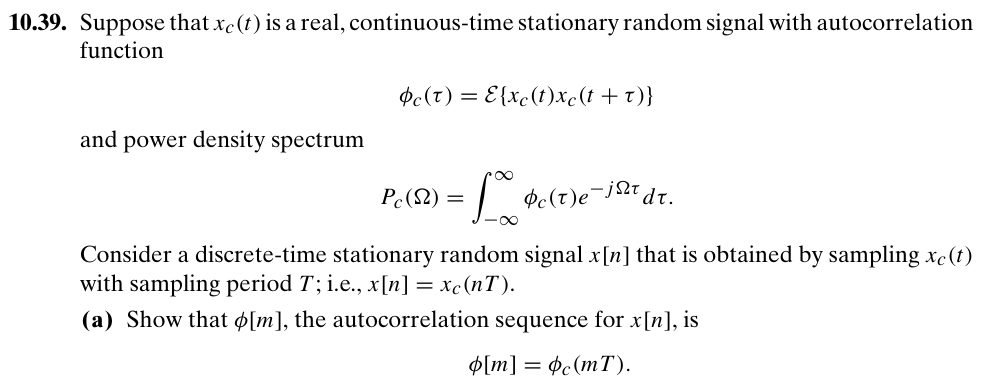
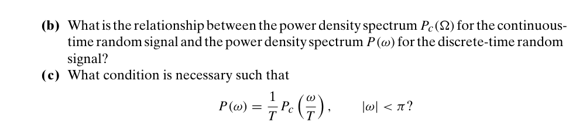
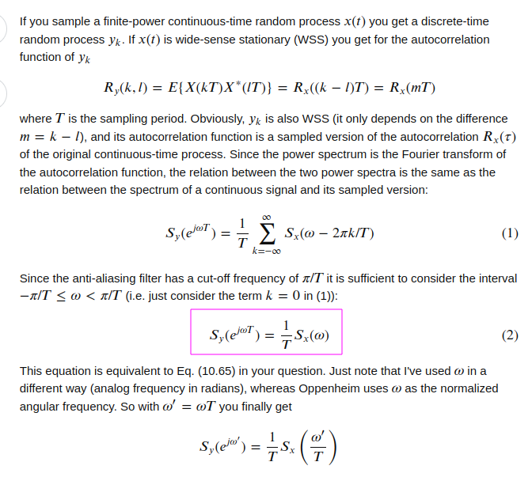

## Random Signals Sampling

> sampling autocorrelation sequence

> Alan V Oppenheim, Ronald W. Schafer. Discrete-Time Signal Processing, 3rd edition

---

> 
>
> [[https://dsp.stackexchange.com/a/17348/59253](https://dsp.stackexchange.com/a/17348/59253)]

## LTI Systems on WSS Processes

> Topic 6 Random Processes and Signals [[https://www.robots.ox.ac.uk/~dwm/Courses/2TF_2021/N6.pdf](https://www.robots.ox.ac.uk/~dwm/Courses/2TF_2021/N6.pdf)]
>
> Alan V. Oppenheim, Introduction To Communication, Control, And Signal Processing [[https://ocw.mit.edu/courses/6-011-introduction-to-communication-control-and-signal-processing-spring-2010/a6bddaee5966f6e73450e6fe79ab0566_MIT6_011S10_notes.pdf](https://ocw.mit.edu/courses/6-011-introduction-to-communication-control-and-signal-processing-spring-2010/a6bddaee5966f6e73450e6fe79ab0566_MIT6_011S10_notes.pdf)]

## reference

Iain Collings. Random Processes [[https://youtube.com/playlist?list=PLx7-Q20A1VYKRLHUMSt2YOORrVz8iH-Kq&si=cZjlH7zcHcR0zWg6](https://youtube.com/playlist?list=PLx7-Q20A1VYKRLHUMSt2YOORrVz8iH-Kq&si=cZjlH7zcHcR0zWg6)]
Spectral content of NRZ test patterns [[https://www.analog.com/media/en/technical-documentation/tech-articles/hfta110-spectral-content-of-nrz-test-patterns.pdf](https://www.analog.com/media/en/technical-documentation/tech-articles/hfta110-spectral-content-of-nrz-test-patterns.pdf)]

Lab 2: Spectrum analysis [[https://ece.uccs.edu/~mwickert/ece4670/lecture_notes/Lab2.pdf](https://ece.uccs.edu/~mwickert/ece4670/lecture_notes/Lab2.pdf)]

PSD (Power spectral density) explanation. [[https://dsp.stackexchange.com/a/8151](https://dsp.stackexchange.com/a/8151)]

Dennis Sun. STAT 350 2020 Probability and Stochastic Processes for Electrical Engineers [[https://dlsun.github.io/Stat350-S20/](https://dlsun.github.io/Stat350-S20/)]

