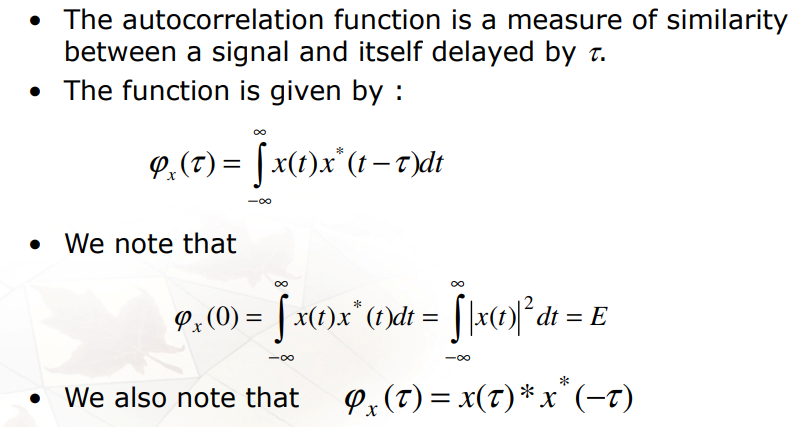
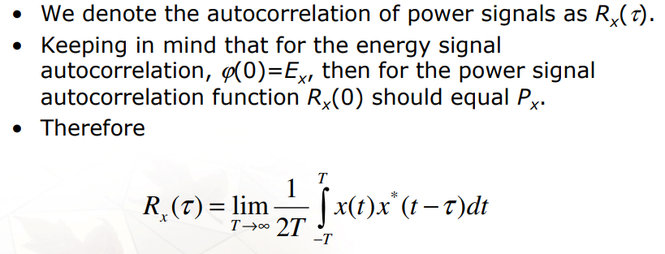

## Random Processes

Three functions that are commonly used to summarize random processes: the *mean function*, the *variance function*, and the *autocovariance function*

- **Mean Function**

  The **mean function** $\mu_X(t)$ of a random process $\{ X(t) \}$ is a function that specifies the expected value at *each time* $t$
  $$
  \mu_X(t) \overset{\text{def}}{=} E[X(t)] \tag{1.1}
  $$
  For a discrete-time process, we notate the mean function as
  $$
  \mu_X[n] \overset{\text{def}}{=} E[X[n]] \tag{1.2}
  $$

- **Variance Function**

  The **variance function** $V(t)$ of a random process $\{ X(t) \}$ is a function that specifies the variance of the process at each time $t$
  $$
  V(t) \overset{\text{def}}{=} \text{Var}[X(t)] \tag{1.3}
  $$
  For a discrete-time process, we notate the variance function as
  $$
  V[n] \overset{\text{def}}{=} \text{Var}[X[n]] \tag{1.4}
  $$
  

- **Autocovariance Function**

  The **autocovariance function** $C_X(s, t)$ of a random process $\{ X(t) \}$ is a function of *two* times $s$ and $t$. It is sometimes just called the *"covariance function"* for short.
  $$
  C_X(s, t) \overset{\text{def}}{=} \text{Cov}[X(s), X(t)] \tag{1.5}
  $$
  For a discrete-time process, we notate the autocovariance function as
  $$
  C_X[m, n] \overset{\text{def}}{=} \text{Cov}[X[m], X[n]] \tag{1.6}
  $$

  > Notice that the variance function can be obtained from the autocovariance function:
  > $$
  > V(t) = \text{Var}[X(t)] = \text{Cov}[X(t), X(t)] = C(t, t)
  > $$
  > 

  > $$
  > \text{Cov}[X, Y] \overset{\text{def}}{=} E[(X - E[X])(Y - E[Y])]
  > $$
  >
  > $$
  > \text{Cov}[X, Y] = E[XY] - E[X]E[Y]
  > $$
  
  

### Autocorrelation Function

The **autocorrelation function** $R_X(s, t)$ of a random process $\{ X(t) \}$ is a function of *two* times $s$ and $t$. It specifies
$$
R_X(s, t) \overset{\text{def}}{=} E[X(s)X(t)] \tag{1.7}
$$

> $$
> E[X(s) X(t)] = \text{Cov}[X(s), X(t)] + E[X(s)] E[X(t)]
> $$

For stationary process, the autocorrelation function only depends on the difference between the times $\tau = s - t$
$$
R_X(\tau) = = C_X(s, t) + \mu_X(s) \mu_X(t) = C_X(\tau) + \mu_X^2
$$

## Wide-Sense Stationary Processes

A random process $\{ X(t) \}$ is wide-sense stationary if its mean and autocovariance function are invariant under time shifts. That is:

1. The mean function $\mu_X(t)$ is constant. In this case, we will write the mean function as $\mu_X(t) \equiv \mu_X$
2. The autocovariance function $C_X(s, t)$ only depends on $s-t$, the difference between the times. In this case, we will write the autocovariance function as $C_X(s, t) = C_X(s - t)$

## Additive White Gaussian Noise (AWGN)

For power signal , the **PSD**, $S_x(f)$, gives the distribution of power in $x(t)$ versus frequency. Since $S_x(f)$ is a density, it has units of $W/Hz$.

Formally, the *power spectral density* is defined as

$$
S_x(f) = \mathcal{F}\{R_x(\tau)\} = \int_{-\infty}^{\infty} R_x(\tau)e^{-j2\pi f\tau}d\tau
$$

where $R_x(\tau)$ is the **autocorrelation function** of the signal $x(t)$ computed as per
- deterministic signals:  *a time average*
- random signals: *a statistical average*

> These two definitions are equivalent if $x(t)$ is **ergodic**

$$\begin{align}
R(\omega) &= \mathcal{F}\{R_x(t)\}  =  \mathcal{F}\{x(t) * x(-t)\} \\
&= \mathcal{F}\{x(t)\}\mathcal{F}\{x(-t)\} \\
& = X(\omega) X^*(\omega) = |X(\omega)|^2
\end{align}$$

- Autocorrelation function of **energy signals**

  

- Autocorrelation Function of *Power Signals*

  

## Spectrum Analysis of Random Signals

- periodogram analysis

  direct Fourier transformation of finite-length segments of the signal

- Blackman–Tukey method

  Fourier transform of the autocorrelation function

## reference

Iain Collings. Random Processes [[https://youtube.com/playlist?list=PLx7-Q20A1VYKRLHUMSt2YOORrVz8iH-Kq&si=cZjlH7zcHcR0zWg6](https://youtube.com/playlist?list=PLx7-Q20A1VYKRLHUMSt2YOORrVz8iH-Kq&si=cZjlH7zcHcR0zWg6)]
Spectral content of NRZ test patterns [[https://www.analog.com/media/en/technical-documentation/tech-articles/hfta110-spectral-content-of-nrz-test-patterns.pdf](https://www.analog.com/media/en/technical-documentation/tech-articles/hfta110-spectral-content-of-nrz-test-patterns.pdf)]

NRZ Bandwidth - HF Cutoff vs. SNR [[https://www.analog.com/media/en/technical-documentation/tech-articles/hfan0901-nrz-bandwidth--hf-cutoff-vs-snr.pdf](https://www.analog.com/media/en/technical-documentation/tech-articles/hfan0901-nrz-bandwidth--hf-cutoff-vs-snr.pdf)]

Lab 2: Spectrum analysis [[https://ece.uccs.edu/~mwickert/ece4670/lecture_notes/Lab2.pdf](https://ece.uccs.edu/~mwickert/ece4670/lecture_notes/Lab2.pdf)]

PSD (Power spectral density) explanation. [[https://dsp.stackexchange.com/a/8151](https://dsp.stackexchange.com/a/8151)]

Dennis Sun. STAT 350 2020 Probability and Stochastic Processes for Electrical Engineers [[https://dlsun.github.io/Stat350-S20/](https://dlsun.github.io/Stat350-S20/)]

Oppenheim, Alan V. and Cram. "Discrete-time signal processing" 3rd edition. (2011).

Leon W. Couch, II "Digital and Analog Communication Systems", 8th Ed., Pearson Education-LPE, 2013.

B.P. Lathi,  Zhi Ding. "Modern Digital and Analog Communication Systems", 5th edition, 2019.

Ziemer, Rodger E., and William H. Tranter. *Principles of Communication: Systems, Modulation, and Noise*. 5th ed. New York: Wiley, 2002.

Haykin, Simon. *Digital Communication Systems*. 1st edition. Wiley, 2013.

Carlson, A. Bruce, and Paul B. Crilly. *Communication Systems: An Introduction to Signals and Noise in Electrical Communication*. 5th ed. Boston: McGraw-Hill Higher Education, 2010.

