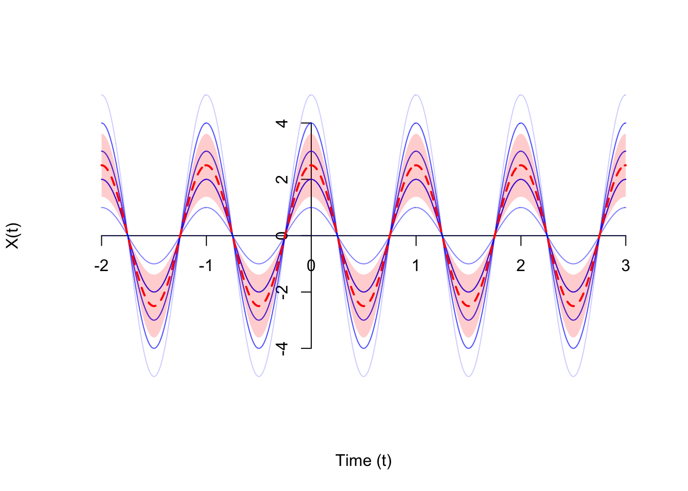

- **Mean Function**

  The **mean function** $\mu_X(t)$ of a random process $\{ X(t) \}$ is a function that specifies the expected value at *each time* $t$
  $$
  \mu_X(t) \overset{\text{def}}{=} E[X(t)] \tag{1.1}
  $$
  For a discrete-time process, we notate the mean function as
  $$
  \mu_X[n] \overset{\text{def}}{=} E[X[n]] \tag{1.2}
  $$

- **Variance Function**

  The **variance function** $V(t)$ of a random process $\{ X(t) \}$ is a function that specifies the variance of the process at each time $t$
  $$
  V(t) \overset{\text{def}}{=} \text{Var}[X(t)] \tag{1.3}
  $$
  For a discrete-time process, we notate the variance function as
  $$
  V[n] \overset{\text{def}}{=} \text{Var}[X[n]] \tag{1.4}
  $$
  


## Autocovariance Function

$$
C_X(s, t) \overset{\text{def}}{=} \text{Cov}[X(s), X(t)] = \mathrm{E}[(X(s) - E(X(s)))(X(t) - E(X(t)))]
$$


## Autocorrelation Function

The **autocorrelation function** $R_X(s, t)$ of a random process $\{ X(t) \}$ is a function of *two* times $s$ and $t$. It specifies
$$
R_X(s, t) \overset{\text{def}}{=} E[X(s)X(t)] \tag{1.7}
$$

> $$
> E[X(s) X(t)] = \text{Cov}[X(s), X(t)] + E[X(s)] E[X(t)]
> $$


For stationary process, the autocorrelation function only depends on the difference between the times $\tau = s - t$
$$
R_X(\tau) \overset{\text{def}}{=} C_X(s, t) + \mu_X(s) \mu_X(t) = C_X(\tau) + \mu_X^2
$$


## Wide-Sense Stationary Processes

A random process $\{ X(t) \}$ is wide-sense stationary if its mean and autocovariance function are invariant under time shifts. That is:

1. The mean function $\mu_X(t)$ is constant. In this case, we will write the mean function as $\mu_X(t) \equiv \mu_X$
2. The autocovariance function $C_X(s, t)$ only depends on $s-t$, the difference between the times. In this case, we will write the autocovariance function as $C_X(s, t) = C_X(s - t)$


## Cyclostationary process

*TODO* &#128197;


## Wiener-Khinchin theorem

> Norbert Wiener proved this theorem for the case of a *deterministic function* in 1930; Aleksandr Khinchin later formulated an analogous result for *stationary stochastic processes* and published that probabilistic analogue in 1934. Albert Einstein explained, without proofs, the idea in a brief two-page memo in 1914

$x(t)$, Fourier transform over a limited period of time $[-T/2, +T/2]$  ,
$$
X_T(f) = \int_{-T/2}^{T/2}x(t)e^{-j2\pi ft}dt
$$


using *Parseval's theorem*
$$
\int_{-T/2}^{T/2}|x(t)|^2dt = \int_{-T/2}^{T/2}|X_T(f)|^2df
$$
So that
$$
\frac{1}{T}\int_{-T/2}^{T/2}|x(t)|^2dt = \int_{-T/2}^{T/2}\frac{1}{T}|X_T(f)|^2df
$$

> where the quantity, $\frac{1}{T}|X_T(f)|^2$ can be interpreted as distribution of power in the frequency domain
>
> For each $f$ this quantity is a random variable, since it is a function of the random process $x(t)$


The power spectral density (PSD) $S_x(f )$ is defined as the limit of the expectation of the expression
above, for large $T$:
$$
S_x(f) = \lim _{T\to \infty}\mathrm{E}\left[ \frac{1}{T}|X_T(f)|^2 \right]
$$

The *Wiener-Khinchin theorem* ensures that for well-behaved *wide-sense stationary processes* the **limit exists** and is equal to the Fourier transform of the autocorrelation
$$\begin{align}
S_x(f) &= \int_{-\infty}^{+\infty}R_x(\tau)e^{-j2\pi f \tau}d\tau \\
R_x(\tau) &= \int_{-\infty}^{+\infty}S_x(f)e^{j2\pi f \tau}df
\end{align}$$


## Spectrum Analysis of Random Signals

- periodogram analysis

  direct Fourier transformation of finite-length segments of the signal

- Blackman-Tukey method

  Fourier transform of the autocorrelation function


## spectrum analyzer

We tried to plot a *power spectral density* together with something that we want to interpret as a *power spectrum*

> - *spectrum* of a periodic signal
> - *spectral density* of a broadband signal such as noise
>
> Sine-wave components are located in individual FFT bins, but broadband signals like noise have their power spread over all FFT bins!
>
> The **noise floor** depends on the *length of the FFT*

[[http://individual.utoronto.ca/schreier/lectures/2015/1.pdf](http://individual.utoronto.ca/schreier/lectures/2015/1.pdf)]


signal tone power
$$
P_{\text{sig}} = 2 \frac{X_{w,sig}^2}{S_1^2}
$$

noise power
$$
P_n = \frac{X_{w,n}^2}{S_2}
$$

Then, displayed **SNR** is obtained
$$\begin{align}
\mathrm{SNR} &= 10\log10\left(\frac{X_{w,sig}^2}{X_{w,n}^2}\right) \\
&= 10\log_{10}\left(\frac{P_{\text{sig}}}{P_n}\right) + 10\log_{10}\left(\frac{S_1^2}{2S_2}\right) \\
&= \mathrm{SNR}'-10\log_{10}\left(\frac{2S_2}{S_1^2}\right) \\
&= \mathrm{SNR}'-10\log_{10}(2\cdot\mathrm{NBW}) \\
\end{align}$$

> *DFT's output* $\mathrm{SNR}$

```matlab
for N=[2^6 2^8 2^10 2^12]
  wd = rectwin(N);
  nbw = enbw(wd)/N;
  snr_shift = 10*log10(nbw * 2);
  disp(snr_shift);
end
```
output:
```
-15.0515

-21.0721

-27.0927

-33.1133
```


> The solution to the scaling problem in the case of a PSD obtained from a sine-wave scaled FFT is similarly simple. All we need do is provide the value of **NBW**


> *APPENDIX A - SPECTRAL ESTIMATION - A.2 Scaling and Noise Bandwidth*
>
> Pavan, Shanthi, Richard Schreier, and Gabor Temes. (2016) 2016. Understanding Delta-Sigma Data Converters. 2nd ed. Wiley.


- For a filter with infinitely steep roll-off, the noise bandwidth (**NBW**) is equal to the filter's bandwidth,
- while for a filter with a single-pole roll-off, **NBW** is 2 times the 3-dB bandwidth


## reference

Iain Collings. Random Processes [[https://youtube.com/playlist?list=PLx7-Q20A1VYKRLHUMSt2YOORrVz8iH-Kq&si=cZjlH7zcHcR0zWg6](https://youtube.com/playlist?list=PLx7-Q20A1VYKRLHUMSt2YOORrVz8iH-Kq&si=cZjlH7zcHcR0zWg6)]
Spectral content of NRZ test patterns [[https://www.analog.com/media/en/technical-documentation/tech-articles/hfta110-spectral-content-of-nrz-test-patterns.pdf](https://www.analog.com/media/en/technical-documentation/tech-articles/hfta110-spectral-content-of-nrz-test-patterns.pdf)]

NRZ Bandwidth - HF Cutoff vs. SNR [[https://www.analog.com/media/en/technical-documentation/tech-articles/hfan0901-nrz-bandwidth--hf-cutoff-vs-snr.pdf](https://www.analog.com/media/en/technical-documentation/tech-articles/hfan0901-nrz-bandwidth--hf-cutoff-vs-snr.pdf)]

Lab 2: Spectrum analysis [[https://ece.uccs.edu/~mwickert/ece4670/lecture_notes/Lab2.pdf](https://ece.uccs.edu/~mwickert/ece4670/lecture_notes/Lab2.pdf)]

PSD (Power spectral density) explanation. [[https://dsp.stackexchange.com/a/8151](https://dsp.stackexchange.com/a/8151)]

Dennis Sun. STAT 350 2020 Probability and Stochastic Processes for Electrical Engineers [[https://dlsun.github.io/Stat350-S20/](https://dlsun.github.io/Stat350-S20/)]

Oppenheim, Alan V. and Cram. "Discrete-time signal processing" 3rd edition. (2011).

Leon W. Couch, II "Digital and Analog Communication Systems", 8th Ed., Pearson Education-LPE, 2013.

B.P. Lathi,  Zhi Ding. "Modern Digital and Analog Communication Systems", 5th edition, 2019.

Ziemer, Rodger E., and William H. Tranter. *Principles of Communication: Systems, Modulation, and Noise*. 5th ed. New York: Wiley, 2002.

Haykin, Simon. *Digital Communication Systems*. 1st edition. Wiley, 2013.

Carlson, A. Bruce, and Paul B. Crilly. *Communication Systems: An Introduction to Signals and Noise in Electrical Communication*. 5th ed. Boston: McGraw-Hill Higher Education, 2010.

