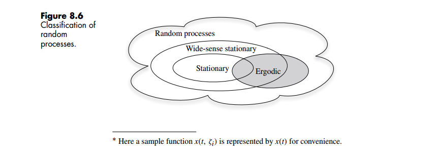

##  Ensemble average

> [[https://ece-research.unm.edu/bsanthan/ece541/stat.pdf](https://ece-research.unm.edu/bsanthan/ece541/stat.pdf)]
>
> [[https://www.nii.ac.jp/qis/first-quantum/e/forStudents/lecture/pdf/noise/chapter1.pdf](https://www.nii.ac.jp/qis/first-quantum/e/forStudents/lecture/pdf/noise/chapter1.pdf)]

- **time average**: time-averaged quantities for the $i$-th member of the ensemble
- **ensemble average**: ensemble-averaged quantities for all members of the ensemble at *a certain time*

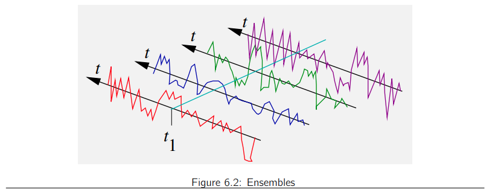

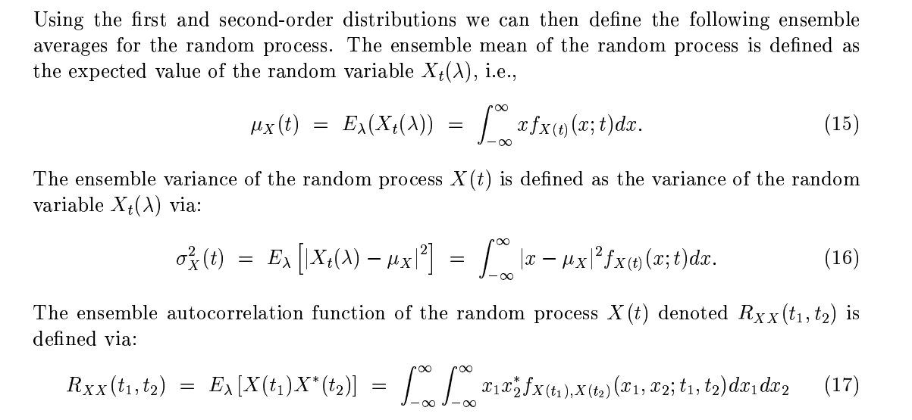

> 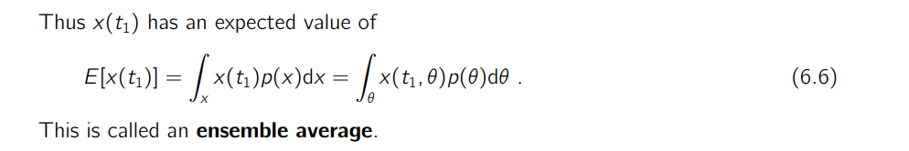
>
> where $\theta$ is one member of the ensemble; $p(x)dx$ is the probability that $x$ is found among $[x, x + dx]$

## autocorrelation, Stationarity & Ergodicity

### autocorrelation

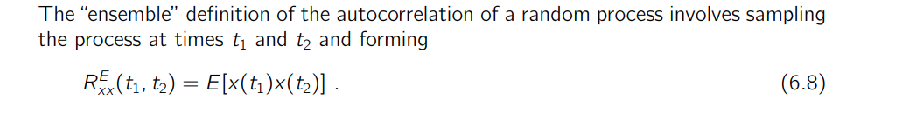

> The **expectation** returns the probability-weighted average of the specific function at that specific time
> over all possible realizations of the process

### Stationarity

> [[https://ece-research.unm.edu/bsanthan/ece541/station.pdf](https://ece-research.unm.edu/bsanthan/ece541/station.pdf)]
>
> ***Strict Sense Stationary (SSS)***, ***Wide Sense Stationary (WSS)***

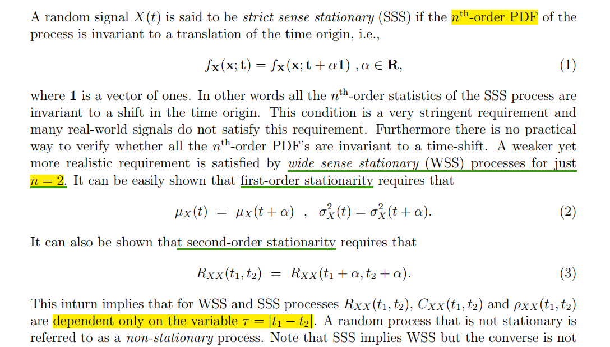

> 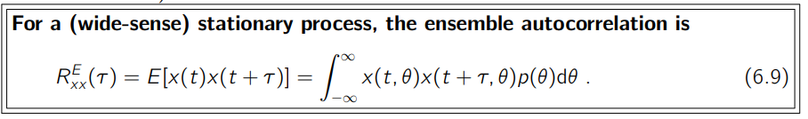

### Ergodicity

***ensemble autocorrelation*** and ***temporal autocorrelation (time autocorrelation)*** 

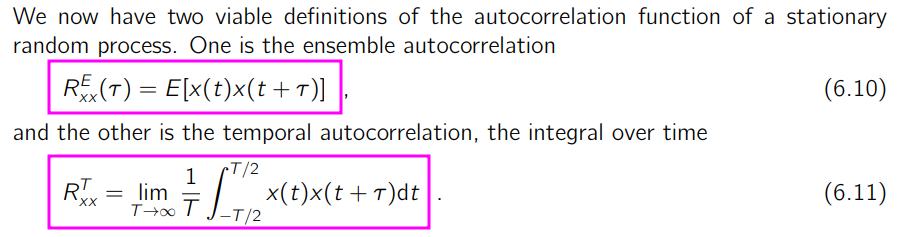

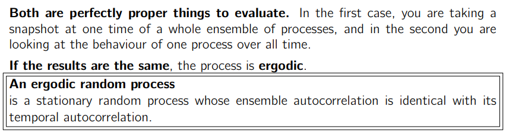

---

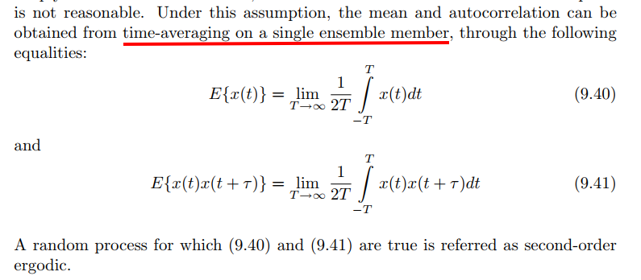

##  LTI Filtering of WSS process

### mean

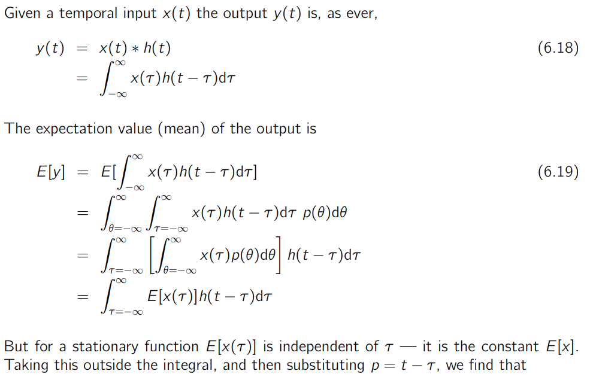

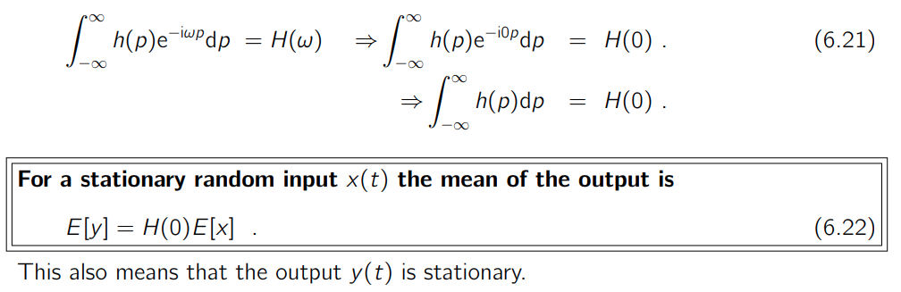

---

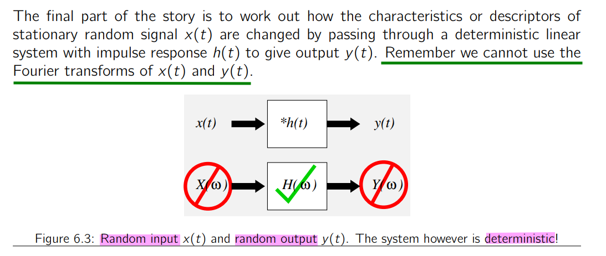

### autocorrelation

**deterministic autocorrelation function**

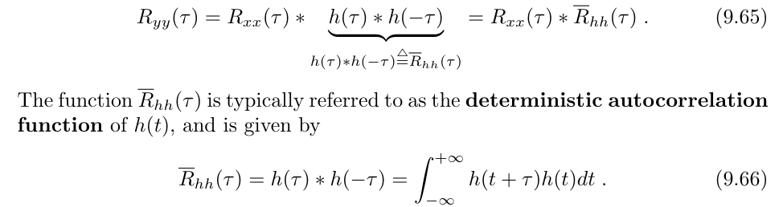

$$
R_{yy}(\tau) = h(\tau)*R_{xx}(\tau)*h(-\tau) =R_{xx}(\tau)*h(\tau)*h(-\tau)
$$

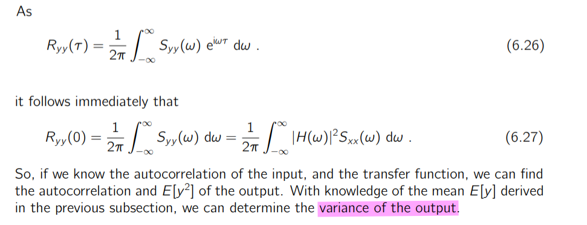

> why $\overline{R}_{hh}(\tau)  \overset{\Delta}{=} h(\tau)*h(-\tau)$ is autocorrelation ?  the proof is as follows:
> 
> $$\begin{align}
>\overline{R}_{hh}(\tau) &= h(\tau)*h(-\tau) \\
> &= \int_{-\infty}^{\infty}h(x)h(-(\tau - x))dx \\
> &= \int_{-\infty}^{\infty}h(x)h(-\tau + x)dx \\
> &=\int_{-\infty}^{\infty}h(x+\tau)h(x)dx
> \end{align}$$

---

### PSD

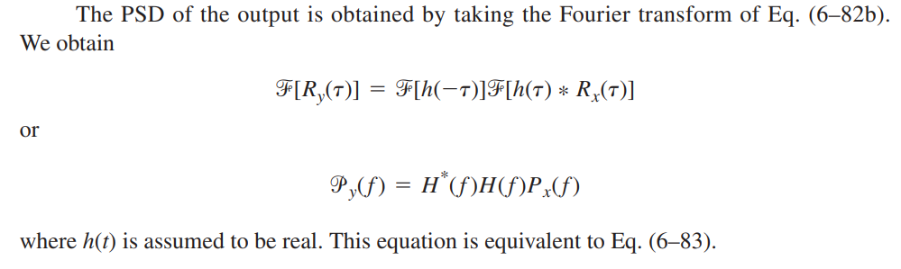

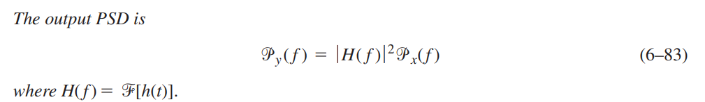

> Topic 6 Random Processes and Signals [[https://www.robots.ox.ac.uk/~dwm/Courses/2TF_2021/N6.pdf](https://www.robots.ox.ac.uk/~dwm/Courses/2TF_2021/N6.pdf)]
>
> Alan V. Oppenheim, Introduction To Communication, Control, And Signal Processing [[https://ocw.mit.edu/courses/6-011-introduction-to-communication-control-and-signal-processing-spring-2010/a6bddaee5966f6e73450e6fe79ab0566_MIT6_011S10_notes.pdf](https://ocw.mit.edu/courses/6-011-introduction-to-communication-control-and-signal-processing-spring-2010/a6bddaee5966f6e73450e6fe79ab0566_MIT6_011S10_notes.pdf)]
>
> Balu Santhanam, Probability Theory & Stochastic Process 2020: LTI Systems and Random Signals  [[https://ece-research.unm.edu/bsanthan/ece541/LTI.pdf](https://ece-research.unm.edu/bsanthan/ece541/LTI.pdf)]

---

**Time Reversal**
$$
x(-t) \overset{FT}{\longrightarrow} X(-j\omega)
$$

 if $x(t)$ is *real*, then $X(j\omega)$​ has **conjugate symmetry**
$$
X(-j\omega) = X^*(j\omega)
$$

### Derivatives of Random Processes
since $x(t)$ is stationary process, and $y(t) = \frac{dx(t)}{dt}$

Using $R_{yy}(\tau) = h(\tau)*R_{xx}(\tau)*h(-\tau)$

$$\begin{align}
R_{yy}(\tau) &= \mathcal{F}^{-1}[H(j\omega)\Phi_{xx}(j\omega)H(-j\omega)] \\
&= \mathcal{F}^{-1}[-(j\omega)^2\Phi_{xx}(j\omega)]
\end{align}$$

we obtain the autocorrelation function of the output process as
$$
R_{yy}(\tau) = -\frac{d^2}{d\tau^2}R_{xx}(\tau)
$$

> Liu Congfeng, Xidian University. *Random Signal Processing: Chapter 5 Linear System: Random Process* [[https://web.xidian.edu.cn/cfliu/files/20121125_153218.pdf](https://web.xidian.edu.cn/cfliu/files/20121125_153218.pdf)]
>
> [[https://sharif.ir/~bahram/sp4cl/PapoulisLectureSlides/lectr14.pdf](https://sharif.ir/~bahram/sp4cl/PapoulisLectureSlides/lectr14.pdf)]

## Periodogram

The periodogram is in fact the Fourier transform of the aperiodic correlation of the windowed data sequence

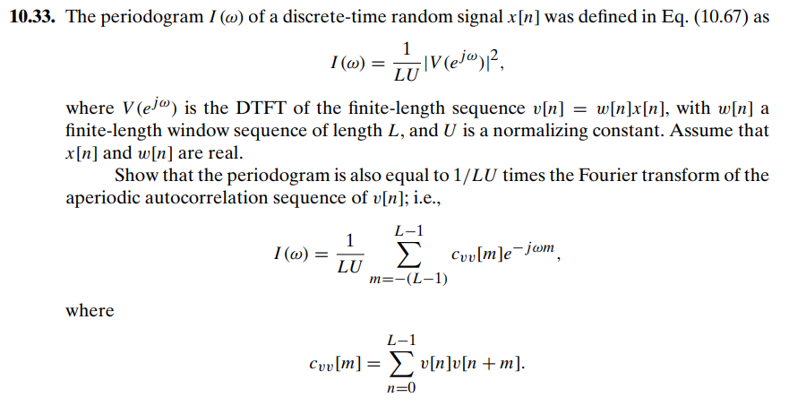

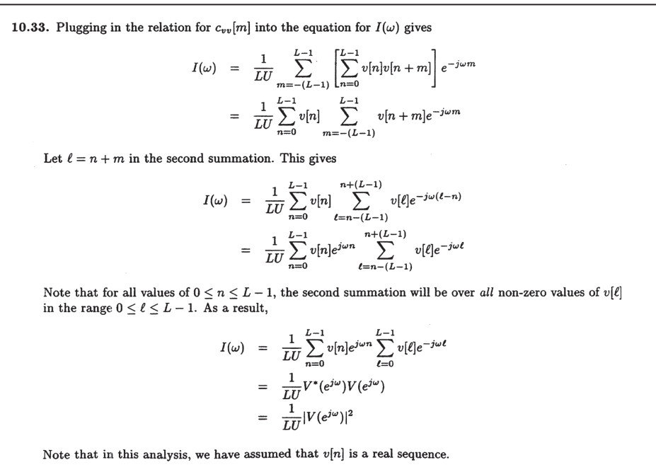

> 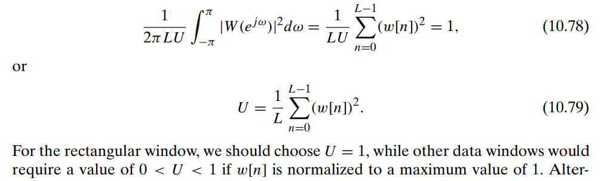
>

### estimating continuous-time stationary random signal

The sequence $x[n]$ is typically multiplied by a *finite*-duration window $w[n]$, since the input to the DFT must be of *finite* duration. This produces the *finite*-length sequence $v[n] = w[n]x[n]$

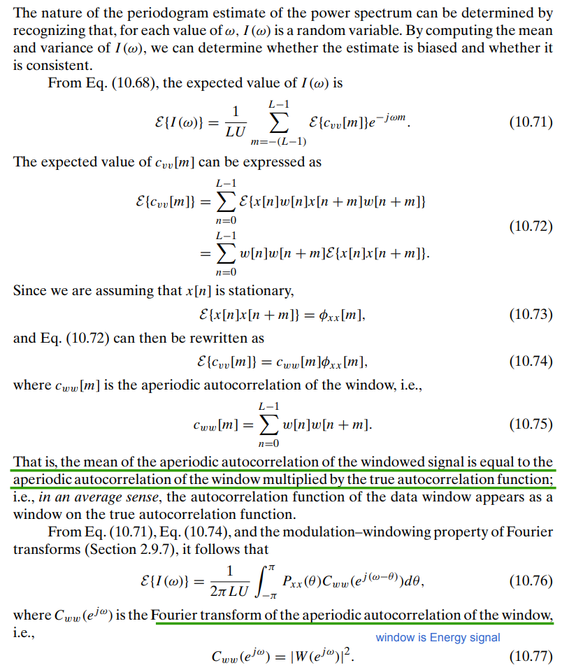

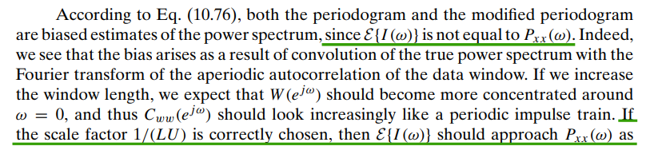

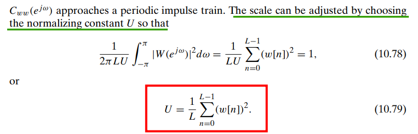

$$\begin{align}
\hat{P}_{ss}(\Omega) &= \frac{|V(e^{j\omega})|^2}{LU} \\
&= \frac{|V(e^{j\omega})|^2}{\sum_{n=0}^{L-1}(w[n])^2} \tag{1}\\
&= \frac{L|V(e^{j\omega})|^2}{\sum_{k=0}^{L-1}(W[k])^2} \tag{2}
\end{align}$$

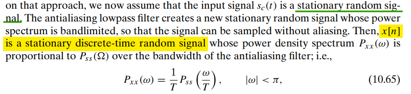

That is, by $(1)$
$$
\hat{P}_{ss}(\Omega) = T_s\hat{P}_{xx(\omega)} = \frac{T_s|V(e^{j\omega})|^2}{\sum_{n=0}^{L-1}(w[n])^2}=\frac{|V(e^{j\omega})|^2}{f_{res}L\sum_{n=0}^{L-1}(w[n])^2}
$$

That is, by $(2)$
$$
\hat{P}_{ss}(\Omega) = T_s\hat{P}_{xx(\omega)} = \frac{T_sL|V(e^{j\omega})|^2}{\sum_{k=0}^{L-1}(W[k])^2} = \frac{|V(e^{j\omega})|^2}{f_{res}\sum_{k=0}^{L-1}(W[k])^2}
$$

> !! *ENBW*

## Wiener-Khinchin theorem

> Norbert Wiener proved this theorem for the case of a ***deterministic function*** in 1930; Aleksandr Khinchin later formulated an analogous result for ***stationary stochastic processes*** and published that probabilistic analogue in 1934. Albert Einstein explained, without proofs, the idea in a brief two-page memo in 1914

$x(t)$, Fourier transform over a limited period of time $[-T/2, +T/2]$ , $X_T(f) = \int_{-T/2}^{T/2}x(t)e^{-j2\pi ft}dt$

With *Parseval's theorem*
$$
\int_{-T/2}^{T/2}|x(t)|^2dt = \int_{-\infty}^{\infty}|X_T(f)|^2df
$$
So that
$$
\frac{1}{T}\int_{-T/2}^{T/2}|x(t)|^2dt = \int_{-\infty}^{\infty}\frac{1}{T}|X_T(f)|^2df
$$

> where the quantity, $\frac{1}{T}|X_T(f)|^2$ can be interpreted as distribution of power in the frequency domain
>
> For each $f$ this quantity is a random variable, since it is a function of the random process $x(t)$

The power spectral density (PSD) $S_x(f )$ is defined as the limit of the expectation of the expression
above, for large $T$:
$$
S_x(f) = \lim _{T\to \infty}\mathrm{E}\left[ \frac{1}{T}|X_T(f)|^2 \right]
$$

The *Wiener-Khinchin theorem* ensures that for well-behaved *wide-sense stationary processes* the **limit exists** and is equal to the *Fourier transform of the autocorrelation*
$$\begin{align}
S_x(f) &= \int_{-\infty}^{+\infty}R_x(\tau)e^{-j2\pi f \tau}d\tau \\
R_x(\tau) &= \int_{-\infty}^{+\infty}S_x(f)e^{j2\pi f \tau}df
\end{align}$$

> Note: $S_x(f)$ in *Hz*  and inverse Fourier Transform in *Hz* ($\frac{1}{2\pi}d\omega = df$)

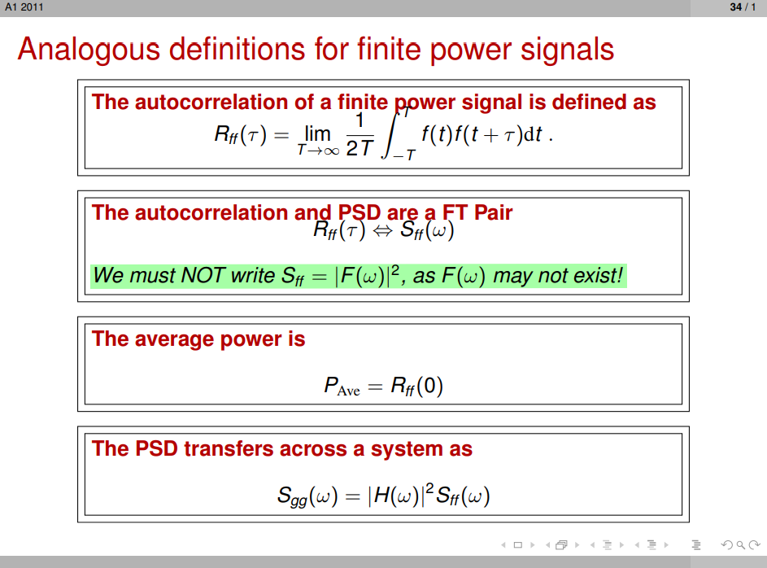

> [[https://www.robots.ox.ac.uk/~dwm/Courses/2TF_2011/2TF-L5.pdf](https://www.robots.ox.ac.uk/~dwm/Courses/2TF_2011/2TF-L5.pdf)]
>
> Frank R. Kschischang. The Wiener-Khinchin Theorem [[https://www.comm.utoronto.ca/~frank/notes/wk.pdf](https://www.comm.utoronto.ca/~frank/notes/wk.pdf)]

---

**Example**

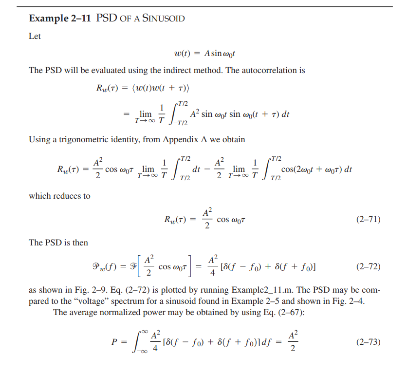

> Remember: impulse scaling
>
> 
> $$
> \cos(2\pi f_0t) \overset{\mathcal{F}}{\longrightarrow} \frac{1}{2}[\delta(f -f_0)+\delta(f+f_0)]
> $$

### Energy Signal

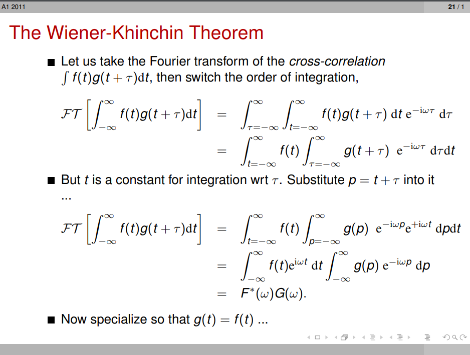

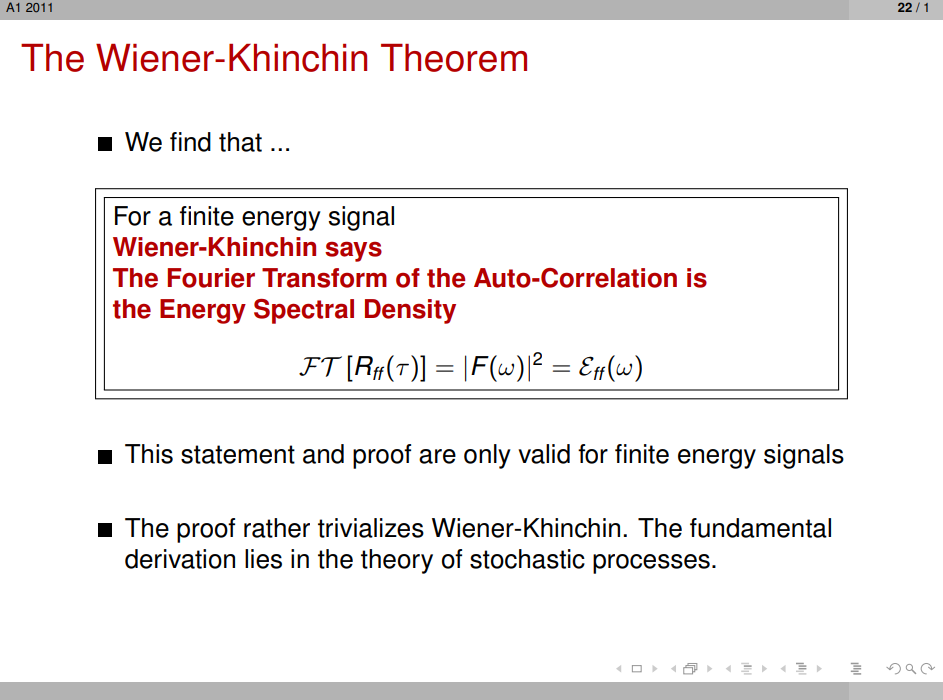

### Discrete time

> SIMG-713 Noise and Random Processes Spring 2002 . Lecture 15 Power Spectrum Estimation [[https://www.cis.rit.edu/class/simg713/Lectures/Lecture713-15-4.pdf](https://www.cis.rit.edu/class/simg713/Lectures/Lecture713-15-4.pdf)]
>
> Properties of the Fourier Transform for Discrete-Time Signals [[https://www.comm.utoronto.ca/dkundur/course_info/362/EmanHammadDTFT2.pdf](https://www.comm.utoronto.ca/dkundur/course_info/362/EmanHammadDTFT2.pdf)]

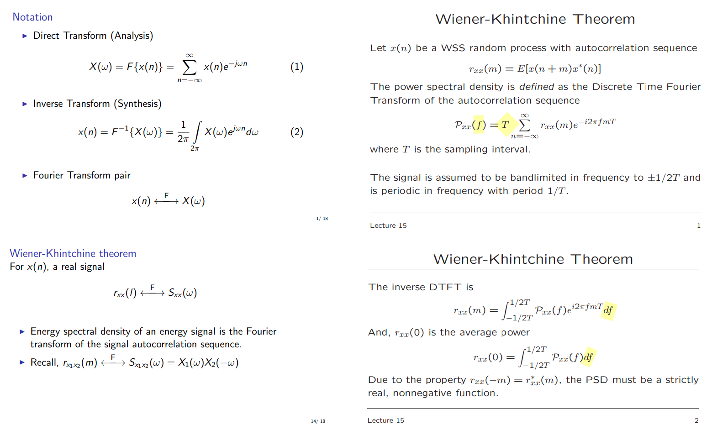
$$
\frac{1}{2\pi}F^{-1}\{R_{xx}\}d\omega = \frac{1}{2\pi}F^{-1}\{R_{xx}\}d(2\pi f T)=T\cdot F^{-1}\{R_{xx}\}df = P_{xx}(f)df
$$
power spectral density of a *discrete*-time *random* process $\{x(n)\}$ is given by
$$
P_{xx}(f) =T\cdot F^{-1}\{R_{xx}\}
$$

## Periodic and Cyclostationary Processes

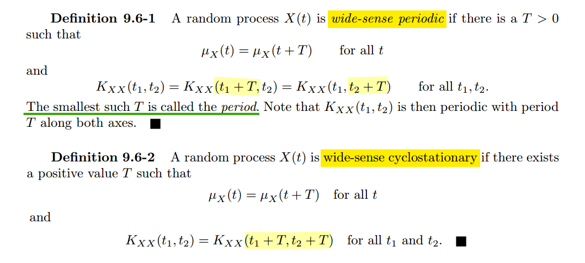

> 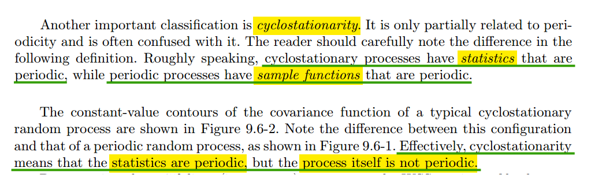

## Multirate Systems & Random Sequences

> Balu Santhanam. ece541 Probability Theory & Stochastic Process: Random Signals and Multirate Systems [[http://ece-research.unm.edu/bsanthan/ece541/rand.pdf](http://ece-research.unm.edu/bsanthan/ece541/rand.pdf)]

### WSS Random Sequences

***autocorrelation function of WSS random sequences***

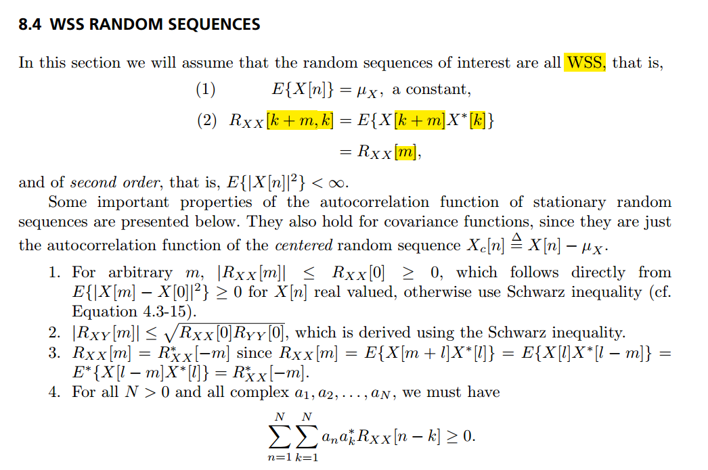

---

***psd of WSS of WSS random sequences*** 

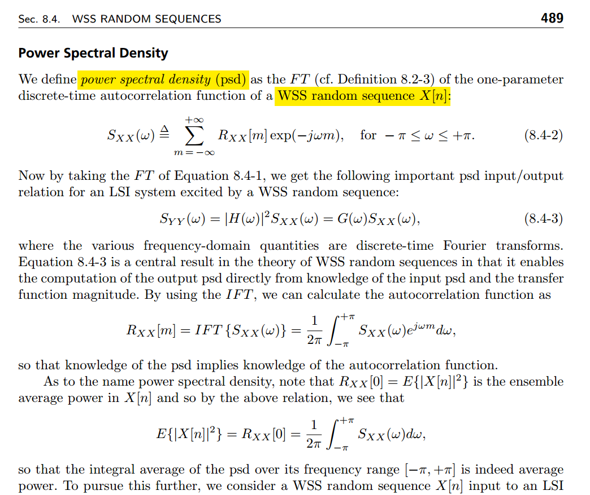

---

***Interpretation of the psd***

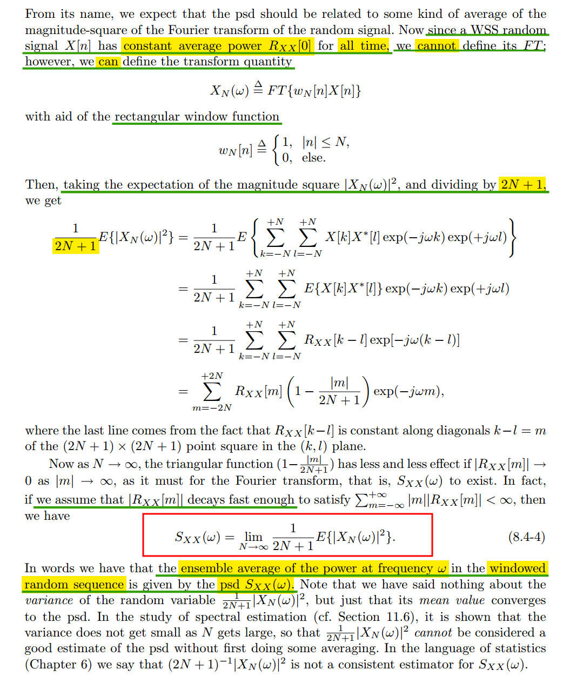

> ***Equation 8.4-4*** is permissible for ***cyclostationary*** waveforms

### decimation

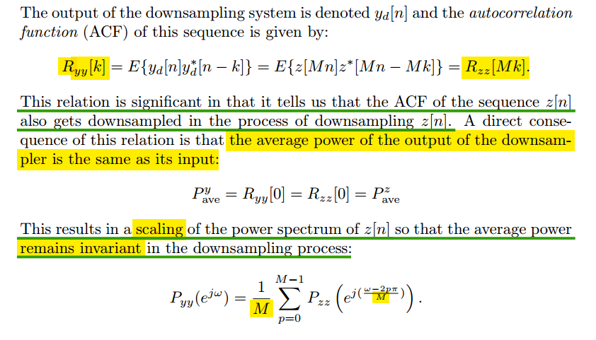

$$
\frac{1}{M}\int_{-Mx_0}^{Mx_0}f(\frac{x}{M})dx  = \int_{-Mx_0}^{Mx_0}f(\frac{x}{M}) d\frac{x}{M} = \int_{-x_0}^{x_0} f(\acute{x}) d\acute{x}
$$

where $\acute{x} = \frac{x}{M}$

---

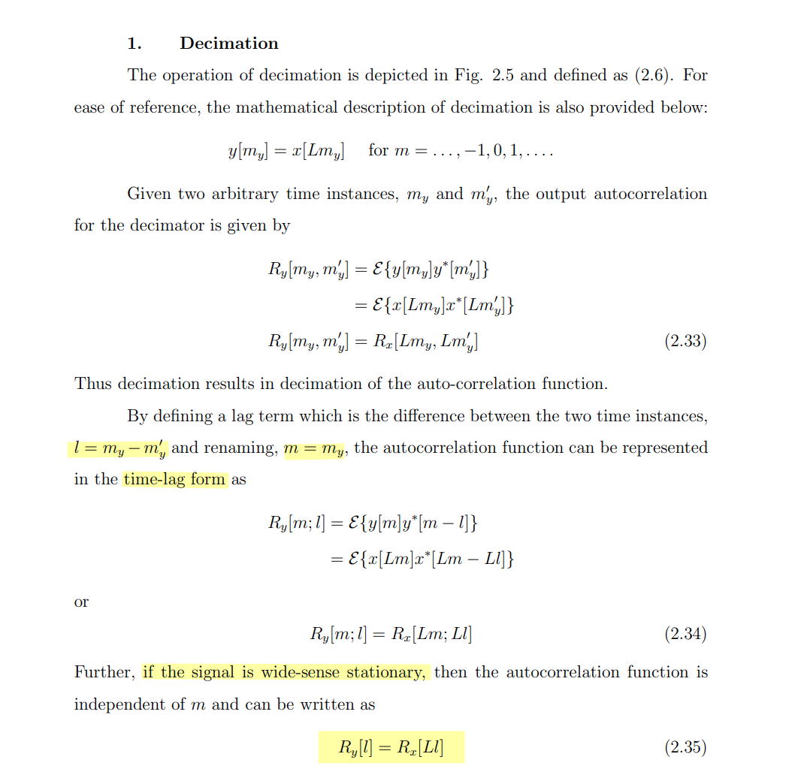

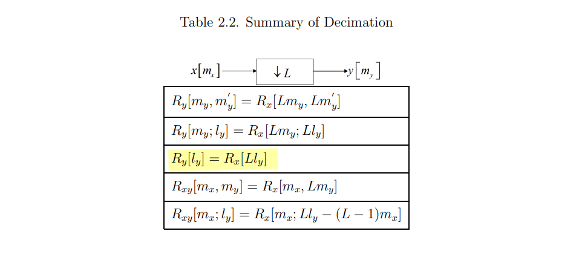

### interpolation

The *resulting expanded random sequence* is clearly ***nonstationary***, *because of the **zero insertions***.

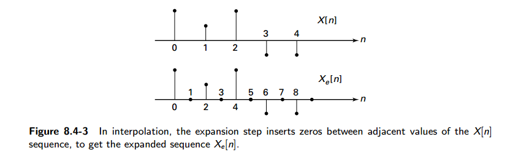

This random sequences and processes is classified as being ***cyclostationary***

psd of $X_e[n]$, the ***expansion*** or the ***upsampled*** version of $X[n]$

$$
S_{X_eX_e}(\omega) = \frac{1}{L}S_{XX}(L\omega)
$$

where $L$ is upsampling factor

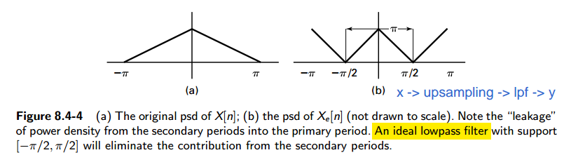

where an ideal lowpass filter with bandwidth $[-\pi/2 , +\pi/2]$ and gain of $2$ or $L$

$$
S_{YY}(\omega) = \left\{ \begin{array}{cl}
L \cdot S_{XX}(L\omega)), &\ |\omega|\leq \pi/L  \\
0, &\ \pi/L \lt |\omega| \leq \pi
\end{array} \right.
$$

---

> [[https://www.scribd.com/document/353335818/Stark-Woods-3th-Ed-Manual#page=212](https://www.scribd.com/document/353335818/Stark-Woods-3th-Ed-Manual#page=212)]

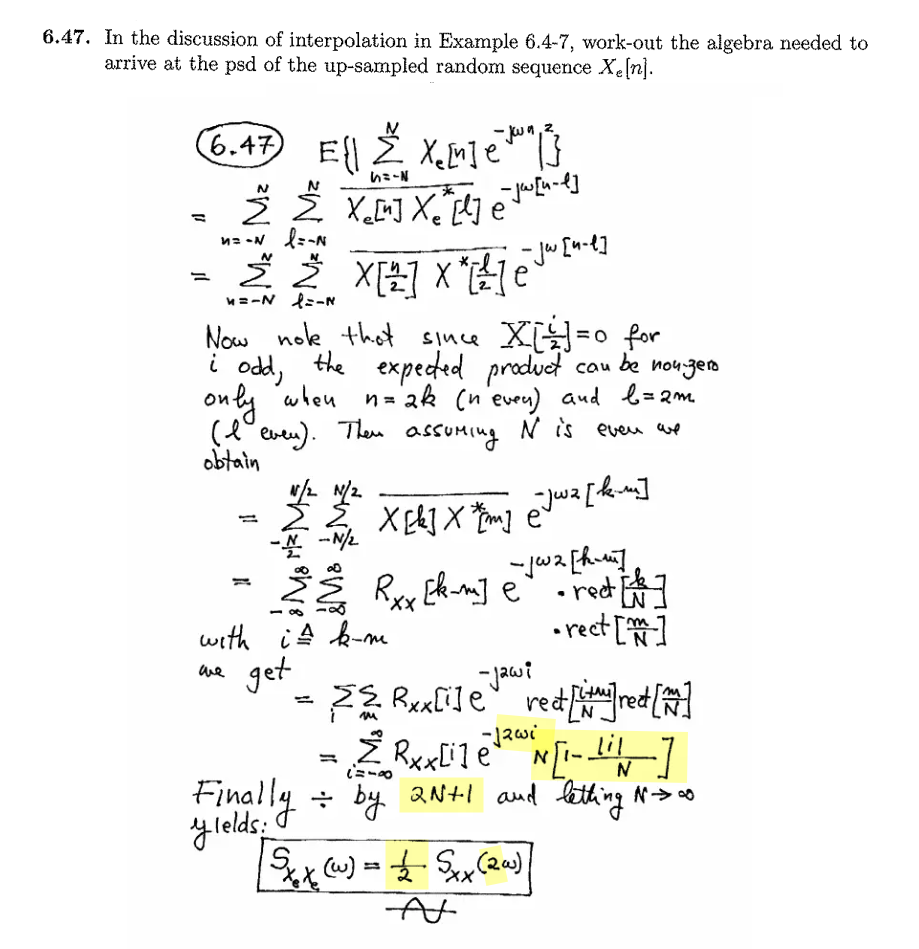

General case with upsampling factor $L$

$$\begin{align}
&\mathrm{E}\{|\sum_{n=-N}^N X_e[n]e^{-j\omega n}|^2\}\\
&= \sum_{n=-N}^N\sum_{l=-N}^NX_e[n]\cdot X_e^*[l]\cdot e^{-j\omega(n-l)}\\
&= \sum_{n=-N}^N\sum_{l=-N}^NX[\frac{n}{L}]\cdot X^*[\frac{l}{L}]\cdot e^{-j\omega(n-l)}\\
&= \sum_{k=-N/L}^{N/L}\sum_{m=-N/L}^{N/L}X[k]\cdot X^*[m]\cdot e^{-jL\omega (k-m)}\\
&= \sum_{k=-\infty}^{\infty}\sum_{m=-\infty}^{\infty}R_{XX}[k-m]\cdot e^{-j\omega L(k-m)}\cdot \mathcal{rect}[\frac{k}{2N/L}]\cdot \mathcal{rect}[\frac{m}{2N/L}]\\
&= \sum_{i=-\infty}^{\infty}\sum_{m=-\infty}^{\infty}R_{XX}[i]\cdot e^{-jL\omega i}\cdot \mathcal{rect}[\frac{i+m}{2N/L}]\cdot \mathcal{rect}[\frac{m}{2N/L}]\\
&= \sum_{i=-\infty}^{\infty}R_{XX}[i]\cdot e^{-jL\omega i} \cdot \frac{2N}{L}\left[1 -\frac{|i|}{2N/L} \right]
\end{align}$$

Then
$$\begin{align}
&\lim_{N\to \infty}\frac{1}{2N+1}\cdot \mathrm{E}\{|\sum_{n=-N}^N X_e[n]e^{-j\omega n}|^2\} \\
&= \frac{1}{L}\sum_{i=-\infty}^{\infty}R_{XX}[i]\cdot e^{-jL\omega i}\\
&= \frac{1}{L}S_{XX}(L\omega)
\end{align}$$

---

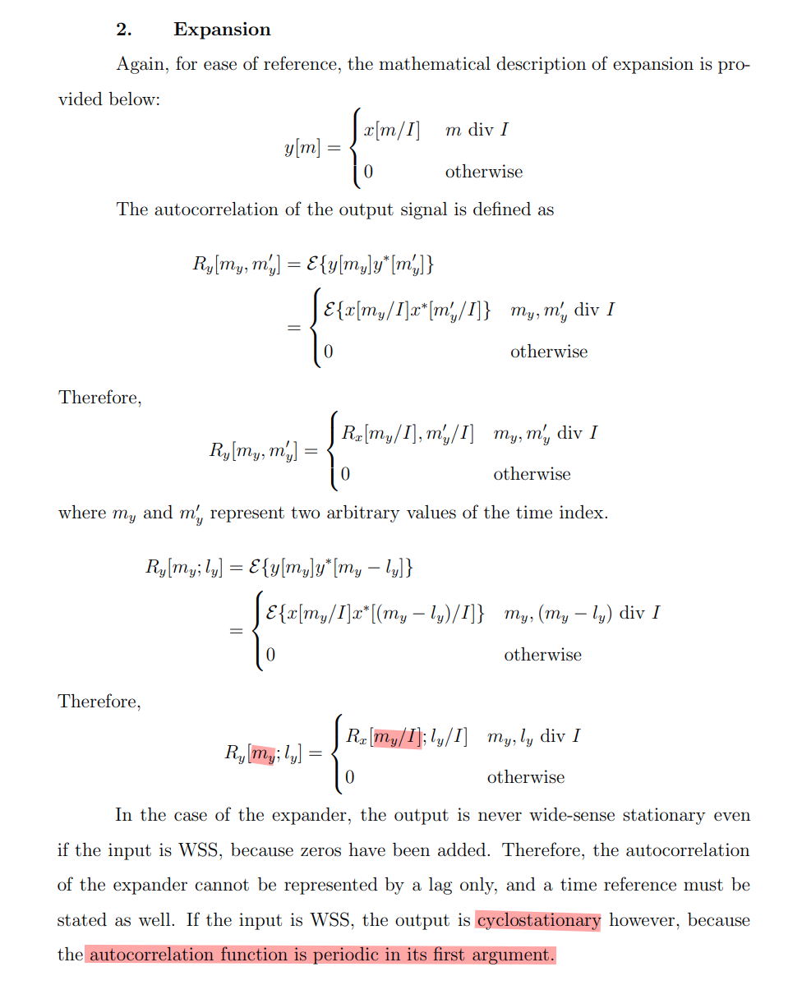

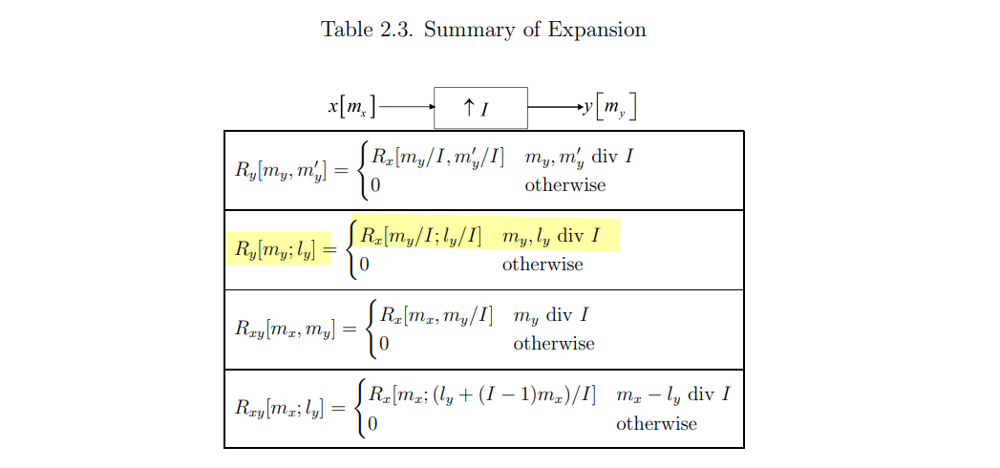

## Wiener Process (Brownian Motion)

> *Dennis Sun*, Introduction to Probability: Lesson 49 Brownian Motion [[https://dlsun.github.io/probability/brownian-motion.html](https://dlsun.github.io/probability/brownian-motion.html)]

*Wiener process (also called Brownian motion*) 

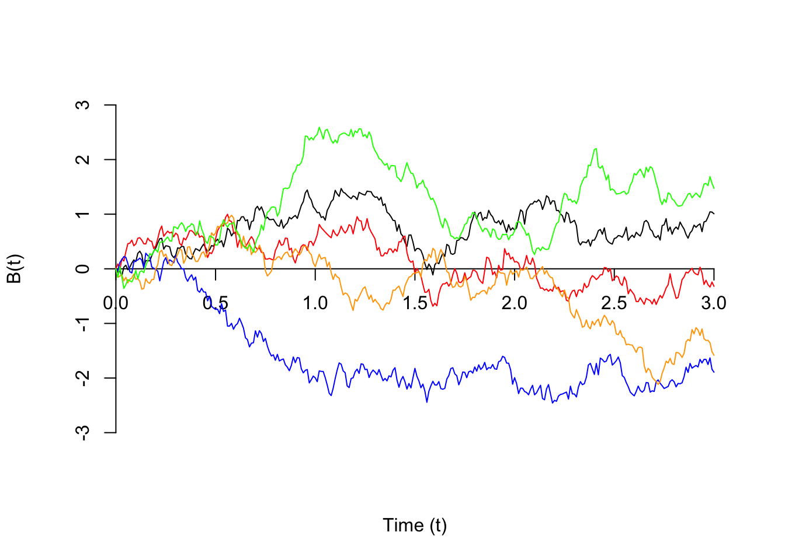

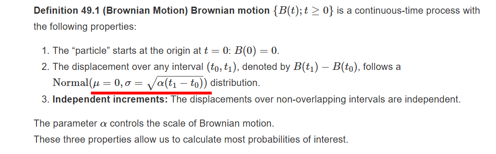

## NRZ PSD

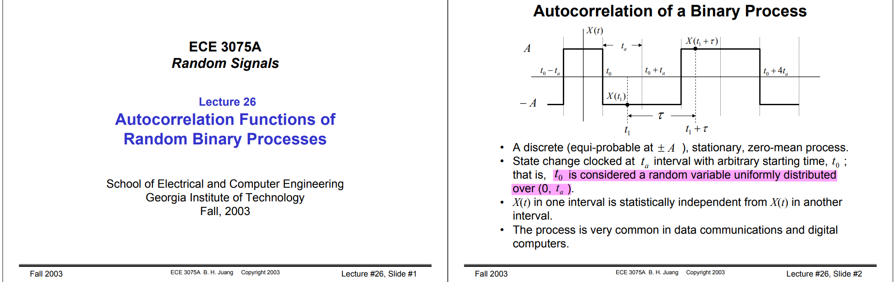

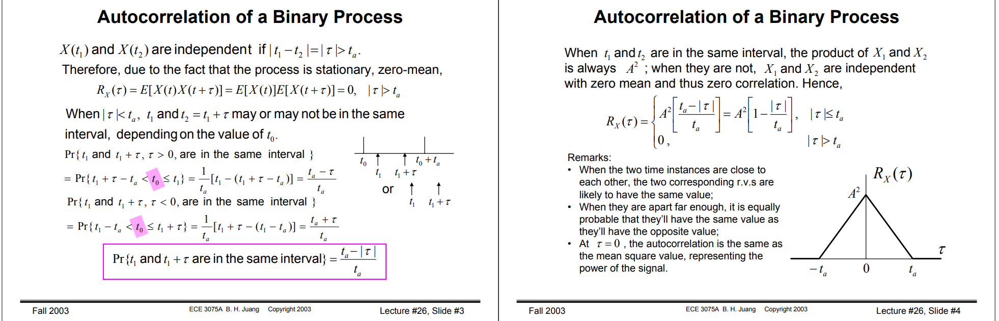

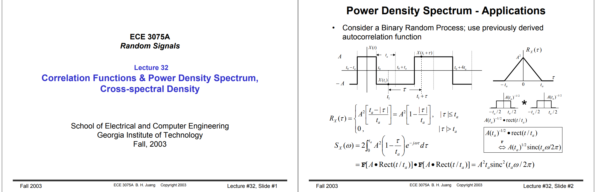

> Lecture 26 Autocorrelation Functions of Random Binary Processes [[https://bpb-us-e1.wpmucdn.com/sites.gatech.edu/dist/a/578/files/2003/12/ECE3075A-26.pdf](https://bpb-us-e1.wpmucdn.com/sites.gatech.edu/dist/a/578/files/2003/12/ECE3075A-26.pdf)]
>
> Lecture 32 Correlation Functions & Power Density Spectrum, Cross-spectral Density [[https://bpb-us-e1.wpmucdn.com/sites.gatech.edu/dist/a/578/files/2003/12/ECE3075A-32.pdf](https://bpb-us-e1.wpmucdn.com/sites.gatech.edu/dist/a/578/files/2003/12/ECE3075A-32.pdf)]

---

> ***Normal Distribution and Input-Referred Noise*** [[https://a2d2ic.wordpress.com/2013/06/05/normal-distribution-and-input-referred-noise/](https://a2d2ic.wordpress.com/2013/06/05/normal-distribution-and-input-referred-noise/)]

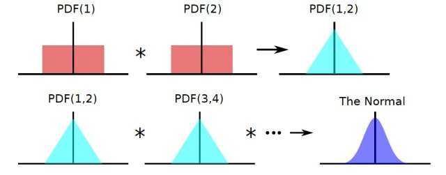

![Fig.2 The noise signal, its auto correlation function, and spectral density [2]](random/trnoise.jpg)

## reference

L.W. Couch, Digital and Analog Communication Systems, 8th Edition, 2013 [[pdf](https://rizkia.staff.telkomuniversity.ac.id/files/2016/02/Digital-and-Analog-Communication-Systems-Leon-W.-Couch.pdf)]

Alan V Oppenheim, George C. Verghese, Signals, Systems and Inference, 1st edition [[pdf](https://ocw.mit.edu/courses/6-011-introduction-to-communication-control-and-signal-processing-spring-2010/a6bddaee5966f6e73450e6fe79ab0566_MIT6_011S10_notes.pdf)]

R. Ziemer and W. Tranter, Principles of Communications, Seventh Edition, 2013 [[pdf](https://physicaeducator.wordpress.com/wp-content/uploads/2018/03/principles-of-communications-7th-edition-ziemer.pdf)]

Stark H, Woods JW. *Probability, Statistics, and Random Processes for Engineers*, 4th ed. 2012 [[pdf](https://picture.iczhiku.com/resource/eetop/WYKgHqkPkiWRYmVN.pdf)]

Kuchler, Ryan J. *Theory of multirate statistical signal processing and applications*. Monterey, California.: Naval Postgraduate School, 2005. [[pdf](https://apps.dtic.mil/sti/pdfs/ADA439362.pdf)]

---

Balu Santhanam. Fall 2020 ECE541 Probability Theory & Stochastic Process [[https://ece-research.unm.edu/bsanthan/ece541/](https://ece-research.unm.edu/bsanthan/ece541/)]
