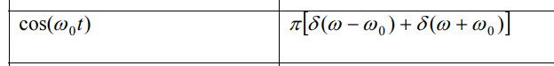

##  Ensemble average

> [[https://ece-research.unm.edu/bsanthan/ece541/stat.pdf](https://ece-research.unm.edu/bsanthan/ece541/stat.pdf)]
>
> [[https://www.nii.ac.jp/qis/first-quantum/e/forStudents/lecture/pdf/noise/chapter1.pdf](https://www.nii.ac.jp/qis/first-quantum/e/forStudents/lecture/pdf/noise/chapter1.pdf)]

- **Time average**: time-averaged quantities for the $i$-th member of the ensemble
- **Ensemble average**: ensemble-averaged quantities for all members of the ensemble at *a certain time*

> 
>
> where $\theta$ is one member of the ensemble; $p(x)dx$ is the probability that $x$ is found among $[x, x + dx]$

## autocorrelation, Stationarity & Ergodicity

### autocorrelation

> The **expectation** returns the probability-weighted average of the specific function at that specific time
> over all possible realizations of the process

### Stationarity

[[https://ece-research.unm.edu/bsanthan/ece541/station.pdf](https://ece-research.unm.edu/bsanthan/ece541/station.pdf)]

> 

### Ergodicity

***ensemble autocorrelation*** and ***temporal autocorrelation (time autocorrelation)*** 

---

##  LTI Filtering of WSS process

### mean

---

### autocorrelation

**deterministic autocorrelation function**

$$
R_{yy}(\tau) = h(\tau)*R_{xx}(\tau)*h(-\tau) =R_{xx}(\tau)*h(\tau)*h(-\tau)
$$

> why $\overline{R}_{hh}(\tau)  \overset{\Delta}{=} h(\tau)*h(-\tau)$ is autocorrelation ?  the proof is as follows:
> 
> $$\begin{align}
>\overline{R}_{hh}(\tau) &= h(\tau)*h(-\tau) \\
> &= \int_{-\infty}^{\infty}h(x)h(-(\tau - x))dx \\
> &= \int_{-\infty}^{\infty}h(x)h(-\tau + x))dx \\
> &=\int_{-\infty}^{\infty}h(x+\tau)h(x))dx
> \end{align}$$

---

### PSD

> Topic 6 Random Processes and Signals [[https://www.robots.ox.ac.uk/~dwm/Courses/2TF_2021/N6.pdf](https://www.robots.ox.ac.uk/~dwm/Courses/2TF_2021/N6.pdf)]
>
> Alan V. Oppenheim, Introduction To Communication, Control, And Signal Processing [[https://ocw.mit.edu/courses/6-011-introduction-to-communication-control-and-signal-processing-spring-2010/a6bddaee5966f6e73450e6fe79ab0566_MIT6_011S10_notes.pdf](https://ocw.mit.edu/courses/6-011-introduction-to-communication-control-and-signal-processing-spring-2010/a6bddaee5966f6e73450e6fe79ab0566_MIT6_011S10_notes.pdf)]
>
> Balu Santhanam, Probability Theory & Stochastic Process 2020: LTI Systems and Random Signals  [[https://ece-research.unm.edu/bsanthan/ece541/LTI.pdf](https://ece-research.unm.edu/bsanthan/ece541/LTI.pdf)]

---

**Time Reversal**
$$
x(-t) \overset{FT}{\longrightarrow} X(-j\omega)
$$

 if $x(t)$ is *real*, then $X(j\omega)$​ has **conjugate symmetry**
$$
X(-j\omega) = X^*(j\omega)
$$

## Derivatives of Random Processes
since $x(t)$ is stationary process, and $y(t) = \frac{dx(t)}{dt}$

Using $R_{yy}(\tau) = h(\tau)*R_{xx}(\tau)*h(-\tau)$

$$\begin{align}
R_{yy}(\tau) &= \mathcal{F}^{-1}[H(j\omega)\Phi_{xx}(j\omega)H(-j\omega)] \\
&= \mathcal{F}^{-1}[-(j\omega)^2\Phi_{xx}(j\omega)]
\end{align}$$

we obtain the autocorrelation function of the output process as
$$
R_{yy}(\tau) = -\frac{d^2}{d\tau^2}R_{xx}(\tau)
$$

> Liu Congfeng, Xidian University. *Random Signal Processing: Chapter 5 Linear System: Random Process* [[https://web.xidian.edu.cn/cfliu/files/20121125_153218.pdf](https://web.xidian.edu.cn/cfliu/files/20121125_153218.pdf)]
>
> [[https://sharif.ir/~bahram/sp4cl/PapoulisLectureSlides/lectr14.pdf](https://sharif.ir/~bahram/sp4cl/PapoulisLectureSlides/lectr14.pdf)]

## Periodogram

The periodogram is in fact the Fourier transform of the aperiodic correlation of the windowed data sequence

> 
>

### estimating continuous-time stationary random signal

The sequence $x[n]$ is typically multiplied by a *finite*-duration window $w[n]$, since the input to the DFT must be of *finite* duration. This produces the *finite*-length sequence $v[n] = w[n]x[n]$

$$\begin{align}
\hat{P}_{ss}(\Omega) &= \frac{|V(e^{j\omega})|^2}{LU} \\
&= \frac{|V(e^{j\omega})|^2}{\sum_{n=0}^{L-1}(w[n])^2} \tag{1}\\
&= \frac{L|V(e^{j\omega})|^2}{\sum_{k=0}^{L-1}(W[k])^2} \tag{2}
\end{align}$$

That is, by $(1)$
$$
\hat{P}_{ss}(\Omega) = T_s\hat{P}_{xx(\omega)} = \frac{T_s|V(e^{j\omega})|^2}{\sum_{n=0}^{L-1}(w[n])^2}=\frac{|V(e^{j\omega})|^2}{f_{res}L\sum_{n=0}^{L-1}(w[n])^2}
$$

That is, by $(2)$
$$
\hat{P}_{ss}(\Omega) = T_s\hat{P}_{xx(\omega)} = \frac{T_sL|V(e^{j\omega})|^2}{\sum_{k=0}^{L-1}(W[k])^2} = \frac{|V(e^{j\omega})|^2}{f_{res}\sum_{k=0}^{L-1}(W[k])^2}
$$

> !! *ENBW*

## Wiener-Khinchin theorem

> Norbert Wiener proved this theorem for the case of a ***deterministic function*** in 1930; Aleksandr Khinchin later formulated an analogous result for ***stationary stochastic processes*** and published that probabilistic analogue in 1934. Albert Einstein explained, without proofs, the idea in a brief two-page memo in 1914

$x(t)$, Fourier transform over a limited period of time $[-T/2, +T/2]$ , $X_T(f) = \int_{-T/2}^{T/2}x(t)e^{-j2\pi ft}dt$

With *Parseval's theorem*
$$
\int_{-T/2}^{T/2}|x(t)|^2dt = \int_{-\infty}^{\infty}|X_T(f)|^2df
$$
So that
$$
\frac{1}{T}\int_{-T/2}^{T/2}|x(t)|^2dt = \int_{-\infty}^{\infty}\frac{1}{T}|X_T(f)|^2df
$$

> where the quantity, $\frac{1}{T}|X_T(f)|^2$ can be interpreted as distribution of power in the frequency domain
>
> For each $f$ this quantity is a random variable, since it is a function of the random process $x(t)$

The power spectral density (PSD) $S_x(f )$ is defined as the limit of the expectation of the expression
above, for large $T$:
$$
S_x(f) = \lim _{T\to \infty}\mathrm{E}\left[ \frac{1}{T}|X_T(f)|^2 \right]
$$

The *Wiener-Khinchin theorem* ensures that for well-behaved *wide-sense stationary processes* the **limit exists** and is equal to the *Fourier transform of the autocorrelation*
$$\begin{align}
S_x(f) &= \int_{-\infty}^{+\infty}R_x(\tau)e^{-j2\pi f \tau}d\tau \\
R_x(\tau) &= \int_{-\infty}^{+\infty}S_x(f)e^{j2\pi f \tau}df
\end{align}$$

> Note: $S_x(f)$ in *Hz*  and inverse Fourier Transform in *Hz* ($\frac{1}{2\pi}d\omega = df$)

> [[https://www.robots.ox.ac.uk/~dwm/Courses/2TF_2011/2TF-L5.pdf](https://www.robots.ox.ac.uk/~dwm/Courses/2TF_2011/2TF-L5.pdf)]

---

**Example**

> Remember: impulse scaling
>
> 
> $$
> \cos(2\pi f_0t) \overset{\mathcal{F}}{\longrightarrow} \frac{1}{2}[\delta(f -f_0)+\delta(f+f_0)]
> $$

### Energy Signal

## Wiener Process (Brownian Motion)

> *Dennis Sun*, Introduction to Probability: Lesson 49 Brownian Motion [[https://dlsun.github.io/probability/brownian-motion.html](https://dlsun.github.io/probability/brownian-motion.html)]

*Wiener process (also called Brownian motion*) 

## reference

L.W. Couch, Digital and Analog Communication Systems, 8th Edition, 2013

Alan V Oppenheim, George C. Verghese, Signals, Systems and Inference, 1st edition

R. Ziemer and W. Tranter, Principles of Communications, Seventh Edition, 2013
