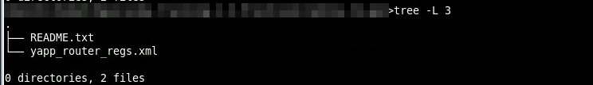
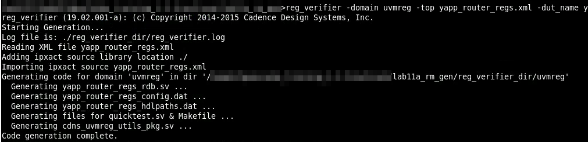
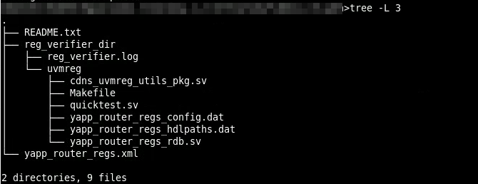
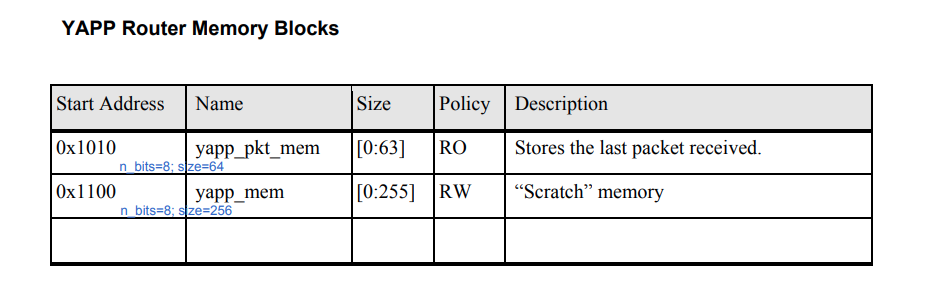
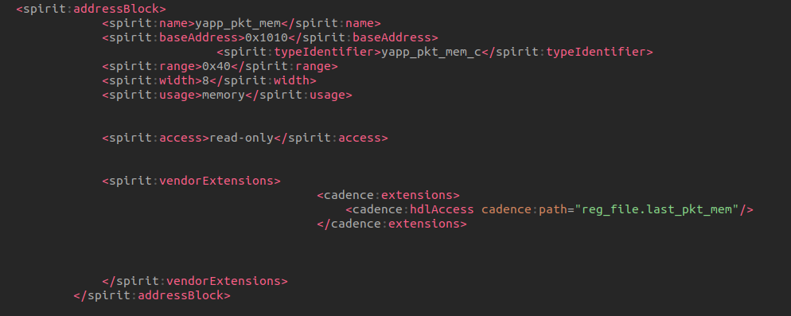
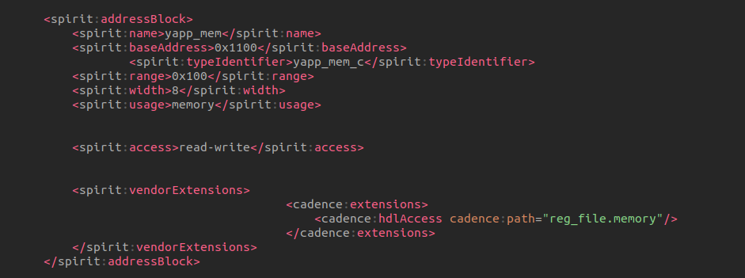
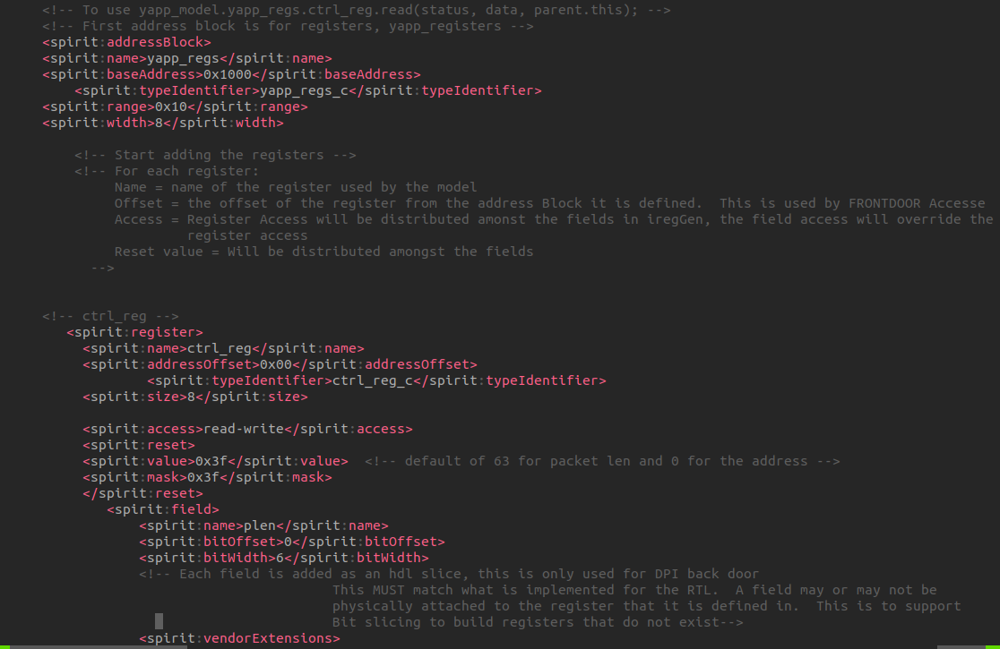
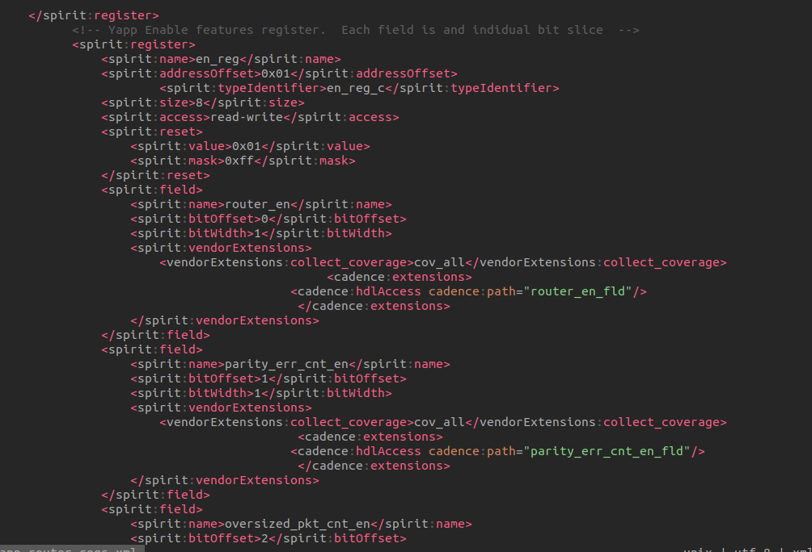

## Generation



```verilog
reg_verifier -domain uvmreg -top yapp_router_regs.xml -dut_name yapp_router_regs -out_file yapp_router_regs -cov -quicktest -pkg yapp_router_reg_pkg
```





| generated file                | description                           |
| ----------------------------- | ------------------------------------- |
| yapp_router_regs_config.dat   | Configuration information             |
| yapp_router_regs_hdlpaths.dat | Path information for backddoor access |
| yapp_router_regs_rdb.sv       | Register Model                        |
| cdns_uvmreg_utils_pkg.sv      | Cadence utility package               |
| quicktest.sv                  | UVM test to verify model              |

## Sanity Check

```bash
make run_test
```


```verilog
class yapp_router_regs_t extends cdns_uvm_reg_block;
    uvm_reg_map default_map;
    uvm_reg_map router;
    rand yapp_regs_c router_yapp_regs;
    rand yapp_mem_c router_yapp_mem;
    rand yapp_pkt_mem_c router_yapp_pkt_mem;
    ...
    virtual function void build();
        router = create_map("router", `UVM_REG_ADDR_WIDTH'h0, 1, UVM_LITTLE_ENDIAN, 1);
        default_map = router;
        ...
        //Mapping router map
        router.add_submap(router_yapp_regs.default_map, `UVM_REG_ADDR_WIDTH'h1000)
        router.add_mem(router_yapp_mem, `UVM_REG_ADDR_WIDTH'h1100);
        router.add_mem(router_yapp_pkt_mem, `UVM_REG_ADDR_WIDTH'h1010);
        ...
    endfunction
    
endclass


class qt_test extends uvm_test;
    yapp_router_regs_t model;
    ...
    task run_phase(uvm_phase phase);
        ...
        model.print();
        model.default_map.print();
        model.router_yapp_regs.default_map.print();
    endtask
    ...
endclass
```

**yapp_mem_c**
```verilog
class yapp_mem_c extends uvm_mem;                                                                                                                                                                                                                                
  `uvm_object_utils(yapp_mem_c)                                                                                                       
                                                                                                                               
  function new(input string name="router_yapp_mem");                                                                                 
    super.new(name, 'h100, 8, "RW", UVM_NO_COVERAGE);                                                                                 
  endfunction                                                                                                                            
endclass
```

**yapp_pkt_mem_c**

```verilog
class yapp_pkt_mem_c extends uvm_mem;                                                                                                                                                                                                                                      
  `uvm_object_utils(yapp_pkt_mem_c)                                                                                                                                                                                            
  function new(input string name="router_yapp_pkt_mem");                                                                             
    super.new(name, 'h40, 8, "RO", UVM_NO_COVERAGE);                                                                                 
  endfunction
    
endclass
```

**yapp_regs_c**

```verilog
class yapp_regs_c extends cdns_uvm_reg_block;
  `uvm_object_utils(yapp_regs_c)
  rand addr0_cnt_reg_c addr0_cnt_reg;
  rand addr1_cnt_reg_c addr1_cnt_reg;
  rand addr2_cnt_reg_c addr2_cnt_reg;
  rand illegal_addr_cnt_reg_c addr3_cnt_reg;
  rand ctrl_reg_c ctrl_reg;
  rand en_reg_c en_reg;
  rand mem_size_reg_c mem_size_reg;
  rand oversized_pkt_cnt_reg_c oversized_pkt_cnt_reg;
  rand parity_err_cnt_reg_c parity_err_cnt_reg; 
  virtual function void build();
    uvm_reg  reg_set[$];
    default_map = create_map(get_name(), `UVM_REG_ADDR_WIDTH'h1000, 1, UVM_LITTLE_ENDIAN, 1);                                         
    begin
       uvm_reg_config_ta ta = get_reg_config("yapp_router_regs.router_yapp_regs");
       build_uvm_regs(default_map, this, null, ta, reg_se);
    end                                                                                                                               
    if(! $cast(addr0_cnt_reg, reg_set[0]))
      `uvm_error("UVM_REG", "addr0_cnt_reg register casting error")
    if(! $cast(addr1_cnt_reg, reg_set[1]))
      `uvm_error("UVM_REG", "addr1_cnt_reg register casting error")
    if(! $cast(addr2_cnt_reg, reg_set[2]))
      `uvm_error("UVM_REG", "addr2_cnt_reg register casting error")
    if(! $cast(addr3_cnt_reg, reg_set[3]))
      `uvm_error("UVM_REG", "addr3_cnt_reg register casting error")
    if(! $cast(ctrl_reg, reg_set[4]))
      `uvm_error("UVM_REG", "ctrl_reg register casting error")
    if(! $cast(en_reg, reg_set[5]))
      `uvm_error("UVM_REG", "en_reg register casting error")
    if(! $cast(mem_size_reg, reg_set[6]))
      `uvm_error("UVM_REG", "mem_size_reg register casting error")
    if(! $cast(oversized_pkt_cnt_reg, reg_set[7]))
      `uvm_error("UVM_REG", "oversized_pkt_cnt_reg register casting error")
    if(! $cast(parity_err_cnt_reg, reg_set[8]))
      `uvm_error("UVM_REG", "parity_err_cnt_reg register casting error")
  endfunction   
                                                 
  function new(input string name="router_yapp_regs");
    super.new(name, UVM_NO_COVERAGE);
  endfunction  
endclass 
```

> ```verilog
> class uvm_reg_map extends uvm_object;
> // Function: add_submap
> //
> // Add an address map
> //
> // Add the specified address map instance to this address map.
> // The address map is located at the specified base address.
> // The number of consecutive physical addresses occupied by the submap
> // depends on the number of bytes in the physical interface
> // that corresponds to the submap,
> // the number of addresses used in the submap and
> // the number of bytes in the
> // physical interface corresponding to this address map.
> //
> // An address map may be added to multiple address maps
> // if it is accessible from multiple physical interfaces.
> // An address map may only be added to an address map
> // in the grand-parent block of the address submap.
> //
> extern virtual function void add_submap (uvm_reg_map    child_map,
>                                        uvm_reg_addr_t offset);
> 
> 
> // Function: add_mem
> //
> // Add a memory
> //
> // Add the specified memory instance to this address map.
> // The memory is located at the specified base address and has the
> // specified access rights ("RW", "RO" or "WO").
> // The number of consecutive physical addresses occupied by the memory
> // depends on the width and size of the memory and the number of bytes in the
> // physical interface corresponding to this address map.
> //
> // If ~unmapped~ is TRUE, the memory does not occupy any
> // physical addresses and the base address is ignored.
> // Unmapped memories require a user-defined ~frontdoor~ to be specified.
> //
> // A memory may be added to multiple address maps
> // if it is accessible from multiple physical interfaces.
> // A memory may only be added to an address map whose parent block
> // is the same as the memory's parent block.
> //
> extern virtual function void add_mem (uvm_mem        mem,
>                                     uvm_reg_addr_t offset,
>                                     string         rights = "RW",
>                                     bit            unmapped=0,
>                                     uvm_reg_frontdoor frontdoor=null);
>     
>     
> endclass: uvm_reg_map    
> ```


### register model print

> // test run_phase
>
> `model.default_map.print();`

```
----------------------------------------------------------------------------------------------------------------------------            
Name                             Type                     Size  Value                                                                   
----------------------------------------------------------------------------------------------------------------------------            
model                            yapp_router_regs_t       -     @3724                                                                   
  router_yapp_regs               yapp_regs_c              -     @3792                                                                   
    addr0_cnt_reg                addr0_cnt_reg_c          -     @3827                                                                   
      addr0_cnt_reg_fld          uvm_reg_field            ...    RO addr0_cnt_reg[7:0]=8'h00                                            
    addr1_cnt_reg                addr1_cnt_reg_c          -     @3839                                                                   
      addr1_cnt_reg_fld          uvm_reg_field            ...    RO addr1_cnt_reg[7:0]=8'h00                                            
    addr2_cnt_reg                addr2_cnt_reg_c          -     @3857                                                                   
      addr2_cnt_reg_fld          uvm_reg_field            ...    RO addr2_cnt_reg[7:0]=8'h00                                            
    addr3_cnt_reg                illegal_addr_cnt_reg_c   -     @3874                                                                   
      addr3_cnt_reg_fld          uvm_reg_field            ...    RO addr3_cnt_reg[7:0]=8'h00                                            
    ctrl_reg                     ctrl_reg_c               -     @3891                                                                   
      plen                       uvm_reg_field            ...    RW ctrl_reg[5:0]=6'h3f                                                 
      rsvd_0                     uvm_reg_field            ...    RW ctrl_reg[7:6]=2'h0                                                  
    en_reg                       en_reg_c                 -     @3908                                                                   
      router_en                  uvm_reg_field            ...    RW en_reg[0:0]=1'h1                                                    
      parity_err_cnt_en          uvm_reg_field            ...    RW en_reg[1:1]=1'h0                                                    
      oversized_pkt_cnt_en       uvm_reg_field            ...    RW en_reg[2:2]=1'h0                                                    
      rsvd_0                     uvm_reg_field            ...    RW en_reg[3:3]=1'h0                                                    
      addr0_cnt_en               uvm_reg_field            ...    RW en_reg[4:4]=1'h0                                                    
      addr1_cnt_en               uvm_reg_field            ...    RW en_reg[5:5]=1'h0                                                    
      addr2_cnt_en               uvm_reg_field            ...    RW en_reg[6:6]=1'h0                                                    
      addr3_cnt_en               uvm_reg_field            ...    RW en_reg[7:7]=1'h0                                                    
    mem_size_reg                 mem_size_reg_c           -     @3928                                                                   
      mem_size_reg_fld           uvm_reg_field            ...    RO mem_size_reg[7:0]=8'h00                                             
    oversized_pkt_cnt_reg        oversized_pkt_cnt_reg_c  -     @3966                                                                   
      oversized_pkt_cnt_reg_fld  uvm_reg_field            ...    RO oversized_pkt_cnt_reg[7:0]=8'h00                                    
    parity_err_cnt_reg           parity_err_cnt_reg_c     -     @3983                                                                   
      parity_err_cnt_reg_fld     uvm_reg_field            ...    RO parity_err_cnt_reg[7:0]=8'h00                                       
  router_yapp_mem                yapp_mem_c               -     @3757                                                                   
    n_bits                       integral                 32    'd8                                                                     
    size                         integral                 32    'd256                                                                   
  router_yapp_pkt_mem            yapp_pkt_mem_c           -     @3779                                                                   
    n_bits                       integral                 32    'd8                                                                     
    size                         integral                 32    'd64
    router                       uvm_reg_map              0     id=@3737 seqr=HI0.sqr offset=0x0 size=0x1200 baseaddr=0x0               
      router_yapp_regs           uvm_reg_map              0     id=@3816 seqr=HI0.sqr offset=0x1000 size=0x5 baseaddr=0x1000            
----------------------------------------------------------------------------------------------------------------------------
```

### address map print

> // test run_phase
>
> `model.router_yapp_regs.default_map.print();`

```
---------------------------------------------------------------------------
Name                       Type                     Size  Value
---------------------------------------------------------------------------
router                     uvm_reg_map              -     @3737
  endian                                            ...   UVM_LITTLE_ENDIAN
  effective sequencer      uvm_sequencer            ...   HI0.sqr
  router_yapp_mem          yapp_mem_c               ...   @3757 +'h1100
  router_yapp_pkt_mem      yapp_pkt_mem_c           ...   @3779 +'h1010
  router_yapp_regs         uvm_reg_map              -     @3816
    endian                                          ...   UVM_LITTLE_ENDIAN
    effective sequencer    uvm_sequencer            ...   HI0.sqr
    addr0_cnt_reg          addr0_cnt_reg_c          ...   @3827 +'h1009
    addr1_cnt_reg          addr1_cnt_reg_c          ...   @3839 +'h100a
    addr2_cnt_reg          addr2_cnt_reg_c          ...   @3857 +'h100b
    addr3_cnt_reg          illegal_addr_cnt_reg_c   ...   @3874 +'h1006
    ctrl_reg               ctrl_reg_c               ...   @3891 +'h1000
    en_reg                 en_reg_c                 ...   @3908 +'h1001
    mem_size_reg           mem_size_reg_c           ...   @3928 +'h100d
    oversized_pkt_cnt_reg  oversized_pkt_cnt_reg_c  ...   @3966 +'h1005
    parity_err_cnt_reg     parity_err_cnt_reg_c     ...   @3983 +'h1004
---------------------------------------------------------------------------

```

### submap print

> // test run_phase
>
> `model.router_yapp_regs.default_map.print();`

```verilog
-------------------------------------------------------------------------
Name                     Type                     Size  Value
-------------------------------------------------------------------------
router_yapp_regs         uvm_reg_map              -     @3814
  endian                                          ...   UVM_LITTLE_ENDIAN
  effective sequencer    uvm_sequencer            ...   HI0.sqr
  addr0_cnt_reg          addr0_cnt_reg_c          ...   @3825 +'h1009
  addr1_cnt_reg          addr1_cnt_reg_c          ...   @3837 +'h100a
  addr2_cnt_reg          addr2_cnt_reg_c          ...   @3855 +'h100b
  addr3_cnt_reg          illegal_addr_cnt_reg_c   ...   @3872 +'h1006
  ctrl_reg               ctrl_reg_c               ...   @3889 +'h1000
  en_reg                 en_reg_c                 ...   @3906 +'h1001
  mem_size_reg           mem_size_reg_c           ...   @3926 +'h100d
  oversized_pkt_cnt_reg  oversized_pkt_cnt_reg_c  ...   @3964 +'h1005
  parity_err_cnt_reg     parity_err_cnt_reg_c     ...   @3981 +'h1004
-------------------------------------------------------------------------
```


## cdns_uvmreg_utils_pkg

### uvm_reg_field_config_t

```verilog
   typedef struct  {                                                                         
        string         name; 
        int unsigned   size; 
        int unsigned   lsb_pos;
        string         access;
        bit            volatile;
        uvm_reg_data_t reset;
        bit            has_reset;
        bit            is_rand; 
        bit            individually_accessible;
      } uvm_reg_field_config_t; 
```

### uvm_reg_config_t

```verilog
   typedef struct  {
        string          reg_type_name;
        string          configUID;
        string          name;
        uvm_reg_addr_t  offset;
        int unsigned    size_bytes;
        int unsigned    addr_bits;
        string          access;
        int             is_array;
        string          range;
      } uvm_reg_config_t; 
```

### uvm_blk_config_t

```verilog
   typedef struct {                             
        uvm_reg_addr_t   base_addr;
        int              n_bytes;
        uvm_endianness_e endianess;
        bit              byte_addr_t;
          } uvm_blk_config_t; 
```

### uvm_reg_field_config_ta

```verilog
typedef uvm_reg_field_config_t uvm_reg_field_config_ta[];
```

### uvm_reg_field_config_tq

```verilog
typedef uvm_reg_field_config_ta uvm_reg_field_config_tq[string];
```

### build_uvm_regs


```verilog
function automatic void build_uvm_regs(uvm_reg_map map, uvm_reg_block pblock, uvm_reg_file pfile, ref uvm_reg_config_t f_props[], output uvm_reg out[$]);
   foreach(f_props[idx]) begin        
      uvm_reg_config_t f= f_props[idx];
      if(f.is_array == 0) begin                  
         cdns_uvm_reg reg_t;
         uvm_object obj = factory.create(f.reg_type_name, pfile!=null ? pfile.get_full_name(): "",f.name);
         assert($cast(reg_t,obj));            
         reg_t.configure(pblock, pfile, "");
         reg_t.setconfigUID(f.configUID);       
         reg_t.build();
         // !!! f.offset !!!
         map.add_reg(reg_t, f.offset, f.access);            
         out.push_back(reg_t);
         // !!! print the offset
          `uvm_info("[build_uvm_regs]", $sformatf("### %s offset: %0x", f.reg_type_name, f.offset), UVM_LOW)
      end
       
      else if (f.is_array == 1) begin             
         int unsigned array_offset;               
         string range_str = f.range;        
         int indx, arr_idx = 0;                 
         int range_arr [];                               
         int arr_size = 1;                        
```

> - dynamic array
>   - need `new[size]`
> - queue
>   - DONT need `new`

```
UVM_INFO ./cdns_uvmreg_utils_pkg.sv(322) @ 0: reporter [[build_uvm_regs]] ### addr0_cnt_reg_c offset: 9                                 
UVM_INFO ./cdns_uvmreg_utils_pkg.sv(322) @ 0: reporter [[build_uvm_regs]] ### addr1_cnt_reg_c offset: a                                 
UVM_INFO ./cdns_uvmreg_utils_pkg.sv(322) @ 0: reporter [[build_uvm_regs]] ### addr2_cnt_reg_c offset: b                                 
UVM_INFO ./cdns_uvmreg_utils_pkg.sv(322) @ 0: reporter [[build_uvm_regs]] ### illegal_addr_cnt_reg_c offset: 6                          
UVM_INFO ./cdns_uvmreg_utils_pkg.sv(322) @ 0: reporter [[build_uvm_regs]] ### ctrl_reg_c offset: 0                                      
UVM_INFO ./cdns_uvmreg_utils_pkg.sv(322) @ 0: reporter [[build_uvm_regs]] ### en_reg_c offset: 1                                        
UVM_INFO ./cdns_uvmreg_utils_pkg.sv(322) @ 0: reporter [[build_uvm_regs]] ### mem_size_reg_c offset: d                                  
UVM_INFO ./cdns_uvmreg_utils_pkg.sv(322) @ 0: reporter [[build_uvm_regs]] ### oversized_pkt_cnt_reg_c offset: 5                         
UVM_INFO ./cdns_uvmreg_utils_pkg.sv(322) @ 0: reporter [[build_uvm_regs]] ### parity_err_cnt_reg_c offset: 4
```

> In submap, offset is **0-based**,  `router.add_submap(router_yapp_regs.default_map, ``UVM_REG_ADDR_WIDTH'h1000)`  configure base addr for submap

## IP-XACT XML : yapp_router_regs.xml



### memory

#### yapp_pkt_mem



#### yapp_mem



### register


### yapp_regs

#### ctrl_reg



#### en_reg


